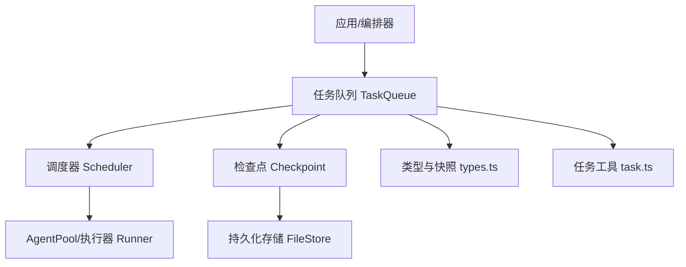
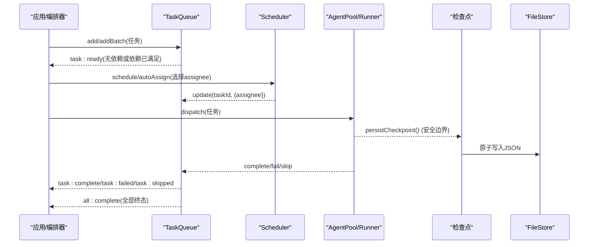
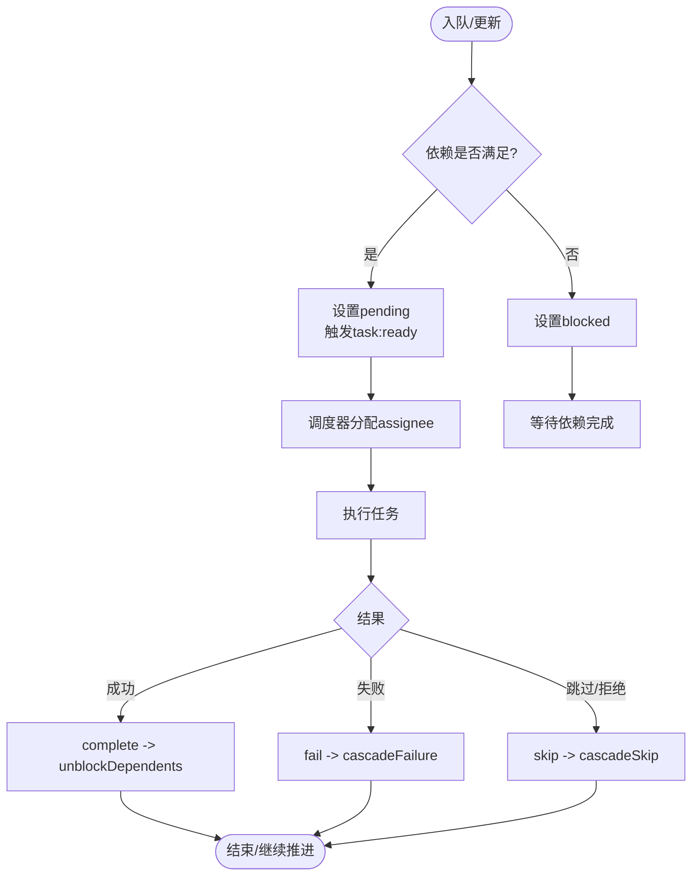
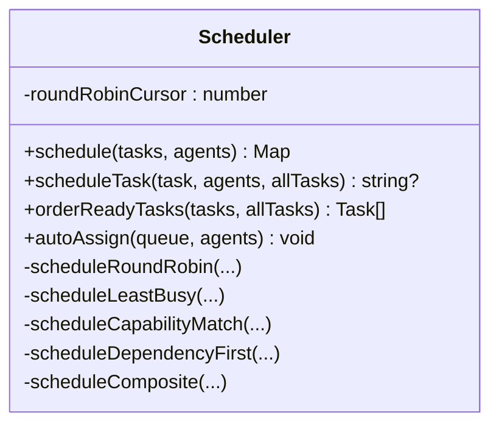
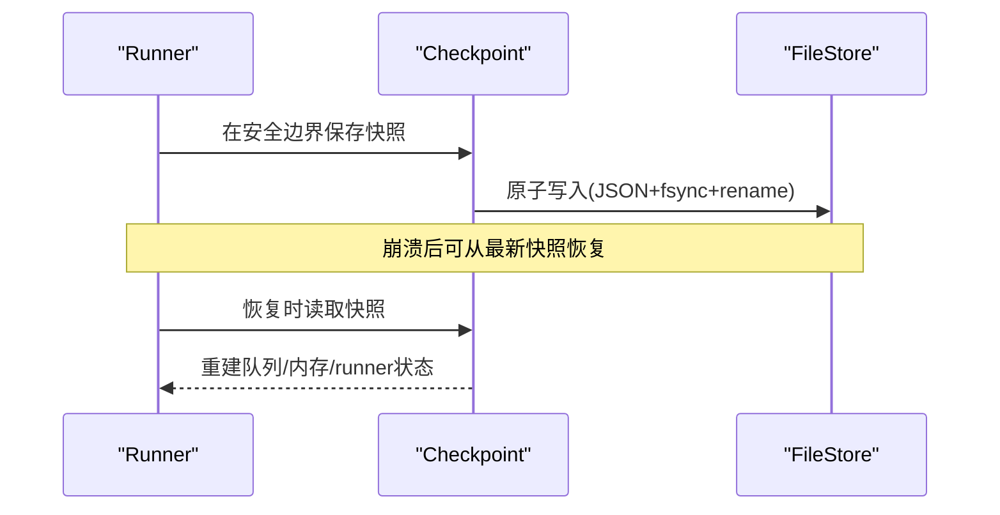
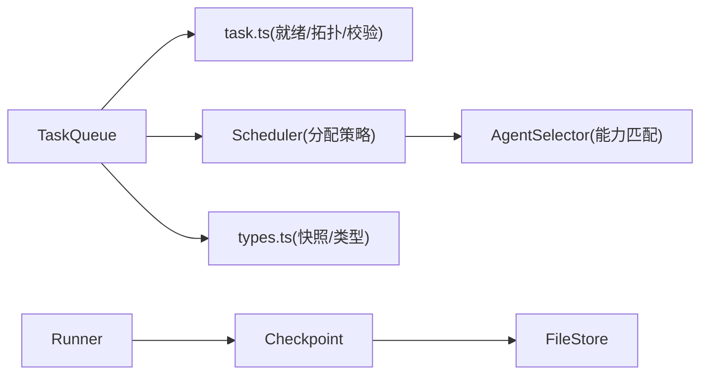

# 任务队列

<cite>
**本文引用的文件**
- [README.md](file://README.md)
- [任务调度与派发（task-scheduling.md）](file://docs/task-scheduling.md)
- [检查点与恢复（checkpoint.md）](file://docs/checkpoint.md)
- [类型定义（types.ts）](file://packages/core/src/types.ts)
- [任务队列实现（queue.ts）](file://packages/core/src/task/queue.ts)
- [任务工具函数（task.ts）](file://packages/core/src/task/task.ts)
- [调度器（scheduler.ts）](file://packages/core/src/orchestrator/scheduler.ts)
- [文件存储（file-store.ts）](file://packages/core/src/memory/file-store.ts)
- [代理执行器（runner.ts）](file://packages/core/src/agent/runner.ts)
</cite>

## 目录
1. [简介](#简介)
2. [项目结构](#项目结构)
3. [核心组件](#核心组件)
4. [架构总览](#架构总览)
5. [详细组件分析](#详细组件分析)
6. [依赖关系分析](#依赖关系分析)
7. [性能考虑](#性能考虑)
8. [故障排查指南](#故障排查指南)
9. [结论](#结论)
10. [附录：使用示例与配置建议](#附录使用示例与配置建议)

## 简介
本文件系统性介绍 Open Multi-Agent 的任务队列管理系统，覆盖数据结构、索引与查询优化、入队出队流程、优先级与并发控制、资源管理、状态管理与持久化、调度策略与算法、性能优化技术、监控与调试方法，以及不同场景下的配置与优化实践。目标是帮助读者在不深入源码的情况下，也能准确理解并高效使用该系统的任务队列能力。

## 项目结构
Open Multi-Agent 的核心任务队列位于 packages/core 中，围绕“事件驱动 + 拓扑依赖”的 DAG 执行模型构建。关键模块包括：
- 任务队列：TaskQueue，负责任务生命周期、依赖解析、事件发布、快照与恢复。
- 任务工具：task.ts，提供任务创建、就绪判定、拓扑排序与依赖校验等纯函数。
- 调度器：Scheduler，提供多种分配策略（轮询、最少忙碌、能力匹配、依赖优先、复合）。
- 类型系统：types.ts，统一描述任务、队列快照、检查点、审批与恢复等数据结构。
- 持久化：FileStore，基于文件的原子写入 MemoryStore，用于检查点与共享内存。
- 执行器：runner.ts，在任务执行过程中进行中间态检查点保存与恢复。
- 文档：task-scheduling.md、checkpoint.md，说明调度与检查点机制。

图表来源
- [任务队列实现（queue.ts）:1-120](file://packages/core/src/task/queue.ts#L1-L120)
- [调度器（scheduler.ts）:1-120](file://packages/core/src/orchestrator/scheduler.ts#L1-L120)
- [文件存储（file-store.ts）:1-54](file://packages/core/src/memory/file-store.ts#L1-L54)
- [类型定义（types.ts）:2339-2370](file://packages/core/src/types.ts#L2339-L2370)
- [任务工具函数（task.ts）:1-120](file://packages/core/src/task/task.ts#L1-L120)

章节来源
- [README.md:138-157](file://README.md#L138-L157)
- [任务调度与派发（task-scheduling.md）:1-26](file://docs/task-scheduling.md#L1-L26)

## 核心组件
- 任务队列（TaskQueue）
  - 维护任务集合 Map<id, Task>，按状态分区（pending/in_progress/completed/failed/blocked/skipped）。
  - 支持批量入队、单条入队；自动根据依赖将任务置为 blocked 或 pending，并在依赖完成时触发 task:ready。
  - 提供 complete/fail/skip 等终态操作，级联传播失败/跳过，并在全部完成后触发 all:complete。
  - 提供快照/恢复、计划补丁（PlanPatch）与版本化修订（PlanRevision），支持追加式修复与回滚。
- 任务工具（task.ts）
  - createTask：生成带时间戳、ID、默认状态的 Task。
  - isTaskReady：判断任务是否可启动（依赖全部 completed）。
  - getTaskDependencyOrder：Kahn 算法拓扑排序。
  - validateTaskDependencies：检测未知依赖、自依赖与环。
- 调度器（Scheduler）
  - 五种策略：round-robin、least-busy、capability-match、dependency-first、composite。
  - 支持批量 schedule 与单任务 scheduleTask，以及 ready 集排序 orderReadyTasks。
  - autoAssign 直接对 TaskQueue 更新 assignee。
- 类型与快照（types.ts）
  - TaskStatus、TaskQueueSnapshotV1/V2、CheckpointSnapshot*、CompletedTaskCheckpoint、InFlightTaskCheckpoint 等。
  - OrchestratorConfig.schedulingStrategy/Weights、strictAssignees 等。
- 持久化（FileStore）
  - 单 JSON 文件 + 内存镜像，原子写入（临时文件 → fsync → rename），保证一致性。
- 执行器（runner.ts）
  - 在安全边界（如 tool 调用提交后）保存检查点，支持中断恢复与工具结果重放。

章节来源
- [任务队列实现（queue.ts）:1-120](file://packages/core/src/task/queue.ts#L1-L120)
- [任务工具函数（task.ts）:1-120](file://packages/core/src/task/task.ts#L1-L120)
- [调度器（scheduler.ts）:1-120](file://packages/core/src/orchestrator/scheduler.ts#L1-L120)
- [类型定义（types.ts）:2339-2370](file://packages/core/src/types.ts#L2339-L2370)
- [文件存储（file-store.ts）:1-54](file://packages/core/src/memory/file-store.ts#L1-L54)
- [代理执行器（runner.ts）:902-1076](file://packages/core/src/agent/runner.ts#L902-L1076)

## 架构总览
下图展示了从任务入队到执行、再到检查点持久化的完整链路，以及事件驱动的调度流程。

图表来源
- [任务队列实现（queue.ts）:85-105](file://packages/core/src/task/queue.ts#L85-L105)
- [任务队列实现（queue.ts）:433-480](file://packages/core/src/task/queue.ts#L433-L480)
- [调度器（scheduler.ts）:191-251](file://packages/core/src/orchestrator/scheduler.ts#L191-L251)
- [代理执行器（runner.ts）:916-1076](file://packages/core/src/agent/runner.ts#L916-L1076)
- [文件存储（file-store.ts）:1-54](file://packages/core/src/memory/file-store.ts#L1-L54)

## 详细组件分析

### 任务队列（TaskQueue）
- 数据结构
  - 内部 Map<string, Task> 存储所有任务；通过遍历与过滤维护各状态分区。
  - 快照包含 tasks 列表与各状态 ID 数组，便于序列化与恢复。
- 入队与初始状态
  - add/addBatch：若存在未满足依赖则立即标记 blocked，否则保持 pending 并触发 task:ready。
- 出队与调度
  - next/nextAvailable：供外部调度器挑选待执行任务；结合 Scheduler 的 assignee 分配。
- 完成/失败/跳过与级联
  - complete：标记 completed，触发 task:complete，unblockDependents 提升新就绪任务。
  - fail：标记 failed，触发 task:failed，cascadeFailure 级联下游失败。
  - skip：标记 skipped，触发 task:skipped，cascadeSkip 级联下游跳过。
  - skipRemaining：一次性跳过所有非终态任务（需先排空 in-flight）。
- 计划补丁与版本
  - applyPlanPatch：追加式修改（新增任务、重新指派、覆盖跳过），记录 PlanRevision，支持 restorePlanSnapshot 回滚。
  - publishPlanRevision：在持久化成功后发布被跳过的任务与新就绪任务事件。
- 查询与进度
  - list/get/getByStatus/isComplete/getProgress：提供全量与分状态查询及进度统计。

图表来源
- [任务队列实现（queue.ts）:85-105](file://packages/core/src/task/queue.ts#L85-L105)
- [任务队列实现（queue.ts）:433-480](file://packages/core/src/task/queue.ts#L433-L480)
- [任务工具函数（task.ts）:98-114](file://packages/core/src/task/task.ts#L98-L114)

章节来源
- [任务队列实现（queue.ts）:1-120](file://packages/core/src/task/queue.ts#L1-L120)
- [任务队列实现（queue.ts）:172-396](file://packages/core/src/task/queue.ts#L172-L396)
- [任务队列实现（queue.ts）:433-545](file://packages/core/src/task/queue.ts#L433-L545)
- [任务队列实现（queue.ts）:557-667](file://packages/core/src/task/queue.ts#L557-L667)
- [任务工具函数（task.ts）:98-182](file://packages/core/src/task/task.ts#L98-L182)

### 调度器（Scheduler）
- 策略概览
  - round-robin：按代理顺序循环分配，维护滚动游标。
  - least-busy：选择当前 in_progress 最少的代理，避免热点。
  - capability-match：基于 AgentSelector 的能力/关键词评分，最高分胜出；零分回退到轮询。
  - dependency-first：优先处理能解锁最多下游任务的“关键路径”任务。
  - composite：综合“关键性 × fitWeight × score + loadWeight × (1 - normalizedLoad)”打分。
- 接口
  - schedule：批量返回 taskId→agentName 映射。
  - scheduleTask：针对单个 ready 任务分配。
  - orderReadyTasks：对 ready 集按依赖关键性排序（仅依赖相关策略生效）。
  - autoAssign：直接对 TaskQueue 更新 assignee。
- 约束与错误
  - 显式任务要求必须满足，否则抛出 NO_ELIGIBLE_AGENT。
  - composite 权重需有限且非负，不能同时为零。

图表来源
- [调度器（scheduler.ts）:142-292](file://packages/core/src/orchestrator/scheduler.ts#L142-L292)
- [调度器（scheduler.ts）:305-508](file://packages/core/src/orchestrator/scheduler.ts#L305-L508)

章节来源
- [调度器（scheduler.ts）:1-120](file://packages/core/src/orchestrator/scheduler.ts#L1-L120)
- [调度器（scheduler.ts）:191-251](file://packages/core/src/orchestrator/scheduler.ts#L191-L251)
- [调度器（scheduler.ts）:305-508](file://packages/core/src/orchestrator/scheduler.ts#L305-L508)

### 检查点与恢复（Checkpoint & Restore）
- 保存时机
  - 在内置 LLM runner 的安全边界（如 tool 调用提交后）与每个任务完成后保存检查点。
  - 支持“最佳努力”写入：普通写入失败不中断运行，但挂起（approval）必须严格保存。
- 保存内容
  - 执行身份（runId、attempt、trace 信息）、任务队列快照、共享内存快照、已完成任务结果、进行中 runner 状态（对话、消息、turns、token 用量、tool 调用记录、下一阶段等）、审批延续状态。
- 恢复行为
  - 重建队列与共享内存，跳过已完成任务，重放已提交的 tool 结果，保守执行缺失结果的调用。
  - runTeam 恢复会重新运行协调器合成，以得到最终答案。
- 存储后端
  - FileStore：单 JSON 文件 + 内存镜像，原子写入（临时文件 → fsync → rename），进程内并发安全。
  - 可与 InMemoryStore 搭配：热路径用内存，检查点落盘。

图表来源
- [代理执行器（runner.ts）:916-1076](file://packages/core/src/agent/runner.ts#L916-L1076)
- [文件存储（file-store.ts）:1-54](file://packages/core/src/memory/file-store.ts#L1-L54)
- [检查点与恢复（checkpoint.md）:109-160](file://docs/checkpoint.md#L109-L160)

章节来源
- [检查点与恢复（checkpoint.md）:1-160](file://docs/checkpoint.md#L1-L160)
- [检查点与恢复（checkpoint.md）:172-249](file://docs/checkpoint.md#L172-L249)
- [代理执行器（runner.ts）:916-1076](file://packages/core/src/agent/runner.ts#L916-L1076)
- [文件存储（file-store.ts）:1-54](file://packages/core/src/memory/file-store.ts#L1-L54)

### 任务数据模型与快照
- 任务状态：pending、in_progress、completed、failed、blocked、skipped。
- 队列快照：包含 tasks 列表与各状态 ID 数组，v2 增加 planRevision 与 planRevisions。
- 检查点快照：包含 mode、createdAt、metadata、goal、queue、sharedMemory、messageBus、turnCount、completedTaskResults 等。
- 进行中任务检查点：phase、conversationMessages、messages、tokenUsage、toolCalls、turns、pendingToolCalls 等。

章节来源
- [类型定义（types.ts）:2003-2017](file://packages/core/src/types.ts#L2003-L2017)
- [类型定义（types.ts）:2453-2468](file://packages/core/src/types.ts#L2453-L2468)
- [类型定义（types.ts）:2532-2548](file://packages/core/src/types.ts#L2532-L2548)
- [类型定义（types.ts）:2504-2530](file://packages/core/src/types.ts#L2504-L2530)

## 依赖关系分析
- 耦合关系
  - TaskQueue 依赖 task.ts 的纯函数进行就绪判定与拓扑排序，降低状态机复杂度。
  - Scheduler 依赖 AgentSelector（在 orchestrator 包内）进行能力匹配与评分，并通过 autoAssign 直接更新 TaskQueue。
  - runner.ts 在任务执行过程中调用检查点保存，FileStore 提供原子持久化。
- 外部依赖
  - Node 内置 crypto/fs/promises/path，无第三方运行时依赖。
- 潜在循环
  - 通过 validateTaskDependencies 检测环，防止死锁。

图表来源
- [任务队列实现（queue.ts）:1-120](file://packages/core/src/task/queue.ts#L1-L120)
- [任务工具函数（task.ts）:98-182](file://packages/core/src/task/task.ts#L98-L182)
- [调度器（scheduler.ts）:191-251](file://packages/core/src/orchestrator/scheduler.ts#L191-L251)
- [代理执行器（runner.ts）:916-1076](file://packages/core/src/agent/runner.ts#L916-L1076)
- [文件存储（file-store.ts）:1-54](file://packages/core/src/memory/file-store.ts#L1-L54)
- [类型定义（types.ts）:2339-2370](file://packages/core/src/types.ts#L2339-L2370)

章节来源
- [任务工具函数（task.ts）:188-262](file://packages/core/src/task/task.ts#L188-L262)
- [任务队列实现（queue.ts）:172-396](file://packages/core/src/task/queue.ts#L172-L396)

## 性能考虑
- 批量操作
  - addBatch：顺序插入并即时评估依赖，适合预排序后批量入队。
  - schedule/autoAssign：批量计算分配映射，减少多次状态切换。
- 缓存机制
  - 就绪判定传入 pre-built Map<Task.id, Task>，将 O(n²) 降为 O(n)。
  - unblockDependents 一次构建任务表，避免重复扫描。
- 内存管理
  - 快照按需生成，避免频繁序列化开销。
  - FileStore 使用内存镜像 Map，读路径走内存，写路径原子落盘。
- 调度优化
  - dependency-first/composite 提前按关键性排序，减少无效分配。
  - least-busy 基于 in_progress 计数做负载均衡，避免热点。
- 批处理与事件驱动
  - 事件驱动执行：下游任务在依赖满足后立即开始，不阻塞无关分支。
  - 计划补丁追加式更新，避免全局重算。

[本节为通用性能指导，不直接分析具体代码行]

## 故障排查指南
- 常见问题定位
  - 任务卡住：检查 dependsOn 是否存在未知 ID、自依赖或环；使用 validateTaskDependencies。
  - 无法分配：确认任务 requires 与代理 capabilities/backend/provider 是否匹配；查看 NO_ELIGIBLE_AGENT 错误。
  - 检查点写入失败：监听 onProgress 中的 checkpoint_save_failed，确认存储可用性与权限。
  - 恢复异常：确认 store 键一致、runId 不冲突；检查 v1/v2/v3 兼容性与 schema 差异。
- 诊断手段
  - 使用 queue.getProgress() 获取各状态数量，快速定位瓶颈。
  - 通过 TaskQueueSnapshot 与 CompletedTaskCheckpoint 分析历史状态与结果。
  - 借助 FileStore 原子写入特性，确保不会读到半写文件。

章节来源
- [任务工具函数（task.ts）:188-262](file://packages/core/src/task/task.ts#L188-L262)
- [调度器（scheduler.ts）:546-564](file://packages/core/src/orchestrator/scheduler.ts#L546-L564)
- [检查点与恢复（checkpoint.md）:154-170](file://docs/checkpoint.md#L154-L170)
- [任务队列实现（queue.ts）:619-667](file://packages/core/src/task/queue.ts#L619-L667)

## 结论
Open Multi-Agent 的任务队列以事件驱动与拓扑依赖为核心，配合多策略调度器与健壮的检查点机制，提供了高可靠、可扩展、可观测的多智能体任务执行能力。通过合理的策略选择、批量操作与持久化配置，可在复杂 DAG 场景下获得稳定高效的执行体验。

[本节为总结性内容，不直接分析具体代码行]

## 附录：使用示例与配置建议
- 基本用法
  - 创建团队与任务，启用检查点并使用 FileStore 持久化。
  - 参考：[检查点与恢复（checkpoint.md）:11-68](file://docs/checkpoint.md#L11-L68)
- 调度策略选择
  - 可互换代理：round-robin；时长不均：least-busy；角色明确：capability-match；强依赖图：dependency-first；综合最优：composite。
  - 参考：[任务调度与派发（task-scheduling.md）:98-133](file://docs/task-scheduling.md#L98-L133)
- 并发与资源管理
  - 通过 AgentPool 信号量控制并发；预算耗尽时停止新任务，已有任务继续结算。
  - 参考：[任务调度与派发（task-scheduling.md）:1-26](file://docs/task-scheduling.md#L1-L26)
- 恢复与一致性
  - 恢复时跳过已完成任务，重放已提交工具结果，保守执行缺失结果；runTeam 恢复重新合成。
  - 参考：[检查点与恢复（checkpoint.md）:74-107](file://docs/checkpoint.md#L74-L107)
- 监控与调试
  - 使用 onProgress 监听 checkpoint_save_failed 等事件；通过 queue.getProgress() 观察状态分布。
  - 参考：[检查点与恢复（checkpoint.md）:154-170](file://docs/checkpoint.md#L154-L170)
  - 参考：[任务队列实现（queue.ts）:619-667](file://packages/core/src/task/queue.ts#L619-L667)

章节来源
- [检查点与恢复（checkpoint.md）:11-107](file://docs/checkpoint.md#L11-L107)
- [任务调度与派发（task-scheduling.md）:1-26](file://docs/task-scheduling.md#L1-L26)
- [任务调度与派发（task-scheduling.md）:98-133](file://docs/task-scheduling.md#L98-L133)
- [任务队列实现（queue.ts）:619-667](file://packages/core/src/task/queue.ts#L619-L667)