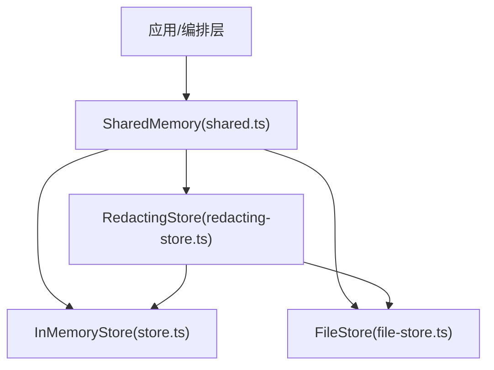
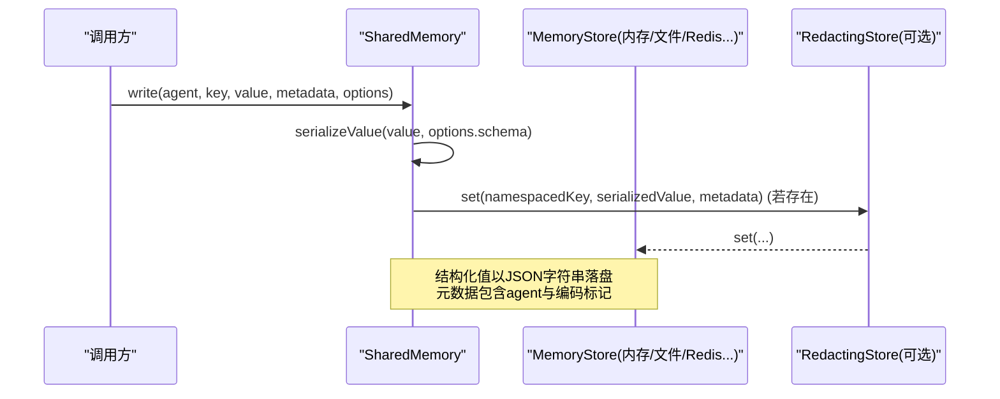
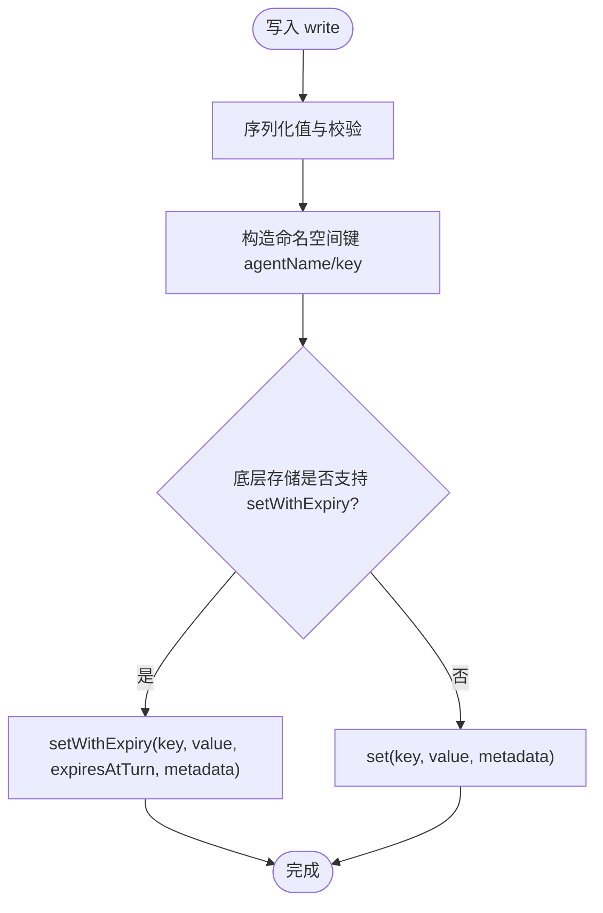
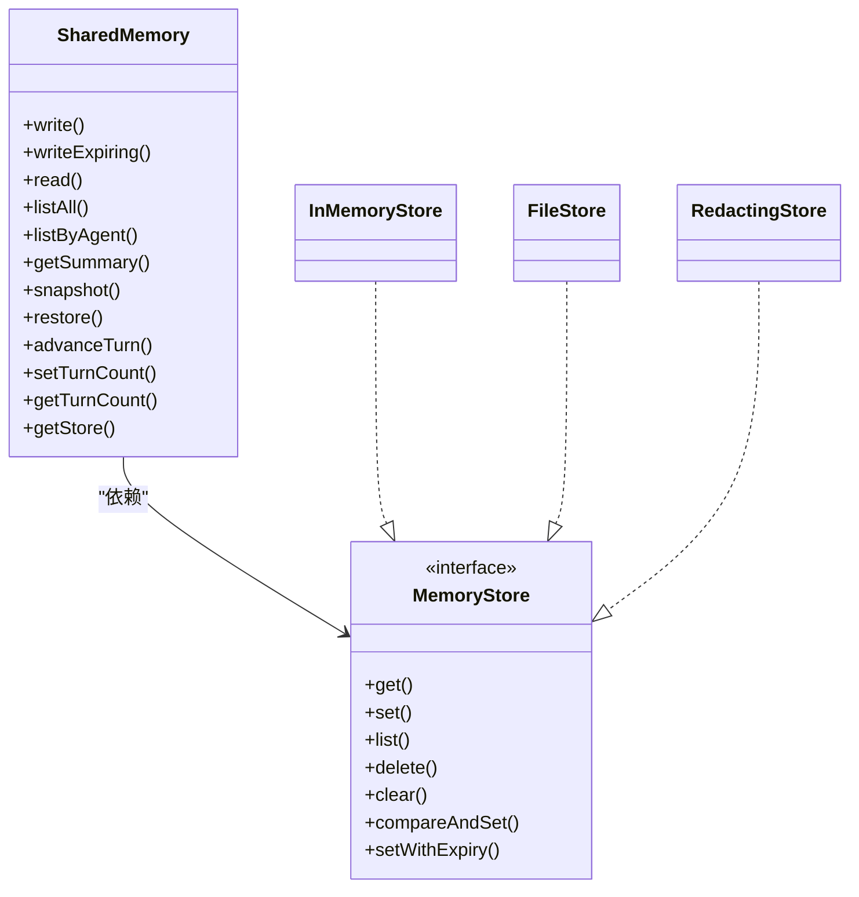

# 共享内存

<cite>
**本文引用的文件**
- [shared.ts](file://packages/core/src/memory/shared.ts)
- [store.ts](file://packages/core/src/memory/store.ts)
- [file-store.ts](file://packages/core/src/memory/file-store.ts)
- [redacting-store.ts](file://packages/core/src/memory/redacting-store.ts)
- [shared-memory.md](file://docs/shared-memory.md)
- [shared-memory.test.ts](file://packages/core/tests/shared-memory.test.ts)
</cite>

## 目录
1. [简介](#简介)
2. [项目结构](#项目结构)
3. [核心组件](#核心组件)
4. [架构总览](#架构总览)
5. [详细组件分析](#详细组件分析)
6. [依赖关系分析](#依赖关系分析)
7. [性能考量](#性能考量)
8. [故障排查指南](#故障排查指南)
9. [结论](#结论)
10. [附录：使用示例与最佳实践](#附录使用示例与最佳实践)

## 简介
本章节介绍 Open Multi-Agent 的共享内存系统，聚焦 SharedMemory 的核心概念、数据共享机制、同步策略、冲突处理、版本控制、生命周期管理以及性能优化建议。SharedMemory 为多智能体团队提供命名空间隔离的键值共享存储，支持结构化值、可选模式校验、按“回合”过期、快照/恢复、摘要生成，以及可插拔持久化后端（内存、文件、可扩展至 Redis/Postgres 等）。

## 项目结构
共享内存相关代码位于 core 包的 memory 子模块，围绕以下文件组织：
- shared.ts：SharedMemory 主类，负责命名空间、序列化/反序列化、TTL 回合过期、快照/恢复、摘要生成、读取过滤等。
- store.ts：InMemoryStore 实现，进程内 Map-backed 存储，提供基础接口与扩展能力。
- file-store.ts：FileStore 实现，单 JSON 文件持久化，原子写入、格式版本校验、加载与恢复。
- redacting-store.ts：RedactingStore 装饰器，写时脱敏，保护敏感信息落盘。
- docs/shared-memory.md：用户文档，说明启用方式、默认内存存储与 FileStore 的使用、跨进程后端接入要点。
- tests/shared-memory.test.ts：覆盖命名空间隔离、结构化值、Zod 校验、TTL 回合、摘要过滤、注入自定义 MemoryStore 等行为。

图表来源
- [shared.ts:68-98](file://packages/core/src/memory/shared.ts#L68-L98)
- [store.ts:31-122](file://packages/core/src/memory/store.ts#L31-L122)
- [file-store.ts:80-206](file://packages/core/src/memory/file-store.ts#L80-L206)
- [redacting-store.ts:48-95](file://packages/core/src/memory/redacting-store.ts#L48-L95)

章节来源
- [shared.ts:1-531](file://packages/core/src/memory/shared.ts#L1-L531)
- [store.ts:1-167](file://packages/core/src/memory/store.ts#L1-L167)
- [file-store.ts:1-381](file://packages/core/src/memory/file-store.ts#L1-L381)
- [redacting-store.ts:1-129](file://packages/core/src/memory/redacting-store.ts#L1-L129)
- [shared-memory.md:1-47](file://docs/shared-memory.md#L1-L47)
- [shared-memory.test.ts:1-518](file://packages/core/tests/shared-memory.test.ts#L1-L518)

## 核心组件
- SharedMemory：面向团队的共享内存抽象，提供 write/writeExpiring/read/listAll/listByAgent/getSummary/snapshot/restore/advanceTurn/setTurnCount/getTurnCount 等方法；内部维护单调递增的 turnCount 用于 TTL 回合过期判断。
- InMemoryStore：进程内键值存储，保持 createdAt 不变、支持 compareAndSet 与 setWithExpiry，适合测试与单进程场景。
- FileStore：基于单 JSON 文件的持久化存储，原子写入（临时文件 + fsync + rename），带文件格式版本校验与增量刷新队列，保证崩溃一致性。
- RedactingStore：对底层 MemoryStore 的写路径进行脱敏装饰，支持内置凭据与自定义正则模式，读路径透传。

章节来源
- [shared.ts:68-130](file://packages/core/src/memory/shared.ts#L68-L130)
- [store.ts:31-122](file://packages/core/src/memory/store.ts#L31-L122)
- [file-store.ts:80-206](file://packages/core/src/memory/file-store.ts#L80-L206)
- [redacting-store.ts:48-95](file://packages/core/src/memory/redacting-store.ts#L48-L95)

## 架构总览
SharedMemory 通过统一接口屏蔽不同存储后端差异，并封装了：
- 命名空间隔离：键形如 agentName/key，避免冲突且可溯源。
- 结构化值与校验：支持 JSON 对象/数组，可选 Zod schema 校验，落盘前序列化为字符串，读取时还原。
- 回合级 TTL：writeExpiring 记录 expiresAtTurn，read/list/summary 在读取时过滤已过期条目，不主动删除底层数据。
- 快照与恢复：snapshot/restore/fromSnapshot 支持导出/重建状态，保留 reserved 键（如 checkpoint 与审批记录）。
- 摘要输出：按智能体分组生成可读文本，便于注入上下文窗口。
- 安全脱敏：通过 RedactingStore 在写时脱敏，保护持久化内容。

图表来源
- [shared.ts:204-218](file://packages/core/src/memory/shared.ts#L204-L218)
- [shared.ts:418-439](file://packages/core/src/memory/shared.ts#L418-L439)
- [redacting-store.ts:81-83](file://packages/core/src/memory/redacting-store.ts#L81-L83)

章节来源
- [shared.ts:188-381](file://packages/core/src/memory/shared.ts#L188-L381)
- [redacting-store.ts:1-129](file://packages/core/src/memory/redacting-store.ts#L1-L129)

## 详细组件分析

### SharedMemory：数据共享、同步与冲突解决
- 数据共享机制
  - 命名空间：所有写操作自动将键转换为 agentName/key，确保归属清晰且互不干扰。
  - 结构化值：write 接受任意 JSON 可序列化值，内部序列化为字符串存储；读取时根据元数据还原为原始类型。
  - 模式校验：可通过 options.schema（Zod）在写入时校验，失败抛出错误且不落盘。
- 数据同步策略
  - 读取过滤：read/listAll/listByAgent/getSummary 会过滤掉 expiresAtTurn <= turnCount 的条目，但不删除底层数据，避免并发竞争下的误删。
  - 回合计数器：turnCount 由编排层在任务完成后推进，writeExpiring 基于该计数器决定可见性。
- 冲突解决算法
  - 无分布式锁：SharedMemory 本身不提供 CAS 或分布式锁；如需强一致更新，应在上层业务逻辑中设计幂等与重试，或使用底层 MemoryStore.compareAndSet（仅进程内有效）。
  - 覆盖语义：同名键被新写覆盖，createdAt 保持不变，便于区分首次写入与后续更新。
- 版本控制与一致性
  - 快照版本：snapshot 返回 version=1，restore 仅支持该版本，防止不兼容迁移。
  - 保留键：__oma_checkpoint__/ 与审批前缀键在 list/summary 中隐藏，并在 restore 时跳过覆盖，确保系统元数据不被覆盖。
  - 回退兼容：未实现 setWithExpiry 的后端仍可用，writeExpiring 降级为普通 set，TTL 失效但功能可用。

图表来源
- [shared.ts:245-269](file://packages/core/src/memory/shared.ts#L245-L269)
- [shared.ts:204-218](file://packages/core/src/memory/shared.ts#L204-L218)

章节来源
- [shared.ts:68-130](file://packages/core/src/memory/shared.ts#L68-L130)
- [shared.ts:188-381](file://packages/core/src/memory/shared.ts#L188-L381)
- [shared.ts:418-529](file://packages/core/src/memory/shared.ts#L418-L529)
- [shared-memory.test.ts:28-187](file://packages/core/tests/shared-memory.test.ts#L28-L187)
- [shared-memory.test.ts:424-516](file://packages/core/tests/shared-memory.test.ts#L424-L516)

### InMemoryStore：进程内键值存储
- 特性
  - 基于 Map 的异步接口，get/set/list/delete/clear。
  - set 与 setWithExpiry 在更新时保留 createdAt。
  - compareAndSet 提供进程内原子替换能力（期望值匹配才写入）。
  - search 提供简单全文检索（线性扫描，不适合超大集合）。
- 适用场景
  - 单元测试、单进程运行、无需跨进程共享的场景。

章节来源
- [store.ts:31-122](file://packages/core/src/memory/store.ts#L31-L122)
- [store.ts:124-167](file://packages/core/src/memory/store.ts#L124-L167)

### FileStore：单文件持久化与原子写入
- 特性
  - 单 JSON 文件承载全部条目，内存镜像 Map 加速读取。
  - 原子写入：写临时文件 -> fsync -> rename 到目标路径，保证崩溃一致性。
  - 格式版本：FILE_FORMAT_VERSION 校验，拒绝不兼容文件。
  - 写入队列：串行化 flush，避免并发写入竞态。
  - 目录 fsync：尽力而为，非致命。
- 注意事项
  - 单进程范围；跨进程需自行加锁或使用数据库后端。
  - 每次写都会重写整个文件，适合中小规模共享内存或作为检查点存储。

章节来源
- [file-store.ts:1-45](file://packages/core/src/memory/file-store.ts#L1-L45)
- [file-store.ts:80-206](file://packages/core/src/memory/file-store.ts#L80-L206)
- [file-store.ts:212-381](file://packages/core/src/memory/file-store.ts#L212-L381)

### RedactingStore：写时脱敏装饰器
- 特性
  - 对 set/setWithExpiry 的值进行脱敏，支持内置凭据与自定义正则。
  - 结构化值会被解析后逐字段脱敏，再序列化回字符串，保持 JSON 合法性。
  - 不暴露 compareAndSet，避免与校验/签名等强一致流程冲突。
- 使用建议
  - 当使用 FileStore 或其他持久化后端时，建议包裹 RedactingStore，避免密钥落盘。

章节来源
- [redacting-store.ts:1-23](file://packages/core/src/memory/redacting-store.ts#L1-L23)
- [redacting-store.ts:48-129](file://packages/core/src/memory/redacting-store.ts#L48-L129)

## 依赖关系分析
- SharedMemory 依赖 MemoryStore 接口，默认使用 InMemoryStore，也可注入 FileStore 或第三方实现。
- RedactingStore 作为装饰器，透明转发 get/list/delete/clear，拦截 set/setWithExpiry 进行脱敏。
- FileStore 依赖 Node fs/promises 与 path，实现单文件持久化与版本校验。
- 测试用例验证了命名空间隔离、结构化值往返、Zod 校验、TTL 回合、摘要过滤、自定义存储注入等关键行为。

图表来源
- [shared.ts:68-98](file://packages/core/src/memory/shared.ts#L68-L98)
- [store.ts:31-122](file://packages/core/src/memory/store.ts#L31-L122)
- [file-store.ts:80-206](file://packages/core/src/memory/file-store.ts#L80-L206)
- [redacting-store.ts:48-95](file://packages/core/src/memory/redacting-store.ts#L48-L95)

章节来源
- [shared.ts:1-531](file://packages/core/src/memory/shared.ts#L1-L531)
- [store.ts:1-167](file://packages/core/src/memory/store.ts#L1-L167)
- [file-store.ts:1-381](file://packages/core/src/memory/file-store.ts#L1-L381)
- [redacting-store.ts:1-129](file://packages/core/src/memory/redacting-store.ts#L1-L129)

## 性能考量
- 写入路径
  - 结构化值序列化与 Zod 校验带来额外 CPU 开销，建议在批量写入时合并或减少复杂对象体积。
  - FileStore 每次写都会重写整个文件，适合中小规模；高频写入建议使用 InMemoryStore 作为共享内存，另用独立 FileStore 做检查点。
- 读取路径
  - read/listAll/listByAgent/getSummary 会遍历并过滤过期条目，数据量大时可考虑限制查询范围或分页。
  - 摘要生成会对长值截断，避免上下文窗口溢出。
- TTL 与清理
  - 过期条目仅在读取时过滤，不会从底层存储删除；对于分布式后端，应利用原生 TTL 或定时任务清理。
- 并发与一致性
  - 进程内可使用 compareAndSet 实现轻量 CAS；跨进程需借助外部锁或数据库事务。
- 脱敏成本
  - RedactingStore 在写时对结构化值进行解析与重组，注意在高吞吐场景下评估开销。

[本节为通用性能指导，不直接分析具体文件]

## 故障排查指南
- 无法读取预期键
  - 检查键是否为 fully-qualified（agentName/key），或确认未被 reserved 前缀过滤。
  - 确认 turnCount 是否已推进到超过 expiresAtTurn，导致条目被过滤。
- 结构化值异常
  - 确认值可 JSON 序列化且不含循环引用或不可序列化类型（如函数、Symbol）。
  - 若使用 schema 校验，检查 Zod 定义是否与写入值匹配。
- 持久化问题
  - FileStore 启动时报错：检查状态文件是否为合法 JSON、version 是否匹配、entries 是否存在。
  - 权限或磁盘空间不足会导致写入失败，关注文件系统错误。
- 脱敏不符合预期
  - 确认已正确包裹 RedactingStore，并配置必要正则模式。
  - 注意脱敏发生在写时，读到的即为脱敏后的值。

章节来源
- [shared.ts:285-311](file://packages/core/src/memory/shared.ts#L285-L311)
- [shared.ts:418-529](file://packages/core/src/memory/shared.ts#L418-L529)
- [file-store.ts:220-303](file://packages/core/src/memory/file-store.ts#L220-L303)
- [redacting-store.ts:97-129](file://packages/core/src/memory/redacting-store.ts#L97-L129)
- [shared-memory.test.ts:146-187](file://packages/core/tests/shared-memory.test.ts#L146-L187)
- [shared-memory.test.ts:424-516](file://packages/core/tests/shared-memory.test.ts#L424-L516)

## 结论
Open Multi-Agent 的共享内存系统通过 SharedMemory 提供了简洁而强大的多智能体数据共享能力：命名空间隔离、结构化值与校验、回合级 TTL、快照/恢复、摘要生成与可插拔后端。配合 InMemoryStore、FileStore 与 RedactingStore，可在不同场景下平衡性能、持久化与安全需求。对于高并发与跨进程一致性，建议在上层结合业务语义与外部资源（数据库/缓存/锁）实现更强的一致性保障。

[本节为总结性内容，不直接分析具体文件]

## 附录：使用示例与最佳实践
- 启用共享内存
  - 使用默认内存存储：在团队配置中开启 sharedMemory。
  - 使用 FileStore 持久化：传入 sharedMemoryStore 为 FileStore 实例。
  - 跨进程/基础设施后端：实现 MemoryStore 接口并通过 sharedMemoryStore 注入。
- 在智能体间共享状态、配置与中间结果
  - 使用 write(agentName, key, value, metadata, options) 写入结构化值，必要时附加 schema 校验。
  - 使用 read(agentName/key) 读取其他智能体的结果；使用 listByAgent 获取某智能体全部条目。
  - 使用 getSummary 生成可读摘要，按需过滤 taskIds。
- 生命周期管理
  - 创建：通过 Team 配置或直接 new SharedMemory(store)。
  - 更新：重复 write 覆盖旧值，createdAt 保持不变。
  - 删除：调用底层 store.delete(key) 或通过快照恢复清空。
  - 清理：实现 setWithExpiry 并使用 advanceTurn 推进回合；或依赖后端 TTL/定时任务清理。
- 最佳实践
  - 将共享内存与检查点分离：共享内存使用 InMemoryStore 获得低延迟，检查点使用 FileStore 保证持久化。
  - 始终包裹 RedactingStore 以保护敏感信息落盘。
  - 对关键写操作使用幂等设计与去重键，避免重复写入。
  - 合理设置 TTL，避免长期堆积；对需要跨任务传递的数据，显式删除而非依赖 TTL。
  - 在大团队或多任务场景中，限制摘要长度与查询范围，降低上下文压力。

章节来源
- [shared-memory.md:1-47](file://docs/shared-memory.md#L1-L47)
- [shared.ts:68-130](file://packages/core/src/memory/shared.ts#L68-L130)
- [shared.ts:188-381](file://packages/core/src/memory/shared.ts#L188-L381)
- [store.ts:31-122](file://packages/core/src/memory/store.ts#L31-L122)
- [file-store.ts:80-206](file://packages/core/src/memory/file-store.ts#L80-L206)
- [redacting-store.ts:48-95](file://packages/core/src/memory/redacting-store.ts#L48-L95)
- [shared-memory.test.ts:28-187](file://packages/core/tests/shared-memory.test.ts#L28-L187)
- [shared-memory.test.ts:424-516](file://packages/core/tests/shared-memory.test.ts#L424-L516)