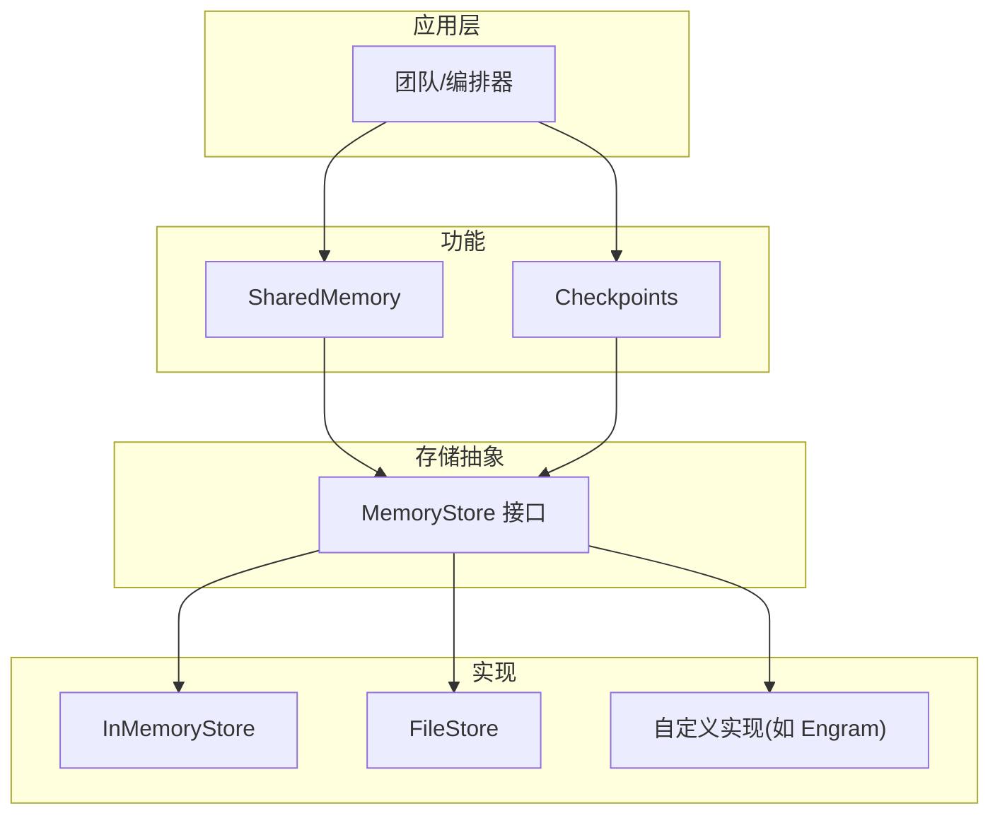
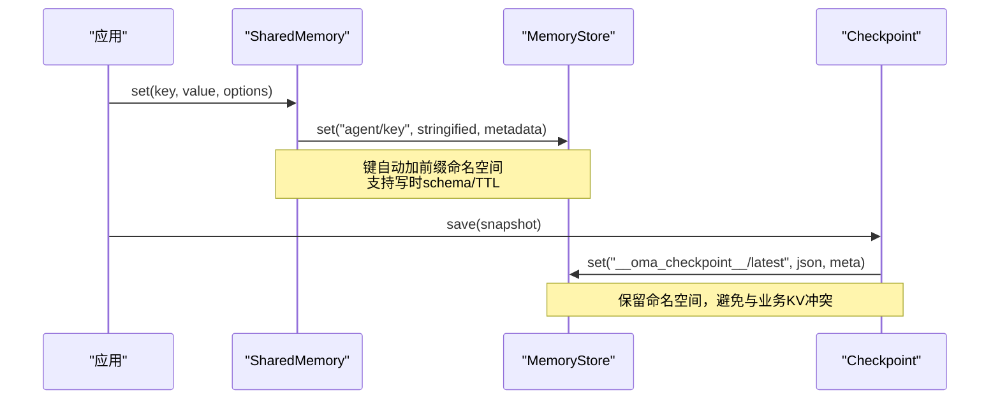
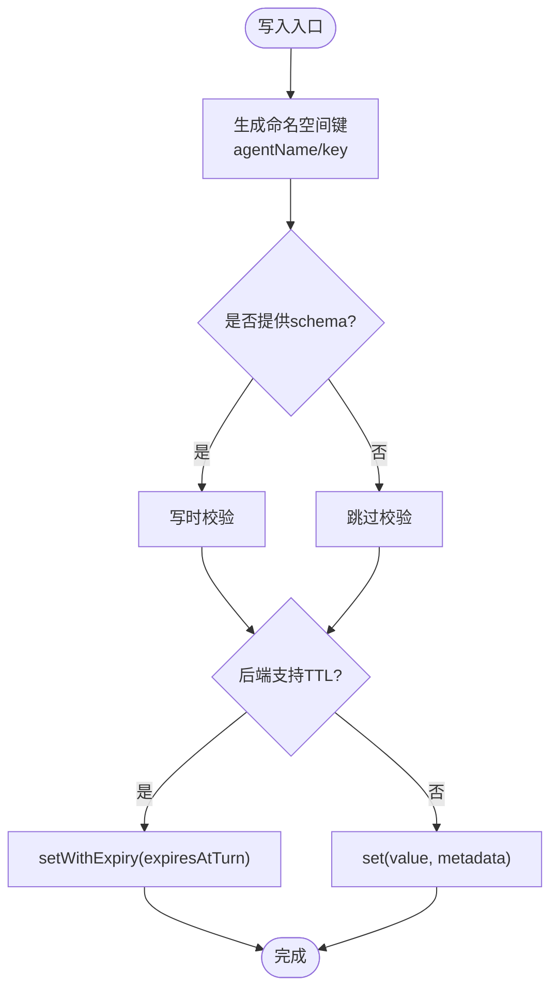
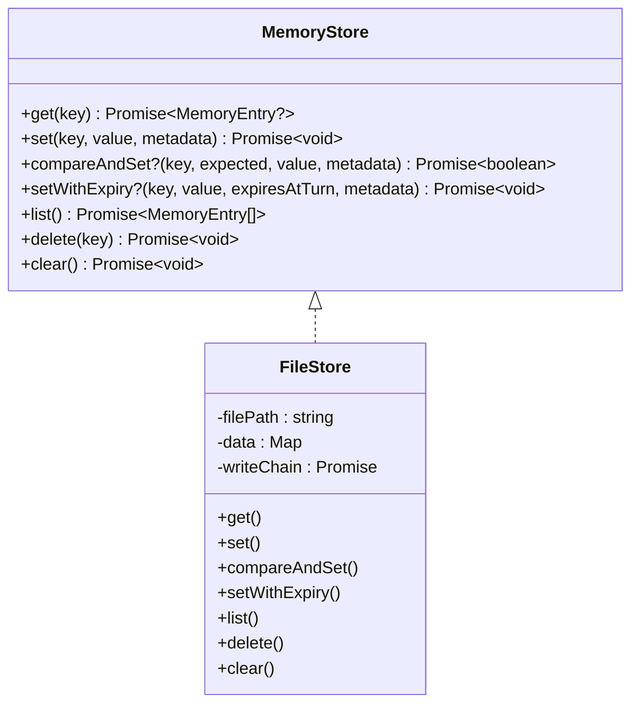
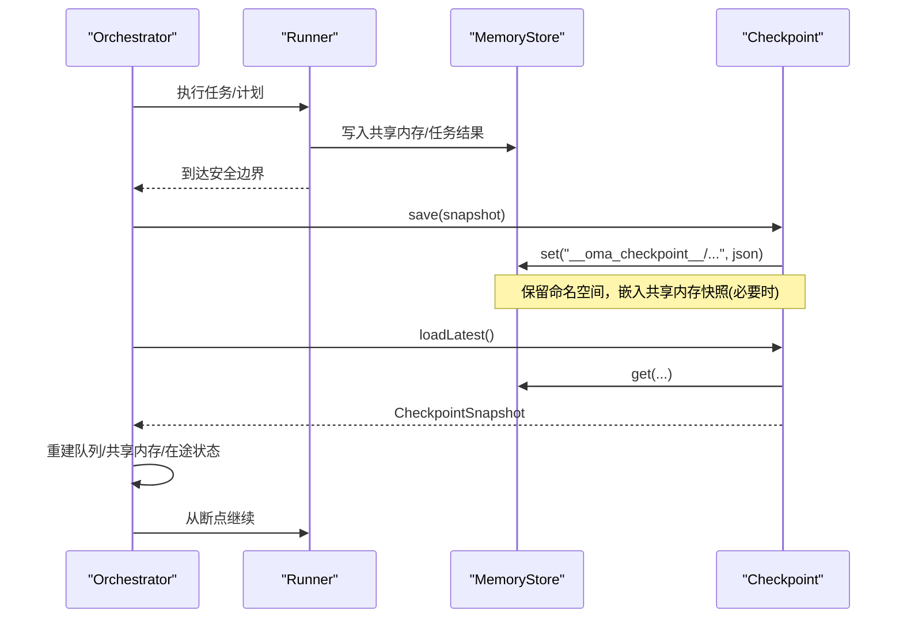
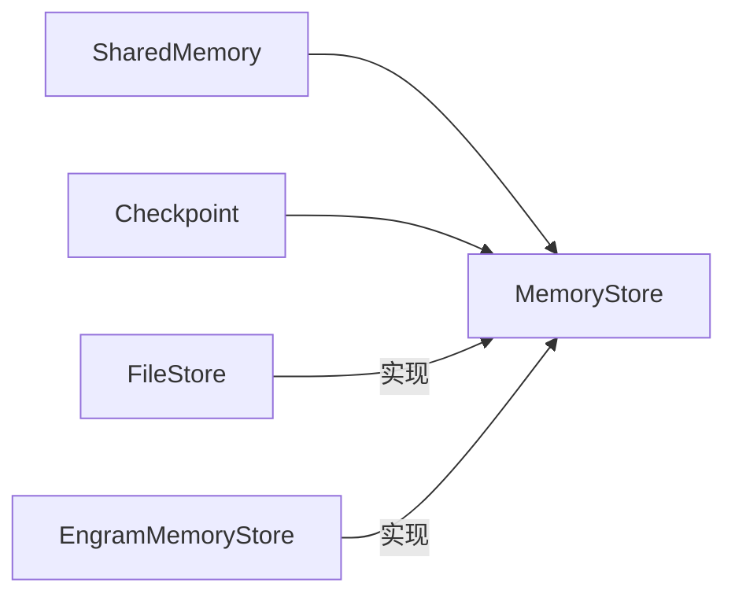

# 内存存储

<cite>
**本文引用的文件**
- [shared-memory.md](file://docs/shared-memory.md)
- [checkpoint.md](file://docs/checkpoint.md)
- [types.ts](file://packages/core/src/types.ts)
- [file-store.ts](file://packages/core/src/memory/file-store.ts)
- [checkpoint.ts](file://packages/core/src/memory/checkpoint.ts)
- [engram-store.ts](file://packages/core/examples/integrations/with-engram/engram-store.ts)
</cite>

## 目录
1. [简介](#简介)
2. [项目结构](#项目结构)
3. [核心组件](#核心组件)
4. [架构总览](#架构总览)
5. [详细组件分析](#详细组件分析)
6. [依赖关系分析](#依赖关系分析)
7. [性能考量](#性能考量)
8. [故障排查指南](#故障排查指南)
9. [结论](#结论)
10. [附录](#附录)

## 简介
本文件系统性介绍 Open Multi-Agent 的内存存储系统，覆盖 SharedMemory 的使用方式、数据同步与版本控制、冲突解决策略；解释存储后端抽象接口 MemoryStore 及其内置实现 InMemoryStore 与 FileStore 的差异与适用场景；阐述检查点（Checkpoint）系统的创建、恢复与持久化策略；提供自定义存储后端的开发指南（接口实现、数据迁移、性能优化）；并给出存储配置的最佳实践与安全考虑，以及内存管理与智能体状态的关系。

## 项目结构
Open Multi-Agent 的存储子系统围绕统一的 MemoryStore 抽象构建，上层共享内存与检查点均基于该接口工作：
- 类型与契约：定义 MemoryStore、SharedMemoryEntry、SharedMemoryValue 等核心类型。
- 共享内存：通过团队配置启用，键按命名空间隔离，支持可选的写时校验与 TTL。
- 存储后端：
  - InMemoryStore：进程内 Map 实现，适合热路径与短生命周期。
  - FileStore：单 JSON 文件的原子持久化实现，适合检查点与跨重启恢复。
- 检查点：以专用命名空间保存快照，支持恢复、任务队列重建、在途工具调用恢复与审批延续。
- 示例集成：提供 Engram 远程存储实现参考。

图表来源
- [types.ts:2806-2872](file://packages/core/src/types.ts#L2806-L2872)
- [file-store.ts:80-206](file://packages/core/src/memory/file-store.ts#L80-L206)
- [checkpoint.ts:45-102](file://packages/core/src/memory/checkpoint.ts#L45-L102)

章节来源
- [shared-memory.md:1-27](file://docs/shared-memory.md#L1-L27)
- [checkpoint.md:1-48](file://docs/checkpoint.md#L1-L48)
- [types.ts:2806-2872](file://packages/core/src/types.ts#L2806-L2872)

## 核心组件
- MemoryStore 接口：统一键值存取、可选 CAS 与带 TTL 写入、列表/删除/清空能力。
- SharedMemory：团队级命名空间 KV 存储，键形如 <agentName>/<key>，支持写时 schema 校验与按轮次过期。
- FileStore：单文件 JSON 原子写入（临时文件 + fsync + rename），进程内并发安全，适合检查点。
- Checkpoint：以保留命名空间持久化运行快照，支持恢复、任务队列重建、在途工具调用与审批延续。
- 示例 EngramStore：展示如何基于 REST API 实现 MemoryStore。

章节来源
- [types.ts:2806-2872](file://packages/core/src/types.ts#L2806-L2872)
- [file-store.ts:1-45](file://packages/core/src/memory/file-store.ts#L1-L45)
- [checkpoint.ts:1-40](file://packages/core/src/memory/checkpoint.ts#L1-L40)
- [engram-store.ts:1-73](file://packages/core/examples/integrations/with-engram/engram-store.ts#L1-L73)

## 架构总览
共享内存与检查点共用同一 MemoryStore 抽象，使“热路径”与“持久化”可解耦：
- 共享内存默认使用进程内存储以获得低延迟；如需跨进程或持久化，可替换为 Redis/SQLite 或 FileStore。
- 检查点默认复用团队的 sharedMemoryStore；也可指定独立 FileStore 作为检查点后端，将共享内存快照嵌入其中以便一次性恢复。
- 所有持久化写入均通过 MemoryStore 完成，便于统一审计、脱敏与扩展。

图表来源
- [shared-memory.md:1-27](file://docs/shared-memory.md#L1-L27)
- [checkpoint.ts:57-102](file://packages/core/src/memory/checkpoint.ts#L57-L102)
- [types.ts:2806-2872](file://packages/core/src/types.ts#L2806-L2872)

## 详细组件分析

### SharedMemory 使用与数据同步
- 启用方式：在团队配置中开启 sharedMemory；或通过 sharedMemoryStore 注入自定义后端。
- 键命名空间：SDK 会在到达底层 store 之前对 key 加上 <agentName>/ 前缀，天然隔离不同智能体的数据。
- 数据同步：同进程内共享内存即时可见；跨进程需使用分布式后端（如 Redis）。
- 冲突解决：底层 store 的 set 语义为覆盖式更新；若需原子比较替换，可使用 compareAndSet（由具体后端实现）。
- 版本控制与 TTL：可通过 writeOptions.schema 进行写时校验；若后端支持 setWithExpiry，则条目携带 expiresAtTurn，由 SharedMemory 在读取时按当前轮次过滤。

图表来源
- [shared-memory.md:1-27](file://docs/shared-memory.md#L1-L27)
- [types.ts:2806-2872](file://packages/core/src/types.ts#L2806-L2872)

章节来源
- [shared-memory.md:1-27](file://docs/shared-memory.md#L1-L27)
- [types.ts:2806-2872](file://packages/core/src/types.ts#L2806-L2872)

### 存储后端：InMemoryStore 与 FileStore
- InMemoryStore
  - 特点：基于 Map，读写极快，进程退出即丢失。
  - 适用：热路径共享内存、短期任务、无需跨进程共享的场景。
- FileStore
  - 特点：单 JSON 文件，内存镜像 Map；每次写入采用“临时文件 + fsync + rename”的原子落盘；进程内并发串行化，保证一致性。
  - 适用：检查点持久化、跨进程重启恢复；也可作为共享内存后端，但每次写入都会重写整个文件，I/O 成本较高。
  - 版本兼容：磁盘格式含 version 字段，不兼容版本会拒绝加载，防止静默丢弃数据。

图表来源
- [types.ts:2806-2872](file://packages/core/src/types.ts#L2806-L2872)
- [file-store.ts:80-206](file://packages/core/src/memory/file-store.ts#L80-L206)

章节来源
- [file-store.ts:1-45](file://packages/core/src/memory/file-store.ts#L1-L45)
- [file-store.ts:80-206](file://packages/core/src/memory/file-store.ts#L80-L206)
- [file-store.ts:220-303](file://packages/core/src/memory/file-store.ts#L220-L303)

### 检查点系统：创建、恢复与持久化策略
- 启用与配置
  - 可在每次调用传入 checkpoint 选项，或在 OrchestratorConfig 设置全局默认。
  - checkpoint: true 表示复用团队的 sharedMemoryStore；若无共享存储，则使用实例级私有内存存储（需显式区分 runId/key 以避免覆盖）。
- 持久化位置与命名空间
  - 检查点以保留命名空间 __oma_checkpoint__/<runId>/latest 存储；与业务 KV 隔离。
  - 当检查点 store 与共享内存 store 不同时，快照会嵌入完整共享内存内容；相同 store 时直接复用。
- 恢复流程
  - restore() 加载最新快照，重建任务队列与共享内存，跳过已完成任务；对于内置 LLM runner，还会恢复对话、工具调用与 token 用量。
  - 若无法执行协调器综合（缺少配置/凭据），恢复尽力而为，返回原始任务输出并触发 synthesis_failed 事件。
- 保存时机与容错
  - 在安全的在途边界与任务完成后保存；普通保存失败走 onProgress 上报并继续运行；挂起（suspension）保存严格失败关闭。
- 中间任务工具恢复
  - 工具调用分阶段持久化：请求先保存，每个结果单独提交，全部提交后再保存下一轮消息；恢复时重放已提交结果，未提交的保守重试。
  - 工具上下文包含 toolCallId，可用于幂等外部调用。

图表来源
- [checkpoint.md:11-48](file://docs/checkpoint.md#L11-L48)
- [checkpoint.md:109-153](file://docs/checkpoint.md#L109-L153)
- [checkpoint.ts:57-102](file://packages/core/src/memory/checkpoint.ts#L57-L102)

章节来源
- [checkpoint.md:11-48](file://docs/checkpoint.md#L11-L48)
- [checkpoint.md:109-153](file://docs/checkpoint.md#L109-L153)
- [checkpoint.md:154-199](file://docs/checkpoint.md#L154-L199)
- [checkpoint.md:206-249](file://docs/checkpoint.md#L206-L249)
- [checkpoint.ts:45-102](file://packages/core/src/memory/checkpoint.ts#L45-L102)

### 自定义存储后端开发指南
- 接口实现要点
  - 必须实现 get/set/list/delete/clear；建议实现 compareAndSet 以支持可挂起的审批决策；若支持 TTL，实现 setWithExpiry。
  - 注意键命名空间：SDK 会在上层添加 agentName 前缀；检查点使用保留命名空间，应避免冲突。
- 数据迁移与版本
  - 若后端有自身文件格式/协议，应引入版本字段并在加载时校验；不兼容版本应报错而非静默降级。
  - 参考 FileStore 的版本校验与错误提示策略。
- 性能优化
  - 读多写少：缓存热点键；批量 list/get 合并。
  - 写放大：对高吞吐共享内存建议使用内存后端，检查点使用 FileStore 或数据库。
  - 并发：进程内串行化写操作；跨进程使用分布式锁或 CAS。
- 安全与合规
  - 敏感信息：通过 RedactingStore 包装任意 MemoryStore，在写入时脱敏（包括检查点与共享内存）。
  - 权限：限制对保留命名空间的访问；对持久化文件设置最小权限。

章节来源
- [types.ts:2806-2872](file://packages/core/src/types.ts#L2806-L2872)
- [file-store.ts:220-303](file://packages/core/src/memory/file-store.ts#L220-L303)
- [engram-store.ts:48-73](file://packages/core/examples/integrations/with-engram/engram-store.ts#L48-L73)
- [shared-memory.md:29-47](file://docs/shared-memory.md#L29-L47)
- [checkpoint.md:172-199](file://docs/checkpoint.md#L172-L199)

### 配置最佳实践与安全考虑
- 推荐组合
  - 共享内存：InMemoryStore（高性能）+ 检查点：FileStore（持久化）。
  - 需要跨进程共享：共享内存使用 Redis/Postgres 等分布式后端；检查点仍可用 FileStore 或数据库。
- 命名空间隔离
  - 不要手动写入 __oma_checkpoint__ 与 __oma_approval__ 下的键；这些为保留命名空间。
- 脱敏
  - 对所有持久化后端（共享内存与检查点）使用 RedactingStore 包装，避免密钥/PII 落盘。
- 并发与范围
  - FileStore 适用于单进程；跨进程请使用数据库型 MemoryStore。
- 恢复策略
  - 首次运行与恢复使用同一 restore 调用；确保提供一致的协调器配置以重建最终答案。

章节来源
- [checkpoint.md:49-73](file://docs/checkpoint.md#L49-L73)
- [checkpoint.md:109-153](file://docs/checkpoint.md#L109-L153)
- [shared-memory.md:29-47](file://docs/shared-memory.md#L29-L47)

### 内存管理与智能体状态的关联
- 共享内存用于智能体间传递发现与中间结果，键按智能体命名空间隔离，避免相互污染。
- 检查点保存任务队列、共享内存快照、在途 runner 状态与工具调用记录；恢复时重建这些状态，确保长任务可中断续跑。
- 工具调用的 toolCallId 贯穿检查点与恢复，便于外部系统幂等处理副作用。
- 对共享内存与检查点的写入均经过 MemoryStore，便于统一监控、审计与脱敏。

章节来源
- [checkpoint.md:109-153](file://docs/checkpoint.md#L109-L153)
- [checkpoint.md:206-249](file://docs/checkpoint.md#L206-L249)
- [shared-memory.md:1-27](file://docs/shared-memory.md#L1-L27)

## 依赖关系分析
- SharedMemory 依赖 MemoryStore 抽象，屏蔽底层差异。
- Checkpoint 仅依赖 MemoryStore 与少量类型校验逻辑，保持轻量与可移植。
- FileStore 依赖 Node 文件系统 API，实现原子持久化。
- 示例 EngramStore 展示了基于 HTTP 的分布式 MemoryStore 实现思路。

图表来源
- [types.ts:2806-2872](file://packages/core/src/types.ts#L2806-L2872)
- [file-store.ts:80-206](file://packages/core/src/memory/file-store.ts#L80-L206)
- [engram-store.ts:48-73](file://packages/core/examples/integrations/with-engram/engram-store.ts#L48-L73)

章节来源
- [types.ts:2806-2872](file://packages/core/src/types.ts#L2806-L2872)
- [file-store.ts:80-206](file://packages/core/src/memory/file-store.ts#L80-L206)
- [engram-store.ts:48-73](file://packages/core/examples/integrations/with-engram/engram-store.ts#L48-L73)

## 性能考量
- 共享内存选择
  - 高频写入：优先 InMemoryStore；跨进程共享再考虑分布式后端。
  - 大对象/频繁序列化：评估网络/IO 开销，必要时在应用层做压缩或分页。
- 检查点频率
  - 在安全边界与任务完成后保存；避免在每步写入都触发持久化。
- FileStore 特性
  - 原子写入避免损坏；但全量重写文件带来 I/O 成本，适合低频持久化。
- 并发模型
  - FileStore 进程内串行化写；跨进程需数据库 CAS 或分布式锁。
- 脱敏成本
  - RedactingStore 在写入时正则匹配，建议在关键路径外或异步化。

[本节为通用指导，不直接分析具体文件]

## 故障排查指南
- 检查点写入失败
  - 监听 onProgress 的错误事件，捕获 checkpoint_save_failed；非挂起场景下运行继续。
- 文件损坏或版本不兼容
  - FileStore 启动时会校验 JSON 结构与版本；不合法将抛出错误，需修复或删除状态文件。
- 恢复异常
  - 若协调器综合失败，restore 返回原始任务输出并触发 synthesis_failed；检查协调器配置与凭据。
- 工具重复执行
  - 确保外部系统使用 toolCallId 实现幂等；避免重复副作用。
- 共享内存未生效
  - 确认团队配置启用了 sharedMemory 或注入了 sharedMemoryStore；检查键命名空间是否正确。

章节来源
- [checkpoint.md:154-199](file://docs/checkpoint.md#L154-L199)
- [file-store.ts:220-303](file://packages/core/src/memory/file-store.ts#L220-L303)
- [checkpoint.md:89-107](file://docs/checkpoint.md#L89-L107)
- [checkpoint.md:206-249](file://docs/checkpoint.md#L206-L249)

## 结论
Open Multi-Agent 的内存存储系统通过 MemoryStore 抽象将共享内存与检查点解耦，既保证了高性能的热路径，又提供了可靠的持久化与恢复能力。配合命名空间隔离、写时校验、TTL、CAS 与脱敏机制，能够在复杂的多智能体协作场景中提供一致、安全、可扩展的数据基础。推荐将 InMemoryStore 用于共享内存热路径，FileStore 用于检查点持久化，并通过 RedactingStore 保障数据安全。

[本节为总结性内容，不直接分析具体文件]

## 附录
- 快速上手
  - 启用共享内存：在团队配置中设置 sharedMemory 或注入 sharedMemoryStore。
  - 启用检查点：传入 checkpoint 选项或使用 checkpoint: true；跨进程恢复使用 restore。
- 参考实现
  - FileStore：零依赖、原子落盘、进程内并发安全。
  - EngramMemoryStore：基于 REST 的分布式 MemoryStore 示例。

章节来源
- [shared-memory.md:1-27](file://docs/shared-memory.md#L1-L27)
- [checkpoint.md:11-48](file://docs/checkpoint.md#L11-L48)
- [file-store.ts:1-45](file://packages/core/src/memory/file-store.ts#L1-L45)
- [engram-store.ts:1-73](file://packages/core/examples/integrations/with-engram/engram-store.ts#L1-L73)