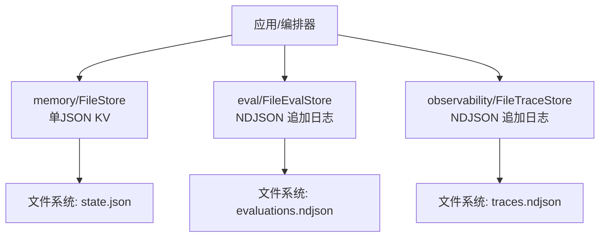
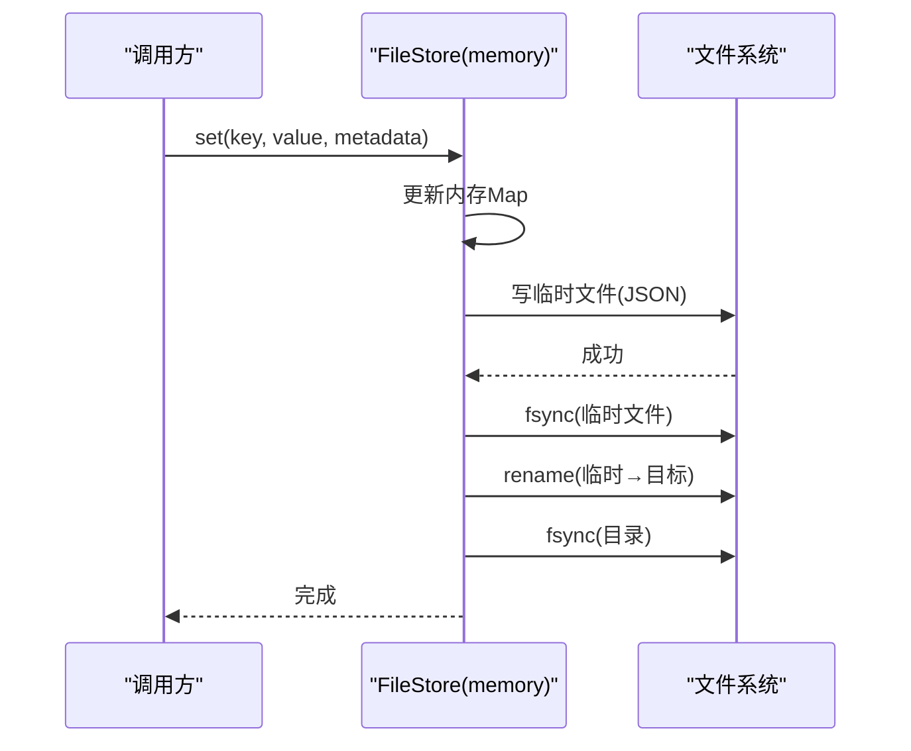
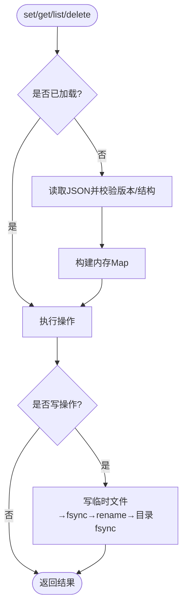
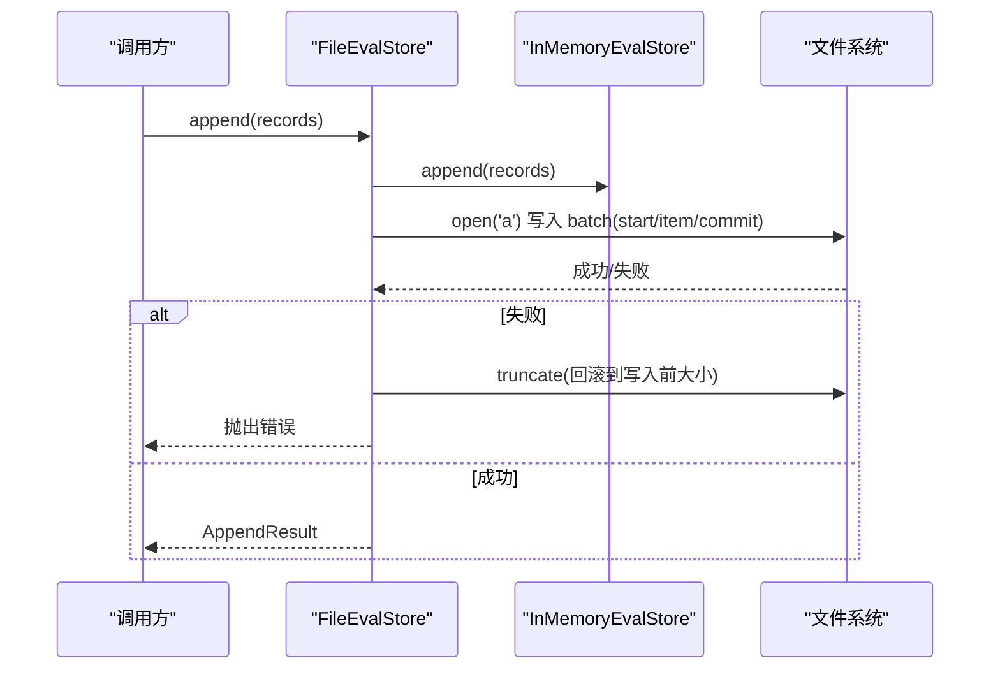
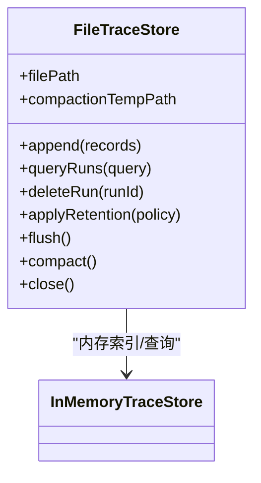
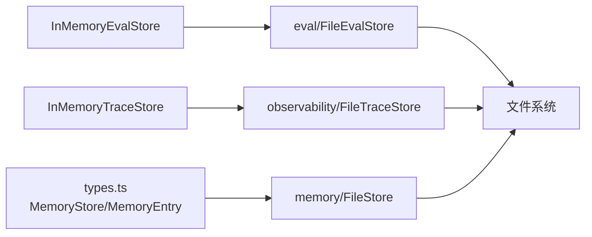

# FileStore 文件存储

<cite>
**本文引用的文件**
- [packages/core/src/memory/file-store.ts](file://packages/core/src/memory/file-store.ts)
- [packages/core/src/eval/file-store.ts](file://packages/core/src/eval/file-store.ts)
- [packages/core/src/observability/file-store.ts](file://packages/core/src/observability/file-store.ts)
- [packages/core/tests/file-store.test.ts](file://packages/core/tests/file-store.test.ts)
- [packages/core/tests/eval-file-store.test.ts](file://packages/core/tests/eval-file-store.test.ts)
- [packages/core/src/types.ts](file://packages/core/src/types.ts)
</cite>

## 目录
1. [简介](#简介)
2. [项目结构](#项目结构)
3. [核心组件](#核心组件)
4. [架构总览](#架构总览)
5. [详细组件分析](#详细组件分析)
6. [依赖关系分析](#依赖关系分析)
7. [性能考量](#性能考量)
8. [故障排查指南](#故障排查指南)
9. [结论](#结论)
10. [附录：配置与使用建议](#附录配置与使用建议)

## 简介
本文件全面介绍 FileStore 的文件持久化实现，覆盖三类存储：
- 内存键值持久化（MemoryStore 的磁盘实现）：用于 checkpoint/resume 等关键状态。
- 评估记录持久化（EvalStore 的磁盘实现）：追加式 NDJSON 日志，支持事务化批写入、校验和与崩溃恢复。
- 可观测性追踪持久化（TraceStore 的磁盘实现）：追加式 NDJSON 日志，支持批写入、校验和、压缩与崩溃恢复。

重点说明：
- 文件组织与命名约定
- JSON/NDJSON 序列化与反序列化流程
- 持久化策略：写入时机、事务边界、崩溃恢复
- 并发访问控制：进程内串行化与原子替换
- 性能优化：批量操作、缓存、索引构建、压缩
- 配置选项：路径、权限、诊断回调、保留策略
- 故障排查与调优建议

## 项目结构
仓库中与 FileStore 相关的核心代码位于 packages/core/src 下，分别提供三种“文件存储”实现：
- memory/file-store.ts：基于单 JSON 文件的键值存储，适合 checkpoint。
- eval/file-store.ts：基于 NDJSON 的评估记录追加存储，带批事务与校验和。
- observability/file-store.ts：基于 NDJSON 的可观测性追踪追加存储，带批事务、压缩与保留策略。

图表来源
- [packages/core/src/memory/file-store.ts:80-381](file://packages/core/src/memory/file-store.ts#L80-L381)
- [packages/core/src/eval/file-store.ts:252-840](file://packages/core/src/eval/file-store.ts#L252-L840)
- [packages/core/src/observability/file-store.ts:260-835](file://packages/core/src/observability/file-store.ts#L260-L835)

章节来源
- [packages/core/src/memory/file-store.ts:1-45](file://packages/core/src/memory/file-store.ts#L1-L45)
- [packages/core/src/eval/file-store.ts:1-10](file://packages/core/src/eval/file-store.ts#L1-L10)
- [packages/core/src/observability/file-store.ts:1-10](file://packages/core/src/observability/file-store.ts#L1-L10)

## 核心组件
- MemoryStore 接口定义与数据项类型：定义了 get/set/list/delete/clear 以及可选的 compareAndSet 与 setWithExpiry；MemoryEntry 包含 key/value/metadata/createdAt/expiresAtTurn。
- FileStore（memory）：单 JSON 文件 + 内存 Map 镜像；读写分离，写时原子替换；支持版本校验与损坏拒绝。
- FileEvalStore（eval）：NDJSON 追加日志，批写入以 start/item/commit 信封包裹，附带 payload SHA-256 校验；支持删除与保留策略；支持 compact 压缩。
- FileTraceStore（observability）：同 EvalStore 的追加日志模式，但面向 TraceRecord；同样支持删除、保留策略、compact 压缩与诊断回调。

章节来源
- [packages/core/src/types.ts:2824-2872](file://packages/core/src/types.ts#L2824-L2872)
- [packages/core/src/memory/file-store.ts:80-381](file://packages/core/src/memory/file-store.ts#L80-L381)
- [packages/core/src/eval/file-store.ts:252-840](file://packages/core/src/eval/file-store.ts#L252-L840)
- [packages/core/src/observability/file-store.ts:260-835](file://packages/core/src/observability/file-store.ts#L260-L835)

## 架构总览
三类 FileStore 共享的设计思想：
- 读路径优先走内存：加载一次后，后续读取从内存返回，保证低延迟与一致性。
- 写路径串行化：通过 Promise 链在进程内串行执行，避免并发写导致的竞态。
- 原子持久化：
  - memory/FileStore：写临时文件 → fsync → rename 到目标文件 → 目录 fsync。
  - eval/trace：追加批信封（start/item/commit），commit 行才视为可见；必要时 truncate 回滚未完成尾部。
- 崩溃恢复：
  - memory：启动时解析 JSON，严格校验版本与字段，非法则拒绝启动。
  - eval/trace：按行扫描，仅提交完整且校验通过的批；不完整尾部被截断或忽略并告警。

图表来源
- [packages/core/src/memory/file-store.ts:315-369](file://packages/core/src/memory/file-store.ts#L315-L369)

章节来源
- [packages/core/src/memory/file-store.ts:102-206](file://packages/core/src/memory/file-store.ts#L102-L206)
- [packages/core/src/memory/file-store.ts:212-303](file://packages/core/src/memory/file-store.ts#L212-L303)
- [packages/core/src/memory/file-store.ts:315-369](file://packages/core/src/memory/file-store.ts#L315-L369)

## 详细组件分析

### memory/FileStore：单 JSON 键值持久化
- 文件布局
  - 单一 JSON 文件，根对象包含 version 与 entries 数组。
  - entries 中每个元素为 StoredEntry：key/value/metadata/createdAt/expiresAtTurn。
- 序列化/反序列化
  - 写入：内存 Map 转为 StoredEntry 列表，JSON.stringify 后落盘。
  - 读取：JSON.parse 后逐条 revive，将 createdAt 还原为 Date，metadata 必须为普通对象。
- 持久化策略
  - 原子替换：写同目录 temp 文件 → fsync → rename → 目录 fsync。
  - 并发安全：writeChain 串行化所有 flush，确保最后入队的 flush 最终落地。
  - 缺失文件视为空 store；损坏或不兼容版本直接报错，不静默重置。
- 事务与崩溃恢复
  - 无跨进程锁；进程内并发写串行化。
  - 重启后从磁盘重建内存镜像；若文件损坏或版本不匹配，拒绝启动。
- 并发访问控制
  - 进程内串行化；compareAndSet 在同一实例上保证原子决策。
- 性能优化
  - 读路径完全内存；写路径批量重序列化整个 Map（适合中小规模 KV）。
  - 元数据拷贝避免外部引用泄漏。
- 配置选项
  - 构造参数：filePath（自动创建父目录）。
  - 无额外运行时开关。

图表来源
- [packages/core/src/memory/file-store.ts:212-303](file://packages/core/src/memory/file-store.ts#L212-L303)
- [packages/core/src/memory/file-store.ts:315-369](file://packages/core/src/memory/file-store.ts#L315-L369)

章节来源
- [packages/core/src/memory/file-store.ts:55-74](file://packages/core/src/memory/file-store.ts#L55-L74)
- [packages/core/src/memory/file-store.ts:102-206](file://packages/core/src/memory/file-store.ts#L102-L206)
- [packages/core/src/memory/file-store.ts:212-303](file://packages/core/src/memory/file-store.ts#L212-L303)
- [packages/core/src/memory/file-store.ts:315-369](file://packages/core/src/memory/file-store.ts#L315-L369)
- [packages/core/tests/file-store.test.ts:30-197](file://packages/core/tests/file-store.test.ts#L30-L197)

### eval/FileEvalStore：NDJSON 评估记录存储
- 文件布局
  - 首行为 file_header（format/formatVersion/evalSchemaMajor）。
  - 其后为若干批（batch_start → batch_item... → batch_commit），每批含 payload SHA-256。
- 序列化/反序列化
  - 写入：serializeBatch 生成 start/item/commit 三行，计算 payloadSha256。
  - 读取：逐行解析，仅当 commit 校验通过后应用该批；遇到不完整尾部可选择截断修复。
- 持久化策略
  - 追加写入：open('a') 写入批，失败时尝试 truncate 回滚至写入前大小。
  - 压缩：compact 重写当前有效记录为新文件（含 header + 一个 append 批），chmod 0600，原子 rename 并 fsync 目录。
- 事务与崩溃恢复
  - 批级事务：只有 commit 行存在且校验通过，批才生效。
  - 恢复：parseFile 维护 lastCommittedOffset，必要时 truncate 到该偏移。
- 并发访问控制
  - 进程内 operationChain 串行化所有操作；多实例/进程不得并发写同一文件。
- 性能优化
  - 追加写 O(1)；查询由内存索引支持；定期 compact 减少文件大小。
- 配置选项
  - now：注入时间源（仅用于保留策略）。
  - onDiagnostic：诊断回调（如不完整批、目录 fsync 不支持等）。

图表来源
- [packages/core/src/eval/file-store.ts:327-341](file://packages/core/src/eval/file-store.ts#L327-L341)
- [packages/core/src/eval/file-store.ts:497-535](file://packages/core/src/eval/file-store.ts#L497-L535)
- [packages/core/src/eval/file-store.ts:584-685](file://packages/core/src/eval/file-store.ts#L584-L685)

章节来源
- [packages/core/src/eval/file-store.ts:93-142](file://packages/core/src/eval/file-store.ts#L93-L142)
- [packages/core/src/eval/file-store.ts:212-236](file://packages/core/src/eval/file-store.ts#L212-L236)
- [packages/core/src/eval/file-store.ts:252-317](file://packages/core/src/eval/file-store.ts#L252-L317)
- [packages/core/src/eval/file-store.ts:327-413](file://packages/core/src/eval/file-store.ts#L327-L413)
- [packages/core/src/eval/file-store.ts:497-582](file://packages/core/src/eval/file-store.ts#L497-L582)
- [packages/core/src/eval/file-store.ts:584-800](file://packages/core/src/eval/file-store.ts#L584-L800)
- [packages/core/tests/eval-file-store.test.ts:76-191](file://packages/core/tests/eval-file-store.test.ts#L76-L191)

### observability/FileTraceStore：NDJSON 追踪记录存储
- 文件布局与协议
  - 与 FileEvalStore 类似：file_header + 若干批（append/delete）。
  - 批内 payload 为 TraceRecord 或 delete 指令（runId）。
- 序列化/反序列化
  - 写入：serializeBatch 生成 start/item/commit，计算 payloadSha256。
  - 读取：逐行解析，校验 commit，应用批；不完整尾部可修复。
- 持久化策略
  - 追加写 + 失败回滚；compact 重写当前有效记录集。
- 事务与崩溃恢复
  - 批级事务；恢复时仅提交完整批。
- 并发访问控制
  - 进程内 operationChain 串行化；禁止多进程并发写。
- 性能优化
  - 追加写高效；内存索引支撑查询；定期 compact 控制体积。
- 配置选项
  - now：时间源（保留策略）。
  - onDiagnostic：诊断回调。

图表来源
- [packages/core/src/observability/file-store.ts:260-466](file://packages/core/src/observability/file-store.ts#L260-L466)

章节来源
- [packages/core/src/observability/file-store.ts:104-170](file://packages/core/src/observability/file-store.ts#L104-L170)
- [packages/core/src/observability/file-store.ts:222-246](file://packages/core/src/observability/file-store.ts#L222-L246)
- [packages/core/src/observability/file-store.ts:283-429](file://packages/core/src/observability/file-store.ts#L283-L429)
- [packages/core/src/observability/file-store.ts:499-582](file://packages/core/src/observability/file-store.ts#L499-L582)
- [packages/core/src/observability/file-store.ts:591-800](file://packages/core/src/observability/file-store.ts#L591-L800)

## 依赖关系分析
- 类型依赖
  - memory/FileStore 依赖 types.ts 中的 MemoryStore/MemoryEntry 接口。
- 内部依赖
  - eval/FileEvalStore 依赖 InMemoryEvalStore 作为内存索引。
  - observability/FileTraceStore 依赖 InMemoryTraceStore 作为内存索引。
- 文件系统抽象
  - eval/trace 通过 FILE_EVAL_STORE_IO / FILE_TRACE_STORE_IO 暴露 IO 钩子，便于测试与替换。

图表来源
- [packages/core/src/types.ts:2824-2872](file://packages/core/src/types.ts#L2824-L2872)
- [packages/core/src/eval/file-store.ts:252-317](file://packages/core/src/eval/file-store.ts#L252-L317)
- [packages/core/src/observability/file-store.ts:260-319](file://packages/core/src/observability/file-store.ts#L260-L319)

章节来源
- [packages/core/src/types.ts:2824-2872](file://packages/core/src/types.ts#L2824-L2872)
- [packages/core/src/eval/file-store.ts:148-160](file://packages/core/src/eval/file-store.ts#L148-L160)
- [packages/core/src/observability/file-store.ts:157-170](file://packages/core/src/observability/file-store.ts#L157-L170)

## 性能考量
- 读路径优化
  - memory/FileStore：首次加载后全部读内存，get/list 极快。
  - eval/trace：查询由内存索引服务，追加写不影响读性能。
- 写路径优化
  - memory/FileStore：每次写重序列化整个 Map，适合中小规模 KV；大数据量建议使用 eval/trace 的追加模式。
  - eval/trace：追加写 O(1)，批量写入减少系统调用；定期 compact 降低文件大小与重建成本。
- 并发与锁
  - 进程内串行化避免竞争；跨进程需外部协调（数据库或分布式锁）。
- 缓存策略
  - 内存镜像即缓存；关闭/退出前 flush 确保持久化。
- 索引构建
  - eval/trace 在内存中维护索引，支持分页查询与过滤。
- 压缩与保留
  - compact 重写有效记录；保留策略按时间或数量清理过期数据。

[本节为通用性能讨论，不直接分析具体文件]

## 故障排查指南
- memory/FileStore
  - 现象：启动时报错“不是有效 JSON”或“不支持的版本”。
  - 原因：文件损坏或版本不匹配。
  - 处理：检查并修复/迁移文件；或删除以重置。
  - 参考
    - [packages/core/src/memory/file-store.ts:220-263](file://packages/core/src/memory/file-store.ts#L220-L263)
    - [packages/core/tests/file-store.test.ts:157-197](file://packages/core/tests/file-store.test.ts#L157-L197)
- eval/FileEvalStore
  - 现象：打开时报“CORRUPT_FILE”或“UNSUPPORTED_FILE_FORMAT/EVAL_SCHEMA”。
  - 原因：文件格式/头部不兼容，或批校验失败。
  - 处理：确认格式版本与 schema 一致；必要时重新 compact。
  - 参考
    - [packages/core/src/eval/file-store.ts:687-706](file://packages/core/src/eval/file-store.ts#L687-L706)
    - [packages/core/tests/eval-file-store.test.ts:162-174](file://packages/core/tests/eval-file-store.test.ts#L162-L174)
- observability/FileTraceStore
  - 现象：compact 失败或目录 fsync 不支持。
  - 处理：关注诊断回调；平台限制下 rename 仍尽力保证一致性。
  - 参考
    - [packages/core/src/observability/file-store.ts:780-800](file://packages/core/src/observability/file-store.ts#L780-L800)

章节来源
- [packages/core/src/memory/file-store.ts:220-263](file://packages/core/src/memory/file-store.ts#L220-L263)
- [packages/core/src/eval/file-store.ts:687-706](file://packages/core/src/eval/file-store.ts#L687-L706)
- [packages/core/src/observability/file-store.ts:780-800](file://packages/core/src/observability/file-store.ts#L780-L800)
- [packages/core/tests/file-store.test.ts:157-197](file://packages/core/tests/file-store.test.ts#L157-L197)
- [packages/core/tests/eval-file-store.test.ts:162-174](file://packages/core/tests/eval-file-store.test.ts#L162-L174)

## 结论
- memory/FileStore 提供简单可靠的单 JSON 持久化，适合 checkpoint 场景，具备强一致性与崩溃恢复能力。
- eval/FileEvalStore 与 observability/FileTraceStore 采用追加式 NDJSON 日志，结合批事务、校验和与 compact，兼顾高吞吐与可恢复性。
- 三者均通过进程内串行化与原子持久化保障一致性；跨进程并发需外部协调。
- 推荐实践：高频写入使用 eval/trace 追加模式；checkpoint 使用 memory/FileStore；定期 compact 与保留策略控制存储增长。

[本节为总结性内容，不直接分析具体文件]

## 附录：配置与使用建议
- 存储路径
  - memory/FileStore：构造时指定 filePath，父目录自动创建。
  - eval/trace：open 时指定路径，不存在则创建；compact 会在同目录生成临时文件。
- 压缩设置
  - eval/trace：调用 compact 重写有效记录，建议在空闲时段或达到阈值时触发。
- 备份策略
  - 对 memory/FileStore：备份单个 JSON 文件。
  - 对 eval/trace：备份 NDJSON 文件；注意只备份已 commit 的完整批。
- 并发与锁
  - 单进程内安全；多进程需外部锁或改用数据库后端。
- 诊断与监控
  - eval/trace：通过 onDiagnostic 收集警告（如不完整批、目录 fsync 不支持）。
- 性能调优
  - 大批量写入：合并为单次 append，减少系统调用。
  - 合理间隔 compact，平衡写入放大与查询性能。
  - 对 memory/FileStore：控制 KV 规模，避免频繁全量重序列化。

[本节为通用指导，不直接分析具体文件]