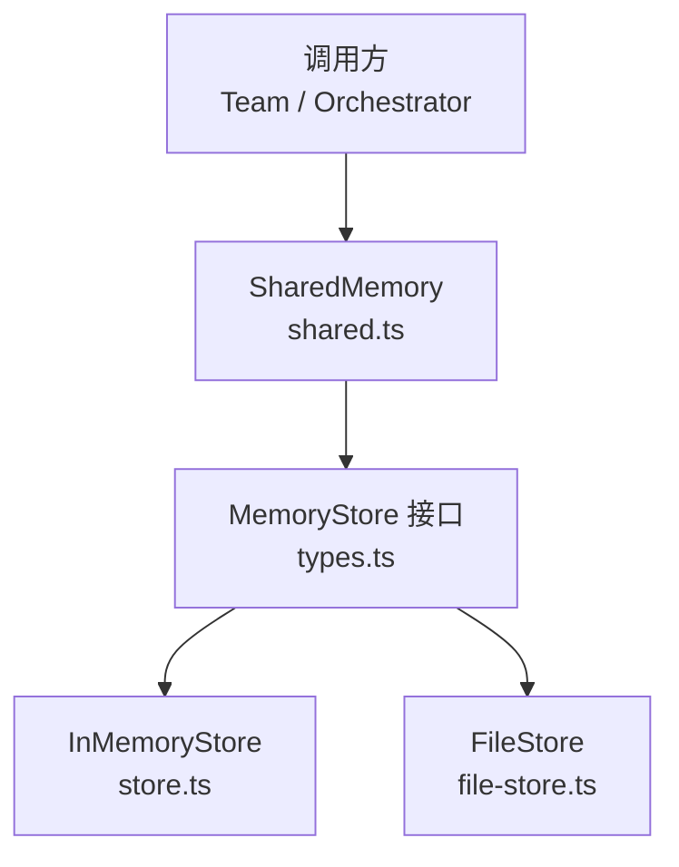
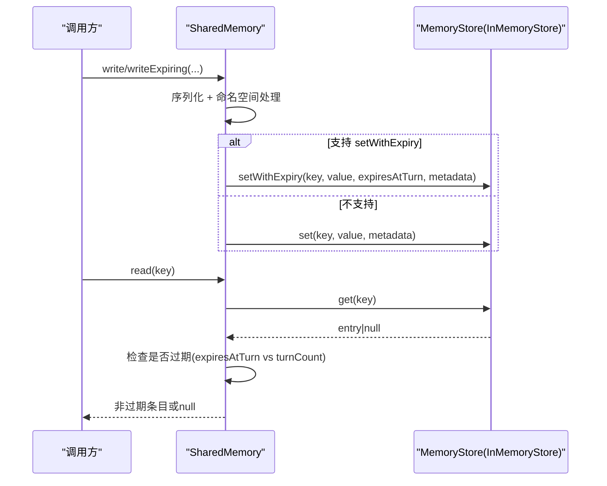
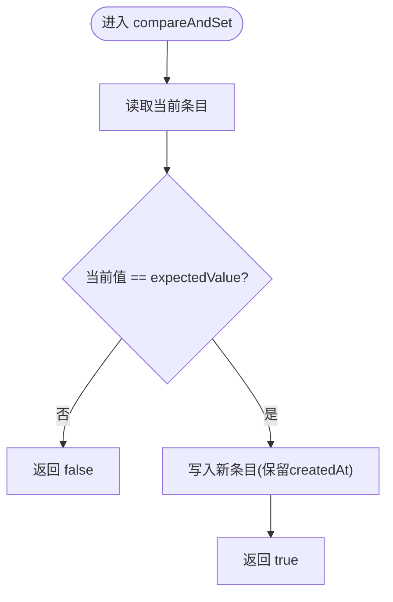
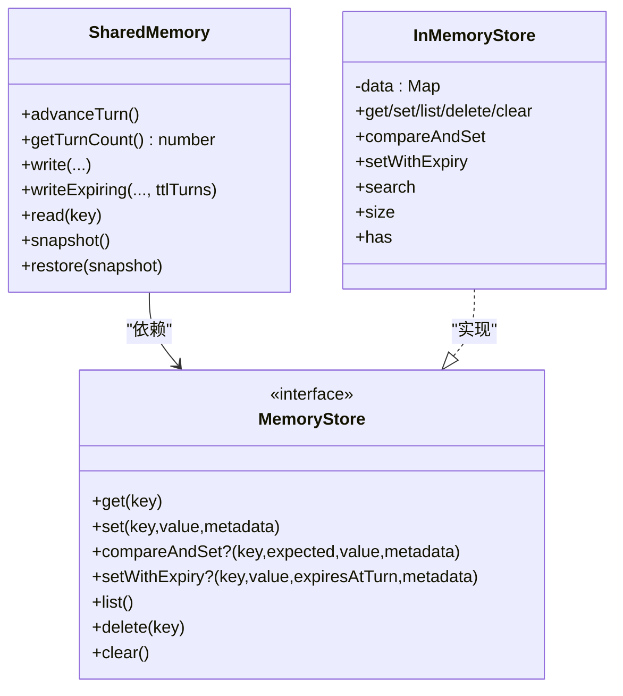
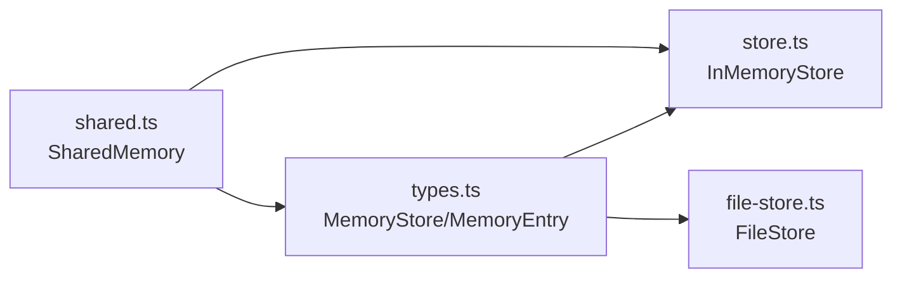

# InMemoryStore 内存存储

<cite>
**本文引用的文件**
- [store.ts](file://packages/core/src/memory/store.ts)
- [types.ts](file://packages/core/src/types.ts)
- [shared.ts](file://packages/core/src/memory/shared.ts)
- [file-store.ts](file://packages/core/src/memory/file-store.ts)
</cite>

## 目录
1. [简介](#简介)
2. [项目结构](#项目结构)
3. [核心组件](#核心组件)
4. [架构总览](#架构总览)
5. [详细组件分析](#详细组件分析)
6. [依赖关系分析](#依赖关系分析)
7. [性能考量](#性能考量)
8. [故障排查指南](#故障排查指南)
9. [结论](#结论)
10. [附录](#附录)

## 简介
InMemoryStore 是 MemoryStore 的进程内实现，基于 JavaScript Map 提供键值对存储。它不持久化到磁盘，适合测试、单进程应用与开发调试场景。其设计目标是：
- 简单可靠：以 Map 为唯一数据源，读写路径短且可预测
- 接口一致：遵循 MemoryStore 接口，便于替换为 Redis/SQLite 等后端
- 扩展友好：提供 search、size、has 等便捷方法，提升使用体验

## 项目结构
本仓库中与 InMemoryStore 相关的代码主要位于 core 包的 memory 模块与类型定义中：
- store.ts：InMemoryStore 的具体实现
- types.ts：MemoryStore 接口与 MemoryEntry 数据结构定义
- shared.ts：SharedMemory 高层抽象，默认使用 InMemoryStore，并负责 TTL（按轮次过期）逻辑
- file-store.ts：另一种 MemoryStore 实现（基于文件系统），用于对比与说明持久化方案

图表来源
- [shared.ts:90-98](file://packages/core/src/memory/shared.ts#L90-L98)
- [types.ts:2842-2872](file://packages/core/src/types.ts#L2842-L2872)
- [store.ts:31-166](file://packages/core/src/memory/store.ts#L31-L166)
- [file-store.ts:102-206](file://packages/core/src/memory/file-store.ts#L102-L206)

章节来源
- [store.ts:1-166](file://packages/core/src/memory/store.ts#L1-L166)
- [types.ts:2824-2872](file://packages/core/src/types.ts#L2824-L2872)
- [shared.ts:90-98](file://packages/core/src/memory/shared.ts#L90-L98)

## 核心组件
- InMemoryStore：基于 Map 的进程内键值存储，提供 get/set/list/delete/clear、可选的 compareAndSet 与 setWithExpiry，以及 search/size/has 等扩展能力
- MemoryStore 接口：定义标准读写与可选原子更新、TTL 写入、列表与清理操作
- MemoryEntry：记录 key/value/metadata/createdAt/expiresAtTurn 的数据条目
- SharedMemory：高层共享内存抽象，默认使用 InMemoryStore，负责命名空间、序列化、TTL 计算与过期过滤

章节来源
- [store.ts:31-166](file://packages/core/src/memory/store.ts#L31-L166)
- [types.ts:2824-2872](file://packages/core/src/types.ts#L2824-L2872)
- [shared.ts:90-98](file://packages/core/src/memory/shared.ts#L90-L98)

## 架构总览
InMemoryStore 作为 MemoryStore 的一种实现，被 SharedMemory 在构造时默认注入。SharedMemory 负责：
- 将结构化值序列化为字符串后写入底层 store
- 通过 advanceTurn 推进“轮次”计数器
- 写带 TTL 的条目时计算 expiresAtTurn 并调用 store.setWithExpiry（若存在）
- 读时根据当前 turnCount 过滤已过期条目

图表来源
- [shared.ts:204-269](file://packages/core/src/memory/shared.ts#L204-L269)
- [shared.ts:285-289](file://packages/core/src/memory/shared.ts#L285-L289)
- [store.ts:89-104](file://packages/core/src/memory/store.ts#L89-L104)

## 详细组件分析

### 数据结构与内存管理
- 内部容器：Map<string, MemoryEntry>
  - 键：字符串键
  - 值：MemoryEntry，包含 key/value/metadata/createdAt/expiresAtTurn
- 内存管理策略：
  - 无显式淘汰或压缩；条目生命周期由调用方控制（delete/clear）或由上层 TTL 语义决定
  - createdAt 在首次写入时记录，后续更新保留，便于区分“新建”和“覆盖”
  - metadata 在写入时浅拷贝，避免外部对象意外修改影响存储内容

复杂度与特性
- get/set/delete/has/size：平均 O(1)
- list/search：O(n)，n 为条目数
- 内存占用：与条目数量及 value/metadata 大小线性相关

章节来源
- [store.ts:31-62](file://packages/core/src/memory/store.ts#L31-L62)
- [types.ts:2824-2836](file://packages/core/src/types.ts#L2824-L2836)

### 核心方法实现逻辑

#### get(key)
- 从 Map 获取对应条目，不存在返回 null
- 时间复杂度 O(1)

章节来源
- [store.ts:38-41](file://packages/core/src/memory/store.ts#L38-L41)

#### set(key, value, metadata?)
- 若 key 已存在，保留原 createdAt；否则创建新 Date
- metadata 浅拷贝后存入
- 时间复杂度 O(1)

章节来源
- [store.ts:43-62](file://packages/core/src/memory/store.ts#L43-L62)

#### compareAndSet(key, expectedValue, value, metadata?)
- 原子性保证：在同一线程/事件循环中，读取与写入是连续的，不会被其他同步代码打断
- 比较逻辑：若当前条目的 value 与 expectedValue 不一致（包括不存在时为 null），则直接返回 false，不写入
- 成功时写入新条目并保留 createdAt
- 注意：这是进程内原子性；跨进程需使用支持 CAS 的后端（如 Redis）

图表来源
- [store.ts:64-80](file://packages/core/src/memory/store.ts#L64-L80)

章节来源
- [store.ts:64-80](file://packages/core/src/memory/store.ts#L64-L80)

#### setWithExpiry(key, value, expiresAtTurn, metadata?)
- 记录 expiresAtTurn，表示该条目在达到指定“轮次”时被视为过期
- 实际过期判断由上层 SharedMemory 在读取时进行（比较当前 turnCount 与 expiresAtTurn）
- 若底层 store 未实现该方法，SharedMemory 会回退到普通 set，TTL 语义失效

章节来源
- [store.ts:82-104](file://packages/core/src/memory/store.ts#L82-L104)
- [shared.ts:245-269](file://packages/core/src/memory/shared.ts#L245-L269)

#### list()
- 返回所有条目的快照（插入顺序）
- 时间复杂度 O(n)

章节来源
- [store.ts:106-109](file://packages/core/src/memory/store.ts#L106-L109)

#### delete(key) / clear()
- delete：删除指定键，不存在时无操作
- clear：清空全部条目

章节来源
- [store.ts:111-122](file://packages/core/src/memory/store.ts#L111-L122)

#### search(query)
- 行为：当 query 为空时返回全部条目；否则对每个条目进行 key/value 的小写子串匹配
- 复杂度：O(n)，适用于中小规模数据集或测试环境
- 适用场景：快速定位、调试、小规模检索；大数据量建议引入索引层

章节来源
- [store.ts:128-151](file://packages/core/src/memory/store.ts#L128-L151)

#### size / has
- size：返回当前条目数量
- has：判断键是否存在
- 均为 O(1) 便捷方法

章节来源
- [store.ts:157-165](file://packages/core/src/memory/store.ts#L157-L165)

### 与 SharedMemory 的协作
- SharedMemory 默认使用 InMemoryStore
- 写入：write 将结构化值序列化为字符串后写入；writeExpiring 计算 expiresAtTurn 并调用 setWithExpiry（若可用）
- 读取：read 获取条目后，依据当前 turnCount 与 expiresAtTurn 判断是否过期
- 快照/恢复：snapshot 仅包含非过期条目；restore 会重建条目并恢复 turnCount

图表来源
- [shared.ts:90-98](file://packages/core/src/memory/shared.ts#L90-L98)
- [shared.ts:204-269](file://packages/core/src/memory/shared.ts#L204-L269)
- [shared.ts:285-289](file://packages/core/src/memory/shared.ts#L285-L289)
- [store.ts:31-166](file://packages/core/src/memory/store.ts#L31-L166)
- [types.ts:2842-2872](file://packages/core/src/types.ts#L2842-L2872)

## 依赖关系分析
- InMemoryStore 依赖：
  - MemoryStore 接口与 MemoryEntry 类型（types.ts）
- SharedMemory 依赖：
  - MemoryStore 接口，默认实例化 InMemoryStore
  - 通过 setWithExpiry 可选能力实现 TTL 语义
- FileStore 同样实现 MemoryStore，可作为持久化替代方案

图表来源
- [types.ts:2824-2872](file://packages/core/src/types.ts#L2824-L2872)
- [store.ts:31-166](file://packages/core/src/memory/store.ts#L31-L166)
- [file-store.ts:102-206](file://packages/core/src/memory/file-store.ts#L102-L206)
- [shared.ts:90-98](file://packages/core/src/memory/shared.ts#L90-L98)

章节来源
- [types.ts:2824-2872](file://packages/core/src/types.ts#L2824-L2872)
- [store.ts:31-166](file://packages/core/src/memory/store.ts#L31-L166)
- [shared.ts:90-98](file://packages/core/src/memory/shared.ts#L90-L98)

## 性能考量
- 时间复杂度
  - get/set/delete/has/size：O(1)
  - list/search：O(n)
- 内存占用
  - 与条目数量、value/metadata 大小线性增长
  - 无自动回收；需要显式 delete/clear 或通过 TTL 语义配合上层清理
- 并发与原子性
  - 单进程内：compareAndSet 在事件循环中是原子的（无中断）
  - 多进程：需使用支持跨进程 CAS 的后端（如 Redis）
- 搜索性能
  - search 为线性扫描，适合小数据集或测试；生产环境大数据量建议引入索引或改用支持全文检索的后端
- 与 FileStore 对比
  - FileStore 每次写都会落盘，吞吐较低但具备持久化能力；InMemoryStore 更快但不持久
  - 推荐组合：共享内存用 InMemoryStore，检查点用 FileStore，兼顾性能与可恢复性

[本节为通用性能讨论，不直接分析具体文件]

## 故障排查指南
- 常见问题
  - 误以为 compareAndSet 跨进程安全：InMemoryStore 仅在单进程内有效；跨进程请使用支持 CAS 的后端
  - TTL 未生效：若底层 store 未实现 setWithExpiry，SharedMemory 会回退到普通 set，TTL 语义丢失
  - 搜索慢：search 为 O(n)，数据量大时应考虑分片、索引或更换后端
- 诊断建议
  - 使用 size/has 快速确认状态
  - 使用 list 导出快照，结合 search 定位问题条目
  - 在 SharedMemory 侧检查 turnCount 与 expiresAtTurn 的关系，确认过期逻辑是否符合预期

章节来源
- [store.ts:64-80](file://packages/core/src/memory/store.ts#L64-L80)
- [store.ts:82-104](file://packages/core/src/memory/store.ts#L82-L104)
- [store.ts:128-151](file://packages/core/src/memory/store.ts#L128-L151)
- [shared.ts:245-269](file://packages/core/src/memory/shared.ts#L245-L269)

## 结论
InMemoryStore 以简洁高效的 Map 实现提供了高性能的进程内键值存储，满足测试、单进程应用与开发调试需求。其 compareAndSet 提供进程内原子更新，setWithExpiry 配合 SharedMemory 实现按轮次的 TTL 语义。对于大规模数据或多进程场景，应评估使用支持索引与跨进程 CAS 的持久化后端。

[本节为总结性内容，不直接分析具体文件]

## 附录

### 使用场景与最佳实践
- 测试环境
  - 使用 InMemoryStore 获得最快反馈；必要时结合 search/size/has 断言状态
- 单进程应用
  - 共享内存使用 InMemoryStore；如需持久化，单独使用 FileStore 做检查点
- 开发调试
  - 利用 search 快速定位键值；通过 list 导出快照辅助排障

章节来源
- [shared.ts:90-98](file://packages/core/src/memory/shared.ts#L90-L98)
- [file-store.ts:19-26](file://packages/core/src/memory/file-store.ts#L19-L26)

### 性能基准与优化建议
- 基准建议
  - 针对 get/set/list/search 分别建立基准用例，测量不同数据规模下的耗时
  - 关注 search 在 n 增大时的退化情况
- 内存优化
  - 及时 delete/clear 不再需要的条目
  - 合理拆分 key 空间，避免单键过大导致内存抖动
  - 对频繁更新的热点键，考虑合并写入或批处理
- 搜索优化
  - 小数据量：直接使用 search
  - 大数据量：引入前缀索引或全文索引；或将查询下推到支持检索的后端

[本节为通用指导，不直接分析具体文件]