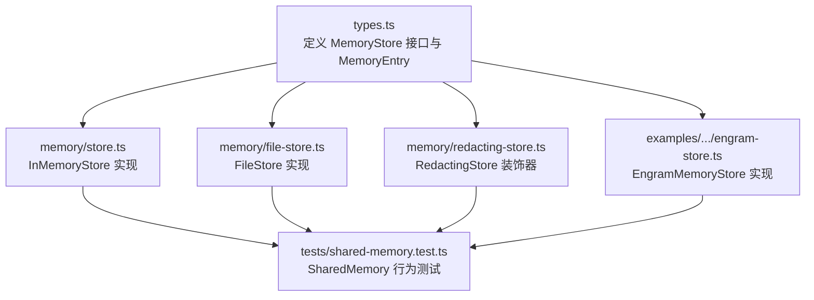
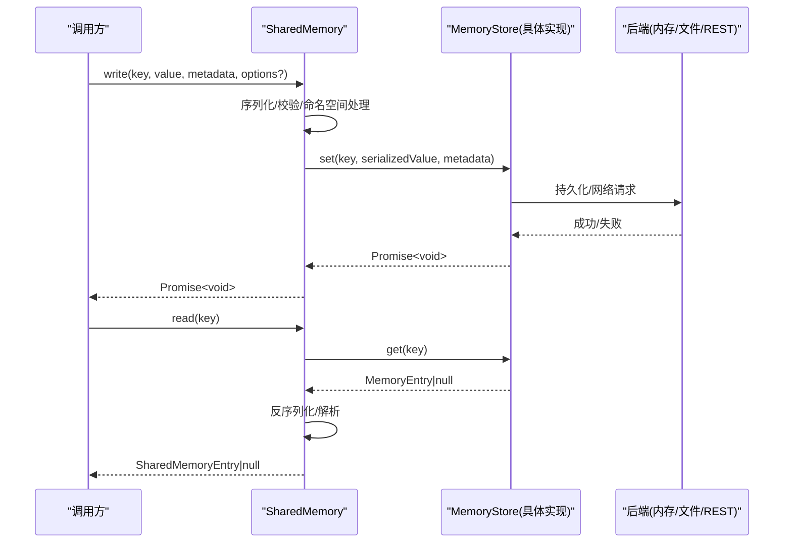
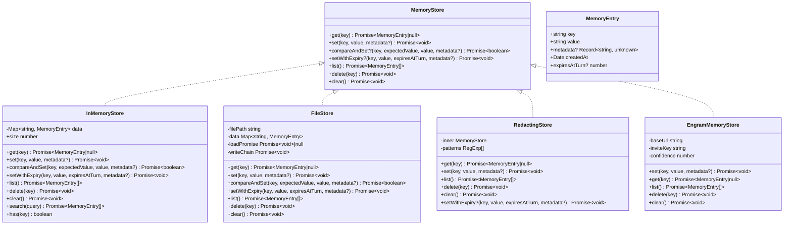
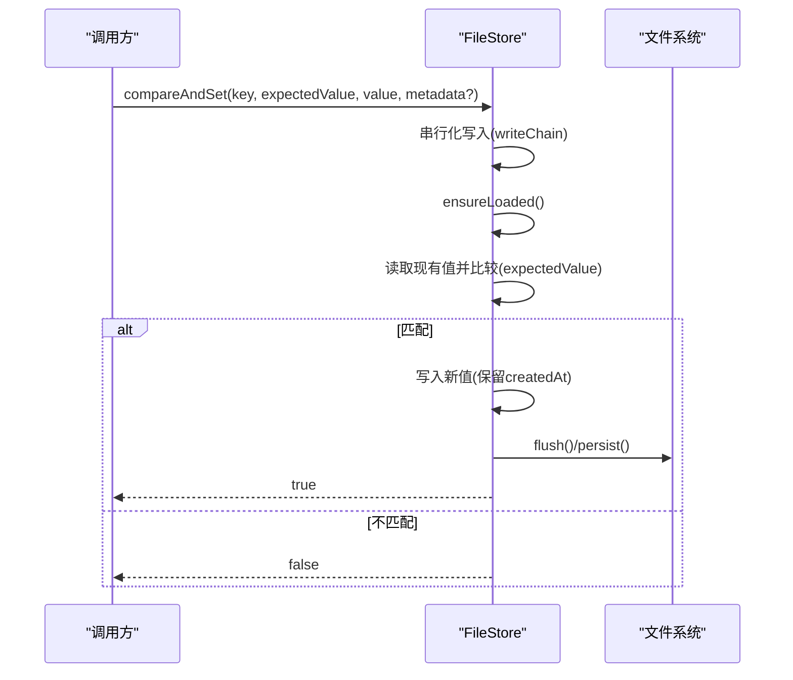
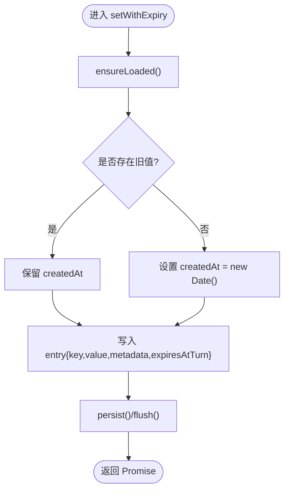
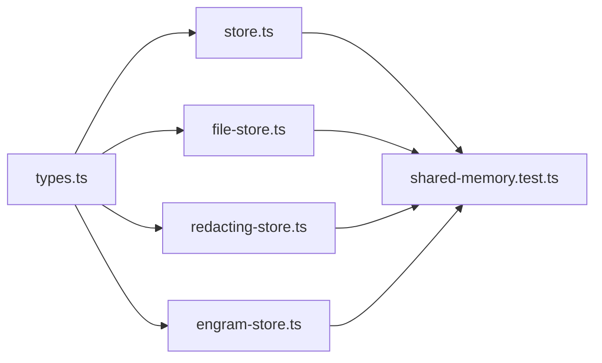

# MemoryStore 接口规范

<cite>
**本文引用的文件**
- [types.ts](file://packages/core/src/types.ts)
- [store.ts](file://packages/core/src/memory/store.ts)
- [file-store.ts](file://packages/core/src/memory/file-store.ts)
- [redacting-store.ts](file://packages/core/src/memory/redacting-store.ts)
- [engram-store.ts](file://packages/core/examples/integrations/with-engram/engram-store.ts)
- [shared-memory.test.ts](file://packages/core/tests/shared-memory.test.ts)
</cite>

## 目录
1. [简介](#简介)
2. [项目结构](#项目结构)
3. [核心组件](#核心组件)
4. [架构总览](#架构总览)
5. [详细组件分析](#详细组件分析)
6. [依赖关系分析](#依赖关系分析)
7. [性能考量](#性能考量)
8. [故障排查指南](#故障排查指南)
9. [结论](#结论)
10. [附录：使用示例与最佳实践](#附录使用示例与最佳实践)

## 简介
MemoryStore 是跨代理共享的键值存储抽象，用于在多个代理之间持久化或临时共享数据。该接口以异步方式暴露基本操作（get、set、compareAndSet、setWithExpiry、list、delete、clear），并提供统一的数据模型 MemoryEntry，使上层 SharedMemory 等组件可以以一致的方式读写不同后端的存储实现（内存、文件、Redis、SQLite、远程 REST 服务等）。

本规范聚焦于：
- 接口设计理念与异步设计原则
- 各方法的语义与返回值约定
- MemoryEntry 字段含义与使用场景
- 扩展性设计与多后端支持策略
- 实现最佳实践与注意事项
- 结合仓库中已有实现的代码级示例路径

## 项目结构
MemoryStore 相关代码主要位于 core 包中：
- 类型定义：types.ts
- 默认内存实现：memory/store.ts
- 文件持久化实现：memory/file-store.ts
- 敏感信息脱敏装饰器：memory/redacting-store.ts
- 第三方集成示例：examples/integrations/.../engram-store.ts
- 行为测试用例：tests/shared-memory.test.ts

图表来源
- [types.ts:2824-2872](file://packages/core/src/types.ts#L2824-L2872)
- [store.ts:31-122](file://packages/core/src/memory/store.ts#L31-L122)
- [file-store.ts:80-206](file://packages/core/src/memory/file-store.ts#L80-L206)
- [redacting-store.ts:48-95](file://packages/core/src/memory/redacting-store.ts#L48-L95)
- [engram-store.ts:48-137](file://packages/core/examples/integrations/with-engram/engram-store.ts#L48-L137)
- [shared-memory.test.ts:1-200](file://packages/core/tests/shared-memory.test.ts#L1-L200)

章节来源
- [types.ts:2824-2872](file://packages/core/src/types.ts#L2824-L2872)
- [store.ts:1-167](file://packages/core/src/memory/store.ts#L1-L167)
- [file-store.ts:1-279](file://packages/core/src/memory/file-store.ts#L1-L279)
- [redacting-store.ts:1-129](file://packages/core/src/memory/redacting-store.ts#L1-L129)
- [engram-store.ts:1-188](file://packages/core/examples/integrations/with-engram/engram-store.ts#L1-L188)
- [shared-memory.test.ts:1-200](file://packages/core/tests/shared-memory.test.ts#L1-L200)

## 核心组件
- MemoryStore 接口：定义统一的异步键值存储 API，包括读取、写入、条件更新、带过期写入、列举、删除、清空。
- MemoryEntry：存储条目模型，包含键、字符串值、可选元数据、创建时间以及可选的“按轮次过期”标记。
- InMemoryStore：基于 Map 的内存实现，适合单进程与测试。
- FileStore：基于 JSON 文件的持久化实现，提供原子写入与进程内并发安全。
- RedactingStore：对底层存储进行装饰，在写入时对值进行敏感信息脱敏。
- EngramMemoryStore：通过 REST API 将 MemoryStore 映射到远端事实存储。

章节来源
- [types.ts:2824-2872](file://packages/core/src/types.ts#L2824-L2872)
- [store.ts:31-122](file://packages/core/src/memory/store.ts#L31-L122)
- [file-store.ts:80-206](file://packages/core/src/memory/file-store.ts#L80-L206)
- [redacting-store.ts:48-95](file://packages/core/src/memory/redacting-store.ts#L48-L95)
- [engram-store.ts:48-137](file://packages/core/examples/integrations/with-engram/engram-store.ts#L48-L137)

## 架构总览
MemoryStore 作为抽象层，屏蔽了不同后端的差异；上层 SharedMemory 通过该接口进行读写，并负责命名空间隔离、结构化值序列化/反序列化、校验与摘要生成等。

图表来源
- [types.ts:2824-2872](file://packages/core/src/types.ts#L2824-L2872)
- [store.ts:31-122](file://packages/core/src/memory/store.ts#L31-L122)
- [file-store.ts:80-206](file://packages/core/src/memory/file-store.ts#L80-L206)
- [engram-store.ts:48-137](file://packages/core/examples/integrations/with-engram/engram-store.ts#L48-L137)
- [shared-memory.test.ts:1-200](file://packages/core/tests/shared-memory.test.ts#L1-L200)

## 详细组件分析

### MemoryStore 接口与方法语义
- get(key): 异步获取条目。返回 MemoryEntry 或 null。
- set(key, value, metadata?): 异步写入字符串值，可附带元数据。
- compareAndSet?(key, expectedValue, value, metadata?): 可选的原子比较并设置。expectedValue 为 null 表示键必须不存在。若后端无法保证原子性，可省略该方法；上层应降级处理。
- setWithExpiry?(key, value, expiresAtTurn, metadata?): 可选的带“按轮次过期”写入。未实现时，TTL 语义由调用方决定不强制。
- list(): 异步列举所有条目，返回 MemoryEntry 数组。
- delete(key): 异步删除指定键。
- clear(): 异步清空所有条目。

注意：
- 所有方法均为异步 Promise 风格，便于替换为 I/O 密集型后端。
- compareAndSet 与 setWithExpiry 为可选方法，体现接口的渐进增强与向后兼容。

章节来源
- [types.ts:2824-2872](file://packages/core/src/types.ts#L2824-L2872)

### MemoryEntry 数据结构
- key: 字符串键。
- value: 字符串值（底层存储仅接受字符串；结构化数据由上层序列化）。
- metadata?: 可选元数据，记录附加信息（如 agent、kind、fact_id 等）。
- createdAt: 创建时间，用于判断首次写入与生命周期。
- expiresAtTurn?: 可选的“按轮次过期”标记，由调用方计算并在读取时过滤。

章节来源
- [types.ts:2824-2836](file://packages/core/src/types.ts#L2824-L2836)

### InMemoryStore（内存实现）
- 基于 Map 的简单实现，适合测试与单进程场景。
- 保持 set 时的 createdAt 不变（覆盖时保留原创建时间）。
- 提供 search、size、has 等扩展能力（非接口必需）。

章节来源
- [store.ts:31-167](file://packages/core/src/memory/store.ts#L31-L167)

### FileStore（文件持久化实现）
- 单 JSON 文件持久化，内存 Map 镜像状态。
- 原子写入：写临时文件 -> fsync -> rename，确保一致性。
- 进程内并发安全：写链串行化，避免丢失写入。
- 支持 compareAndSet 与 setWithExpiry。
- 列表返回插入顺序快照。

章节来源
- [file-store.ts:80-206](file://packages/core/src/memory/file-store.ts#L80-L206)
- [file-store.ts:212-281](file://packages/core/src/memory/file-store.ts#L212-L281)

### RedactingStore（脱敏装饰器）
- 在写入时对值进行敏感信息脱敏，读路径透传。
- 若被包装的后端实现了 setWithExpiry，则装饰器也暴露该方法以保持能力探测正确。
- 不提供 compareAndSet，因为内容哈希会因脱敏变化，影响审批流程。

章节来源
- [redacting-store.ts:48-129](file://packages/core/src/memory/redacting-store.ts#L48-L129)

### EngramMemoryStore（远程 REST 实现）
- 将 MemoryStore 映射到 Engram 的 REST API。
- set 使用 update 操作覆盖同一 scope 的值。
- get 查询最新 fact，list 列出最多 200 条。
- delete 通过 lineage 机制退役最新 fact。
- clear 为 no-op，遵循 append-only 审计历史约束。

章节来源
- [engram-store.ts:48-188](file://packages/core/examples/integrations/with-engram/engram-store.ts#L48-L188)

### 类图（实际代码结构）

图表来源
- [types.ts:2824-2872](file://packages/core/src/types.ts#L2824-L2872)
- [store.ts:31-167](file://packages/core/src/memory/store.ts#L31-L167)
- [file-store.ts:80-206](file://packages/core/src/memory/file-store.ts#L80-L206)
- [redacting-store.ts:48-129](file://packages/core/src/memory/redacting-store.ts#L48-L129)
- [engram-store.ts:48-188](file://packages/core/examples/integrations/with-engram/engram-store.ts#L48-L188)

### 序列图（compareAndSet 流程，以 FileStore 为例）

图表来源
- [file-store.ts:135-159](file://packages/core/src/memory/file-store.ts#L135-L159)
- [file-store.ts:212-281](file://packages/core/src/memory/file-store.ts#L212-L281)

### 流程图（setWithExpiry 写入逻辑）

图表来源
- [file-store.ts:166-182](file://packages/core/src/memory/file-store.ts#L166-L182)
- [store.ts:89-104](file://packages/core/src/memory/store.ts#L89-L104)

## 依赖关系分析
- types.ts 定义了接口与数据模型，是所有实现的契约。
- store.ts、file-store.ts、redacting-store.ts、engram-store.ts 均依赖 types.ts。
- tests/shared-memory.test.ts 通过 SharedMemory 间接验证 MemoryStore 的行为（命名空间、元数据、结构化值、脱敏等）。

图表来源
- [types.ts:2824-2872](file://packages/core/src/types.ts#L2824-L2872)
- [store.ts:10-167](file://packages/core/src/memory/store.ts#L10-L167)
- [file-store.ts:47-206](file://packages/core/src/memory/file-store.ts#L47-L206)
- [redacting-store.ts:25-129](file://packages/core/src/memory/redacting-store.ts#L25-L129)
- [engram-store.ts:16-188](file://packages/core/examples/integrations/with-engram/engram-store.ts#L16-L188)
- [shared-memory.test.ts:1-200](file://packages/core/tests/shared-memory.test.ts#L1-L200)

章节来源
- [types.ts:2824-2872](file://packages/core/src/types.ts#L2824-L2872)
- [store.ts:10-167](file://packages/core/src/memory/store.ts#L10-L167)
- [file-store.ts:47-206](file://packages/core/src/memory/file-store.ts#L47-L206)
- [redacting-store.ts:25-129](file://packages/core/src/memory/redacting-store.ts#L25-L129)
- [engram-store.ts:16-188](file://packages/core/examples/integrations/with-engram/engram-store.ts#L16-L188)
- [shared-memory.test.ts:1-200](file://packages/core/tests/shared-memory.test.ts#L1-L200)

## 性能考量
- InMemoryStore：O(1) 读写，适合测试与单进程；无持久化。
- FileStore：每次写入重写整个 JSON 文件，适合中小规模数据；原子写入保障一致性；进程内并发通过写链串行化。
- RedactingStore：写入时进行 JSON 结构解析与脱敏，带来额外 CPU 开销；读路径无额外成本。
- EngramMemoryStore：网络 I/O 延迟与限流需考虑；list 限制 200 条；clear 为 no-op 符合 append-only 约束。

[本节为通用指导，不直接分析具体文件]

## 故障排查指南
- 文件损坏或格式错误：FileStore 在加载时会校验版本与 entries 字段，非法 JSON 或结构将抛出错误，需检查并修复状态文件。
- 权限与磁盘空间：写入失败可能由于 ENOSPC 或权限不足；需确保目录存在且可写。
- 网络错误：EngramMemoryStore 的 post/get 失败会抛出包含状态码的错误信息；检查 baseUrl、邀请密钥与网络连通性。
- 对比失败：compareAndSet 返回 false 表示当前值与期望不一致；需重试或调整预期值。
- 脱敏导致审批失败：RedactingStore 不提供 compareAndSet，因为内容哈希变化会影响审批；如需审批，请使用非脱敏的批准/检查点存储。

章节来源
- [file-store.ts:220-281](file://packages/core/src/memory/file-store.ts#L220-L281)
- [engram-store.ts:162-173](file://packages/core/examples/integrations/with-engram/engram-store.ts#L162-L173)
- [redacting-store.ts:43-47](file://packages/core/src/memory/redacting-store.ts#L43-L47)

## 结论
MemoryStore 通过简洁的异步接口与统一的数据模型，为多代理共享存储提供了可扩展的抽象。其可选方法（compareAndSet、setWithExpiry）体现了渐进增强与兼容性设计；多种实现覆盖了从内存到文件再到远程服务的典型场景。配合 SharedMemory 的命名空间、序列化与校验能力，可在复杂工作流中可靠地管理共享状态。

[本节为总结，不直接分析具体文件]

## 附录：使用示例与最佳实践

### 使用示例（代码片段路径）
- 内存存储基础用法：
  - [store.ts:24-30](file://packages/core/src/memory/store.ts#L24-L30)
- 文件存储作为检查点：
  - [file-store.ts:33-44](file://packages/core/src/memory/file-store.ts#L33-L44)
- 使用 RedactingStore 包裹 FileStore：
  - [redacting-store.ts:11-22](file://packages/core/src/memory/redacting-store.ts#L11-L22)
- Engram 远程存储示例：
  - [engram-store.ts:1-14](file://packages/core/examples/integrations/with-engram/engram-store.ts#L1-L14)

### 最佳实践与注意事项
- 始终使用字符串值：底层 MemoryStore 仅接受字符串；结构化数据在上层序列化/反序列化。
- 合理使用 compareAndSet：需要原子更新时使用；若后端不支持，上层应降级并避免强依赖。
- 谨慎使用 setWithExpiry：未实现时 TTL 语义由调用方控制；不要假设所有后端都支持过期。
- 元数据用途：记录 agent、kind、fact_id 等上下文信息，便于追踪与调试。
- 持久化策略：高频写入建议使用 InMemoryStore 作为共享内存，另配 FileStore 作为检查点存储，降低 I/O 压力。
- 安全与合规：对敏感信息进行脱敏；必要时使用独立的非脱敏存储用于审批与审计。
- 错误处理：捕获并记录网络与磁盘错误；对 compareAndSet 的失败进行重试或回退。

章节来源
- [store.ts:24-30](file://packages/core/src/memory/store.ts#L24-L30)
- [file-store.ts:33-44](file://packages/core/src/memory/file-store.ts#L33-L44)
- [redacting-store.ts:11-22](file://packages/core/src/memory/redacting-store.ts#L11-L22)
- [engram-store.ts:1-14](file://packages/core/examples/integrations/with-engram/engram-store.ts#L1-L14)
- [shared-memory.test.ts:72-91](file://packages/core/tests/shared-memory.test.ts#L72-L91)
- [shared-memory.test.ts:125-165](file://packages/core/tests/shared-memory.test.ts#L125-L165)