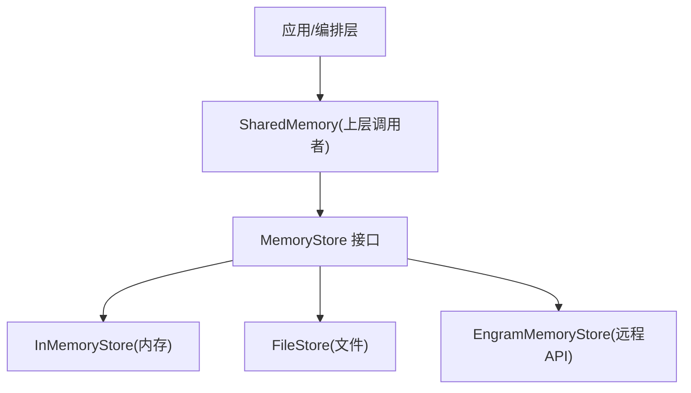
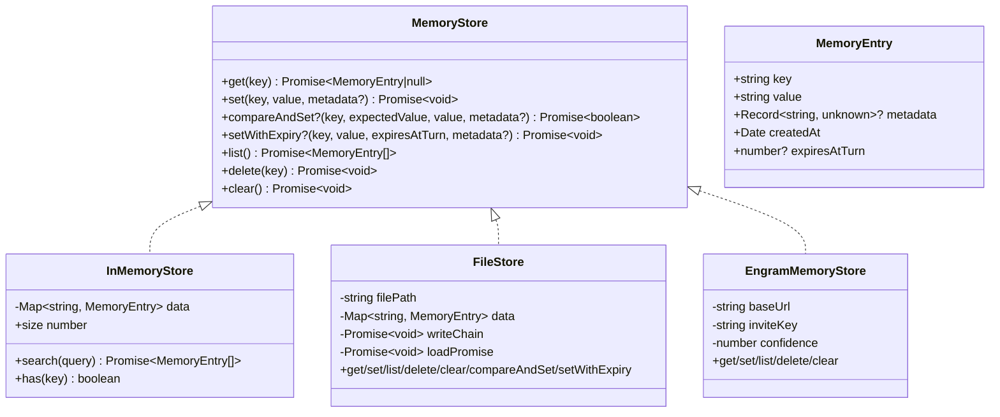
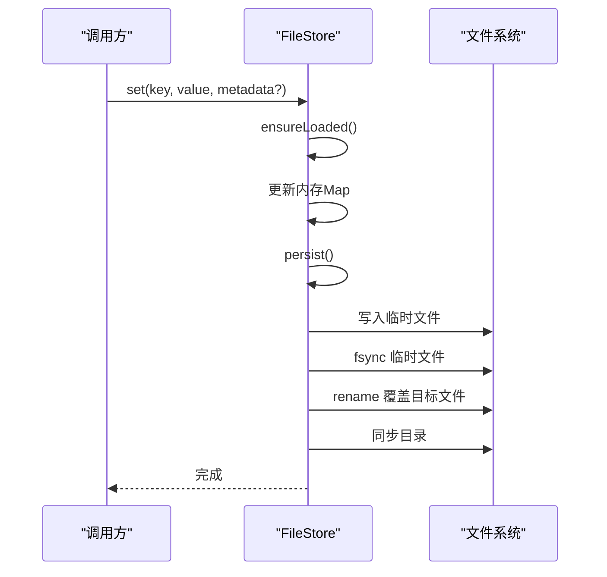
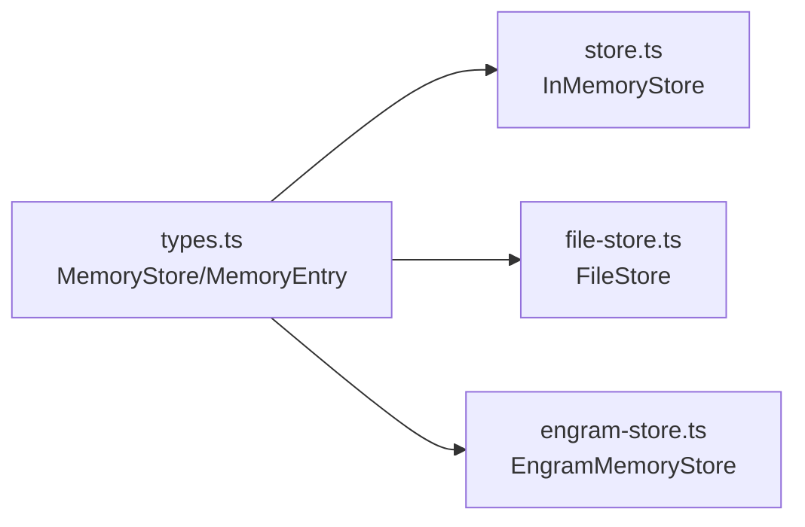

# 存储后端

<cite>
**本文引用的文件**
- [types.ts](file://packages/core/src/types.ts)
- [store.ts](file://packages/core/src/memory/store.ts)
- [file-store.ts](file://packages/core/src/memory/file-store.ts)
- [engram-store.ts](file://packages/core/examples/integrations/with-engram/engram-store.ts)
</cite>

## 目录
1. [简介](#简介)
2. [项目结构](#项目结构)
3. [核心组件](#核心组件)
4. [架构总览](#架构总览)
5. [详细组件分析](#详细组件分析)
6. [依赖关系分析](#依赖关系分析)
7. [性能考量](#性能考量)
8. [故障排查指南](#故障排查指南)
9. [结论](#结论)
10. [附录：配置与安全最佳实践](#附录配置与安全最佳实践)

## 简介
本章节面向 Open Multi-Agent 的“存储后端”子系统，聚焦 MemoryStore 抽象接口与两种内置实现：InMemoryStore（内存）与 FileStore（文件）。文档将解释接口设计理念、扩展机制、数据模型、持久化策略、并发与一致性保证、适用场景与选型建议，并提供自定义存储后端的开发指南、数据迁移策略与性能优化技巧。

## 项目结构
存储相关代码集中在 core 包的 memory 子模块与类型定义中，示例中还包含第三方存储集成参考实现：
- 类型定义：packages/core/src/types.ts（MemoryStore、MemoryEntry 等）
- 内存实现：packages/core/src/memory/store.ts（InMemoryStore）
- 文件实现：packages/core/src/memory/file-store.ts（FileStore）
- 第三方集成示例：packages/core/examples/integrations/with-engram/engram-store.ts（EngramMemoryStore）

图表来源
- [types.ts:2824-2872](file://packages/core/src/types.ts#L2824-L2872)
- [store.ts:31-166](file://packages/core/src/memory/store.ts#L31-L166)
- [file-store.ts:80-206](file://packages/core/src/memory/file-store.ts#L80-L206)
- [engram-store.ts:48-188](file://packages/core/examples/integrations/with-engram/engram-store.ts#L48-L188)

章节来源
- [types.ts:2824-2872](file://packages/core/src/types.ts#L2824-L2872)
- [store.ts:1-167](file://packages/core/src/memory/store.ts#L1-L167)
- [file-store.ts:1-381](file://packages/core/src/memory/file-store.ts#L1-L381)
- [engram-store.ts:1-188](file://packages/core/examples/integrations/with-engram/engram-store.ts#L1-L188)

## 核心组件
- MemoryStore 接口：定义跨代理共享键值存储的统一契约，包括 get/set/list/delete/clear，以及可选的 compareAndSet 与 setWithExpiry。
- MemoryEntry：单条记录的数据模型，包含 key/value/metadata/createdAt/expiresAtTurn。
- InMemoryStore：基于 Map 的内存实现，提供高性能读写、可选搜索与便捷方法。
- FileStore：基于单个 JSON 文件的持久化实现，具备原子写入、进程内并发安全、版本校验与损坏保护。
- EngramMemoryStore（示例）：通过 REST API 实现的远程存储，展示如何适配外部系统。

章节来源
- [types.ts:2824-2872](file://packages/core/src/types.ts#L2824-L2872)
- [store.ts:31-166](file://packages/core/src/memory/store.ts#L31-L166)
- [file-store.ts:80-206](file://packages/core/src/memory/file-store.ts#L80-L206)
- [engram-store.ts:48-188](file://packages/core/examples/integrations/with-engram/engram-store.ts#L48-L188)

## 架构总览
MemoryStore 作为统一抽象，屏蔽底层存储差异。上层 SharedMemory 仅依赖接口进行读写、列表与删除等操作；可选能力（CAS、TTL）由具体实现决定是否支持。

图表来源
- [types.ts:2824-2872](file://packages/core/src/types.ts#L2824-L2872)
- [store.ts:31-166](file://packages/core/src/memory/store.ts#L31-L166)
- [file-store.ts:80-206](file://packages/core/src/memory/file-store.ts#L80-L206)
- [engram-store.ts:48-188](file://packages/core/examples/integrations/with-engram/engram-store.ts#L48-L188)

## 详细组件分析

### MemoryStore 抽象接口与扩展机制
- 基础能力：get/set/list/delete/clear，覆盖常见 KV 操作。
- 可选能力：
  - compareAndSet：用于需要原子比较并替换的场景（如可挂起审批），未实现时上层应降级处理。
  - setWithExpiry：以“轮次计数”为单位的过期语义，未实现时上层不强制 TTL。
- 设计要点：
  - 所有值在存储层均为字符串，结构化数据由调用方序列化。
  - 元数据 metadata 允许附加任意键值信息，便于审计或路由。
  - createdAt 保留首次创建时间，更新不改变，便于追踪生命周期。
  - expiresAtTurn 由上层计算写入，存储层只负责持久化（若支持）。

章节来源
- [types.ts:2824-2872](file://packages/core/src/types.ts#L2824-L2872)

### InMemoryStore 实现细节
- 数据结构：内部使用 Map<string, MemoryEntry>，O(1) 读写。
- 行为特性：
  - set 会保留已有记录的 createdAt，体现“首次创建时间不变”。
  - list 返回插入顺序快照（Map 迭代顺序）。
  - delete 对不存在键为幂等无操作。
  - clear 清空全部条目。
  - 可选 search：线性扫描 key/value 子串匹配，适合小规模数据。
  - 便捷属性 size/has。
- 性能特点：
  - 极低延迟，无 I/O 开销，适合测试与单进程共享内存。
  - 进程退出即丢失，不适合跨进程/重启恢复。
- 适用场景：
  - 单元测试、快速原型、单进程任务执行中的临时共享状态。

章节来源
- [store.ts:31-166](file://packages/core/src/memory/store.ts#L31-L166)

### FileStore 实现原理
- 文件组织：
  - 单一 JSON 文件承载整个 store 状态，包含 version 与 entries 数组。
  - 磁盘格式：StoredEntry 包含 key/value/metadata/createdAt/expiresAtTurn。
- 加载与缓存：
  - 首次访问时惰性加载文件到内存 Map，后续读操作直接命中内存。
  - 加载失败（非 ENOENT）抛出错误，防止静默丢弃数据。
- 持久化策略：
  - 写路径串行化：writeChain 确保并发写按入队顺序依次 flush，避免竞态。
  - 原子写入：先写同目录临时文件 -> fsync -> rename 覆盖目标文件，再同步目录，保证断电/崩溃一致性。
  - 版本校验：读取时检查 version，不兼容则拒绝启动，避免误用旧格式。
  - 数据校验：严格校验 entry 字段类型与合法性，metadata 必须为对象，否则报错。
- 并发与范围：
  - 单进程内并发安全；无跨进程锁，多进程并发需外部协调。
- 适用场景：
  - 推荐作为 checkpoint 存储，配合 InMemoryStore 作为共享内存，兼顾性能与持久化。
  - 也可作为 sharedMemoryStore，但每次写都会落盘整份文件，I/O 成本较高。

图表来源
- [file-store.ts:112-126](file://packages/core/src/memory/file-store.ts#L112-L126)
- [file-store.ts:315-351](file://packages/core/src/memory/file-store.ts#L315-L351)

章节来源
- [file-store.ts:55-74](file://packages/core/src/memory/file-store.ts#L55-L74)
- [file-store.ts:212-303](file://packages/core/src/memory/file-store.ts#L212-L303)
- [file-store.ts:315-351](file://packages/core/src/memory/file-store.ts#L315-L351)

### 第三方存储集成示例：EngramMemoryStore
- 通过 REST API 将 MemoryStore 映射到远程事实库，支持 scope=key 的增删查。
- 典型用法：
  - set：提交 fact，operation=update，重复写入覆盖。
  - get：查询最新 fact，不存在返回 null。
  - list：批量拉取（限制数量）。
  - delete：根据 lineage_id 标记退役，保持审计历史。
  - clear：无操作（append-only 设计）。
- 认证与配置：
  - 通过 Authorization 头携带邀请密钥，支持环境变量注入。
- 价值：演示了如何在不修改上层逻辑的情况下接入外部存储。

章节来源
- [engram-store.ts:48-188](file://packages/core/examples/integrations/with-engram/engram-store.ts#L48-L188)

## 依赖关系分析
- 类型依赖：所有实现均依赖 types.ts 中的 MemoryStore/MemoryEntry 定义，保证契约一致。
- 运行时依赖：
  - InMemoryStore：零外部依赖，纯内存。
  - FileStore：仅依赖 Node 标准库 fs/promises 与 path。
  - EngramMemoryStore：依赖 fetch（Node 环境）与网络可达性。
- 耦合度：
  - 上层仅依赖接口，新增存储实现无需改动调用方。
  - 可选能力（CAS/TTL）通过接口可选方法解耦，未实现时上层降级。

图表来源
- [types.ts:2824-2872](file://packages/core/src/types.ts#L2824-L2872)
- [store.ts:31-166](file://packages/core/src/memory/store.ts#L31-L166)
- [file-store.ts:80-206](file://packages/core/src/memory/file-store.ts#L80-L206)
- [engram-store.ts:48-188](file://packages/core/examples/integrations/with-engram/engram-store.ts#L48-L188)

章节来源
- [types.ts:2824-2872](file://packages/core/src/types.ts#L2824-L2872)
- [store.ts:31-166](file://packages/core/src/memory/store.ts#L31-L166)
- [file-store.ts:80-206](file://packages/core/src/memory/file-store.ts#L80-L206)
- [engram-store.ts:48-188](file://packages/core/examples/integrations/with-engram/engram-store.ts#L48-L188)

## 性能考量
- InMemoryStore：
  - 优势：极低延迟、无 I/O、适合高频读写与测试。
  - 局限：进程内有效，无法跨进程共享，不可恢复。
- FileStore：
  - 读路径：内存命中，性能接近 InMemoryStore。
  - 写路径：每次写触发全量序列化与原子落盘，I/O 成本与数据规模成正比。
  - 并发：进程内串行化写，避免竞争；多进程需外部协调。
  - 建议：作为 checkpoint 存储，降低共享内存的持久化频率；或将共享内存与 checkpoint 分离。
- EngramMemoryStore：
  - 受网络延迟与远端服务吞吐影响，适合跨进程/团队共享但不追求极致低延迟的场景。

[本节为通用性能讨论，不直接分析具体文件]

## 故障排查指南
- FileStore 启动失败：
  - 现象：抛出“状态文件不是有效 JSON”或“不支持的版本”等错误。
  - 原因：文件损坏或版本不兼容。
  - 处理：检查并修复 JSON，或移动/删除损坏文件以重置；升级/降级版本时需迁移策略。
- 数据不一致：
  - 现象：读取到的值与预期不符。
  - 可能原因：并发写未串行化（多进程）、或上层未正确使用 CAS。
  - 处理：确保单进程内使用 FileStore；跨进程场景使用支持 CAS 的存储或加锁。
- 权限与路径问题：
  - 现象：写入失败或找不到文件。
  - 处理：确认目录存在且可写；FileStore 会在首次写入时自动创建父目录。
- 网络异常（EngramMemoryStore）：
  - 现象：请求失败或返回非 2xx。
  - 处理：检查服务端地址、邀请密钥与网络连通性；捕获并上报错误。

章节来源
- [file-store.ts:220-246](file://packages/core/src/memory/file-store.ts#L220-L246)
- [file-store.ts:248-303](file://packages/core/src/memory/file-store.ts#L248-L303)
- [engram-store.ts:162-173](file://packages/core/examples/integrations/with-engram/engram-store.ts#L162-L173)

## 结论
Open Multi-Agent 的存储后端通过统一的 MemoryStore 接口实现了高内聚、低耦合的设计。InMemoryStore 提供极致性能与易用性，FileStore 提供零依赖的进程内持久化与强一致性保障，示例 EngramMemoryStore 展示了如何无缝接入外部系统。合理选择与组合这些后端，可在不同场景下平衡性能、可靠性与可维护性。

[本节为总结性内容，不直接分析具体文件]

## 附录：配置与安全最佳实践
- 配置建议
  - 将 InMemoryStore 用作共享内存，FileStore 用作 checkpoint 存储，兼顾速度与持久化。
  - 若将 FileStore 用作 sharedMemoryStore，需评估频繁落盘的 I/O 成本。
  - 对于跨进程/多实例部署，考虑实现支持跨进程 CAS 的存储（如数据库/Redis）。
- 数据安全
  - 文件存储：确保存储目录权限最小化，避免敏感数据泄露；定期备份 checkpoint 文件。
  - 远程存储：使用环境变量或密钥管理服务注入邀请密钥，避免硬编码；启用传输加密（HTTPS）。
- 数据迁移
  - 版本控制：FileStore 通过 version 字段管理磁盘格式；升级时需保证向后兼容或提供迁移工具。
  - 损坏恢复：遇到损坏文件时，优先尝试修复；必要时回滚到上一个已知良好快照。
- 性能调优
  - 批处理：减少频繁小写，合并写入以降低落盘次数。
  - 索引与查询：如需复杂检索，可在上层构建索引或切换到支持查询的存储。
  - 监控与度量：记录读写延迟、错误率与文件大小变化，辅助容量规划。

[本节为通用指导，不直接分析具体文件]