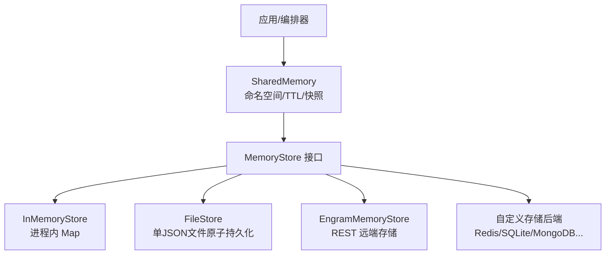
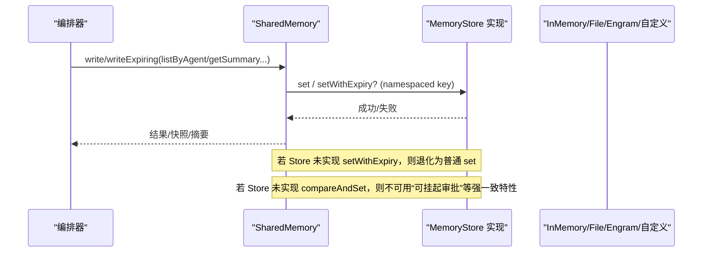
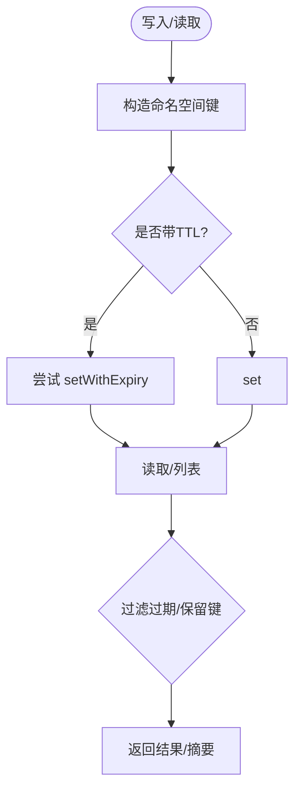
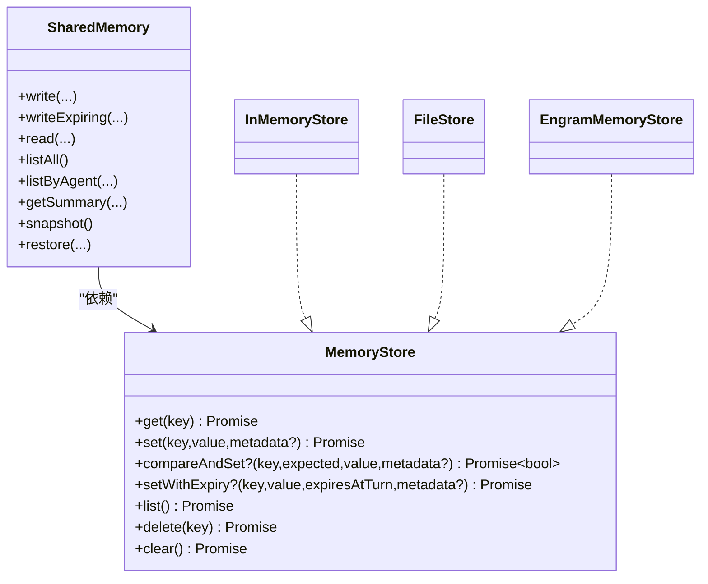

# 自定义存储后端开发

<cite>
**本文引用的文件**
- [packages/core/src/types.ts](file://packages/core/src/types.ts)
- [packages/core/src/memory/store.ts](file://packages/core/src/memory/store.ts)
- [packages/core/src/memory/file-store.ts](file://packages/core/src/memory/file-store.ts)
- [packages/core/src/memory/shared.ts](file://packages/core/src/memory/shared.ts)
- [packages/core/examples/integrations/with-engram/engram-store.ts](file://packages/core/examples/integrations/with-engram/engram-store.ts)
- [packages/core/tests/file-store.test.ts](file://packages/core/tests/file-store.test.ts)
- [packages/core/tests/shared-memory.test.ts](file://packages/core/tests/shared-memory.test.ts)
</cite>

## 目录
1. [简介](#简介)
2. [项目结构](#项目结构)
3. [核心组件](#核心组件)
4. [架构总览](#架构总览)
5. [详细组件分析](#详细组件分析)
6. [依赖关系分析](#依赖关系分析)
7. [性能考虑](#性能考虑)
8. [故障排查指南](#故障排查指南)
9. [结论](#结论)
10. [附录](#附录)

## 简介
本指南面向需要在 Open Multi-Agent（OMA）中实现自定义存储后端的开发者，目标是帮助你基于 MemoryStore 接口构建可插拔的持久化或内存键值存储，并覆盖不同场景（Redis、SQLite、MongoDB 等）、数据迁移策略、性能优化、错误处理与重试、安全与审计，以及完整的实现示例与测试编写要点。

## 项目结构
仓库采用 monorepo 组织，核心能力位于 packages/core。与存储后端直接相关的代码集中在 src/memory 与 types 定义中，并提供多种参考实现：
- 类型与契约：MemoryStore、MemoryEntry、SharedMemoryValue 等
- 内置实现：InMemoryStore（进程内 Map）、FileStore（单 JSON 文件原子持久化）
- 共享内存层：SharedMemory（命名空间、TTL、快照/恢复、摘要生成）
- 集成示例：EngramMemoryStore（基于 REST API 的远程存储）

图表来源
- [packages/core/src/memory/shared.ts:68-98](file://packages/core/src/memory/shared.ts#L68-L98)
- [packages/core/src/memory/store.ts:31-122](file://packages/core/src/memory/store.ts#L31-L122)
- [packages/core/src/memory/file-store.ts:80-166](file://packages/core/src/memory/file-store.ts#L80-L166)
- [packages/core/examples/integrations/with-engram/engram-store.ts:48-137](file://packages/core/examples/integrations/with-engram/engram-store.ts#L48-L137)

章节来源
- [packages/core/src/types.ts:2823-2872](file://packages/core/src/types.ts#L2823-L2872)
- [packages/core/src/memory/store.ts:1-167](file://packages/core/src/memory/store.ts#L1-L167)
- [packages/core/src/memory/file-store.ts:1-345](file://packages/core/src/memory/file-store.ts#L1-L345)
- [packages/core/src/memory/shared.ts:1-531](file://packages/core/src/memory/shared.ts#L1-L531)
- [packages/core/examples/integrations/with-engram/engram-store.ts:1-188](file://packages/core/examples/integrations/with-engram/engram-store.ts#L1-L188)

## 核心组件
- MemoryStore 接口：定义了 get/set/list/delete/clear 以及可选的 compareAndSet、setWithExpiry。所有值在存储层为字符串，结构化数据由上层序列化。
- InMemoryStore：进程内 Map 实现，适合测试与单进程场景；提供 search、size、has 等扩展方法。
- FileStore：单 JSON 文件原子持久化，读路径走内存镜像，写路径串行化 flush，支持版本校验与条目反序列化。
- SharedMemory：团队共享内存抽象，负责命名空间、TTL（turn-count）、快照/恢复、摘要生成，并在底层 store 不支持 TTL 时优雅降级。
- EngramMemoryStore：通过 REST API 实现的远程存储示例，展示网络 I/O、鉴权、删除语义映射等。

章节来源
- [packages/core/src/types.ts:2823-2872](file://packages/core/src/types.ts#L2823-L2872)
- [packages/core/src/memory/store.ts:31-167](file://packages/core/src/memory/store.ts#L31-L167)
- [packages/core/src/memory/file-store.ts:80-166](file://packages/core/src/memory/file-store.ts#L80-L166)
- [packages/core/src/memory/shared.ts:68-186](file://packages/core/src/memory/shared.ts#L68-L186)
- [packages/core/examples/integrations/with-engram/engram-store.ts:48-188](file://packages/core/examples/integrations/with-engram/engram-store.ts#L48-L188)

## 架构总览
下图展示了从编排器到共享内存再到具体存储后端的调用链，以及可选的 CAS 与 TTL 扩展点。

图表来源
- [packages/core/src/memory/shared.ts:192-269](file://packages/core/src/memory/shared.ts#L192-L269)
- [packages/core/src/types.ts:2842-2872](file://packages/core/src/types.ts#L2842-L2872)

## 详细组件分析

### MemoryStore 接口与必需/可选方法
- 必需方法
  - get(key): 读取条目
  - set(key, value, metadata?): 写入条目（值始终为字符串）
  - list(): 列出全部条目
  - delete(key): 删除条目
  - clear(): 清空全部
- 可选扩展
  - compareAndSet(key, expectedValue, value, metadata?): 用于需要原子比较替换的场景（如可挂起审批）
  - setWithExpiry(key, value, expiresAtTurn, metadata?): 以 turn 计数为单位的过期写入；未实现时将丢失 TTL 语义

复杂度与一致性建议
- 时间复杂度：get/set/delete 尽量 O(1)，list 尽量分页或限制规模
- 一致性：compareAndSet 应保证跨并发写者的原子性；若无跨进程锁，需明确范围（进程内/分片键）
- 幂等与可重入：clear/delete 对不存在键应为空操作；重复 set 应覆盖

章节来源
- [packages/core/src/types.ts:2823-2872](file://packages/core/src/types.ts#L2823-L2872)

### InMemoryStore（进程内实现）
- 使用 Map 维护条目，保持 createdAt 不变
- 提供 compareAndSet、setWithExpiry 完整实现
- 额外能力：search(query)、size、has

适用场景
- 单元测试、集成测试、单进程快速原型

章节来源
- [packages/core/src/memory/store.ts:31-167](file://packages/core/src/memory/store.ts#L31-L167)

### FileStore（单文件原子持久化）
- 设计要点
  - 单 JSON 文件承载全量状态，内存 Map 镜像加速读
  - 写路径串行化 flush，原子写入临时文件 + fsync + rename
  - 加载时对磁盘格式进行版本校验与字段校验
- 关键行为
  - get/set 保留 createdAt
  - compareAndSet 在同一实例内串行执行，返回是否替换成功
  - setWithExpiry 持久化 expiresAtTurn 字段（过滤由上层负责）

适用场景
- 作为 checkpoint 存储的首选；也可用作 sharedMemoryStore（注意每次写都会落盘整份文件）

章节来源
- [packages/core/src/memory/file-store.ts:1-345](file://packages/core/src/memory/file-store.ts#L1-L345)

### SharedMemory（共享内存层）
- 命名空间：自动将 agentName/key 组合为 namespacedKey
- TTL：writeExpiring 计算 expiresAtTurn；read/listAll/listByAgent 会按当前 turnCount 过滤过期项
- 快照/恢复：snapshot/fromSnapshot/restore 支持断点续跑与跨进程恢复
- 摘要：getSummary 输出可读的团队记忆摘要
- 降级策略：当底层 store 未实现 setWithExpiry 时，TTL 失效但数据仍写入

图表来源
- [packages/core/src/memory/shared.ts:192-269](file://packages/core/src/memory/shared.ts#L192-L269)
- [packages/core/src/memory/shared.ts:285-311](file://packages/core/src/memory/shared.ts#L285-L311)
- [packages/core/src/memory/shared.ts:337-381](file://packages/core/src/memory/shared.ts#L337-L381)

章节来源
- [packages/core/src/memory/shared.ts:68-531](file://packages/core/src/memory/shared.ts#L68-L531)

### EngramMemoryStore（远程 REST 存储示例）
- 通过 HTTP 提交/查询事实，scope 对应 key
- 删除通过 lineage 机制标记退役
- clear 为 no-op（保留审计历史）
- 适合演示网络 I/O、鉴权头、错误传播

章节来源
- [packages/core/examples/integrations/with-engram/engram-store.ts:48-188](file://packages/core/examples/integrations/with-engram/engram-store.ts#L48-L188)

## 依赖关系分析
- SharedMemory 依赖 MemoryStore 接口，默认使用 InMemoryStore
- FileStore 依赖 Node fs/promises 与 path，实现原子持久化
- EngramMemoryStore 依赖 fetch 与外部服务
- 类型定义集中管理契约，确保各实现一致

图表来源
- [packages/core/src/types.ts:2823-2872](file://packages/core/src/types.ts#L2823-L2872)
- [packages/core/src/memory/store.ts:31-167](file://packages/core/src/memory/store.ts#L31-L167)
- [packages/core/src/memory/file-store.ts:80-166](file://packages/core/src/memory/file-store.ts#L80-L166)
- [packages/core/examples/integrations/with-engram/engram-store.ts:48-137](file://packages/core/examples/integrations/with-engram/engram-store.ts#L48-L137)
- [packages/core/src/memory/shared.ts:68-186](file://packages/core/src/memory/shared.ts#L68-L186)

章节来源
- [packages/core/src/types.ts:2823-2872](file://packages/core/src/types.ts#L2823-L2872)
- [packages/core/src/memory/shared.ts:68-186](file://packages/core/src/memory/shared.ts#L68-L186)

## 性能考虑
- 连接池与并发
  - Redis/数据库后端：复用连接池，避免每次请求新建连接；合理设置最大连接数与空闲回收
  - FileStore：写路径已串行化，避免竞争；读路径走内存镜像，I/O 仅发生在 flush
- 查询优化
  - list 应支持分页/限制条数；必要时提供索引或前缀扫描
  - 避免全表扫描；对高频查询建立二级索引（如 key 前缀、标签）
- 缓存策略
  - 读多写少场景：可在应用层加本地缓存（LRU），配合失效策略（TTL/版本号）
  - 热点键：考虑本地缓存 + 分布式缓存（如 Redis）双层
- 序列化与体积
  - 大对象应压缩或分块存储；避免频繁写入超大条目
- 批处理与合并
  - 批量写入合并为一次事务或批量 API 调用，减少往返
- 监控与指标
  - 记录 QPS、延迟分布、错误率、缓存命中率、连接池使用率

[本节为通用指导，不直接分析特定文件]

## 故障排查指南
- 常见错误与定位
  - 版本不兼容：FileStore 加载时会校验磁盘格式版本，不匹配将抛出错误
  - 字段缺失：条目缺少 key/value/createdAt 等关键字段会被拒绝
  - 网络异常：EngramMemoryStore 对非 2xx 响应抛出错误，包含状态码与响应体
- 重试与超时
  - 网络层：对瞬时错误（如 5xx、限流）实施指数退避重试；对确定性错误（如 4xx）直接失败
  - 超时：为每个请求设置超时；长耗时任务使用 AbortSignal 控制取消
- 降级策略
  - 当 compareAndSet 不可用时，相关功能降级为“失败关闭”
  - 当 setWithExpiry 不可用时，TTL 语义失效，数据永久存在
- 数据一致性
  - 使用 compareAndSet 保护关键决策；无 CAS 时使用乐观锁（版本号）或队列串行化
- 日志与审计
  - 记录关键操作的输入输出（脱敏）、耗时、错误堆栈
  - 对敏感信息做脱敏；保留审计日志以满足合规

章节来源
- [packages/core/src/memory/file-store.ts:249-281](file://packages/core/src/memory/file-store.ts#L249-L281)
- [packages/core/examples/integrations/with-engram/engram-store.ts:162-186](file://packages/core/examples/integrations/with-engram/engram-store.ts#L162-L186)
- [packages/core/src/memory/shared.ts:220-269](file://packages/core/src/memory/shared.ts#L220-L269)

## 结论
通过实现 MemoryStore 接口，你可以将任意存储后端无缝接入 OMA 的共享内存与检查点体系。优先选择具备 CAS 与 TTL 能力的后端以获得更强的一致性与生命周期管理能力；对于网络型后端，务必做好重试、超时与降级。结合合理的索引、缓存与批处理策略，可以在保证可靠性的同时获得良好性能。

[本节为总结性内容，不直接分析特定文件]

## 附录

### 实现步骤清单
- 定义配置项（连接串、凭据、超时、重试参数）
- 实现 MemoryStore 的必需方法
- 视能力实现 compareAndSet、setWithExpiry
- 处理错误分类（可重试/不可重试）
- 添加指标与日志（脱敏）
- 编写单元测试与集成测试

章节来源
- [packages/core/src/types.ts:2823-2872](file://packages/core/src/types.ts#L2823-L2872)

### 数据迁移策略
- 版本化
  - 为存储格式引入 version 字段（如 FileStore 的 FILE_FORMAT_VERSION）
  - 升级时先读取旧版本，转换后再写入新版本
- 向后兼容
  - 读取时容忍未知字段；写入时只写必要字段
  - 提供迁移脚本与回滚方案
- 灰度与双写
  - 新实现上线时可双写一段时间，逐步切换流量
- 校验与回滚
  - 迁移前后进行一致性校验（计数、哈希）
  - 失败时回滚到上一版本

章节来源
- [packages/core/src/memory/file-store.ts:55-74](file://packages/core/src/memory/file-store.ts#L55-L74)
- [packages/core/src/memory/file-store.ts:249-281](file://packages/core/src/memory/file-store.ts#L249-L281)

### 安全考虑
- 传输加密：对外部服务使用 HTTPS/TLS
- 访问控制：最小权限原则，密钥通过环境变量或密钥管理服务注入
- 数据加密：敏感字段在落盘前加密；密钥与数据分离管理
- 审计日志：记录访问与变更，保留必要上下文，脱敏敏感信息
- 输入校验：对所有外部输入进行严格校验与白名单过滤

[本节为通用指导，不直接分析特定文件]

### 完整实现示例与测试要点

#### 示例：基于 REST 的存储后端（EngramMemoryStore）
- 关键点
  - set 使用 update 操作覆盖旧值
  - get 取最新事实映射为 MemoryEntry
  - delete 通过 lineage 退役最新事实
  - clear 为 no-op（保留审计历史）
- 参考路径
  - [packages/core/examples/integrations/with-engram/engram-store.ts:48-188](file://packages/core/examples/integrations/with-engram/engram-store.ts#L48-L188)

章节来源
- [packages/core/examples/integrations/with-engram/engram-store.ts:48-188](file://packages/core/examples/integrations/with-engram/engram-store.ts#L48-L188)

#### 测试用例编写指南
- 单元层面
  - 验证 get/set/list/delete/clear 的基本语义
  - 验证 compareAndSet 的原子性与边界条件
  - 验证 setWithExpiry 的 TTL 写入与读取过滤
- 集成层面
  - 模拟网络异常、超时、限流，验证重试与降级
  - 验证快照/恢复的正确性（SharedMemory.fromSnapshot/restore）
  - 验证 FileStore 的版本校验与损坏文件恢复
- 推荐断言
  - 返回值、错误类型、副作用（如文件内容、网络请求次数）
- 参考测试
  - FileStore 行为与健壮性：[packages/core/tests/file-store.test.ts](file://packages/core/tests/file-store.test.ts)
  - SharedMemory 行为与快照：[packages/core/tests/shared-memory.test.ts](file://packages/core/tests/shared-memory.test.ts)

章节来源
- [packages/core/tests/file-store.test.ts](file://packages/core/tests/file-store.test.ts)
- [packages/core/tests/shared-memory.test.ts](file://packages/core/tests/shared-memory.test.ts)