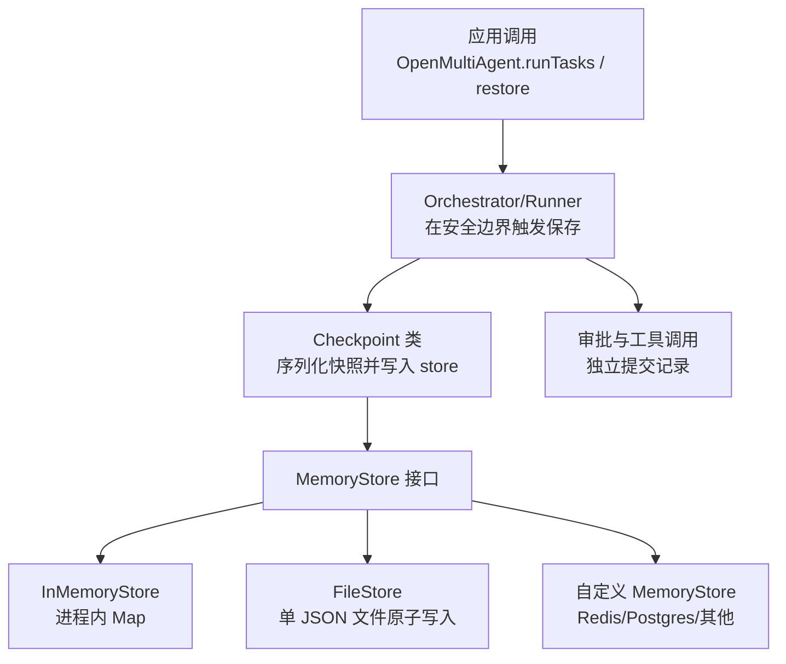
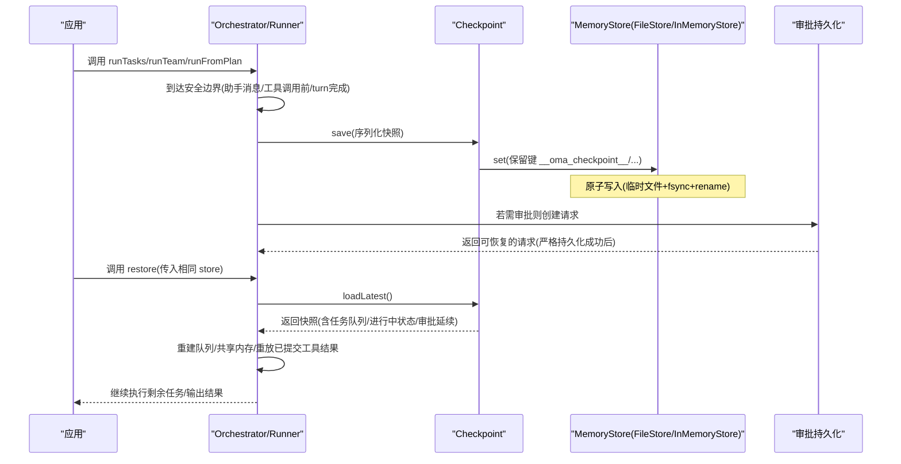
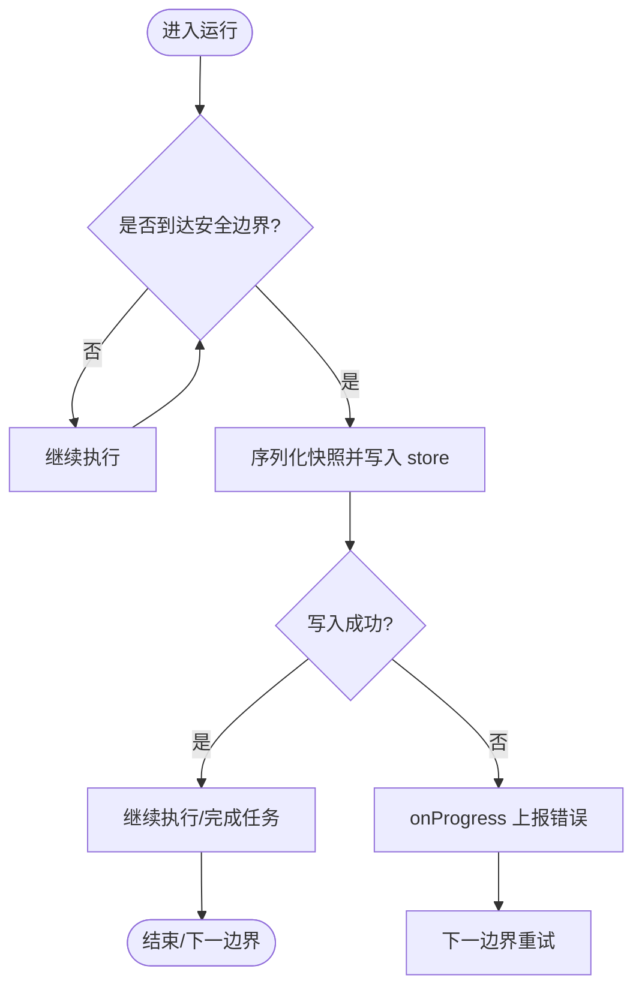
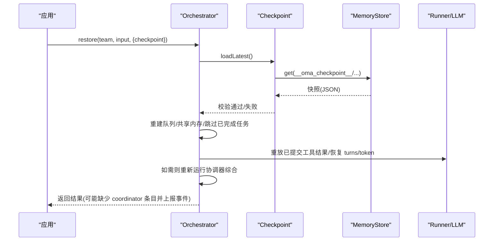
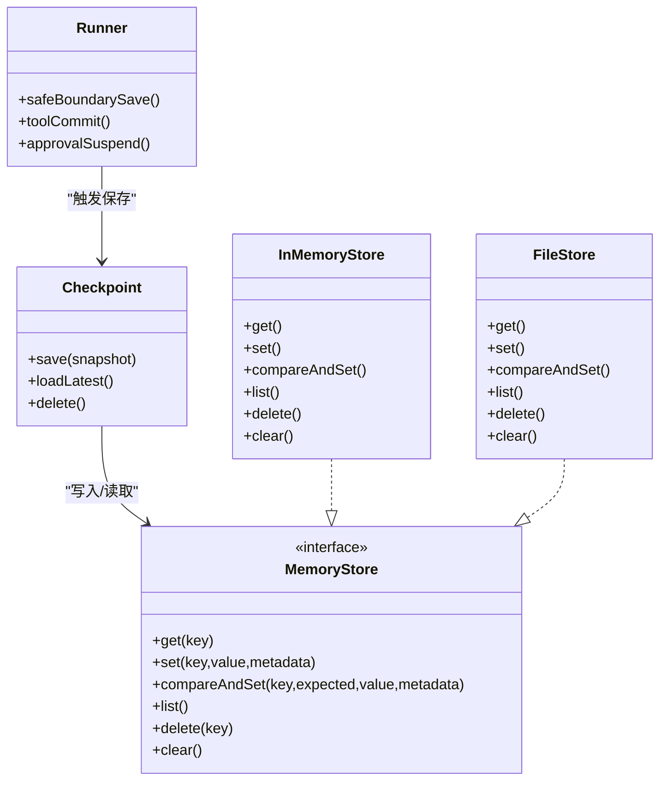

# 检查点系统

<cite>
**本文引用的文件**
- [packages/core/src/memory/checkpoint.ts](file://packages/core/src/memory/checkpoint.ts)
- [packages/core/src/memory/file-store.ts](file://packages/core/src/memory/file-store.ts)
- [packages/core/src/memory/store.ts](file://packages/core/src/memory/store.ts)
- [packages/core/src/types.ts](file://packages/core/src/types.ts)
- [packages/core/src/agent/runner.ts](file://packages/core/src/agent/runner.ts)
- [docs/checkpoint.md](file://docs/checkpoint.md)
</cite>

## 目录
1. [简介](#简介)
2. [项目结构](#项目结构)
3. [核心组件](#核心组件)
4. [架构总览](#架构总览)
5. [详细组件分析](#详细组件分析)
6. [依赖关系分析](#依赖关系分析)
7. [性能考量](#性能考量)
8. [故障排查指南](#故障排查指南)
9. [结论](#结论)
10. [附录](#附录)

## 简介
本章节概述 Open Multi-Agent 的检查点系统：它通过可选的“检查点”机制，在长时任务工作流中持久化进度，支持崩溃、中止或进程重启后的恢复。检查点基于共享内存接口（MemoryStore）实现，可复用同一后端（内存、Redis、Postgres 或自定义），无需额外存储层。覆盖编排路径 runTeam、runTasks、runFromPlan 与 restore；单次 runAgent 不涉及检查点。当前最新为 v4 模式，包含可恢复的审批挂起状态。

**章节来源**
- [docs/checkpoint.md:1-10](file://docs/checkpoint.md#L1-L10)
- [packages/core/src/types.ts:2349-2362](file://packages/core/src/types.ts#L2349-L2362)

## 项目结构
检查点相关代码主要位于 core 包的 memory 与 agent 子模块，以及类型定义与文档：
- 持久化抽象与实现：MemoryStore 接口、InMemoryStore、FileStore
- 检查点管理器：Checkpoint 类（保存/加载/删除、键命名空间、校验）
- 运行时集成：Runner 在安全边界写入检查点，并处理审批挂起
- 类型与模式：CheckpointOptions、RestoreOptions、CheckpointSnapshot V1-V4

**图表来源**
- [packages/core/src/memory/checkpoint.ts:45-102](file://packages/core/src/memory/checkpoint.ts#L45-L102)
- [packages/core/src/memory/file-store.ts:80-159](file://packages/core/src/memory/file-store.ts#L80-L159)
- [packages/core/src/memory/store.ts:31-122](file://packages/core/src/memory/store.ts#L31-L122)
- [packages/core/src/agent/runner.ts:1020-1048](file://packages/core/src/agent/runner.ts#L1020-L1048)

**章节来源**
- [packages/core/src/memory/checkpoint.ts:1-40](file://packages/core/src/memory/checkpoint.ts#L1-L40)
- [packages/core/src/memory/file-store.ts:1-45](file://packages/core/src/memory/file-store.ts#L1-L45)
- [packages/core/src/memory/store.ts:1-30](file://packages/core/src/memory/store.ts#L1-L30)
- [docs/checkpoint.md:11-48](file://docs/checkpoint.md#L11-L48)

## 核心组件
- Checkpoint 类：负责按命名空间键保存/加载/删除检查点快照，并对快照进行严格的结构校验（版本、字段、一致性）。
- FileStore：零依赖的文件型 MemoryStore，单 JSON 文件承载全部条目，采用“写临时文件→fsync→rename”的原子更新策略，保证断电/崩溃一致性。
- InMemoryStore：进程内 Map 实现，适合测试与短生命周期场景。
- Runner 集成：在内置 LLM 运行器的安全边界（助手消息/工具调用前、每个工具结果提交后、完整 turn 完成后）写入检查点；审批挂起必须成功持久化后才返回可恢复请求。
- 类型与配置：CheckpointOptions、RestoreOptions、CheckpointSnapshot V1-V4，定义保存内容、恢复选项与向后兼容策略。

**章节来源**
- [packages/core/src/memory/checkpoint.ts:45-102](file://packages/core/src/memory/checkpoint.ts#L45-L102)
- [packages/core/src/memory/file-store.ts:80-159](file://packages/core/src/memory/file-store.ts#L80-L159)
- [packages/core/src/memory/store.ts:31-122](file://packages/core/src/memory/store.ts#L31-L122)
- [packages/core/src/agent/runner.ts:1020-1048](file://packages/core/src/agent/runner.ts#L1020-L1048)
- [packages/core/src/types.ts:2349-2362](file://packages/core/src/types.ts#L2349-L2362)
- [packages/core/src/types.ts:2577-2586](file://packages/core/src/types.ts#L2577-L2586)

## 架构总览
检查点系统在“安全边界”触发保存，将执行身份、任务队列、共享内存、已完成任务结果、进行中 runner 状态、审批延续状态等序列化为快照，并以保留键写入 store。恢复时读取最新快照，重建任务队列与共享内存，跳过已完成任务，必要时重放已提交的工具结果，并在需要时重新运行协调器综合步骤。

**图表来源**
- [packages/core/src/memory/checkpoint.ts:57-92](file://packages/core/src/memory/checkpoint.ts#L57-L92)
- [packages/core/src/memory/file-store.ts:112-159](file://packages/core/src/memory/file-store.ts#L112-L159)
- [packages/core/src/agent/runner.ts:1020-1048](file://packages/core/src/agent/runner.ts#L1020-L1048)
- [docs/checkpoint.md:74-107](file://docs/checkpoint.md#L74-L107)

## 详细组件分析

### 检查点保存时机与触发条件
- 保存时机：在内置 LLM 运行器的多个安全边界触发，包括助手消息与所有请求的工具调用保存、每个工具结果单独提交、完整 turn 完成后。
- 触发条件：任务完成、安全边界到达、审批挂起准备阶段（必须成功持久化才返回可恢复请求）。
- 保存策略：最佳努力（普通保存失败不会中断运行，通过 onProgress 上报错误并等待下次边界重试）；审批挂起的保存是强一致（失败关闭）。

**图表来源**
- [docs/checkpoint.md:154-160](file://docs/checkpoint.md#L154-L160)
- [packages/core/src/agent/runner.ts:1020-1048](file://packages/core/src/agent/runner.ts#L1020-L1048)

**章节来源**
- [docs/checkpoint.md:109-160](file://docs/checkpoint.md#L109-L160)
- [packages/core/src/agent/runner.ts:1020-1048](file://packages/core/src/agent/runner.ts#L1020-L1048)

### 检查点恢复流程
- 恢复入口：restore(team, tasks/plan, { checkpoint }) 或仅 resume-only 调用。
- 状态重建：加载最新快照，重建任务队列与共享内存，跳过已完成任务；对内置 LLM runner 重放已提交的工具结果，恢复轮次计数与 token 使用。
- 一致性验证：Checkpoint.isSnapshot 对版本、字段、任务 ID 唯一性、审批请求/决策一致性等进行严格校验；v1/v2 无进行中 runner 状态，从任务边界恢复；v3 保留 mid-task 工具恢复但无审批延续；v4 新增审批延续。
- 协调器综合：恢复 runTeam 会重新运行协调器综合（需提供与原 runTeam 相同的 coordinator 配置），否则回退到原始任务输出并上报 synthesis_failed。

**图表来源**
- [packages/core/src/memory/checkpoint.ts:76-92](file://packages/core/src/memory/checkpoint.ts#L76-L92)
- [packages/core/src/memory/checkpoint.ts:104-202](file://packages/core/src/memory/checkpoint.ts#L104-L202)
- [docs/checkpoint.md:74-107](file://docs/checkpoint.md#L74-L107)

**章节来源**
- [docs/checkpoint.md:74-107](file://docs/checkpoint.md#L74-L107)
- [packages/core/src/memory/checkpoint.ts:76-202](file://packages/core/src/memory/checkpoint.ts#L76-L202)

### 保存内容与键命名空间
- 保存内容：执行身份（runId/attempt/trace/rootSpan）、任务队列状态、共享内存（仅在 checkpoint store 与 team sharedMemoryStore 不同时嵌入快照）、已完成任务结果、进行中 runner 状态（对话消息、token 使用、工具调用、下一阶段、待提交结果）、审批延续状态（pending requests 与 decisions）、任务交接/溯源元数据。
- 键命名空间：__oma_checkpoint__/<runId>/latest 或 __oma_checkpoint__/latest；同时预留 __oma_approval__/ 用于审批主记录；恢复/快照过程会跳过这些保留键以避免冲突。

**章节来源**
- [docs/checkpoint.md:109-153](file://docs/checkpoint.md#L109-L153)
- [packages/core/src/memory/checkpoint.ts:25-39](file://packages/core/src/memory/checkpoint.ts#L25-L39)

### 版本管理与兼容性
- 当前最新为 v4，新增审批延续状态；v1/v2 无进行中 runner 状态，恢复从任务边界开始；v3 保留 mid-task 工具恢复但无审批延续。
- 恢复时对快照进行严格校验，确保 version、mode、createdAt、completedTaskResults、identity、inFlightTasks、pendingApprovals/approvalDecisions 等字段合法且一致。
- v1 快照的可选顶层 runId 会被保留；若无 runId 则分配新逻辑运行 ID；若调用方提供的 restore runId 与快照冲突，恢复抛出验证错误。

**章节来源**
- [docs/checkpoint.md:145-152](file://docs/checkpoint.md#L145-L152)
- [packages/core/src/memory/checkpoint.ts:104-202](file://packages/core/src/memory/checkpoint.ts#L104-L202)
- [packages/core/src/types.ts:2577-2586](file://packages/core/src/types.ts#L2577-L2586)

### 中间任务工具恢复与幂等性
- 三阶段持久化：助手消息与所有请求的工具调用先保存；每个 ToolResult 作为独立提交记录保存；全部提交完成后以用户消息形式保存结果块并继续模型回合。
- 恢复重放：已提交结果（含错误结果）原样重放，不重复调用外部工具；未提交调用保守地重新执行；并行工具调用相互独立。
- 幂等键：工具可通过 context.toolCallId 结合 runId/taskId 生成幂等键，避免外部副作用重复执行。

**章节来源**
- [docs/checkpoint.md:206-249](file://docs/checkpoint.md#L206-L249)

### 敏感信息脱敏（RedactingStore）
- 检查点包含已完成任务结果与进行中 runner 状态，可能包含机密；可通过 RedactingStore 在写入边界进行脱敏。
- 脱敏适用于 checkpoint store 与 sharedMemoryStore；注意恢复后看到脱敏值；不适用于需要哈希绑定的审批持久化。

**章节来源**
- [docs/checkpoint.md:172-205](file://docs/checkpoint.md#L172-L205)

### 限制与注意事项
- 快照式而非事件溯源：每次检查点覆盖上一个，无转换日志可回放。
- 外部代理后端保持任务粒度：无法持久其私有会话/工具状态。
- 可挂起工具门限仅限内置 LLM 运行器；其他路径在 suspend 决策时失败关闭。
- 仅 runner 工具结果具备每调用提交记录；应用钩子/上下文策略回调可能在最后安全边界后重跑。

**章节来源**
- [docs/checkpoint.md:269-288](file://docs/checkpoint.md#L269-L288)

## 依赖关系分析
- Checkpoint 依赖 MemoryStore 接口，解耦具体后端；InMemoryStore 与 FileStore 提供默认实现。
- Runner 在安全边界调用 Checkpoint.save；审批流程与工具调用提交与检查点紧密耦合。
- 类型定义集中管理快照结构与配置项，确保跨模块一致性。

**图表来源**
- [packages/core/src/memory/checkpoint.ts:45-102](file://packages/core/src/memory/checkpoint.ts#L45-L102)
- [packages/core/src/memory/store.ts:31-122](file://packages/core/src/memory/store.ts#L31-L122)
- [packages/core/src/memory/file-store.ts:80-159](file://packages/core/src/memory/file-store.ts#L80-L159)
- [packages/core/src/agent/runner.ts:1020-1048](file://packages/core/src/agent/runner.ts#L1020-L1048)

**章节来源**
- [packages/core/src/memory/checkpoint.ts:45-102](file://packages/core/src/memory/checkpoint.ts#L45-L102)
- [packages/core/src/memory/store.ts:31-122](file://packages/core/src/memory/store.ts#L31-L122)
- [packages/core/src/memory/file-store.ts:80-159](file://packages/core/src/memory/file-store.ts#L80-L159)
- [packages/core/src/agent/runner.ts:1020-1048](file://packages/core/src/agent/runner.ts#L1020-L1048)

## 性能考量
- 保存频率：仅在安全边界与任务完成后写入，避免对热路径造成压力。
- 存储选择：
  - 推荐将 FileStore 用作 checkpoint store，sharedMemoryStore 使用 InMemoryStore，以减少高频写入开销；当两者相同时，共享内存本身已持久，不再重复嵌入快照。
  - 若将 FileStore 作为 sharedMemoryStore，每次共享内存写入都会重写整个文件，I/O 成本较高。
- 原子写入：FileStore 使用临时文件+fsync+rename，保证崩溃一致性；目录 fsync 尽力而为，不影响主路径。
- 并发：单进程内并发写串行化，避免丢失；跨进程无锁，符合“进程A崩溃，进程B恢复”的顺序语义。
- 脱敏：RedactingStore 在写入边界进行脱敏，增加少量 CPU 开销，但提升安全性。

**章节来源**
- [docs/checkpoint.md:49-73](file://docs/checkpoint.md#L49-L73)
- [packages/core/src/memory/file-store.ts:10-31](file://packages/core/src/memory/file-store.ts#L10-L31)
- [packages/core/src/memory/file-store.ts:324-351](file://packages/core/src/memory/file-store.ts#L324-L351)

## 故障排查指南
- 检查点写入失败：普通保存失败不会中断运行，通过 onProgress 上报 error 事件（kind=checkpoint_save_failed），等待下一边界重试。
- 审批挂起失败：必须成功持久化后才返回可恢复请求，否则失败关闭。
- 恢复失败：
  - 无可用协调器配置或凭证：恢复返回原始任务输出，并上报 synthesis_failed 事件。
  - 快照损坏或格式不符：Checkpoint/FileStore 会抛出明确错误，拒绝静默丢弃数据。
- 文件存储问题：
  - 文件非 JSON 或版本不支持：FileStore 启动时抛出错误，需修复或删除文件。
  - 权限/磁盘空间不足：写入失败会抛出异常，需检查文件系统与权限。
- 工具幂等：若外部服务在工具返回前提交成功但进程崩溃，恢复会重放缺失调用；务必使用 toolCallId 等幂等键。

**章节来源**
- [docs/checkpoint.md:154-160](file://docs/checkpoint.md#L154-L160)
- [docs/checkpoint.md:74-107](file://docs/checkpoint.md#L74-L107)
- [packages/core/src/memory/file-store.ts:220-263](file://packages/core/src/memory/file-store.ts#L220-L263)
- [packages/core/src/memory/checkpoint.ts:76-92](file://packages/core/src/memory/checkpoint.ts#L76-L92)
- [docs/checkpoint.md:206-249](file://docs/checkpoint.md#L206-L249)

## 结论
Open Multi-Agent 的检查点系统通过严格的快照结构与安全的持久化策略，为长时多智能体工作流提供了可靠的恢复能力。它在安全边界触发保存，支持多种后端存储，兼容历史版本，并提供审批与工具调用的细粒度恢复。合理选择存储、启用脱敏、遵循幂等实践，可在保障一致性的同时优化性能与安全性。

## 附录

### 配置与最佳实践
- 启用方式：
  - 每次调用传入 checkpoint 配置，或在 OrchestratorConfig 设置全局默认；调用级配置优先。
  - checkpoint: true 表示复用团队共享内存 store（若有），否则使用实例级后备 store。
- 存储位置：
  - 推荐使用 FileStore 作为 checkpoint store，路径如 .oma/checkpoint.json；共享内存可使用 InMemoryStore 以获得高性能。
- 压缩与备份：
  - 当前实现未内置压缩；可按需在外层对 FileStore 文件进行压缩与备份（例如定时归档、异地副本）。
- 密钥与敏感信息：
  - 使用 RedactingStore 包裹 checkpoint store 与 sharedMemoryStore，防止机密落盘；注意恢复后值为脱敏态。
- 并发与范围：
  - FileStore 为单进程写入；跨进程无锁，符合顺序恢复语义。

**章节来源**
- [docs/checkpoint.md:11-73](file://docs/checkpoint.md#L11-L73)
- [docs/checkpoint.md:172-205](file://docs/checkpoint.md#L172-L205)

### API 参考要点
- CheckpointOptions：enabled、store、key、runId。
- RestoreOptions：goal、coordinator（恢复 runTeam 时需重新提供）。
- CheckpointSnapshot V1-V4：版本演进与字段约束。

**章节来源**
- [packages/core/src/types.ts:2349-2362](file://packages/core/src/types.ts#L2349-L2362)
- [packages/core/src/types.ts:2577-2586](file://packages/core/src/types.ts#L2577-L2586)