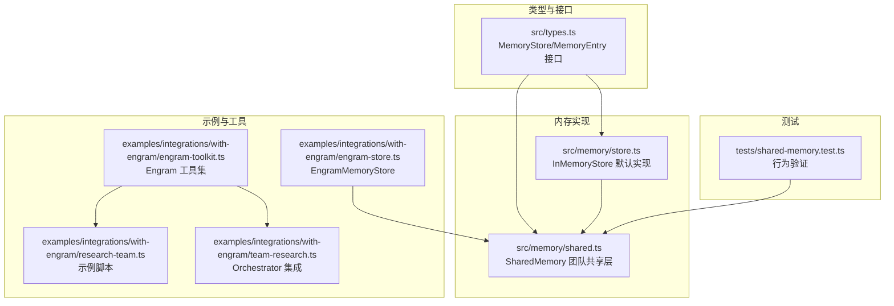
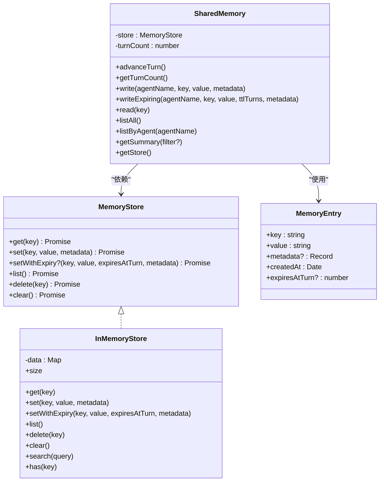
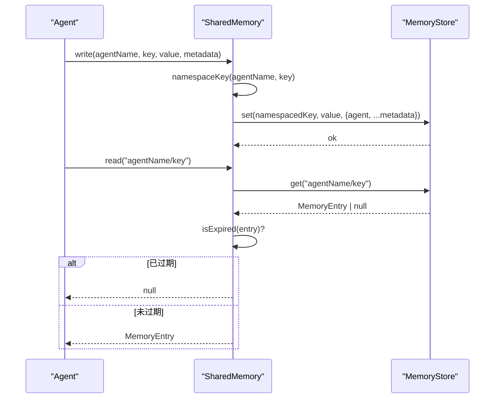
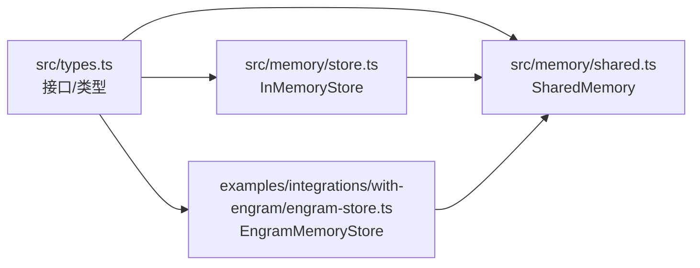

# 内存管理

<cite>
**本文引用的文件**
- [src/memory/store.ts](file://src/memory/store.ts)
- [src/memory/shared.ts](file://src/memory/shared.ts)
- [src/types.ts](file://src/types.ts)
- [docs/shared-memory.md](file://docs/shared-memory.md)
- [examples/integrations/with-engram/engram-store.ts](file://examples/integrations/with-engram/engram-store.ts)
- [examples/integrations/with-engram/engram-toolkit.ts](file://examples/integrations/with-engram/engram-toolkit.ts)
- [examples/integrations/with-engram/team-research.ts](file://examples/integrations/with-engram/team-research.ts)
- [examples/integrations/with-engram/research-team.ts](file://examples/integrations/with-engram/research-team.ts)
- [tests/shared-memory.test.ts](file://tests/shared-memory.test.ts)
</cite>

## 目录
1. [简介](#简介)
2. [项目结构](#项目结构)
3. [核心组件](#核心组件)
4. [架构总览](#架构总览)
5. [组件详解](#组件详解)
6. [依赖关系分析](#依赖关系分析)
7. [性能与容量规划](#性能与容量规划)
8. [故障排查指南](#故障排查指南)
9. [结论](#结论)
10. [附录：配置与集成示例](#附录配置与集成示例)

## 简介
本文件系统性阐述 Open Multi-Agent 框架的内存管理机制，重点覆盖：
- 默认进程内键值存储实现与数据模型
- 共享内存（团队级）的设计与使用方式
- 如何实现自定义 MemoryStore 接口以对接 Redis、PostgreSQL 或其他后端
- 共享内存的 TTL 过期、清理与持久化策略
- 性能考量与容量规划建议
- 完整配置示例与集成指南

## 项目结构
内存管理相关代码主要位于以下模块：
- 类型与接口定义：src/types.ts
- 默认内存实现：src/memory/store.ts
- 团队共享内存层：src/memory/shared.ts
- 文档说明：docs/shared-memory.md
- 示例：examples/integrations/with-engram/*
- 测试：tests/shared-memory.test.ts

图表来源
- [src/types.ts:992-1106](file://src/types.ts#L992-L1106)
- [src/memory/store.ts:31-149](file://src/memory/store.ts#L31-L149)
- [src/memory/shared.ts:55-335](file://src/memory/shared.ts#L55-L335)
- [examples/integrations/with-engram/engram-store.ts:48-188](file://examples/integrations/with-engram/engram-store.ts#L48-L188)
- [examples/integrations/with-engram/engram-toolkit.ts:34-194](file://examples/integrations/with-engram/engram-toolkit.ts#L34-L194)
- [examples/integrations/with-engram/research-team.ts:1-226](file://examples/integrations/with-engram/research-team.ts#L1-L226)
- [examples/integrations/with-engram/team-research.ts:178-198](file://examples/integrations/with-engram/team-research.ts#L178-L198)
- [tests/shared-memory.test.ts:1-301](file://tests/shared-memory.test.ts#L1-L301)

章节来源
- [src/types.ts:992-1106](file://src/types.ts#L992-L1106)
- [src/memory/store.ts:31-149](file://src/memory/store.ts#L31-L149)
- [src/memory/shared.ts:55-335](file://src/memory/shared.ts#L55-L335)
- [docs/shared-memory.md:1-28](file://docs/shared-memory.md#L1-L28)
- [examples/integrations/with-engram/engram-store.ts:48-188](file://examples/integrations/with-engram/engram-store.ts#L48-L188)
- [examples/integrations/with-engram/engram-toolkit.ts:34-194](file://examples/integrations/with-engram/engram-toolkit.ts#L34-L194)
- [examples/integrations/with-engram/research-team.ts:1-226](file://examples/integrations/with-engram/research-team.ts#L1-L226)
- [examples/integrations/with-engram/team-research.ts:178-198](file://examples/integrations/with-engram/team-research.ts#L178-L198)
- [tests/shared-memory.test.ts:1-301](file://tests/shared-memory.test.ts#L1-L301)

## 核心组件
- MemoryStore 接口：统一的键值存储抽象，支持可选的过期写入能力。
- MemoryEntry 数据模型：记录键、值、元数据与创建时间；可选的过期回合数。
- InMemoryStore：默认的进程内实现，基于 Map 存储，提供基本 CRUD 与简单检索。
- SharedMemory：团队共享层，负责命名空间隔离、TTL 过期过滤、摘要生成等。

章节来源
- [src/types.ts:974-1011](file://src/types.ts#L974-L1011)
- [src/memory/store.ts:31-149](file://src/memory/store.ts#L31-L149)
- [src/memory/shared.ts:55-335](file://src/memory/shared.ts#L55-L335)

## 架构总览
SharedMemory 通过 MemoryStore 抽象与具体后端解耦。默认使用 InMemoryStore，也可注入自定义实现（如 EngramMemoryStore）。SharedMemory 负责：
- 命名空间写入：将 agentName 作为前缀拼接为完整键
- TTL 写入：可选调用 setWithExpiry，由后端或 SharedMemory 自身进行过期判断
- 读取过滤：在返回前剔除已过期条目
- 列表与摘要：按 agent 分组输出人类可读摘要

图表来源
- [src/types.ts:992-1011](file://src/types.ts#L992-L1011)
- [src/types.ts:974-987](file://src/types.ts#L974-L987)
- [src/memory/store.ts:31-149](file://src/memory/store.ts#L31-L149)
- [src/memory/shared.ts:55-335](file://src/memory/shared.ts#L55-L335)

## 组件详解

### MemoryStore 接口与 MemoryEntry 数据模型
- MemoryStore：定义 get/set/list/delete/clear；setWithExpiry 为可选，用于回合制 TTL。
- MemoryEntry：统一的存储单元，包含键、值、元数据、创建时间与可选的 expiresAtTurn。

章节来源
- [src/types.ts:974-1011](file://src/types.ts#L974-L1011)

### InMemoryStore 默认实现
- 存储介质：内存 Map，适合单进程与测试场景。
- 行为特性：
  - get/set 保持 createdAt 不变，便于检测首次写入时间
  - setWithExpiry 将过期回合数写入条目，供 SharedMemory 过滤
  - list 返回插入顺序快照
  - delete 清除指定键
  - clear 清空所有
  - search 提供简单的子串匹配（大小写不敏感），线性扫描
  - size/has 提供便捷查询

章节来源
- [src/memory/store.ts:31-149](file://src/memory/store.ts#L31-L149)

### SharedMemory 团队共享层
- 命名空间：写入时自动拼接为 agentName/key，避免冲突并保留归属
- TTL 支持：writeExpiring 会调用 setWithExpiry（若后端实现），否则降级为普通 set
- 读取过滤：read 在返回前检查过期，不过期删除由后端自行处理
- 列表与摘要：listAll/listByAgent 过滤过期项；getSummary 生成人类可读摘要，按 agent 分组
- 轮次计数：advanceTurn 递增内部计数器，驱动 TTL 到期判断

图表来源
- [src/memory/shared.ts:124-205](file://src/memory/shared.ts#L124-L205)
- [src/types.ts:992-1011](file://src/types.ts#L992-L1011)

章节来源
- [src/memory/shared.ts:55-335](file://src/memory/shared.ts#L55-L335)

### 自定义 MemoryStore 实现指南
- 必备方法：get/set/list/delete/clear
- 可选方法：setWithExpiry（若实现 TTL）
- 关键约束：
  - keys 为字符串；values 为字符串（结构化数据需序列化）
  - 元数据透传给调用方（SharedMemory 会追加 agent 标记）
  - 若未实现 setWithExpiry，SharedMemory 会降级为普通写入，不保证 TTL
- 示例参考：EngramMemoryStore 通过 REST API 实现 MemoryStore 接口，将 scope 映射为 key，使用 operation 控制更新/删除语义。

章节来源
- [src/types.ts:992-1011](file://src/types.ts#L992-L1011)
- [examples/integrations/with-engram/engram-store.ts:48-188](file://examples/integrations/with-engram/engram-store.ts#L48-L188)

### 共享内存的使用与配置
- 启用团队共享内存：在团队配置中设置 sharedMemory=true 使用默认 InMemoryStore
- 注入自定义存储：通过 sharedMemoryStore 传入自定义 MemoryStore 实例
- 当两者同时提供时，sharedMemoryStore 优先
- 文档示例展示了上述两种模式

章节来源
- [docs/shared-memory.md:1-28](file://docs/shared-memory.md#L1-L28)
- [src/memory/shared.ts:77-85](file://src/memory/shared.ts#L77-L85)

### 示例：Engram 集成
- EngramMemoryStore：实现 MemoryStore，将 scope 映射为 key，使用 operation 控制更新/删除
- EngramToolkit：注册四个工具（engram_commit、engram_query、engram_conflicts、engram_resolve）
- 示例脚本：演示如何在 runTeam 中注入 EngramMemoryStore，实现跨任务共享记忆

章节来源
- [examples/integrations/with-engram/engram-store.ts:48-188](file://examples/integrations/with-engram/engram-store.ts#L48-L188)
- [examples/integrations/with-engram/engram-toolkit.ts:34-194](file://examples/integrations/with-engram/engram-toolkit.ts#L34-L194)
- [examples/integrations/with-engram/team-research.ts:178-198](file://examples/integrations/with-engram/team-research.ts#L178-L198)
- [examples/integrations/with-engram/research-team.ts:1-226](file://examples/integrations/with-engram/research-team.ts#L1-L226)

### 测试与行为验证
- 命名空间隔离：不同 agent 的同名 key 不冲突
- 元数据合并：写入时会合并 agent 标记
- 摘要生成：按 agent 分组输出，长值截断
- 形状校验：构造函数对传入的 MemoryStore 进行结构检查，防止错误对象进入
- 团队配置：sharedMemory=true 仅时默认 InMemoryStore；注入无效对象会抛错

章节来源
- [tests/shared-memory.test.ts:1-301](file://tests/shared-memory.test.ts#L1-L301)

## 依赖关系分析
- SharedMemory 依赖 MemoryStore 接口，从而与具体后端解耦
- InMemoryStore 与 EngramMemoryStore 都实现 MemoryStore
- SharedMemory 依赖 MemoryEntry 数据模型
- 文档与示例指导如何注入自定义存储

图表来源
- [src/types.ts:992-1011](file://src/types.ts#L992-L1011)
- [src/memory/store.ts:31-149](file://src/memory/store.ts#L31-L149)
- [examples/integrations/with-engram/engram-store.ts:48-188](file://examples/integrations/with-engram/engram-store.ts#L48-L188)
- [src/memory/shared.ts:55-335](file://src/memory/shared.ts#L55-L335)

章节来源
- [src/types.ts:992-1011](file://src/types.ts#L992-L1011)
- [src/memory/store.ts:31-149](file://src/memory/store.ts#L31-L149)
- [examples/integrations/with-engram/engram-store.ts:48-188](file://examples/integrations/with-engram/engram-store.ts#L48-L188)
- [src/memory/shared.ts:55-335](file://src/memory/shared.ts#L55-L335)

## 性能与容量规划
- 默认 InMemoryStore
  - 优点：低延迟、易部署、适合单进程与测试
  - 缺点：无持久化、无 TTL 清理、无跨进程共享
  - 复杂度：get/set/list/delete/clear 均为 O(1)/O(n) 线性扫描（search/list）
  - 建议：小规模团队、短期实验；注意内存增长与定期清理
- EngramMemoryStore
  - 优点：持久化、跨进程共享、冲突解决与审计
  - 缺点：网络开销、依赖外部服务
  - 建议：生产环境首选；关注 API 限流与重试策略
- Redis/PostgreSQL 等自定义后端
  - Redis：适合高吞吐、低延迟键值场景；可利用原生存储 TTL 与过期事件
  - PostgreSQL：适合需要复杂查询、审计与事务一致性场景；可结合索引优化
  - 建议：为高频查询建立索引；合理设置过期策略与清理任务；监控内存/连接池

[本节为通用性能建议，无需特定文件引用]

## 故障排查指南
- 构造 SharedMemory 时传入的对象不满足 MemoryStore 结构
  - 现象：抛出类型错误，提示缺少必要方法
  - 处理：确保实现 get/set/list/delete/clear；如需 TTL，实现 setWithExpiry
- 写入 TTL 后未过期
  - 现象：后端未实现 setWithExpiry，SharedMemory 降级为普通写入
  - 处理：实现 setWithExpiry 或在应用层主动删除
- 读取到空值
  - 可能原因：键不存在、已被过期过滤、后端删除
  - 处理：确认命名空间格式与 agentName/key 拼接；检查过期回合数
- 摘要为空
  - 可能原因：store 为空或全部过期
  - 处理：确认写入流程与过期逻辑

章节来源
- [src/memory/shared.ts:77-85](file://src/memory/shared.ts#L77-L85)
- [src/memory/shared.ts:168-184](file://src/memory/shared.ts#L168-L184)
- [src/memory/shared.ts:200-205](file://src/memory/shared.ts#L200-L205)
- [tests/shared-memory.test.ts:255-301](file://tests/shared-memory.test.ts#L255-L301)

## 结论
Open Multi-Agent 的内存管理以 MemoryStore 抽象为核心，通过 SharedMemory 提供团队级共享与 TTL 能力。默认 InMemoryStore 适合开发与测试，生产环境推荐持久化与跨进程共享的后端（如 Engram、Redis、PostgreSQL）。实现自定义 MemoryStore 时，务必满足接口契约并考虑 TTL、清理与可观测性。

[本节为总结性内容，无需特定文件引用]

## 附录：配置与集成示例

### 启用默认共享内存（单进程）
- 在团队配置中设置 sharedMemory=true 即可启用默认 InMemoryStore

章节来源
- [docs/shared-memory.md:3-11](file://docs/shared-memory.md#L3-L11)

### 注入自定义 MemoryStore（示例：Engram）
- 创建 EngramMemoryStore 实例并传入团队配置的 sharedMemoryStore
- 示例脚本展示了如何在 runTeam 中注入 EngramMemoryStore 并运行研究流水线

章节来源
- [docs/shared-memory.md:13-25](file://docs/shared-memory.md#L13-L25)
- [examples/integrations/with-engram/team-research.ts:178-198](file://examples/integrations/with-engram/team-research.ts#L178-L198)

### 自定义 MemoryStore 开发清单
- 实现 get/set/list/delete/clear
- 如需 TTL，实现 setWithExpiry
- keys 为字符串；values 为字符串（结构化数据需序列化）
- 元数据透传，不修改调用方提供的字段
- 注意并发安全与过期过滤时机（读取时过滤，删除由后端负责）

章节来源
- [src/types.ts:992-1011](file://src/types.ts#L992-L1011)
- [src/memory/shared.ts:177-183](file://src/memory/shared.ts#L177-L183)

### 最佳实践
- 内存压缩与清理
  - 默认 InMemoryStore：定期调用 clear 或按业务周期清理；search 为线性扫描，建议配合索引层
  - Engram/Redis/PostgreSQL：利用后端 TTL 与清理任务；设计合理的过期策略
- 持久化
  - 选择具备持久化能力的后端（Engram、Redis、PostgreSQL）
  - 对关键事实采用审计与冲突解决机制
- 性能与容量
  - 为高频键建立索引；控制单条 value 长度；分页列出与条件过滤
  - 监控后端连接数、内存占用与查询延迟

[本节为通用最佳实践，无需特定文件引用]