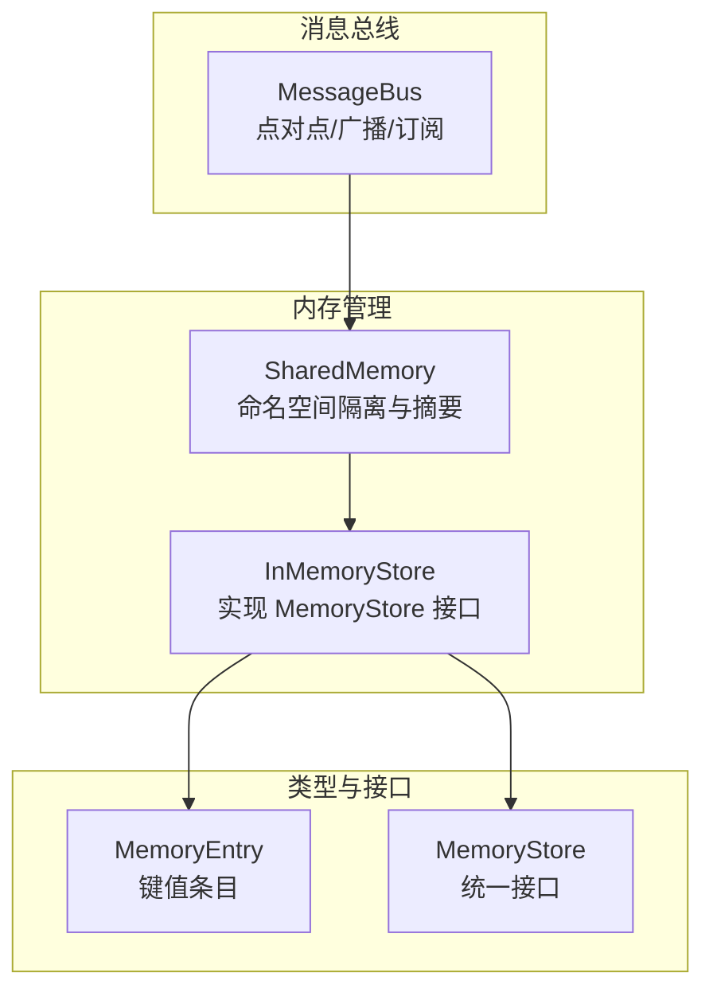
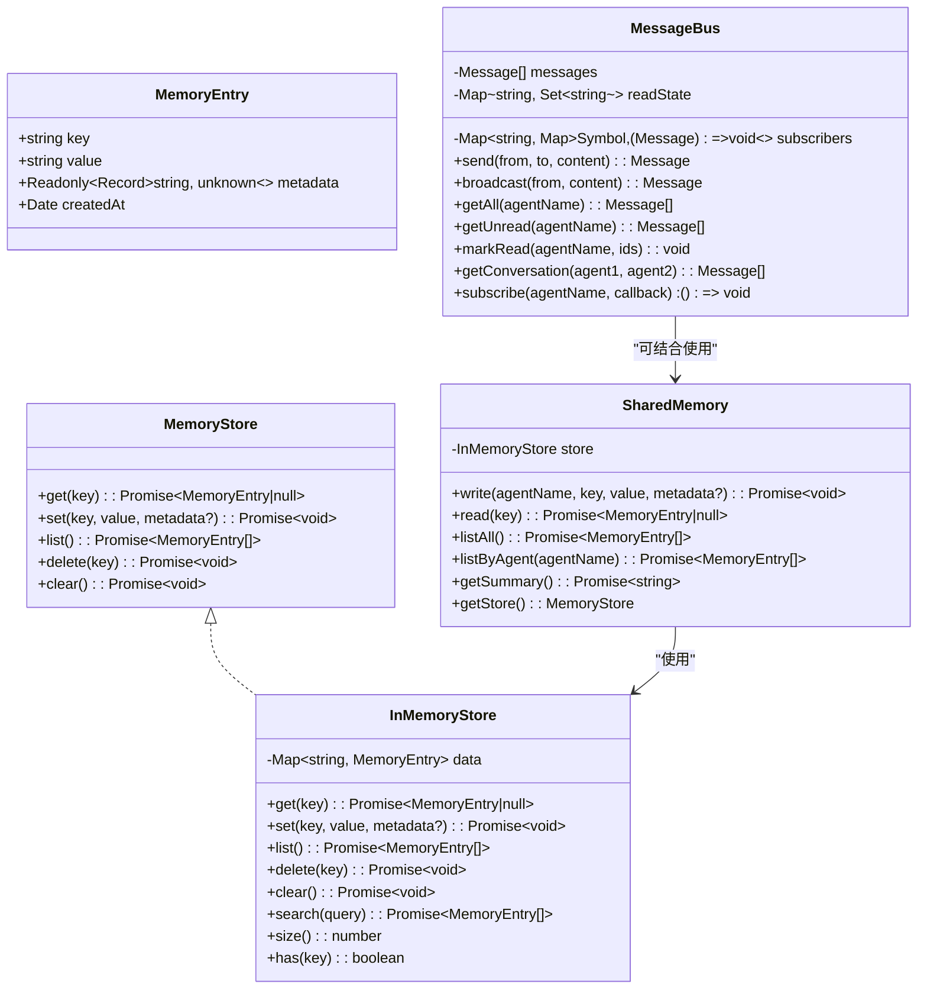
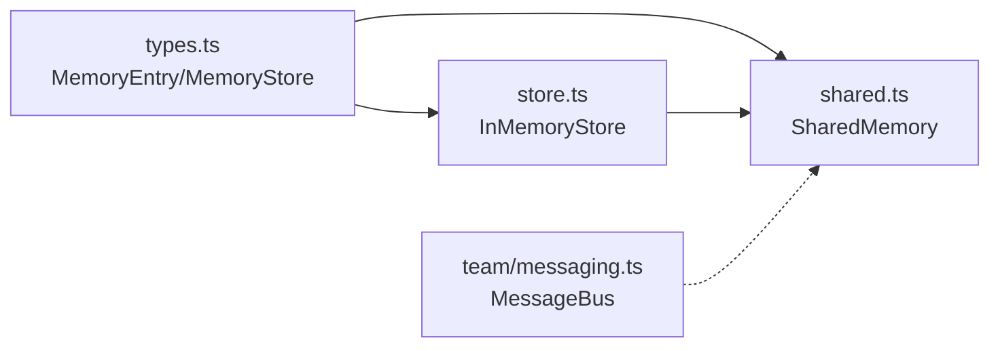

# 内存管理

<cite>
**本文引用的文件**
- [src/memory/store.ts](file://src/memory/store.ts)
- [src/memory/shared.ts](file://src/memory/shared.ts)
- [src/types.ts](file://src/types.ts)
- [src/team/messaging.ts](file://src/team/messaging.ts)
- [tests/shared-memory.test.ts](file://tests/shared-memory.test.ts)
- [tests/team-messaging.test.ts](file://tests/team-messaging.test.ts)
- [src/index.ts](file://src/index.ts)
- [examples/02-team-collaboration.ts](file://examples/02-team-collaboration.ts)
</cite>

## 目录
1. [简介](#简介)
2. [项目结构](#项目结构)
3. [核心组件](#核心组件)
4. [架构概览](#架构概览)
5. [详细组件分析](#详细组件分析)
6. [依赖关系分析](#依赖关系分析)
7. [性能考量](#性能考量)
8. [故障排查指南](#故障排查指南)
9. [结论](#结论)
10. [附录](#附录)

## 简介
本文件系统性阐述 Open Multi-Agent 框架的内存管理系统，重点覆盖：
- 共享内存的设计原理与实现机制：命名空间隔离、数据持久化策略（当前默认为内存不落盘）
- MemoryStore 接口的实现要求与使用方法
- 团队协作中内存状态通过消息总线进行传播的机制
- 内存使用的最佳实践：数据清理、性能优化建议
- 扩展内存存储的能力：支持自定义存储后端（如 Redis、SQLite）的实现方式

## 项目结构
内存管理相关代码主要位于以下模块：
- 存储层：InMemoryStore 实现 MemoryStore 接口，提供键值读写、列表、删除、清空等能力
- 共享层：SharedMemory 在存储之上提供命名空间隔离与摘要生成
- 类型层：定义 MemoryEntry、MemoryStore 及其依赖
- 消息总线：MessageBus 提供跨代理的消息传递与订阅，用于在团队协作中传播状态变更
- 测试与示例：验证命名空间隔离、摘要生成、消息广播与订阅等行为

图表来源
- [src/memory/store.ts:1-125](file://src/memory/store.ts#L1-L125)
- [src/memory/shared.ts:1-182](file://src/memory/shared.ts#L1-L182)
- [src/types.ts:476-494](file://src/types.ts#L476-L494)
- [src/team/messaging.ts:68-233](file://src/team/messaging.ts#L68-L233)

章节来源
- [src/memory/store.ts:1-125](file://src/memory/store.ts#L1-L125)
- [src/memory/shared.ts:1-182](file://src/memory/shared.ts#L1-L182)
- [src/types.ts:476-494](file://src/types.ts#L476-L494)
- [src/team/messaging.ts:68-233](file://src/team/messaging.ts#L68-L233)

## 核心组件
- MemoryStore 接口：定义统一的键值存储能力，包括 get、set、list、delete、clear
- MemoryEntry：存储条目的结构，包含 key、value、metadata、createdAt
- InMemoryStore：MemoryStore 的内存实现，默认使用 Map 存储，所有数据驻留内存，不落盘
- SharedMemory：在 InMemoryStore 基础上提供命名空间隔离（<agentName>/<key>），并支持摘要生成
- MessageBus：团队内代理间的消息总线，支持点对点与广播，维护未读状态与订阅回调

章节来源
- [src/types.ts:476-494](file://src/types.ts#L476-L494)
- [src/types.ts:476-482](file://src/types.ts#L476-L482)
- [src/memory/store.ts:31-80](file://src/memory/store.ts#L31-L80)
- [src/memory/shared.ts:36-181](file://src/memory/shared.ts#L36-L181)
- [src/team/messaging.ts:68-233](file://src/team/messaging.ts#L68-L233)

## 架构概览
下图展示了内存管理在框架中的位置与交互关系：SharedMemory 依赖 InMemoryStore；MessageBus 负责跨代理通信，二者共同支撑团队协作中的状态共享与传播。

图表来源
- [src/types.ts:476-494](file://src/types.ts#L476-L494)
- [src/memory/store.ts:31-124](file://src/memory/store.ts#L31-L124)
- [src/memory/shared.ts:36-181](file://src/memory/shared.ts#L36-L181)
- [src/team/messaging.ts:68-233](file://src/team/messaging.ts#L68-L233)

## 详细组件分析

### MemoryStore 接口与 InMemoryStore 实现
- 设计目标
  - 统一键值存储接口，便于替换为异步原生后端（如 Redis、SQLite）
  - 默认实现为纯内存 Map，适合单进程与测试场景
- 关键行为
  - get：按 key 获取条目或返回空
  - set：upsert，保留已有 createdAt，避免覆盖时间戳
  - list：返回插入顺序快照
  - delete/clear：删除单个或全部
  - search：基于前缀与子串匹配的线性扫描（大容量需索引层）
  - size/has：辅助查询
- 数据持久化策略
  - 当前实现不落盘，重启即丢失；生产环境应替换为持久化实现

章节来源
- [src/types.ts:488-494](file://src/types.ts#L488-L494)
- [src/memory/store.ts:31-124](file://src/memory/store.ts#L31-L124)

### SharedMemory 命名空间隔离与摘要
- 命名空间设计
  - 写入时以 <agentName>/<key> 形式命名，确保不同代理写入不会冲突
  - 读取支持完全限定键与跨代理读取
- 列表与过滤
  - listAll 返回全部条目
  - listByAgent 仅返回指定代理的条目
- 摘要生成
  - getSummary 将条目按代理分组，输出 Markdown 风格摘要，长值截断，适配上下文窗口
- 元数据与时间戳
  - 写入时合并元数据，自动注入 agent 标记
  - createdAt 保持首次写入时间

章节来源
- [src/memory/shared.ts:36-181](file://src/memory/shared.ts#L36-L181)
- [tests/shared-memory.test.ts:9-122](file://tests/shared-memory.test.ts#L9-L122)

### MessageBus 团队协作中的状态传播
- 功能特性
  - send：点对点发送，返回带 ID 与时间戳的消息
  - broadcast：广播给除发送者外的所有订阅者
  - 订阅：subscribe 返回取消函数，回调在消息到达后同步触发
  - 未读跟踪：按代理维护已读集合，支持 getUnread
  - 会话检索：getConversation 支持双向对话
- 与内存的结合
  - 可通过消息总线通知代理更新共享内存（例如在广播中携带摘要或关键状态）
  - 代理可在收到消息后调用 SharedMemory 的读写接口同步状态

章节来源
- [src/team/messaging.ts:68-233](file://src/team/messaging.ts#L68-L233)
- [tests/team-messaging.test.ts:26-143](file://tests/team-messaging.test.ts#L26-L143)

### 使用示例与集成路径
- 公共导出
  - InMemoryStore 与 SharedMemory 作为公共 API 导出，便于外部直接使用
- 示例集成
  - 示例 02 展示了团队协作中启用 sharedMemory 的方式，代理可通过共享内存交换信息

章节来源
- [src/index.ts:115-116](file://src/index.ts#L115-L116)
- [examples/02-team-collaboration.ts:109-114](file://examples/02-team-collaboration.ts#L109-L114)

## 依赖关系分析
- 类型依赖
  - MemoryEntry 与 MemoryStore 定义于 types.ts，被 store.ts 与 shared.ts 引用
- 组件耦合
  - SharedMemory 依赖 InMemoryStore；两者通过接口解耦，便于替换后端
  - MessageBus 与 SharedMemory 解耦，可通过事件桥接实现协作
- 外部依赖
  - 无外部存储依赖，便于在生产环境替换为 Redis、SQLite 等持久化实现

图表来源
- [src/types.ts:476-494](file://src/types.ts#L476-L494)
- [src/memory/store.ts:10](file://src/memory/store.ts#L10)
- [src/memory/shared.ts:10-11](file://src/memory/shared.ts#L10-L11)
- [src/team/messaging.ts:9](file://src/team/messaging.ts#L9)

章节来源
- [src/types.ts:476-494](file://src/types.ts#L476-L494)
- [src/memory/store.ts:10](file://src/memory/store.ts#L10)
- [src/memory/shared.ts:10-11](file://src/memory/shared.ts#L10-L11)
- [src/team/messaging.ts:9](file://src/team/messaging.ts#L9)

## 性能考量
- InMemoryStore 查询复杂度
  - get/set/list/delete/clear 均为 O(1)/O(n) 级别（list 为 O(n)）
  - search 为线性扫描，复杂度 O(n)，不适合超大存储；建议引入索引层
- 摘要生成
  - getSummary 对所有条目进行分组与拼接，复杂度 O(n)；长值截断避免上下文溢出
- 消息总线
  - send/broadcast 同步通知订阅者，适合轻量级状态传播；大规模广播需考虑订阅者数量与处理开销

章节来源
- [src/memory/store.ts:99-109](file://src/memory/store.ts#L99-L109)
- [src/memory/shared.ts:127-159](file://src/memory/shared.ts#L127-L159)
- [src/team/messaging.ts:205-231](file://src/team/messaging.ts#L205-L231)

## 故障排查指南
- 命名空间冲突
  - 确认写入键是否采用 <agentName>/<key> 格式；跨代理读取时使用完全限定键
- 未读状态异常
  - 检查 markRead 是否正确传入消息 ID；空数组调用为无操作
- 广播未送达
  - 确认订阅者已注册；广播消息 to 字段为 "*"，且发送者不会收到自己的广播
- 摘要过长
  - getSummary 会对长值截断；若仍超出上下文，建议在上游控制写入内容长度或分块存储

章节来源
- [tests/shared-memory.test.ts:27-47](file://tests/shared-memory.test.ts#L27-L47)
- [tests/team-messaging.test.ts:45-61](file://tests/team-messaging.test.ts#L45-L61)
- [tests/team-messaging.test.ts:64-84](file://tests/team-messaging.test.ts#L64-L84)
- [src/memory/shared.ts:146-158](file://src/memory/shared.ts#L146-L158)

## 结论
- 当前内存管理以 InMemoryStore 为核心，提供简洁一致的键值接口与 SharedMemory 的命名空间隔离能力
- MessageBus 为团队协作提供了轻量级的消息传播通道，可与共享内存配合实现状态同步
- 生产环境建议替换为持久化后端（如 Redis、SQLite），并针对大容量场景引入索引与分页策略
- 通过测试用例可验证命名空间隔离、摘要生成与消息总线行为，便于扩展与回归

## 附录

### MemoryStore 接口实现要求与使用方法
- 实现要求
  - 必须实现 get、set、list、delete、clear；Metadata 为可选
  - set 应保留首次写入时间戳，避免覆盖
- 使用方法
  - 直接使用 InMemoryStore 进行快速开发与测试
  - 替换为 Redis/SQLite 实现时，保持接口一致，调用方无需改动

章节来源
- [src/types.ts:488-494](file://src/types.ts#L488-L494)
- [src/memory/store.ts:31-80](file://src/memory/store.ts#L31-L80)

### 内存状态在团队协作中的传播机制
- 通过 MessageBus 发送/广播消息，代理在回调中读取 SharedMemory 或执行相应逻辑
- 广播可用于向所有代理推送摘要或关键状态，订阅者可选择性消费

章节来源
- [src/team/messaging.ts:68-233](file://src/team/messaging.ts#L68-L233)
- [src/memory/shared.ts:127-159](file://src/memory/shared.ts#L127-L159)

### 内存使用的最佳实践
- 数据清理
  - 定期清理过期或不再需要的键；必要时提供 TTL 或 LRU 策略
  - 使用 listByAgent 清理特定代理的历史数据
- 性能优化
  - 大容量场景引入索引层或分页查询；避免对 search 的滥用
  - 控制摘要长度，避免上下文窗口溢出
- 可观测性
  - 记录写入/读取次数与耗时，定位热点键与慢查询

章节来源
- [src/memory/store.ts:99-109](file://src/memory/store.ts#L99-L109)
- [src/memory/shared.ts:146-158](file://src/memory/shared.ts#L146-L158)

### 扩展内存存储：自定义存储后端
- 替换策略
  - 保持 MemoryStore 接口不变，将底层存储替换为 Redis/SQLite 等
  - set 时保留 createdAt；list 返回插入顺序快照
- 索引与查询
  - 如需高效搜索，应在后端实现索引或提供专用查询接口
- 持久化与一致性
  - 明确数据持久化策略与事务边界，保证多代理并发下的数据一致性

章节来源
- [src/types.ts:488-494](file://src/types.ts#L488-L494)
- [src/memory/store.ts:16-30](file://src/memory/store.ts#L16-L30)