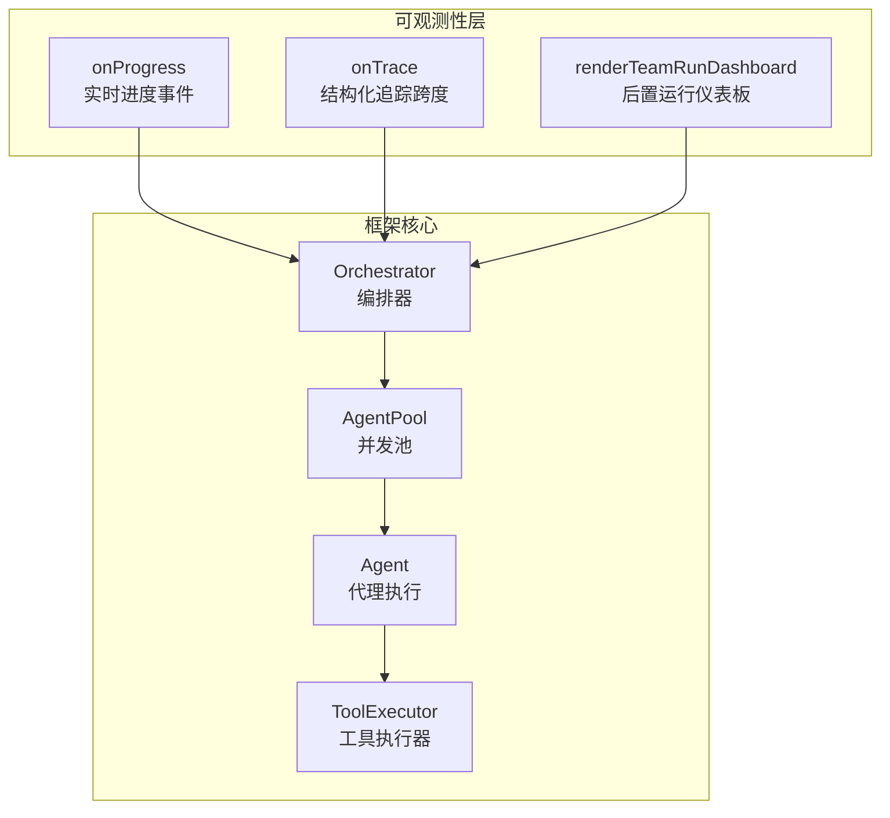
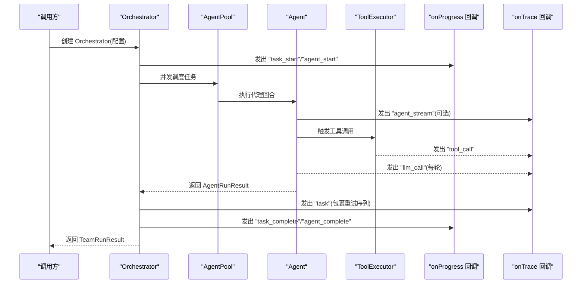
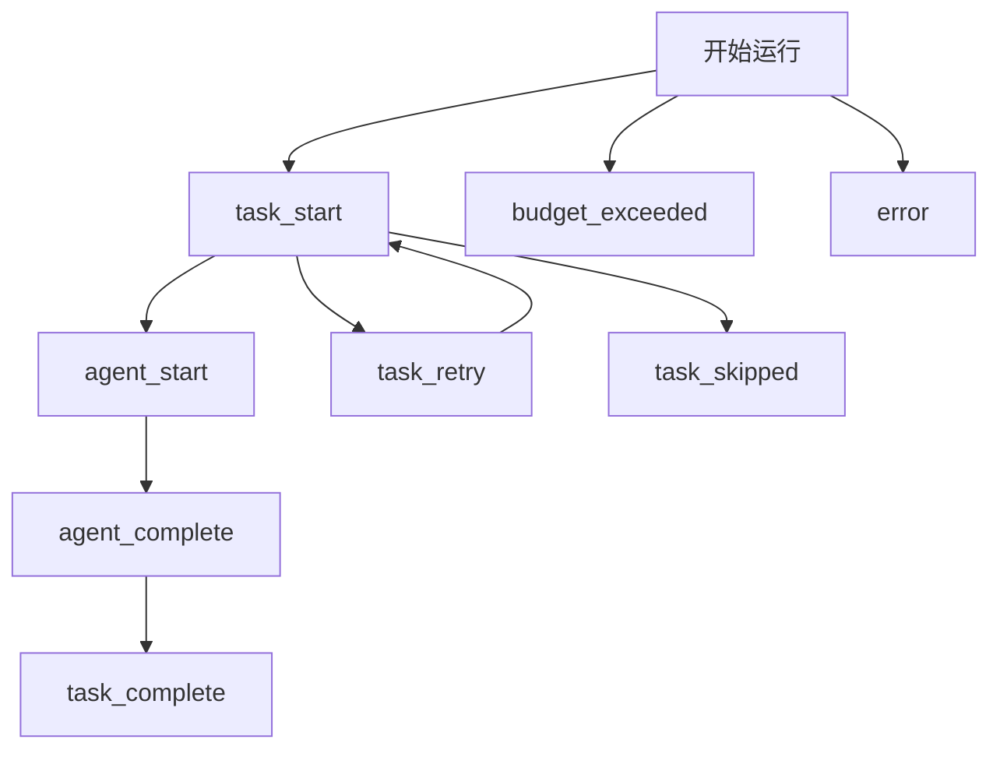
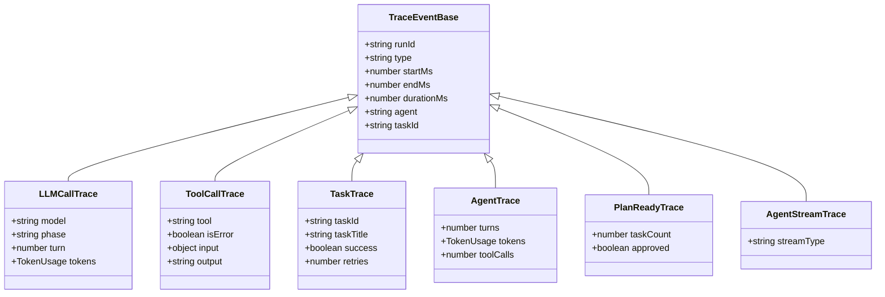
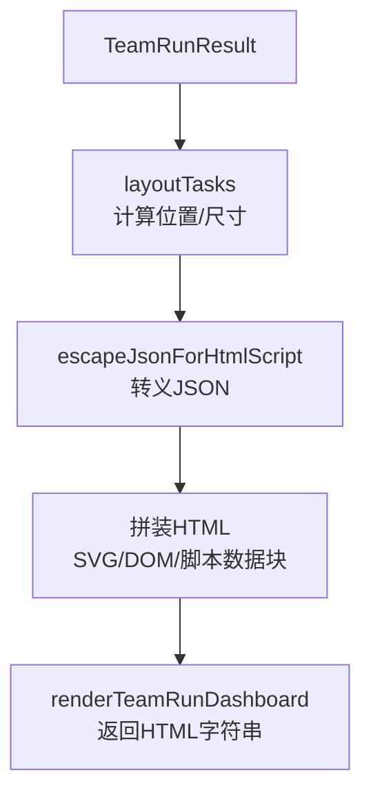
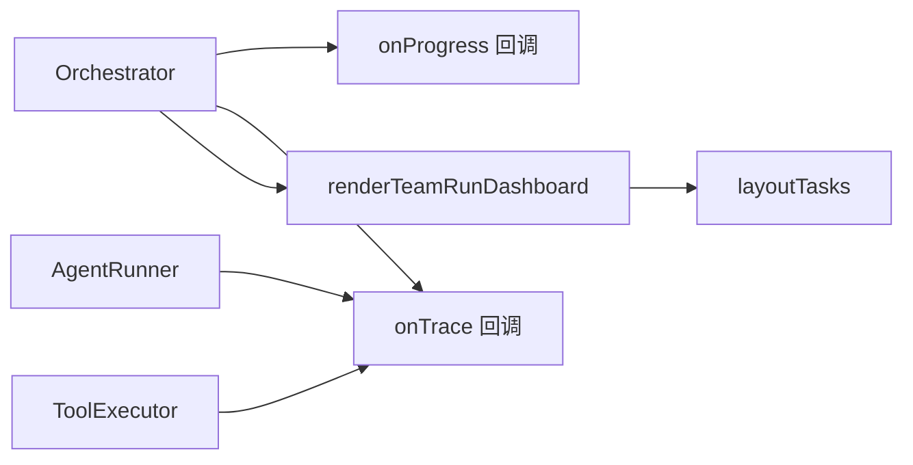

# 可观测性

<cite>
**本文引用的文件**
- [docs/observability.md](file://docs/observability.md)
- [src/utils/trace.ts](file://src/utils/trace.ts)
- [examples/integrations/trace-observability.ts](file://examples/integrations/trace-observability.ts)
- [src/dashboard/render-team-run-dashboard.ts](file://src/dashboard/render-team-run-dashboard.ts)
- [src/dashboard/layout-tasks.ts](file://src/dashboard/layout-tasks.ts)
- [src/types.ts](file://src/types.ts)
- [src/orchestrator/orchestrator.ts](file://src/orchestrator/orchestrator.ts)
- [tests/trace.test.ts](file://tests/trace.test.ts)
- [tests/dashboard-render.test.ts](file://tests/dashboard-render.test.ts)
- [examples/cookbook/incident-postmortem-dag.ts](file://examples/cookbook/incident-postmortem-dag.ts)
- [examples/cookbook/contract-review-dag.ts](file://examples/cookbook/contract-review-dag.ts)
</cite>

## 目录
1. [简介](#简介)
2. [项目结构](#项目结构)
3. [核心组件](#核心组件)
4. [架构总览](#架构总览)
5. [详细组件分析](#详细组件分析)
6. [依赖关系分析](#依赖关系分析)
7. [性能考量](#性能考量)
8. [故障排除指南](#故障排除指南)
9. [结论](#结论)
10. [附录](#附录)

## 简介
本文件面向 Open Multi-Agent 框架的可观测性系统，围绕以下目标展开：  
- 进度回调机制（onProgress）的事件类型与数据结构  
- 链路追踪（onTrace）的实现原理与自定义追踪器集成  
- 任务执行仪表板的渲染与可视化  
- 调试与监控最佳实践（日志、指标、错误跟踪）  
- 与外部监控系统（APM、分布式追踪）的集成指南  
- 故障排除与性能分析方法  
- 完整配置示例与仪表板使用指南  

## 项目结构
可观测性能力由三层组成：  
- 实时进度事件（onProgress）：轻量生命周期事件，适用于日志、终端输出或实时 UI  
- 结构化追踪跨度（onTrace）：结构化跨度，覆盖 LLM 调用、工具执行、任务与代理运行  
- 后置运行仪表板（renderTeamRunDashboard）：静态 HTML 可视化，展示任务 DAG、耗时、令牌用量、状态与详情

图示来源
- [src/orchestrator/orchestrator.ts](file://src/orchestrator/orchestrator.ts)
- [src/dashboard/render-team-run-dashboard.ts](file://src/dashboard/render-team-run-dashboard.ts)
- [src/utils/trace.ts](file://src/utils/trace.ts)

章节来源
- [docs/observability.md](file://docs/observability.md)
- [src/orchestrator/orchestrator.ts](file://src/orchestrator/orchestrator.ts)

## 核心组件
- 进度回调 onProgress：在任务/代理生命周期关键节点发出结构化事件，便于实时监控与 UI 呈现  
- 追踪回调 onTrace：在 LLM 调用、工具调用、任务完成、代理完成、计划就绪、流式事件等场景发出结构化跨度  
- 仪表板渲染：将 TeamRunResult 渲染为静态 HTML，包含任务 DAG、布局、指标与详情面板

章节来源
- [src/types.ts](file://src/types.ts)
- [src/utils/trace.ts](file://src/utils/trace.ts)
- [src/dashboard/render-team-run-dashboard.ts](file://src/dashboard/render-team-run-dashboard.ts)

## 架构总览
下图展示了从编排器到代理、工具执行器，再到 onProgress/onTrace 的事件与跨度发射路径。

图示来源
- [src/orchestrator/orchestrator.ts](file://src/orchestrator/orchestrator.ts)
- [src/utils/trace.ts](file://src/utils/trace.ts)

## 详细组件分析

### 进度回调 onProgress：事件类型与数据结构
- 事件类型
  - 任务级：task_start、task_complete、task_retry、task_skipped  
  - 代理级：agent_start、agent_complete  
  - 其他：budget_exceeded、message、error  
- 数据结构
  - 通用字段：type、agent（可选）、task（可选）、data（可选）  
  - data 中常包含任务对象（含 id、title 等）或错误信息  
- 使用建议
  - 用于实时日志、终端输出、TUI 或轻量仪表板  
  - 与时间戳结合，构建任务/代理耗时统计

图示来源
- [src/types.ts](file://src/types.ts)
- [src/orchestrator/orchestrator.ts](file://src/orchestrator/orchestrator.ts)

章节来源
- [src/types.ts](file://src/types.ts)
- [src/orchestrator/orchestrator.ts](file://src/orchestrator/orchestrator.ts)
- [examples/cookbook/incident-postmortem-dag.ts](file://examples/cookbook/incident-postmortem-dag.ts)
- [examples/cookbook/contract-review-dag.ts](file://examples/cookbook/contract-review-dag.ts)

### 链路追踪 onTrace：事件类型与数据结构
- 事件类型
  - llm_call：每次代理回合的 LLM 调用，携带模型、轮次、令牌用量  
  - tool_call：工具调用，携带工具名、输入、输出、是否错误  
  - task：任务完成跨度，包含成功与否、重试次数、起止时间  
  - agent：代理运行跨度，包含轮次、令牌用量、工具调用数  
  - plan_ready：计划就绪边界，包含任务数量与审批结果  
  - agent_stream：runTeam 流式事件转发，包含底层流事件类型  
- 数据结构要点
  - 共享字段：runId、type、startMs、endMs、durationMs、agent、taskId（可选）  
  - runId 用于跨事件关联一次运行的所有跨度  
  - 令牌用量按轮/任务/代理粒度分别记录  
- 安全发射
  - emitTrace 对回调异常与异步拒绝进行吞没，确保可观测性不中断执行

图示来源
- [src/types.ts](file://src/types.ts)
- [src/utils/trace.ts](file://src/utils/trace.ts)

章节来源
- [src/types.ts](file://src/types.ts)
- [src/utils/trace.ts](file://src/utils/trace.ts)
- [examples/integrations/trace-observability.ts](file://examples/integrations/trace-observability.ts)
- [tests/trace.test.ts](file://tests/trace.test.ts)

### 自定义追踪器集成
- 接入方式
  - 在 Orchestrator 配置中提供 onTrace 回调，即可接收所有结构化跨度  
  - 可将跨度写入日志、OpenTelemetry、时序数据库或自建追踪平台  
- 示例参考
  - 示例脚本演示了如何按事件类型格式化输出，并记录耗时、令牌用量与工具调用详情  
- 注意事项
  - onTrace 异常不会影响执行；若需持久化，建议在回调内做幂等与重试策略

章节来源
- [examples/integrations/trace-observability.ts](file://examples/integrations/trace-observability.ts)
- [src/utils/trace.ts](file://src/utils/trace.ts)

### 任务执行仪表板：渲染与可视化
- 渲染入口
  - renderTeamRunDashboard(TeamRunResult) 返回完整 HTML 字符串  
- 内容构成
  - 任务 DAG：基于 layoutTasks 计算布局，SVG 边界与节点连线  
  - 详情面板：分配代理、执行起止时间、令牌用量、工具调用数、实时输出  
  - 交互：缩放、拖拽画布、点击节点打开详情、关闭面板  
- 安全与兼容
  - JSON 嵌入 HTML 时对脚本终止符进行转义，防止 XSS  
  - 依赖 Tailwind CSS 与 Google Fonts，离线需自行托管资源  
- 布局算法
  - 基于拓扑层级列布局，列间与列内间距固定，计算画布尺寸

图示来源
- [src/dashboard/render-team-run-dashboard.ts](file://src/dashboard/render-team-run-dashboard.ts)
- [src/dashboard/layout-tasks.ts](file://src/dashboard/layout-tasks.ts)

章节来源
- [src/dashboard/render-team-run-dashboard.ts](file://src/dashboard/render-team-run-dashboard.ts)
- [src/dashboard/layout-tasks.ts](file://src/dashboard/layout-tasks.ts)
- [tests/dashboard-render.test.ts](file://tests/dashboard-render.test.ts)

## 依赖关系分析
- 编排器负责在任务调度、代理执行、工具调用、预算超限等关键节点触发 onProgress 与 onTrace  
- 代理运行器在每轮 LLM 调用与工具调用时生成 llm_call/tool_call 跨度  
- 任务完成后汇总 metrics 并发出 task 跨度  
- 代理整体完成后发出 agent 跨度  
- 仪表板依赖布局模块计算 SVG 画布与节点位置

图示来源
- [src/orchestrator/orchestrator.ts](file://src/orchestrator/orchestrator.ts)
- [src/dashboard/render-team-run-dashboard.ts](file://src/dashboard/render-team-run-dashboard.ts)
- [src/dashboard/layout-tasks.ts](file://src/dashboard/layout-tasks.ts)

章节来源
- [src/orchestrator/orchestrator.ts](file://src/orchestrator/orchestrator.ts)
- [src/dashboard/render-team-run-dashboard.ts](file://src/dashboard/render-team-run-dashboard.ts)
- [src/dashboard/layout-tasks.ts](file://src/dashboard/layout-tasks.ts)

## 性能考量
- onTrace 的时间开销
  - 仅在回调存在时进行计时与发射；无回调时避免额外时间消耗  
- 跨度发射的健壮性
  - emitTrace 吞没回调异常与异步拒绝，避免可观测性成为性能瓶颈  
- 令牌用量聚合
  - 重试序列的令牌用量会累加至最终结果，便于成本归因  
- 仪表板渲染
  - 采用纯前端渲染，交互通过 transform/translate 控制，避免频繁重排  
  - 外部资源（Tailwind、字体）需在线加载，离线环境建议内嵌或本地托管

章节来源
- [src/utils/trace.ts](file://src/utils/trace.ts)
- [tests/trace.test.ts](file://tests/trace.test.ts)
- [src/orchestrator/orchestrator.ts](file://src/orchestrator/orchestrator.ts)
- [src/dashboard/render-team-run-dashboard.ts](file://src/dashboard/render-team-run-dashboard.ts)

## 故障排除指南
- onTrace 回调报错导致未处理拒绝
  - emitTrace 已吞没异步拒绝，但仍建议在回调内部做好错误捕获与重试  
- 令牌预算超限
  - 触发 budget_exceeded 事件；检查 Orchestrator 配置中的 maxTokenBudget 与各代理/工具的输出长度限制  
- 任务卡住或循环
  - 使用 loop detection 配置；onProgress 中的 task_retry 可帮助定位重试模式  
- 仪表板无法显示样式
  - 确认网络可达 Tailwind CSS 与 Google Fonts；或在本地内嵌资源  
- XSS 防护
  - renderTeamRunDashboard 已对 JSON 嵌入进行转义；请勿手动修改数据块内容

章节来源
- [src/utils/trace.ts](file://src/utils/trace.ts)
- [tests/trace.test.ts](file://tests/trace.test.ts)
- [tests/dashboard-render.test.ts](file://tests/dashboard-render.test.ts)
- [src/orchestrator/orchestrator.ts](file://src/orchestrator/orchestrator.ts)

## 结论
Open Multi-Agent 的可观测性体系以“轻量进度事件 + 结构化追踪跨度 + 静态仪表板”三层次实现端到端可见性。通过 onProgress 快速掌握生命周期，onTrace 深入洞察 LLM 与工具行为，renderTeamRunDashboard 提供可分享的后置可视化报告。配合外部 APM/追踪系统与日志平台，可实现从开发调试到生产监控的全链路覆盖。

## 附录

### 配置示例与最佳实践
- onProgress 使用
  - 在 Orchestrator 配置中提供 onProgress，监听任务/代理生命周期事件，结合时间戳统计耗时  
  - 示例参考：[examples/cookbook/incident-postmortem-dag.ts](file://examples/cookbook/incident-postmortem-dag.ts)、[examples/cookbook/contract-review-dag.ts](file://examples/cookbook/contract-review-dag.ts)  
- onTrace 使用
  - 提供 onTrace 回调，按事件类型输出耗时、令牌用量、工具调用与错误信息  
  - 示例参考：[examples/integrations/trace-observability.ts](file://examples/integrations/trace-observability.ts)  
- 仪表板生成
  - 使用 renderTeamRunDashboard(TeamRunResult) 生成 HTML 文件，结合 CLI 参数可直接写出文件  
  - 参考文档：[docs/observability.md](file://docs/observability.md)  
- 生产持久化建议
  - 保存 TeamRunResult.tasks、totalTokenUsage、onTrace 跨度、仪表板 HTML  
  - 参考文档：[docs/observability.md](file://docs/observability.md)

### 与外部监控系统集成指南
- OpenTelemetry
  - 将 onTrace 输出映射为 Span，设置 traceId/runId 作为关联键，注入属性如 model、tool、isError、tokens 等  
- 分布式追踪系统（如 Jaeger、DataDog、Honeycomb）
  - 以 runId 为 traceId，llm_call/tool_call/task/agent 为不同 Span，建立父子关系  
- 日志与指标
  - onProgress 事件用于实时日志与告警；onTrace 事件用于指标采集（耗时、令牌用量、失败率）  
- APM 工具
  - 将 runId 注入请求上下文，确保跨服务调用可追踪；在工具执行前后打点，记录输入/输出摘要

章节来源
- [docs/observability.md](file://docs/observability.md)
- [examples/integrations/trace-observability.ts](file://examples/integrations/trace-observability.ts)
- [src/types.ts](file://src/types.ts)