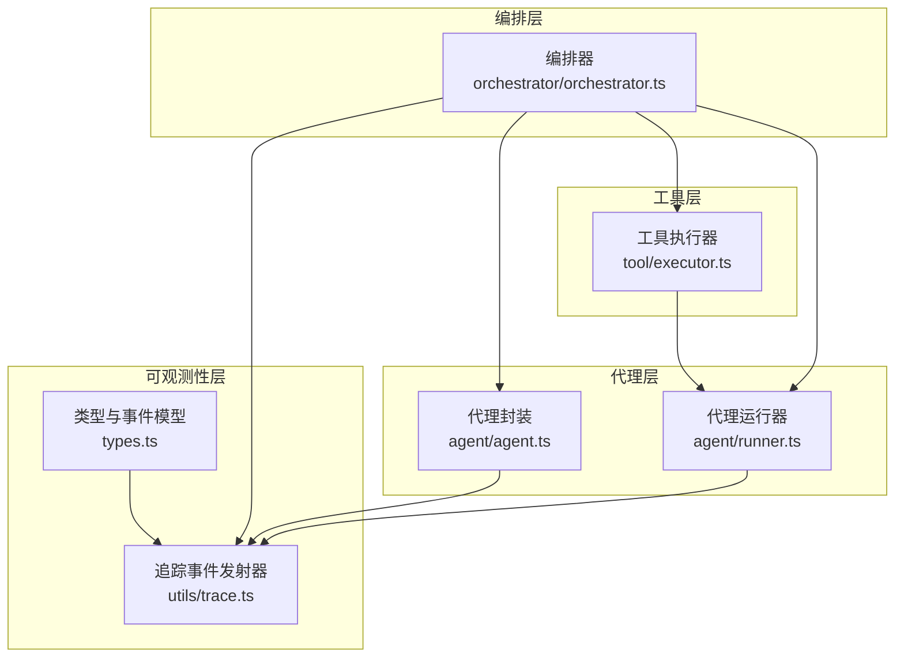
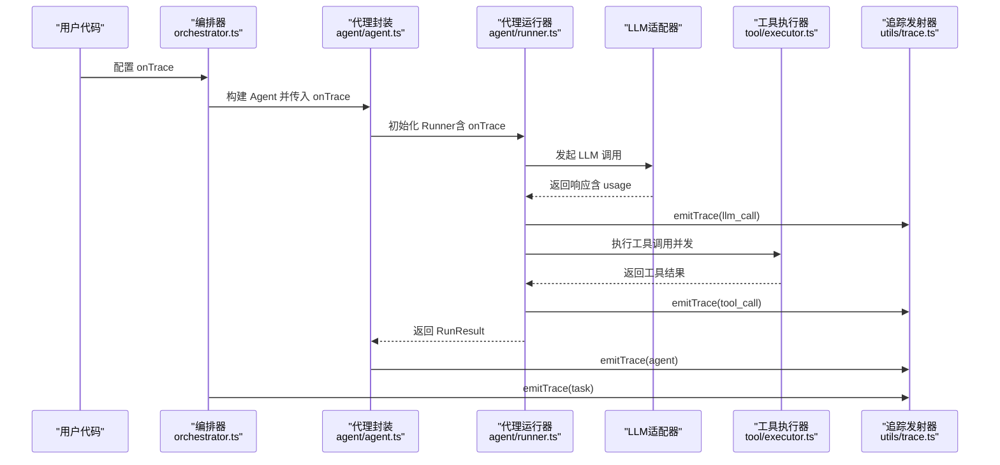
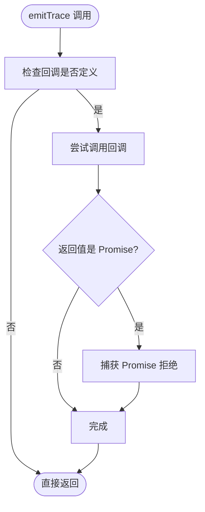
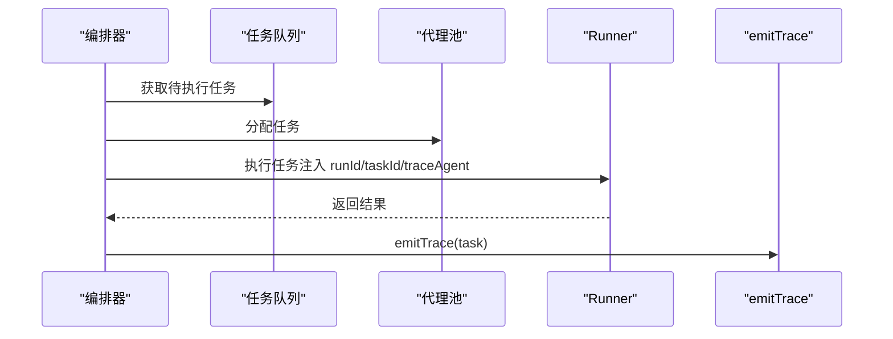
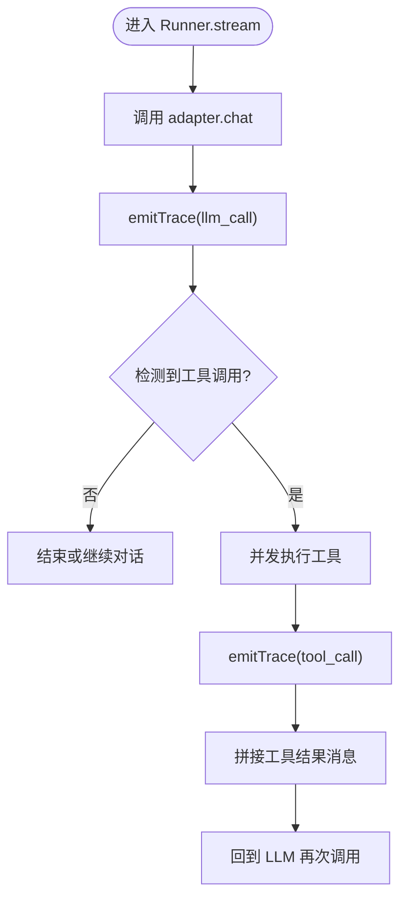
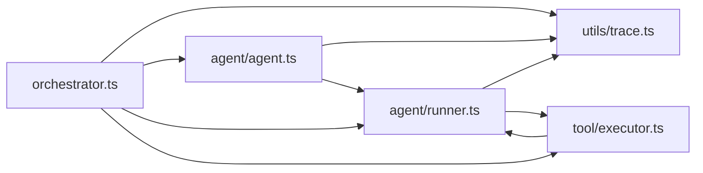

# 可观测性

<cite>
**本文引用的文件列表**
- [src/utils/trace.ts](file://src/utils/trace.ts)
- [src/types.ts](file://src/types.ts)
- [src/index.ts](file://src/index.ts)
- [examples/11-trace-observability.ts](file://examples/11-trace-observability.ts)
- [src/orchestrator/orchestrator.ts](file://src/orchestrator/orchestrator.ts)
- [src/agent/runner.ts](file://src/agent/runner.ts)
- [src/agent/agent.ts](file://src/agent/agent.ts)
- [src/tool/executor.ts](file://src/tool/executor.ts)
- [tests/trace.test.ts](file://tests/trace.test.ts)
</cite>

## 目录
1. [简介](#简介)
2. [项目结构与可观测性相关模块](#项目结构与可观测性相关模块)
3. [核心组件：追踪事件系统](#核心组件追踪事件系统)
4. [架构总览](#架构总览)
5. [详细组件分析](#详细组件分析)
6. [依赖关系分析](#依赖关系分析)
7. [性能监控最佳实践](#性能监控最佳实践)
8. [故障排查指南](#故障排查指南)
9. [结论](#结论)
10. [附录：示例与配置](#附录示例与配置)

## 简介
本文件面向 Open Multi-Agent 框架的可观测性系统，重点说明以下内容：
- 追踪事件系统的设计原理与 onTrace 回调接口规范
- 结构化跨度（TraceEvent）的格式与事件类型
- 进度回调系统（onProgress）的使用方法与事件类型
- 性能监控最佳实践（令牌使用统计、执行时间分析）
- 生产环境启用与配置可观测性的方法

## 项目结构与可观测性相关模块
可观测性能力由以下模块协同实现：
- 类型定义与事件模型：types.ts
- 追踪事件发射器：utils/trace.ts
- 顶层编排器：orchestrator/orchestrator.ts
- 代理运行器：agent/runner.ts
- 代理封装：agent/agent.ts
- 工具执行器：tool/executor.ts
- 示例与测试：examples/11-trace-observability.ts、tests/trace.test.ts

图表来源
- [src/types.ts:414-471](file://src/types.ts#L414-L471)
- [src/utils/trace.ts:12-34](file://src/utils/trace.ts#L12-L34)
- [src/orchestrator/orchestrator.ts:58-65](file://src/orchestrator/orchestrator.ts#L58-L65)
- [src/agent/agent.ts:36-40](file://src/agent/agent.ts#L36-L40)
- [src/agent/runner.ts:33-35](file://src/agent/runner.ts#L33-L35)
- [src/tool/executor.ts:14-15](file://src/tool/executor.ts#L14-L15)

章节来源
- [src/types.ts:414-471](file://src/types.ts#L414-L471)
- [src/utils/trace.ts:12-34](file://src/utils/trace.ts#L12-L34)
- [src/orchestrator/orchestrator.ts:58-65](file://src/orchestrator/orchestrator.ts#L58-L65)
- [src/agent/agent.ts:36-40](file://src/agent/agent.ts#L36-L40)
- [src/agent/runner.ts:33-35](file://src/agent/runner.ts#L33-L35)
- [src/tool/executor.ts:14-15](file://src/tool/executor.ts#L14-L15)

## 核心组件：追踪事件系统
追踪事件系统通过 onTrace 回调提供轻量级可观测性，覆盖 LLM 调用、工具执行、任务与代理运行等关键跨度。其设计要点：
- 安全发射：emitTrace 对回调错误进行吞没，避免可观测性影响主流程稳定性
- 时间戳与持续时间：每个跨度包含 startMs、endMs、durationMs
- 关联性：所有跨度共享 runId；任务跨度可携带 taskId
- 事件类型：llm_call、tool_call、task、agent

接口规范与事件类型
- onTrace 回调签名：(event: TraceEvent) => void | Promise<void>
- TraceEvent 基础字段：runId、type、startMs、endMs、durationMs、agent、taskId?
- 具体类型：
  - llm_call：model、turn、tokens
  - tool_call：tool、isError
  - task：taskId、taskTitle、success、retries
  - agent：turns、tokens、toolCalls

章节来源
- [src/utils/trace.ts:12-27](file://src/utils/trace.ts#L12-L27)
- [src/types.ts:417-471](file://src/types.ts#L417-L471)

## 架构总览
下图展示从编排器到代理运行器、再到工具执行器的调用链路与追踪事件的产生点。

图表来源
- [src/orchestrator/orchestrator.ts:362-398](file://src/orchestrator/orchestrator.ts#L362-L398)
- [src/agent/runner.ts:286-300](file://src/agent/runner.ts#L286-L300)
- [src/agent/runner.ts:426-438](file://src/agent/runner.ts#L426-L438)
- [src/agent/agent.ts:374-394](file://src/agent/agent.ts#L374-L394)
- [src/utils/trace.ts:12-27](file://src/utils/trace.ts#L12-L27)

## 详细组件分析

### 组件一：追踪事件发射器（utils/trace.ts）
- 功能：安全地向 onTrace 回调发送 TraceEvent，吞没同步异常与异步拒绝，确保可观测性不中断执行
- 关键点：
  - 当回调返回 Promise 时，捕获其拒绝以避免未处理的 Promise 拒绝
  - 提供 generateRunId 生成全局唯一的 runId，用于跨跨度关联

图表来源
- [src/utils/trace.ts:12-27](file://src/utils/trace.ts#L12-L27)

章节来源
- [src/utils/trace.ts:12-34](file://src/utils/trace.ts#L12-L34)

### 组件二：类型与事件模型（types.ts）
- TraceEventBase：所有跨度共享的基础字段（runId、type、startMs、endMs、durationMs、agent、taskId?）
- TraceEventType：'llm_call' | 'tool_call' | 'task' | 'agent'
- LLMCallTrace：model、turn、tokens
- ToolCallTrace：tool、isError
- TaskTrace：taskId、taskTitle、success、retries
- AgentTrace：turns、tokens、toolCalls
- TokenUsage：input_tokens、output_tokens

章节来源
- [src/types.ts:417-471](file://src/types.ts#L417-L471)
- [src/types.ts:68-81](file://src/types.ts#L68-L81)

### 组件三：编排器中的任务追踪（orchestrator.ts）
- 在任务开始与结束时，编排器构建并发出 task 跨度
- 使用 generateRunId 为整次 runTeam/runTasks 生成 runId
- 将 runId、taskId、traceAgent 注入到 RunOptions 中传递给 Runner

图表来源
- [src/orchestrator/orchestrator.ts:362-398](file://src/orchestrator/orchestrator.ts#L362-L398)
- [src/orchestrator/orchestrator.ts:659-669](file://src/orchestrator/orchestrator.ts#L659-L669)
- [src/orchestrator/orchestrator.ts:796](file://src/orchestrator/orchestrator.ts#L796)

章节来源
- [src/orchestrator/orchestrator.ts:362-398](file://src/orchestrator/orchestrator.ts#L362-L398)
- [src/orchestrator/orchestrator.ts:659-669](file://src/orchestrator/orchestrator.ts#L659-L669)
- [src/orchestrator/orchestrator.ts:796](file://src/orchestrator/orchestrator.ts#L796)

### 组件四：代理运行器中的 LLM 与工具追踪（agent/runner.ts）
- LLM 调用：每次 adapter.chat 后，计算耗时并发出 llm_call 跨度
- 工具调用：每个工具执行前后记录耗时，发出 tool_call 跨度
- 事件字段：包含 turn、tokens、tool、isError 等

图表来源
- [src/agent/runner.ts:286-300](file://src/agent/runner.ts#L286-L300)
- [src/agent/runner.ts:426-438](file://src/agent/runner.ts#L426-L438)

章节来源
- [src/agent/runner.ts:286-300](file://src/agent/runner.ts#L286-L300)
- [src/agent/runner.ts:426-438](file://src/agent/runner.ts#L426-L438)

### 组件五：代理封装中的代理跨度（agent/agent.ts）
- 在一次 run 或 prompt 完成后，根据累计的 tokenUsage、turns、toolCalls 发出 agent 跨度
- 自动注入 runId（当 onTrace 存在且 callerOptions 未提供时）

章节来源
- [src/agent/agent.ts:374-394](file://src/agent/agent.ts#L374-L394)
- [src/agent/agent.ts:308-326](file://src/agent/agent.ts#L308-L326)

### 组件六：工具执行器（tool/executor.ts）
- 并发控制：通过信号量限制最大并发
- 错误隔离：将工具执行错误转换为 ToolResult（isError: true），不抛出异常
- 与 Runner 的协作：Runner 在工具执行前后发出 tool_call 跨度

章节来源
- [src/tool/executor.ts:47-90](file://src/tool/executor.ts#L47-L90)
- [src/tool/executor.ts:105-121](file://src/tool/executor.ts#L105-L121)
- [src/tool/executor.ts:132-169](file://src/tool/executor.ts#L132-L169)

## 依赖关系分析
- 编排器依赖追踪发射器与工具注册表/执行器，负责任务调度与事件上报
- 代理封装依赖适配器与运行器，负责状态管理与最终代理跨度
- 代理运行器依赖适配器与工具执行器，负责每轮对话与工具调用
- 追踪发射器被多处调用，但不反向依赖业务逻辑，保持低耦合

图表来源
- [src/orchestrator/orchestrator.ts:58-65](file://src/orchestrator/orchestrator.ts#L58-L65)
- [src/agent/agent.ts:36-40](file://src/agent/agent.ts#L36-L40)
- [src/agent/runner.ts:33-35](file://src/agent/runner.ts#L33-L35)
- [src/tool/executor.ts:14-15](file://src/tool/executor.ts#L14-L15)

章节来源
- [src/orchestrator/orchestrator.ts:58-65](file://src/orchestrator/orchestrator.ts#L58-L65)
- [src/agent/agent.ts:36-40](file://src/agent/agent.ts#L36-L40)
- [src/agent/runner.ts:33-35](file://src/agent/runner.ts#L33-L35)
- [src/tool/executor.ts:14-15](file://src/tool/executor.ts#L14-L15)

## 性能监控最佳实践
- 令牌使用统计
  - LLM 调用：llm_call 跨度携带 per-call 的 tokens（input_tokens、output_tokens）
  - 代理运行：agent 跨度携带整次运行的累计 tokenUsage
  - 任务重试：编排器在 executeWithRetry 中累加各次尝试的 tokenUsage，最终结果反映真实成本
- 执行时间分析
  - 每个跨度包含 startMs、endMs、durationMs，可用于端到端与细粒度耗时分析
  - 建议按 agent、tool、task、llm_call 等维度聚合统计
- 并发与吞吐
  - 工具执行器默认并发限制为 4，可根据资源与延迟目标调整
  - 代理运行器支持并发工具调用，有助于减少总等待时间
- 可观测性开销
  - emitTrace 对回调异常进行吞没，避免可观测性成为性能瓶颈
  - onTrace 为空时，Runner 不进行时间测量，降低开销

章节来源
- [src/agent/runner.ts:286-300](file://src/agent/runner.ts#L286-L300)
- [src/agent/runner.ts:426-438](file://src/agent/runner.ts#L426-L438)
- [src/orchestrator/orchestrator.ts:139-152](file://src/orchestrator/orchestrator.ts#L139-L152)
- [src/tool/executor.ts:47-54](file://src/tool/executor.ts#L47-L54)

## 故障排查指南
- onTrace 回调异常不会中断执行
  - emitTrace 对同步异常与异步拒绝均进行吞没
  - 测试覆盖了回调抛错与异步拒绝场景
- 代理运行器在工具失败时仍会发出 tool_call 跨度，isError 标记为 true
- 代理封装在 afterRun 抛错时，仍会发出 agent 跨度，便于定位问题
- 编排器在任务失败时发出 error 事件，便于外部观察

章节来源
- [src/utils/trace.ts:12-27](file://src/utils/trace.ts#L12-L27)
- [tests/trace.test.ts:106-158](file://tests/trace.test.ts#L106-L158)
- [src/agent/runner.ts:415-420](file://src/agent/runner.ts#L415-L420)
- [src/agent/agent.ts:357-371](file://src/agent/agent.ts#L357-L371)

## 结论
Open Multi-Agent 的可观测性系统以轻量、稳健为核心设计原则：
- 通过统一的 TraceEvent 模型与 emitTrace 安全发射机制，覆盖 LLM 调用、工具执行、任务与代理运行的关键跨度
- 提供 runId 关联与细粒度时间戳，满足端到端与分层性能分析需求
- 在生产环境中，建议开启 onTrace 并结合 onProgress 实现全面的可观测性与进度反馈

## 附录：示例与配置
- 示例：examples/11-trace-observability.ts 展示了如何配置 onTrace 并输出 LLM、工具、任务、代理跨度
- 公共导出：src/index.ts 导出了 generateRunId，便于外部生成 runId
- 配置项：OrchestratorConfig 支持 onTrace 与 onProgress；AgentConfig 支持 beforeRun/afterRun 钩子

章节来源
- [examples/11-trace-observability.ts:45-74](file://examples/11-trace-observability.ts#L45-L74)
- [src/index.ts:182](file://src/index.ts#L182)
- [src/times.ts:386-411](file://src/types.ts#L386-L411)
- [src/types.ts:185-241](file://src/types.ts#L185-L241)