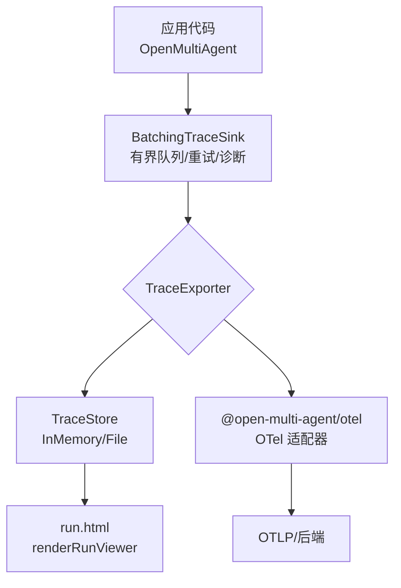
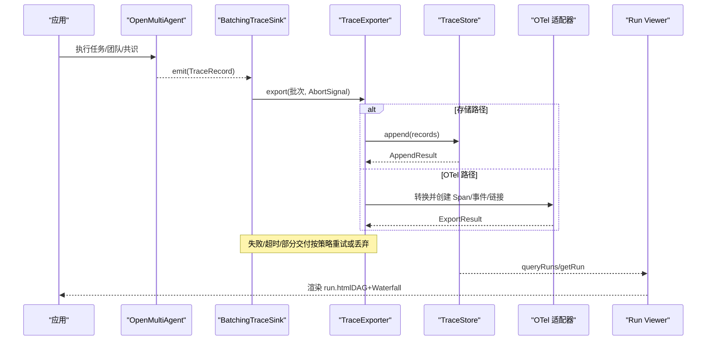
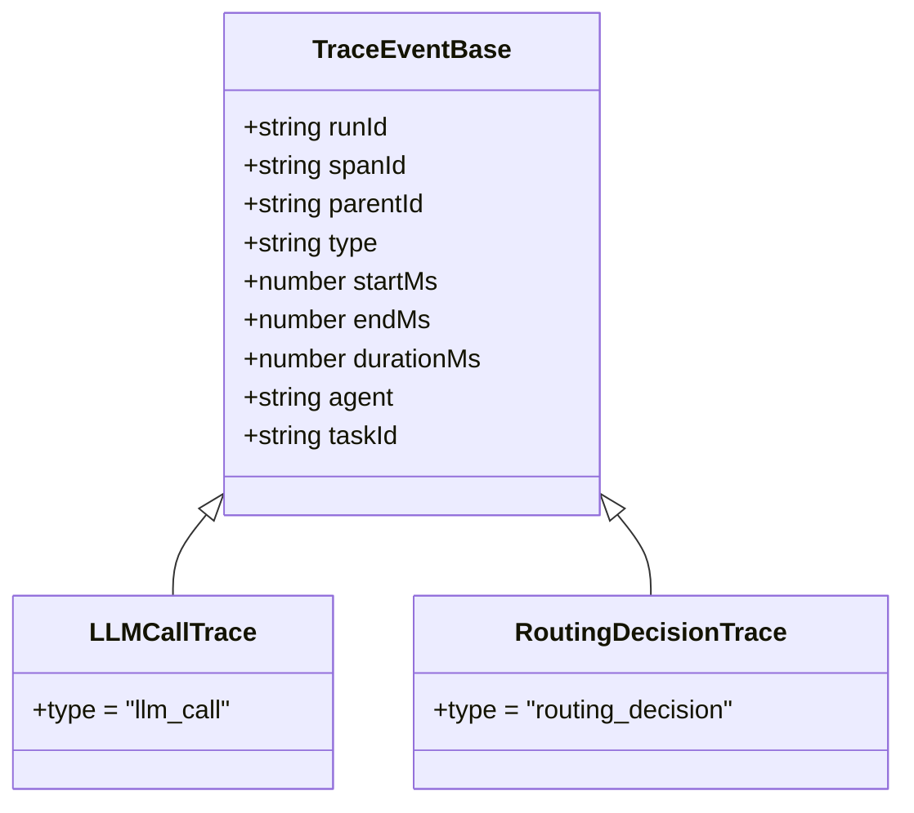
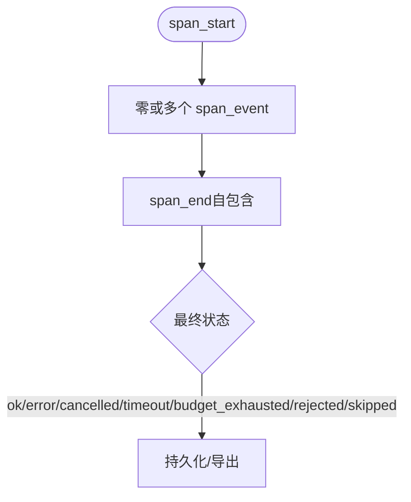
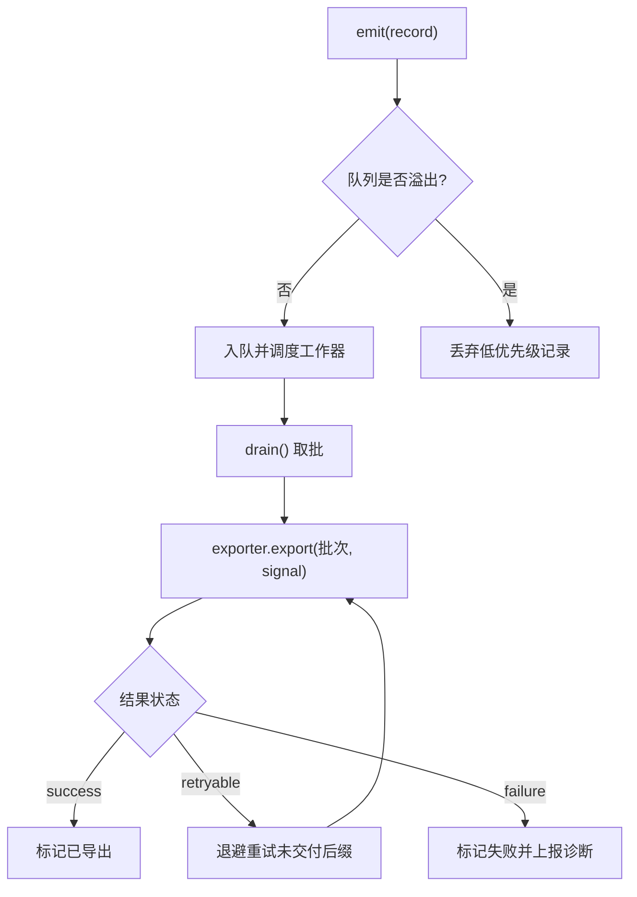
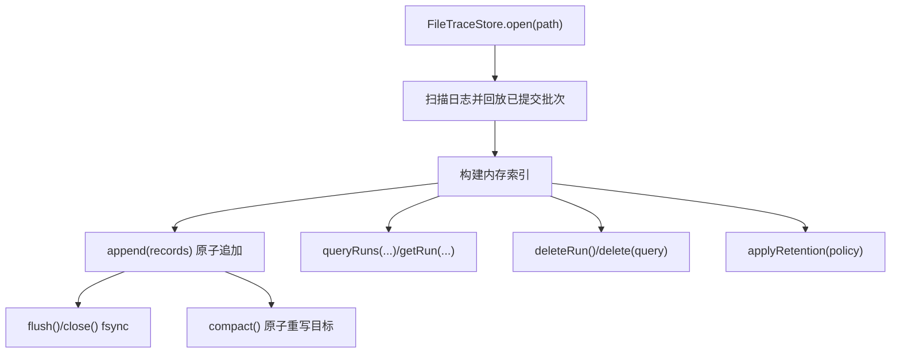
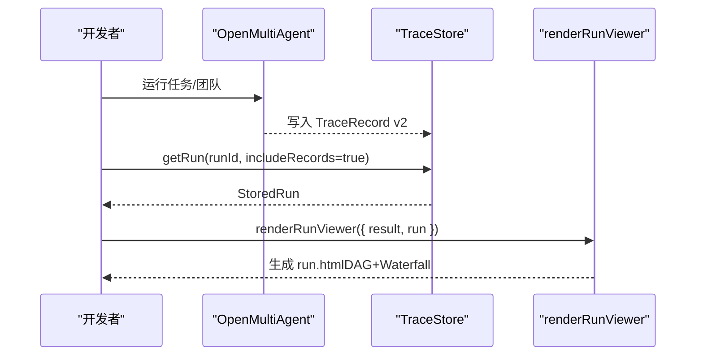
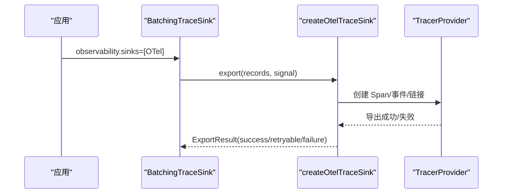
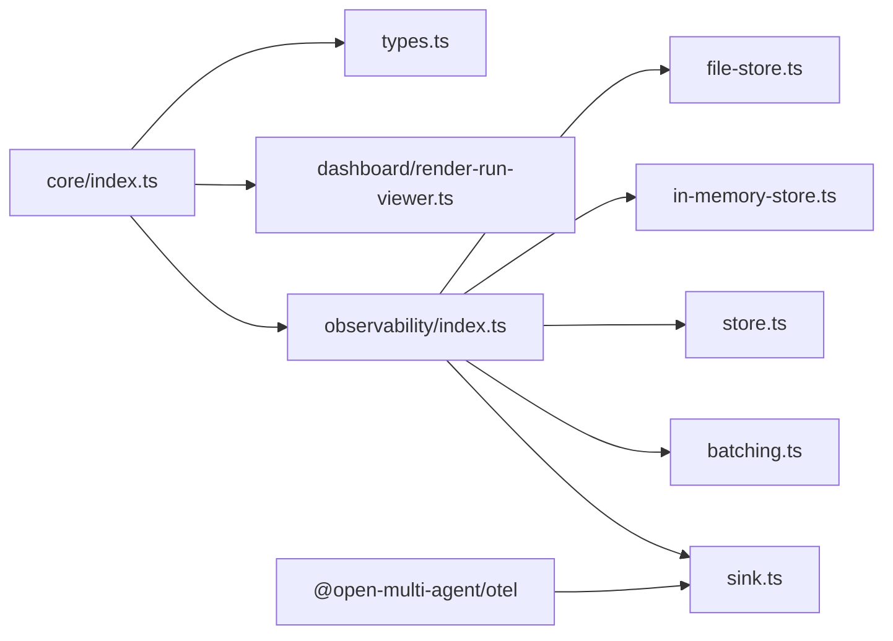

# 可观测性

<cite>
**本文引用的文件**
- [observability.md](file://docs/observability.md)
- [observability-migration.md](file://docs/observability-migration.md)
- [observability-performance.md](file://docs/observability-performance.md)
- [otel README.md](file://packages/otel/README.md)
- [types.ts](file://packages/core/src/types.ts)
- [index.ts（核心导出）](file://packages/core/src/index.ts)
- [observability/index.ts](file://packages/core/src/observability/index.ts)
- [sink.ts](file://packages/core/src/observability/sink.ts)
- [batching.ts](file://packages/core/src/observability/batching.ts)
- [render-run-viewer.ts](file://packages/core/src/dashboard/render-run-viewer.ts)
</cite>

## 目录
1. [简介](#简介)
2. [项目结构](#项目结构)
3. [核心组件](#核心组件)
4. [架构总览](#架构总览)
5. [详细组件分析](#详细组件分析)
6. [依赖关系分析](#依赖关系分析)
7. [性能考量](#性能考量)
8. [故障排查指南](#故障排查指南)
9. [结论](#结论)
10. [附录](#附录)

## 简介
本文件系统性介绍 Open Multi-Agent 的可观测性体系，覆盖执行追踪（TraceEvent/TraceRecord）、离线查看器（Run Viewer）、指标与告警、最佳实践、与 OpenTelemetry 的集成，以及在生产中用于故障排查与性能优化的方法。内容基于仓库中的文档与源码实现，确保与实际代码一致并可追溯。

## 项目结构
Open Multi-Agent 的可观测性由“运行时采集 → 批处理与导出 → 存储/适配器 → 可视化”的分层组成：
- 运行时：Agent/Task/LLM/Tool/Consensus/Checkpoint 等产生 TraceRecord v2 或兼容的 TraceEvent。
- 导出层：BatchingTraceSink 提供有界队列、重试、超时、诊断；支持自定义 TraceExporter。
- 存储层：TraceStore 抽象（InMemoryTraceStore、FileTraceStore），提供追加、查询、删除、保留策略。
- 适配层：@open-multi-agent/otel 将 TraceRecord 转为 OTel Span/事件/链接。
- 可视化：renderRunViewer 生成单运行静态 HTML（DAG + Waterfall）。

图表来源
- [batching.ts:163-242](file://packages/core/src/observability/batching.ts#L163-L242)
- [sink.ts:76-108](file://packages/core/src/observability/sink.ts#L76-L108)
- [observability.md:185-223](file://docs/observability.md#L185-L223)
- [otel README.md:17-63](file://packages/otel/README.md#L17-L63)
- [render-run-viewer.ts:17-20](file://packages/core/src/dashboard/render-run-viewer.ts#L17-L20)

章节来源
- [observability.md:151-223](file://docs/observability.md#L151-L223)
- [observability.md:224-446](file://docs/observability.md#L224-L446)
- [observability.md:459-525](file://docs/observability.md#L459-L525)
- [observability.md:527-600](file://docs/observability.md#L527-L600)
- [observability.md:670-741](file://docs/observability.md#L670-L741)

## 核心组件
- TraceEvent/TraceRecord：轻量级追踪事件与 v2 记录模型，包含 runId、traceId、spanId、kind、时间戳、状态、属性、links 等。
- BatchingTraceSink：同步非阻塞 emit，内部有界队列、批量导出、退避重试、超时控制、诊断与统计。
- TraceStore：介质无关的追加/查询/删除/保留接口，含内存与文件参考实现。
- @open-multi-agent/otel：将 TraceRecord 映射为 OTel Span/事件/链接，保持隐私边界与稳定关联字段。
- Run Viewer：renderRunViewer 输出无网络依赖的单运行 HTML，支持 DAG/Waterfall、过滤、搜索、路由摘要。

章节来源
- [types.ts:2668-2705](file://packages/core/src/types.ts#L2668-L2705)
- [observability/index.ts:1-68](file://packages/core/src/observability/index.ts#L1-L68)
- [sink.ts:76-108](file://packages/core/src/observability/sink.ts#L76-L108)
- [batching.ts:14-41](file://packages/core/src/observability/batching.ts#L14-L41)
- [observability.md:151-184](file://docs/observability.md#L151-L184)
- [observability.md:224-446](file://docs/observability.md#L224-L446)
- [otel README.md:79-123](file://packages/otel/README.md#L79-L123)
- [render-run-viewer.ts:17-20](file://packages/core/src/dashboard/render-run-viewer.ts#L17-L20)

## 架构总览
下图展示从运行时到可视化的端到端数据流，包括批处理、存储、OTel 适配与离线查看。

图表来源
- [batching.ts:210-242](file://packages/core/src/observability/batching.ts#L210-L242)
- [batching.ts:351-399](file://packages/core/src/observability/batching.ts#L351-L399)
- [observability.md:185-223](file://docs/observability.md#L185-L223)
- [observability.md:224-288](file://docs/observability.md#L224-L288)
- [otel README.md:79-123](file://packages/otel/README.md#L79-L123)
- [observability.md:670-741](file://docs/observability.md#L670-L741)

## 详细组件分析

### 执行追踪：TraceEvent 与 TraceRecord v2
- TraceEvent：面向兼容性的轻量事件集合，包含 llm_call、tool_call、task、agent、plan_ready、agent_stream、consensus、routing_decision 等类型，附带 spanId、parentId、startMs/endMs/durationMs、agent、taskId 等共享字段。
- TraceRecord v2：OBS-1B/OBS-2 内部使用的结构化记录，包含 schemaVersion=2、recordId、sequence、run identity、W3C trace/span IDs、时间戳、status、safe attributes、links；层级通过 parent 与 links 表达（如 depends_on、consumed、continued_from、delegated_from）。
- 生命周期：span_start → 零或多个 span_event → 一个自包含的 span_end；幂等关闭，首个 span_end 生效。
- 元数据与身份：每次顶层执行返回 identity（runId、attempt、traceId、rootSpanId、links?）与 status；metadata 以 oma.meta.* 写入根 span，并在结果中回显。

图表来源
- [types.ts:2668-2705](file://packages/core/src/types.ts#L2668-L2705)

图表来源
- [observability.md:151-184](file://docs/observability.md#L151-L184)

章节来源
- [types.ts:2668-2705](file://packages/core/src/types.ts#L2668-L2705)
- [observability.md:12-83](file://docs/observability.md#L12-L83)
- [observability.md:151-184](file://docs/observability.md#L151-L184)

### 批处理与导出：BatchingTraceSink
- 设计要点：
  - 同步 emit，非阻塞入队；超限记录直接拒绝。
  - 有界队列：记录数、字节数上限；按优先级丢弃（stream_chunk > 其他事件 > span_start > span_end）。
  - 批量导出：默认每批最多 512 条，调度延迟 5s，导出超时 30s。
  - 重试：指数退避 + 等抖动，最大重试 3 次，退避上限 30s。
  - 诊断：限频警告，不泄露负载；统计 accepted/exported/retried/failed/dropped/queued。
- 生命周期：forceFlush 捕获水位线并委托 exporter.forceFlush；shutdown 原子停止接受、flush、调用 exporter.shutdown。

图表来源
- [batching.ts:14-41](file://packages/core/src/observability/batching.ts#L14-L41)
- [batching.ts:75-80](file://packages/core/src/observability/batching.ts#L75-L80)
- [batching.ts:210-242](file://packages/core/src/observability/batching.ts#L210-L242)
- [batching.ts:351-399](file://packages/core/src/observability/batching.ts#L351-L399)

章节来源
- [batching.ts:163-521](file://packages/core/src/observability/batching.ts#L163-L521)
- [sink.ts:7-31](file://packages/core/src/observability/sink.ts#L7-L31)
- [observability.md:527-600](file://docs/observability.md#L527-L600)

### 存储：TraceStore（InMemory / File）
- InMemoryTraceStore：进程内索引，适合测试与本地检查；无持久化。
- FileTraceStore：Node 专属参考实现，append-only NDJSON 信封，带 batch_start/item/commit；打开时回放已提交批次，截断损坏尾部；支持 flush/fsync、compact（原子重命名）、delete/retention。
- 查询：queryRuns 支持 runId、时间范围、状态、agent、task、model、provider 组合过滤；稳定排序 (startedAt, runId)；游标实例绑定且不可篡改。
- 删除与保留：deleteRun/delete(query) 幂等；retention 支持 maxAgeMs、maxRuns、终端状态范围。

图表来源
- [observability.md:255-383](file://docs/observability.md#L255-L383)
- [observability.md:385-446](file://docs/observability.md#L385-L446)

章节来源
- [observability.md:224-446](file://docs/observability.md#L224-L446)

### 离线查看器：Run Viewer
- renderRunViewer 接收 TeamRunResult、StoredRun 或两者，生成无网络依赖的静态 HTML。
- 视图能力：DAG（任务图）与 Waterfall（瀑布时序）联动；搜索与过滤（kind/status/agent/task）；路由摘要（模式、来源、原因、实际拓扑证据）。
- 数据来源：结果优先（权威拓扑），结合 trace 证据；仅显示安全字段，不包含提示/工具参数/结果/推理内容。
- CLI：oma run --dashboard 捕获并渲染；oma dashboard --trace-store --run-id 导出历史运行。

图表来源
- [observability.md:670-741](file://docs/observability.md#L670-L741)
- [render-run-viewer.ts:17-20](file://packages/core/src/dashboard/render-run-viewer.ts#L17-L20)

章节来源
- [observability.md:670-741](file://docs/observability.md#L670-L741)
- [index.ts（核心导出）:111-130](file://packages/core/src/index.ts#L111-L130)

### 指标收集系统
- 内置统计：BatchingTraceSink.getStats() 暴露 accepted/exported/retried/failed/dropped/queuedRecords/queuedBytes/lastError 等，便于监控与告警。
- 业务指标建议：
  - 性能：p95 入队耗时、导出耗时、失败率、丢弃率、队列深度/大小。
  - 业务：按 runId/agent/task/model/provider 聚合的成功率、耗时分布、token 用量与成本。
  - 质量：governanceConclusion（满足/不满足/不适用）与 ExecutionReceipt 事实。
- 告警配置建议：
  - sink 级别：dropped>0、failed>0、lastError 出现、flush/shutdown 超时。
  - 存储级别：compaction 失败、fsync 失败、schema 不支持。
  - 业务级别：governance unsatisfied、budget_exhausted、timeout 比例上升。

章节来源
- [batching.ts:282-288](file://packages/core/src/observability/batching.ts#L282-L288)
- [observability.md:572-600](file://docs/observability.md#L572-L600)
- [observability.md:129-149](file://docs/observability.md#L129-L149)

### 与 OpenTelemetry 集成
- 适配器职责：将 TraceRecord 转为 OTel Span/事件/链接，保留 stable 关联字段（oma.run.id、oma.trace.id、oma.span.id 等）。
- 隐私边界：默认不导出 prompt/completion/tool 参数/结果/推理内容；仅转发低敏感度 oma.* 白名单；token 计数允许。
- 生命周期：应用拥有 tracerProvider；adapter 不替换全局 provider；可选 shutdownOnShutdown。
- 链接解析：同进程恢复可解析为 SDK 上下文；跨进程恢复使用 OMA ID 建立远程链接。

图表来源
- [otel README.md:17-63](file://packages/otel/README.md#L17-L63)
- [otel README.md:79-123](file://packages/otel/README.md#L79-L123)
- [observability.md:459-525](file://docs/observability.md#L459-L525)

章节来源
- [otel README.md:17-77](file://packages/otel/README.md#L17-L77)
- [otel README.md:79-145](file://packages/otel/README.md#L79-L145)
- [observability.md:459-525](file://docs/observability.md#L459-L525)

## 依赖关系分析
- 核心导出：index.ts 暴露 orchestrator、dashboard（renderRunViewer）、agent/team/task/tool/llm 等模块；observability 子路径暴露 sinks、stores、processors 等。
- 运行时耦合：
  - OpenMultiAgent 通过 observability.sinks 注入 TraceSink；默认不启用时无额外开销。
  - BatchingTraceSink 依赖 TraceExporter；可对接 TraceStoreExporter 或 OTel 适配器。
  - TraceStore 抽象解耦存储介质；InMemory/File 实现遵循相同契约。
- 外部依赖：@open-multi-agent/otel 独立包，不引入 core 的 OTel 运行时；应用自行选择 OTLP 或其他导出器。

图表来源
- [index.ts（核心导出）:111-130](file://packages/core/src/index.ts#L111-L130)
- [observability/index.ts:1-68](file://packages/core/src/observability/index.ts#L1-L68)
- [otel README.md:1-15](file://packages/otel/README.md#L1-L15)

章节来源
- [index.ts（核心导出）:1-200](file://packages/core/src/index.ts#L1-L200)
- [observability/index.ts:1-68](file://packages/core/src/observability/index.ts#L1-L68)

## 性能考量
- 预算与基准：
  - 无 sink 墙钟时间回归 <1%；保留内存增量 <1 KiB/结果。
  - 遗留回调分发 p95 <10 µs；批处理入队 p95 <20 µs；OTel 转换+内存处理 p95 <50 µs。
  - 全链路相对开销报告 vs 无 sink；CI 阈值放宽 10x 作为回归报警。
- 存储性能：
  - InMemory：追加/查询/堆占用；File：append/fsync/reopen/query/compaction；文件大小与批大小对比。
  - 队列压力注入验证有界性与丢弃行为。
- 优化建议：
  - 合理设置 maxQueueRecords/maxQueueBytes/maxBatchRecords/scheduledDelayMs/exportTimeoutMs。
  - 对高频 stream_chunk 事件采用批处理与去重策略。
  - 使用 FileTraceStore.compact 定期压缩，减少 I/O 与查询成本。
  - 在 OTel 侧避免高基数标签，仅导出必要维度。

章节来源
- [observability-performance.md:8-20](file://docs/observability-performance.md#L8-L20)
- [observability-performance.md:22-57](file://docs/observability-performance.md#L22-L57)
- [observability-performance.md:64-118](file://docs/observability-performance.md#L64-L118)
- [observability-performance.md:129-141](file://docs/observability-performance.md#L129-L141)

## 故障排查指南
- 常见问题定位：
  - 丢失追踪：检查 sink 是否配置、是否调用 forceFlush/shutdown；确认 exporter 返回 partial/retryable/failure。
  - 存储异常：FileTraceStore 打开失败（格式/版本不支持）、compaction 临时文件残留、fsync 失败。
  - 性能退化：队列满导致丢弃、导出超时、重试风暴；调整批大小与超时。
  - OTel 链接未解析：跨进程恢复需依赖 OMA ID 关联；确认 adapter 缓存与 provider 生命周期。
- 诊断与告警：
  - 使用 getStats() 与 onDiagnostic 监控 dropped/failed/lastError。
  - 对 sink/store/OTel 分别设置独立告警阈值与降级策略。
- 迁移注意事项：
  - 阶段式迁移（onTrace → LegacyCallbackTraceSink → BatchingTraceSink → TraceStore/OTel → 生命周期管理）。
  - 隐私差异：v2 默认不捕获敏感内容；legacy 保留历史脱敏字段。

章节来源
- [observability-migration.md:11-33](file://docs/observability-migration.md#L11-L33)
- [observability-migration.md:34-179](file://docs/observability-migration.md#L34-L179)
- [observability.md:572-600](file://docs/observability.md#L572-L600)
- [observability.md:297-383](file://docs/observability.md#L297-L383)

## 结论
Open Multi-Agent 的可观测性以 TraceRecord v2 为核心，提供高性能、有界、可恢复的数据管道，并通过 TraceStore 与 OTel 适配器打通存储与生态。Run Viewer 提供强大的离线分析能力。生产部署应重视采样、批处理、存储与告警策略，结合治理结论与执行收据进行合规与质量保障。

## 附录
- 快速开始：
  - 启用 sink：observability.sinks = [BatchingTraceSink(exporter)]。
  - 使用 TraceStore：InMemoryTraceStore（测试）或 FileTraceStore（本地/CLI）。
  - 接入 OTel：createOtelTraceSink({ tracerProvider })。
  - 生成看板：renderRunViewer({ result, run }) 或 CLI 命令。
- 最佳实践清单：
  - 明确资源与运行元数据边界（instance-level vs per-run）。
  - 限制 metadata 键值长度与数量，避免高基数。
  - 对敏感数据使用 SensitiveDataProcessor 与 allowlist。
  - 在 serverless/CLI/server 场景下正确管理 flush/shutdown/close。
  - 定期 compact 与 retention，控制存储增长。
  - 将 sink 失败与业务成功解耦，避免影响主流程。