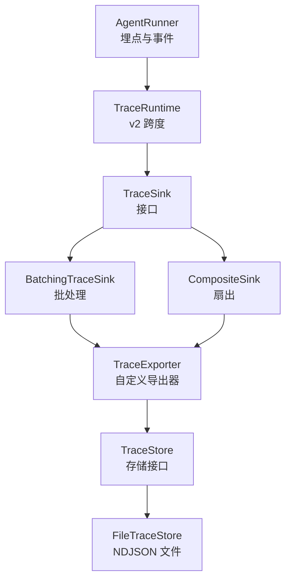
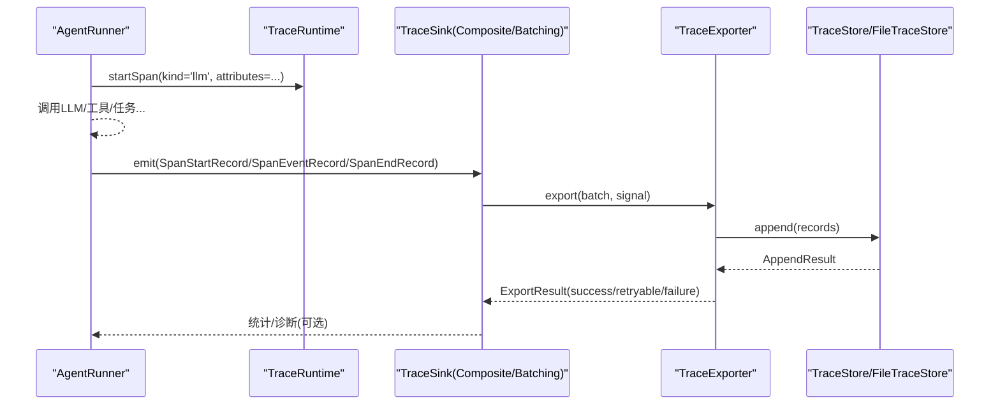
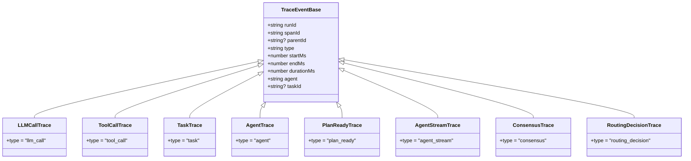
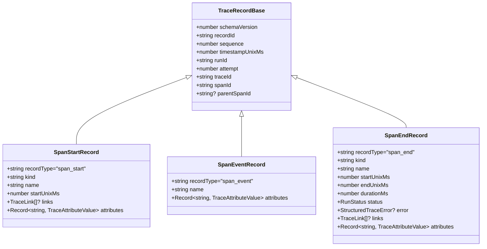
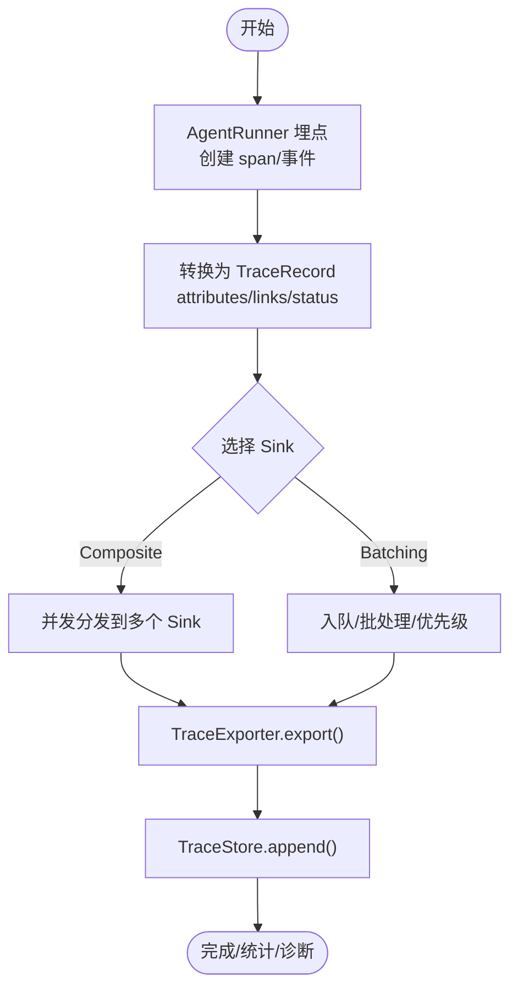
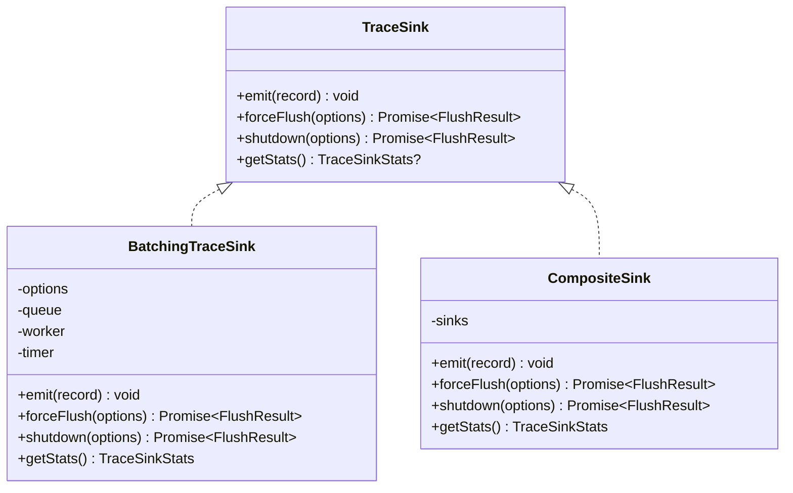
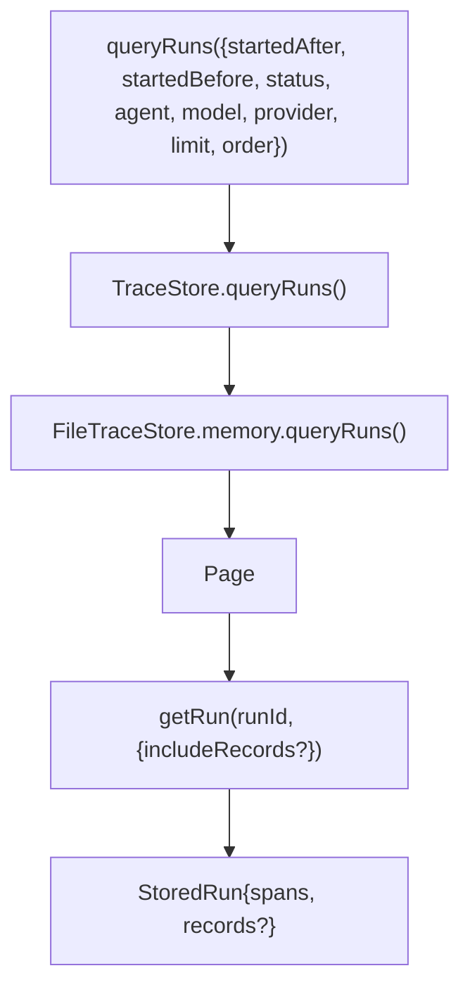
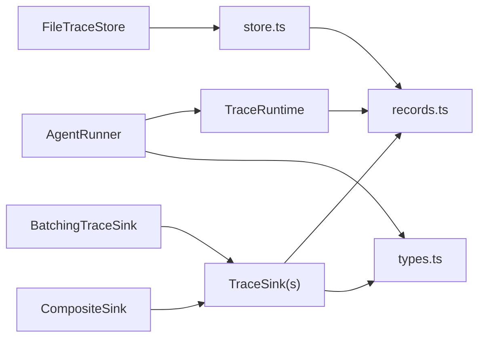

# 执行追踪

<cite>
**本文引用的文件**
- [packages/core/src/types.ts](file://packages/core/src/types.ts)
- [packages/core/src/observability/records.ts](file://packages/core/src/observability/records.ts)
- [packages/core/src/observability/sink.ts](file://packages/core/src/observability/sink.ts)
- [packages/core/src/observability/batching.ts](file://packages/core/src/observability/batching.ts)
- [packages/core/src/observability/composite.ts](file://packages/core/src/observability/composite.ts)
- [packages/core/src/observability/store.ts](file://packages/core/src/observability/store.ts)
- [packages/core/src/observability/file-store.ts](file://packages/core/src/observability/file-store.ts)
- [packages/core/src/agent/runner.ts](file://packages/core/src/agent/runner.ts)
</cite>

## 目录
1. [简介](#简介)
2. [项目结构](#项目结构)
3. [核心组件](#核心组件)
4. [架构总览](#架构总览)
5. [详细组件分析](#详细组件分析)
6. [依赖关系分析](#依赖关系分析)
7. [性能考量](#性能考量)
8. [故障排查指南](#故障排查指南)
9. [结论](#结论)
10. [附录](#附录)

## 简介
本文件系统性介绍 Open Multi-Agent 的执行追踪系统，覆盖以下方面：
- TraceEvent 类型定义与 SpanStartRecord、SpanEndRecord、TraceRecord 等核心数据结构
- 追踪数据的采集机制（事件捕获、数据格式化、传输流程）
- 追踪接收器 TraceSink 的实现与使用：批处理 BatchingTraceSink、复合 CompositeSink、过滤 FilteringSink（概念说明）
- 追踪配置选项：采样策略、敏感数据处理、诊断模式等
- 与外部监控系统集成示例（如 OpenTelemetry）
- 追踪数据的存储与查询接口

## 项目结构
Open Multi-Agent 的追踪能力主要位于 core 包的 observability 子模块中，围绕“运行时埋点 → 接收器 → 导出器 → 存储/外部系统”的链路组织。关键目录与职责如下：
- types.ts：定义高层 TraceEvent 体系（轻量级事件），以及 AgentConfig 中的 onTrace 回调入口
- observability/records.ts：定义 OBS-1B 稳定记录格式 v2（SpanStartRecord/SpanEventRecord/SpanEndRecord）
- observability/sink.ts：定义 TraceSink/TraceExporter 抽象、ObservabilityConfig、TraceCapturePolicy、诊断与统计
- observability/batching.ts：批处理接收器，负责队列、超时、重试、优先级与导出
- observability/composite.ts：扇出复合接收器，将同一记录分发到多个下游 sink
- observability/store.ts：存储抽象 TraceStore（追加、查询、删除、保留策略）
- observability/file-store.ts：基于 NDJSON 的文件实现，具备原子写入、恢复与压缩
- agent/runner.ts：在 LLM 调用等处产生追踪事件，并桥接到 v2 追踪运行时

**图表来源**
- [packages/core/src/agent/runner.ts:597-628](file://packages/core/src/agent/runner.ts#L597-L628)
- [packages/core/src/observability/sink.ts:76-108](file://packages/core/src/observability/sink.ts#L76-L108)
- [packages/core/src/observability/batching.ts:164-242](file://packages/core/src/observability/batching.ts#L164-L242)
- [packages/core/src/observability/composite.ts:44-70](file://packages/core/src/observability/composite.ts#L44-L70)
- [packages/core/src/observability/store.ts:148-157](file://packages/core/src/observability/store.ts#L148-L157)
- [packages/core/src/observability/file-store.ts:260-344](file://packages/core/src/observability/file-store.ts#L260-L344)

**章节来源**
- [packages/core/src/agent/runner.ts:597-628](file://packages/core/src/agent/runner.ts#L597-L628)
- [packages/core/src/observability/sink.ts:76-108](file://packages/core/src/observability/sink.ts#L76-L108)
- [packages/core/src/observability/batching.ts:164-242](file://packages/core/src/observability/batching.ts#L164-L242)
- [packages/core/src/observability/composite.ts:44-70](file://packages/core/src/observability/composite.ts#L44-L70)
- [packages/core/src/observability/store.ts:148-157](file://packages/core/src/observability/store.ts#L148-L157)
- [packages/core/src/observability/file-store.ts:260-344](file://packages/core/src/observability/file-store.ts#L260-L344)

## 核心组件
- TraceEvent（轻量事件）：用于对上层应用暴露的高层可观测性事件，包含 llm_call、tool_call、task、agent、plan_ready、agent_stream、consensus、routing_decision 等类型，统一基础字段 runId/spanId/parentId/type/startMs/endMs/durationMs/agent/taskId。
- TraceRecord（OBS-1B v2 记录）：稳定的内部记录格式，包含 SpanStartRecord、SpanEventRecord、SpanEndRecord，提供 kind/name/attributes/links/status/error 等字段，支持严格序列号与时间戳。
- TraceSink 与 TraceExporter：Sink 是同步非阻塞的接收端点；Exporter 负责批量导出，返回 ExportResult（success/retryable/failure）。
- BatchingTraceSink：带内存上限、批次大小、超时、退避重试、优先级（span_end > span_start > stream_chunk > others）的异步导出器。
- CompositeSink：将一条记录并行分发给多个子 Sink，聚合 flush/shutdown 结果与统计。
- TraceStore：存储抽象，支持 append/query/delete/applyRetention，并提供 RunSummary/MaterializedSpan 等查询视图。
- FileTraceStore：基于 NDJSON 的本地持久化实现，具备原子写入、崩溃恢复、压缩与权限提示。

**章节来源**
- [packages/core/src/types.ts:2667-2800](file://packages/core/src/types.ts#L2667-L2800)
- [packages/core/src/observability/records.ts:8-77](file://packages/core/src/observability/records.ts#L8-L77)
- [packages/core/src/observability/sink.ts:27-108](file://packages/core/src/observability/sink.ts#L27-L108)
- [packages/core/src/observability/batching.ts:14-41](file://packages/core/src/observability/batching.ts#L14-L41)
- [packages/core/src/observability/composite.ts:44-70](file://packages/core/src/observability/composite.ts#L44-L70)
- [packages/core/src/observability/store.ts:148-157](file://packages/core/src/observability/store.ts#L148-L157)
- [packages/core/src/observability/file-store.ts:260-344](file://packages/core/src/observability/file-store.ts#L260-L344)

## 架构总览
下图展示了从 Agent 运行期埋点到最终落盘或外发的完整链路：

**图表来源**
- [packages/core/src/agent/runner.ts:597-628](file://packages/core/src/agent/runner.ts#L597-L628)
- [packages/core/src/observability/batching.ts:351-399](file://packages/core/src/observability/batching.ts#L351-L399)
- [packages/core/src/observability/store.ts:148-157](file://packages/core/src/observability/store.ts#L148-L157)
- [packages/core/src/observability/file-store.ts:329-344](file://packages/core/src/observability/file-store.ts#L329-L344)

## 详细组件分析

### TraceEvent 与 TraceRecord 数据模型
- TraceEvent（轻量事件）
  - 统一基础字段：runId、spanId、parentId、type、startMs、endMs、durationMs、agent、taskId
  - 具体类型包括 llm_call、tool_call、task、agent、plan_ready、agent_stream、consensus、routing_decision
- TraceRecord（OBS-1B v2 记录）
  - 公共基类：schemaVersion=2、recordId、sequence、timestampUnixMs、runId、attempt、traceId、spanId、parentSpanId
  - SpanStartRecord：kind、name、startUnixMs、links、attributes
  - SpanEventRecord：name（如 retry_scheduled、budget_exhausted、first_chunk、approval_decision、checkpoint_failed、telemetry_diagnostic、loop_detected、stream_chunk、consensus_verdict、recovery_decision、plan_revision_applied）、attributes
  - SpanEndRecord：kind、name、startUnixMs、endUnixMs、durationMs、status、error、links、attributes（最终快照）

**图表来源**
- [packages/core/src/types.ts:2667-2800](file://packages/core/src/types.ts#L2667-L2800)

**图表来源**
- [packages/core/src/observability/records.ts:8-77](file://packages/core/src/observability/records.ts#L8-L77)

**章节来源**
- [packages/core/src/types.ts:2667-2800](file://packages/core/src/types.ts#L2667-L2800)
- [packages/core/src/observability/records.ts:8-77](file://packages/core/src/observability/records.ts#L8-L77)

### 追踪数据采集与传输流程
- 采集点
  - AgentRunner 在 LLM 调用前后创建 v2 span，设置属性（模型、提供者、阶段、轮次、任务ID等），并在合适时机发出 llm_call 等轻量事件
- 数据格式化
  - 通过 TraceRuntime 生成 SpanStartRecord/SpanEventRecord/SpanEndRecord，携带 attributes/links/status/error
- 传输流程
  - 记录进入 TraceSink（Composite/Batching），由 BatchingTraceSink 进行批处理、超时控制、重试与优先级调度
  - 通过 TraceExporter 将批次导出至下游（如 TraceStore 或外部系统）
  - 若使用 FileTraceStore，则写入 NDJSON 文件，具备原子性与恢复能力

**图表来源**
- [packages/core/src/agent/runner.ts:597-628](file://packages/core/src/agent/runner.ts#L597-L628)
- [packages/core/src/observability/batching.ts:210-242](file://packages/core/src/observability/batching.ts#L210-L242)
- [packages/core/src/observability/composite.ts:57-70](file://packages/core/src/observability/composite.ts#L57-L70)
- [packages/core/src/observability/store.ts:148-157](file://packages/core/src/observability/store.ts#L148-L157)

**章节来源**
- [packages/core/src/agent/runner.ts:597-628](file://packages/core/src/agent/runner.ts#L597-L628)
- [packages/core/src/observability/batching.ts:210-242](file://packages/core/src/observability/batching.ts#L210-L242)
- [packages/core/src/observability/composite.ts:57-70](file://packages/core/src/observability/composite.ts#L57-L70)
- [packages/core/src/observability/store.ts:148-157](file://packages/core/src/observability/store.ts#L148-L157)

### 追踪接收器 TraceSink 实现与使用
- TraceSink 接口
  - emit(record)：同步非阻塞接受
  - forceFlush(options)：强制刷新
  - shutdown(options)：关闭并保证幂等
  - getStats()：可选统计
- BatchingTraceSink
  - 队列容量限制（记录数/字节数）、单条记录大小限制
  - 批次大小、定时调度、导出超时、指数退避重试、抖动
  - 优先级：span_end > span_start > stream_chunk > others
  - 诊断：queue_full、record_too_large、export_timeout、flush_timeout、shutdown_failed 等
- CompositeSink
  - 扇出到多个子 Sink，任一失败不影响其他
  - 合并 flush/shutdown 状态与统计
- FilteringSink（概念）
  - 可在 CompositeSink 前增加过滤逻辑，按 kind/name/attributes 筛选后转发
  - 仓库未提供具体实现，可按相同接口扩展

**图表来源**
- [packages/core/src/observability/sink.ts:76-108](file://packages/core/src/observability/sink.ts#L76-L108)
- [packages/core/src/observability/batching.ts:164-242](file://packages/core/src/observability/batching.ts#L164-L242)
- [packages/core/src/observability/composite.ts:44-70](file://packages/core/src/observability/composite.ts#L44-L70)

**章节来源**
- [packages/core/src/observability/sink.ts:76-108](file://packages/core/src/observability/sink.ts#L76-L108)
- [packages/core/src/observability/batching.ts:164-242](file://packages/core/src/observability/batching.ts#L164-L242)
- [packages/core/src/observability/composite.ts:44-70](file://packages/core/src/observability/composite.ts#L44-L70)

### 追踪配置选项
- ObservabilityConfig
  - sinks：TraceSink 列表
  - resource：服务名/版本/环境/发布标识
  - capture：敏感内容捕获策略（prompt/completion/toolInput/toolOutput/errorMessage/stack/streamEvents/maxContentChars）
  - onDiagnostic：诊断回调
- BatchingTraceSinkOptions
  - maxQueueRecords/maxQueueBytes/maxRecordBytes
  - maxBatchRecords/scheduledDelayMs/exportTimeoutMs
  - maxRetries/retryDelayMs/retryBackoff/maxRetryDelayMs/retryJitter
- DiagnosticOptions
  - diagnostics：'warn'|'silent'
  - diagnosticIntervalMs：诊断节流间隔
  - sinkName：用于诊断消息标识
- AgentConfig.onTrace
  - 轻量事件回调，用于快速接入上层观测

**章节来源**
- [packages/core/src/observability/sink.ts:92-108](file://packages/core/src/observability/sink.ts#L92-L108)
- [packages/core/src/observability/batching.ts:27-41](file://packages/core/src/observability/batching.ts#L27-L41)
- [packages/core/src/observability/sink.ts:67-74](file://packages/core/src/observability/sink.ts#L67-L74)
- [packages/core/src/types.ts:2257-2258](file://packages/core/src/types.ts#L2257-L2258)

### 与外部监控系统集成（示例：OpenTelemetry）
- 思路
  - 实现 TraceExporter.export(records, signal)，将 TraceRecord 映射为 OTel Span/Event/Attributes
  - 使用 BatchingTraceSink 包装该 exporter，获得批处理、重试、超时保护
  - 通过 CompositeSink 同时输出到本地 FileTraceStore 与 OTel 后端
- 要点
  - 将 SpanKind 映射为 OTel SpanKind
  - 将 attributes/links/status/error 映射为 OTel 属性与事件
  - 遵循 ExportResult 语义（success/retryable/failure）以驱动重试与部分成功
- 注意
  - 仓库未提供 OTel 适配器实现，但提供了标准接口以便自行实现

[本节为概念性集成说明，不直接分析具体文件]

### 追踪数据存储与查询接口
- TraceStore 接口
  - append(records)：原子追加（按 recordId 幂等）
  - getRun(runId, options)：获取运行详情（可选择包含原始记录流）
  - queryRuns(query)：分页查询运行摘要（支持时间范围、状态、代理、任务、模型、提供者、排序与游标）
  - deleteRun(delete by id)/delete(query)：删除运行
  - applyRetention(policy)：保留策略（最大年龄/最大运行数/按状态）
- FileTraceStore
  - 基于 NDJSON 的追加式日志，含版本头、批次信封、校验和
  - 崩溃恢复：截断未完成尾部，仅回放已提交批次
  - 压缩：重写当前有效记录，原子替换目标文件并 fsync 目录
  - 诊断：不完整批次、残留临时文件、平台权限提示等

**图表来源**
- [packages/core/src/observability/store.ts:60-74](file://packages/core/src/observability/store.ts#L60-L74)
- [packages/core/src/observability/store.ts:148-157](file://packages/core/src/observability/store.ts#L148-L157)
- [packages/core/src/observability/file-store.ts:346-354](file://packages/core/src/observability/file-store.ts#L346-L354)

**章节来源**
- [packages/core/src/observability/store.ts:60-74](file://packages/core/src/observability/store.ts#L60-L74)
- [packages/core/src/observability/store.ts:148-157](file://packages/core/src/observability/store.ts#L148-L157)
- [packages/core/src/observability/file-store.ts:346-354](file://packages/core/src/observability/file-store.ts#L346-L354)

## 依赖关系分析
- AgentRunner 依赖 observability/runtime 与 utils/trace 来创建 span 与轻量事件
- BatchingTraceSink 依赖 sink 抽象与 DiagnosticReporter 进行诊断与统计
- CompositeSink 依赖 sink 抽象，聚合多个子 sink 的结果
- FileTraceStore 依赖 store 抽象与 in-memory 实现，封装文件系统操作
- 所有记录类型来自 records.ts，事件类型来自 types.ts

**图表来源**
- [packages/core/src/agent/runner.ts:597-628](file://packages/core/src/agent/runner.ts#L597-L628)
- [packages/core/src/observability/batching.ts:164-242](file://packages/core/src/observability/batching.ts#L164-L242)
- [packages/core/src/observability/composite.ts:44-70](file://packages/core/src/observability/composite.ts#L44-L70)
- [packages/core/src/observability/file-store.ts:260-344](file://packages/core/src/observability/file-store.ts#L260-L344)
- [packages/core/src/observability/store.ts:148-157](file://packages/core/src/observability/store.ts#L148-L157)
- [packages/core/src/observability/records.ts:8-77](file://packages/core/src/observability/records.ts#L8-L77)
- [packages/core/src/types.ts:2667-2800](file://packages/core/src/types.ts#L2667-L2800)

**章节来源**
- [packages/core/src/agent/runner.ts:597-628](file://packages/core/src/agent/runner.ts#L597-L628)
- [packages/core/src/observability/batching.ts:164-242](file://packages/core/src/observability/batching.ts#L164-L242)
- [packages/core/src/observability/composite.ts:44-70](file://packages/core/src/observability/composite.ts#L44-L70)
- [packages/core/src/observability/file-store.ts:260-344](file://packages/core/src/observability/file-store.ts#L260-L344)
- [packages/core/src/observability/store.ts:148-157](file://packages/core/src/observability/store.ts#L148-L157)
- [packages/core/src/observability/records.ts:8-77](file://packages/core/src/observability/records.ts#L8-L77)
- [packages/core/src/types.ts:2667-2800](file://packages/core/src/types.ts#L2667-L2800)

## 性能考量
- 批处理与队列限流
  - 通过 maxQueueRecords/maxQueueBytes/maxRecordBytes 防止内存溢出
  - maxBatchRecords 控制批次大小，scheduledDelayMs 控制调度频率
- 超时与重试
  - exportTimeoutMs 避免长时间阻塞
  - 指数退避重试与抖动降低雪崩风险
- 优先级调度
  - span_end 优先于 span_start，stream_chunk 低优先级，确保关键边界先落地
- 存储持久化
  - FileTraceStore 使用原子写入与 fsync，保障崩溃一致性
  - compact 减少冗余，提升查询性能

[本节为通用性能建议，不直接分析具体文件]

## 故障排查指南
- 常见诊断码（sink 层）
  - sink_emit_failed：子 sink 抛出异常
  - queue_full：队列满导致丢弃
  - record_too_large：单条记录过大或不可序列化
  - export_failed/export_timeout：导出失败或超时
  - flush_timeout：强制刷新超时
  - shutdown_failed：关闭失败
- 存储诊断（file-store 层）
  - trailing_partial_line/incomplete_batch：尾部分段或不完整批次被忽略
  - stale_compaction_file：存在残留压缩临时文件
  - minimal_permissions_not_enforced：平台未强制 0600 权限
- 处理建议
  - 检查 sink 配置（队列/批次/超时/重试）
  - 关注诊断回调 with onDiagnostic
  - 对 FileTraceStore 检查磁盘空间与权限，必要时执行 compact

**章节来源**
- [packages/core/src/observability/sink.ts:125-161](file://packages/core/src/observability/sink.ts#L125-L161)
- [packages/core/src/observability/batching.ts:210-242](file://packages/core/src/observability/batching.ts#L210-L242)
- [packages/core/src/observability/file-store.ts:77-97](file://packages/core/src/observability/file-store.ts#L77-L97)
- [packages/core/src/observability/file-store.ts:671-687](file://packages/core/src/observability/file-store.ts#L671-L687)

## 结论
Open Multi-Agent 的执行追踪系统通过分层设计实现了高内聚、可扩展的可观测性：
- 高层 TraceEvent 便于应用侧快速接入
- 底层 TraceRecord v2 提供稳定、丰富的运行时上下文
- TraceSink 抽象解耦采集与导出，支持批处理、扇出与自定义导出器
- 存储层提供强一致的文件实现与统一的查询接口
- 完善的诊断与配置项保障生产环境的稳定性与可控性

[本节为总结性内容，不直接分析具体文件]

## 附录
- 典型使用步骤
  - 在 AgentConfig 中配置 observability.sinks（例如 BatchingTraceSink + FileTraceStore）
  - 如需多目的地，使用 CompositeSink 组合多个 sink
  - 通过 ObservabilityConfig.capture 控制敏感信息
  - 通过 onDiagnostic 收集诊断信息
  - 使用 TraceStore.queryRuns/getRun 进行查询与分析

[本节为补充说明，不直接分析具体文件]