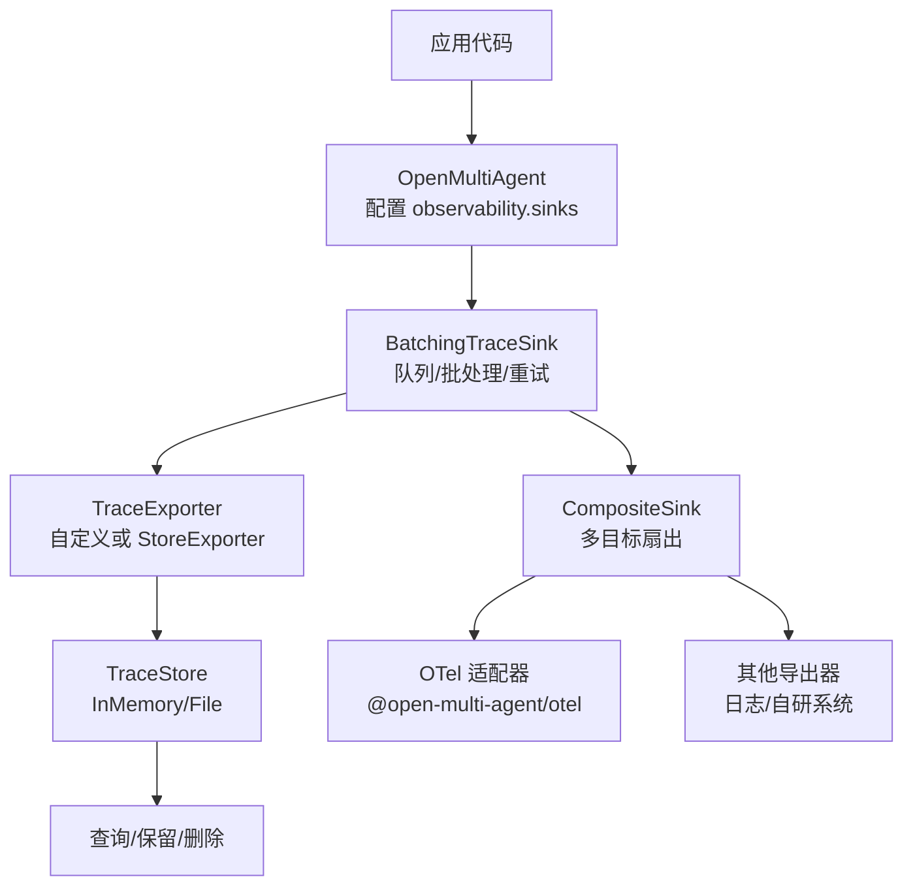
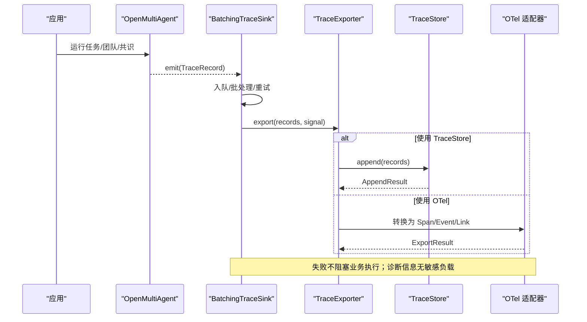
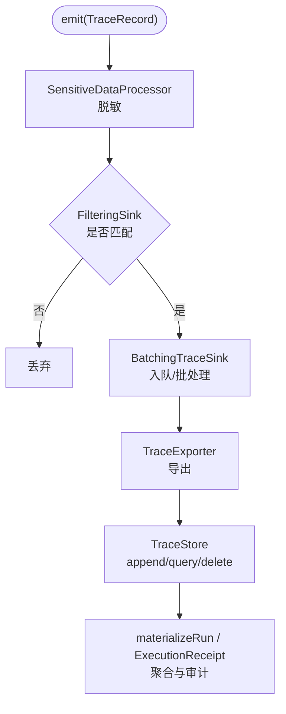
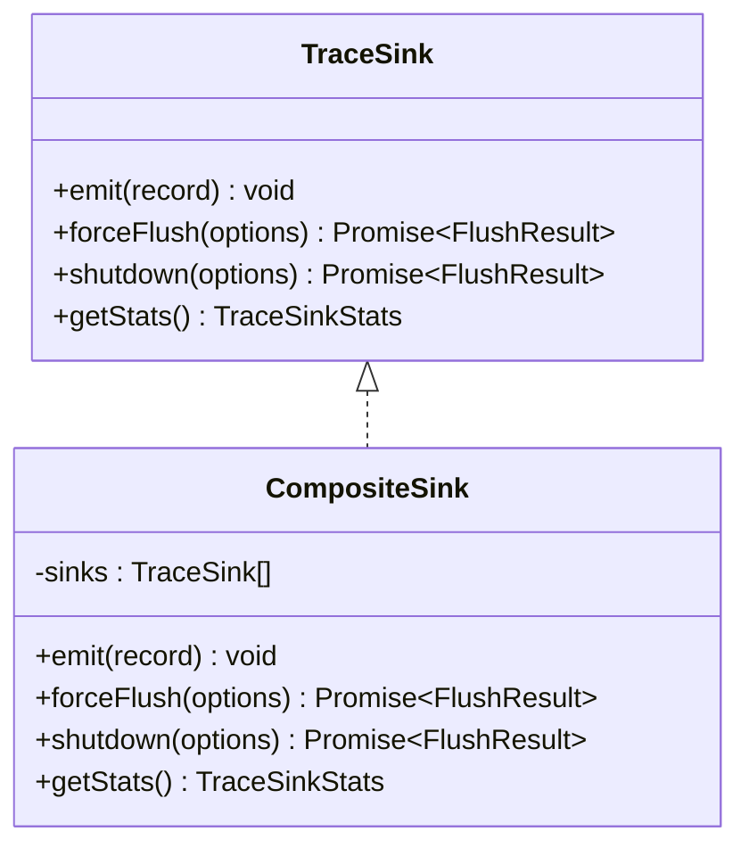
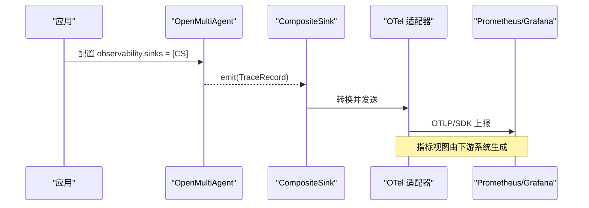
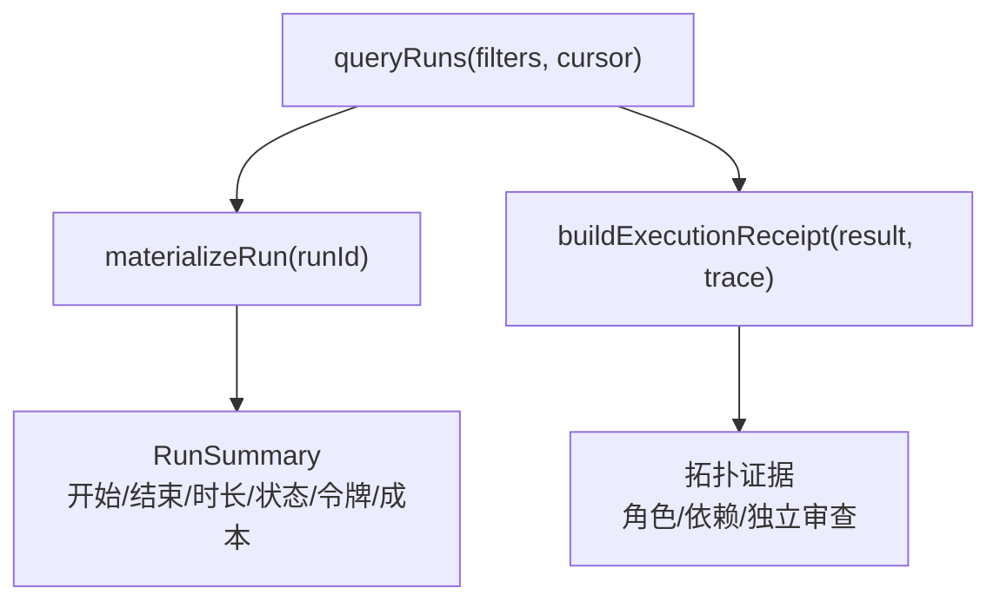
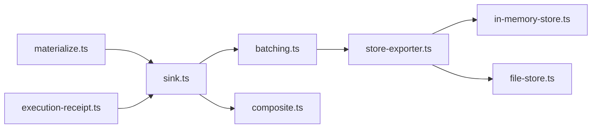

# 指标收集

<cite>
**本文引用的文件**
- [README.md](file://README.md)
- [observability.md](file://docs/observability.md)
- [observability-performance.md](file://docs/observability-performance.md)
- [packages/core/src/index.ts](file://packages/core/src/index.ts)
- [packages/core/src/observability/index.ts](file://packages/core/src/observability/index.ts)
- [packages/core/src/observability/sink.ts](file://packages/core/src/observability/sink.ts)
- [packages/core/src/observability/batching.ts](file://packages/core/src/observability/batching.ts)
- [packages/core/src/observability/composite.ts](file://packages/core/src/observability/composite.ts)
- [packages/core/src/observability/store-exporter.ts](file://packages/core/src/observability/store-exporter.ts)
- [packages/core/src/observability/in-memory-store.ts](file://packages/core/src/observability/in-memory-store.ts)
- [packages/core/src/observability/file-store.ts](file://packages/core/src/observability/file-store.ts)
- [packages/core/src/observability/materialize.ts](file://packages/core/src/observability/materialize.ts)
- [packages/core/src/observability/execution-receipt.ts](file://packages/core/src/observability/execution-receipt.ts)
</cite>

## 目录
1. [简介](#简介)
2. [项目结构](#项目结构)
3. [核心组件](#核心组件)
4. [架构总览](#架构总览)
5. [详细组件分析](#详细组件分析)
6. [依赖关系分析](#依赖关系分析)
7. [性能考量](#性能考量)
8. [故障排查指南](#故障排查指南)
9. [结论](#结论)
10. [附录](#附录)

## 简介
本章节面向 Open Multi-Agent 的“指标与可观测性”能力，聚焦于指标类型、采集管道、复合导出、配置选项、与外部监控系统集成以及查询分析方法。需要特别说明的是：Open Multi-Agent 的可观测性以“追踪（Trace）”为核心，提供运行身份、结构化 Span、执行回执、存储与导出等能力；同时通过可选的 OpenTelemetry 适配器将追踪数据映射到 OTel 生态。对于传统意义上的“指标（Metrics）”，当前仓库未提供独立的指标采集器；但可通过 OTel 适配器在下游系统中获得指标视图（例如 Prometheus/Grafana），或在应用层基于 Trace 聚合生成业务指标。

- 追踪层：Span、事件、链路、身份、状态、元数据、执行回执
- 存储层：内存/文件 TraceStore，支持分页查询、删除与保留策略
- 导出层：批量 Sink + 自定义 Exporter，支持多目标扇出（CompositeSink）
- 集成层：OpenTelemetry 适配器，将 OMA TraceRecord 映射为 OTel Span/Event/Link

**章节来源**
- [observability.md:1-120](file://docs/observability.md#L1-L120)
- [observability.md:185-223](file://docs/observability.md#L185-L223)
- [observability.md:459-525](file://docs/observability.md#L459-L525)
- [README.md:140-145](file://README.md#L140-L145)

## 项目结构
Open Multi-Agent 的可观测性实现集中在 core 包的 observability 子模块，并通过根入口统一导出。关键路径如下：
- 公共 API 暴露：packages/core/src/index.ts
- 可观测性子模块入口：packages/core/src/observability/index.ts
- 核心接口与类型：sink.ts
- 批量导出：batching.ts
- 多目标扇出：composite.ts
- 存储与导出桥接：store-exporter.ts、in-memory-store.ts、file-store.ts
- 结果聚合与展示：materialize.ts、execution-receipt.ts

**图表来源**
- [packages/core/src/index.ts:201-227](file://packages/core/src/index.ts#L201-L227)
- [packages/core/src/observability/index.ts:29-48](file://packages/core/src/observability/index.ts#L29-L48)
- [packages/core/src/observability/batching.ts:163-208](file://packages/core/src/observability/batching.ts#L163-L208)
- [packages/core/src/observability/composite.ts:43-70](file://packages/core/src/observability/composite.ts#L43-L70)
- [packages/core/src/observability/store-exporter.ts:1-200](file://packages/core/src/observability/store-exporter.ts#L1-L200)

**章节来源**
- [packages/core/src/index.ts:201-227](file://packages/core/src/index.ts#L201-L227)
- [packages/core/src/observability/index.ts:1-68](file://packages/core/src/observability/index.ts#L1-L68)

## 核心组件
- TraceSink/TraceExporter：同步热路径与异步批处理的契约，确保业务执行不受影响
- BatchingTraceSink：有界队列、批处理、超时、重试、退避、丢弃策略
- CompositeSink：多目标扇出，任一子 Sink 失败不影响其他子 Sink
- TraceStore 与 Exporter 桥接：将 TraceRecord 持久化并支持查询、删除、保留策略
- Materialize/ExecutionReceipt：从 Span/事件聚合运行摘要、成本与令牌统计、拓扑证据

**章节来源**
- [packages/core/src/observability/sink.ts:27-83](file://packages/core/src/observability/sink.ts#L27-L83)
- [packages/core/src/observability/batching.ts:14-41](file://packages/core/src/observability/batching.ts#L14-L41)
- [packages/core/src/observability/composite.ts:43-99](file://packages/core/src/observability/composite.ts#L43-L99)
- [packages/core/src/observability/store-exporter.ts:1-200](file://packages/core/src/observability/store-exporter.ts#L1-L200)
- [packages/core/src/observability/materialize.ts:1-200](file://packages/core/src/observability/materialize.ts#L1-L200)
- [packages/core/src/observability/execution-receipt.ts:1-200](file://packages/core/src/observability/execution-receipt.ts#L1-L200)

## 架构总览
下图展示了从运行时到存储与导出的完整链路，包括批量、过滤、扇出与 OTel 适配。

**图表来源**
- [observability.md:185-223](file://docs/observability.md#L185-L223)
- [packages/core/src/observability/batching.ts:351-399](file://packages/core/src/observability/batching.ts#L351-L399)
- [packages/core/src/observability/store-exporter.ts:1-200](file://packages/core/src/observability/store-exporter.ts#L1-L200)
- [observability.md:459-525](file://docs/observability.md#L459-L525)

## 详细组件分析

### 指标类型与定义
- 性能指标（来自追踪与导出）
  - 吞吐与延迟：enqueue p95、export 超时、flush/shutdown 耗时
  - 资源占用：队列记录数/字节上限、单条记录大小上限
  - 稳定性：重试次数、丢弃计数、失败计数
- 业务指标（可从 Trace 聚合）
  - 运行维度：runId、attempt、traceId、rootSpanId、status
  - 角色与任务：rolesExecuted、task 依赖边、独立审查发生
  - 成本与令牌：LLM 调用 token/cost 汇总（仅 LLM end 贡献）
- 系统指标（来自 Sink/Store）
  - 接受/导出/丢弃/失败计数、队列水位、最后错误码
  - 存储容量、压缩、保留策略命中情况

说明：当前仓库未提供独立的 Metrics 采集器；上述“指标”主要通过 Trace 与导出统计获得，或通过 OTel 适配器在下游系统形成指标视图。

**章节来源**
- [observability.md:12-83](file://docs/observability.md#L12-L83)
- [observability.md:385-445](file://docs/observability.md#L385-L445)
- [observability.md:572-600](file://docs/observability.md#L572-L600)
- [packages/core/src/observability/sink.ts:33-46](file://packages/core/src/observability/sink.ts#L33-L46)

### 指标收集管道（处理器、过滤器、聚合器）
- 处理器（Processor）
  - SensitiveDataProcessor：默认对追踪数据进行脱敏，避免敏感内容进入导出
  - LegacyCallbackTraceSink：兼容旧版 onTrace 回调
- 过滤器（Filter）
  - FilteringSink：按条件过滤 TraceRecord，减少不必要的数据量
- 聚合器（Aggregator）
  - materializeRun：将 Span/事件聚合为运行摘要（开始/结束/时长、尝试次数、终端状态、令牌/成本等）
  - buildExecutionReceipt：从运行结果与追踪中构建执行回执，用于治理与审计

**图表来源**
- [packages/core/src/observability/processors.ts:1-200](file://packages/core/src/observability/processors.ts#L1-L200)
- [packages/core/src/observability/batching.ts:210-242](file://packages/core/src/observability/batching.ts#L210-L242)
- [packages/core/src/observability/store-exporter.ts:1-200](file://packages/core/src/observability/store-exporter.ts#L1-L200)
- [packages/core/src/observability/materialize.ts:1-200](file://packages/core/src/observability/materialize.ts#L1-L200)
- [packages/core/src/observability/execution-receipt.ts:1-200](file://packages/core/src/observability/execution-receipt.ts#L1-L200)

**章节来源**
- [observability.md:755-768](file://docs/observability.md#L755-L768)
- [packages/core/src/observability/index.ts:31-38](file://packages/core/src/observability/index.ts#L31-L38)

### 复合接收器 CompositeSink（多目标导出）
- 作用：将一个 TraceRecord 扇出到多个 TraceSink，任一子 Sink 失败不会阻断其他子 Sink
- 行为：并发 flush/shutdown，合并结果；统计聚合；超时保护与诊断
- 典型用法：同时写入本地 TraceStore 与 OTel 适配器

**图表来源**
- [packages/core/src/observability/sink.ts:76-83](file://packages/core/src/observability/sink.ts#L76-L83)
- [packages/core/src/observability/composite.ts:43-99](file://packages/core/src/observability/composite.ts#L43-L99)

**章节来源**
- [packages/core/src/observability/composite.ts:43-157](file://packages/core/src/observability/composite.ts#L43-L157)

### 指标配置选项（采样率、保留策略、告警阈值）
- 采样率
  - 当前版本未提供内置“采样率”开关；可通过 FilteringSink 按条件过滤，或在应用层控制 emit 频率
- 保留策略（Retention Policy）
  - maxAgeMs：按运行开始时间进行年龄淘汰
  - maxRuns：按稳定排序保留最新 N 个运行
  - terminal-status scope：仅针对特定终端状态的运行进行删除
- 告警阈值（诊断与统计）
  - 队列满、记录过大、导出失败/超时、flush/shutdown 超时等诊断码
  - getStats() 返回 accepted/exported/retried/failed/dropped/queued 等计数
  - 诊断输出限流，默认每分钟一次 console.warn，可设置为 silent 或自定义 onDiagnostic

注意：这些配置项属于“可观测性/追踪”范畴；若需传统“指标阈值告警”，建议在下游监控系统（如 Prometheus/Grafana）中基于 OTel 指标或日志进行设置。

**章节来源**
- [observability.md:430-445](file://docs/observability.md#L430-L445)
- [observability.md:572-600](file://docs/observability.md#L572-L600)
- [packages/core/src/observability/batching.ts:14-41](file://packages/core/src/observability/batching.ts#L14-L41)
- [packages/core/src/observability/sink.ts:48-74](file://packages/core/src/observability/sink.ts#L48-L74)

### 与 Prometheus、Grafana 等监控系统的集成示例
- 通过 @open-multi-agent/otel 将 OMA TraceRecord 转换为 OTel Span/Event/Link
- 由应用侧选择 OTLP exporter 与 SDK，将数据发送到后端（如 Prometheus/Grafana 的 OTel 采集链）
- 该适配器不直接产生指标，但可在下游系统中将 Span/Event 转为指标视图

**图表来源**
- [observability.md:459-525](file://docs/observability.md#L459-L525)
- [packages/core/src/observability/composite.ts:43-99](file://packages/core/src/observability/composite.ts#L43-L99)

**章节来源**
- [observability.md:459-525](file://docs/observability.md#L459-L525)

### 指标数据的查询与分析方法
- 查询接口
  - queryRuns：支持 runId、时间范围、状态、agent、task ID、model、provider 等组合过滤
  - 游标分页：稳定排序 (startedAt, runId)，默认降序，最大页大小 500
- 材料化与摘要
  - materializeRun：按 sequence 排序，span_end 自包含，聚合运行摘要（开始/结束/时长、尝试次数、终端状态、令牌/成本）
- 执行回执
  - buildExecutionReceipt：从结果与追踪中构建拓扑证据（角色执行顺序、依赖边、独立审查等）

**图表来源**
- [observability.md:413-445](file://docs/observability.md#L413-L445)
- [observability.md:385-412](file://docs/observability.md#L385-L412)
- [packages/core/src/observability/execution-receipt.ts:1-200](file://packages/core/src/observability/execution-receipt.ts#L1-L200)

**章节来源**
- [observability.md:413-445](file://docs/observability.md#L413-L445)
- [packages/core/src/observability/materialize.ts:1-200](file://packages/core/src/observability/materialize.ts#L1-L200)
- [packages/core/src/observability/execution-receipt.ts:1-200](file://packages/core/src/observability/execution-receipt.ts#L1-L200)

### 最佳实践
- 指标命名规范（适用于下游 OTel 指标）
  - 使用领域语义清晰的名称，避免高基数标签（如 runId/taskId 作为指标标签需谨慎）
  - 保持跨环境一致的前缀与维度
- 标签设计
  - 低基数字段：service、version、environment、model/provider（当 cardinality 可控时）
  - 高基数字段：尽量放入 Trace attributes，而非指标 labels
- 性能优化
  - 合理设置队列与批次大小、导出超时与重试退避
  - 使用 FilteringSink 降低无关数据量
  - 使用 CompositeSink 将不同目标解耦，避免单一导出瓶颈影响整体
  - 定期 flush/shutdown，确保数据落盘与导出完成
- 安全与隐私
  - 默认不捕获 prompt/completion/tool 输入输出；如需开启，使用 capture 策略并限制字段
  - 对持久化存储中的敏感内容使用 RedactingStore

**章节来源**
- [observability.md:755-768](file://docs/observability.md#L755-L768)
- [observability.md:572-600](file://docs/observability.md#L572-L600)
- [packages/core/src/observability/batching.ts:14-41](file://packages/core/src/observability/batching.ts#L14-L41)
- [packages/core/src/observability/composite.ts:43-99](file://packages/core/src/observability/composite.ts#L43-L99)

## 依赖关系分析
- 耦合与内聚
  - sink.ts 定义核心接口，batching.ts/composite.ts 围绕 TraceSink 扩展
  - store-exporter.ts 将 TraceStore 暴露为 Exporter，便于接入 BatchingTraceSink
  - materialize.ts/execution-receipt.ts 消费 TraceRecord 进行聚合与审计
- 外部依赖
  - @open-multi-agent/otel 为可选包，core 不引入 OTel 运行时
  - 文件系统访问仅在 Node-only 子路径（FileTraceStore）

**图表来源**
- [packages/core/src/observability/sink.ts:27-83](file://packages/core/src/observability/sink.ts#L27-L83)
- [packages/core/src/observability/batching.ts:163-208](file://packages/core/src/observability/batching.ts#L163-L208)
- [packages/core/src/observability/composite.ts:43-99](file://packages/core/src/observability/composite.ts#L43-L99)
- [packages/core/src/observability/store-exporter.ts:1-200](file://packages/core/src/observability/store-exporter.ts#L1-L200)
- [packages/core/src/observability/in-memory-store.ts:1-200](file://packages/core/src/observability/in-memory-store.ts#L1-L200)
- [packages/core/src/observability/file-store.ts:1-200](file://packages/core/src/observability/file-store.ts#L1-L200)
- [packages/core/src/observability/materialize.ts:1-200](file://packages/core/src/observability/materialize.ts#L1-L200)
- [packages/core/src/observability/execution-receipt.ts:1-200](file://packages/core/src/observability/execution-receipt.ts#L1-L200)

**章节来源**
- [packages/core/src/observability/index.ts:29-48](file://packages/core/src/observability/index.ts#L29-L48)
- [packages/core/src/index.ts:201-227](file://packages/core/src/index.ts#L201-L227)

## 性能考量
- 预算与基准
  - 无 Sink 时的额外开销应低于 1%
  - 遗留回调派发 p95 < 10 µs；批量入队 p95 < 20 µs；OTel 转换+内存处理 p95 < 50 µs
- 队列与批处理
  - 默认队列记录上限 2048、字节上限 16 MiB、单条记录上限 256 KiB
  - 批次大小 512、调度延迟 5 秒、导出超时 30 秒、重试 3 次、指数退避
- 压力与丢弃
  - 队列满时按优先级丢弃（stream_chunk > 其他事件 > span_start > span_end）
  - 大记录直接拒绝，防止内存膨胀
- 存储与查询
  - InMemoryTraceStore 适合测试与本地调试
  - FileTraceStore 支持追加日志、fsync、压缩、恢复与删除

**章节来源**
- [observability-performance.md:8-20](file://docs/observability-performance.md#L8-L20)
- [observability-performance.md:64-118](file://docs/observability-performance.md#L64-L118)
- [observability.md:572-600](file://docs/observability.md#L572-L600)
- [packages/core/src/observability/batching.ts:14-41](file://packages/core/src/observability/batching.ts#L14-L41)

## 故障排查指南
- 常见问题定位
  - 导出失败/超时：检查 Exporter 实现、网络与超时配置
  - 队列满/记录过大：调整 maxQueueRecords/maxQueueBytes/maxRecordBytes
  - flush/shutdown 超时：增大 timeoutMs，确认下游系统可用性
- 诊断与统计
  - 使用 getStats() 获取 accepted/exported/retried/failed/dropped/queued 等计数
  - 使用 onDiagnostic 或默认 console.warn 查看诊断码（如 queue_full、export_timeout）
- 存储问题
  - FileTraceStore：确认 fsync 边界、权限、磁盘空间；必要时执行 compact
  - 删除与保留：使用 deleteRun/delete/retention 清理历史数据

**章节来源**
- [observability.md:572-600](file://docs/observability.md#L572-L600)
- [observability.md:328-375](file://docs/observability.md#L328-L375)
- [packages/core/src/observability/sink.ts:48-74](file://packages/core/src/observability/sink.ts#L48-L74)

## 结论
Open Multi-Agent 的可观测性以追踪为核心，提供高性能、可配置、可扩展的采集与导出能力。通过 CompositeSink 与 TraceStore，可实现多目标导出与本地持久化；借助 OTel 适配器，可将追踪数据接入企业级监控体系。虽然当前未提供独立的指标采集器，但通过下游系统可将 Span/Event 转化为指标视图，满足 Prometheus/Grafana 等监控需求。建议在生产环境中结合 FilteringSink、合理的队列与批处理参数、保留策略与诊断机制，确保可观测性的稳定性与可维护性。

## 附录
- 运行身份与状态：runId、attempt、traceId、rootSpanId、status
- 元数据：per-run metadata 键值约束与保留
- 执行回执：拓扑证据与治理结论
- 存储格式：NDJSON 追加日志、批信封、恢复与压缩

**章节来源**
- [observability.md:12-83](file://docs/observability.md#L12-L83)
- [observability.md:151-184](file://docs/observability.md#L151-L184)
- [observability.md:297-375](file://docs/observability.md#L297-L375)
- [packages/core/src/observability/execution-receipt.ts:1-200](file://packages/core/src/observability/execution-receipt.ts#L1-L200)