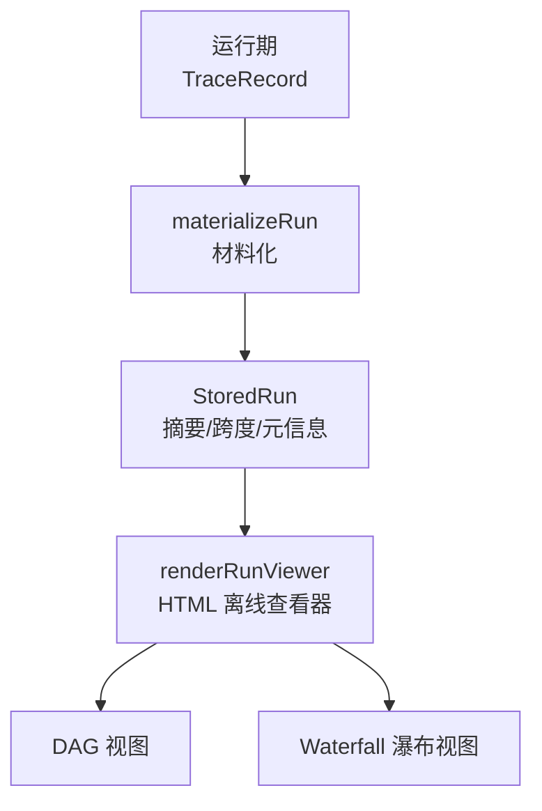
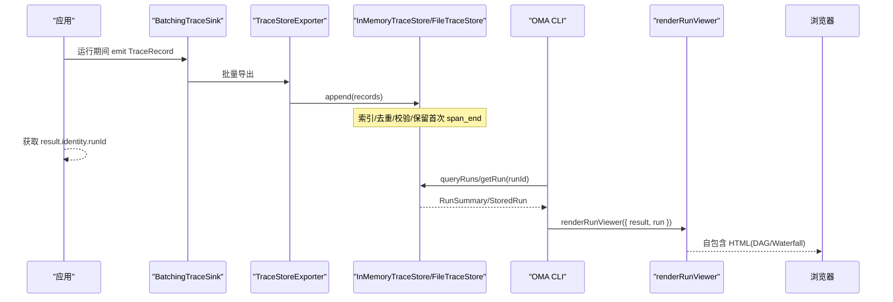
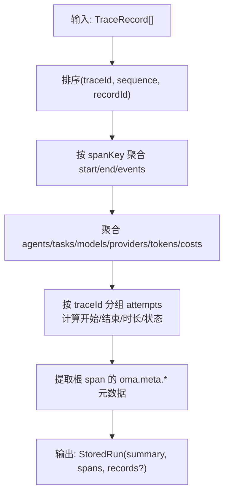
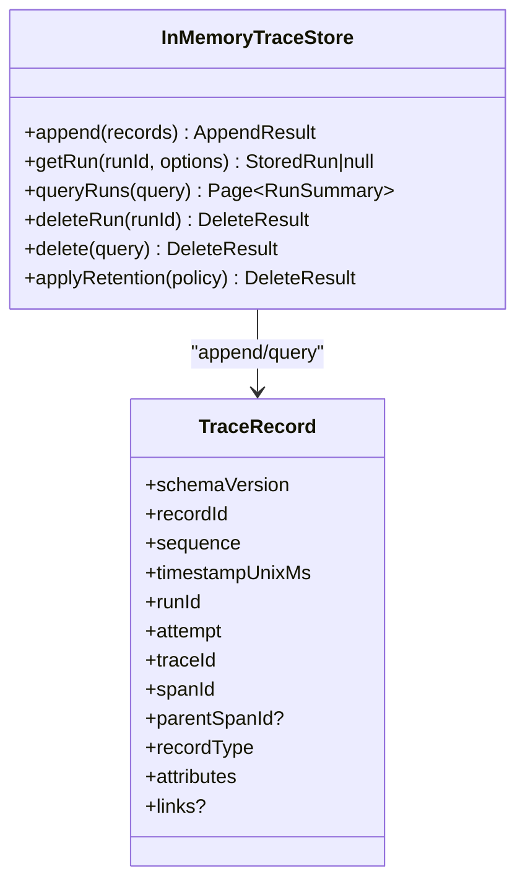
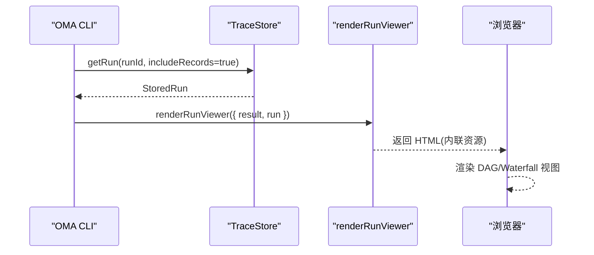
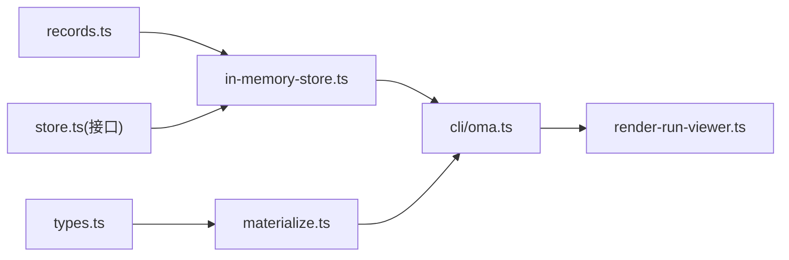

# 离线查看器

<cite>
**本文引用的文件**
- [README.md](file://README.md)
- [observability.md](file://docs/observability.md)
- [materialize.ts](file://packages/core/src/observability/materialize.ts)
- [in-memory-store.ts](file://packages/core/src/observability/in-memory-store.ts)
- [render-run-viewer.ts](file://packages/core/src/dashboard/render-run-viewer.ts)
- [oma.ts](file://packages/core/src/cli/oma.ts)
- [records.ts](file://packages/core/src/observability/records.ts)
- [types.ts](file://packages/core/src/types.ts)
- [index.ts](file://packages/core/src/index.ts)
- [in-memory-store.ts（示例）](file://packages/core/examples/integrations/observability-v2/in-memory-store.ts)
</cite>

## 目录
1. [简介](#简介)
2. [项目结构](#项目结构)
3. [核心组件](#核心组件)
4. [架构总览](#架构总览)
5. [详细组件分析](#详细组件分析)
6. [依赖关系分析](#依赖关系分析)
7. [性能考虑](#性能考虑)
8. [故障排查指南](#故障排查指南)
9. [结论](#结论)
10. [附录：使用场景与示例](#附录使用场景与示例)

## 简介
本章节面向“离线查看器(Run Viewer)”能力，聚焦如何将运行期追踪数据材料化并生成可离线分析的视图。内容涵盖：
- materializeRun 函数的作用、输入输出与处理流程
- 运行材料化过程的数据转换、关联分析与结果生成
- 内置内存存储 InMemoryTraceStore 的配置、操作与性能要点
- 离线查看器的典型使用场景（调试、性能分析、问题排查等）
- 构建与执行查看器的步骤指引
- 查看器输出的数据结构与可视化方法

## 项目结构
Open Multi-Agent 的离线查看器由“追踪记录 → 材料化 → 渲染”三段组成：
- 追踪记录：运行时产生 TraceRecord（span_start/span_event/span_end），包含 runId、traceId、spanId、kind、name、时间戳、状态、属性与链接等
- 材料化：materializeRun 将原始记录聚合成 StoredRun（含摘要、尝试次数、令牌/成本统计、任务/代理/模型/提供者集合、跨度列表等）
- 渲染：renderRunViewer 基于 StoredRun 或 TeamRunResult 生成自包含 HTML，提供 DAG 与瀑布图两种视图

图表来源
- [materialize.ts:71-241](file://packages/core/src/observability/materialize.ts#L71-L241)
- [render-run-viewer.ts:17-476](file://packages/core/src/dashboard/render-run-viewer.ts#L17-L476)

章节来源
- [README.md:140-145](file://README.md#L140-L145)
- [observability.md:670-742](file://docs/observability.md#L670-L742)

## 核心组件
- materializeRun：将一组 TraceRecord 排序、聚合为 StoredRun；汇总 token/cost、agents/tasks/models/providers、按 traceId 分组 attempts，并保留 links/events 以支撑下游可视化
- InMemoryTraceStore：非持久化的 TraceStore 实现，用于测试与本地短生命周期运行；支持 append、getRun、queryRuns、delete、applyRetention、cursor 分页
- renderRunViewer：纯前端渲染器，无网络 I/O，内嵌 CSS/JS 与安全策略，输出单文件 HTML，支持 DAG/Waterfall 切换、搜索与过滤、详情面板

章节来源
- [materialize.ts:71-241](file://packages/core/src/observability/materialize.ts#L71-L241)
- [in-memory-store.ts:281-528](file://packages/core/src/observability/in-memory-store.ts#L281-L528)
- [render-run-viewer.ts:17-476](file://packages/core/src/dashboard/render-run-viewer.ts#L17-L476)

## 架构总览
下图展示从运行到离线查看的端到端链路，包括 sink/exporter、TraceStore、CLI 与渲染器之间的交互。

图表来源
- [observability.md:185-229](file://docs/observability.md#L185-L229)
- [observability.md:224-295](file://docs/observability.md#L224-L295)
- [observability.md:670-710](file://docs/observability.md#L670-L710)
- [in-memory-store.ts:296-404](file://packages/core/src/observability/in-memory-store.ts#L296-L404)

## 详细组件分析

### materializeRun：数据转换与关联分析
- 输入：TraceRecord[]（可能乱序）
- 关键步骤：
  - 按 traceId/sequence/recordId 排序，确保确定性
  - 合并 span_start/span_end/events，构建 MaterializedSpan
  - 聚合 agents/tasks/models/providers，累计 tokens/costs
  - 按 traceId 分组 attempts，计算 startedAt/endedAt/duration/status
  - 提取根 span 的 oma.meta.* 作为 run metadata
  - 输出 StoredRun（summary + spans + 可选 records）
- 复杂度：O(N log N) 排序 + O(N) 遍历聚合
- 错误与健壮性：end-only span 仍完整；缺失 end 标记 incomplete；重复 span_end 仅保留首次

图表来源
- [materialize.ts:53-74](file://packages/core/src/observability/materialize.ts#L53-L74)
- [materialize.ts:90-145](file://packages/core/src/observability/materialize.ts#L90-L145)
- [materialize.ts:147-239](file://packages/core/src/observability/materialize.ts#L147-L239)

章节来源
- [materialize.ts:71-241](file://packages/core/src/observability/materialize.ts#L71-L241)

### InMemoryTraceStore：配置、操作与性能
- 配置选项：
  - now：注入时钟用于 retention 计算
  - onDiagnostic：诊断回调
- 主要操作：
  - append：校验 schemaVersion、字段类型、事件名/链接关系；去重 recordId；span_end 幂等（首次有效）
  - getRun：调用 materializeRun 生成 StoredRun
  - queryRuns：规范化查询参数、游标分页、稳定排序 (startedAt, runId)
  - delete/deleteRun：删除逻辑 run 及其所有记录
  - applyRetention：按 maxAgeMs/maxRuns/statuses 清理
- 性能要点：
  - 内存中维护 entries、seen、firstEndBySpan 索引
  - 写入时克隆值避免外部引用泄露
  - 游标带签名与快照版本，防篡改与一致性
  - 删除后重建 end 索引并递增 deleteEpoch 使游标失效

图表来源
- [in-memory-store.ts:63-67](file://packages/core/src/observability/in-memory-store.ts#L63-L67)
- [in-memory-store.ts:104-196](file://packages/core/src/observability/in-memory-store.ts#L104-L196)
- [in-memory-store.ts:296-404](file://packages/core/src/observability/in-memory-store.ts#L296-L404)
- [in-memory-store.ts:406-528](file://packages/core/src/observability/in-memory-store.ts#L406-L528)

章节来源
- [in-memory-store.ts:281-528](file://packages/core/src/observability/in-memory-store.ts#L281-L528)

### 离线查看器渲染：结构与可视化
- 输入：TeamRunResult 与/或 StoredRun
- 输出：自包含 HTML（内联 CSS/JS，CSP 限制外链）
- 视图：
  - DAG：任务依赖图，节点显示状态、耗时、代理、模型等
  - Waterfall：按尝试分组的时间轴瀑布图，支持折叠/展开、搜索与过滤
- 安全：对敏感数据进行脱敏，不嵌入提示词/工具输入输出等

图表来源
- [observability.md:670-710](file://docs/observability.md#L670-L710)
- [render-run-viewer.ts:17-476](file://packages/core/src/dashboard/render-run-viewer.ts#L17-L476)

章节来源
- [render-run-viewer.ts:17-476](file://packages/core/src/dashboard/render-run-viewer.ts#L17-L476)
- [observability.md:670-742](file://docs/observability.md#L670-L742)

## 依赖关系分析
- 模块耦合：
  - materialize.ts 依赖 types.ts 中的 TraceLink/TraceAttributeValue 等类型
  - in-memory-store.ts 依赖 records.ts 的 TraceRecord 定义与 store.ts 的接口
  - render-run-viewer.ts 依赖 dashboard 内部布局与模型构建
  - CLI 通过 index.ts 暴露的入口调用 materializeRun 与 renderRunViewer
- 外部依赖：
  - observability.md 描述了 sink/exporter/TraceStore 的契约与边界
  - 示例脚本演示了 InMemoryTraceStore 的典型用法

图表来源
- [types.ts:241-260](file://packages/core/src/types.ts#L241-L260)
- [records.ts:53-77](file://packages/core/src/observability/records.ts#L53-L77)
- [index.ts:112-241](file://packages/core/src/index.ts#L112-L241)
- [oma.ts:20-32](file://packages/core/src/cli/oma.ts#L20-L32)

章节来源
- [index.ts:112-241](file://packages/core/src/index.ts#L112-L241)
- [oma.ts:20-32](file://packages/core/src/cli/oma.ts#L20-L32)

## 性能考虑
- materializeRun：
  - 排序 O(N log N)，聚合 O(N)；建议分批传入以避免单次过大
  - 仅 LLM/routing profile 端点累计 token/cost，避免重复计数
- InMemoryTraceStore：
  - append 前进行严格校验与去重，减少无效数据
  - 游标分页限制最大 500，默认 50，避免大页扫描
  - 删除与 retention 会重建索引，注意在批处理完成后集中调用
- 渲染：
  - 瀑布图默认限制行数，支持“加载更多”，避免 DOM 过大导致卡顿
  - 所有资源内联，无网络请求，适合离线分享与归档

[本节为通用指导，无需特定文件来源]

## 故障排查指南
- 常见错误与定位：
  - 重复 span_end：仅保留首次，后续被忽略并记录诊断
  - 非法 record 字段：如 schemaVersion、recordType、status.code 等校验失败会抛出结构化错误
  - 游标无效：篡改或不匹配当前查询/删除周期会报 INVALID_CURSOR
- 建议排查步骤：
  - 检查 append 返回值中的 deduplicated 与 diagnostics
  - 使用 queryRuns 的 status/agent/taskId/model/provider 过滤缩小范围
  - 通过 getRun(includeRecords=true) 获取原始记录辅助定位
  - 结合 renderRunViewer 的警告条与 Waterfall 层级问题提示

章节来源
- [in-memory-store.ts:315-356](file://packages/core/src/observability/in-memory-store.ts#L315-L356)
- [in-memory-store.ts:370-404](file://packages/core/src/observability/in-memory-store.ts#L370-L404)
- [observability.md:385-445](file://docs/observability.md#L385-L445)

## 结论
Open Multi-Agent 的离线查看器通过“追踪记录 → 材料化 → 渲染”的清晰链路，将运行期的分布式执行证据转化为可共享、可复放的静态页面。materializeRun 提供了稳定的聚合与统计能力；InMemoryTraceStore 为本地与测试环境提供了零依赖的快速存储；renderRunViewer 则在不联网的前提下呈现 DAG 与瀑布图，便于调试、性能分析与问题复盘。生产环境中可替换为 FileTraceStore 或其他 TraceStore 实现，保持相同的查询与材料化语义。

[本节为总结性内容，无需特定文件来源]

## 附录：使用场景与示例

### 典型使用场景
- 调试：定位某次失败的 agent/tool 调用链，查看重试、超时与预算耗尽路径
- 性能分析：对比不同模型/代理/token 用量与耗时，识别瓶颈
- 问题排查：结合路由决策与实际执行证据，验证拓扑选择是否合理
- 报告与归档：导出单文件 HTML 作为事后复盘材料

章节来源
- [observability.md:670-742](file://docs/observability.md#L670-L742)

### 构建与执行查看器（步骤）
- 启用追踪：
  - 使用 BatchingTraceSink + TraceStoreExporter 将 TraceRecord 写入 InMemoryTraceStore 或 FileTraceStore
  - 运行工作负载后 flush/shutdown 确保数据落地
- 获取运行身份：
  - 从 runAgent/runTeam/runTasks 的结果中读取 identity.runId
- 材料化与渲染：
  - 通过 TraceStore.getRun(runId, { includeRecords: true }) 获取 StoredRun
  - 调用 renderRunViewer({ result, run }) 生成 HTML
- 使用 CLI：
  - 运行中直接 --dashboard 生成
  - 历史导出：oma dashboard --trace-store <path> --run-id <id> --output run.html

章节来源
- [observability.md:185-229](file://docs/observability.md#L185-L229)
- [observability.md:224-295](file://docs/observability.md#L224-L295)
- [observability.md:670-710](file://docs/observability.md#L670-L710)
- [in-memory-store.ts（示例）:1-27](file://packages/core/examples/integrations/observability-v2/in-memory-store.ts#L1-L27)

### 查看器输出的数据结构
- StoredRun.summary：runId、attempts、startedAt/endedAt/duration、status、metadata、agents/taskIds/models/providers、tokens、costs、incomplete
- StoredRun.spans：每个跨度包含 traceId/spanId/parentSpanId、kind/name、start/end、duration、status、attributes、links、events、incomplete
- 渲染层：将 summary 与 spans 转换为前端可读的 payload，并附加 waterfall 布局与 filters

章节来源
- [materialize.ts:147-239](file://packages/core/src/observability/materialize.ts#L147-L239)
- [render-run-viewer.ts:17-476](file://packages/core/src/dashboard/render-run-viewer.ts#L17-L476)