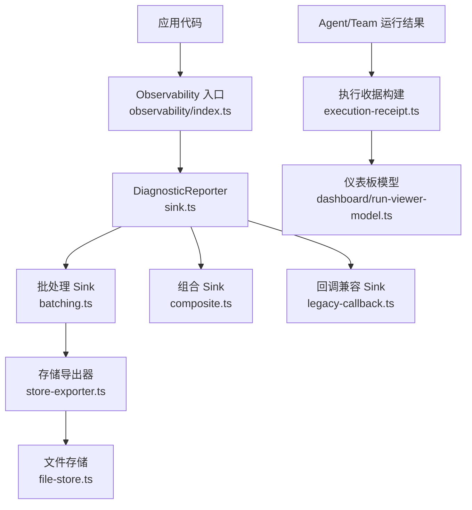
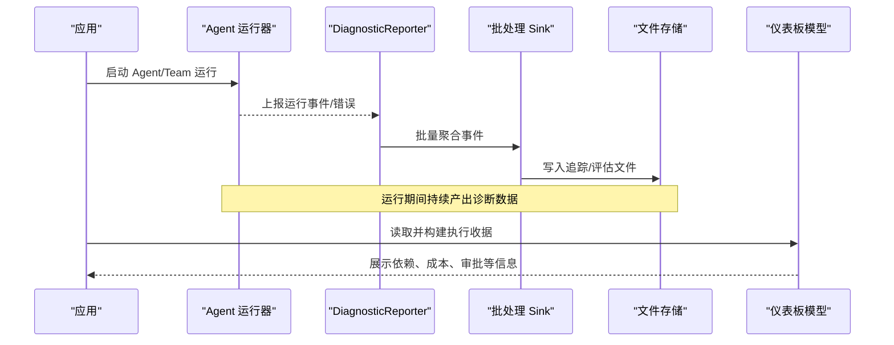
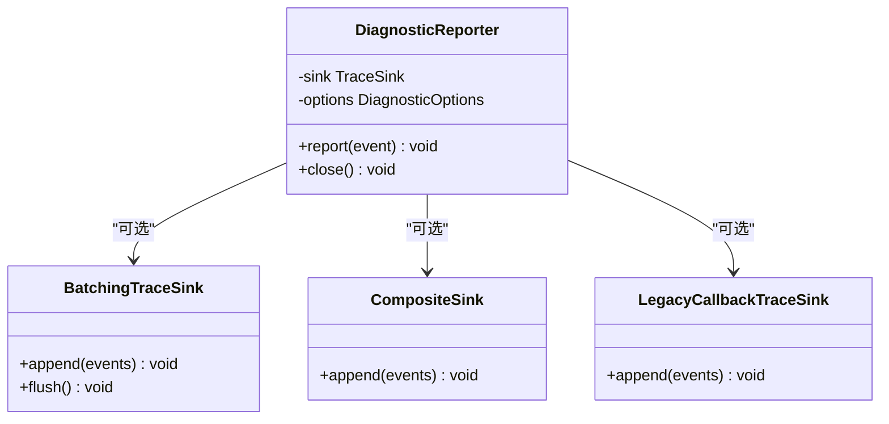
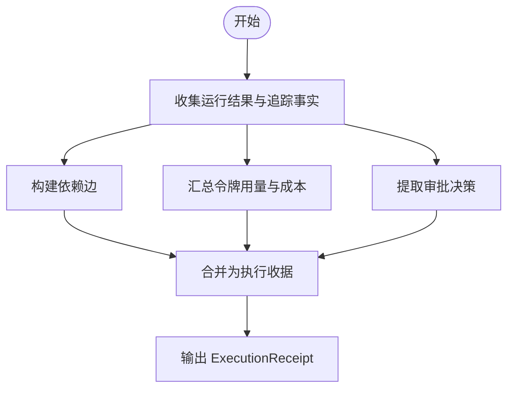
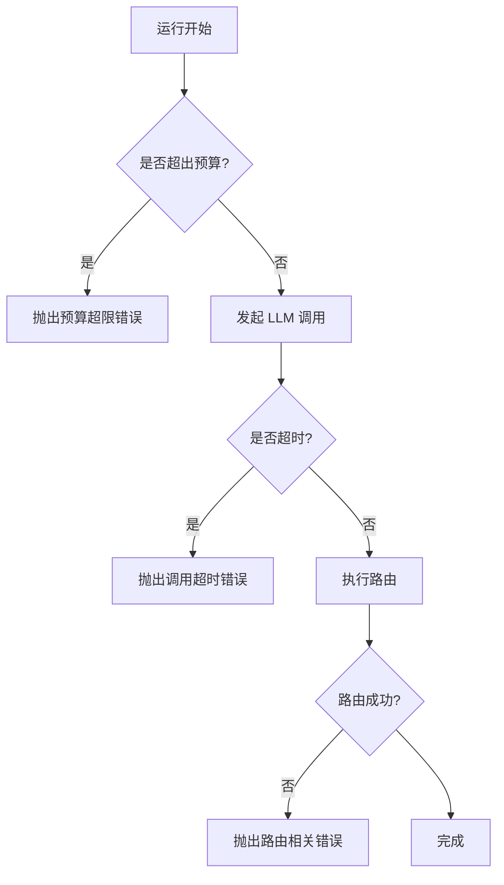
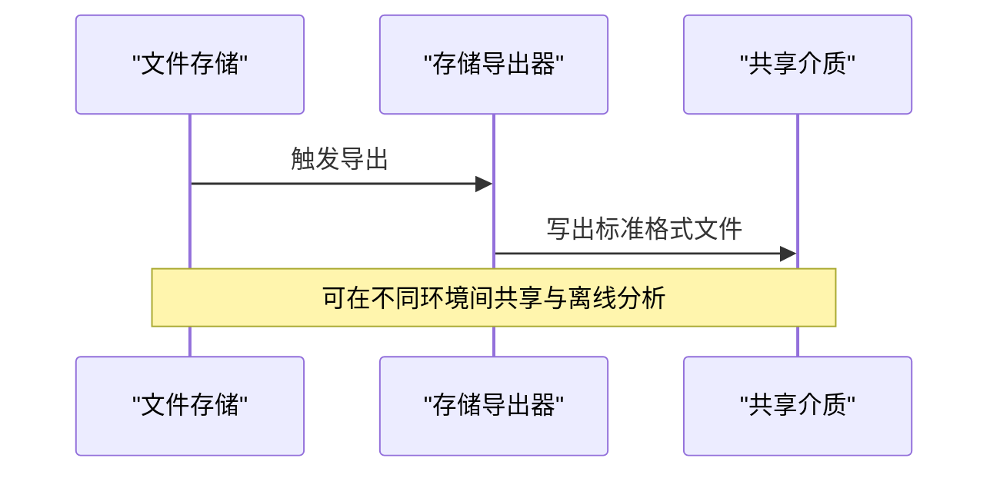
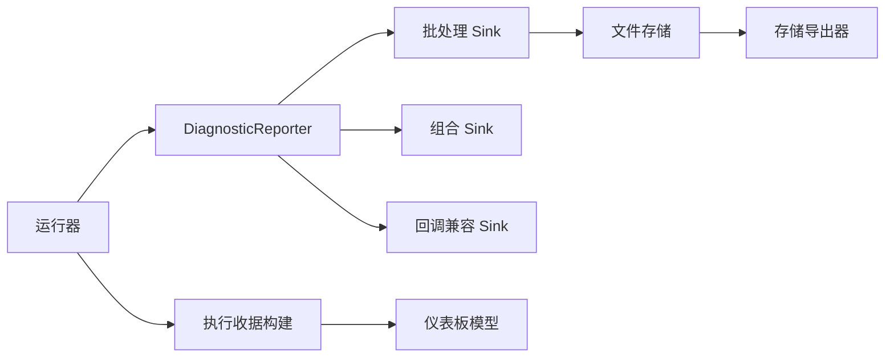

# 诊断和调试

<cite>
**本文引用的文件**
- [packages/core/src/observability/sink.ts](file://packages/core/src/observability/sink.ts)
- [packages/core/src/observability/batching.ts](file://packages/core/src/observability/batching.ts)
- [packages/core/src/observability/composite.ts](file://packages/core/src/observability/composite.ts)
- [packages/core/src/observability/legacy-callback.ts](file://packages/core/src/observability/legacy-callback.ts)
- [packages/core/src/observability/execution-receipt.ts](file://packages/core/src/observability/execution-receipt.ts)
- [packages/core/src/observability/store-exporter.ts](file://packages/core/src/observability/store-exporter.ts)
- [packages/core/src/observability/file-store.ts](file://packages/core/src/observability/file-store.ts)
- [packages/core/src/observability/index.ts](file://packages/core/src/observability/index.ts)
- [packages/core/src/index.ts](file://packages/core/src/index.ts)
- [packages/core/src/errors.ts](file://packages/core/src/errors.ts)
- [packages/core/src/types.ts](file://packages/core/src/types.ts)
- [packages/core/src/agent/runner.ts](file://packages/core/src/agent/runner.ts)
- [packages/core/src/dashboard/run-viewer-model.ts](file://packages/core/src/dashboard/run-viewer-model.ts)
- [packages/core/tests/eval-file-store.test.ts](file://packages/core/tests/eval-file-store.test.ts)
</cite>

## 目录
1. [简介](#简介)
2. [项目结构](#项目结构)
3. [核心组件](#核心组件)
4. [架构总览](#架构总览)
5. [详细组件分析](#详细组件分析)
6. [依赖关系分析](#依赖关系分析)
7. [性能考虑](#性能考虑)
8. [故障排查指南](#故障排查指南)
9. [结论](#结论)
10. [附录](#附录)

## 简介
本章节面向 Open Multi-Agent 的诊断与调试能力，聚焦以下目标：
- 使用诊断报告（DiagnosticReporter）进行错误捕获、状态收集与报告生成。
- 理解执行收据（ExecutionReceipt）的结构与作用，包括依赖关系、成本统计与审批决策。
- 配置诊断模式（详细日志、性能分析、内存使用等）。
- 提供故障排查指南与调试技巧。
- 说明诊断数据的导出与共享机制。
- 总结生产环境的诊断最佳实践。

## 项目结构
Open Multi-Agent 将可观测性与诊断能力集中在 observability 子系统中，并通过 core 的 index 统一对外暴露。关键路径如下：
- 诊断报告与 Sink 体系：sink.ts、batching.ts、composite.ts、legacy-callback.ts、store-exporter.ts、file-store.ts
- 执行收据构建：execution-receipt.ts
- 运行时与类型定义：types.ts、errors.ts、agent/runner.ts
- 仪表板集成：dashboard/run-viewer-model.ts
- 对外入口：index.ts、observability/index.ts

图表来源
- [packages/core/src/observability/sink.ts:126-200](file://packages/core/src/observability/sink.ts#L126-L200)
- [packages/core/src/observability/batching.ts:166-210](file://packages/core/src/observability/batching.ts#L166-L210)
- [packages/core/src/observability/composite.ts:45-60](file://packages/core/src/observability/composite.ts#L45-L60)
- [packages/core/src/observability/legacy-callback.ts:27-40](file://packages/core/src/observability/legacy-callback.ts#L27-L40)
- [packages/core/src/observability/store-exporter.ts:1-120](file://packages/core/src/observability/store-exporter.ts#L1-L120)
- [packages/core/src/observability/file-store.ts:80-120](file://packages/core/src/observability/file-store.ts#L80-L120)
- [packages/core/src/observability/execution-receipt.ts:389-420](file://packages/core/src/observability/execution-receipt.ts#L389-L420)
- [packages/core/src/dashboard/run-viewer-model.ts:11-15](file://packages/core/src/dashboard/run-viewer-model.ts#L11-L15)

章节来源
- [packages/core/src/observability/index.ts:1-30](file://packages/core/src/observability/index.ts#L1-L30)
- [packages/core/src/index.ts:210-240](file://packages/core/src/index.ts#L210-L240)

## 核心组件
- DiagnosticReporter：统一的诊断事件上报入口，负责错误捕获、状态收集、批处理与多 Sink 分发。
- ExecutionReceipt：对一次 Agent/Team 运行的结构化摘要，包含依赖边、令牌用量、成本估算与审批决策等。
- Sink 体系：支持批处理、组合、回调兼容、文件存储与导出器等后端。
- 运行时与错误：在 Agent 运行循环中捕获预算超限、超时、路由异常等，并转化为诊断事件或错误对象。
- 仪表板集成：通过 run-viewer-model 消费执行收据，渲染任务依赖、指标与审批信息。

章节来源
- [packages/core/src/observability/sink.ts:58-120](file://packages/core/src/observability/sink.ts#L58-L120)
- [packages/core/src/observability/sink.ts:126-200](file://packages/core/src/observability/sink.ts#L126-L200)
- [packages/core/src/observability/execution-receipt.ts:29-60](file://packages/core/src/observability/execution-receipt.ts#L29-L60)
- [packages/core/src/observability/execution-receipt.ts:389-420](file://packages/core/src/observability/execution-receipt.ts#L389-L420)
- [packages/core/src/agent/runner.ts:1204-1234](file://packages/core/src/agent/runner.ts#L1204-L1234)
- [packages/core/src/errors.ts:24-54](file://packages/core/src/errors.ts#L24-L54)

## 架构总览
下图展示从运行期到诊断数据落盘与可视化的整体流程。

图表来源
- [packages/core/src/observability/sink.ts:126-200](file://packages/core/src/observability/sink.ts#L126-L200)
- [packages/core/src/observability/batching.ts:166-210](file://packages/core/src/observability/batching.ts#L166-L210)
- [packages/core/src/observability/file-store.ts:80-120](file://packages/core/src/observability/file-store.ts#L80-L120)
- [packages/core/src/observability/execution-receipt.ts:389-420](file://packages/core/src/observability/execution-receipt.ts#L389-L420)
- [packages/core/src/dashboard/run-viewer-model.ts:11-15](file://packages/core/src/dashboard/run-viewer-model.ts#L11-L15)

## 详细组件分析

### 诊断报告（DiagnosticReporter）
- 职责
  - 接收来自运行期的诊断事件（如错误、进度、指标），进行去重、批处理和路由。
  - 支持多种 Sink：批处理、组合、回调兼容、文件存储与导出器。
  - 提供统一的诊断选项（如 sinkName、采样率、缓冲大小等）。
- 使用要点
  - 在创建 Sink 时传入 DiagnosticOptions，指定 sinkName 便于区分来源。
  - 批处理 Sink 会聚合事件以降低 IO 压力；组合 Sink 可将多个 Sink 合并。
  - 回调兼容 Sink 用于对接旧版回调接口。
- 错误捕获与状态收集
  - 运行期错误（如预算超限、调用超时、路由失败）会被转换为诊断事件或错误对象，随后由 Reporter 分发。
  - 状态收集包括任务执行指标、工具调用、重试次数、令牌用量等。

图表来源
- [packages/core/src/observability/sink.ts:126-200](file://packages/core/src/observability/sink.ts#L126-L200)
- [packages/core/src/observability/batching.ts:166-210](file://packages/core/src/observability/batching.ts#L166-L210)
- [packages/core/src/observability/composite.ts:45-60](file://packages/core/src/observability/composite.ts#L45-L60)
- [packages/core/src/observability/legacy-callback.ts:27-40](file://packages/core/src/observability/legacy-callback.ts#L27-L40)

章节来源
- [packages/core/src/observability/sink.ts:58-120](file://packages/core/src/observability/sink.ts#L58-L120)
- [packages/core/src/observability/sink.ts:126-200](file://packages/core/src/observability/sink.ts#L126-L200)
- [packages/core/src/observability/batching.ts:166-210](file://packages/core/src/observability/batching.ts#L166-L210)
- [packages/core/src/observability/composite.ts:45-60](file://packages/core/src/observability/composite.ts#L45-L60)
- [packages/core/src/observability/legacy-callback.ts:27-40](file://packages/core/src/observability/legacy-callback.ts#L27-L40)

### 执行收据（ExecutionReceipt）
- 作用
  - 以不可变、可序列化的方式记录一次 Agent/Team 运行的关键事实：依赖边、令牌用量、成本估算、审批决策等。
  - 供仪表板、审计、回放与离线分析使用。
- 结构与关键字段
  - 依赖边：描述任务间的依赖关系，支撑可视化与因果分析。
  - 成本统计：累计令牌用量与估计成本，便于预算控制与优化。
  - 审批决策：记录谁在何时批准或拒绝某项请求，支持合规审计。
- 构建过程
  - 基于 AgentRunResult/TeamRunResult 与 TraceFacts 构建，避免解析模型输出文本，保证稳定性。
  - 仪表板模型消费该收据，渲染任务详情与依赖图。

图表来源
- [packages/core/src/observability/execution-receipt.ts:29-60](file://packages/core/src/observability/execution-receipt.ts#L29-L60)
- [packages/core/src/observability/execution-receipt.ts:389-420](file://packages/core/src/observability/execution-receipt.ts#L389-L420)
- [packages/core/src/dashboard/run-viewer-model.ts:11-15](file://packages/core/src/dashboard/run-viewer-model.ts#L11-L15)

章节来源
- [packages/core/src/observability/execution-receipt.ts:29-60](file://packages/core/src/observability/execution-receipt.ts#L29-L60)
- [packages/core/src/observability/execution-receipt.ts:389-420](file://packages/core/src/observability/execution-receipt.ts#L389-L420)
- [packages/core/src/dashboard/run-viewer-model.ts:11-15](file://packages/core/src/dashboard/run-viewer-model.ts#L11-L15)

### 诊断模式配置
- 详细日志
  - 通过 Sink 选项开启更细粒度的事件上报；批处理 Sink 可调整批次大小与刷新策略。
- 性能分析
  - 利用任务执行指标（开始/结束时间、持续时间、重试次数、工具调用）定位瓶颈。
  - 结合令牌用量与成本估算，识别高开销阶段。
- 内存使用
  - 批处理 Sink 可减少频繁 IO；合理设置缓冲与刷新阈值，避免内存膨胀。
- 其他
  - 组合 Sink 可同时写入文件与远程系统；回调兼容 Sink 便于逐步迁移。

章节来源
- [packages/core/src/observability/batching.ts:166-210](file://packages/core/src/observability/batching.ts#L166-L210)
- [packages/core/src/observability/composite.ts:45-60](file://packages/core/src/observability/composite.ts#L45-L60)
- [packages/core/src/observability/legacy-callback.ts:27-40](file://packages/core/src/observability/legacy-callback.ts#L27-L40)
- [packages/core/src/types.ts:2003-2017](file://packages/core/src/types.ts#L2003-L2017)

### 运行时错误与诊断事件
- 预算与超时
  - 令牌预算超限、成本预算超限、LLM 调用超时、路由超时等错误会被抛出并纳入诊断流。
- 路由与消息校验
  - 路由声明缺失、无效消息、不支持的工具调用/结果内容等错误，有助于快速定位配置问题。
- 重试策略
  - 框架内置可重试/不可重试分类，帮助上层决定重试行为。

图表来源
- [packages/core/src/errors.ts:24-54](file://packages/core/src/errors.ts#L24-L54)
- [packages/core/src/errors.ts:65-94](file://packages/core/src/errors.ts#L65-L94)
- [packages/core/src/errors.ts:109-126](file://packages/core/src/errors.ts#L109-L126)
- [packages/core/src/errors.ts:128-180](file://packages/core/src/errors.ts#L128-L180)
- [packages/core/src/errors.ts:221-238](file://packages/core/src/errors.ts#L221-L238)
- [packages/core/src/agent/runner.ts:1204-1234](file://packages/core/src/agent/runner.ts#L1204-L1234)

章节来源
- [packages/core/src/errors.ts:24-54](file://packages/core/src/errors.ts#L24-L54)
- [packages/core/src/errors.ts:65-94](file://packages/core/src/errors.ts#L65-L94)
- [packages/core/src/errors.ts:109-126](file://packages/core/src/errors.ts#L109-L126)
- [packages/core/src/errors.ts:128-180](file://packages/core/src/errors.ts#L128-L180)
- [packages/core/src/errors.ts:221-238](file://packages/core/src/errors.ts#L221-L238)
- [packages/core/src/agent/runner.ts:1204-1234](file://packages/core/src/agent/runner.ts#L1204-L1234)

### 调试工具与技巧
- 使用批处理 Sink 降低 IO 抖动，观察吞吐与延迟。
- 使用组合 Sink 同时写入本地文件与远程系统，便于对比与归档。
- 借助仪表板模型消费执行收据，快速查看任务依赖、耗时与审批情况。
- 在开发环境开启更详细的诊断事件，在生产环境收敛至必要指标。

章节来源
- [packages/core/src/observability/batching.ts:166-210](file://packages/core/src/observability/batching.ts#L166-L210)
- [packages/core/src/observability/composite.ts:45-60](file://packages/core/src/observability/composite.ts#L45-L60)
- [packages/core/src/dashboard/run-viewer-model.ts:11-15](file://packages/core/src/dashboard/run-viewer-model.ts#L11-L15)

### 诊断数据的导出与共享
- 文件存储
  - 支持 NDJSON 格式的事件/评估数据存储，具备完整性检查与恢复能力。
  - 打开时可接收诊断回调，报告不完整批次、尾随部分行等问题。
- 存储导出器
  - 将内部存储导出为标准格式，便于跨系统共享与分析。
- 共享建议
  - 将文件存储置于共享卷或对象存储，配合索引与查询工具进行分析。
  - 对敏感信息进行脱敏后再导出。

图表来源
- [packages/core/src/observability/file-store.ts:80-120](file://packages/core/src/observability/file-store.ts#L80-L120)
- [packages/core/src/observability/store-exporter.ts:1-120](file://packages/core/src/observability/store-exporter.ts#L1-L120)
- [packages/core/tests/eval-file-store.test.ts:114-150](file://packages/core/tests/eval-file-store.test.ts#L114-L150)

章节来源
- [packages/core/src/observability/file-store.ts:80-120](file://packages/core/src/observability/file-store.ts#L80-L120)
- [packages/core/src/observability/store-exporter.ts:1-120](file://packages/core/src/observability/store-exporter.ts#L1-L120)
- [packages/core/tests/eval-file-store.test.ts:114-150](file://packages/core/tests/eval-file-store.test.ts#L114-L150)

## 依赖关系分析
- 模块耦合
  - DiagnosticReporter 松耦合于具体 Sink，便于替换与扩展。
  - 执行收据构建独立于模型输出解析，提升鲁棒性。
- 外部依赖
  - 文件存储依赖文件系统 API；导出器依赖序列化与压缩库（如有）。
- 潜在风险
  - 批处理过大可能导致内存占用上升；需根据资源限制调优。
  - 文件存储损坏或不完整时需有恢复与告警机制。

图表来源
- [packages/core/src/observability/sink.ts:126-200](file://packages/core/src/observability/sink.ts#L126-L200)
- [packages/core/src/observability/batching.ts:166-210](file://packages/core/src/observability/batching.ts#L166-L210)
- [packages/core/src/observability/composite.ts:45-60](file://packages/core/src/observability/composite.ts#L45-L60)
- [packages/core/src/observability/legacy-callback.ts:27-40](file://packages/core/src/observability/legacy-callback.ts#L27-L40)
- [packages/core/src/observability/file-store.ts:80-120](file://packages/core/src/observability/file-store.ts#L80-L120)
- [packages/core/src/observability/store-exporter.ts:1-120](file://packages/core/src/observability/store-exporter.ts#L1-L120)
- [packages/core/src/observability/execution-receipt.ts:389-420](file://packages/core/src/observability/execution-receipt.ts#L389-L420)
- [packages/core/src/dashboard/run-viewer-model.ts:11-15](file://packages/core/src/dashboard/run-viewer-model.ts#L11-L15)

章节来源
- [packages/core/src/observability/sink.ts:126-200](file://packages/core/src/observability/sink.ts#L126-L200)
- [packages/core/src/observability/execution-receipt.ts:389-420](file://packages/core/src/observability/execution-receipt.ts#L389-L420)

## 性能考虑
- 批处理策略
  - 合理设置批次大小与刷新间隔，平衡吞吐与延迟。
- 内存管理
  - 监控批处理队列长度与内存占用，必要时拆分 Sink 或增加刷新频率。
- 成本与令牌用量
  - 通过执行收据中的 tokenUsage 与成本估算，识别高开销阶段并进行优化。
- 重试与退避
  - 利用可重试错误分类，实现指数退避与熔断策略，避免雪崩。

[本节为通用指导，不直接分析具体文件]

## 故障排查指南
- 常见问题识别
  - 预算超限：检查 maxTokenBudget/cost 配置与模型调用频次。
  - 调用超时：检查网络与 Provider 响应时间，调整 per-call 超时。
  - 路由失败：确认路由声明与治理拓扑是否符合要求。
  - 文件存储异常：检查磁盘空间、权限与文件格式完整性。
- 日志分析
  - 关注批处理 Sink 的 flush 频率与错误堆栈。
  - 审查执行收据中的依赖边与审批决策，定位阻塞点。
- 解决方案
  - 调整批处理参数与刷新策略。
  - 修复路由配置或输入消息格式。
  - 清理或恢复损坏的文件存储，启用诊断回调获取详细信息。

章节来源
- [packages/core/src/errors.ts:24-54](file://packages/core/src/errors.ts#L24-L54)
- [packages/core/src/errors.ts:65-94](file://packages/core/src/errors.ts#L65-L94)
- [packages/core/src/errors.ts:109-126](file://packages/core/src/errors.ts#L109-L126)
- [packages/core/src/errors.ts:128-180](file://packages/core/src/errors.ts#L128-L180)
- [packages/core/tests/eval-file-store.test.ts:114-150](file://packages/core/tests/eval-file-store.test.ts#L114-L150)

## 结论
Open Multi-Agent 的诊断与调试体系以 DiagnosticReporter 为核心，结合执行收据与多 Sink 架构，提供了从运行期数据采集、批处理、持久化到可视化的完整链路。通过合理的配置与排障策略，可以在开发与生产环境中高效定位问题、优化性能并确保合规审计。

[本节为总结性内容，不直接分析具体文件]

## 附录
- 对外暴露的入口
  - core/index.ts 与 observability/index.ts 统一导出诊断与收据相关能力，便于上层集成。
- 推荐实践
  - 开发环境：开启详细日志与批处理，便于快速定位问题。
  - 生产环境：收敛日志级别，启用文件存储与导出器，定期归档与分析。
  - 安全与合规：对敏感数据进行脱敏，严格管理审批决策记录。

章节来源
- [packages/core/src/index.ts:210-240](file://packages/core/src/index.ts#L210-L240)
- [packages/core/src/observability/index.ts:1-30](file://packages/core/src/observability/index.ts#L1-L30)