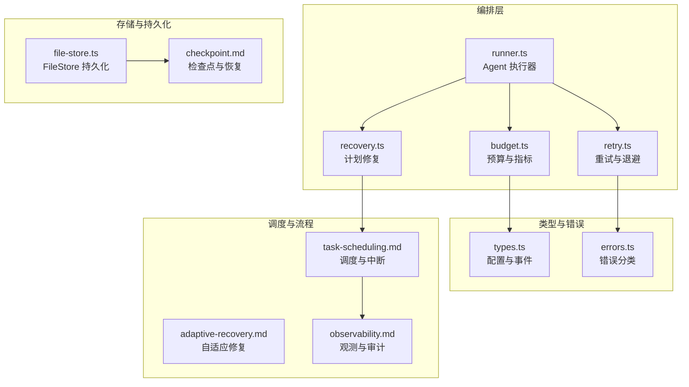
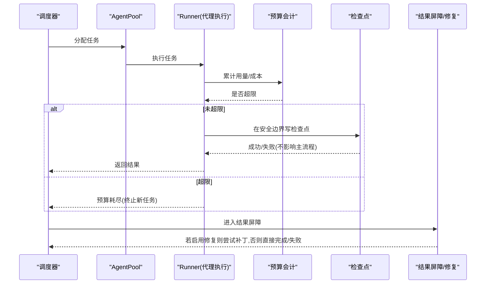
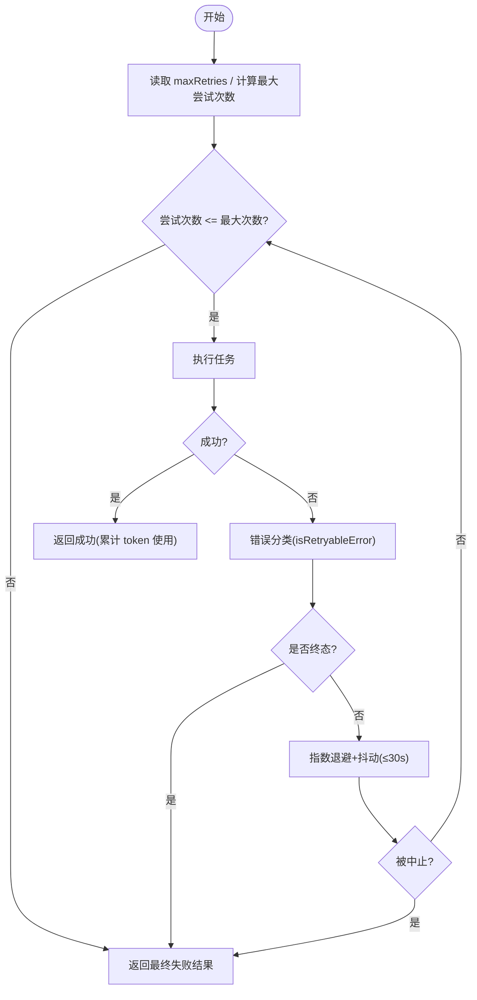
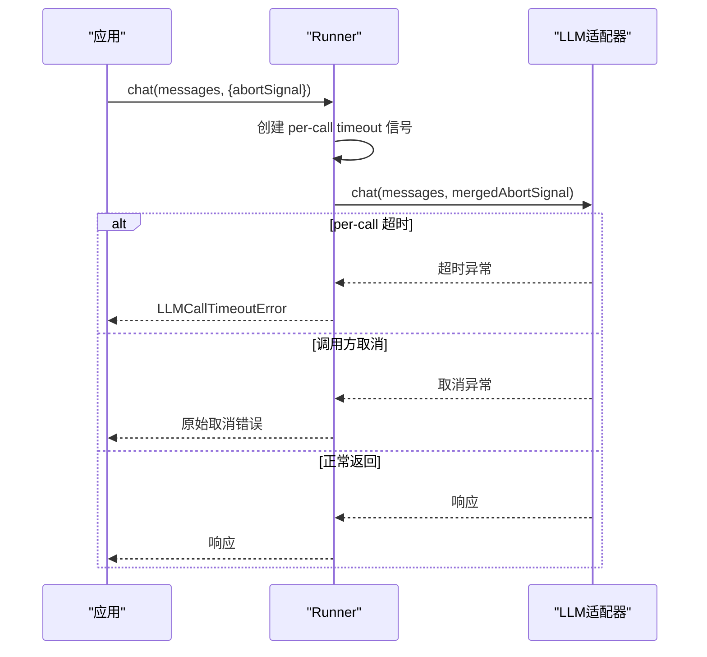
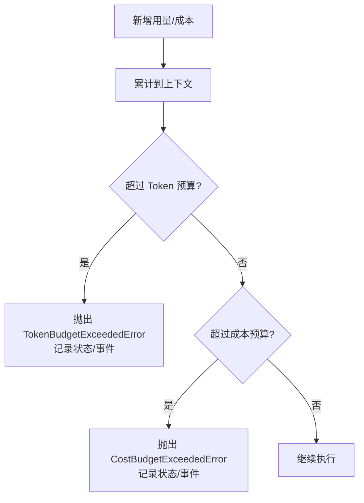
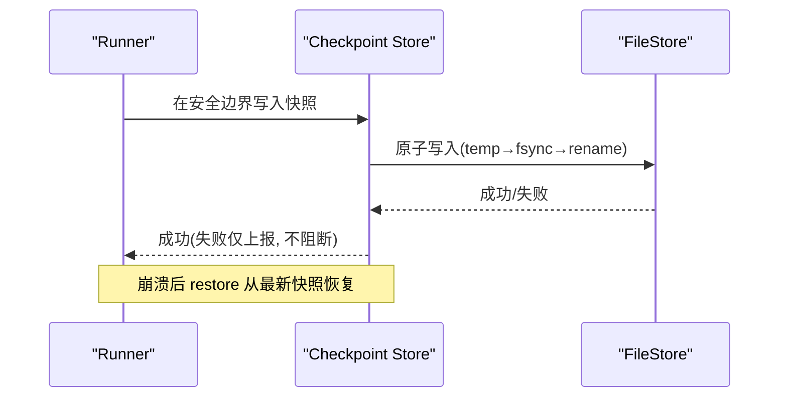
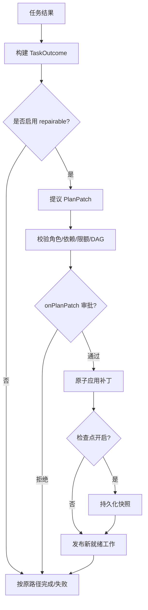
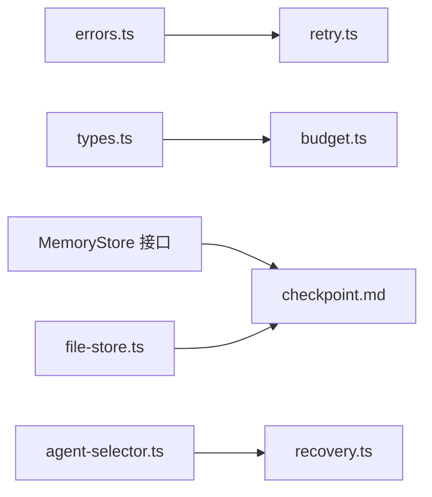

# 可靠性保障

<cite>
**本文引用的文件**
- [README.md](file://README.md)
- [adaptive-recovery.md](file://docs/adaptive-recovery.md)
- [checkpoint.md](file://docs/checkpoint.md)
- [observability.md](file://docs/observability.md)
- [task-scheduling.md](file://docs/task-scheduling.md)
- [errors.ts](file://packages/core/src/errors.ts)
- [types.ts](file://packages/core/src/types.ts)
- [runner.ts](file://packages/core/src/agent/runner.ts)
- [budget.ts](file://packages/core/src/orchestrator/budget.ts)
- [retry.ts](file://packages/core/src/orchestrator/retry.ts)
- [recovery.ts](file://packages/core/src/orchestrator/recovery.ts)
- [file-store.ts](file://packages/core/src/memory/file-store.ts)
</cite>

## 目录
1. [简介](#简介)
2. [项目结构](#项目结构)
3. [核心组件](#核心组件)
4. [架构总览](#架构总览)
5. [详细组件分析](#详细组件分析)
6. [依赖关系分析](#依赖关系分析)
7. [性能考量](#性能考量)
8. [故障排查指南](#故障排查指南)
9. [结论](#结论)
10. [附录](#附录)

## 简介
本文件系统性说明 Open Multi-Agent（OMA）在生产环境中的可靠性保障机制，覆盖以下主题：
- 重试机制：策略、退避算法、失败分类与可恢复性判断
- 超时控制：请求级超时、长时间运行保护、资源清理
- 预算控制：Token 预算、成本限制、资源监控与告警
- 检查点与恢复：断点续跑、计划修复、数据一致性保证
- 最佳实践与生产部署建议
- 故障恢复案例与性能影响分析

OMA 在“可靠性”方面的设计要点包括：任务图默认固定、可选的自适应修复、可插拔的检查点与恢复、统一的错误分类与重试、细粒度的预算与超时控制，以及完善的观测与审计能力。

**章节来源**
- [README.md:99-107](file://README.md#L99-L107)

## 项目结构
从可靠性视角看，关键代码分布在 orchestrator、agent runner、memory/store、errors 与 types 等模块；文档集中在 docs 下的 checkpoint、adaptive-recovery、observability、task-scheduling 等。

**图表来源**
- [runner.ts:537-582](file://packages/core/src/agent/runner.ts#L537-L582)
- [budget.ts:118-215](file://packages/core/src/orchestrator/budget.ts#L118-L215)
- [retry.ts:1-139](file://packages/core/src/orchestrator/retry.ts#L1-L139)
- [recovery.ts:1-207](file://packages/core/src/orchestrator/recovery.ts#L1-L207)
- [file-store.ts:1-54](file://packages/core/src/memory/file-store.ts#L1-L54)
- [checkpoint.md:1-290](file://docs/checkpoint.md#L1-L290)
- [task-scheduling.md:1-203](file://docs/task-scheduling.md#L1-L203)
- [observability.md:1-768](file://docs/observability.md#L1-L768)

**章节来源**
- [task-scheduling.md:1-203](file://docs/task-scheduling.md#L1-L203)
- [checkpoint.md:1-290](file://docs/checkpoint.md#L1-L290)
- [observability.md:1-768](file://docs/observability.md#L1-L768)

## 核心组件
- 重试与退避：executeWithRetry 提供带抖动指数退避的重试，结合 isRetryableError 对错误进行可重试/终态分类，避免无效重试。
- 超时控制：Runner 为每次 LLM 调用注入 per-call 超时信号，并与整体 run 超时组合；超时会抛出专用异常以便上层区分取消与超时。
- 预算控制：统一累计 Token 与估算成本，超过阈值即触发预算超限事件并标记运行状态。
- 检查点与恢复：在安全边界写入快照，支持 FileStore 持久化；restore 可重建队列与共享内存，跳过已完成任务，重放已提交工具结果。
- 计划修复：在任务结果屏障处，允许通过 Replanner/onTaskOutcome 提出仅追加的计划补丁，经校验与审批后原子应用。

**章节来源**
- [retry.ts:1-139](file://packages/core/src/orchestrator/retry.ts#L1-L139)
- [errors.ts:208-239](file://packages/core/src/errors.ts#L208-L239)
- [runner.ts:537-582](file://packages/core/src/agent/runner.ts#L537-L582)
- [budget.ts:118-215](file://packages/core/src/orchestrator/budget.ts#L118-L215)
- [checkpoint.md:1-290](file://docs/checkpoint.md#L1-L290)
- [adaptive-recovery.md:1-132](file://docs/adaptive-recovery.md#L1-L132)

## 架构总览
下图展示一次任务执行的可靠性路径：调度→分配→执行→重试/超时→预算检查→检查点→结果屏障→可选修复→完成或失败。

**图表来源**
- [task-scheduling.md:1-203](file://docs/task-scheduling.md#L1-L203)
- [runner.ts:537-582](file://packages/core/src/agent/runner.ts#L537-L582)
- [budget.ts:118-215](file://packages/core/src/orchestrator/budget.ts#L118-L215)
- [checkpoint.md:1-290](file://docs/checkpoint.md#L1-L290)
- [adaptive-recovery.md:1-132](file://docs/adaptive-recovery.md#L1-L132)

## 详细组件分析

### 重试机制：策略、退避与失败处理
- 重试开关与参数：任务级 maxRetries、retryDelayMs、retryBackoff；默认关闭。
- 退避算法：指数退避 + 均匀抖动，单次延迟上限 30 秒，避免雪崩与锁步重试。
- 错误分类：isRetryableError 将网络抖动、408/409/429、5xx 视为可重试；认证/校验/取消/非 4xx 客户端错误视为终态，不重试。
- 中止与悬挂：重试期间尊重 abortSignal；suspended 与 DurableApprovalError 不走重试路径，走审批/挂起恢复路径。
- 观测：onRetry 回调暴露 nextDelayMs 与实际延迟，便于日志与告警。

**图表来源**
- [retry.ts:1-139](file://packages/core/src/orchestrator/retry.ts#L1-L139)
- [errors.ts:208-239](file://packages/core/src/errors.ts#L208-L239)

**章节来源**
- [retry.ts:1-139](file://packages/core/src/orchestrator/retry.ts#L1-L139)
- [errors.ts:208-239](file://packages/core/src/errors.ts#L208-L239)

### 超时控制：请求级与运行级保护
- 请求级超时：Runner 为每次 adapter.chat() 注入 AbortSignal.timeout(callTimeoutMs)，与外层 abortSignal 合并，任一先触发即结束该次调用。
- 运行级超时：AgentConfig.timeoutMs 用于整个 agent 运行的墙钟时间保护。
- 超时识别：当 OMA 自身 per-call 超时触发且非调用方主动取消时，抛出 LLMCallTimeoutError，便于上层区分取消与超时。
- 资源清理：超时导致的中止会停止当前调用，后续由调度器按“停止接纳→等待进行中→剩余任务标记 skipped”的路径清理。

**图表来源**
- [runner.ts:537-582](file://packages/core/src/agent/runner.ts#L537-L582)
- [task-scheduling.md:166-184](file://docs/task-scheduling.md#L166-L184)

**章节来源**
- [runner.ts:537-582](file://packages/core/src/agent/runner.ts#L537-L582)
- [task-scheduling.md:166-184](file://docs/task-scheduling.md#L166-L184)

### 预算控制系统：Token 与成本限制
- 累计与拦截：recordRunUsage 累计 Token 与估算成本，超过阈值即设置运行状态为预算耗尽并触发 budget_exceeded 事件。
- 层级上限：resolveBudgetCeiling 确保子级上限不会宽于父级；runTasksOptions 与 OrchestratorConfig 可同时设置，取较小值。
- 成本估算：estimateIncrementalCost 要求返回有效数值，非法值直接报错，防止预算失控。
- 指标汇总：computeRunMetrics 汇总输入/输出 Token、重试数、错误/失败计数、耗时统计等。

**图表来源**
- [budget.ts:118-215](file://packages/core/src/orchestrator/budget.ts#L118-L215)
- [types.ts:1514-1540](file://packages/core/src/types.ts#L1514-L1540)

**章节来源**
- [budget.ts:118-215](file://packages/core/src/orchestrator/budget.ts#L118-L215)
- [types.ts:1514-1540](file://packages/core/src/types.ts#L1514-L1540)

### 检查点与恢复：断点续跑与数据一致性
- 保存时机：在内置 Runner 的安全边界与每个任务完成后写入快照；写入失败不影响主流程，但会在下一个安全边界重试。
- 内容范围：包含执行身份、任务队列、共享内存（视实现嵌入）、已完成任务结果、进行中 Runner 状态、审批延续状态、任务元数据等。
- 持久化：FileStore 以原子写（临时文件→fsync→rename）保证断电/崩溃一致性；跨进程无锁，适合单进程恢复场景。
- 恢复语义：restore 加载最新快照，重建队列与共享内存，跳过已完成任务，重放已提交的工具结果；协调者综合阶段可重新运行以得到一致的综合答案。
- 隐私与脱敏：可通过 RedactingStore 在写入边界脱敏敏感字段；注意审批记录需保持原文哈希一致性，不建议对审批存储脱敏。

**图表来源**
- [checkpoint.md:49-73](file://docs/checkpoint.md#L49-L73)
- [file-store.ts:1-54](file://packages/core/src/memory/file-store.ts#L1-L54)

**章节来源**
- [checkpoint.md:1-290](file://docs/checkpoint.md#L1-L290)
- [file-store.ts:1-54](file://packages/core/src/memory/file-store.ts#L1-L54)

### 计划修复：结果屏障与可修复模式
- 模式切换：默认固定 DAG；启用 recovery.mode='repairable' 后，在任务结果屏障处允许提出仅追加的计划补丁。
- 修复流程：产出结果→Replanner/onTaskOutcome 提议 PlanPatch→校验（角色/限额/依赖/DAG）→可选 onPlanPatch 审批→原子应用→必要时持久化检查点→发布新就绪工作。
- 操作类型：addTasks、retargetPending、supersedePending；历史任务仍保留真实状态（failed/skipped），并通过 recoveredByRevision/supersededByRevision 标注。
- 边界与限制：不可回滚外部副作用；与 runFromPlan 精确回放互斥；与旧版轮次审批不兼容；达到限额后拒绝进一步补丁。

**图表来源**
- [adaptive-recovery.md:1-132](file://docs/adaptive-recovery.md#L1-L132)
- [recovery.ts:31-68](file://packages/core/src/orchestrator/recovery.ts#L31-L68)
- [recovery.ts:99-149](file://packages/core/src/orchestrator/recovery.ts#L99-L149)

**章节来源**
- [adaptive-recovery.md:1-132](file://docs/adaptive-recovery.md#L1-L132)
- [recovery.ts:31-68](file://packages/core/src/orchestrator/recovery.ts#L31-L68)
- [recovery.ts:99-149](file://packages/core/src/orchestrator/recovery.ts#L99-L149)

### 调度与中断：预算、检查点与任务流
- 事件驱动：就绪任务立即分配，不等待同批其他任务；完成即释放下游依赖。
- 中断路径：中止/预算耗尽/审批拒绝采用“停止接纳→等待进行中→剩余任务标记 skipped”的统一路径。
- 检查点：在安全边界与任务完成后写入；恢复时跳过已完成任务，重放已提交工具结果。

**章节来源**
- [task-scheduling.md:1-203](file://docs/task-scheduling.md#L1-L203)

## 依赖关系分析
- 重试依赖错误分类：retry.ts 通过 errors.ts 的 isRetryableError 决定可重试性。
- 预算依赖类型定义：budget.ts 使用 types.ts 中的 OrchestratorConfig、RunTasksOptions 等接口。
- 检查点依赖存储抽象：checkpoint 通过 MemoryStore 接口，FileStore 提供零依赖持久化实现。
- 计划修复依赖调度与选择：recovery.ts 复用 AgentSelector 校验补丁中任务的候选代理资格。

**图表来源**
- [errors.ts:208-239](file://packages/core/src/errors.ts#L208-L239)
- [retry.ts:1-139](file://packages/core/src/orchestrator/retry.ts#L1-L139)
- [types.ts:1514-1540](file://packages/core/src/types.ts#L1514-L1540)
- [budget.ts:118-215](file://packages/core/src/orchestrator/budget.ts#L118-L215)
- [file-store.ts:1-54](file://packages/core/src/memory/file-store.ts#L1-L54)
- [checkpoint.md:1-290](file://docs/checkpoint.md#L1-L290)
- [recovery.ts:99-149](file://packages/core/src/orchestrator/recovery.ts#L99-L149)

**章节来源**
- [retry.ts:1-139](file://packages/core/src/orchestrator/retry.ts#L1-L139)
- [errors.ts:208-239](file://packages/core/src/errors.ts#L208-L239)
- [budget.ts:118-215](file://packages/core/src/orchestrator/budget.ts#L118-L215)
- [types.ts:1514-1540](file://packages/core/src/types.ts#L1514-L1540)
- [file-store.ts:1-54](file://packages/core/src/memory/file-store.ts#L1-L54)
- [checkpoint.md:1-290](file://docs/checkpoint.md#L1-L290)
- [recovery.ts:99-149](file://packages/core/src/orchestrator/recovery.ts#L99-L149)

## 性能考量
- 重试抖动与上限：指数退避加均匀抖动降低并发重试风暴风险；单次延迟上限 30 秒，避免无限增长。
- 预算检查频率：在 turn/任务边界累计用量，避免频繁开销；超限后立即阻止新任务，减少无效执行。
- 检查点写入：仅在安全边界与任务完成后写入；写入失败不阻断主流程，降低对热路径的影响。
- 观测导出：BatchingTraceSink 默认队列与批量大小有限，避免阻塞业务执行；导出失败不影响业务结果。

[本节为通用指导，不直接分析具体文件]

## 故障排查指南
- 预算耗尽：监听 budget_exceeded 事件，定位超限的 agent/task；检查 OrchestratorConfig.maxTokenBudget/OrchestratorConfig.maxCostBudget 与 estimateCost 实现。
- 超时问题：确认 callTimeoutMs 与 timeoutMs 设置是否合理；区分 LLMCallTimeoutError 与调用方取消；检查上游服务 SLA。
- 重试过多：查看 task_retry 事件与 nextDelayMs；调整 retryDelayMs/retryBackoff；确认 isRetryableError 分类是否符合预期。
- 检查点丢失：确认 checkpoint.store 是否为 FileStore 或可持久化后端；关注 checkpoint_save_failed 事件；验证文件权限与磁盘空间。
- 计划修复未生效：检查 recovery.mode 与 replanner/onTaskOutcome 配置；确认 onPlanPatch 审批逻辑；查看 maxPlanRevisions/maxAddedTasks 是否触顶。

**章节来源**
- [observability.md:602-615](file://docs/observability.md#L602-L615)
- [checkpoint.md:154-170](file://docs/checkpoint.md#L154-L170)
- [budget.ts:170-215](file://packages/core/src/orchestrator/budget.ts#L170-L215)
- [retry.ts:46-139](file://packages/core/src/orchestrator/retry.ts#L46-L139)
- [adaptive-recovery.md:23-75](file://docs/adaptive-recovery.md#L23-L75)

## 结论
OMA 通过“重试+退避”、“请求/运行级超时”、“Token/成本预算”、“检查点与恢复”、“计划修复”与“可观测性”形成闭环的可靠性体系。生产环境中建议：
- 明确设置 callTimeoutMs 与 timeoutMs，避免长尾阻塞
- 合理配置 maxRetries/retryDelayMs/retryBackoff，并结合 isRetryableError 行为调优
- 设置 Orchestrator 与 per-run 预算上限，启用预算事件告警
- 使用 FileStore 作为检查点存储，配合 RedactingStore 脱敏
- 在关键路径启用 adaptive-recovery，配合 onPlanPatch 审批与限额
- 通过 observability.sinks 接入集中式追踪，结合 Run Viewer 快速复盘

[本节为总结性内容，不直接分析具体文件]

## 附录
- 配置参考
  - 任务重试：maxRetries、retryDelayMs、retryBackoff
  - 超时：AgentConfig.callTimeoutMs、AgentConfig.timeoutMs
  - 预算：OrchestratorConfig.maxTokenBudget、OrchestratorConfig.maxCostBudget、estimateCost
  - 检查点：checkpoint.enabled、checkpoint.store、checkpoint.runId/key
  - 计划修复：recovery.mode、replanner/onTaskOutcome、onPlanPatch、maxPlanRevisions、maxAddedTasks

[本节为补充信息，不直接分析具体文件]