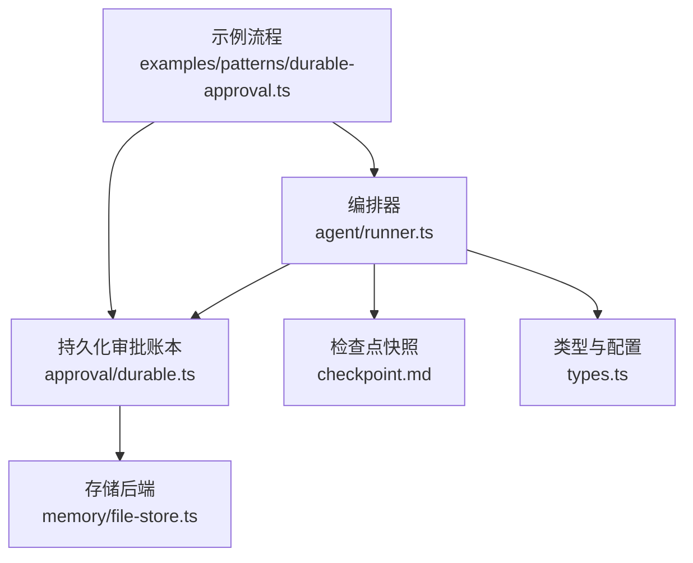
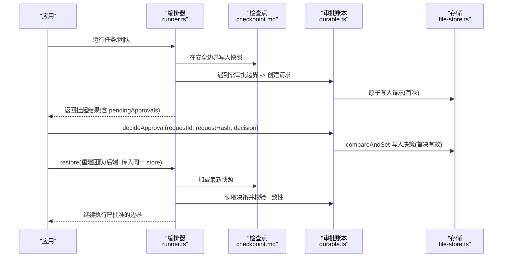
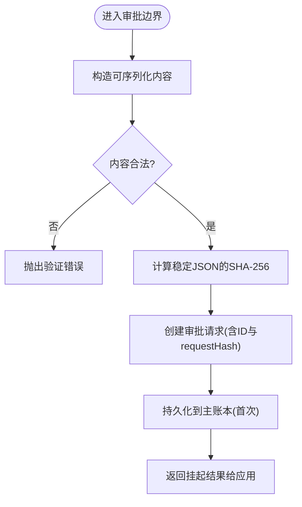
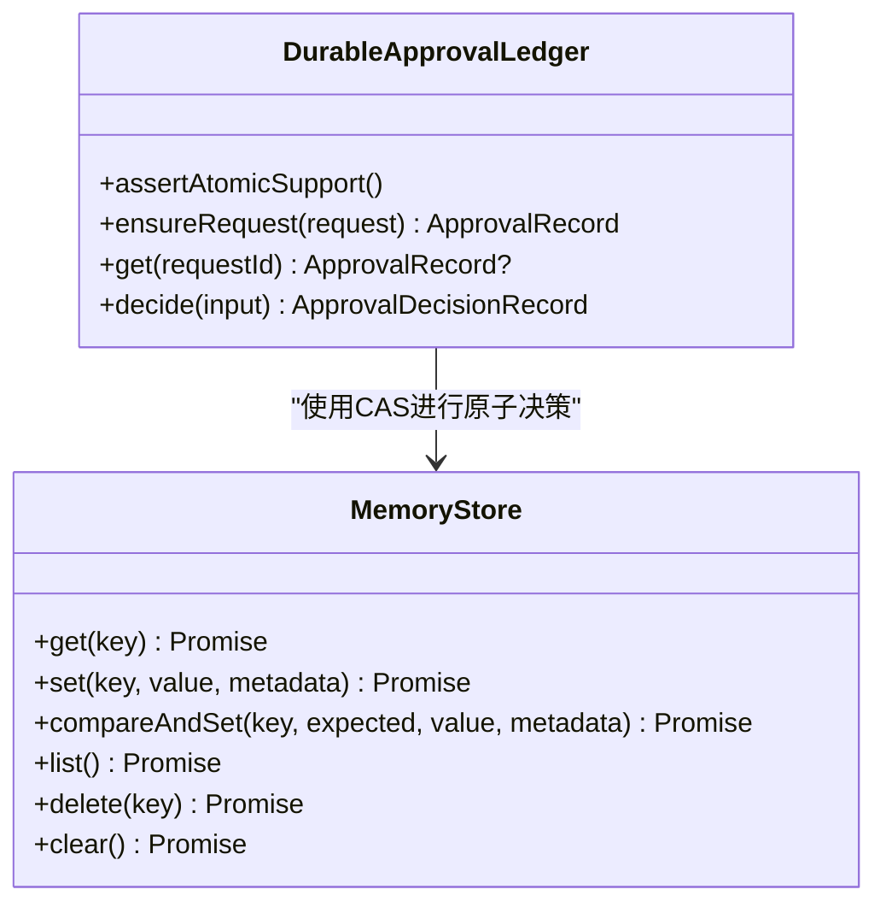
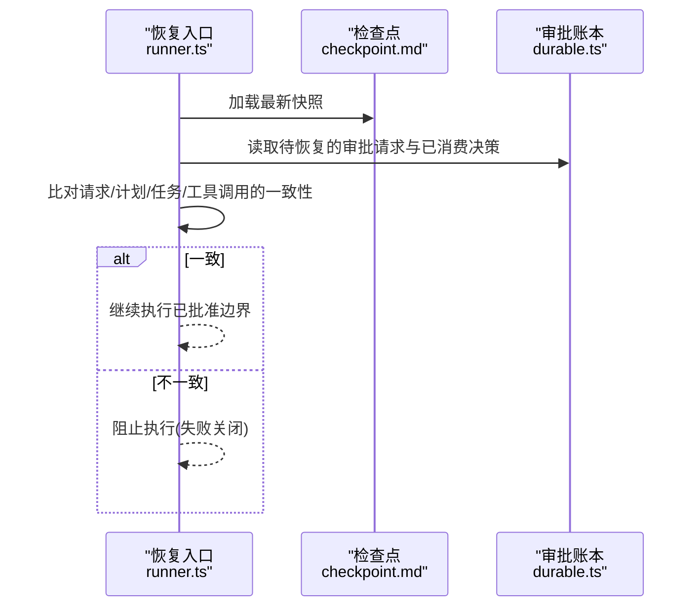
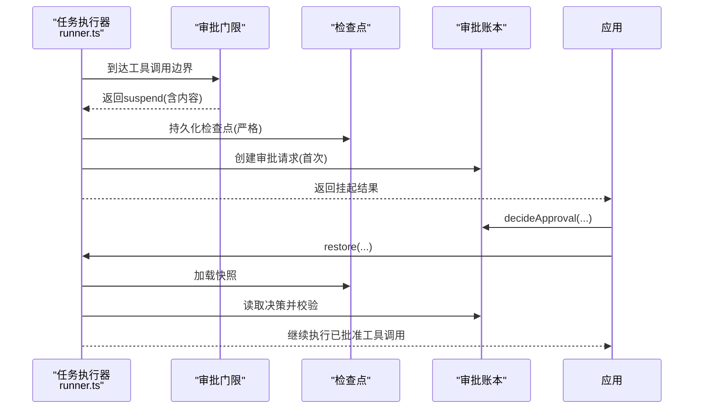
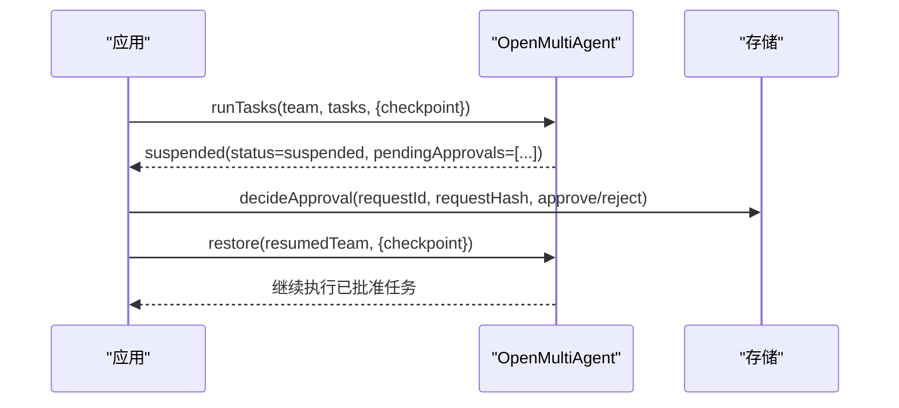
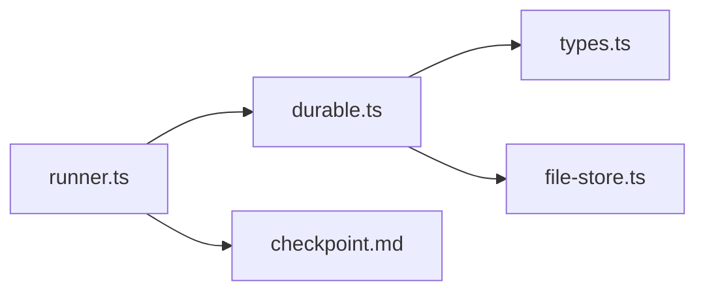

# 持久化审批

<cite>
**本文引用的文件**
- [durable-approvals.md](file://docs/durable-approvals.md)
- [checkpoint.md](file://docs/checkpoint.md)
- [durable.ts](file://packages/core/src/approval/durable.ts)
- [runner.ts](file://packages/core/src/agent/runner.ts)
- [types.ts](file://packages/core/src/types.ts)
- [file-store.ts](file://packages/core/src/memory/file-store.ts)
- [durable-approval.ts](file://packages/core/examples/patterns/durable-approval.ts)
</cite>

## 目录
1. [简介](#简介)
2. [项目结构](#项目结构)
3. [核心组件](#核心组件)
4. [架构总览](#架构总览)
5. [详细组件分析](#详细组件分析)
6. [依赖关系分析](#依赖关系分析)
7. [性能考虑](#性能考虑)
8. [故障排查指南](#故障排查指南)
9. [结论](#结论)
10. [附录](#附录)

## 简介
本文件系统性介绍 Open Multi-Agent（OMA）的“持久化审批”机制。它使工作流在关键边界处可暂停、将审批请求与内容精确绑定并持久化，等待外部审查者做出不可变决策后，再恢复执行。该能力与检查点系统深度集成：审批状态在进程重启后可正确恢复；同时提供权限控制、审计日志、分布式并发安全与一致性保证，以及配置项与最佳实践，帮助在多智能体工作流中构建安全可靠的业务流程。

## 项目结构
- 文档层
  - durable-approvals.md：持久化审批的设计、边界、语义与限制
  - checkpoint.md：检查点与恢复机制，以及与持久化审批的集成方式
- 实现层
  - approval/durable.ts：审批请求创建、哈希绑定、原子决策、主账本存储
  - agent/runner.ts：编排器在执行路径中触发审批、挂起、恢复与校验
  - memory/file-store.ts：基于文件的 MemoryStore，提供 compareAndSet 原子写入
  - types.ts：审批相关类型定义、配置选项与回调接口
  - examples/patterns/durable-approval.ts：端到端示例，演示“挂起-决策-恢复”流程

图表来源
- [runner.ts:990-1070](file://packages/core/src/agent/runner.ts#L990-L1070)
- [durable.ts:414-579](file://packages/core/src/approval/durable.ts#L414-L579)
- [file-store.ts:124-169](file://packages/core/src/memory/file-store.ts#L124-L169)
- [checkpoint.md:109-153](file://docs/checkpoint.md#L109-L153)

章节来源
- [durable-approvals.md:1-192](file://docs/durable-approvals.md#L1-L192)
- [checkpoint.md:1-290](file://docs/checkpoint.md#L1-L290)

## 核心组件
- 审批边界与范围
  - 支持 plan、task_round、task_dispatch、tool_call 四类边界
  - 每个边界携带可序列化、可哈希的内容，确保“所见即所批”
- 审批请求与决策
  - 通过 createApprovalRequest 生成唯一 ID 与 requestHash
  - 使用 DurableApprovalLedger 在主存储中以 compareAndSet 原子写入决策，首决有效
- 检查点集成
  - 检查点保存“待恢复的延续状态 + 已消费决策”，恢复时与主账本比对一致性
- 存储要求
  - 需要 MemoryStore.compareAndSet 以支持跨调用/进程的原子决策
  - FileStore 提供单进程内原子写入；跨进程建议使用数据库级 CAS
- 错误与一致性
  - 严格校验内容与哈希，拒绝篡改或过期决策
  - 工具调用恢复时重新校验输入，防止旧审批被滥用

章节来源
- [types.ts:327-422](file://packages/core/src/types.ts#L327-L422)
- [durable.ts:125-196](file://packages/core/src/approval/durable.ts#L125-L196)
- [durable.ts:414-579](file://packages/core/src/approval/durable.ts#L414-L579)
- [checkpoint.md:109-153](file://docs/checkpoint.md#L109-L153)

## 架构总览
持久化审批是“执行状态”能力而非遥测。检查点拥有“待恢复的延续”，主审批行拥有“不可变请求与首决”。恢复时 OMA 独立比对请求、计划/任务状态与工具调用，确保一致后才允许执行。

图表来源
- [runner.ts:990-1070](file://packages/core/src/agent/runner.ts#L990-L1070)
- [durable.ts:414-579](file://packages/core/src/approval/durable.ts#L414-L579)
- [file-store.ts:124-169](file://packages/core/src/memory/file-store.ts#L124-L169)
- [checkpoint.md:109-153](file://docs/checkpoint.md#L109-L153)

## 详细组件分析

### 审批边界与内容绑定
- 支持的边界
  - onPlanReady：计划就绪，决定是否执行或仅返回计划
  - onApproval：轮次屏障，决定下一轮是否开始
  - onTaskDispatch：任务派发前，决定是否派发该任务
  - onToolCall：工具调用前，决定是否执行该工具
- 内容绑定
  - 每个请求包含 scope、boundary、content，计算稳定 JSON 的 SHA-256 作为 requestHash
  - 工具调用会保留原始输入与 Zod 校验后的输入，恢复时重新校验并比对
  - 非 JSON 兼容值（如循环引用、非有限数）会被拒绝

图表来源
- [durable.ts:54-131](file://packages/core/src/approval/durable.ts#L54-L131)
- [durable.ts:157-196](file://packages/core/src/approval/durable.ts#L157-L196)
- [durable-approvals.md:94-118](file://docs/durable-approvals.md#L94-L118)

章节来源
- [durable-approvals.md:16-28](file://docs/durable-approvals.md#L16-L28)
- [durable-approvals.md:94-118](file://docs/durable-approvals.md#L94-L118)
- [types.ts:327-422](file://packages/core/src/types.ts#L327-L422)

### 决策持久化与并发控制
- 原子决策
  - DurableApprovalLedger.decide 使用 compareAndSet 原子写入决策，首决有效
  - 重复或并发决策会失败并返回冲突错误
- 完整性校验
  - 决策必须绑定正确的 requestId、runId、scope、requestHash
  - 若 requestHash 不匹配，视为过期决策，拒绝执行
- 存储要求
  - 不支持 compareAndSet 的存储无法启用可挂起的审批
  - FileStore 提供单进程原子写入；跨进程建议数据库 CAS

图表来源
- [durable.ts:414-579](file://packages/core/src/approval/durable.ts#L414-L579)
- [types.ts:2841-2872](file://packages/core/src/types.ts#L2841-L2872)
- [file-store.ts:124-169](file://packages/core/src/memory/file-store.ts#L124-L169)

章节来源
- [durable.ts:414-579](file://packages/core/src/approval/durable.ts#L414-L579)
- [types.ts:2841-2872](file://packages/core/src/types.ts#L2841-L2872)

### 与检查点系统的集成与恢复
- 检查点保存
  - 保存任务队列、共享内存、已完成任务结果、运行器状态、审批延续状态与已消费决策
  - 审批请求与决策保存在专用命名空间下，避免与代理内存混淆
- 恢复流程
  - 加载最新快照，重建任务队列与共享内存
  - 独立比对检查点中的审批延续与主账本记录，不一致则阻止执行
  - 工具调用恢复时会重新校验输入，防止旧审批被复用
- 最佳努力与严格性
  - 普通检查点写入为 best-effort；但“使挂起可恢复”的写是严格的，失败则关闭

图表来源
- [checkpoint.md:109-153](file://docs/checkpoint.md#L109-L153)
- [checkpoint.md:154-160](file://docs/checkpoint.md#L154-L160)
- [durable-approvals.md:125-147](file://docs/durable-approvals.md#L125-L147)

章节来源
- [checkpoint.md:109-153](file://docs/checkpoint.md#L109-L153)
- [checkpoint.md:154-160](file://docs/checkpoint.md#L154-L160)
- [durable-approvals.md:125-147](file://docs/durable-approvals.md#L125-L147)

### 执行路径中的审批触发与恢复
- 工具调用审批
  - 当工具调用请求 suspend 时，创建 tool_call 审批请求，持久化检查点后通知应用
  - 应用提交决策后，恢复时跳过再次调用，直接执行已批准的工具调用
- 编排级审批
  - onPlanReady/onApproval/onTaskDispatch 可在计划、轮次、派发阶段触发审批
  - 拒绝会导致终止或跳过剩余工作；批准则继续执行

图表来源
- [runner.ts:990-1070](file://packages/core/src/agent/runner.ts#L990-L1070)
- [runner.ts:1426-1458](file://packages/core/src/agent/runner.ts#L1426-L1458)
- [durable.ts:414-579](file://packages/core/src/approval/durable.ts#L414-L579)

章节来源
- [runner.ts:990-1070](file://packages/core/src/agent/runner.ts#L990-L1070)
- [runner.ts:1426-1458](file://packages/core/src/agent/runner.ts#L1426-L1458)

### 权限控制与审计日志
- 权限控制
  - 可通过 onToolCall 对工具调用进行协调层授权
  - requireConsequentialConfirmation 可对重要工具调用强制确认
- 审计日志
  - 决策记录包含 reviewer.id、displayName、decidedAt
  - 最终结果包含 approvalDecisions，执行收据会复制受限的审批摘要
  - 注意：遥测丢失不会改变或丢失决策，主账本为权威来源

章节来源
- [types.ts:2257-2274](file://packages/core/src/types.ts#L2257-L2274)
- [durable-approvals.md:144-147](file://docs/durable-approvals.md#L144-L147)
- [durable.ts:393-410](file://packages/core/src/approval/durable.ts#L393-L410)

### 配置选项与策略
- 检查点配置
  - enabled、store、runId、key
  - 推荐将 FileStore 用作检查点存储，共享内存仍可使用 InMemoryStore
- 审批回调
  - onPlanReady、onApproval、onTaskDispatch、onToolCall
  - 支持返回 allow/deny/suspend
- 自动批准与超时
  - 无内置过期、重新分配、撤销、法定人数或替换决策
  - 应用可选择在策略要求时放弃恢复并启动新逻辑运行

章节来源
- [checkpoint.md:38-48](file://docs/checkpoint.md#L38-L48)
- [checkpoint.md:49-73](file://docs/checkpoint.md#L49-L73)
- [durable-approvals.md:164-187](file://docs/durable-approvals.md#L164-L187)
- [types.ts:2294-2335](file://packages/core/src/types.ts#L2294-L2335)

### 分布式环境实现与一致性
- 并发控制
  - 使用 compareAndSet 保证“首决有效”，避免并发冲突
  - FileStore 单进程内串行化写入；跨进程建议使用数据库 CAS
- 数据一致性
  - 恢复时独立比对检查点与主账本，任何不一致都会阻止执行
  - 工具调用恢复时重新校验输入，防止旧审批被重用
- 信任边界
  - 审批绑定的是序列化数据，不是部署代码或运行时配置
  - 保护并审计存储，防止内部主体篡改检查点与主账本

章节来源
- [file-store.ts:124-169](file://packages/core/src/memory/file-store.ts#L124-L169)
- [durable-approvals.md:119-123](file://docs/durable-approvals.md#L119-L123)
- [durable-approvals.md:149-162](file://docs/durable-approvals.md#L149-L162)

### 最佳实践
- 审批模板设计
  - 明确边界与内容：只包含必要且可序列化的字段
  - 为工具调用保留 rawInput 与 validated input，便于恢复重验
- 权限分配策略
  - 按角色/环境区分审批人，记录 reviewer.id 与 displayName
  - 对重要操作开启 requireConsequentialConfirmation
- 存储与加密
  - 使用受保护的存储，必要时结合访问控制与加密
  - 不要对持久化审批使用 RedactingStore（会破坏哈希）
- 恢复与版本管理
  - 固定部署版本直到审批完成
  - 在任务/工具数据中包含应用版本信息以便追溯

章节来源
- [durable-approvals.md:94-123](file://docs/durable-approvals.md#L94-L123)
- [durable-approvals.md:149-162](file://docs/durable-approvals.md#L149-L162)
- [checkpoint.md:172-204](file://docs/checkpoint.md#L172-L204)

### 示例：集成自定义审批逻辑到多智能体工作流
- 场景：发布构建前需人工审批
- 步骤
  - 在 onTaskDispatch 中返回 suspend，并附带任务快照
  - 应用收到挂起结果后，调用 decideApproval 提交批准或拒绝
  - 重建团队与编排器，调用 restore 恢复执行
- 参考示例
  - packages/core/examples/patterns/durable-approval.ts

图表来源
- [durable-approval.ts:54-105](file://packages/core/examples/patterns/durable-approval.ts#L54-L105)
- [durable.ts:414-579](file://packages/core/src/approval/durable.ts#L414-L579)

章节来源
- [durable-approval.ts:1-105](file://packages/core/examples/patterns/durable-approval.ts#L1-L105)

## 依赖关系分析
- runner.ts 依赖 durable.ts 创建与决策审批请求
- durable.ts 依赖 types.ts 的类型与接口
- durable.ts 与 runner.ts 共同依赖 MemoryStore 的 compareAndSet
- file-store.ts 提供基于文件的 MemoryStore 实现
- checkpoint.md 描述检查点如何承载审批延续状态并与主账本协同

图表来源
- [runner.ts:990-1070](file://packages/core/src/agent/runner.ts#L990-L1070)
- [durable.ts:414-579](file://packages/core/src/approval/durable.ts#L414-L579)
- [file-store.ts:124-169](file://packages/core/src/memory/file-store.ts#L124-L169)
- [checkpoint.md:109-153](file://docs/checkpoint.md#L109-L153)

章节来源
- [runner.ts:990-1070](file://packages/core/src/agent/runner.ts#L990-L1070)
- [durable.ts:414-579](file://packages/core/src/approval/durable.ts#L414-L579)
- [file-store.ts:124-169](file://packages/core/src/memory/file-store.ts#L124-L169)
- [checkpoint.md:109-153](file://docs/checkpoint.md#L109-L153)

## 性能考虑
- 检查点写入频率
  - 仅在安全边界与任务完成后写入，避免频繁 I/O
  - 普通检查点写入为 best-effort，不影响运行
- 审批决策开销
  - 决策写入为原子 CAS，成本取决于底层存储
  - 建议在高并发场景使用数据库 CAS 以获得跨进程一致性
- 工具调用恢复
  - 并行工具调用独立处理，已提交结果直接回放，未提交保守重试

[本节提供通用指导，无需特定文件分析]

## 故障排查指南
- 常见错误
  - APPROVAL_ATOMIC_STORE_REQUIRED：存储不支持 compareAndSet
  - APPROVAL_CONFLICT：重复或并发决策
  - APPROVAL_STALE_DECISION：requestHash 不匹配，内容已变更
  - APPROVAL_INTEGRITY_ERROR：记录格式或内容非法
  - APPROVAL_NOT_FOUND：请求不存在
- 排查步骤
  - 确认存储实现了 compareAndSet
  - 检查 requestHash 是否与审阅内容一致
  - 查看检查点与主账本是否一致
  - 对于工具调用，确认恢复时输入校验结果与审阅内容一致

章节来源
- [durable.ts:23-40](file://packages/core/src/approval/durable.ts#L23-L40)
- [durable.ts:483-561](file://packages/core/src/approval/durable.ts#L483-L561)
- [runner.ts:1426-1458](file://packages/core/src/agent/runner.ts#L1426-L1458)

## 结论
持久化审批为多智能体工作流提供了强一致、可恢复、可审计的关键路径控制。通过与检查点系统的深度集成，审批状态在进程重启后能够正确恢复；借助原子决策与内容哈希绑定，确保决策不可篡改与一致性。配合权限控制、审计日志与合理的配置策略，可在分布式环境中构建安全可靠的业务流程。

[本节总结性内容，无需特定文件分析]

## 附录
- 快速参考
  - 审批边界：plan、task_round、task_dispatch、tool_call
  - 决策接口：decideApproval(store, {requestId, requestHash, decision, reviewer})
  - 检查点配置：enabled、store、runId、key
  - 回调接口：onPlanReady、onApproval、onTaskDispatch、onToolCall
- 示例
  - packages/core/examples/patterns/durable-approval.ts

[本节为补充信息，无需特定文件分析]