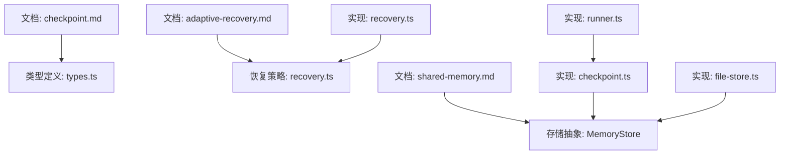
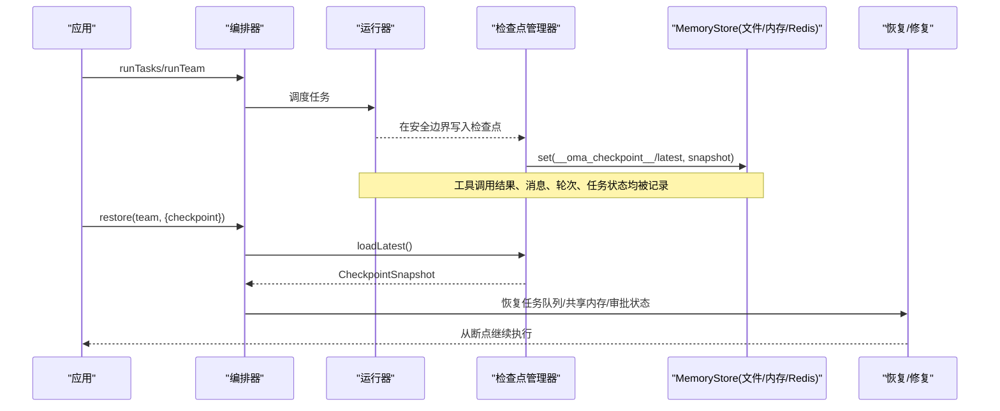
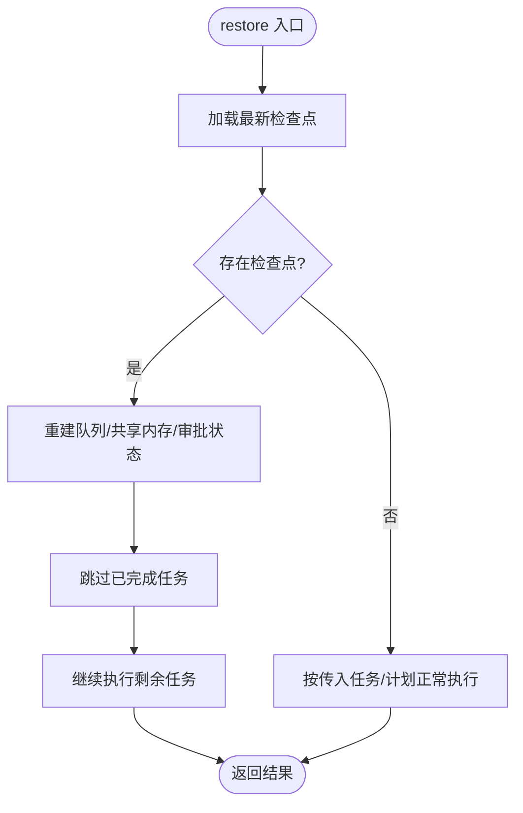
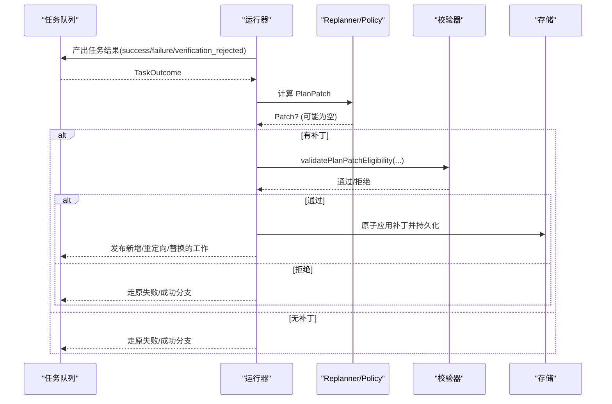
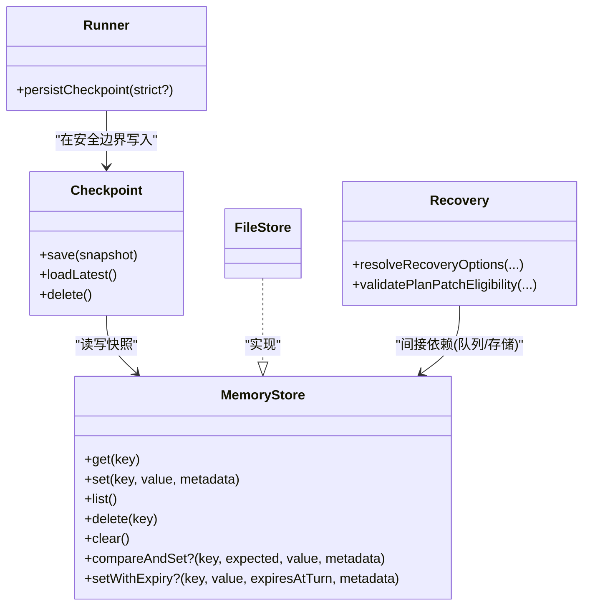

# 检查点恢复

<cite>
**本文引用的文件**
- [checkpoint.md](file://docs/checkpoint.md)
- [adaptive-recovery.md](file://docs/adaptive-recovery.md)
- [shared-memory.md](file://docs/shared-memory.md)
- [checkpoint.ts](file://packages/core/src/memory/checkpoint.ts)
- [recovery.ts](file://packages/core/src/orchestrator/recovery.ts)
- [file-store.ts](file://packages/core/src/memory/file-store.ts)
- [types.ts](file://packages/core/src/types.ts)
- [runner.ts](file://packages/core/src/agent/runner.ts)
</cite>

## 目录
1. [简介](#简介)
2. [项目结构](#项目结构)
3. [核心组件](#核心组件)
4. [架构总览](#架构总览)
5. [详细组件分析](#详细组件分析)
6. [依赖关系分析](#依赖关系分析)
7. [性能考量](#性能考量)
8. [故障恢复指南](#故障恢复指南)
9. [结论](#结论)
10. [附录](#附录)

## 简介
本文件系统性介绍 Open Multi-Agent（OMA）的检查点与恢复机制，覆盖以下内容：
- 检查点的创建时机与保存内容：任务状态、共享内存、工具调用结果、审批续接状态等。
- 恢复流程原理：断点续跑、计划修复、数据一致性保证。
- 存储后端支持：内存存储、文件存储、可插拔的持久化 MemoryStore（如 Redis、Postgres）。
- 版本管理与迁移策略：向后兼容的快照版本族与读取路径。
- 配置最佳实践：存储位置选择、备份策略、性能优化。
- 故障恢复案例：进程崩溃、网络中断等异常处理。
- 使用示例指引：通过代码片段路径演示如何构建高可用多智能体应用。

## 项目结构
与检查点和恢复相关的文档与实现主要分布在以下位置：
- 文档层：docs/checkpoint.md、docs/adaptive-recovery.md、docs/shared-memory.md
- 核心类型与接口：packages/core/src/types.ts
- 检查点持久化：packages/core/src/memory/checkpoint.ts
- 恢复与自适应修复：packages/core/src/orchestrator/recovery.ts
- 文件型持久化存储：packages/core/src/memory/file-store.ts
- 运行器中的检查点写入边界：packages/core/src/agent/runner.ts

图表来源
- [checkpoint.md:1-290](file://docs/checkpoint.md#L1-L290)
- [adaptive-recovery.md:1-132](file://docs/adaptive-recovery.md#L1-L132)
- [shared-memory.md:1-47](file://docs/shared-memory.md#L1-L47)
- [types.ts:2349-2593](file://packages/core/src/types.ts#L2349-L2593)
- [checkpoint.ts:1-315](file://packages/core/src/memory/checkpoint.ts#L1-L315)
- [recovery.ts:1-207](file://packages/core/src/orchestrator/recovery.ts#L1-L207)
- [file-store.ts:1-249](file://packages/core/src/memory/file-store.ts#L1-L249)
- [runner.ts:1020-1076](file://packages/core/src/agent/runner.ts#L1020-L1076)

章节来源
- [checkpoint.md:1-290](file://docs/checkpoint.md#L1-L290)
- [adaptive-recovery.md:1-132](file://docs/adaptive-recovery.md#L1-L132)
- [shared-memory.md:1-47](file://docs/shared-memory.md#L1-L47)

## 核心组件
- 检查点管理器 Checkpoint：负责在受控键空间下读写最新检查点快照，校验并维护版本兼容性。
- 存储抽象 MemoryStore：统一键值存储接口，支持内存、文件、Redis、Postgres 等后端。
- 文件存储 FileStore：零依赖的文件级原子写入，适合做检查点或共享内存的持久化后端。
- 恢复与自适应修复 Recovery：提供运行时计划修复能力，允许在任务成功/失败/验证拒绝后动态修补后续计划。
- 运行器 Runner：在安全边界处写入检查点，确保工具调用、消息、轮次计数等一致地落盘。

章节来源
- [checkpoint.ts:1-315](file://packages/core/src/memory/checkpoint.ts#L1-L315)
- [types.ts:2823-2872](file://packages/core/src/types.ts#L2823-L2872)
- [file-store.ts:1-249](file://packages/core/src/memory/file-store.ts#L1-L249)
- [recovery.ts:1-207](file://packages/core/src/orchestrator/recovery.ts#L1-L207)
- [runner.ts:1020-1076](file://packages/core/src/agent/runner.ts#L1020-L1076)

## 架构总览
检查点与恢复的整体交互如下：
- 执行过程中，运行器在“安全边界”（模型对话提交、工具调用完成、任务完成）触发检查点写入。
- 检查点以 JSON 形式写入到 MemoryStore 的保留命名空间下；默认复用团队的共享内存存储，也可指定独立持久化存储。
- 恢复时加载最新检查点，重建任务队列与共享内存，跳过已完成任务，继续执行未完成部分；对 runTeam 恢复会尝试重新合成协调结果。
- 若启用自适应修复，可在任务结果屏障处提出 PlanPatch，经策略与校验后原子更新图并持久化，再发布新工作。

图表来源
- [checkpoint.md:1-290](file://docs/checkpoint.md#L1-L290)
- [checkpoint.ts:1-315](file://packages/core/src/memory/checkpoint.ts#L1-L315)
- [file-store.ts:1-249](file://packages/core/src/memory/file-store.ts#L1-L249)
- [recovery.ts:1-207](file://packages/core/src/orchestrator/recovery.ts#L1-L207)
- [runner.ts:1020-1076](file://packages/core/src/agent/runner.ts#L1020-L1076)

## 详细组件分析

### 检查点保存内容与时机
- 保存时机
  - 在内置 LLM 运行器的“安全边界”：助手消息与请求的工具调用先保存；每个工具结果单独提交；全部提交后再保存下一轮消息。
  - 每个任务完成后保存一次最新快照。
- 保存内容（v4 快照）
  - 执行身份：runId、attempt、lastTraceId、lastRootSpanId。
  - 任务队列状态：pending/in-progress/completed/failed/blocked/skipped。
  - 共享内存：turnCount 始终记录；当检查点存储与团队共享内存存储不同时，嵌入完整 entries 快照；否则直接复用共享内存中的数据。
  - 已完成任务结果：taskId、assignee、raw result、AgentRunResult（结构化、归一化状态/错误、token 用量、工具调用、消息）。
  - 进行中的运行器状态：模型对话、消息、已完成轮次、token 用量、工具调用记录、下一阶段、待处理工具调用。
  - 审批续接状态：待处理的审批请求与已消费的决策，分别存储在保留命名空间下并在恢复时校验。
  - 任务交接/溯源配置：dependencyPayload、role、metadata 保留于队列快照中。
- 键空间与命名约定
  - 检查点键：__oma_checkpoint__/latest 或 __oma_checkpoint__/<runId>/latest。
  - 审批键：__oma_approval__/...。
  - 这些保留键由快照/恢复逻辑刻意跳过，避免冲突。

章节来源
- [checkpoint.md:109-160](file://docs/checkpoint.md#L109-L160)
- [checkpoint.md:206-249](file://docs/checkpoint.md#L206-L249)
- [checkpoint.ts:57-92](file://packages/core/src/memory/checkpoint.ts#L57-L92)
- [types.ts:2532-2593](file://packages/core/src/types.ts#L2532-L2593)
- [runner.ts:1020-1076](file://packages/core/src/agent/runner.ts#L1020-L1076)

### 恢复流程与一致性保证
- 恢复入口
  - restore(team, tasks/plan, {checkpoint})：若无检查点则退化为正常执行；若有则加载并继续。
  - runTeam 恢复会尝试重新运行协调器综合，需要再次提供协调器配置（因为适配器不可持久化）。
- 断点续跑
  - 重建任务队列与共享内存，跳过已完成任务。
  - 对于内置 LLM 运行器，恢复时会重放已提交的工具结果，未提交的结果保守重试；并行工具调用相互独立。
  - 轮次计数与 token 用量延续，不会从零开始。
- 数据一致性
  - 普通检查点写入为“尽力而为”，失败通过 onProgress 上报，不影响运行；但“挂起审批”的保存是严格模式，失败关闭。
  - 工具调用具备幂等性建议：外部副作用应基于 toolCallId 实现幂等，以避免重复执行风险。
  - 恢复不滚动回共享内存的中间写；跨进程恢复顺序串行，避免并发写冲突。

图表来源
- [checkpoint.md:74-107](file://docs/checkpoint.md#L74-L107)
- [checkpoint.md:154-160](file://docs/checkpoint.md#L154-L160)
- [checkpoint.md:206-249](file://docs/checkpoint.md#L206-L249)

章节来源
- [checkpoint.md:74-107](file://docs/checkpoint.md#L74-L107)
- [checkpoint.md:154-160](file://docs/checkpoint.md#L154-L160)
- [checkpoint.md:206-249](file://docs/checkpoint.md#L206-L249)

### 存储后端与持久化方案
- 内存存储 InMemoryStore
  - 进程内 Map，简单快速；进程退出即丢失，不适合跨重启持久化。
- 文件存储 FileStore
  - 单 JSON 文件 + 内存镜像；每次变更原子写入（临时文件 → fsync → rename），断电保护。
  - 推荐作为检查点存储；若用作共享内存存储，则每次写入都会刷新整个文件。
  - 单进程范围，无跨进程锁；恢复场景天然串行。
- 自定义 MemoryStore（Redis、Postgres 等）
  - 通过实现 get/set/list/delete/clear 以及可选 compareAndSet/setWithExpiry 接入。
  - 比较设置用于可挂起的审批决策原子性；不支持则挂起审批失败关闭。
  - 注意 TTL 语义：未实现 setWithExpiry 将失去过期能力。

章节来源
- [shared-memory.md:1-47](file://docs/shared-memory.md#L1-L47)
- [file-store.ts:1-249](file://packages/core/src/memory/file-store.ts#L1-L249)
- [types.ts:2823-2872](file://packages/core/src/types.ts#L2823-L2872)

### 版本管理与迁移策略
- 快照版本族
  - v1：基础快照，可选顶层 runId。
  - v2：引入 identity-aware（runId、attempt、trace/root span）。
  - v3：增加进行中任务恢复（inFlightTasks）。
  - v4：当前版本，增加可挂起审批的续接状态（pendingApprovals、approvalDecisions）。
- 读取兼容
  - 新版本可读取旧版本；旧版本缺失的能力（如 mid-task 恢复、审批续接）会在恢复时降级处理。
  - v1 无 runId 的快照会分配新的逻辑 runId；冲突时抛出验证错误，防止混入无关运行。
- 队列版本
  - 队列快照支持 v1（固定 DAG）与 v2（含 planRevision 与修订历史）。

章节来源
- [checkpoint.md:145-152](file://docs/checkpoint.md#L145-L152)
- [types.ts:2550-2593](file://packages/core/src/types.ts#L2550-L2593)

### 自适应恢复（计划修复）
- 模式
  - fixed（默认）：固定 DAG，不允许运行时修改。
  - repairable：在任务结果屏障处，Replanner 或 onTaskOutcome 可提议 PlanPatch，经策略与校验后原子应用，再发布新工作。
- 补丁操作
  - addTasks：追加任务，依赖可指向补丁内 key 或现有任务 ID。
  - retargetPending：将 pending/blocked 任务转派给新代理（需通过资格检查）。
  - supersedePending：标记 pending/blocked 任务为 skipped，并用新任务替代。
- 限制与一致性
  - runFromPlan 精确回放，禁止修复模式。
  - 与旧版 round-based onApproval 不兼容，应使用 onTaskDispatch/onPlanPatch。
  - 接受修订会被持久化到队列快照 v2；若保存失败则回滚并发布原失败路径。
  - 恢复会重置中断任务，保留修订历史，避免重复追加相同触发与结果的修订。

图表来源
- [adaptive-recovery.md:1-132](file://docs/adaptive-recovery.md#L1-L132)
- [recovery.ts:1-207](file://packages/core/src/orchestrator/recovery.ts#L1-L207)

章节来源
- [adaptive-recovery.md:1-132](file://docs/adaptive-recovery.md#L1-L132)
- [recovery.ts:1-207](file://packages/core/src/orchestrator/recovery.ts#L1-L207)

### 敏感信息脱敏
- 检查点与共享内存默认原样持久化，可能包含密钥。
- 可通过 RedactingStore 包装任意 MemoryStore（包括 FileStore），在写入时脱敏。
- 注意：可挂起审批要求哈希绑定原文，因此不建议对审批存储启用脱敏。

章节来源
- [checkpoint.md:172-204](file://docs/checkpoint.md#L172-L204)
- [shared-memory.md:29-47](file://docs/shared-memory.md#L29-L47)

## 依赖关系分析
- 检查点模块依赖 MemoryStore 抽象，从而解耦具体后端。
- 文件存储实现仅依赖 Node 内置文件系统 API，无额外运行时依赖。
- 恢复与修复模块依赖队列与代理选择器，确保补丁合法且可调度。
- 运行器在关键路径上调用检查点持久化，保证一致性边界。

图表来源
- [checkpoint.ts:1-315](file://packages/core/src/memory/checkpoint.ts#L1-L315)
- [file-store.ts:1-249](file://packages/core/src/memory/file-store.ts#L1-L249)
- [recovery.ts:1-207](file://packages/core/src/orchestrator/recovery.ts#L1-L207)
- [runner.ts:1020-1076](file://packages/core/src/agent/runner.ts#L1020-L1076)

章节来源
- [checkpoint.ts:1-315](file://packages/core/src/memory/checkpoint.ts#L1-L315)
- [file-store.ts:1-249](file://packages/core/src/memory/file-store.ts#L1-L249)
- [recovery.ts:1-207](file://packages/core/src/orchestrator/recovery.ts#L1-L207)
- [runner.ts:1020-1076](file://packages/core/src/agent/runner.ts#L1020-L1076)

## 性能考量
- 检查点写入频率
  - 仅在安全边界与任务完成时写入，避免频繁 IO。
  - 若共享内存与检查点存储分离，可减少高频写入带来的开销。
- 文件存储原子性
  - 使用临时文件 + fsync + rename，避免半写文件；但大文件写入仍有成本。
- 共享内存优化
  - 当检查点存储与共享内存相同时，不重复嵌入 entries，减少冗余写入。
- 批处理与限流
  - 在高吞吐场景，建议将共享内存留在内存存储，检查点使用文件存储；必要时结合外部数据库实现 MemoryStore。
- 脱敏成本
  - RedactingStore 在写入路径进行匹配与替换，会带来额外 CPU 开销，按需启用。

[本节为通用指导，不直接分析具体文件]

## 故障恢复指南
- 进程崩溃
  - 重启后调用 restore(team, {checkpoint})，系统会从最近检查点恢复，跳过已完成任务，继续执行。
  - 若为 runTeam 恢复，需提供与原 runTeam 相同的协调器配置以重新合成最终答案。
- 网络中断
  - 工具调用结果以每调用为单位提交；恢复时重放已提交结果，未提交结果保守重试。
  - 对外部副作用建议使用 toolCallId 作为幂等键，避免重复执行造成不一致。
- 存储后端故障
  - 普通检查点写入失败会通过 onProgress 上报，运行继续；下次安全边界重试。
  - 可挂起审批的保存为严格模式，失败关闭，确保不会出现“可恢复但未持久化”的不一致状态。
- 计划修复失败
  - 若补丁保存失败，回滚并发布原失败路径；恢复时保留修订历史，避免重复追加。

章节来源
- [checkpoint.md:74-107](file://docs/checkpoint.md#L74-L107)
- [checkpoint.md:154-160](file://docs/checkpoint.md#L154-L160)
- [checkpoint.md:206-249](file://docs/checkpoint.md#L206-L249)
- [adaptive-recovery.md:100-132](file://docs/adaptive-recovery.md#L100-L132)

## 结论
Open Multi-Agent 的检查点与恢复机制通过“安全边界 + 原子持久化 + 版本兼容”的组合，提供了面向长时运行的可靠保障。其设计强调：
- 最小侵入：基于 MemoryStore 抽象，灵活适配多种后端。
- 强一致性：审批与工具调用结果逐条提交，恢复时重放与保守重试并重。
- 可扩展：支持运行时计划修复，提升复杂任务的韧性。
- 可运维：提供脱敏、版本管理、键空间隔离等工程化能力。

[本节为总结，不直接分析具体文件]

## 附录

### 配置最佳实践
- 存储位置选择
  - 检查点：优先使用 FileStore 指向稳定磁盘路径（如 .oma/checkpoint.json）。
  - 共享内存：热路径使用 InMemoryStore；如需跨进程或基础设施后端，实现 MemoryStore（Redis/Postgres）。
- 备份策略
  - 定期备份检查点文件；若使用数据库后端，按数据库策略备份。
  - 对包含敏感数据的存储，使用 RedactingStore 包裹。
- 性能优化
  - 分离共享内存与检查点存储，降低高频写入对检查点的影响。
  - 合理设置 checkpoint.enabled 与 per-call 选项，避免不必要的持久化。
  - 对高并发场景，评估 FileStore 的 I/O 成本，必要时采用数据库后端。

章节来源
- [checkpoint.md:49-73](file://docs/checkpoint.md#L49-L73)
- [shared-memory.md:1-47](file://docs/shared-memory.md#L1-L47)
- [checkpoint.md:172-204](file://docs/checkpoint.md#L172-L204)

### 使用示例指引（代码片段路径）
- 启用检查点并指定文件存储
  - 参考路径：[checkpoint.md:15-36](file://docs/checkpoint.md#L15-L36)、[checkpoint.md:53-68](file://docs/checkpoint.md#L53-L68)
- 恢复执行
  - 参考路径：[checkpoint.md:74-107](file://docs/checkpoint.md#L74-L107)
- 脱敏存储
  - 参考路径：[checkpoint.md:172-204](file://docs/checkpoint.md#L172-L204)、[shared-memory.md:29-47](file://docs/shared-memory.md#L29-L47)
- 自适应修复配置
  - 参考路径：[adaptive-recovery.md:23-75](file://docs/adaptive-recovery.md#L23-L75)

章节来源
- [checkpoint.md:15-107](file://docs/checkpoint.md#L15-L107)
- [adaptive-recovery.md:23-75](file://docs/adaptive-recovery.md#L23-L75)
- [shared-memory.md:29-47](file://docs/shared-memory.md#L29-L47)