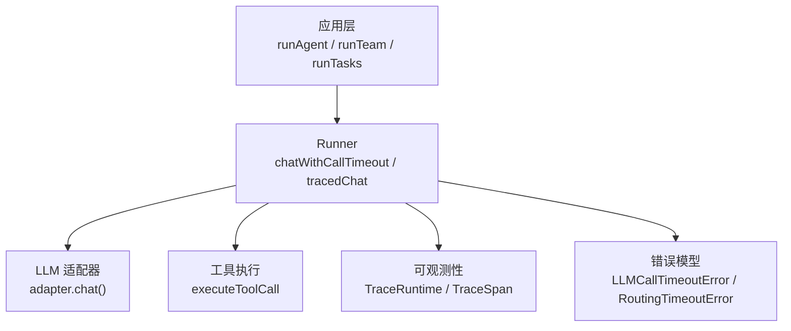
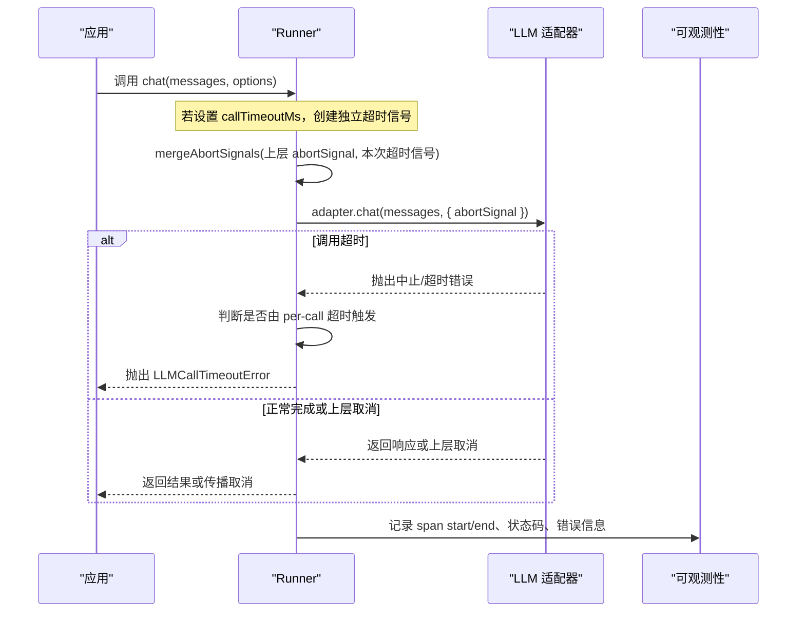
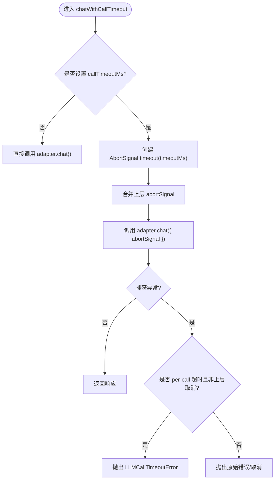
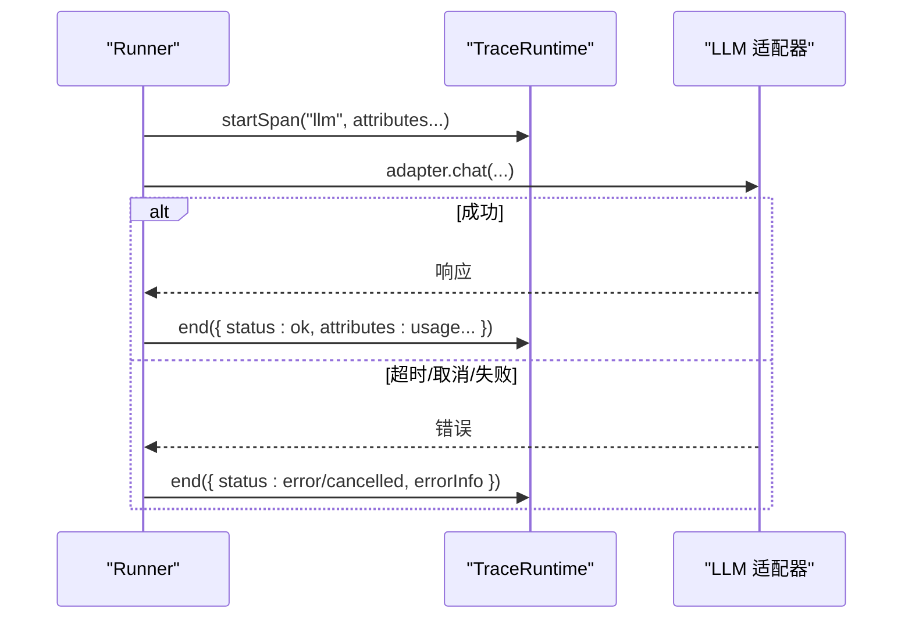
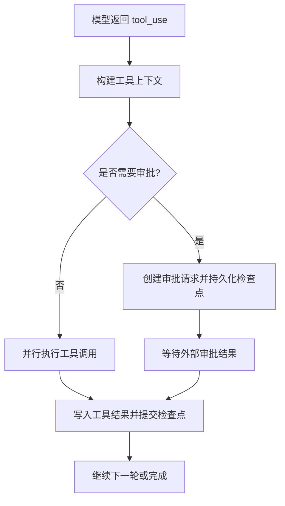
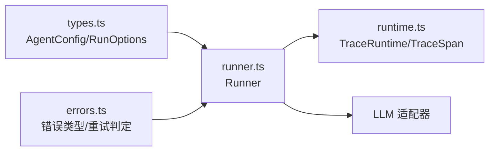

# 超时控制

<cite>
**本文引用的文件**
- [types.ts](file://packages/core/src/types.ts)
- [runner.ts](file://packages/core/src/agent/runner.ts)
- [errors.ts](file://packages/core/src/errors.ts)
- [runtime.ts](file://packages/core/src/observability/runtime.ts)
</cite>

## 目录
1. [简介](#简介)
2. [项目结构](#项目结构)
3. [核心组件](#核心组件)
4. [架构总览](#架构总览)
5. [详细组件分析](#详细组件分析)
6. [依赖关系分析](#依赖关系分析)
7. [性能考量](#性能考量)
8. [故障排查指南](#故障排查指南)
9. [结论](#结论)
10. [附录：实战配置与优化建议](#附录：实战配置与优化建议)

## 简介
本文件系统性介绍 Open Multi-Agent（OMA）的超时控制机制，覆盖请求级、调用级与运行级三层超时；解释长时间运行保护（任务级、智能体级、全局）的实现原理；说明资源清理策略；提供不同场景下的超时配置建议；并给出错误恢复策略与监控指标收集方法。通过具体示例展示如何配置和优化以提升系统稳定性。

## 项目结构
与超时控制直接相关的代码主要位于 core 包的以下位置：
- 类型与配置定义：AgentConfig、CoordinatorConfig、RunOptions 等包含 timeoutMs、callTimeoutMs、abortSignal 等字段
- 执行器：Runner 实现 per-call 超时、合并 AbortSignal、异常分类与追踪埋点
- 错误模型：LLMCallTimeoutError、RoutingTimeoutError 等用于区分超时来源
- 可观测性：TraceRuntime/TraceSpan 记录 LLM 调用耗时、状态码、错误信息，便于监控与告警

图表来源
- [runner.ts:561-582](file://packages/core/src/agent/runner.ts#L561-L582)
- [runner.ts:584-681](file://packages/core/src/agent/runner.ts#L584-L681)
- [errors.ts:56-94](file://packages/core/src/errors.ts#L56-L94)
- [runtime.ts:80-180](file://packages/core/src/observability/runtime.ts#L80-L180)

章节来源
- [types.ts:1084-1105](file://packages/core/src/types.ts#L1084-L1105)
- [runner.ts:561-681](file://packages/core/src/agent/runner.ts#L561-L681)
- [errors.ts:56-94](file://packages/core/src/errors.ts#L56-L94)
- [runtime.ts:80-180](file://packages/core/src/observability/runtime.ts#L80-L180)

## 核心组件
- AgentConfig.timeoutMs：整个智能体运行的最大墙钟时间，触发后通过 AbortSignal 中止运行
- AgentConfig.callTimeoutMs：单次 LLM 调用（一次 adapter.chat()）的最大墙钟时间，为每次调用新建独立的超时信号，并与运行级 abortSignal 组合，先触发者生效
- Runner.chatWithCallTimeout：封装 per-call 超时逻辑，将 AbortSignal.timeout 与上层传入的 abortSignal 合并，并在超时时抛出 LLMCallTimeoutError
- Runner.tracedChat：在可观测性路径下对 LLM 调用进行 span 标注，识别超时与取消原因，上报状态与错误信息
- errors.ts：定义 LLMCallTimeoutError、RoutingTimeoutError 等，并提供 isRetryableError 帮助重试策略决策
- observability/runtime.ts：TraceRuntime/TraceSpan 统一记录开始/结束时间、状态码、错误信息，支撑监控与排障

章节来源
- [types.ts:1084-1105](file://packages/core/src/types.ts#L1084-L1105)
- [runner.ts:561-681](file://packages/core/src/agent/runner.ts#L561-L681)
- [errors.ts:56-94](file://packages/core/src/errors.ts#L56-L94)
- [runtime.ts:80-180](file://packages/core/src/observability/runtime.ts#L80-L180)

## 架构总览
下图展示了从应用层到 LLM 适配器的完整调用链，以及超时信号在各层的传播与处理。

图表来源
- [runner.ts:561-582](file://packages/core/src/agent/runner.ts#L561-L582)
- [runner.ts:584-681](file://packages/core/src/agent/runner.ts#L584-L681)
- [errors.ts:56-94](file://packages/core/src/errors.ts#L56-L94)
- [runtime.ts:80-180](file://packages/core/src/observability/runtime.ts#L80-L180)

## 详细组件分析

### 运行时与调用时超时（Agent 级与 LLM 调用级）
- 运行级超时（AgentConfig.timeoutMs）：为整次运行设置上限，通过 AbortSignal 中断循环与未完成的适配器调用
- 调用级超时（AgentConfig.callTimeoutMs）：为每次 adapter.chat() 设置上限，内部使用 AbortSignal.timeout 并合并上层 abortSignal，确保“谁先到期谁生效”
- 异常区分：当且仅当 per-call 超时信号触发且非上层主动取消时，抛出 LLMCallTimeoutError；否则透传原始错误或取消语义

图表来源
- [runner.ts:561-582](file://packages/core/src/agent/runner.ts#L561-L582)

章节来源
- [types.ts:1084-1105](file://packages/core/src/types.ts#L1084-L1105)
- [runner.ts:561-582](file://packages/core/src/agent/runner.ts#L561-L582)
- [errors.ts:56-94](file://packages/core/src/errors.ts#L56-L94)

### 可观测性与错误分类
- tracedChat 在 LLM 调用前后记录 span，标注 agent、model、phase、turn、usage 等属性
- 根据 abortSignal.reason 与 name 区分“超时”和“取消”，并映射为统一的 RunStatus 与错误信息
- 支持 legacy onTrace 回调与新 TraceSink 双通道输出，保证兼容性与可扩展性

图表来源
- [runner.ts:584-681](file://packages/core/src/agent/runner.ts#L584-L681)
- [runtime.ts:80-180](file://packages/core/src/observability/runtime.ts#L80-L180)

章节来源
- [runner.ts:584-681](file://packages/core/src/agent/runner.ts#L584-L681)
- [runtime.ts:80-180](file://packages/core/src/observability/runtime.ts#L80-L180)

### 工具执行与长时间运行保护
- 工具执行阶段会持久化检查点，避免恢复时重复执行副作用
- 对于需要审批的工具调用，会在提交前持久化审批请求，确保可恢复
- 循环检测可在达到 maxTurns 之前提前发现卡死模式，配合 onLoopDetected 策略注入提示或直接终止

图表来源
- [runner.ts:990-1069](file://packages/core/src/agent/runner.ts#L990-L1069)
- [runner.ts:1364-1546](file://packages/core/src/agent/runner.ts#L1364-L1546)

章节来源
- [runner.ts:990-1069](file://packages/core/src/agent/runner.ts#L990-L1069)
- [runner.ts:1364-1546](file://packages/core/src/agent/runner.ts#L1364-L1546)

### 路由与协调器超时
- 路由阶段存在 RoutingTimeoutError，用于标识路由或画像生成阶段的超时
- CoordinatorConfig 同样支持 timeoutMs 与 callTimeoutMs，约束协调器整体运行与单次 LLM 调用

章节来源
- [errors.ts:83-94](file://packages/core/src/errors.ts#L83-L94)
- [types.ts:2660-2665](file://packages/core/src/types.ts#L2660-L2665)

## 依赖关系分析
- Runner 依赖 AgentConfig/RunOptions 中的超时配置，并通过 AbortSignal 与适配器交互
- errors.ts 提供统一的错误类型与可重试判定，供上层重试策略使用
- observability/runtime.ts 提供可观测性基础设施，贯穿 LLM 调用与工具执行

图表来源
- [types.ts:1084-1105](file://packages/core/src/types.ts#L1084-L1105)
- [runner.ts:561-681](file://packages/core/src/agent/runner.ts#L561-L681)
- [errors.ts:56-94](file://packages/core/src/errors.ts#L56-L94)
- [runtime.ts:80-180](file://packages/core/src/observability/runtime.ts#L80-L180)

章节来源
- [types.ts:1084-1105](file://packages/core/src/types.ts#L1084-L1105)
- [runner.ts:561-681](file://packages/core/src/agent/runner.ts#L561-L681)
- [errors.ts:56-94](file://packages/core/src/errors.ts#L56-L94)
- [runtime.ts:80-180](file://packages/core/src/observability/runtime.ts#L80-L180)

## 性能考量
- 合理设置 callTimeoutMs：本地模型或大推理输出场景应放宽，避免误杀；云端稳定模型可适当收紧以快速失败
- 结合 maxTokens、contextStrategy 与 compressToolResults 控制上下文增长，减少长尾延迟
- 利用可观测性指标（span 时长、usage、status）定位慢调用与瓶颈
- 工具执行并发度与审批流程会影响整体吞吐，需结合业务 SLA 调整

[本节为通用指导，不直接分析具体文件]

## 故障排查指南
- 识别超时类型
  - LLMCallTimeoutError：per-call 超时，通常来自适配器 SDK 的中止或网络/服务侧长时间无响应
  - RoutingTimeoutError：路由或画像阶段超时
  - 取消（AbortError/APIUserAbortError）：由上层 abortSignal 主动取消
- 重试策略
  - 使用 isRetryableError 判定：LLMCallTimeoutError、RoutingTimeoutError、408/409/429 及 5xx 视为可重试；4xx（除上述）与明确的用户取消不可重试
- 监控与诊断
  - 通过 TraceRuntime 记录的 span 开始/结束时间、状态码、错误信息，结合 onTrace 回调或 sink 导出至监控系统
  - 关注 llm_call 与 tool_call 事件，统计平均/最大耗时与失败率

章节来源
- [errors.ts:56-94](file://packages/core/src/errors.ts#L56-L94)
- [errors.ts:182-239](file://packages/core/src/errors.ts#L182-L239)
- [runtime.ts:80-180](file://packages/core/src/observability/runtime.ts#L80-L180)

## 结论
OMA 通过“运行级 + 调用级 + 工具/路由级”的多层超时体系，结合 AbortSignal 的组合与严格的异常分类，实现了可控、可观测、可恢复的长时间运行保护。配合可观测性基础设施与重试策略，能够在复杂多代理协作中显著提升稳定性与可运维性。

[本节为总结，不直接分析具体文件]

## 附录：实战配置与优化建议

- 配置要点
  - 运行级超时：在 AgentConfig 中设置 timeoutMs，作为整次运行的安全网
  - 调用级超时：在 AgentConfig 中设置 callTimeoutMs，为每次 LLM 调用设置上限，避免个别慢调用拖垮整体
  - 每运行取消：在 RunOptions.abortSignal 中传入 per-run 取消信号，与 callTimeoutMs 组合，先触发者生效
  - 工具与路由：必要时为路由/协调器也设置 timeoutMs 与 callTimeoutMs，防止编排阶段阻塞

- 场景建议
  - 云端稳定模型：callTimeoutMs 可设为数秒至十余秒；timeoutMs 根据任务复杂度设定
  - 本地/慢模型：适当放宽 callTimeoutMs，避免误杀；同时配合压缩工具结果与上下文策略
  - 高并发批处理：缩短超时阈值，快速失败并重试，提升整体吞吐

- 错误恢复
  - 对可重试错误实施指数退避重试，限制最大重试次数
  - 对不可重试错误（如参数错误、用户取消）立即终止并上报
  - 结合检查点与审批流程，确保恢复后不会重复执行副作用

- 监控指标
  - 采集 llm_call/tool_call/task 事件的 durationMs、status、error 信息
  - 统计各模型/工具的 P50/P95/P99 耗时与失败率，定位瓶颈
  - 将超时事件与业务指标关联，建立告警规则

章节来源
- [types.ts:1084-1105](file://packages/core/src/types.ts#L1084-L1105)
- [runner.ts:561-681](file://packages/core/src/agent/runner.ts#L561-L681)
- [errors.ts:56-94](file://packages/core/src/errors.ts#L56-L94)
- [runtime.ts:80-180](file://packages/core/src/observability/runtime.ts#L80-L180)