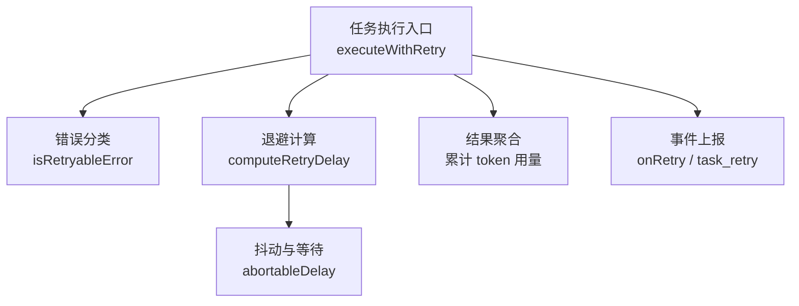
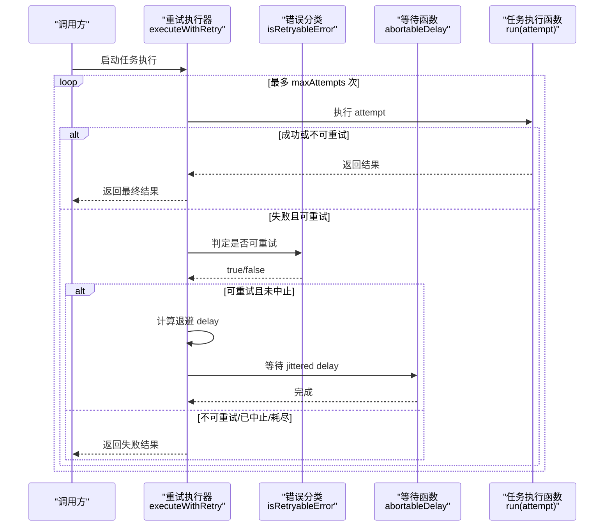
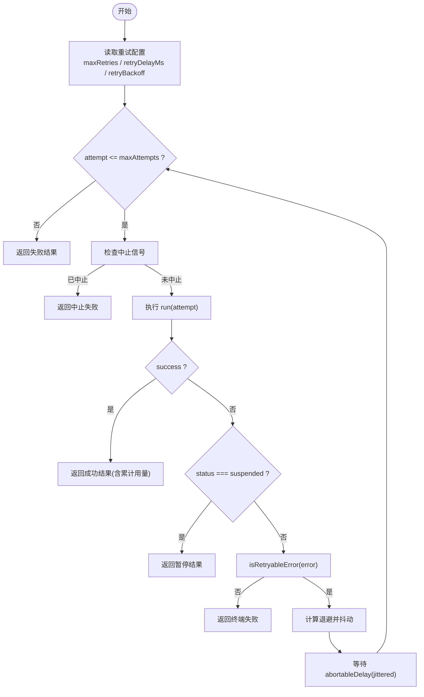
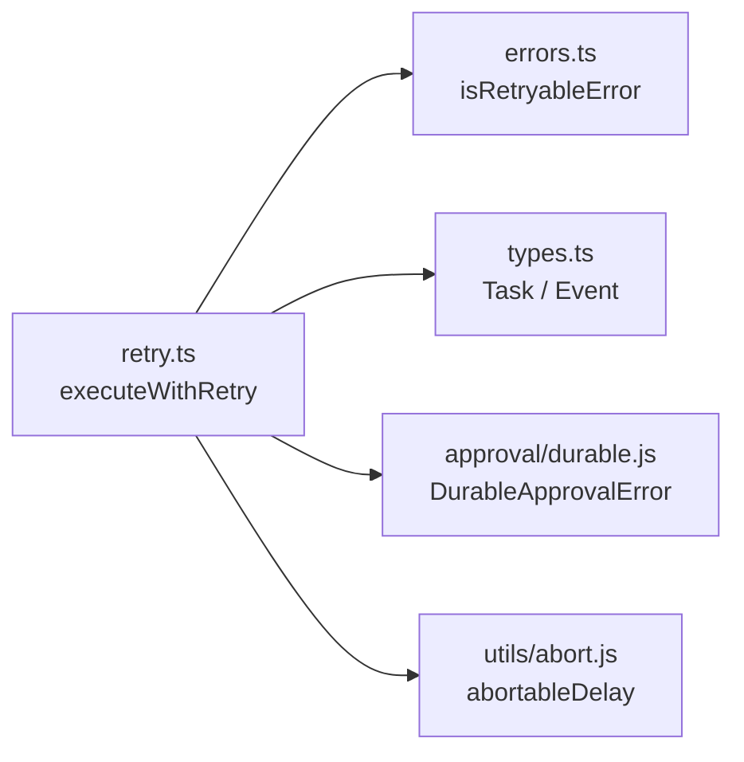

# 重试机制

<cite>
**本文引用的文件**
- [packages/core/src/orchestrator/retry.ts](file://packages/core/src/orchestrator/retry.ts)
- [packages/core/src/errors.ts](file://packages/core/src/errors.ts)
- [packages/core/src/types.ts](file://packages/core/src/types.ts)
- [packages/core/examples/patterns/task-retry.ts](file://packages/core/examples/patterns/task-retry.ts)
- [packages/core/examples/cookbook/contract-review-dag.ts](file://packages/core/examples/cookbook/contract-review-dag.ts)
</cite>

## 目录
1. [简介](#简介)
2. [项目结构](#项目结构)
3. [核心组件](#核心组件)
4. [架构总览](#架构总览)
5. [详细组件分析](#详细组件分析)
6. [依赖关系分析](#依赖关系分析)
7. [性能考虑](#性能考虑)
8. [故障排查指南](#故障排查指南)
9. [结论](#结论)
10. [附录](#附录)

## 简介
本文件系统性介绍 Open Multi-Agent（OMA）中的任务级重试机制，包括：
- 重试策略与配置项：最大重试次数、基础重试间隔、指数退避与抖动、最大延迟上限。
- 错误分类与处理：可重试错误与终止错误的判定规则，覆盖网络超时、API 限流、模型调用超时、授权/校验失败等场景。
- 最佳实践：不同场景下的重试参数选择建议，以及生产环境调优要点。
- 降级与监控：重试失败的降级路径、事件上报与可观测性集成。
- 使用示例：通过示例代码展示如何配置和使用重试功能。

## 项目结构
重试机制的核心实现位于编排器模块中，围绕“错误感知 + 指数退避 + 抖动”的策略执行；错误分类由统一错误模块提供；类型定义暴露了任务配置字段与事件类型；示例展示了在真实任务图中的用法。

**图示来源**
- [packages/core/src/orchestrator/retry.ts:18-24](file://packages/core/src/orchestrator/retry.ts#L18-L24)
- [packages/core/src/orchestrator/retry.ts:46-139](file://packages/core/src/orchestrator/retry.ts#L46-L139)
- [packages/core/src/errors.ts:221-238](file://packages/core/src/errors.ts#L221-L238)

**章节来源**
- [packages/core/src/orchestrator/retry.ts:1-139](file://packages/core/src/orchestrator/retry.ts#L1-L139)
- [packages/core/src/errors.ts:1-239](file://packages/core/src/errors.ts#L1-L239)
- [packages/core/src/types.ts:2080-2129](file://packages/core/src/types.ts#L2080-L2129)

## 核心组件
- 重试执行器 executeWithRetry：封装重试循环、退避等待、中止信号处理、结果与用量聚合、可重试判定。
- 退避计算 computeRetryDelay：按 baseDelay × backoff^(attempt-1) 计算名义延迟，并限制最大延迟。
- 错误分类 isRetryableError：基于异常类型与 HTTP 状态码判断是否可重试。
- 任务配置字段 Task.maxRetries / retryDelayMs / retryBackoff：控制重试行为。
- 进度事件 OrchestratorEvent.task_retry：用于外部日志与监控。

**章节来源**
- [packages/core/src/orchestrator/retry.ts:18-24](file://packages/core/src/orchestrator/retry.ts#L18-L24)
- [packages/core/src/orchestrator/retry.ts:46-139](file://packages/core/src/orchestrator/retry.ts#L46-L139)
- [packages/core/src/errors.ts:221-238](file://packages/core/src/errors.ts#L221-L238)
- [packages/core/src/types.ts:2080-2129](file://packages/core/src/types.ts#L2080-L2129)

## 架构总览
下图展示了从任务执行到重试决策的完整流程，包括错误分类、退避计算、抖动等待、中止信号与结果聚合。

**图示来源**
- [packages/core/src/orchestrator/retry.ts:46-139](file://packages/core/src/orchestrator/retry.ts#L46-L139)
- [packages/core/src/errors.ts:221-238](file://packages/core/src/errors.ts#L221-L238)

## 详细组件分析

### 重试执行器 executeWithRetry
- 职责：驱动任务执行、累积 token 用量、处理中止信号、根据错误分类决定是否继续重试、触发 onRetry 回调。
- 关键行为：
  - 最大尝试次数 = max(0, maxRetries) + 1。
  - 默认基础延迟 1000ms，默认退倍率 2，最大延迟上限 30000ms。
  - 每次等待前对名义延迟进行均匀抖动，避免雪崩。
  - 遇到“可暂停”（suspended）或“持久化审批错误”时不重试，直接返回。
  - 非流式路径将结构化错误保留在 result.error 中供分类；流式路径在 catch 分支分类。
  - 累计所有尝试的 token 用量并在成功或最终失败时一并返回。

**图示来源**
- [packages/core/src/orchestrator/retry.ts:46-139](file://packages/core/src/orchestrator/retry.ts#L46-L139)

**章节来源**
- [packages/core/src/orchestrator/retry.ts:46-139](file://packages/core/src/orchestrator/retry.ts#L46-L139)

### 退避算法与抖动
- 名义延迟：baseDelay × backoff^(attempt-1)。
- 最大延迟上限：30000ms，防止指数增长失控。
- 抖动：在 [nominal/2, nominal] 范围内均匀随机，降低并发重试风暴风险。
- 可注入 delayFn（默认 abortableDelay），支持传入 AbortSignal 以响应取消。

**章节来源**
- [packages/core/src/orchestrator/retry.ts:18-24](file://packages/core/src/orchestrator/retry.ts#L18-L24)
- [packages/core/src/orchestrator/retry.ts:73-82](file://packages/core/src/orchestrator/retry.ts#L73-L82)

### 错误分类与处理
- 可重试错误：
  - 无状态码的网络抖动、请求超时（408）、冲突（409）、速率限制（429）。
  - 所有 5xx 服务端错误。
  - LLM 调用超时（LLMCallTimeoutError）与路由超时（RoutingTimeoutError）。
- 终止错误：
  - 预算超限（TokenBudgetExceededError、CostBudgetExceededError）。
  - 输入/消息格式错误（InvalidMessageError）。
  - 工具调用不支持（UnsupportedToolCallError、UnsupportedToolResultContentError）。
  - 路由声明要求（RoutingDeclarationRequiredError）、路由分析失败（RoutingProfilerFailedError）。
  - 用户主动取消（AbortError 或 APIUserAbortError）。
  - 其他 4xx 客户端错误（除 408/409/429）。
- 特殊处理：
  - 持久化审批错误（DurableApprovalError）直接抛出，不参与重试。
  - “暂停”（suspended）视为边界点，不进行重试。

**章节来源**
- [packages/core/src/errors.ts:221-238](file://packages/core/src/errors.ts#L221-L238)
- [packages/core/src/orchestrator/retry.ts:101-132](file://packages/core/src/orchestrator/retry.ts#L101-L132)

### 配置选项说明
- Task.maxRetries：最大重试次数（默认 0，即不重试）。
- Task.retryDelayMs：首次重试前的基础延迟毫秒数（默认 1000）。
- Task.retryBackoff：指数退倍增数（默认 2）。
- 最大延迟上限：固定为 30000ms。
- 事件：OrchestratorEvent.type 包含 'task_retry'，携带 attempt、maxAttempts、error、nextDelayMs 等信息。

**章节来源**
- [packages/core/src/types.ts:2080-2129](file://packages/core/src/types.ts#L2080-L2129)
- [packages/core/src/orchestrator/retry.ts:55-58](file://packages/core/src/orchestrator/retry.ts#L55-L58)

### 使用示例
- 示例一：任务级重试演示（patterns/task-retry.ts）
  - 展示在任务上设置 maxRetries、retryDelayMs、retryBackoff，并通过 onProgress 监听 task_retry 事件。
- 示例二：合同审查 DAG（cookbook/contract-review-dag.ts）
  - 在多个任务节点上启用重试，体现 DAG 中各步骤的重试策略。

**章节来源**
- [packages/core/examples/patterns/task-retry.ts:88-105](file://packages/core/examples/patterns/task-retry.ts#L88-L105)
- [packages/core/examples/cookbook/contract-review-dag.ts:280-308](file://packages/core/examples/cookbook/contract-review-dag.ts#L280-L308)

## 依赖关系分析
- 重试执行器依赖：
  - 错误分类：isRetryableError（errors.ts）。
  - 等待函数：abortableDelay（utils/abort.js，作为默认实现）。
  - 类型定义：Task、AgentRunResult、OrchestratorEvent（types.ts）。
  - 持久化审批：DurableApprovalError（approval/durable.js）。
- 耦合与内聚：
  - 重试逻辑与错误分类解耦，便于扩展新的错误类型。
  - 退避计算独立，便于替换或测试。
  - 事件上报通过回调与事件类型解耦，利于可观测性接入。

**图示来源**
- [packages/core/src/orchestrator/retry.ts:1-139](file://packages/core/src/orchestrator/retry.ts#L1-L139)
- [packages/core/src/errors.ts:221-238](file://packages/core/src/errors.ts#L221-L238)
- [packages/core/src/types.ts:2080-2129](file://packages/core/src/types.ts#L2080-L2129)

**章节来源**
- [packages/core/src/orchestrator/retry.ts:1-139](file://packages/core/src/orchestrator/retry.ts#L1-L139)
- [packages/core/src/errors.ts:221-238](file://packages/core/src/errors.ts#L221-L238)
- [packages/core/src/types.ts:2080-2129](file://packages/core/src/types.ts#L2080-L2129)

## 性能考虑
- 退避上限：30000ms 防止极端情况下长时间阻塞。
- 抖动策略：降低多实例同时重试导致的拥塞。
- 中止信号：在等待期间响应取消，避免无效等待。
- 用量聚合：跨尝试累计 token 用量，便于成本统计与预算控制。
- 建议：
  - 对高并发场景适当增大基础延迟与退倍增数，结合业务 SLA 调整。
  - 对敏感链路（如计费接口）谨慎开启重试，避免放大负载。
  - 结合 onProgress 的 task_retry 事件做实时告警与限流。

[本节为通用指导，无需具体文件引用]

## 故障排查指南
- 常见现象与定位：
  - 频繁重试：检查是否为 429/5xx/网络抖动；确认基础延迟与退倍增数是否过小。
  - 永不重试：检查是否为终止错误（如 401/403/400、预算超限、取消）。
  - 长时间等待：检查是否达到最大延迟上限；确认抖动范围是否符合预期。
  - 中断后仍重试：确认是否在等待期间正确响应了中止信号。
- 诊断手段：
  - 订阅 OrchestratorEvent.task_retry，记录 attempt、nextDelayMs、error。
  - 查看 AgentRunResult.error 与 TokenUsage，评估失败原因与成本。
  - 结合 observability sink 与 trace 事件，关联 LLM 调用耗时与状态码。

**章节来源**
- [packages/core/src/types.ts:2111-2129](file://packages/core/src/types.ts#L2111-L2129)
- [packages/core/src/orchestrator/retry.ts:73-82](file://packages/core/src/orchestrator/retry.ts#L73-L82)
- [packages/core/src/errors.ts:221-238](file://packages/core/src/errors.ts#L221-L238)

## 结论
OMA 的重试机制以“错误感知 + 指数退避 + 抖动”为核心，提供了可控、可观测、可插拔的重试能力。通过合理的配置与监控，可在保证稳定性的同时兼顾吞吐与成本。生产环境中建议结合业务特征与供应商限制，精细化调参，并配合事件与追踪进行持续优化。

[本节为总结，无需具体文件引用]

## 附录

### 重试配置最佳实践
- 网络抖动/临时故障：
  - maxRetries: 2–3
  - retryDelayMs: 500–1000
  - retryBackoff: 2
- 速率限制（429）：
  - maxRetries: 2–4
  - retryDelayMs: 1000–2000
  - retryBackoff: 2–3
- 模型调用超时（LLMCallTimeoutError）：
  - 可重试，但需结合 callTimeoutMs 与整体 timeoutMs 合理设置，避免过长等待。
- 授权/校验失败（401/403/400）：
  - 不重试（终止错误），应快速失败并提示修复。
- 预算超限：
  - 不重试，应快速失败并触发降级或告警。

[本节为通用指导，无需具体文件引用]

### 生产环境调优要点
- 观察 task_retry 事件频率与 nextDelayMs，动态调整基础延迟与退倍增数。
- 结合 token 用量与成本估算，评估重试带来的额外成本。
- 对关键链路设置更严格的超时与重试上限，避免雪崩。
- 利用可观测性后端（trace/sink）建立告警阈值（如连续重试超过 N 次）。

[本节为通用指导，无需具体文件引用]