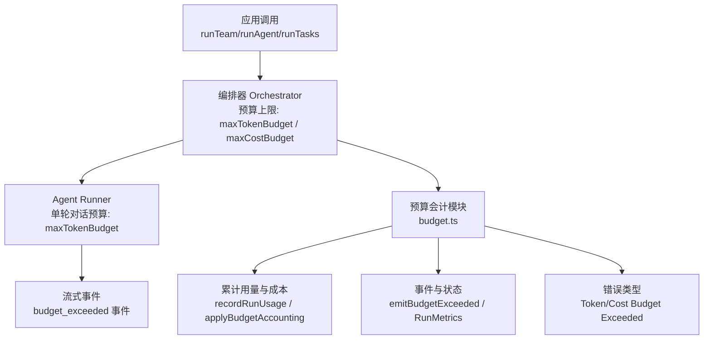
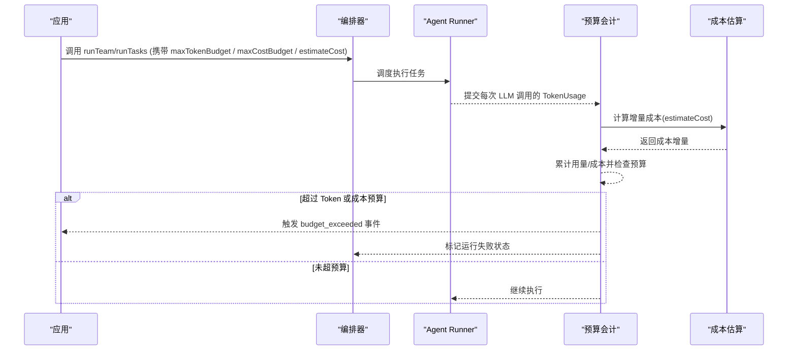
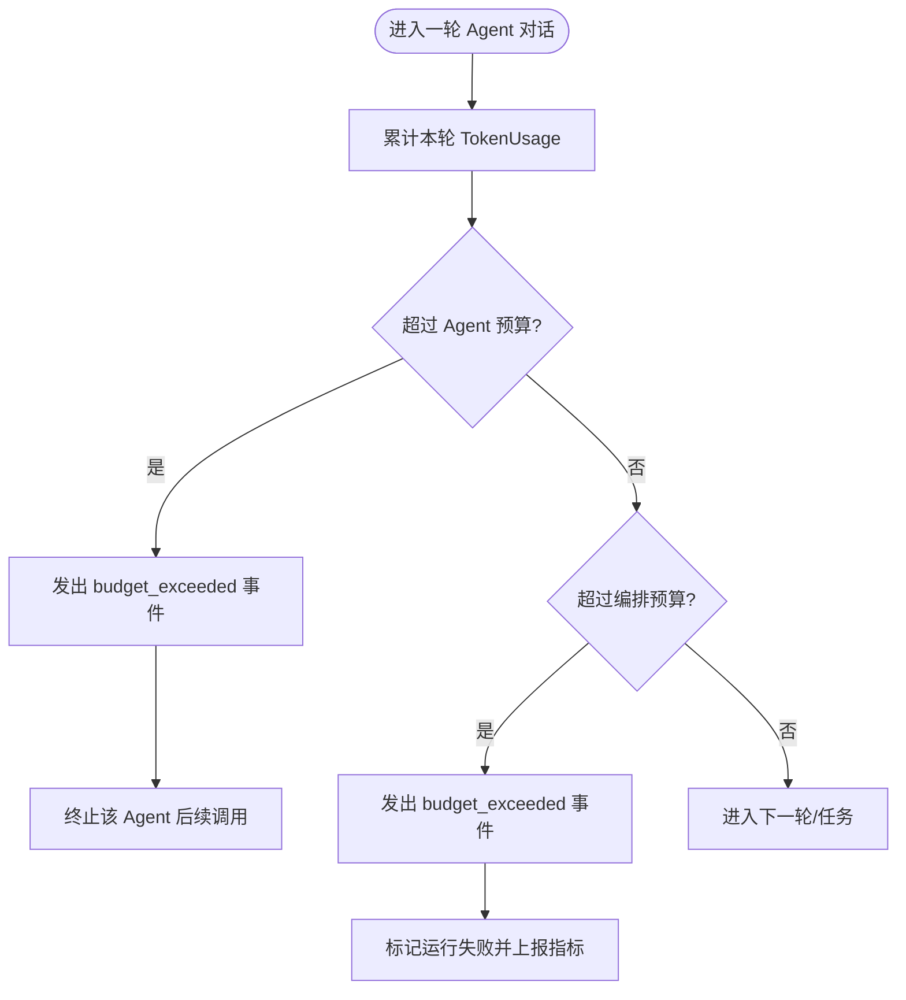
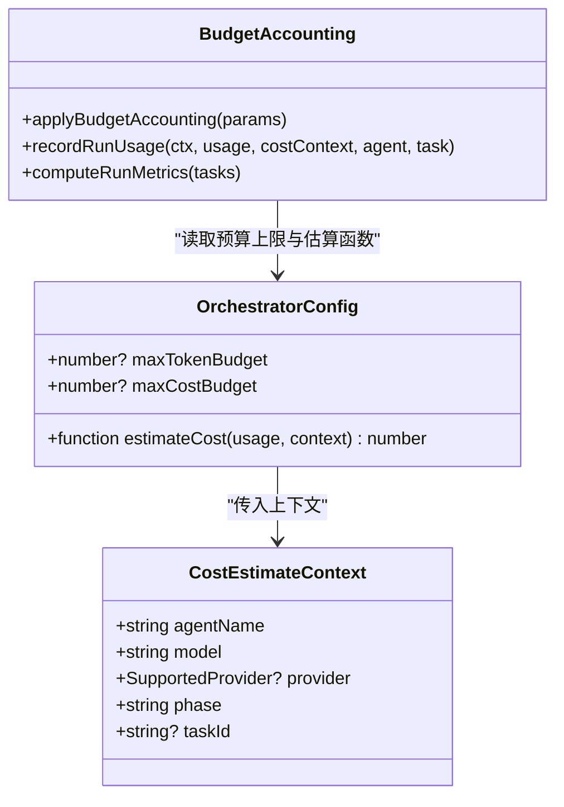
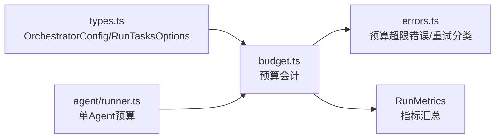

# 预算控制

<cite>
**本文引用的文件**
- [README.md](file://README.md)
- [README_zh.md](file://README_zh.md)
- [packages/core/README.md](file://packages/core/README.md)
- [packages/core/src/types.ts](file://packages/core/src/types.ts)
- [packages/core/src/errors.ts](file://packages/core/src/errors.ts)
- [packages/core/src/orchestrator/budget.ts](file://packages/core/src/orchestrator/budget.ts)
- [packages/core/src/agent/runner.ts](file://packages/core/src/agent/runner.ts)
</cite>

## 目录
1. [简介](#简介)
2. [项目结构](#项目结构)
3. [核心组件](#核心组件)
4. [架构总览](#架构总览)
5. [详细组件分析](#详细组件分析)
6. [依赖关系分析](#依赖关系分析)
7. [性能考量](#性能考量)
8. [故障排查指南](#故障排查指南)
9. [结论](#结论)
10. [附录](#附录)

## 简介
本章节聚焦 Open Multi-Agent（OMA）的预算控制系统，围绕 Token 预算与成本预算两大维度，说明输入/输出 Token 限制、单轮对话预算、总任务预算等概念；解释成本控制机制，包括模型定价接入、预算消耗跟踪、超预算处理；介绍资源监控能力，如实时预算使用率、成本预测、异常检测；给出预算配置最佳实践与降级策略；并通过生产场景案例展示如何设置与管理预算控制，确保成本可控且服务质量稳定。

## 项目结构
预算控制相关代码主要分布在以下位置：
- 类型与接口定义：OrchestratorConfig、RunTasksOptions、CostEstimateContext、TokenUsage 等集中在 types.ts
- 预算会计与事件：orchestrator/budget.ts 负责累计用量、估算成本、触发超预算事件与指标汇总
- Agent 层 Token 预算：agent/runner.ts 在单 Agent 多轮对话中检查 per-agent 的 maxTokenBudget
- 错误与重试分类：errors.ts 定义了 TokenBudgetExceededError、CostBudgetExceededError 以及可重试判定逻辑
- 文档与使用说明：README 系列提供生产清单与预算相关配置项说明

图表来源
- [packages/core/src/orchestrator/budget.ts:118-215](file://packages/core/src/orchestrator/budget.ts#L118-L215)
- [packages/core/src/agent/runner.ts:1204-1215](file://packages/core/src/agent/runner.ts#L1204-L1215)
- [packages/core/src/types.ts:2192-2213](file://packages/core/src/types.ts#L2192-L2213)

章节来源
- [packages/core/README.md:288-300](file://packages/core/README.md#L288-L300)
- [packages/core/src/types.ts:2192-2213](file://packages/core/src/types.ts#L2192-L2213)
- [packages/core/src/orchestrator/budget.ts:118-215](file://packages/core/src/orchestrator/budget.ts#L118-L215)
- [packages/core/src/agent/runner.ts:1204-1215](file://packages/core/src/agent/runner.ts#L1204-L1215)

## 核心组件
- 预算上限与范围
  - 编排级预算：OrchestratorConfig.maxTokenBudget、maxCostBudget，作用于一次编排运行（runTeam/runTasks 等），在 turn/task 边界检查
  - 单 Agent 预算：AgentConfig/Runner 的 maxTokenBudget，用于单 Agent 的多轮对话循环内限制累计 Token
  - 每调用预算：通过 callTimeoutMs 控制单次 LLM 调用超时，配合预算形成双重边界
- 成本估算与定价
  - estimateCost(usage, context)：由调用方实现，将单次 TokenUsage 转换为成本单位；框架不内置价格表
  - CostEstimateContext：包含 agentName、model、provider、phase、taskId 等上下文，便于按模型/阶段差异化计价
- 预算会计与事件
  - recordRunUsage：累计用量与成本，首次超预算时触发 budget_exceeded 事件并更新运行状态
  - computeRunMetrics：汇总 input/output tokens、重试次数、耗时等指标
- 错误与重试
  - TokenBudgetExceededError、CostBudgetExceededError：明确标识预算超限
  - isRetryableError：预算超限属于不可重试错误，避免无效重试放大成本

章节来源
- [packages/core/src/types.ts:2192-2213](file://packages/core/src/types.ts#L2192-L2213)
- [packages/core/src/orchestrator/budget.ts:22-77](file://packages/core/src/orchestrator/budget.ts#L22-L77)
- [packages/core/src/orchestrator/budget.ts:118-215](file://packages/core/src/orchestrator/budget.ts#L118-L215)
- [packages/core/src/errors.ts:25-54](file://packages/core/src/errors.ts#L25-L54)
- [packages/core/src/errors.ts:221-238](file://packages/core/src/errors.ts#L221-L238)

## 架构总览
预算控制在 OMA 中贯穿“编排—Agent—会计—事件”四层：
- 编排层：接收 runTeam/runTasks 等调用，注入 maxTokenBudget/maxCostBudget 与 estimateCost
- Agent 层：在单 Agent 多轮对话中维护累计 Token，达到阈值即发出 budget_exceeded 事件
- 会计层：统一累计 Token 与成本，判断是否超过预算，记录运行状态与指标
- 事件层：对外暴露 budget_exceeded 事件，供上层进行降级、熔断或告警

图表来源
- [packages/core/src/orchestrator/budget.ts:118-215](file://packages/core/src/orchestrator/budget.ts#L118-L215)
- [packages/core/src/types.ts:2192-2213](file://packages/core/src/types.ts#L2192-L2213)
- [packages/core/src/agent/runner.ts:1204-1215](file://packages/core/src/agent/runner.ts#L1204-L1215)

## 详细组件分析

### 组件一：Token 预算管理（单轮对话与总任务）
- 单轮对话预算（per-agent）
  - Agent Runner 在每轮生成后统计 totalTokens，若超过配置的 maxTokenBudget，则产出 budget_exceeded 事件并停止后续工具调用，防止历史膨胀导致后续请求失败
- 总任务预算（per-run）
  - 编排层在 turn/task 边界检查累计 Token 与成本；允许最多一次模型调用超出预算，因此不应视为“分毫不差”的硬停
- 输入/输出 Token 限制
  - 通过 TokenUsage.input_tokens 与 output_tokens 累计；预算检查基于 totalTokens = input + output

图表来源
- [packages/core/src/agent/runner.ts:1204-1215](file://packages/core/src/agent/runner.ts#L1204-L1215)
- [packages/core/src/orchestrator/budget.ts:118-215](file://packages/core/src/orchestrator/budget.ts#L118-L215)

章节来源
- [packages/core/src/agent/runner.ts:1204-1215](file://packages/core/src/agent/runner.ts#L1204-L1215)
- [packages/core/src/types.ts:2192-2213](file://packages/core/src/types.ts#L2192-L2213)

### 组件二：成本预算与定价计算
- 定价接入
  - 通过 OrchestratorConfig.estimateCost(usage, context) 将单次 TokenUsage 转换为成本单位；context 包含 model/provider/phase/taskId，便于精细化计价
- 累计与检查
  - applyBudgetAccounting 将当前用量与成本合并，再与 maxTokenBudget/maxCostBudget 比较
  - 首次超预算时，recordRunUsage 会触发 budget_exceeded 事件并更新运行状态
- 结果聚合
  - computeRunMetrics 汇总 input/output tokens、重试次数、耗时等，便于报表与看板

图表来源
- [packages/core/src/types.ts:2192-2213](file://packages/core/src/types.ts#L2192-L2213)
- [packages/core/src/orchestrator/budget.ts:22-77](file://packages/core/src/orchestrator/budget.ts#L22-L77)
- [packages/core/src/orchestrator/budget.ts:118-215](file://packages/core/src/orchestrator/budget.ts#L118-L215)

章节来源
- [packages/core/src/types.ts:2192-2213](file://packages/core/src/types.ts#L2192-L2213)
- [packages/core/src/orchestrator/budget.ts:22-77](file://packages/core/src/orchestrator/budget.ts#L22-L77)
- [packages/core/src/orchestrator/budget.ts:118-215](file://packages/core/src/orchestrator/budget.ts#L118-L215)

### 组件三：资源监控与异常检测
- 实时预算使用率
  - 通过预算会计的累计用量与成本，结合 estimateCost 可计算“已用/剩余”比例；可在 onProgress 中订阅 budget_exceeded 事件做实时告警
- 成本预测
  - 基于 estimateCost 对即将执行的计划进行预估（例如在 planOnly 模式或路由前评估），提前拦截高成本路径
- 异常检测
  - 预算超限错误为不可重试错误；isRetryableError 将其归类为终端错误，避免无限重试
  - 运行指标（RunMetrics）包含错误数、失败数、重试次数、耗时分布，可用于异常趋势检测

章节来源
- [packages/core/src/errors.ts:221-238](file://packages/core/src/errors.ts#L221-L238)
- [packages/core/src/orchestrator/budget.ts:22-77](file://packages/core/src/orchestrator/budget.ts#L22-L77)
- [packages/core/src/orchestrator/budget.ts:170-182](file://packages/core/src/orchestrator/budget.ts#L170-L182)

### 组件四：预算配置最佳实践
- 分层预算
  - 编排级：设置 maxTokenBudget 与 maxCostBudget，作为整体运行的硬上限
  - Agent 级：为长对话 Agent 设置更小的 per-agent maxTokenBudget，防止单 Agent 失控
  - 调用级：合理设置 callTimeoutMs，避免单次调用长时间占用资源
- 定价策略
  - 按模型/阶段差异化计价：在 estimateCost 中根据 model/provider/phase 设定不同单价
  - 预留缓冲：由于预算在 turn/task 边界检查，允许一次调用超出预算，建议预算值略高于业务目标
- 降级策略
  - 检测到 budget_exceeded 时，切换到更便宜的模型或简化任务（如缩短上下文、减少工具调用）
  - 结合 RecoveryOptions 的 replanner/onPlanPatch，动态调整后续任务规模或跳过非关键步骤

章节来源
- [packages/core/README.md:288-300](file://packages/core/README.md#L288-L300)
- [packages/core/src/types.ts:2192-2213](file://packages/core/src/types.ts#L2192-L2213)

### 组件五：生产环境案例
- 场景：客服问答团队
  - 目标：控制单次会话成本，同时保证响应质量
  - 配置要点：
    - 编排级：maxTokenBudget=50k，maxCostBudget=0.05（示例单位），estimateCost 按模型单价折算
    - Agent 级：每个客服 Agent 设置 per-agent maxTokenBudget=10k，防止单轮过长
    - 监控：订阅 budget_exceeded 事件，触发降级（切换至轻量模型或精简回答）
  - 效果：通过预算与降级策略，稳定控制成本，同时在预算紧张时自动降低复杂度以维持可用性

[本节为概念性案例，不直接分析具体文件]

## 依赖关系分析
- OrchestratorConfig 依赖 estimateCost 与预算上限，驱动预算会计
- Agent Runner 依赖 per-agent 预算上限，独立于编排预算但可与编排预算协同
- errors.ts 提供预算超限错误类型与重试分类，影响上层恢复策略
- budget.ts 作为核心会计模块，串联用量累计、成本估算、事件与指标

图表来源
- [packages/core/src/types.ts:2192-2213](file://packages/core/src/types.ts#L2192-L2213)
- [packages/core/src/orchestrator/budget.ts:118-215](file://packages/core/src/orchestrator/budget.ts#L118-L215)
- [packages/core/src/errors.ts:25-54](file://packages/core/src/errors.ts#L25-L54)
- [packages/core/src/agent/runner.ts:1204-1215](file://packages/core/src/agent/runner.ts#L1204-L1215)

章节来源
- [packages/core/src/types.ts:2192-2213](file://packages/core/src/types.ts#L2192-L2213)
- [packages/core/src/orchestrator/budget.ts:118-215](file://packages/core/src/orchestrator/budget.ts#L118-L215)
- [packages/core/src/errors.ts:25-54](file://packages/core/src/errors.ts#L25-L54)
- [packages/core/src/agent/runner.ts:1204-1215](file://packages/core/src/agent/runner.ts#L1204-L1215)

## 性能考量
- 预算检查发生在 turn/task 边界，不会阻塞单次调用，但可能带来一次调用超出预算的“过冲”，应在预算设置时考虑此特性
- estimateCost 应尽可能高效，避免成为热点；可按模型/阶段缓存单价
- 在高并发场景下，预算会计需保证线程安全（进程内对象通常无需额外同步）
- 结合 loop detection、callTimeoutMs 与预算，形成多重保护，避免资源被长尾任务占用

[本节提供通用指导，不直接分析具体文件]

## 故障排查指南
- 常见症状
  - 频繁收到 budget_exceeded 事件：检查 estimateCost 是否正确、预算是否过小、是否存在重复工具调用或长上下文
  - 成本飙升：确认各模型的单价设置、是否存在昂贵模型被误用、是否缺少 per-agent 预算限制
- 定位方法
  - 查看 RunMetrics 中的 input/output tokens、重试次数、耗时分布，定位异常任务
  - 订阅 budget_exceeded 事件，记录 agent/model/phase/taskId，快速定位问题来源
- 处理策略
  - 预算超限为不可重试错误，优先降级而非重试
  - 调整 estimateCost 或预算上限，结合业务 SLA 重新校准
  - 启用 RecoveryOptions 的动态修复策略，在任务屏障处调整后续计划

章节来源
- [packages/core/src/errors.ts:221-238](file://packages/core/src/errors.ts#L221-L238)
- [packages/core/src/orchestrator/budget.ts:170-182](file://packages/core/src/orchestrator/budget.ts#L170-L182)
- [packages/core/src/orchestrator/budget.ts:22-77](file://packages/core/src/orchestrator/budget.ts#L22-L77)

## 结论
OMA 的预算控制系统通过“编排级 Token/成本预算 + Agent 级 Token 预算 + 自定义成本估算 + 实时事件与指标”的组合，提供了从规划到执行的全链路成本控制能力。生产环境中，建议采用分层预算、精细化定价、实时监控与自动降级的策略，确保在复杂多 Agent 场景下既能控制成本，又能维持服务质量。

[本节为总结性内容，不直接分析具体文件]

## 附录
- 关键配置项速查
  - OrchestratorConfig.maxTokenBudget：编排级累计 Token 上限
  - OrchestratorConfig.maxCostBudget：编排级累计成本上限
  - OrchestratorConfig.estimateCost：将 TokenUsage 转换为成本单位的函数
  - AgentConfig/Runner.maxTokenBudget：单 Agent 多轮对话累计 Token 上限
  - AgentConfig.callTimeoutMs：单次 LLM 调用超时
- 事件与指标
  - budget_exceeded：预算超限事件，包含错误信息与上下文
  - RunMetrics：input/output tokens、重试次数、耗时分布等

章节来源
- [packages/core/src/types.ts:2192-2213](file://packages/core/src/types.ts#L2192-L2213)
- [packages/core/src/orchestrator/budget.ts:22-77](file://packages/core/src/orchestrator/budget.ts#L22-L77)
- [packages/core/src/orchestrator/budget.ts:170-182](file://packages/core/src/orchestrator/budget.ts#L170-L182)