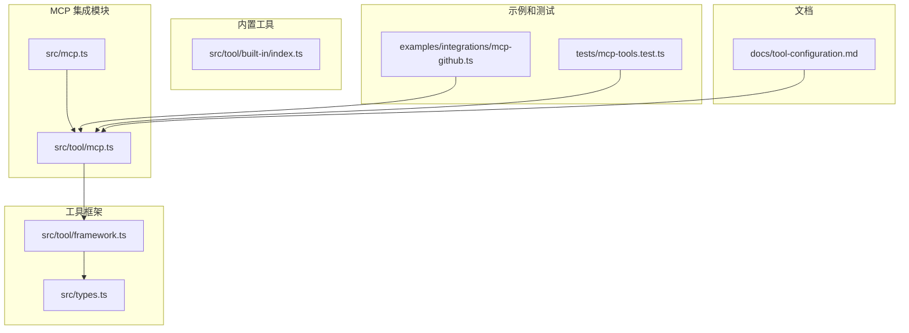
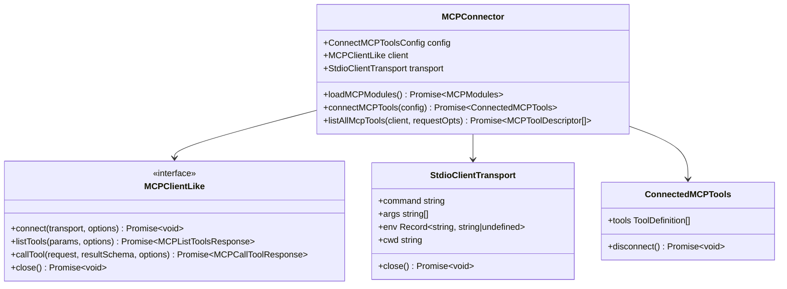
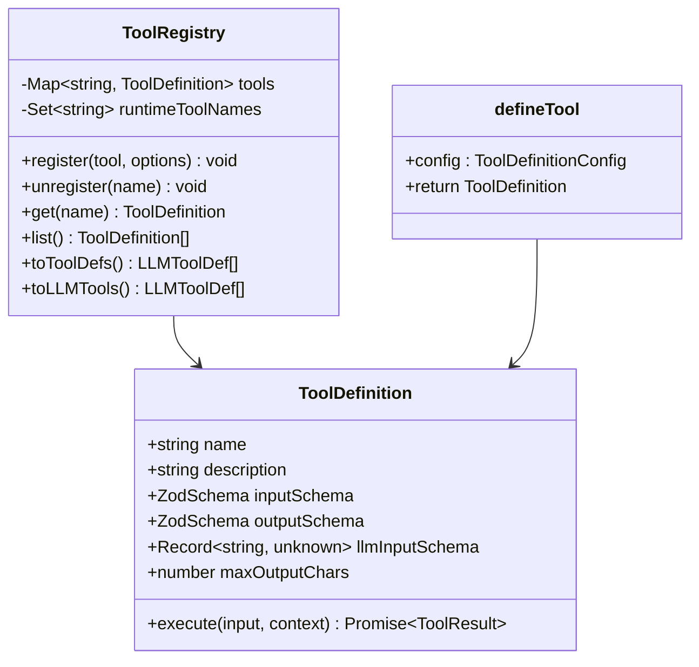
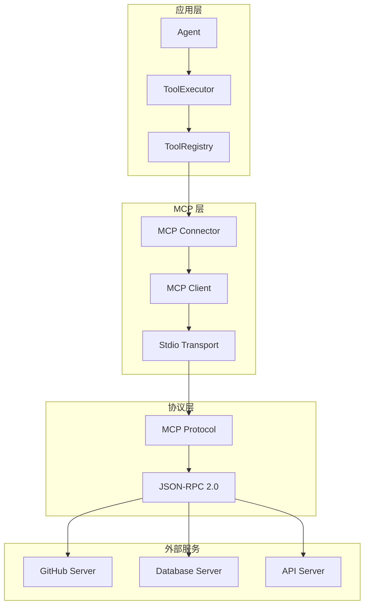
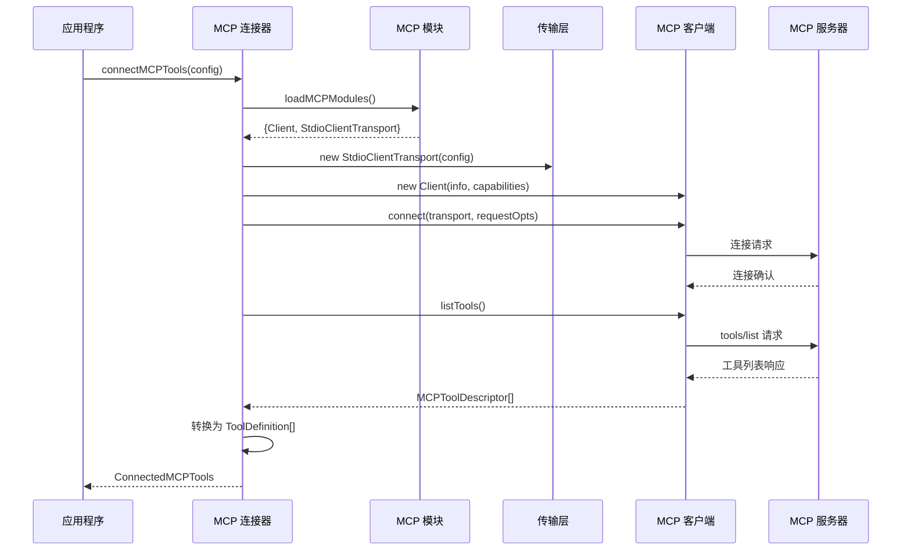
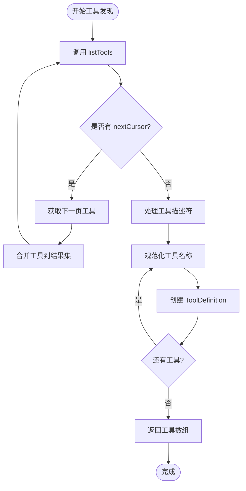
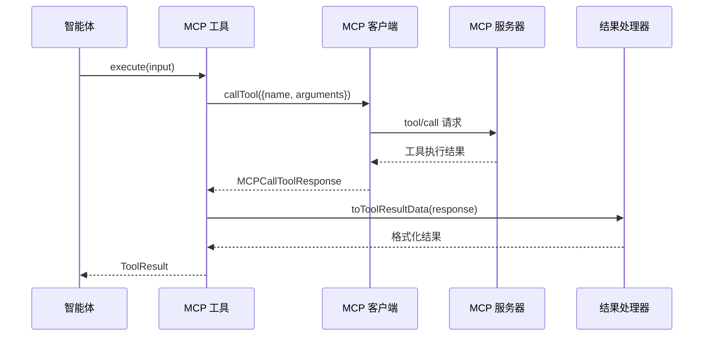
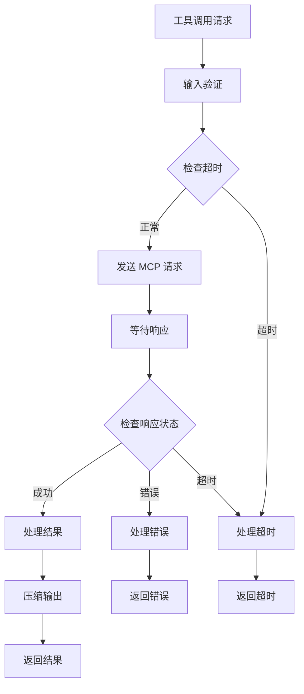
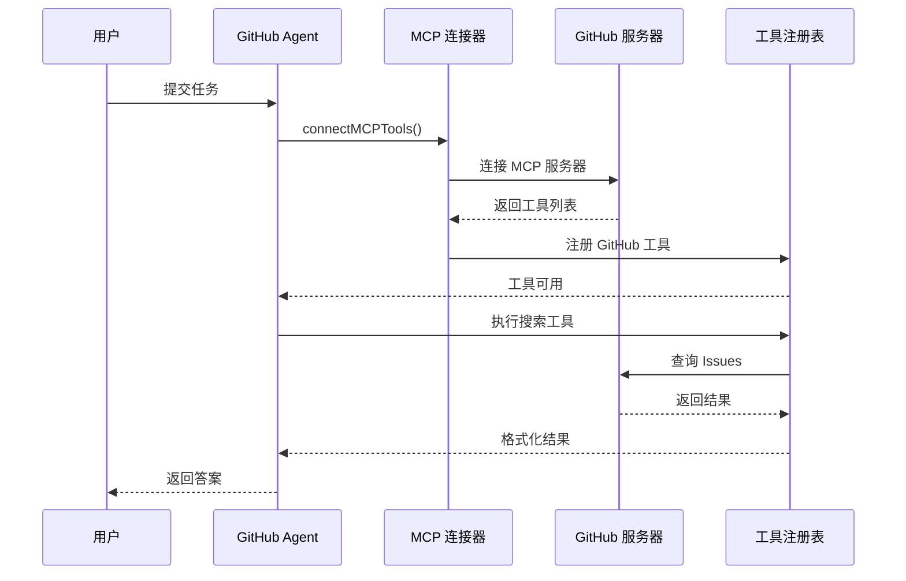

# MCP 工具集成

<cite>
**本文档引用的文件**
- [src/tool/mcp.ts](file://src/tool/mcp.ts)
- [src/mcp.ts](file://src/mcp.ts)
- [examples/integrations/mcp-github.ts](file://examples/integrations/mcp-github.ts)
- [tests/mcp-tools.test.ts](file://tests/mcp-tools.test.ts)
- [src/tool/framework.ts](file://src/tool/framework.ts)
- [src/tool/built-in/index.ts](file://src/tool/built-in/index.ts)
- [docs/tool-configuration.md](file://docs/tool-configuration.md)
- [package.json](file://package.json)
- [src/types.ts](file://src/types.ts)
</cite>

## 目录
1. [简介](#简介)
2. [项目结构](#项目结构)
3. [核心组件](#核心组件)
4. [架构概览](#架构概览)
5. [详细组件分析](#详细组件分析)
6. [依赖关系分析](#依赖关系分析)
7. [性能考虑](#性能考虑)
8. [故障排除指南](#故障排除指南)
9. [结论](#结论)
10. [附录](#附录)

## 简介

Open Multi-Agent 框架的 MCP（Model Context Protocol）工具集成为多智能体系统提供了强大的外部服务集成能力。MCP 是一个标准化协议，允许智能体通过统一的方式访问各种工具和服务，包括代码仓库管理、数据库查询、第三方 API 调用等。

本框架通过 MCP 集成实现了以下核心价值：
- **标准化接口**：统一的工具调用协议，支持多种后端服务
- **动态发现**：自动发现和注册 MCP 服务器暴露的工具
- **类型安全**：基于 Zod 的输入输出验证机制
- **可扩展性**：支持自定义 MCP 服务器和工具
- **性能优化**：内置超时控制、错误处理和结果压缩

## 项目结构

MCP 工具集成在项目中的组织结构如下：



**图表来源**
- [src/tool/mcp.ts:1-297](file://src/tool/mcp.ts#L1-L297)
- [src/mcp.ts:1-6](file://src/mcp.ts#L1-L6)
- [src/tool/framework.ts:1-610](file://src/tool/framework.ts#L1-L610)

**章节来源**
- [src/tool/mcp.ts:1-297](file://src/tool/mcp.ts#L1-L297)
- [src/mcp.ts:1-6](file://src/mcp.ts#L1-L6)

## 核心组件

### MCP 连接器 (MCP Connector)

MCP 连接器是整个集成的核心组件，负责建立与 MCP 服务器的连接并管理工具生命周期。



**图表来源**
- [src/tool/mcp.ts:24-93](file://src/tool/mcp.ts#L24-L93)
- [src/tool/mcp.ts:230-296](file://src/tool/mcp.ts#L230-L296)

### 工具定义框架

工具定义框架提供了统一的工具抽象，支持 MCP 工具与内置工具的无缝集成。



**图表来源**
- [src/tool/framework.ts:71-111](file://src/tool/framework.ts#L71-L111)
- [src/tool/framework.ts:121-255](file://src/tool/framework.ts#L121-L255)

**章节来源**
- [src/tool/mcp.ts:230-296](file://src/tool/mcp.ts#L230-L296)
- [src/tool/framework.ts:1-610](file://src/tool/framework.ts#L1-L610)

## 架构概览

MCP 工具集成采用分层架构设计，确保了良好的可维护性和扩展性：



**图表来源**
- [src/tool/mcp.ts:230-296](file://src/tool/mcp.ts#L230-L296)
- [src/tool/framework.ts:121-255](file://src/tool/framework.ts#L121-L255)

## 详细组件分析

### 连接建立流程

MCP 连接建立是一个异步的多步骤过程，包含模块加载、传输初始化、客户端连接和工具发现等阶段。



**图表来源**
- [src/tool/mcp.ts:230-296](file://src/tool/mcp.ts#L230-L296)
- [src/tool/mcp.ts:57-67](file://src/tool/mcp.ts#L57-L67)

### 工具发现机制

MCP 工具发现支持分页处理，确保大量工具的高效获取：



**图表来源**
- [src/tool/mcp.ts:206-224](file://src/tool/mcp.ts#L206-L224)
- [src/tool/mcp.ts:99-106](file://src/tool/mcp.ts#L99-L106)

### 参数传递和结果处理

MCP 工具的参数传递和结果处理遵循严格的协议规范：



**图表来源**
- [src/tool/mcp.ts:264-288](file://src/tool/mcp.ts#L264-L288)
- [src/tool/mcp.ts:160-204](file://src/tool/mcp.ts#L160-L204)

**章节来源**
- [src/tool/mcp.ts:1-297](file://src/tool/mcp.ts#L1-L297)
- [tests/mcp-tools.test.ts:1-212](file://tests/mcp-tools.test.ts#L1-L212)

### 配置方法和连接参数

MCP 工具集成提供了灵活的配置选项：

| 配置项 | 类型 | 默认值 | 描述 |
|--------|------|--------|------|
| command | string | 必需 | MCP 服务器命令路径 |
| args | string[] | [] | 命令行参数数组 |
| env | Record<string, string \| undefined> | process.env | 环境变量映射 |
| cwd | string | 当前工作目录 | 工作目录路径 |
| namePrefix | string | undefined | 工具名称前缀 |
| requestTimeoutMs | number | 60000 | 请求超时时间（毫秒） |
| clientName | string | 'open-multi-agent' | 客户端名称 |
| clientVersion | string | '0.0.0' | 客户端版本 |

**章节来源**
- [src/tool/mcp.ts:69-88](file://src/tool/mcp.ts#L69-L88)
- [examples/integrations/mcp-github.ts:24-32](file://examples/integrations/mcp-github.ts#L24-L32)

## 依赖关系分析

MCP 工具集成的依赖关系体现了清晰的分层设计：

```mermaid
graph TB
subgraph "运行时依赖"
Zod[zod ^3.23.0]
SDK[@modelcontextprotocol/sdk ^1.18.0]
end
subgraph "开发依赖"
Vitest[vitest ^2.1.0]
TSX[tsx ^4.21.0]
TypeScript[typescript ^5.6.0]
end
subgraph "核心模块"
MCP[src/tool/mcp.ts]
Framework[src/tool/framework.ts]
Types[src/types.ts]
end
MCP --> Framework
MCP --> Types
MCP --> Zod
MCP -.-> SDK
Framework --> Types
Framework --> Zod
```

**图表来源**
- [package.json:69-107](file://package.json#L69-L107)
- [src/tool/mcp.ts:1-3](file://src/tool/mcp.ts#L1-L3)

### 外部依赖分析

MCP 工具集成主要依赖于：
- **@modelcontextprotocol/sdk**：MCP 协议实现，作为可选对等依赖
- **zod**：类型验证和模式定义
- **Node.js 运行时**：标准库支持

**章节来源**
- [package.json:74-93](file://package.json#L74-L93)
- [src/tool/mcp.ts:57-67](file://src/tool/mcp.ts#L57-L67)

## 性能考虑

### 超时控制和资源管理

MCP 工具集成实现了多层次的性能优化：



**图表来源**
- [src/tool/mcp.ts:250-252](file://src/tool/mcp.ts#L250-L252)
- [src/tool/mcp.ts:278-285](file://src/tool/mcp.ts#L278-L285)

### 错误处理策略

MCP 工具集成采用了全面的错误处理机制：

| 错误类型 | 处理策略 | 影响范围 |
|----------|----------|----------|
| 连接失败 | 重试机制 + 友好错误消息 | 全局连接失败 |
| 工具调用超时 | 终止请求 + 超时错误 | 单个工具调用 |
| 工具执行错误 | 包装错误消息 + 标记为错误 | 单个工具调用 |
| 序列化失败 | 回退到字符串表示 | 工具结果处理 |

**章节来源**
- [src/tool/mcp.ts:278-285](file://src/tool/mcp.ts#L278-L285)
- [tests/mcp-tools.test.ts:192-210](file://tests/mcp-tools.test.ts#L192-L210)

## 故障排除指南

### 常见问题诊断

#### 连接问题
- **症状**：连接超时或连接失败
- **原因**：MCP 服务器未启动、命令路径错误、权限不足
- **解决方案**：验证服务器状态、检查命令路径、确认环境变量

#### 工具发现失败
- **症状**：无法获取工具列表
- **原因**：服务器不支持 tools/list、网络问题
- **解决方案**：检查服务器兼容性、验证网络连接

#### 工具调用错误
- **症状**：工具执行失败但无明确错误信息
- **原因**：参数格式错误、服务器内部错误
- **解决方案**：检查输入参数、查看服务器日志

**章节来源**
- [tests/mcp-tools.test.ts:107-135](file://tests/mcp-tools.test.ts#L107-L135)
- [tests/mcp-tools.test.ts:137-168](file://tests/mcp-tools.test.ts#L137-L168)

### 性能监控

建议监控的关键指标：
- 连接建立时间
- 工具发现耗时
- 平均工具调用延迟
- 错误率统计
- 资源使用情况

## 结论

Open Multi-Agent 框架的 MCP 工具集成为多智能体系统提供了强大而灵活的外部服务集成能力。通过标准化的协议接口、完善的错误处理机制和性能优化策略，该集成方案能够有效支持各种复杂的业务场景。

### 主要优势

1. **标准化协议**：基于 MCP 协议，确保与其他系统的互操作性
2. **动态发现**：自动发现和注册工具，减少手动配置
3. **类型安全**：完整的输入输出验证机制
4. **性能优化**：超时控制、错误处理和结果压缩
5. **易于扩展**：支持自定义 MCP 服务器和工具

### 最佳实践

1. **合理配置超时**：根据服务响应时间调整超时设置
2. **错误处理**：实现适当的错误恢复策略
3. **监控告警**：建立完善的性能监控体系
4. **安全考虑**：确保环境变量和敏感数据的安全

## 附录

### 实际集成示例

#### GitHub 集成示例



**图表来源**
- [examples/integrations/mcp-github.ts:24-59](file://examples/integrations/mcp-github.ts#L24-L59)

### MCP 工具与内置工具对比

| 特性 | MCP 工具 | 内置工具 |
|------|----------|----------|
| 配置复杂度 | 高（需要外部服务器） | 低（直接配置） |
| 功能范围 | 无限（取决于服务器） | 有限（预定义功能） |
| 类型安全 | 服务器端验证 | 框架内验证 |
| 性能开销 | 网络通信 | 本地执行 |
| 维护成本 | 高（服务器维护） | 低（框架维护） |
| 扩展性 | 优秀 | 一般 |

**章节来源**
- [src/tool/built-in/index.ts:37-50](file://src/tool/built-in/index.ts#L37-L50)
- [docs/tool-configuration.md:128-153](file://docs/tool-configuration.md#L128-L153)