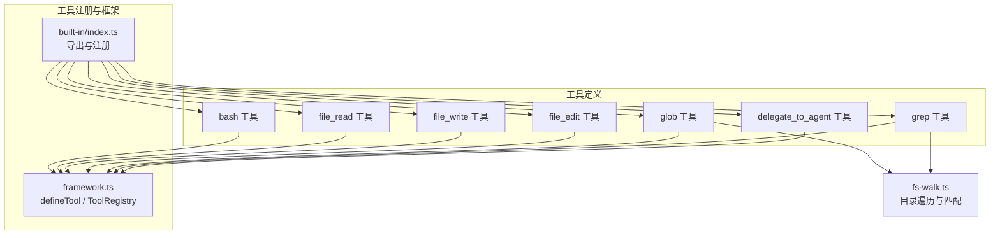
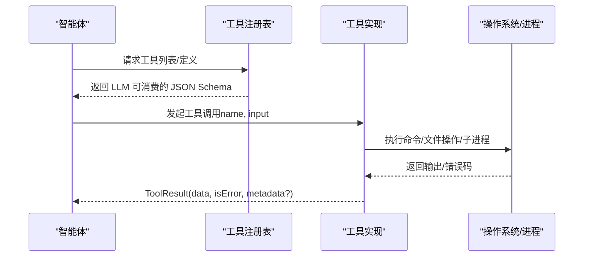
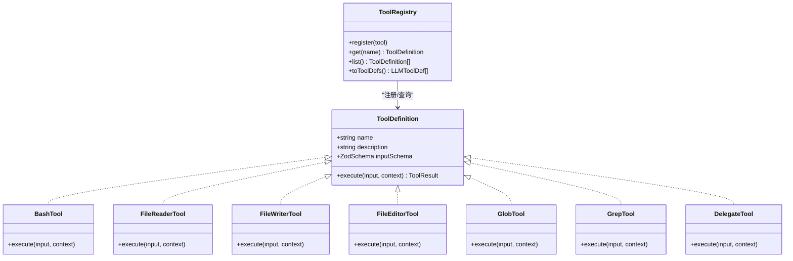

# 内置工具

<cite>
**本文引用的文件**
- [src/tool/built-in/index.ts](file://src/tool/built-in/index.ts)
- [src/tool/built-in/bash.ts](file://src/tool/built-in/bash.ts)
- [src/tool/built-in/file-read.ts](file://src/tool/built-in/file-read.ts)
- [src/tool/built-in/file-write.ts](file://src/tool/built-in/file-write.ts)
- [src/tool/built-in/file-edit.ts](file://src/tool/built-in/file-edit.ts)
- [src/tool/built-in/glob.ts](file://src/tool/built-in/glob.ts)
- [src/tool/built-in/grep.ts](file://src/tool/built-in/grep.ts)
- [src/tool/built-in/delegate.ts](file://src/tool/built-in/delegate.ts)
- [src/tool/built-in/fs-walk.ts](file://src/tool/built-in/fs-walk.ts)
- [src/tool/framework.ts](file://src/tool/framework.ts)
- [src/types.ts](file://src/types.ts)
- [tests/built-in-tools.test.ts](file://tests/built-in-tools.test.ts)
- [docs/tool-configuration.md](file://docs/tool-configuration.md)
- [examples/basics/team-collaboration.ts](file://examples/basics/team-collaboration.ts)
</cite>

## 目录
1. [简介](#简介)
2. [项目结构](#项目结构)
3. [核心组件](#核心组件)
4. [架构总览](#架构总览)
5. [详细组件分析](#详细组件分析)
6. [依赖关系分析](#依赖关系分析)
7. [性能与资源控制](#性能与资源控制)
8. [故障排查指南](#故障排查指南)
9. [结论](#结论)
10. [附录](#附录)

## 简介
本文件系统化梳理 Open Multi-Agent 框架的内置工具集合，覆盖以下工具：
- bash：在受控子进程中执行 Bash 命令，支持超时与工作目录
- file_read：按行号读取文件内容，支持分片读取大文件
- file_write：创建或覆写文件，自动创建父目录
- file_edit：在现有文件内进行精确字符串替换，支持唯一性约束与批量替换
- glob：递归列出匹配的文件路径（不读取内容）
- grep：在文件中搜索正则表达式，优先使用 ripgrep，回退到纯 Node.js 实现
- delegate_to_agent：在团队编排中同步委托给另一名智能体

文档包含参数定义、返回值格式、使用示例、安全注意事项、执行环境与权限限制、跨平台兼容性、错误处理与异常流程，以及多智能体协作中的典型应用场景。

## 项目结构
内置工具位于 src/tool/built-in 目录，通过统一入口导出并注册到工具注册表；工具框架定义了 defineTool 与 ToolRegistry，负责类型校验、JSON Schema 转换与工具注册。

图表来源
- [src/tool/built-in/index.ts:1-75](file://src/tool/built-in/index.ts#L1-L75)
- [src/tool/built-in/bash.ts:1-188](file://src/tool/built-in/bash.ts#L1-L188)
- [src/tool/built-in/file-read.ts:1-106](file://src/tool/built-in/file-read.ts#L1-L106)
- [src/tool/built-in/file-write.ts:1-82](file://src/tool/built-in/file-write.ts#L1-L82)
- [src/tool/built-in/file-edit.ts:1-155](file://src/tool/built-in/file-edit.ts#L1-L155)
- [src/tool/built-in/glob.ts:1-100](file://src/tool/built-in/glob.ts#L1-L100)
- [src/tool/built-in/grep.ts:1-281](file://src/tool/built-in/grep.ts#L1-L281)
- [src/tool/built-in/delegate.ts:1-110](file://src/tool/built-in/delegate.ts#L1-L110)
- [src/tool/built-in/fs-walk.ts:1-98](file://src/tool/built-in/fs-walk.ts#L1-L98)
- [src/tool/framework.ts:1-610](file://src/tool/framework.ts#L1-L610)

章节来源
- [src/tool/built-in/index.ts:1-75](file://src/tool/built-in/index.ts#L1-L75)
- [src/tool/framework.ts:1-610](file://src/tool/framework.ts#L1-L610)

## 核心组件
- 工具注册与导出：集中于 built-in/index.ts，提供注册函数与内置工具数组，可选择性包含 delegate_to_agent 工具。
- 工具框架：framework.ts 提供 defineTool 定义工具、ToolRegistry 注册与转换为 LLM JSON Schema 的能力。
- 共享遍历：fs-walk.ts 提供目录遍历、跳过常见目录、最小化 glob 匹配逻辑，被 glob 与 grep 复用以保持一致性。

章节来源
- [src/tool/built-in/index.ts:1-75](file://src/tool/built-in/index.ts#L1-L75)
- [src/tool/framework.ts:1-610](file://src/tool/framework.ts#L1-L610)
- [src/tool/built-in/fs-walk.ts:1-98](file://src/tool/built-in/fs-walk.ts#L1-L98)

## 架构总览
下图展示工具在运行期的调用链：Agent 通过工具注册表获取工具定义，LLM 生成工具调用请求，工具执行器根据输入模式调用具体工具实现，最终返回标准化结果。

图表来源
- [src/tool/framework.ts:198-254](file://src/tool/framework.ts#L198-L254)
- [src/tool/built-in/bash.ts:46-63](file://src/tool/built-in/bash.ts#L46-L63)
- [src/tool/built-in/file-read.ts:46-104](file://src/tool/built-in/file-read.ts#L46-L104)
- [src/tool/built-in/file-write.ts:35-80](file://src/tool/built-in/file-write.ts#L35-L80)
- [src/tool/built-in/file-edit.ts:48-111](file://src/tool/built-in/file-edit.ts#L48-L111)
- [src/tool/built-in/glob.ts:50-98](file://src/tool/built-in/glob.ts#L50-L98)
- [src/tool/built-in/grep.ts:68-99](file://src/tool/built-in/grep.ts#L68-L99)
- [src/tool/built-in/delegate.ts:31-108](file://src/tool/built-in/delegate.ts#L31-L108)

## 详细组件分析

### bash 工具
- 用途：在非交互式 Bash 环境中执行命令，适合文件系统操作、脚本运行、包安装等。
- 参数
  - command: string（必填）——要执行的 Bash 命令
  - timeout: number（可选）——毫秒，默认 30000
  - cwd: string（可选）——工作目录
- 返回值
  - data: string（组合 stdout/stderr 或退出码信息）
  - isError: boolean（非零退出码视为错误）
- 执行细节
  - 使用子进程捕获 stdout/stderr，支持 AbortSignal 中断与超时 SIGKILL
  - 输出格式：若仅 stdout 则直接返回；若存在 stderr 则带标签区分；无输出时返回状态提示
- 安全与权限
  - 在当前进程环境中执行，受限于运行用户权限
  - 建议限制超时，避免长时间阻塞
- 兼容性
  - 需要系统安装 Bash；Windows 上可通过 WSL 或兼容层运行
- 错误处理
  - 子进程 error 时返回错误；close 时根据退出码判定是否错误
- 使用示例（参考测试）
  - 执行 echo、捕获失败命令 stderr、指定工作目录、返回退出码、无输出场景

章节来源
- [src/tool/built-in/bash.ts:1-188](file://src/tool/built-in/bash.ts#L1-L188)
- [tests/built-in-tools.test.ts:271-320](file://tests/built-in-tools.test.ts#L271-L320)

### file_read 工具
- 用途：读取文件内容并按 1 基线号前缀输出，支持 offset/limit 分片读取。
- 参数
  - path: string（必填）——绝对路径
  - offset: number（可选，整数，非负）——起始行号（1 基）
  - limit: number（可选，整数，正数）——最大返回行数
- 返回值
  - data: string（行号前缀的文本块，末尾附“显示范围”元信息）
  - isError: boolean
- 执行细节
  - 将文件按行分割，移除尾随空行，应用偏移与上限，拼接“行号\t内容”
  - 当仅读取部分时附加范围说明
- 错误处理
  - 文件不存在或不可读时返回错误
  - offset 超出文件长度时返回错误
- 使用示例（参考测试）
  - 读取完整文件并带行号、分片读取、越界错误、截断提示

章节来源
- [src/tool/built-in/file-read.ts:1-106](file://src/tool/built-in/file-read.ts#L1-L106)
- [tests/built-in-tools.test.ts:71-133](file://tests/built-in-tools.test.ts#L71-L133)

### file_write 工具
- 用途：创建或覆写文件，自动创建父目录（等价 mkdir -p）。
- 参数
  - path: string（必填，绝对路径）
  - content: string（必填）
- 返回值
  - data: string（包含“创建/更新”、“行数/字节数”等信息）
  - isError: boolean
- 执行细节
  - 先尝试 stat 判断是否存在，再递归创建父目录，最后写入 UTF-8
- 错误处理
  - 创建目录失败或写入失败均返回错误
- 使用示例（参考测试）
  - 新建文件、覆写已有文件、自动创建深层目录、统计行数与字节

章节来源
- [src/tool/built-in/file-write.ts:1-82](file://src/tool/built-in/file-write.ts#L1-L82)
- [tests/built-in-tools.test.ts:139-192](file://tests/built-in-tools.test.ts#L139-L192)

### file_edit 工具
- 用途：在现有文件内进行精确字符串替换，保证唯一性（除非显式允许全部替换）。
- 参数
  - path: string（必填）
  - old_string: string（必填，必须逐字符完全匹配）
  - new_string: string（必填）
  - replace_all: boolean（可选，默认 false）
- 返回值
  - data: string（包含替换次数信息）
  - isError: boolean
- 执行细节
  - 读取原文件后统计 old_string 出现次数
  - 若出现多次且未设置 replace_all，则报错
  - 支持一次性替换全部出现位置
- 错误处理
  - 未找到 old_string、读取/写入失败、多次匹配未开启 replace_all
- 使用示例（参考测试）
  - 唯一替换成功、未找到错误、多次匹配错误、批量替换

章节来源
- [src/tool/built-in/file-edit.ts:1-155](file://src/tool/built-in/file-edit.ts#L1-L155)
- [tests/built-in-tools.test.ts:198-265](file://tests/built-in-tools.test.ts#L198-L265)

### glob 工具
- 用途：递归列出目录下匹配的文件路径（不读取内容），默认跳过常见大型/无关目录。
- 参数
  - path: string（可选，默认当前工作目录）
  - pattern: string（可选，如 *.ts、**/*.json）
  - maxFiles: number（可选，默认 500）
- 返回值
  - data: string（按本地排序的路径列表，可能包含“已截断”提示）
  - isError: boolean
- 执行细节
  - 对单文件路径进行模式匹配判断；对目录递归遍历，使用 fs-walk 的 skip 规则与最小化 glob
  - 结果按本地排序，超过 maxFiles 时截断并提示
- 错误处理
  - 访问路径失败时返回错误
- 使用示例（参考测试）
  - 按模式筛选、列出全部、单文件匹配、递归子目录、截断提示、访问失败

章节来源
- [src/tool/built-in/glob.ts:1-100](file://src/tool/built-in/glob.ts#L1-L100)
- [src/tool/built-in/fs-walk.ts:1-98](file://src/tool/built-in/fs-walk.ts#L1-L98)
- [tests/built-in-tools.test.ts:326-416](file://tests/built-in-tools.test.ts#L326-L416)

### grep 工具
- 用途：在文件中搜索正则表达式，返回匹配行及其文件路径与行号。
- 参数
  - pattern: string（必填，正则）
  - path: string（可选，默认当前工作目录）
  - glob: string（可选，过滤文件类型）
  - maxResults: number（可选，默认 100）
- 返回值
  - data: string（每行格式为“文件:行号:内容”，可能包含“已截断”提示）
  - isError: boolean
- 执行细节
  - 优先检测并使用 ripgrep（rg）二进制，否则回退到纯 Node.js 递归读取
  - Node.js 回退会使用 fs-walk 收集文件，逐行匹配并限制结果数量
- 错误处理
  - 正则无效、路径不可访问、rg 进程错误（保留回退路径）
- 使用示例（参考测试）
  - 单文件搜索、无匹配、无效正则、递归搜索、glob 过滤、访问失败

章节来源
- [src/tool/built-in/grep.ts:1-281](file://src/tool/built-in/grep.ts#L1-L281)
- [src/tool/built-in/fs-walk.ts:1-98](file://src/tool/built-in/fs-walk.ts#L1-L98)
- [tests/built-in-tools.test.ts:422-503](file://tests/built-in-tools.test.ts#L422-L503)

### delegate_to_agent 工具
- 用途：在团队编排中同步委托给另一名智能体，返回其最终输出。
- 参数
  - target_agent: string（必填，目标智能体名称）
  - prompt: string（必填，任务指令）
- 返回值
  - data: string（被委托智能体的最终输出）
  - isError: boolean（当被委托运行失败时为 true）
  - metadata: { tokenUsage: { input_tokens, output_tokens } }
- 执行细节
  - 仅在启用团队编排且注入 runDelegatedAgent 时可用
  - 校验目标智能体不在环路中、未达到最大委托深度、代理池有并发槽位
  - 成功时将 tokenUsage 上浮至父运行的 ToolResult.metadata
- 错误处理
  - 未配置团队委托、自委托、未知目标、委托环路、深度超限、并发池饱和
- 使用示例（参考测试）
  - 成功委托、环路检测、tokenUsage 上浮、并发池饱和快速失败、自委托拒绝

章节来源
- [src/tool/built-in/delegate.ts:1-110](file://src/tool/built-in/delegate.ts#L1-L110)
- [tests/built-in-tools.test.ts:509-741](file://tests/built-in-tools.test.ts#L509-L741)

## 依赖关系分析
- 工具注册与导出
  - built-in/index.ts 导出各工具并提供 registerBuiltInTools，支持选择性注册 delegate_to_agent
  - BUILT_IN_TOOLS 与 ALL_BUILT_IN_TOOLS_WITH_DELEGATE 用于遍历与注册
- 工具框架
  - framework.ts 的 defineTool 提供输入/输出模式与 JSON Schema 转换
  - ToolRegistry 统一注册、查询、导出 LLM 工具定义
- 共享遍历
  - fs-walk.ts 为 glob 与 grep 提供一致的目录遍历与最小化 glob 匹配
- 类型契约
  - types.ts 定义 ToolResult、ToolUseContext 等核心类型，贯穿工具执行上下文

图表来源
- [src/tool/framework.ts:71-111](file://src/tool/framework.ts#L71-L111)
- [src/tool/framework.ts:121-254](file://src/tool/framework.ts#L121-L254)
- [src/tool/built-in/bash.ts:22-63](file://src/tool/built-in/bash.ts#L22-L63)
- [src/tool/built-in/file-read.ts:16-104](file://src/tool/built-in/file-read.ts#L16-L104)
- [src/tool/built-in/file-write.ts:17-80](file://src/tool/built-in/file-write.ts#L17-L80)
- [src/tool/built-in/file-edit.ts:17-111](file://src/tool/built-in/file-edit.ts#L17-L111)
- [src/tool/built-in/glob.ts:17-98](file://src/tool/built-in/glob.ts#L17-L98)
- [src/tool/built-in/grep.ts:28-99](file://src/tool/built-in/grep.ts#L28-L99)
- [src/tool/built-in/delegate.ts:24-108](file://src/tool/built-in/delegate.ts#L24-L108)

章节来源
- [src/tool/built-in/index.ts:1-75](file://src/tool/built-in/index.ts#L1-L75)
- [src/tool/framework.ts:1-610](file://src/tool/framework.ts#L1-L610)

## 性能与资源控制
- 输出截断与压缩
  - 工具层支持 per-tool 的 maxOutputChars，或在 Agent 层统一设置 maxToolOutputChars
  - 工具结果可在消费后进行压缩，减少后续对话成本
- 结果上限
  - grep 默认最多返回 100 行；glob 默认最多返回 500 个路径
- 并发与深度限制
  - delegate_to_agent 受委托深度与代理池并发槽位限制，避免无限嵌套与死锁
- 资源回收
  - bash 工具支持 AbortSignal 与超时，防止长时间占用

章节来源
- [docs/tool-configuration.md:71-126](file://docs/tool-configuration.md#L71-L126)
- [src/tool/built-in/grep.ts:22](file://src/tool/built-in/grep.ts#L22)
- [src/tool/built-in/glob.ts:15](file://src/tool/built-in/glob.ts#L15)
- [src/tool/built-in/delegate.ts:70](file://src/tool/built-in/delegate.ts#L70)

## 故障排查指南
- bash
  - 症状：命令长时间无响应
  - 处理：检查 timeout 设置；确认 cwd 是否正确；查看返回的退出码
  - 参考：[tests/built-in-tools.test.ts:271-320](file://tests/built-in-tools.test.ts#L271-L320)
- file_read
  - 症状：返回“超出文件长度”或“无法读取”
  - 处理：检查 path 是否存在；确认 offset/limit 合法；查看文件权限
  - 参考：[tests/built-in-tools.test.ts:99-133](file://tests/built-in-tools.test.ts#L99-L133)
- file_write
  - 症状：创建目录失败或写入失败
  - 处理：检查父目录权限；确认磁盘空间；查看返回的错误消息
  - 参考：[tests/built-in-tools.test.ts:139-192](file://tests/built-in-tools.test.ts#L139-L192)
- file_edit
  - 症状：old_string 未找到或多次出现
  - 处理：确保 old_string 完全匹配（含空白与换行）；必要时设置 replace_all
  - 参考：[tests/built-in-tools.test.ts:198-265](file://tests/built-in-tools.test.ts#L198-L265)
- glob
  - 症状：无匹配或路径不可访问
  - 处理：检查 pattern 与路径；调整 maxFiles；确认目录权限
  - 参考：[tests/built-in-tools.test.ts:326-416](file://tests/built-in-tools.test.ts#L326-L416)
- grep
  - 症状：无效正则、无匹配、rg 进程错误
  - 处理：修正正则；检查路径；确认 rg 是否可用；回退到 Node.js 实现
  - 参考：[tests/built-in-tools.test.ts:422-503](file://tests/built-in-tools.test.ts#L422-L503)
- delegate_to_agent
  - 症状：环路检测、深度超限、并发池饱和、自委托
  - 处理：重构委托计划；提升 maxDelegationDepth；增加并发槽位；选择其他智能体
  - 参考：[tests/built-in-tools.test.ts:509-741](file://tests/built-in-tools.test.ts#L509-L741)

## 结论
内置工具围绕“文件系统操作、文本检索与团队协作委托”构建，具备明确的输入校验、可观察的输出格式与完善的错误处理。通过工具注册表与 JSON Schema 转换，工具可无缝对接主流 LLM 接口；配合输出截断、结果压缩与并发/深度限制，能够在生产环境中安全高效地运行。

## 附录

### 工具注册与使用示例
- 注册内置工具
  - 使用 registerBuiltInTools(registry) 注册默认工具集合
  - 使用 includeDelegateTool=true 注册 delegate_to_agent
  - 参考：[src/tool/built-in/index.ts:64-74](file://src/tool/built-in/index.ts#L64-L74)
- 在团队协作中使用工具
  - 示例展示了三智能体（架构师、开发者、审查员）基于工具完成端到端任务
  - 参考：[examples/basics/team-collaboration.ts:22-55](file://examples/basics/team-collaboration.ts#L22-L55)

### 工具配置与过滤
- 预设工具集：readonly、readwrite、full
- 允许/禁止列表：preset → allowlist → denylist
- 自定义工具：config-time 注入或运行时注册
- 输出控制：outputSchema 校验、maxOutputChars 截断、压缩策略
- 参考：[docs/tool-configuration.md:1-153](file://docs/tool-configuration.md#L1-L153)