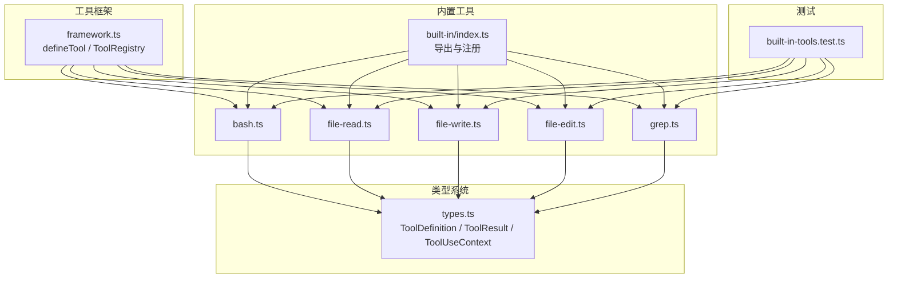
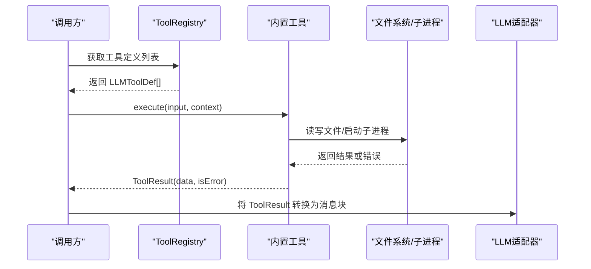
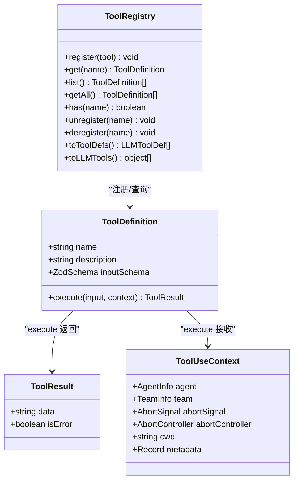

# 内置工具集

<cite>
**本文引用的文件**
- [src/tool/built-in/index.ts](file://src/tool/built-in/index.ts)
- [src/tool/built-in/bash.ts](file://src/tool/built-in/bash.ts)
- [src/tool/built-in/file-read.ts](file://src/tool/built-in/file-read.ts)
- [src/tool/built-in/file-write.ts](file://src/tool/built-in/file-write.ts)
- [src/tool/built-in/file-edit.ts](file://src/tool/built-in/file-edit.ts)
- [src/tool/built-in/grep.ts](file://src/tool/built-in/grep.ts)
- [src/tool/framework.ts](file://src/tool/framework.ts)
- [src/types.ts](file://src/types.ts)
- [tests/built-in-tools.test.ts](file://tests/built-in-tools.test.ts)
</cite>

## 目录
1. [简介](#简介)
2. [项目结构](#项目结构)
3. [核心组件](#核心组件)
4. [架构总览](#架构总览)
5. [详细组件分析](#详细组件分析)
6. [依赖关系分析](#依赖关系分析)
7. [性能考量](#性能考量)
8. [故障排查指南](#故障排查指南)
9. [结论](#结论)
10. [附录](#附录)

## 简介
本文件为 Open Multi-Agent 框架内置工具集的综合文档，覆盖以下五个内置工具：
- bash：命令执行工具
- file_read：文件读取工具
- file_write：文件写入工具
- file_edit：文件编辑工具（原地替换）
- grep：内容搜索工具（支持 ripgrep 优先与 Node.js 回退）

文档目标：
- 逐项说明各工具的输入参数、输出格式、使用限制与安全注意事项
- 提供基础用法、组合使用、错误处理等场景示例
- 解释内置工具的设计原则与扩展机制，指导如何基于现有工具开发自定义工具
- 总结最佳实践、性能优化建议与安全防护措施

## 项目结构
内置工具位于 src/tool/built-in 目录，通过统一的工具框架进行声明与注册，并在测试中验证其行为。

图表来源
- [src/tool/built-in/index.ts:1-51](file://src/tool/built-in/index.ts#L1-L51)
- [src/tool/built-in/bash.ts:1-188](file://src/tool/built-in/bash.ts#L1-L188)
- [src/tool/built-in/file-read.ts:1-106](file://src/tool/built-in/file-read.ts#L1-L106)
- [src/tool/built-in/file-write.ts:1-82](file://src/tool/built-in/file-write.ts#L1-L82)
- [src/tool/built-in/file-edit.ts:1-155](file://src/tool/built-in/file-edit.ts#L1-L155)
- [src/tool/built-in/grep.ts:1-363](file://src/tool/built-in/grep.ts#L1-L363)
- [src/tool/framework.ts:1-558](file://src/tool/framework.ts#L1-L558)
- [src/types.ts:105-179](file://src/types.ts#L105-L179)
- [tests/built-in-tools.test.ts:1-394](file://tests/built-in-tools.test.ts#L1-L394)

章节来源
- [src/tool/built-in/index.ts:1-51](file://src/tool/built-in/index.ts#L1-L51)
- [src/tool/framework.ts:71-83](file://src/tool/framework.ts#L71-L83)
- [src/types.ts:105-179](file://src/types.ts#L105-L179)

## 核心组件
- 工具框架
  - defineTool：声明一个类型安全的工具，返回满足 ToolDefinition 接口的对象
  - ToolRegistry：工具注册表，负责注册、查询、列出工具，并将工具转换为 LLM 可消费的 JSON Schema
- 类型系统
  - ToolDefinition：工具定义接口，包含名称、描述、输入模式与执行函数
  - ToolResult：工具执行结果，包含 data 与 isError 标记
  - ToolUseContext：工具执行上下文，包含 agent、team、abortSignal、cwd、metadata 等

章节来源
- [src/tool/framework.ts:71-83](file://src/tool/framework.ts#L71-L83)
- [src/tool/framework.ts:93-203](file://src/tool/framework.ts#L93-L203)
- [src/types.ts:105-179](file://src/types.ts#L105-L179)

## 架构总览
内置工具通过 defineTool 统一声明，借助 Zod 输入模式进行参数校验；执行时接收 ToolUseContext，支持超时与取消信号；最终以 ToolResult 形式返回字符串数据与错误标记。注册表将工具转换为 LLMToolDef，以便与大模型交互。

图表来源
- [src/tool/framework.ts:162-171](file://src/tool/framework.ts#L162-L171)
- [src/types.ts:162-166](file://src/types.ts#L162-L166)
- [src/tool/built-in/bash.ts:46-62](file://src/tool/built-in/bash.ts#L46-L62)
- [src/tool/built-in/file-read.ts:46-104](file://src/tool/built-in/file-read.ts#L46-L104)
- [src/tool/built-in/file-write.ts:35-80](file://src/tool/built-in/file-write.ts#L35-L80)
- [src/tool/built-in/file-edit.ts:48-111](file://src/tool/built-in/file-edit.ts#L48-L111)
- [src/tool/built-in/grep.ts:77-108](file://src/tool/built-in/grep.ts#L77-L108)

## 详细组件分析

### bash 命令执行工具
- 功能概述
  - 在非交互式 bash 环境中执行命令，捕获 stdout/stderr，支持超时与工作目录
  - 默认超时 30 秒；支持 AbortSignal 中断
- 输入参数
  - command：要执行的 bash 命令字符串
  - timeout：可选，毫秒级超时，默认 30000
  - cwd：可选，工作目录
- 输出格式
  - data：合并后的标准输出与错误输出文本；若仅 stdout 则直接返回内容；若同时有 stderr 则带分隔标注；无输出时返回状态提示
  - isError：当退出码非 0 时为 true
- 使用限制与安全
  - 仅在受信任环境中使用；避免执行不受控命令
  - 建议设置合理 timeout，防止长时间阻塞
  - cwd 为路径参数，需确保路径存在且可访问
- 错误处理
  - 子进程 error：返回特定退出码与错误信息
  - 超时：强制 SIGKILL 并标记为失败
  - AbortSignal：触发一次性中断
- 示例场景
  - 基础用法：执行简单命令并检查输出
  - 错误处理：捕获不存在路径的 ls 命令错误
  - 组合使用：在指定工作目录下执行构建脚本
  - 无输出：执行成功但无输出的命令

章节来源
- [src/tool/built-in/bash.ts:22-63](file://src/tool/built-in/bash.ts#L22-L63)
- [src/tool/built-in/bash.ts:84-154](file://src/tool/built-in/bash.ts#L84-L154)
- [src/tool/built-in/bash.ts:161-187](file://src/tool/built-in/bash.ts#L161-L187)
- [tests/built-in-tools.test.ts:257-306](file://tests/built-in-tools.test.ts#L257-L306)

### file_read 文件读取工具
- 功能概述
  - 从磁盘读取文件内容，按 1 基线号格式化输出；支持 offset/limit 分片读取，避免一次性加载大文件
- 输入参数
  - path：绝对路径
  - offset：可选，1 基起始行号
  - limit：可选，最大返回行数
- 输出格式
  - data：每行前缀为“行号\t内容”的多行文本；若截断会附加元信息
  - isError：读取失败或偏移越界时为 true
- 使用限制与安全
  - 仅支持绝对路径；不支持相对路径
  - 对于超长文件，建议使用 offset/limit 分批读取
- 错误处理
  - 文件不存在：返回错误信息
  - 偏移超出文件长度：返回错误信息
- 示例场景
  - 基础用法：读取完整文件并显示行号
  - 截断读取：仅读取中间若干行
  - 错误处理：读取不存在文件

章节来源
- [src/tool/built-in/file-read.ts:16-104](file://src/tool/built-in/file-read.ts#L16-L104)
- [tests/built-in-tools.test.ts:57-119](file://tests/built-in-tools.test.ts#L57-L119)

### file_write 文件写入工具
- 功能概述
  - 创建或覆盖文件；自动创建缺失的父目录；报告行数与字节数
- 输入参数
  - path：绝对路径
  - content：要写入的完整内容
- 输出格式
  - data：包含“创建/更新”、“行数”、“字节数”的人类可读信息
  - isError：创建目录或写入失败时为 true
- 使用限制与安全
  - 仅支持绝对路径
  - 写入前会尝试创建父目录；权限不足会报错
- 错误处理
  - 父目录创建失败：返回错误信息
  - 写入失败：返回错误信息
- 示例场景
  - 新建文件：写入新内容
  - 更新文件：覆盖已有内容
  - 自动建目录：深层嵌套路径写入
  - 计数统计：确认写入行数与字节

章节来源
- [src/tool/built-in/file-write.ts:17-80](file://src/tool/built-in/file-write.ts#L17-L80)
- [tests/built-in-tools.test.ts:125-178](file://tests/built-in-tools.test.ts#L125-L178)

### file_edit 文件编辑工具
- 功能概述
  - 在现有文件内进行精确字符串替换；默认要求旧串唯一出现一次，可通过 replace_all 全量替换
- 输入参数
  - path：绝对路径
  - old_string：要查找的精确字符串（含空白与换行）
  - new_string：替换内容
  - replace_all：可选，是否替换全部匹配
- 输出格式
  - data：包含“替换次数”的人类可读信息
  - isError：未找到、匹配不唯一或写入失败时为 true
- 使用限制与安全
  - 严格匹配 old_string，大小写与空白敏感
  - 不支持正则；如需复杂替换请使用 bash 或 grep+外部工具
- 错误处理
  - 未找到：返回提示
  - 多次出现且未启用 replace_all：返回错误
  - 写入失败：返回错误
- 示例场景
  - 唯一替换：将单个标识符替换为新值
  - 错误处理：未找到旧串
  - 全量替换：批量替换所有出现位置
  - 错误处理：多次出现且未开启全量替换

章节来源
- [src/tool/built-in/file-edit.ts:17-111](file://src/tool/built-in/file-edit.ts#L17-L111)
- [tests/built-in-tools.test.ts:184-251](file://tests/built-in-tools.test.ts#L184-L251)

### grep 内容搜索工具
- 功能概述
  - 在文件或目录中搜索正则表达式模式；优先使用 ripgrep（rg）二进制，否则回退到纯 Node.js 实现
  - 支持 glob 过滤与结果上限控制
- 输入参数
  - pattern：正则表达式
  - path：可选，文件或目录路径，默认当前工作目录
  - glob：可选，文件名过滤模式（如 "*.ts", "**/*.json"）
  - maxResults：可选，最大返回匹配行数，默认 100
- 输出格式
  - data：每行形如“文件:行号:内容”的多行文本；若无匹配返回“未找到”
  - isError：正则无效、路径不可访问或 rg 失败时为 true
- 使用限制与安全
  - 正则有效性由运行时编译决定；非法正则会报错
  - 跳过常见版本控制与构建目录，避免无关搜索
  - 结果上限防止响应过大
- 错误处理
  - 非法正则：返回错误
  - 路径不可访问：返回错误
  - rg 失败：返回错误（Node 回退时不会重试）
- 示例场景
  - 文件内搜索：在单文件中查找关键字
  - 未匹配：返回“未找到”
  - 目录递归：在目录树中搜索
  - glob 过滤：仅搜索特定类型文件
  - 错误处理：非法正则与不可访问路径

章节来源
- [src/tool/built-in/grep.ts:38-109](file://src/tool/built-in/grep.ts#L38-L109)
- [src/tool/built-in/grep.ts:121-191](file://src/tool/built-in/grep.ts#L121-L191)
- [src/tool/built-in/grep.ts:203-271](file://src/tool/built-in/grep.ts#L203-L271)
- [src/tool/built-in/grep.ts:281-344](file://src/tool/built-in/grep.ts#L281-L344)
- [src/tool/built-in/grep.ts:352-362](file://src/tool/built-in/grep.ts#L352-L362)
- [tests/built-in-tools.test.ts:312-393](file://tests/built-in-tools.test.ts#L312-L393)

## 依赖关系分析
- 工具注册与导出
  - built-in/index.ts 导出各工具并提供注册函数与工具数组，便于集中注册
- 工具框架
  - framework.ts 定义 defineTool 与 ToolRegistry，负责工具声明、注册与 JSON Schema 转换
- 类型系统
  - types.ts 定义 ToolDefinition、ToolResult、ToolUseContext 等核心类型，贯穿工具生命周期
- 测试验证
  - built-in-tools.test.ts 验证各工具的典型行为与边界条件

图表来源
- [src/types.ts:105-179](file://src/types.ts#L105-L179)
- [src/tool/framework.ts:93-203](file://src/tool/framework.ts#L93-L203)

章节来源
- [src/tool/built-in/index.ts:26-50](file://src/tool/built-in/index.ts#L26-L50)
- [src/tool/framework.ts:71-83](file://src/tool/framework.ts#L71-L83)
- [src/types.ts:105-179](file://src/types.ts#L105-L179)

## 性能考量
- bash
  - 设置合理的 timeout，避免长时间阻塞
  - 使用 AbortSignal 支持快速取消
- file_read
  - 大文件使用 offset/limit 分段读取，减少内存占用
- file_write
  - 批量写入优于频繁小写入；必要时合并写入
- file_edit
  - 严格匹配避免不必要的替换；必要时使用 replace_all
- grep
  - 优先安装 ripgrep 以获得更快的递归搜索
  - 合理设置 maxResults 与 glob 过滤，缩小搜索范围
  - 跳过常见目录（如 .git、node_modules）以提升性能

## 故障排查指南
- bash
  - 命令无输出：检查命令是否成功（退出码为 0），查看输出字符串提示
  - 超时/中断：确认 timeout 设置与 AbortSignal 是否被触发
  - 错误输出：stderr 会被合并到输出中，注意区分
- file_read
  - 偏移越界：调整 offset 至文件长度范围内
  - 权限问题：确认文件存在且可读
- file_write
  - 父目录创建失败：检查权限与路径
  - 写入失败：检查磁盘空间与权限
- file_edit
  - 未找到旧串：核对 old_string 的精确匹配（含空白与换行）
  - 多次出现：提供更具体的匹配或启用 replace_all
- grep
  - 非法正则：修正正则表达式
  - 路径不可访问：检查路径是否存在与可读
  - 结果过多：提高 maxResults 或添加 glob 过滤

章节来源
- [tests/built-in-tools.test.ts:57-393](file://tests/built-in-tools.test.ts#L57-L393)

## 结论
内置工具集提供了文件系统与命令执行的基础能力，配合类型安全的工具框架与严格的输入校验，能够稳定地与大模型协作完成复杂任务。通过统一的注册与 JSON Schema 转换机制，这些工具可以无缝集成到多智能体编排流程中。建议在生产环境中结合超时、取消、权限与路径校验等安全措施，以确保工具使用的可靠性与安全性。

## 附录

### 设计原则与扩展机制
- 设计原则
  - 类型安全：使用 Zod 模式定义输入，保证执行前校验
  - 明确输出：统一返回 ToolResult，便于上层处理
  - 可取消性：支持 AbortSignal，适配长耗时操作
  - 可观察性：通过 trace 事件记录工具调用
- 扩展机制
  - 使用 defineTool 声明新工具，遵循 ToolDefinition 接口
  - 在 ToolRegistry 中注册，即可通过 toToolDefs 暴露给 LLM
  - 参考内置工具的输入模式与错误处理策略，保持一致的用户体验

章节来源
- [src/tool/framework.ts:71-83](file://src/tool/framework.ts#L71-L83)
- [src/tool/framework.ts:162-202](file://src/tool/framework.ts#L162-L202)
- [src/types.ts:105-179](file://src/types.ts#L105-L179)