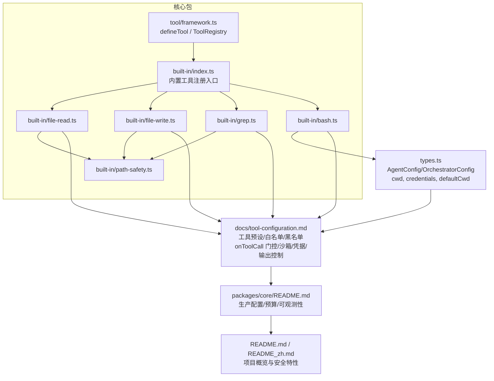
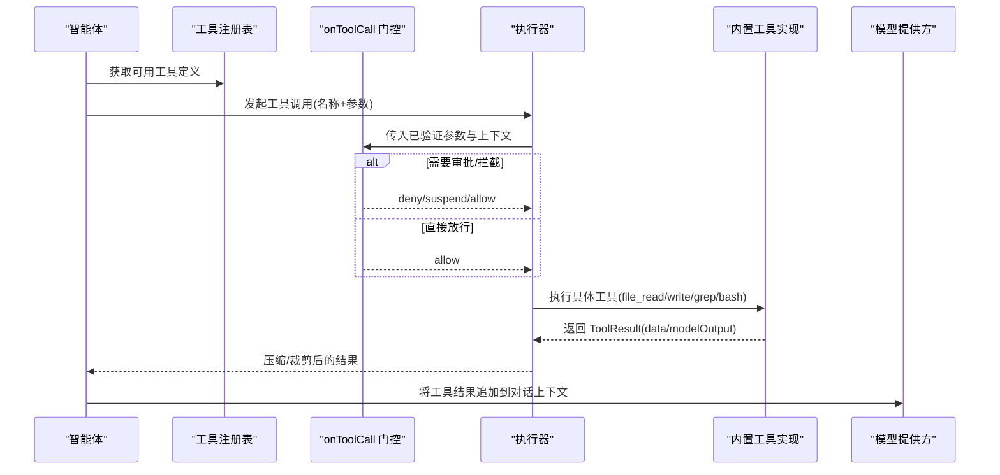
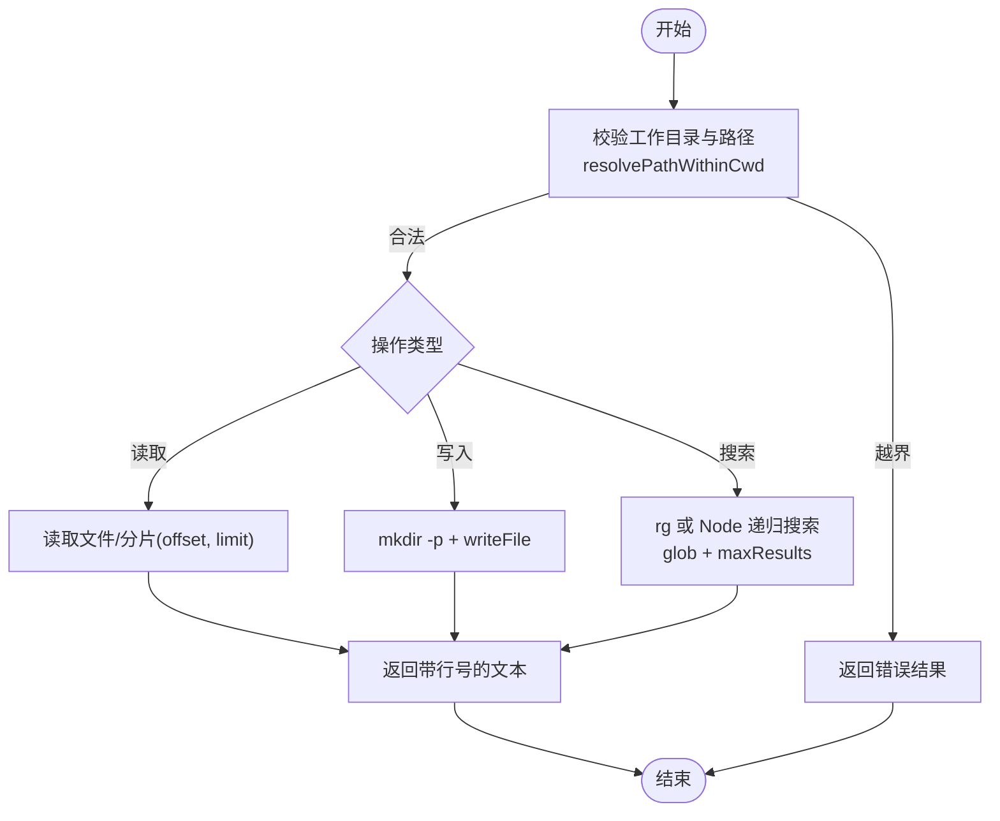
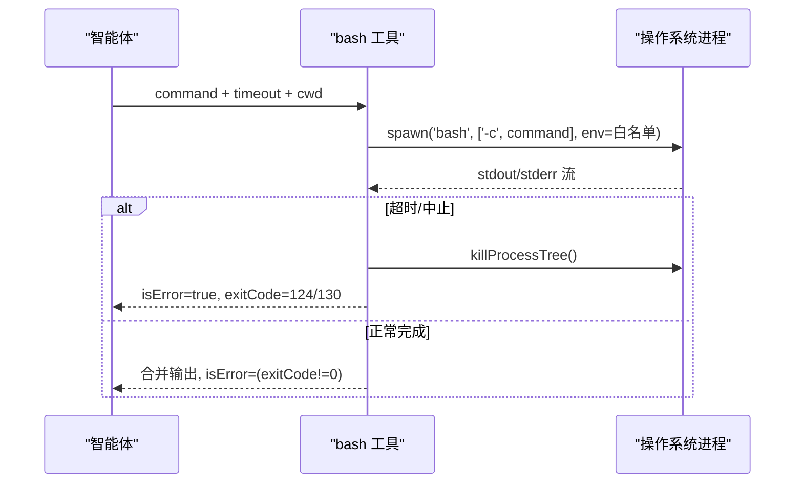
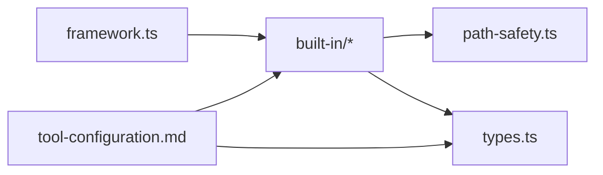

# 内置工具集

<cite>
**本文引用的文件**
- [README.md](file://README.md)
- [README_zh.md](file://README_zh.md)
- [packages/core/README.md](file://packages/core/README.md)
- [docs/tool-configuration.md](file://docs/tool-configuration.md)
- [packages/core/src/types.ts](file://packages/core/src/types.ts)
- [packages/core/src/tool/framework.ts](file://packages/core/src/tool/framework.ts)
- [packages/core/src/tool/built-in/index.ts](file://packages/core/src/tool/built-in/index.ts)
- [packages/core/src/tool/built-in/file-read.ts](file://packages/core/src/tool/built-in/file-read.ts)
- [packages/core/src/tool/built-in/file-write.ts](file://packages/core/src/tool/built-in/file-write.ts)
- [packages/core/src/tool/built-in/grep.ts](file://packages/core/src/tool/built-in/grep.ts)
- [packages/core/src/tool/built-in/bash.ts](file://packages/core/src/tool/built-in/bash.ts)
- [packages/core/src/tool/built-in/path-safety.ts](file://packages/core/src/tool/built-in/path-safety.ts)
</cite>

## 目录
1. [简介](#简介)
2. [项目结构](#项目结构)
3. [核心组件](#核心组件)
4. [架构总览](#架构总览)
5. [详细组件分析](#详细组件分析)
6. [依赖关系分析](#依赖关系分析)
7. [性能考量](#性能考量)
8. [故障排查指南](#故障排查指南)
9. [结论](#结论)
10. [附录](#附录)

## 简介
本章节面向使用 Open Multi-Agent（OMA）的开发者，系统化介绍其内置工具集：文件系统操作、网络请求与外部集成、进程执行的安全限制与执行环境、参数配置与返回值格式、安全沙箱与权限控制、常见场景示例以及选型与优化建议。内置工具默认拒绝（default-deny），需显式授权；所有工具结果会进入模型对话上下文，需谨慎授予读/写/执行能力。

## 项目结构
OMA 的工具体系位于 core 包的 tool 子系统中，包含工具定义框架、内置工具实现、路径安全与执行器。顶层文档提供了工具配置、沙箱策略、凭据隔离、输出控制等关键说明。

图表来源
- [packages/core/src/tool/framework.ts:71-117](file://packages/core/src/tool/framework.ts#L71-L117)
- [packages/core/src/tool/built-in/index.ts](file://packages/core/src/tool/built-in/index.ts)
- [packages/core/src/tool/built-in/file-read.ts:17-45](file://packages/core/src/tool/built-in/file-read.ts#L17-L45)
- [packages/core/src/tool/built-in/file-write.ts:18-35](file://packages/core/src/tool/built-in/file-write.ts#L18-L35)
- [packages/core/src/tool/built-in/grep.ts:29-67](file://packages/core/src/tool/built-in/grep.ts#L29-L67)
- [packages/core/src/tool/built-in/bash.ts:37-60](file://packages/core/src/tool/built-in/bash.ts#L37-L60)
- [packages/core/src/types.ts:544-557](file://packages/core/src/types.ts#L544-L557)
- [docs/tool-configuration.md:214-289](file://docs/tool-configuration.md#L214-L289)

章节来源
- [packages/core/README.md:237-308](file://packages/core/README.md#L237-L308)
- [docs/tool-configuration.md:214-289](file://docs/tool-configuration.md#L214-L289)
- [packages/core/src/types.ts:544-557](file://packages/core/src/types.ts#L544-L557)

## 核心组件
- 工具定义框架：通过 defineTool 声明 name/description/inputSchema/outputSchema/consequential/maxOutputChars/execute，并统一转换为 LLM 可用的 JSON Schema。
- 工具注册表：ToolRegistry 管理工具集合，导出 toToolDefs/toLLMTools，供编排器在每次 LLM 调用前注入可用工具。
- 内置工具：file_read、file_write、grep、bash 等，均遵循默认拒绝与沙箱约束（除 bash 外）。
- 安全与权限：默认拒绝内置工具；支持 preset/tools/disallowedTools；onToolCall 逐次门控；credentials 按 Agent 隔离；cwd/defaultCwd 控制文件系统沙箱根目录。
- 输出控制：maxToolOutputChars、compressToolResults、rich modelOutput（文本/图片/文件）与 provider 映射。

章节来源
- [packages/core/src/tool/framework.ts:71-117](file://packages/core/src/tool/framework.ts#L71-L117)
- [packages/core/src/tool/framework.ts:127-260](file://packages/core/src/tool/framework.ts#L127-L260)
- [docs/tool-configuration.md:214-289](file://docs/tool-configuration.md#L214-L289)
- [docs/tool-configuration.md:469-505](file://docs/tool-configuration.md#L469-L505)
- [docs/tool-configuration.md:507-648](file://docs/tool-configuration.md#L507-L648)

## 架构总览
下图展示一次工具调用的端到端流程：从 Agent 发起调用，经工具注册表解析、输入校验、可选门控（onToolCall）、执行器运行具体工具，再到结果压缩与返回给模型。

图表来源
- [packages/core/src/tool/framework.ts:204-260](file://packages/core/src/tool/framework.ts#L204-L260)
- [docs/tool-configuration.md:326-360](file://docs/tool-configuration.md#L326-L360)
- [docs/tool-configuration.md:507-648](file://docs/tool-configuration.md#L507-L648)

## 详细组件分析

### 文件系统工具
- file_read：读取文件内容并以“行号\t内容”形式返回，支持 offset/limit 分块读取大文件。路径必须绝对且受 cwd 沙箱限制。
- file_write：创建或覆盖文件，自动创建父目录；标记为 consequential（有副作用）。
- grep：优先使用 ripgrep 提升性能，回退到 Node.js 递归搜索；支持 glob 过滤与 maxResults 限制；结果包含文件路径与行号。
- 路径安全：所有文件系统工具通过 resolvePathWithinCwd 进行路径归一化与越界检查，symlink 也会被提前解析以阻止逃逸。

图表来源
- [packages/core/src/tool/built-in/file-read.ts:17-45](file://packages/core/src/tool/built-in/file-read.ts#L17-L45)
- [packages/core/src/tool/built-in/file-read.ts:47-111](file://packages/core/src/tool/built-in/file-read.ts#L47-L111)
- [packages/core/src/tool/built-in/file-write.ts:18-35](file://packages/core/src/tool/built-in/file-write.ts#L18-L35)
- [packages/core/src/tool/built-in/file-write.ts:37-88](file://packages/core/src/tool/built-in/file-write.ts#L37-L88)
- [packages/core/src/tool/built-in/grep.ts:29-67](file://packages/core/src/tool/built-in/grep.ts#L29-L67)
- [packages/core/src/tool/built-in/grep.ts:69-108](file://packages/core/src/tool/built-in/grep.ts#L69-L108)
- [packages/core/src/tool/built-in/grep.ts:122-193](file://packages/core/src/tool/built-in/grep.ts#L122-L193)
- [packages/core/src/tool/built-in/grep.ts:205-273](file://packages/core/src/tool/built-in/grep.ts#L205-L273)

章节来源
- [packages/core/src/tool/built-in/file-read.ts:17-111](file://packages/core/src/tool/built-in/file-read.ts#L17-L111)
- [packages/core/src/tool/built-in/file-write.ts:18-88](file://packages/core/src/tool/built-in/file-write.ts#L18-L88)
- [packages/core/src/tool/built-in/grep.ts:29-273](file://packages/core/src/tool/built-in/grep.ts#L29-L273)
- [docs/tool-configuration.md:391-440](file://docs/tool-configuration.md#L391-L440)

### 进程执行工具（bash）
- 功能：执行 shell 命令，返回 stdout/stderr 与退出码；支持超时与自定义工作目录。
- 安全限制：
  - 非交互模式（bash -c）。
  - 环境变量白名单过滤，敏感名会被剔除。
  - 超时与 AbortSignal 触发后，整棵进程树被终止，避免后台子进程泄漏。
  - 输出中的敏感信息会被脱敏。
  - 注意：bash 本身不受 cwd 路径沙箱限制，仅文件系统工具受路径限制。
- 返回值：合并 stdout/stderr 的可读字符串；非零退出码视为错误结果。

图表来源
- [packages/core/src/tool/built-in/bash.ts:37-79](file://packages/core/src/tool/built-in/bash.ts#L37-L79)
- [packages/core/src/tool/built-in/bash.ts:100-195](file://packages/core/src/tool/built-in/bash.ts#L100-L195)
- [packages/core/src/tool/built-in/bash.ts:198-240](file://packages/core/src/tool/built-in/bash.ts#L198-L240)

章节来源
- [packages/core/src/tool/built-in/bash.ts:37-240](file://packages/core/src/tool/built-in/bash.ts#L37-L240)

### 网络请求与 API 调用
- OMA 未提供专用“http_fetch”内置工具。网络访问通常通过以下方式实现：
  - 在自定义工具中调用 Node fetch/axios 等库，并通过 ToolUseContext.credentials 注入密钥。
  - 通过 MCP（Model Context Protocol）接入外部服务工具。
  - 通过 Process/ACP 后端让外部 CLI 执行网络任务。
- 安全建议：
  - 使用 per-agent credentials 隔离密钥。
  - 对输出做 schema 校验与长度限制，避免泄露敏感数据。
  - 结合 onToolCall 对高风险 URL 或域名进行白名单/黑名单控制。

章节来源
- [docs/tool-configuration.md:469-505](file://docs/tool-configuration.md#L469-L505)
- [docs/tool-configuration.md:675-709](file://docs/tool-configuration.md#L675-L709)
- [packages/core/src/types.ts:983-1009](file://packages/core/src/types.ts#L983-L1009)

### 工具参数、返回值与使用要点
- 通用参数
  - inputSchema：Zod 定义的输入参数，运行时由框架校验。
  - outputSchema：可选，校验工具返回的 data。
  - consequential：标记具副作用的工具（如 file_write、bash）。
  - maxOutputChars：单工具输出上限，超出将被截断。
- 返回值
  - ToolResult.data：应用侧保留的数据。
  - ToolResult.modelOutput：可选，发送给模型的富媒体（文本/图片/文件）。
  - ToolResult.isError：是否错误结果。
- 使用要点
  - 路径类工具要求绝对路径，并受 cwd 沙箱限制。
  - 长输出应设置 maxOutputChars 或使用 compressToolResults 压缩历史。
  - 对敏感输出启用脱敏与隐私控制。

章节来源
- [packages/core/src/tool/framework.ts:71-117](file://packages/core/src/tool/framework.ts#L71-L117)
- [docs/tool-configuration.md:507-648](file://docs/tool-configuration.md#L507-L648)
- [packages/core/src/tool/built-in/file-read.ts:25-45](file://packages/core/src/tool/built-in/file-read.ts#L25-L45)
- [packages/core/src/tool/built-in/file-write.ts:27-35](file://packages/core/src/tool/built-in/file-write.ts#L27-L35)
- [packages/core/src/tool/built-in/grep.ts:39-67](file://packages/core/src/tool/built-in/grep.ts#L39-L67)
- [packages/core/src/tool/built-in/bash.ts:47-60](file://packages/core/src/tool/built-in/bash.ts#L47-L60)

### 安全沙箱与权限控制
- 默认拒绝：内置工具（bash、file_*、grep、glob）默认不可用，需通过 tools/toolPreset 显式授权。
- 预设与过滤：readonly/readwrite/full 预设，配合 tools（白名单）与 disallowedTools（黑名单）精确控制。
- 沙箱根目录：
  - AgentConfig.cwd 或 OrchestratorConfig.defaultCwd 控制文件系统工具的工作目录。
  - 默认 <process.cwd()>/.agent-workspace，首次写入时自动创建。
  - 设为 null 可禁用沙箱（不推荐用于不受信环境）。
- 门控 with onToolCall：
  - 基于工具名与参数进行细粒度放行/拒绝/挂起。
  - 支持风险分类器（bash 命令分级 safe/review/high）。
  - 可结合持久化审批（durable approvals）实现人工审核。
- 凭据隔离：per-agent credentials 仅在对应 Agent 的工具中可见，不会跨 Agent 继承。

章节来源
- [docs/tool-configuration.md:214-289](file://docs/tool-configuration.md#L214-L289)
- [docs/tool-configuration.md:326-390](file://docs/tool-configuration.md#L326-L390)
- [docs/tool-configuration.md:391-440](file://docs/tool-configuration.md#L391-L440)
- [docs/tool-configuration.md:469-505](file://docs/tool-configuration.md#L469-L505)
- [packages/core/src/types.ts:544-557](file://packages/core/src/types.ts#L544-L557)
- [packages/core/src/types.ts:983-1009](file://packages/core/src/types.ts#L983-L1009)

### 常见使用场景与参考示例
- 只读分析：授予 readonly 预设（file_read、grep、glob），适合日志分析、代码检索。
- 编辑与生成：授予 readwrite 预设（file_read、file_write、file_edit、grep、glob），适合代码重构、批量替换。
- 系统运维：授予 full 预设（含 bash），适合安装依赖、构建脚本、容器操作；务必配合 onToolCall 与风险分类器。
- 外部系统集成：通过自定义工具或 MCP 接入 HTTP API；使用 per-agent credentials 隔离密钥。
- 参考示例路径（不展开代码）：
  - 工具使用与沙箱：[packages/core/examples/patterns/rich-tool-results.ts](file://packages/core/examples/patterns/rich-tool-results.ts)
  - 风险门控 bash：[packages/core/examples/patterns/risk-gated-bash.ts](file://packages/core/examples/patterns/risk-gated-bash.ts)
  - MCP 集成 GitHub：[packages/core/examples/integrations/mcp-github.ts](file://packages/core/examples/integrations/mcp-github.ts)

章节来源
- [docs/tool-configuration.md:251-289](file://docs/tool-configuration.md#L251-L289)
- [docs/tool-configuration.md:675-709](file://docs/tool-configuration.md#L675-L709)
- [packages/core/README.md:254-271](file://packages/core/README.md#L254-L271)

## 依赖关系分析
- 工具定义与注册：framework.ts 提供 defineTool 与 ToolRegistry，是全部工具的抽象基础。
- 内置工具实现：file_read/file_write/grep/bash 分别实现不同能力，均依赖 path-safety 进行路径安全校验。
- 配置与类型：types.ts 定义了 AgentConfig/OrchestratorConfig 中与工具相关的字段（cwd、credentials、defaultCwd、toolPreset 等）。
- 文档与最佳实践：tool-configuration.md 集中描述权限、沙箱、门控、输出控制与 MCP 集成。

图表来源
- [packages/core/src/tool/framework.ts:71-117](file://packages/core/src/tool/framework.ts#L71-L117)
- [packages/core/src/tool/built-in/file-read.ts:11-12](file://packages/core/src/tool/built-in/file-read.ts#L11-L12)
- [packages/core/src/tool/built-in/file-write.ts:11-12](file://packages/core/src/tool/built-in/file-write.ts#L11-L12)
- [packages/core/src/tool/built-in/grep.ts:16-17](file://packages/core/src/tool/built-in/grep.ts#L16-L17)
- [packages/core/src/types.ts:544-557](file://packages/core/src/types.ts#L544-L557)
- [docs/tool-configuration.md:214-289](file://docs/tool-configuration.md#L214-L289)

章节来源
- [packages/core/src/tool/framework.ts:71-260](file://packages/core/src/tool/framework.ts#L71-L260)
- [packages/core/src/tool/built-in/file-read.ts:1-112](file://packages/core/src/tool/built-in/file-read.ts#L1-L112)
- [packages/core/src/tool/built-in/file-write.ts:1-89](file://packages/core/src/tool/built-in/file-write.ts#L1-L89)
- [packages/core/src/tool/built-in/grep.ts:1-292](file://packages/core/src/tool/built-in/grep.ts#L1-L292)
- [packages/core/src/tool/built-in/bash.ts:1-241](file://packages/core/src/tool/built-in/bash.ts#L1-L241)
- [packages/core/src/types.ts:544-557](file://packages/core/src/types.ts#L544-L557)
- [docs/tool-configuration.md:214-440](file://docs/tool-configuration.md#L214-L440)

## 性能考量
- 搜索性能：grep 优先使用 ripgrep，显著加速大规模目录扫描；未安装时回退 Node 实现。
- 输出体积控制：合理设置 maxToolOutputChars 与 compressToolResults，减少后续轮次的 token 消耗。
- 并行与批处理：尽量使用批量读取/搜索接口（如 grep 的 maxResults），避免多次小 IO。
- 超时与取消：bash 与 grep 均支持超时与 AbortSignal，防止长时间阻塞。
- 缓存与复用：ripgrep 可用性检测过程缓存，避免重复探测开销。

章节来源
- [packages/core/src/tool/built-in/grep.ts:90-108](file://packages/core/src/tool/built-in/grep.ts#L90-L108)
- [packages/core/src/tool/built-in/grep.ts:279-291](file://packages/core/src/tool/built-in/grep.ts#L279-L291)
- [docs/tool-configuration.md:507-648](file://docs/tool-configuration.md#L507-L648)
- [packages/core/src/tool/built-in/bash.ts:100-195](file://packages/core/src/tool/built-in/bash.ts#L100-L195)

## 故障排查指南
- 路径越界/权限不足：检查 AgentConfig.cwd 与 OrchestratorConfig.defaultCwd；确认路径为绝对路径且在沙箱内。
- 正则无效：grep 的 pattern 非法会立即返回错误；修正正则表达式。
- 命令执行失败：bash 的非零退出码即错误；查看 stderr 与 exitCode；必要时增加超时与日志。
- 输出过大：设置 maxOutputChars 或开启 compressToolResults；对富媒体结果谨慎使用 inline base64。
- 凭据未生效：确认 per-agent credentials 正确注入并在工具中读取 ctx.credentials。
- 门控拦截：检查 onToolCall 策略与风险分类器；必要时调整 allow/deny 规则。

章节来源
- [packages/core/src/tool/built-in/file-read.ts:47-111](file://packages/core/src/tool/built-in/file-read.ts#L47-L111)
- [packages/core/src/tool/built-in/file-write.ts:37-88](file://packages/core/src/tool/built-in/file-write.ts#L37-L88)
- [packages/core/src/tool/built-in/grep.ts:69-108](file://packages/core/src/tool/built-in/grep.ts#L69-L108)
- [packages/core/src/tool/built-in/bash.ts:62-79](file://packages/core/src/tool/built-in/bash.ts#L62-L79)
- [docs/tool-configuration.md:326-390](file://docs/tool-configuration.md#L326-L390)

## 结论
OMA 的内置工具集围绕“默认拒绝、最小授权、路径沙箱、可审计门控”设计，既满足日常文件与搜索需求，又为系统运维提供可控的 shell 能力。通过预设与过滤、onToolCall 门控、per-agent 凭据与输出控制，可以在安全性与易用性之间取得平衡。对于网络访问，建议通过自定义工具或 MCP 接入，并严格遵循凭据隔离与输出校验的最佳实践。

## 附录
- 快速定位：
  - 工具定义与注册：[packages/core/src/tool/framework.ts](file://packages/core/src/tool/framework.ts)
  - 内置工具实现：[packages/core/src/tool/built-in](file://packages/core/src/tool/built-in)
  - 工具配置与安全：[docs/tool-configuration.md](file://docs/tool-configuration.md)
  - 类型与配置项：[packages/core/src/types.ts](file://packages/core/src/types.ts)
- 相关文档索引：
  - 项目概览与安全特性：[README.md](file://README.md)、[README_zh.md](file://README_zh.md)
  - 核心包使用指南与生产清单：[packages/core/README.md](file://packages/core/README.md)