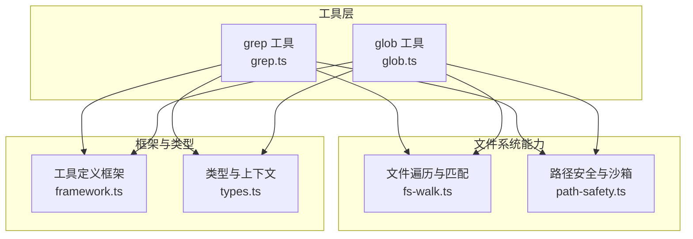
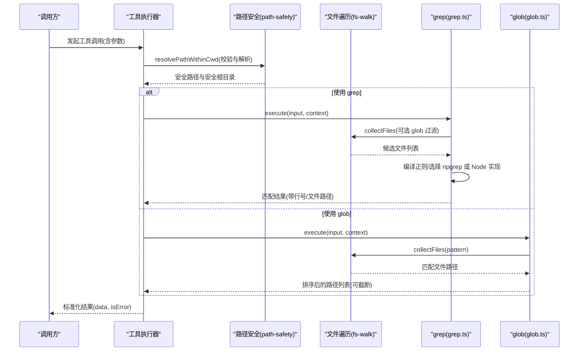
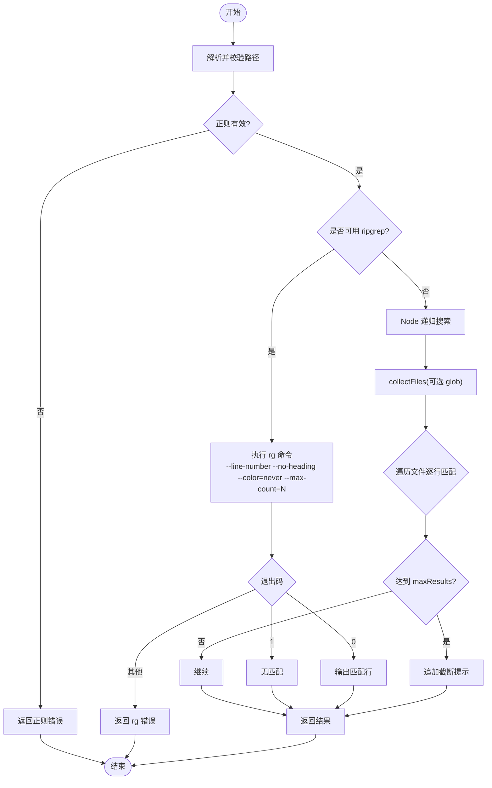
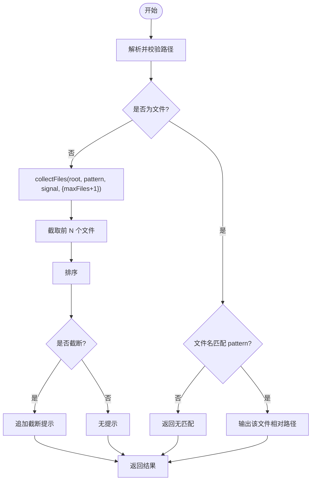
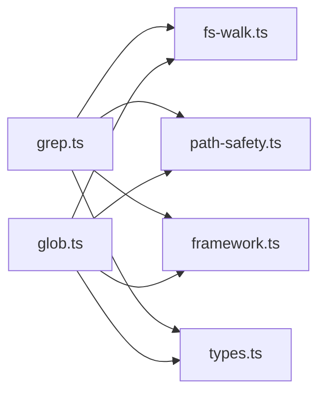

# 搜索查找工具

<cite>
**本文引用的文件**
- [grep.ts](file://packages/core/src/tool/built-in/grep.ts)
- [glob.ts](file://packages/core/src/tool/built-in/glob.ts)
- [fs-walk.ts](file://packages/core/src/tool/built-in/fs-walk.ts)
- [path-safety.ts](file://packages/core/src/tool/built-in/path-safety.ts)
- [framework.ts](file://packages/core/src/tool/framework.ts)
- [types.ts](file://packages/core/src/types.ts)
</cite>

## 目录
1. [简介](#简介)
2. [项目结构](#项目结构)
3. [核心组件](#核心组件)
4. [架构总览](#架构总览)
5. [详细组件分析](#详细组件分析)
6. [依赖关系分析](#依赖关系分析)
7. [性能考虑](#性能考虑)
8. [故障排查指南](#故障排查指南)
9. [结论](#结论)
10. [附录](#附录)

## 简介
本章节面向 Open Multi-Agent 内置的“搜索查找工具”能力，重点覆盖 grep 工具与 glob 工具。内容涵盖：
- grep 工具：文本内容搜索、正则表达式匹配、多文件搜索、结果过滤与限制等特性
- glob 工具：文件模式匹配、路径通配符、递归搜索、跳过常见大目录等能力
- 参数配置选项、搜索语法说明、性能优化技巧
- 不同搜索场景的使用方式（以代码片段路径引用代替直接贴出代码）
- 搜索结果的处理与格式化输出
- 搜索性能调优与最佳实践建议

## 项目结构
Open Multi-Agent 将搜索相关的内置工具实现集中在 core 包的 tool/built-in 目录下：
- grep 工具：packages/core/src/tool/built-in/grep.ts
- glob 工具：packages/core/src/tool/built-in/glob.ts
- 共享的文件遍历与 glob 匹配：packages/core/src/tool/built-in/fs-walk.ts
- 工作目录沙箱与路径安全校验：packages/core/src/tool/built-in/path-safety.ts
- 工具定义框架与注册机制：packages/core/src/tool/framework.ts
- 类型与上下文定义（含 cwd 沙箱语义）：packages/core/src/types.ts

图表来源
- [grep.ts:29-108](file://packages/core/src/tool/built-in/grep.ts#L29-L108)
- [glob.ts:18-106](file://packages/core/src/tool/built-in/glob.ts#L18-L106)
- [fs-walk.ts:31-99](file://packages/core/src/tool/built-in/fs-walk.ts#L31-L99)
- [path-safety.ts:30-97](file://packages/core/src/tool/built-in/path-safety.ts#L30-L97)
- [framework.ts:71-117](file://packages/core/src/tool/framework.ts#L71-L117)
- [types.ts:544-557](file://packages/core/src/types.ts#L544-L557)

章节来源
- [grep.ts:29-108](file://packages/core/src/tool/built-in/grep.ts#L29-L108)
- [glob.ts:18-106](file://packages/core/src/tool/built-in/glob.ts#L18-L106)
- [fs-walk.ts:31-99](file://packages/core/src/tool/built-in/fs-walk.ts#L31-L99)
- [path-safety.ts:30-97](file://packages/core/src/tool/built-in/path-safety.ts#L30-L97)
- [framework.ts:71-117](file://packages/core/src/tool/framework.ts#L71-L117)
- [types.ts:544-557](file://packages/core/src/types.ts#L544-L557)

## 核心组件
- grep 工具：在文件或目录中按正则搜索内容，优先使用外部 ripgrep 提升性能；未安装时回退到 Node.js 递归实现；支持 glob 过滤、最大结果数限制、行号输出、中止信号支持。
- glob 工具：列出匹配文件名模式的文件路径，不读取文件内容；支持递归遍历、跳过常见大目录、最大文件数限制、排序输出与截断提示。
- 文件遍历与匹配：提供 collectFiles 与 matchesGlob，统一 glob 行为与跳过规则。
- 路径安全与沙箱：强制绝对路径、解析真实路径、限制在 agent 工作目录内，避免越权访问。
- 工具定义框架：通过 defineTool 声明工具名称、描述、输入 schema、执行函数等，并转换为 LLM 可用的 JSON Schema。

章节来源
- [grep.ts:29-108](file://packages/core/src/tool/built-in/grep.ts#L29-L108)
- [glob.ts:18-106](file://packages/core/src/tool/built-in/glob.ts#L18-L106)
- [fs-walk.ts:31-99](file://packages/core/src/tool/built-in/fs-walk.ts#L31-L99)
- [path-safety.ts:30-97](file://packages/core/src/tool/built-in/path-safety.ts#L30-L97)
- [framework.ts:71-117](file://packages/core/src/tool/framework.ts#L71-L117)

## 架构总览
下图展示了从调用方到工具执行的完整流程，包括路径安全校验、文件收集、正则匹配/外部进程调用、结果格式化与返回。

图表来源
- [grep.ts:69-108](file://packages/core/src/tool/built-in/grep.ts#L69-L108)
- [glob.ts:51-106](file://packages/core/src/tool/built-in/glob.ts#L51-L106)
- [fs-walk.ts:31-99](file://packages/core/src/tool/built-in/fs-walk.ts#L31-L99)
- [path-safety.ts:30-97](file://packages/core/src/tool/built-in/path-safety.ts#L30-L97)

## 详细组件分析

### grep 工具（grepTool）
- 功能概述
  - 在指定路径下搜索正则表达式匹配的行，返回“文件路径:行号:内容”格式
  - 支持 glob 过滤（当 path 为目录时生效）
  - 支持 maxResults 限制返回行数，避免响应过大
  - 优先使用 ripgrep（rg）以提升性能；不可用时回退到 Node.js 递归实现
  - 支持 AbortSignal 中止搜索
- 参数说明
  - pattern：必填，正则表达式
  - path：可选，绝对路径（文件或目录），默认使用工具工作目录
  - glob：可选，仅当 path 为目录时用于过滤文件
  - maxResults：可选，正整数，限制返回匹配行数
- 执行流程
  - 校验并解析路径（必须为绝对路径且在沙箱内）
  - 编译正则，失败立即返回错误
  - 若存在 ripgrep，则构造 rg 命令并执行；否则走 Node.js 实现
  - Node.js 实现：collectFiles 收集文件，逐行正则匹配，记录 file/lineNumber/text
  - 结果拼接为“文件:行号:内容”，并在达到上限时附加截断提示
- 性能要点
  - 使用 ripgrep 时通过 --max-count 控制结果数量，减少 I/O
  - Node.js 回退实现中每行重置 lastIndex，避免全局正则状态污染
  - 支持 AbortSignal，可在长时间扫描中及时中断
- 错误处理
  - 非法正则：直接返回错误
  - 无法访问路径：返回错误信息
  - ripgrep 非零退出码：返回错误（0 表示成功，1 表示无匹配）
  - 子进程错误：返回可重试提示
- 使用示例（以路径引用代替代码）
  - 在某个目录下搜索包含特定标识的代码行：[grep.ts:69-108](file://packages/core/src/tool/built-in/grep.ts#L69-L108)
  - 限制返回行数并附加截断提示：[grep.ts:260-272](file://packages/core/src/tool/built-in/grep.ts#L260-L272)
  - 使用 ripgrep 并传入 glob 过滤：[grep.ts:122-138](file://packages/core/src/tool/built-in/grep.ts#L122-L138)

图表来源
- [grep.ts:69-108](file://packages/core/src/tool/built-in/grep.ts#L69-L108)
- [grep.ts:122-193](file://packages/core/src/tool/built-in/grep.ts#L122-L193)
- [grep.ts:205-273](file://packages/core/src/tool/built-in/grep.ts#L205-L273)

章节来源
- [grep.ts:29-108](file://packages/core/src/tool/built-in/grep.ts#L29-L108)
- [grep.ts:122-193](file://packages/core/src/tool/built-in/grep.ts#L122-L193)
- [grep.ts:205-273](file://packages/core/src/tool/built-in/grep.ts#L205-L273)

### glob 工具（globTool）
- 功能概述
  - 列出目录或文件下匹配文件名模式的文件路径，不读取文件内容
  - 跳过常见大目录（如 node_modules、.git、dist 等）
  - 支持递归搜索与最大文件数限制
  - 结果按本地化顺序排序，超出限制时附加截断提示
- 参数说明
  - path：可选，绝对路径（文件或目录），默认使用工具工作目录
  - pattern：可选，文件名 glob（如 "*.ts"、"**/*.json"）
  - maxFiles：可选，正整数，限制返回文件路径数量
- 执行流程
  - 校验并解析路径（必须为绝对路径且在沙箱内）
  - 若 path 为文件：判断文件名是否匹配 pattern，匹配则输出相对路径
  - 若 path 为目录：collectFiles 递归收集，应用 pattern 过滤与 maxFiles 限制
  - 对结果进行排序并拼接为换行分隔的字符串，必要时附加截断提示
- 性能要点
  - 使用 SKIP_DIRS 跳过不必要的大目录
  - collectFiles 内部支持 maxFiles 提前终止，避免全量遍历
  - 结果排序仅在内存中进行，适合合理范围内的文件集合
- 使用示例（以路径引用代替代码）
  - 列出某目录下所有 TypeScript 文件：[glob.ts:51-106](file://packages/core/src/tool/built-in/glob.ts#L51-L106)
  - 限制返回文件数量并获取截断提示：[glob.ts:77-99](file://packages/core/src/tool/built-in/glob.ts#L77-L99)

图表来源
- [glob.ts:51-106](file://packages/core/src/tool/built-in/glob.ts#L51-L106)
- [fs-walk.ts:31-99](file://packages/core/src/tool/built-in/fs-walk.ts#L31-L99)

章节来源
- [glob.ts:18-106](file://packages/core/src/tool/built-in/glob.ts#L18-L106)
- [fs-walk.ts:31-99](file://packages/core/src/tool/built-in/fs-walk.ts#L31-L99)

### 文件遍历与匹配（fs-walk.ts）
- 提供 collectFiles 与 matchesGlob，供 grep 与 glob 共用
- 跳过目录：.git、.svn、.hg、node_modules、.next、dist、build
- 支持 glob 模式：*.ext 与 **/<pattern>，大小写不敏感
- 支持 AbortSignal 与 maxFiles 提前终止，提高大规模目录遍历效率

章节来源
- [fs-walk.ts:11-20](file://packages/core/src/tool/built-in/fs-walk.ts#L11-L20)
- [fs-walk.ts:31-99](file://packages/core/src/tool/built-in/fs-walk.ts#L31-L99)

### 路径安全与沙箱（path-safety.ts）
- 默认工作目录：当前进程工作目录下的 .agent-workspace
- 强制绝对路径：非绝对路径直接拒绝
- 沙箱边界：确保目标路径在安全根目录内，防止越权访问
- 符号链接处理：解析真实路径，避免 TOCTOU 风险
- 可通过 OrchestratorConfig.defaultCwd / AgentConfig.cwd 调整或禁用沙箱

章节来源
- [path-safety.ts:5-24](file://packages/core/src/tool/built-in/path-safety.ts#L5-L24)
- [path-safety.ts:30-97](file://packages/core/src/tool/built-in/path-safety.ts#L30-L97)
- [types.ts:544-557](file://packages/core/src/types.ts#L544-L557)

### 工具定义框架（framework.ts）
- defineTool：声明工具的名称、描述、输入 schema、执行函数等
- ToolRegistry：注册、列举、转换工具定义为 LLM 可用的 JSON Schema
- zodToJsonSchema：将 Zod schema 转换为 JSON Schema，便于 LLM 理解参数

章节来源
- [framework.ts:71-117](file://packages/core/src/tool/framework.ts#L71-L117)
- [framework.ts:204-260](file://packages/core/src/tool/framework.ts#L204-L260)

## 依赖关系分析
- grep 与 glob 均依赖 fs-walk 进行文件收集与 glob 匹配
- 两者都通过 path-safety 进行路径安全校验，确保在沙箱内操作
- 工具通过 framework 的 defineTool 暴露给系统，并由运行时调度执行
- types 定义了工具上下文（如 cwd、abortSignal）与通用类型

图表来源
- [grep.ts:29-108](file://packages/core/src/tool/built-in/grep.ts#L29-L108)
- [glob.ts:18-106](file://packages/core/src/tool/built-in/glob.ts#L18-L106)
- [fs-walk.ts:31-99](file://packages/core/src/tool/built-in/fs-walk.ts#L31-L99)
- [path-safety.ts:30-97](file://packages/core/src/tool/built-in/path-safety.ts#L30-L97)
- [framework.ts:71-117](file://packages/core/src/tool/framework.ts#L71-L117)
- [types.ts:544-557](file://packages/core/src/types.ts#L544-L557)

章节来源
- [grep.ts:29-108](file://packages/core/src/tool/built-in/grep.ts#L29-L108)
- [glob.ts:18-106](file://packages/core/src/tool/built-in/glob.ts#L18-L106)
- [fs-walk.ts:31-99](file://packages/core/src/tool/built-in/fs-walk.ts#L31-L99)
- [path-safety.ts:30-97](file://packages/core/src/tool/built-in/path-safety.ts#L30-L97)
- [framework.ts:71-117](file://packages/core/src/tool/framework.ts#L71-L117)
- [types.ts:544-557](file://packages/core/src/types.ts#L544-L557)

## 性能考虑
- 优先使用 ripgrep：在具备 rg 的环境下，grep 工具会调用外部进程以获得更好的性能与更低的内存占用
- 限制结果规模：通过 grep 的 maxResults 与 glob 的 maxFiles 控制输出体量，避免响应过大
- 缩小搜索范围：使用 glob 精确限定文件类型或目录，减少不必要的遍历
- 利用跳过目录：fs-walk 自动跳过 node_modules、.git、dist 等大目录，降低 I/O 压力
- 中止与超时：通过 AbortSignal 支持取消长时间运行的搜索任务
- 正则优化：避免过于宽泛的正则表达式；尽量使用锚点或具体片段以减少匹配开销
- 路径安全：确保在沙箱内操作，避免跨目录导致的额外权限检查与路径解析成本

[本节为通用指导，无需特定文件来源]

## 故障排查指南
- 路径错误
  - 现象：报错提示路径必须为绝对路径或在沙箱外
  - 原因：未传入绝对路径或目标路径不在 agent 工作目录内
  - 解决：传入绝对路径，或通过配置扩大/关闭沙箱
  - 参考：[path-safety.ts:30-97](file://packages/core/src/tool/built-in/path-safety.ts#L30-L97)
- 正则无效
  - 现象：grep 返回正则错误
  - 原因：pattern 不是合法的正则表达式
  - 解决：修正正则语法后再试
  - 参考：[grep.ts:79-88](file://packages/core/src/tool/built-in/grep.ts#L79-L88)
- 无匹配结果
  - 现象：返回“无匹配”
  - 原因：确实没有匹配项或 glob 过滤过严
  - 解决：放宽 pattern 或调整 glob
  - 参考：[grep.ts:169-171](file://packages/core/src/tool/built-in/grep.ts#L169-L171)、[glob.ts:92-94](file://packages/core/src/tool/built-in/glob.ts#L92-L94)
- ripgrep 错误
  - 现象：返回 rg 进程错误或非零退出码
  - 原因：rg 不可用或命令执行异常
  - 解决：检查 rg 安装与环境；或依赖 Node.js 回退实现
  - 参考：[grep.ts:153-191](file://packages/core/src/tool/built-in/grep.ts#L153-L191)
- 结果被截断
  - 现象：输出末尾提示已限制数量
  - 原因：达到 maxResults 或 maxFiles 上限
  - 解决：增大限制值或进一步缩小搜索范围
  - 参考：[grep.ts:264-272](file://packages/core/src/tool/built-in/grep.ts#L264-L272)、[glob.ts:96-99](file://packages/core/src/tool/built-in/glob.ts#L96-L99)

章节来源
- [path-safety.ts:30-97](file://packages/core/src/tool/built-in/path-safety.ts#L30-L97)
- [grep.ts:79-88](file://packages/core/src/tool/built-in/grep.ts#L79-L88)
- [grep.ts:169-171](file://packages/core/src/tool/built-in/grep.ts#L169-L171)
- [glob.ts:92-94](file://packages/core/src/tool/built-in/glob.ts#L92-L94)
- [grep.ts:153-191](file://packages/core/src/tool/built-in/grep.ts#L153-L191)
- [grep.ts:264-272](file://packages/core/src/tool/built-in/grep.ts#L264-L272)
- [glob.ts:96-99](file://packages/core/src/tool/built-in/glob.ts#L96-L99)

## 结论
Open Multi-Agent 的搜索查找工具提供了高效、安全的文件与内容检索能力：
- grep 工具支持正则搜索、多文件扫描、结果限制与高性能回退策略
- glob 工具提供灵活的文件模式匹配与递归遍历，且内置跳过大目录策略
- 通过路径沙箱与统一的工具定义框架，保证安全性与可扩展性
- 结合合理的参数配置与搜索语法，可以在大规模代码库中快速定位目标

[本节为总结性内容，无需特定文件来源]

## 附录
- 常用搜索场景与对应实现位置（以路径引用代替代码）
  - 在目录中搜索包含特定标识的代码行：[grep.ts:69-108](file://packages/core/src/tool/built-in/grep.ts#L69-L108)
  - 限制返回行数并查看截断提示：[grep.ts:260-272](file://packages/core/src/tool/built-in/grep.ts#L260-L272)
  - 使用 ripgrep 并传入 glob 过滤：[grep.ts:122-138](file://packages/core/src/tool/built-in/grep.ts#L122-L138)
  - 列出某目录下所有 TypeScript 文件：[glob.ts:51-106](file://packages/core/src/tool/built-in/glob.ts#L51-L106)
  - 限制返回文件数量并获取截断提示：[glob.ts:77-99](file://packages/core/src/tool/built-in/glob.ts#L77-L99)
- 搜索语法要点
  - grep 使用 JavaScript 正则表达式；注意转义字符与锚点
  - glob 支持 *.ext 与 **/<pattern>，大小写不敏感
- 性能调优清单
  - 使用 ripgrep（如可用）
  - 设置合理的 maxResults/maxFiles
  - 使用 glob 缩小搜索范围
  - 利用跳过目录减少 I/O
  - 使用 AbortSignal 控制长时间任务
  - 避免过于宽泛的正则表达式

[本节为补充信息，无需特定文件来源]