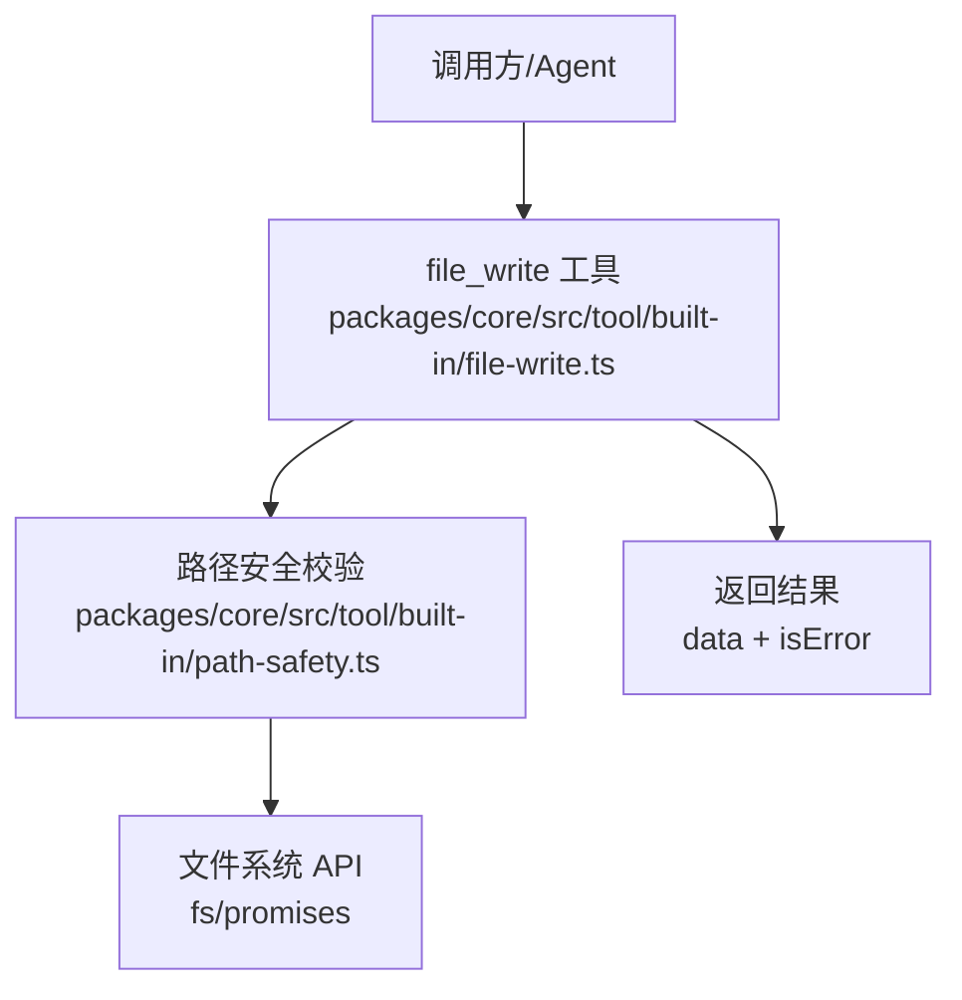
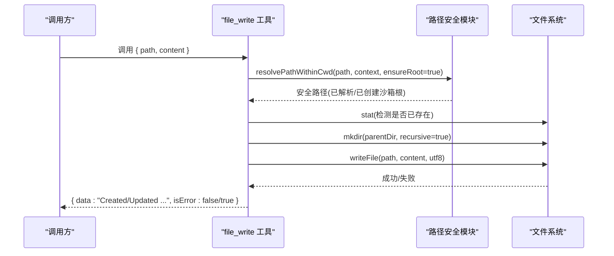
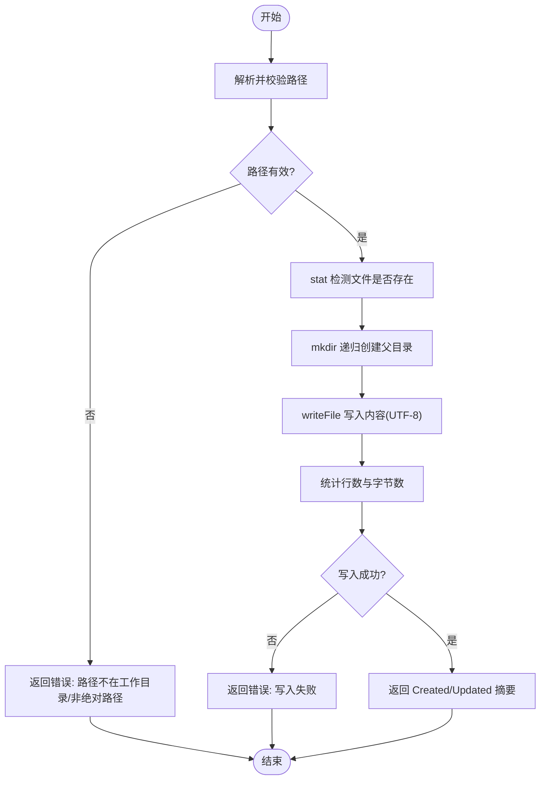
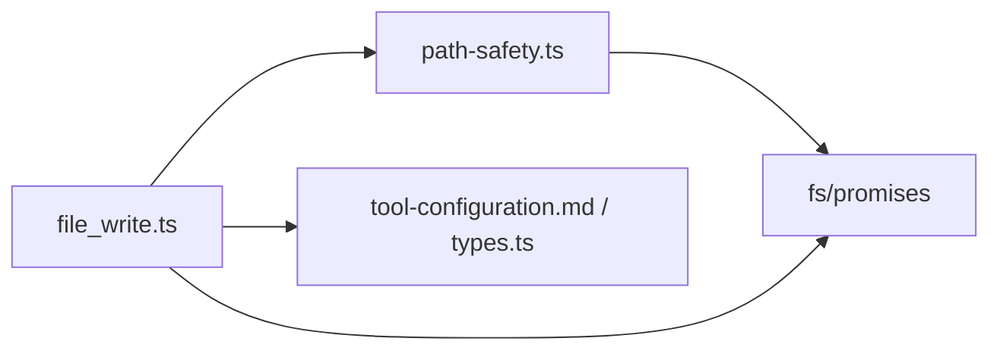

# 文件写入工具

<cite>
**本文引用的文件**
- [file-write.ts](file://packages/core/src/tool/built-in/file-write.ts)
- [path-safety.ts](file://packages/core/src/tool/built-in/path-safety.ts)
- [tool-configuration.md](file://docs/tool-configuration.md)
- [built-in-tools.test.ts](file://packages/core/tests/built-in-tools.test.ts)
- [types.ts](file://packages/core/src/types.ts)
</cite>

## 目录
1. [简介](#简介)
2. [项目结构](#项目结构)
3. [核心组件](#核心组件)
4. [架构总览](#架构总览)
5. [详细组件分析](#详细组件分析)
6. [依赖关系分析](#依赖关系分析)
7. [性能考虑](#性能考虑)
8. [故障排查指南](#故障排查指南)
9. [结论](#结论)
10. [附录](#附录)

## 简介
本文件详细说明 Open Multi-Agent 内置的文件写入工具 fileWriteTool（工具名：file_write）。该工具用于创建新文件或覆盖现有文件并写入内容，自动创建缺失的父目录，并在沙箱工作目录下进行路径安全校验。它属于“后果性”工具，默认需要显式授权与可选确认策略。

## 项目结构
- 工具实现位于 packages/core/src/tool/built-in/file-write.ts
- 路径安全与沙箱解析位于 packages/core/src/tool/built-in/path-safety.ts
- 工具配置、沙箱与工作目录说明见 docs/tool-configuration.md
- 单元测试覆盖常见用例于 packages/core/tests/built-in-tools.test.ts
- 上下文与沙箱根目录配置类型定义见 packages/core/src/types.ts

图表来源
- [file-write.ts:18-88](file://packages/core/src/tool/built-in/file-write.ts#L18-L88)
- [path-safety.ts:30-97](file://packages/core/src/tool/built-in/path-safety.ts#L30-L97)

章节来源
- [file-write.ts:1-89](file://packages/core/src/tool/built-in/file-write.ts#L1-L89)
- [path-safety.ts:1-125](file://packages/core/src/tool/built-in/path-safety.ts#L1-L125)
- [tool-configuration.md:391-441](file://docs/tool-configuration.md#L391-L441)

## 核心组件
- fileWriteTool：定义工具名称、描述、输入模式与执行逻辑；负责创建或覆盖文件、自动创建父目录、统计行数与字节数并返回结果。
- 路径安全模块：将输入路径解析到沙箱工作目录内，支持自动创建沙箱根目录、拒绝越界路径、处理符号链接等。
- 工具配置与沙箱：通过 OrchestratorConfig.defaultCwd 与 AgentConfig.cwd 控制沙箱根；未设置时默认为 <process.cwd()>/.agent-workspace。

章节来源
- [file-write.ts:18-88](file://packages/core/src/tool/built-in/file-write.ts#L18-L88)
- [path-safety.ts:15-24](file://packages/core/src/tool/built-in/path-safety.ts#L15-L24)
- [path-safety.ts:30-97](file://packages/core/src/tool/built-in/path-safety.ts#L30-L97)
- [tool-configuration.md:391-441](file://docs/tool-configuration.md#L391-L441)
- [types.ts:544-557](file://packages/core/src/types.ts#L544-L557)

## 架构总览
file_write 的执行流程包括：参数校验、路径安全解析、父目录创建、写入文件、统计信息生成与结果返回。所有路径均受沙箱约束，确保不会写入工作目录之外。

图表来源
- [file-write.ts:37-86](file://packages/core/src/tool/built-in/file-write.ts#L37-L86)
- [path-safety.ts:30-97](file://packages/core/src/tool/built-in/path-safety.ts#L30-L97)

## 详细组件分析

### 工具定义与执行流程
- 工具名：file_write
- 后果性：consequential = true（需按策略授权与可选确认）
- 输入模式：
  - path：字符串，必须为绝对路径
  - content：字符串，要写入的完整内容
- 执行步骤：
  1) 使用路径安全模块解析并校验路径，必要时自动创建沙箱根目录
  2) 检查目标文件是否存在以区分“新建”与“更新”
  3) 递归创建父目录
  4) 以 UTF-8 编码写入文件
  5) 计算行数和字节数，返回结构化结果

图表来源
- [file-write.ts:37-86](file://packages/core/src/tool/built-in/file-write.ts#L37-L86)

章节来源
- [file-write.ts:18-88](file://packages/core/src/tool/built-in/file-write.ts#L18-L88)

### 参数配置说明
- path：目标文件的绝对路径。必须为绝对路径，且最终解析后必须在当前 Agent 的工作目录（沙箱）内。
- content：要写入的完整内容。内部以 UTF-8 编码写入。
- overwrite：该工具没有单独的 overwrite 参数；当目标文件已存在时，会直接覆盖写入。若需追加而非覆盖，请使用其他工具或在应用层合并后再写入。

章节来源
- [file-write.ts:27-35](file://packages/core/src/tool/built-in/file-write.ts#L27-L35)
- [file-write.ts:43-67](file://packages/core/src/tool/built-in/file-write.ts#L43-L67)

### 文件创建机制
- 自动创建目录：父目录不存在时会递归创建；首次写入还会自动创建沙箱根目录（如 .agent-workspace）。
- 权限设置：工具本身不显式设置文件权限；平台默认权限由操作系统决定。
- 编码处理：写入时使用 UTF-8 编码。

章节来源
- [file-write.ts:52-67](file://packages/core/src/tool/built-in/file-write.ts#L52-L67)
- [path-safety.ts:50-77](file://packages/core/src/tool/built-in/path-safety.ts#L50-L77)

### 覆盖模式与追加模式
- 覆盖模式：file_write 始终覆盖目标文件内容。适用于“整文件重写”的场景。
- 追加模式：file_write 不支持追加；如需追加，应在应用层读取现有内容并与新内容合并后再次调用 file_write，或使用具备追加能力的专用工具。

章节来源
- [file-write.ts:43-67](file://packages/core/src/tool/built-in/file-write.ts#L43-L67)

### 常见操作示例（以测试为依据）
- 创建新文件：调用 file_write 指定新路径与内容，返回包含 “Created” 的结果。
- 覆盖现有文件：对已有文件再次调用，返回包含 “Updated” 的结果。
- 批量写入：多次调用 file_write 分别写入不同路径；注意每次调用独立，无事务保证。
- 自动创建深层目录：写入 deep/nested/file.txt 类路径时，会自动创建中间目录。

章节来源
- [built-in-tools.test.ts:160-213](file://packages/core/tests/built-in-tools.test.ts#L160-L213)

### 错误处理机制
- 路径冲突/越界：路径不在工作目录内或非绝对路径时，返回错误信息，提示需在沙箱内或调整工作目录。
- 权限不足：创建目录或写入文件失败时，捕获异常并返回错误消息。
- 磁盘空间不足：底层写入失败时同样被捕获并返回错误。
- 返回值约定：isError 为 true 时，data 包含错误描述；否则 data 为成功摘要。

章节来源
- [file-write.ts:52-75](file://packages/core/src/tool/built-in/file-write.ts#L52-L75)
- [path-safety.ts:41-48](file://packages/core/src/tool/built-in/path-safety.ts#L41-L48)
- [path-safety.ts:80-91](file://packages/core/src/tool/built-in/path-safety.ts#L80-L91)
- [path-safety.ts:115-123](file://packages/core/src/tool/built-in/path-safety.ts#L115-L123)

## 依赖关系分析
- file_write 依赖路径安全模块进行路径解析与沙箱校验。
- 路径安全模块依赖 Node 的 fs/promises 与 path 模块，负责 realpath、mkdir 等操作。
- 工具配置与沙箱行为受 types.ts 中上下文 cwd 字段与 docs/tool-configuration.md 中的策略影响。

图表来源
- [file-write.ts:8-12](file://packages/core/src/tool/built-in/file-write.ts#L8-L12)
- [path-safety.ts:1-3](file://packages/core/src/tool/built-in/path-safety.ts#L1-L3)
- [types.ts:544-557](file://packages/core/src/types.ts#L544-L557)
- [tool-configuration.md:391-441](file://docs/tool-configuration.md#L391-L441)

章节来源
- [file-write.ts:8-12](file://packages/core/src/tool/built-in/file-write.ts#L8-L12)
- [path-safety.ts:1-3](file://packages/core/src/tool/built-in/path-safety.ts#L1-L3)
- [types.ts:544-557](file://packages/core/src/types.ts#L544-L557)
- [tool-configuration.md:391-441](file://docs/tool-configuration.md#L391-L441)

## 性能考虑
- 小文件写入：file_write 适合一次性写入较小内容；内部直接写入，开销低。
- 大文件处理：建议分块拼接后再写入，或采用流式写入方案（在应用层实现），避免单次传递超大字符串导致内存压力。
- 缓冲策略：对于高频写入场景，可在应用层合并多次写入以减少系统调用次数。
- 并发写入：同一进程内的多次调用串行执行；跨进程并发需注意文件系统锁与一致性。

[本节提供通用指导，不直接分析具体文件]

## 故障排查指南
- 路径错误
  - 现象：返回错误，提示路径非绝对或超出工作目录。
  - 处理：确保传入绝对路径；检查沙箱根目录设置；必要时扩大或禁用沙箱。
- 写入失败
  - 现象：返回错误，提示无法创建目录或写入文件。
  - 处理：检查权限、磁盘空间、路径合法性；确认父目录可写。
- 沙箱限制
  - 现象：路径解析失败，提示不在工作目录内。
  - 处理：通过 defaultCwd/cwd 调整沙箱根；或设置为 null 禁用沙箱（谨慎使用）。

章节来源
- [file-write.ts:52-75](file://packages/core/src/tool/built-in/file-write.ts#L52-L75)
- [path-safety.ts:41-48](file://packages/core/src/tool/built-in/path-safety.ts#L41-L48)
- [path-safety.ts:80-91](file://packages/core/src/tool/built-in/path-safety.ts#L80-L91)
- [path-safety.ts:115-123](file://packages/core/src/tool/built-in/path-safety.ts#L115-L123)
- [tool-configuration.md:391-441](file://docs/tool-configuration.md#L391-L441)

## 结论
fileWriteTool 提供了简洁可靠的文件写入能力：自动创建目录、UTF-8 编码写入、沙箱路径安全校验，并以结构化结果反馈新建或更新状态。其设计强调安全性与可观测性，适合在 Agent 工作流中作为“整文件重写”的主要手段。对于追加、大文件与高并发场景，建议在应用层结合流式写入与缓冲策略进行优化。

[本节总结性内容，不直接分析具体文件]

## 附录
- 工具配置与沙箱工作目录
  - 默认沙箱根：<process.cwd()>/.agent-workspace，首次写入自动创建
  - 可通过 OrchestratorConfig.defaultCwd 或 AgentConfig.cwd 调整
  - 设置为 null 可禁用沙箱（谨慎）
- 工具授权与后果性
  - file_write 标记为 consequential，需显式授予并可启用确认策略
- 参考文档
  - 工具配置与沙箱说明：docs/tool-configuration.md
  - 类型定义与上下文：packages/core/src/types.ts

章节来源
- [tool-configuration.md:391-441](file://docs/tool-configuration.md#L391-L441)
- [types.ts:544-557](file://packages/core/src/types.ts#L544-L557)