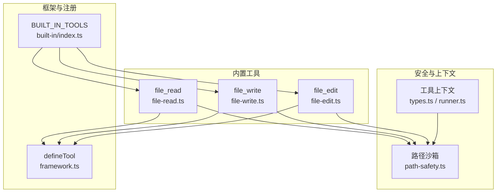
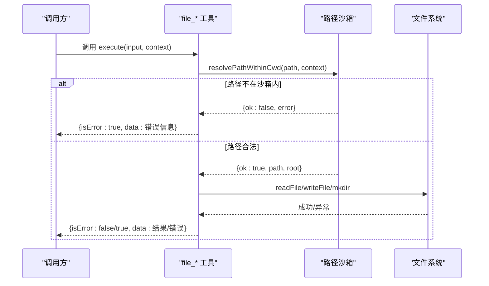
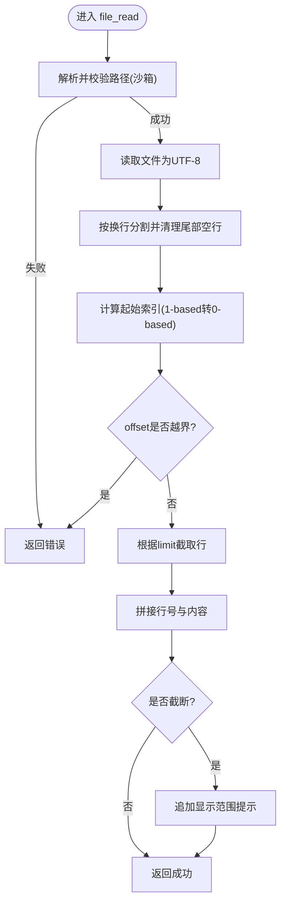
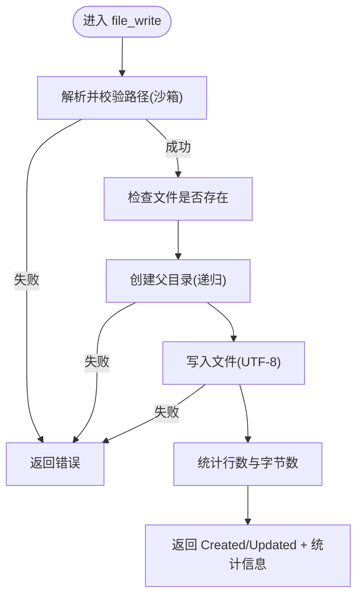
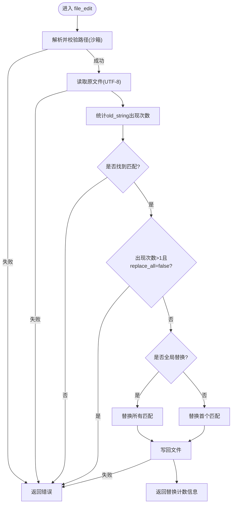
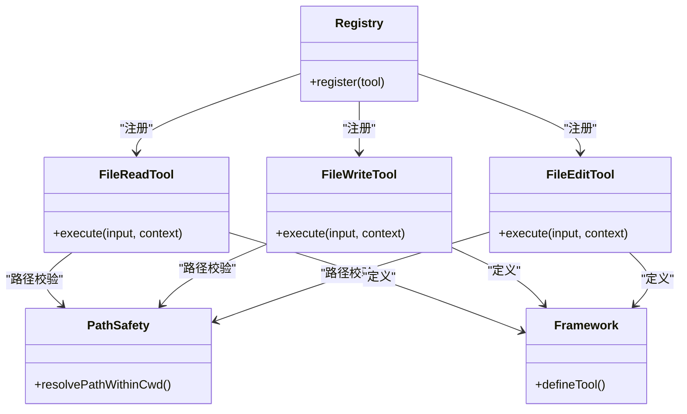

# 文件操作工具

<cite>
**本文引用的文件**
- [file-read.ts](file://packages/core/src/tool/built-in/file-read.ts)
- [file-write.ts](file://packages/core/src/tool/built-in/file-write.ts)
- [file-edit.ts](file://packages/core/src/tool/built-in/file-edit.ts)
- [path-safety.ts](file://packages/core/src/tool/built-in/path-safety.ts)
- [built-in/index.ts](file://packages/core/src/tool/built-in/index.ts)
- [framework.ts](file://packages/core/src/tool/framework.ts)
- [types.ts](file://packages/core/src/types.ts)
- [runner.ts](file://packages/core/src/agent/runner.ts)
- [built-in-tools.test.ts](file://packages/core/tests/built-in-tools.test.ts)
</cite>

## 目录
1. [简介](#简介)
2. [项目结构](#项目结构)
3. [核心组件](#核心组件)
4. [架构总览](#架构总览)
5. [详细组件分析](#详细组件分析)
6. [依赖关系分析](#依赖关系分析)
7. [性能考虑](#性能考虑)
8. [故障排查指南](#故障排查指南)
9. [结论](#结论)
10. [附录：参数、返回值与示例](#附录参数返回值与示例)

## 简介
本文件详细说明 Open Multi-Agent 内置的文件操作工具集合，包括：
- 文件读取工具 fileReadTool：支持按行号范围读取大文件、自动编码处理、路径沙箱校验等。
- 文件写入工具 fileWriteTool：创建或覆盖文件、自动创建父目录、返回写入统计信息。
- 文件编辑工具 fileEditTool：精确字符串替换、唯一匹配保护、批量替换开关。

文档涵盖各工具的参数配置、返回值格式、错误处理机制、安全限制（沙箱）、以及性能优化建议与最佳实践。

## 项目结构
文件操作工具位于 core 包的内置工具模块中，统一通过工具框架定义并注册到工具注册表，供 Agent 运行时调用。

图表来源
- [file-read.ts:17-45](file://packages/core/src/tool/built-in/file-read.ts#L17-L45)
- [file-write.ts:18-35](file://packages/core/src/tool/built-in/file-write.ts#L18-L35)
- [file-edit.ts:18-48](file://packages/core/src/tool/built-in/file-edit.ts#L18-L48)
- [path-safety.ts:30-97](file://packages/core/src/tool/built-in/path-safety.ts#L30-L97)
- [framework.ts:71-117](file://packages/core/src/tool/framework.ts#L71-L117)
- [built-in/index.ts:37-44](file://packages/core/src/tool/built-in/index.ts#L37-L44)
- [types.ts:547-557](file://packages/core/src/types.ts#L547-L557)
- [runner.ts:1796-1810](file://packages/core/src/agent/runner.ts#L1796-L1810)

章节来源
- [built-in/index.ts:1-75](file://packages/core/src/tool/built-in/index.ts#L1-L75)
- [framework.ts:1-117](file://packages/core/src/tool/framework.ts#L1-L117)

## 核心组件
- fileReadTool：以“行号+内容”的格式返回文件片段，支持 offset/limit 分页读取，适合大文件。
- fileWriteTool：创建或覆盖文件，自动创建缺失的父目录，返回行数与字节数统计。
- fileEditTool：基于精确字符串匹配的替换，默认要求唯一匹配，可开启 replace_all 进行批量替换。

章节来源
- [file-read.ts:17-45](file://packages/core/src/tool/built-in/file-read.ts#L17-L45)
- [file-write.ts:18-35](file://packages/core/src/tool/built-in/file-write.ts#L18-L35)
- [file-edit.ts:18-48](file://packages/core/src/tool/built-in/file-edit.ts#L18-L48)

## 架构总览
所有文件工具均通过 defineTool 声明输入 schema 与执行逻辑，并在执行前使用 resolvePathWithinCwd 进行路径沙箱校验，确保仅访问允许的根目录（默认 .agent-workspace）。读写过程采用 UTF-8 编码，错误以 ToolResult 形式返回。

图表来源
- [file-read.ts:47-110](file://packages/core/src/tool/built-in/file-read.ts#L47-L110)
- [file-write.ts:37-86](file://packages/core/src/tool/built-in/file-write.ts#L37-L86)
- [file-edit.ts:50-118](file://packages/core/src/tool/built-in/file-edit.ts#L50-L118)
- [path-safety.ts:30-97](file://packages/core/src/tool/built-in/path-safety.ts#L30-L97)

## 详细组件分析

### fileReadTool（文件读取）
- 功能要点
  - 读取文件并以“行号\t内容”的形式返回，便于定位。
  - 支持 offset（从第几行开始，1-based）与 limit（最多返回的行数），用于分块读取大文件。
  - 自动去除末尾空行，保证行号与实际位置一致。
  - 当未读取完整文件时，会在输出末尾附加提示，告知当前显示范围。
- 参数
  - path：绝对路径（受沙箱约束）。
  - offset：可选，起始行号（1-based）。
  - limit：可选，最大返回行数。
- 返回值
  - isError=false：data 为带行号的文本；可能包含“showing lines X–Y of Z”的提示。
  - isError=true：data 为错误描述（如文件不存在、offset 越界等）。
- 错误处理
  - 路径非法或不在沙箱：由路径沙箱返回错误。
  - 读取失败：捕获异常并返回错误信息。
  - offset 超出文件末尾：返回明确错误。
- 典型流程

图表来源
- [file-read.ts:47-110](file://packages/core/src/tool/built-in/file-read.ts#L47-L110)

章节来源
- [file-read.ts:17-112](file://packages/core/src/tool/built-in/file-read.ts#L17-L112)
- [built-in-tools.test.ts:92-154](file://packages/core/tests/built-in-tools.test.ts#L92-L154)

### fileWriteTool（文件写入）
- 功能要点
  - 创建新文件或覆盖已有文件。
  - 自动创建缺失的父目录（递归 mkdir）。
  - 返回写入统计：行数与字节数，以及“Created/Updated”动作标识。
- 参数
  - path：绝对路径（受沙箱约束）。
  - content：要写入的字符串内容（UTF-8）。
- 返回值
  - isError=false：data 包含“Created/Updated 路径 (行数, 字节数)”等信息。
  - isError=true：data 为错误描述（如无法创建目录、写入失败等）。
- 错误处理
  - 路径非法或不在沙箱：由路径沙箱返回错误。
  - 创建目录失败：返回错误。
  - 写入失败：捕获异常并返回错误。
- 典型流程

图表来源
- [file-write.ts:37-86](file://packages/core/src/tool/built-in/file-write.ts#L37-L86)

章节来源
- [file-write.ts:18-89](file://packages/core/src/tool/built-in/file-write.ts#L18-L89)
- [built-in-tools.test.ts:160-213](file://packages/core/tests/built-in-tools.test.ts#L160-L213)

### fileEditTool（文件编辑）
- 功能要点
  - 在现有文件中查找完全匹配的 old_string 并替换为 new_string。
  - 默认要求 old_string 唯一出现；若多次出现且未设置 replace_all，将报错以避免误改。
  - 支持 replace_all=true 进行全局替换。
- 参数
  - path：绝对路径（受沙箱约束）。
  - old_string：需精确匹配的原始字符串（含空白与换行）。
  - new_string：替换后的新字符串。
  - replace_all：可选布尔值，控制是否替换所有匹配项。
- 返回值
  - isError=false：data 包含“Replaced N occurrence(s) in 路径”。
  - isError=true：data 为错误描述（如找不到匹配、写入失败等）。
- 错误处理
  - 路径非法或不在沙箱：由路径沙箱返回错误。
  - 读取失败：返回错误。
  - 未找到匹配：返回错误。
  - 多次匹配但未启用 replace_all：返回错误。
  - 写入失败：捕获异常并返回错误。
- 典型流程

图表来源
- [file-edit.ts:50-118](file://packages/core/src/tool/built-in/file-edit.ts#L50-L118)

章节来源
- [file-edit.ts:18-162](file://packages/core/src/tool/built-in/file-edit.ts#L18-L162)
- [built-in-tools.test.ts:219-286](file://packages/core/tests/built-in-tools.test.ts#L219-L286)

## 依赖关系分析
- 工具定义与注册
  - 三个文件工具通过 defineTool 定义，并加入 BUILT_IN_TOOLS 列表，供统一注册。
- 路径沙箱
  - 所有文件工具在执行前调用 resolvePathWithinCwd，强制使用绝对路径，并将实际路径限制在沙箱根目录下（默认 <process.cwd()>/.agent-workspace）。
  - 沙箱可通过 OrchestratorConfig.defaultCwd 或 AgentConfig.cwd 调整；设置为 null 则禁用沙箱。
- 工具上下文
  - 运行器构建 ToolUseContext 时注入 cwd、credentials、agent 信息等，供工具使用。

图表来源
- [file-read.ts:17-45](file://packages/core/src/tool/built-in/file-read.ts#L17-L45)
- [file-write.ts:18-35](file://packages/core/src/tool/built-in/file-write.ts#L18-L35)
- [file-edit.ts:18-48](file://packages/core/src/tool/built-in/file-edit.ts#L18-L48)
- [path-safety.ts:30-97](file://packages/core/src/tool/built-in/path-safety.ts#L30-L97)
- [framework.ts:71-117](file://packages/core/src/tool/framework.ts#L71-L117)
- [built-in/index.ts:37-44](file://packages/core/src/tool/built-in/index.ts#L37-L44)

章节来源
- [types.ts:547-557](file://packages/core/src/types.ts#L547-L557)
- [runner.ts:1796-1810](file://packages/core/src/agent/runner.ts#L1796-L1810)

## 性能考虑
- 大文件读取
  - 使用 fileReadTool 的 offset/limit 分页读取，避免一次性加载整个文件到内存。
  - 仅在必要时读取整文件；对超长文件优先分段处理。
- 写入与编辑
  - fileWriteTool 会统计行数和字节数，注意超大内容写入时的内存占用。
  - fileEditTool 的替换算法基于字符串扫描，避免正则开销；但大量替换仍需谨慎。
- I/O 与沙箱
  - 路径解析与 realpath 解析会带来额外系统调用；尽量复用路径与减少重复校验。
- 并发与限流
  - 结合上层调度策略限制并发文件操作，避免磁盘拥塞。
- 编码
  - 统一使用 UTF-8；如需其他编码，应在上层预处理后再传入工具。

[本节提供通用指导，不直接分析具体文件]

## 故障排查指南
- 常见错误与原因
  - 路径非绝对或被拒绝：检查是否传入绝对路径，以及是否在沙箱根目录内。
  - 文件不存在：读取类工具（file_read、file_edit）会返回错误；先使用 file_write 创建。
  - 匹配不到或多次匹配：file_edit 需要 old_string 唯一；如需批量替换，请设置 replace_all=true。
  - 权限或目录创建失败：检查目标目录权限与磁盘空间。
- 调试建议
  - 查看工具返回的 data 字段中的错误消息，通常包含具体原因。
  - 确认 Agent 或 Orchestrator 的沙箱根目录配置是否正确。
  - 对于路径问题，可在沙箱根目录下验证目标路径是否存在与可访问。

章节来源
- [file-read.ts:47-110](file://packages/core/src/tool/built-in/file-read.ts#L47-L110)
- [file-write.ts:37-86](file://packages/core/src/tool/built-in/file-write.ts#L37-L86)
- [file-edit.ts:50-118](file://packages/core/src/tool/built-in/file-edit.ts#L50-L118)
- [path-safety.ts:30-97](file://packages/core/src/tool/built-in/path-safety.ts#L30-L97)

## 结论
Open Multi-Agent 的文件操作工具提供了安全、可控且易用的文件读写与编辑能力。通过严格的沙箱机制与清晰的参数/返回值约定，开发者可以安全地让 Agent 完成常见的文件任务。配合分页读取、批量替换与自动目录创建等功能，能够覆盖大多数实际场景。在生产环境中，建议合理配置沙箱根目录与工具权限，并结合性能优化策略提升稳定性与效率。

[本节总结性内容，不直接分析具体文件]

## 附录：参数、返回值与示例

### 参数配置选项
- fileReadTool
  - path：必填，绝对路径（受沙箱约束）。
  - offset：可选，起始行号（1-based）。
  - limit：可选，最大返回行数。
- fileWriteTool
  - path：必填，绝对路径（受沙箱约束）。
  - content：必填，要写入的内容（UTF-8）。
- fileEditTool
  - path：必填，绝对路径（受沙箱约束）。
  - old_string：必填，需精确匹配的原始字符串。
  - new_string：必填，替换后的新字符串。
  - replace_all：可选，是否替换所有匹配项。

章节来源
- [file-read.ts:25-45](file://packages/core/src/tool/built-in/file-read.ts#L25-L45)
- [file-write.ts:27-35](file://packages/core/src/tool/built-in/file-write.ts#L27-L35)
- [file-edit.ts:28-48](file://packages/core/src/tool/built-in/file-edit.ts#L28-L48)

### 返回值格式
- 成功
  - isError=false，data 为字符串：
    - fileReadTool：带行号的内容，可能包含“showing lines X–Y of Z”的提示。
    - fileWriteTool：“Created/Updated 路径 (行数, 字节数)”。
    - fileEditTool：“Replaced N occurrence(s) in 路径”。
- 失败
  - isError=true，data 为错误描述（如路径非法、文件不存在、匹配失败、写入失败等）。

章节来源
- [file-read.ts:96-110](file://packages/core/src/tool/built-in/file-read.ts#L96-L110)
- [file-write.ts:77-86](file://packages/core/src/tool/built-in/file-write.ts#L77-L86)
- [file-edit.ts:111-118](file://packages/core/src/tool/built-in/file-edit.ts#L111-L118)

### 常见场景示例（以步骤说明代替代码）
- 读取大文件的某一段
  - 使用 fileReadTool，指定 path、offset 与 limit，获取指定范围的行内容。
  - 适用于日志分析、长配置文件分段阅读等。
- 创建新文件或覆盖现有文件
  - 使用 fileWriteTool，传入 path 与 content；若父目录不存在会自动创建。
  - 适用于生成报告、导出结果、初始化模板等。
- 精准替换某段文本
  - 使用 fileEditTool，传入 old_string 与 new_string；若不确定是否唯一，先读取文件确认。
  - 适用于修复配置项、更新版本号、替换占位符等。
- 批量替换多处相同内容
  - 在 fileEditTool 中设置 replace_all=true，确保确实需要全局替换。
  - 适用于统一替换命名、迁移旧语法等。

[本节为概念性示例，不直接分析具体文件]

### 安全与权限控制
- 沙箱根目录
  - 默认根目录：<process.cwd()>/.agent-workspace，首次写入时自动创建。
  - 可通过 OrchestratorConfig.defaultCwd 或 AgentConfig.cwd 调整；设为 null 禁用沙箱。
- 路径限制
  - 所有内置文件工具要求绝对路径，并拒绝解析到沙箱根目录之外的路径（包括符号链接）。
- 工具可见性与授权
  - 工具集可通过 toolPreset（readonly/readwrite/full）或 tools/disallowedTools 精细控制。
  - consequential 标记表明工具具有真实副作用（fileWriteTool、fileEditTool 已标记）。

章节来源
- [path-safety.ts:5-24](file://packages/core/src/tool/built-in/path-safety.ts#L5-L24)
- [path-safety.ts:30-97](file://packages/core/src/tool/built-in/path-safety.ts#L30-L97)
- [types.ts:547-557](file://packages/core/src/types.ts#L547-L557)
- [types.ts:986-1009](file://packages/core/src/types.ts#L986-L1009)
- [types.ts:2236-2252](file://packages/core/src/types.ts#L2236-L2252)
- [framework.ts:71-117](file://packages/core/src/tool/framework.ts#L71-L117)