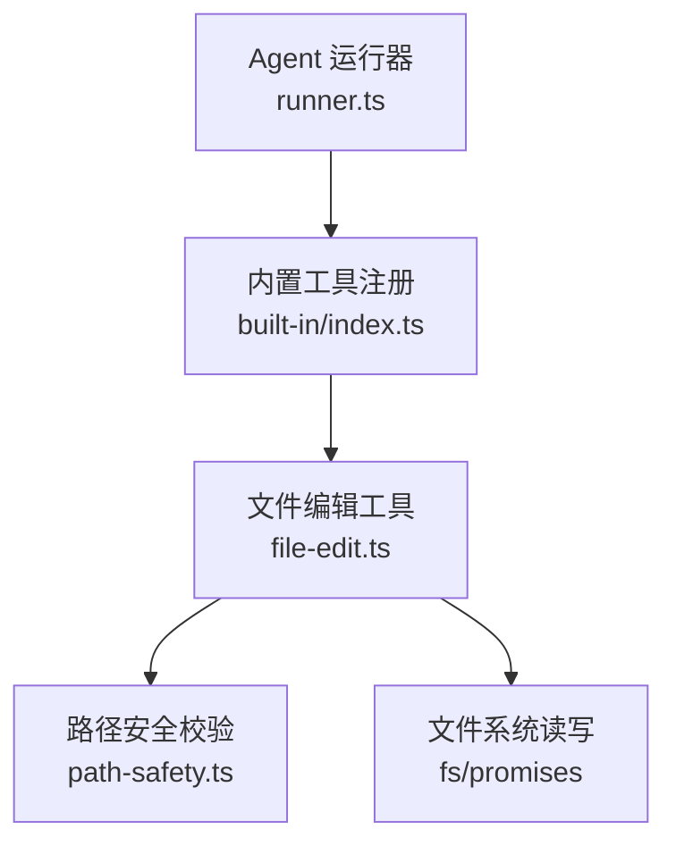
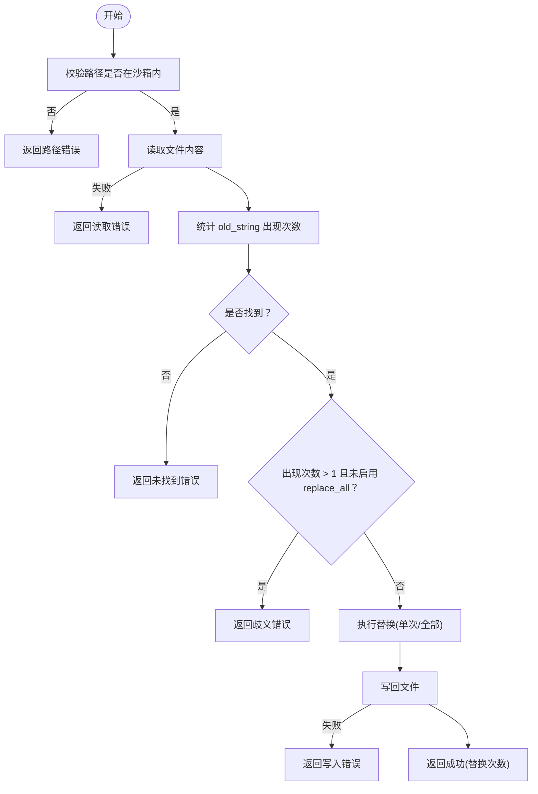
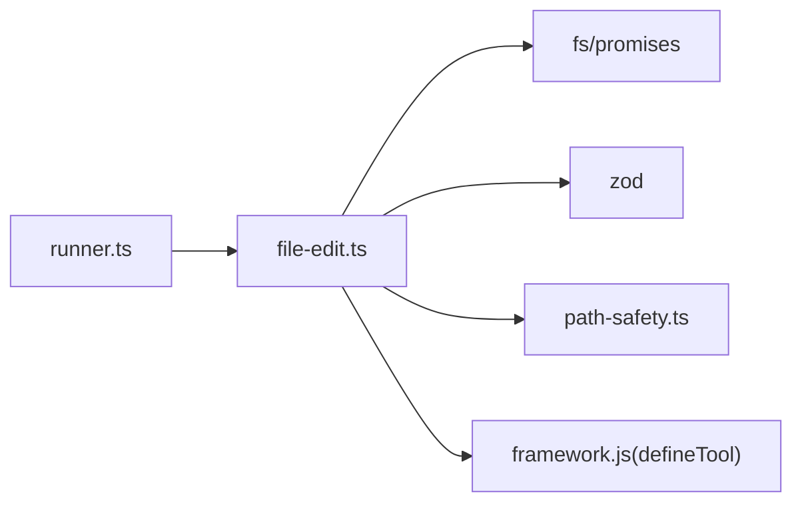

# 文件编辑工具

<cite>
**本文引用的文件**
- [file-edit.ts](file://packages/core/src/tool/built-in/file-edit.ts)
- [path-safety.ts](file://packages/core/src/tool/built-in/path-safety.ts)
- [built-in/index.ts](file://packages/core/src/tool/built-in/index.ts)
- [types.ts](file://packages/core/src/types.ts)
- [runner.ts](file://packages/core/src/agent/runner.ts)
- [built-in-tools.test.ts](file://packages/core/tests/built-in-tools.test.ts)
</cite>

## 目录
1. [简介](#简介)
2. [项目结构](#项目结构)
3. [核心组件](#核心组件)
4. [架构总览](#架构总览)
5. [详细组件分析](#详细组件分析)
6. [依赖关系分析](#依赖关系分析)
7. [性能考虑](#性能考虑)
8. [故障排查指南](#故障排查指南)
9. [结论](#结论)
10. [附录](#附录)

## 简介
本文件详细介绍 Open Multi-Agent 内置的文件编辑工具 fileEditTool。该工具用于对现有文件进行精确的文本替换编辑，强调“唯一匹配”的安全策略，避免误改。它通过沙箱路径校验、原子写入与明确的错误返回，保障编辑过程的可预测性与可恢复性。文档同时覆盖参数配置、操作语义、错误处理、性能优化以及与版本控制的集成建议。

## 项目结构
fileEditTool 位于内置工具集合中，并通过统一注册机制暴露给 Agent 运行器使用。其关键文件包括：
- 工具实现：packages/core/src/tool/built-in/file-edit.ts
- 路径安全校验：packages/core/src/tool/built-in/path-safety.ts
- 内置工具注册与导出：packages/core/src/tool/built-in/index.ts
- 类型定义（含工作目录沙箱说明）：packages/core/src/types.ts
- Agent 运行器（工具调用编排与结果回传）：packages/core/src/agent/runner.ts
- 单元测试（覆盖替换、歧义、缺失等场景）：packages/core/tests/built-in-tools.test.ts

图表来源
- [runner.ts:1204-1320](file://packages/core/src/agent/runner.ts#L1204-L1320)
- [built-in/index.ts:37-44](file://packages/core/src/tool/built-in/index.ts#L37-L44)
- [file-edit.ts:18-118](file://packages/core/src/tool/built-in/file-edit.ts#L18-L118)
- [path-safety.ts:30-97](file://packages/core/src/tool/built-in/path-safety.ts#L30-L97)

章节来源
- [built-in/index.ts:37-44](file://packages/core/src/tool/built-in/index.ts#L37-L44)
- [file-edit.ts:18-118](file://packages/core/src/tool/built-in/file-edit.ts#L18-L118)
- [path-safety.ts:30-97](file://packages/core/src/tool/built-in/path-safety.ts#L30-L97)
- [runner.ts:1204-1320](file://packages/core/src/agent/runner.ts#L1204-L1320)

## 核心组件
- 工具定义与输入模式
  - name: file_edit
  - consequential: true（标记为有副作用的工具）
  - 输入字段：
    - path: 绝对路径（字符串）
    - old_string: 要查找并替换的原始字符串（必须完全匹配，包括空白与换行）
    - new_string: 替换后的新字符串
    - replace_all: 可选布尔值，是否替换所有出现位置；默认 false
- 执行流程
  - 路径安全校验：基于上下文 cwd 解析并限制在沙箱内
  - 读取原文件内容
  - 统计 old_string 出现次数
  - 若未找到或出现多次且未启用 replace_all，则返回错误
  - 执行替换（单次或全部）
  - 写回文件并返回结果
- 内部辅助
  - countOccurrences：线性扫描计数，避免正则带来的转义问题
  - replaceAllOccurrences：无正则的全量替换实现

章节来源
- [file-edit.ts:18-118](file://packages/core/src/tool/built-in/file-edit.ts#L18-L118)
- [file-edit.ts:125-161](file://packages/core/src/tool/built-in/file-edit.ts#L125-L161)

## 架构总览
fileEditTool 作为“有副作用”的工具，由 Agent 运行器在工具调用阶段触发。工具内部先做路径安全校验，再进行读-改-写的最小化变更。错误以结构化方式返回，便于上层记录与重试。

图表来源
- [runner.ts:1204-1320](file://packages/core/src/agent/runner.ts#L1204-L1320)
- [file-edit.ts:50-118](file://packages/core/src/tool/built-in/file-edit.ts#L50-L118)
- [path-safety.ts:30-97](file://packages/core/src/tool/built-in/path-safety.ts#L30-L97)

## 详细组件分析

### 文件编辑工具(fileEditTool)
- 设计要点
  - 精确匹配：old_string 必须与文件内容逐字符一致，避免误替换
  - 唯一性保护：默认拒绝多处匹配，防止批量误改；可通过 replace_all 显式开启
  - 沙箱约束：仅允许访问工作目录内的路径，拒绝相对路径与越界路径
  - 原子性：读-改-写在同一调用内完成，失败时不改变原文件
- 参数说明
  - path: 目标文件的绝对路径
  - old_string: 待替换的原文片段
  - new_string: 替换后的新片段
  - replace_all: 是否替换所有匹配项（默认 false）
- 行为规则
  - 找不到 old_string：返回错误，提示需确保完全匹配
  - 多处匹配且未设置 replace_all：返回错误，要求更具体的匹配或显式启用全量替换
  - 成功：返回替换次数与目标路径
- 错误处理
  - 路径非法或不在沙箱内：返回错误
  - 读取失败：返回错误并包含底层错误消息
  - 写入失败：返回错误并包含底层错误消息

图表来源
- [file-edit.ts:50-118](file://packages/core/src/tool/built-in/file-edit.ts#L50-L118)
- [file-edit.ts:125-161](file://packages/core/src/tool/built-in/file-edit.ts#L125-L161)

章节来源
- [file-edit.ts:18-118](file://packages/core/src/tool/built-in/file-edit.ts#L18-L118)
- [file-edit.ts:125-161](file://packages/core/src/tool/built-in/file-edit.ts#L125-L161)

### 路径安全模块(path-safety)
- 功能
  - 将输入路径解析为绝对路径，并确保其位于工作目录沙箱内
  - 支持自动创建默认工作目录（仅在写入工具需要时）
  - 通过 realpath 解析符号链接，避免 TOCTOU 风险
- 关键点
  - 禁止相对路径
  - 拒绝超出沙箱的路径（含符号链接逃逸）
  - 提供清晰的错误信息，指导如何调整工作目录或禁用沙箱

章节来源
- [path-safety.ts:30-97](file://packages/core/src/tool/built-in/path-safety.ts#L30-L97)
- [path-safety.ts:99-125](file://packages/core/src/tool/built-in/path-safety.ts#L99-L125)

### 内置工具注册与导出
- 将 fileEditTool 与其他内置工具统一注册到工具注册表，供 Agent 运行器发现与调度
- 提供便捷函数一次性注册所有内置工具

章节来源
- [built-in/index.ts:37-44](file://packages/core/src/tool/built-in/index.ts#L37-L44)
- [built-in/index.ts:64-75](file://packages/core/src/tool/built-in/index.ts#L64-L75)

### Agent 运行器中的工具调用
- 运行器负责：
  - 从模型输出中提取 tool_use 块
  - 分发到具体工具执行
  - 收集结果并回写到对话历史
  - 持久化检查点，保证中断后可恢复
- 与 fileEditTool 的关系：
  - 将 fileEditTool 视为“有副作用”的操作，执行后结果会进入后续轮次上下文

章节来源
- [runner.ts:1204-1320](file://packages/core/src/agent/runner.ts#L1204-L1320)

## 依赖关系分析
- 直接依赖
  - fs/promises：文件读取与写入
  - z：输入参数校验
  - path-safety：路径安全校验
- 间接依赖
  - 工具框架 defineTool：定义工具元数据与执行入口
  - Agent 运行器：工具调度与结果管理
  - 类型系统：ToolUseContext.cwd 控制沙箱范围

图表来源
- [file-edit.ts:1-12](file://packages/core/src/tool/built-in/file-edit.ts#L1-L12)
- [runner.ts:1204-1320](file://packages/core/src/agent/runner.ts#L1204-L1320)

章节来源
- [file-edit.ts:1-12](file://packages/core/src/tool/built-in/file-edit.ts#L1-L12)
- [runner.ts:1204-1320](file://packages/core/src/agent/runner.ts#L1204-L1320)

## 性能考虑
- 大文件编辑
  - 当前实现将整个文件读入内存后进行替换，适合中小规模文件
  - 对于超大文件，建议：
    - 分块定位与替换（例如按行扫描，构建增量更新）
    - 使用临时文件+原子重命名减少并发竞争
- 内存管理
  - 避免不必要的中间字符串拼接；当前 replaceAllOccurrences 已采用分段拼接
  - 合理控制 old_string/new_string 长度，避免生成过大的中间结果
- 增量更新策略
  - 若仅需修改少量行，优先使用 fileEditTool 的精确替换
  - 若需大量重写，可考虑 file_write 直接覆盖，减少多次 I/O
- 并发访问控制
  - 工具本身不具备锁机制；建议在应用层对同一文件的多并发编辑进行串行化或加锁
  - 结合 Agent 运行器的检查点与幂等键(toolCallId)，可在恢复时避免重复写入

[本节为通用性能建议，不直接分析具体代码文件]

## 故障排查指南
- 常见错误与原因
  - 路径错误：非绝对路径或超出沙箱
    - 解决：使用绝对路径，或在 AgentConfig.cwd 中扩大工作目录
  - 未找到匹配：old_string 与文件内容不完全一致（空格、换行差异）
    - 解决：使用 file_read 查看目标区域，确保完全匹配
  - 多处匹配：未设置 replace_all
    - 解决：提供更具体的 old_string，或设置 replace_all: true
  - 读取失败：文件不存在或权限不足
    - 解决：确认路径与权限
  - 写入失败：磁盘空间不足或权限不足
    - 解决：释放空间或提升权限
- 调试建议
  - 先用 file_read 获取目标区域的行号与内容，再构造 old_string
  - 在测试环境中验证 replace_all 的行为
  - 关注运行器输出的错误事件，定位失败阶段

章节来源
- [built-in-tools.test.ts:220-285](file://packages/core/tests/built-in-tools.test.ts#L220-L285)
- [file-edit.ts:50-118](file://packages/core/src/tool/built-in/file-edit.ts#L50-L118)
- [path-safety.ts:30-97](file://packages/core/src/tool/built-in/path-safety.ts#L30-L97)

## 结论
fileEditTool 提供了安全、精确的文件文本编辑能力，通过唯一匹配策略与沙箱路径校验，有效降低误改风险。其简单而稳健的实现适合大多数“精准替换”场景；对于大规模重写或超大文件，应结合 file_write 与外部并发控制策略。配合 Agent 运行器的检查点与幂等机制，可在复杂任务流中保持可靠与可恢复。

## 附录

### 参数配置与用法
- path: 目标文件的绝对路径
- old_string: 要查找的原文片段（必须完全匹配）
- new_string: 替换后的新片段
- replace_all: 是否替换所有出现位置（默认 false）

章节来源
- [file-edit.ts:28-48](file://packages/core/src/tool/built-in/file-edit.ts#L28-L48)

### 操作类型与语义
- 文本替换：用 new_string 替换 old_string
- 行插入：通过 old_string 精确匹配某一行（含换行），替换为新行或多行
- 行删除：将目标行替换为空字符串
- 行修改：替换整行内容为新的内容
- 批量替换：设置 replace_all: true 以替换所有匹配项

章节来源
- [file-edit.ts:21-26](file://packages/core/src/tool/built-in/file-edit.ts#L21-L26)
- [file-edit.ts:70-97](file://packages/core/src/tool/built-in/file-edit.ts#L70-L97)

### 原子性与回滚机制
- 原子性：读-改-写在同一调用内完成，失败时不会部分写入
- 回滚：若写入失败，原文件保持不变；上层可通过检查点与重试恢复
- 幂等：结合 toolCallId 可在恢复时避免重复执行

章节来源
- [file-edit.ts:50-118](file://packages/core/src/tool/built-in/file-edit.ts#L50-L118)
- [runner.ts:1204-1320](file://packages/core/src/agent/runner.ts#L1204-L1320)

### 完整示例场景（描述性）
- 批量替换：在配置文件中将所有旧版本号替换为新版本号
  - 步骤：使用 file_read 定位版本号行，构造 old_string 与 new_string，必要时设置 replace_all: true
- 格式化代码：将缩进或引号风格统一替换
  - 步骤：精确匹配旧格式片段，替换为新格式；注意保留换行与空白
- 配置文件修改：更新特定键值对
  - 步骤：匹配 key: value 行，替换为新值；若存在多处，谨慎使用 replace_all

[以上为概念性示例，不涉及具体代码内容]

### 与版本控制的集成建议
- 提交前校验：在执行 fileEditTool 前，先通过 git diff 或类似工具预览变更
- 原子提交：将相关编辑合并为一次提交，便于回滚
- 分支策略：在独立分支中进行批量编辑，合并前进行审查
- 冲突处理：多人协作时，尽量拆分编辑范围，减少冲突概率

[本节为通用实践建议，不直接分析具体代码文件]