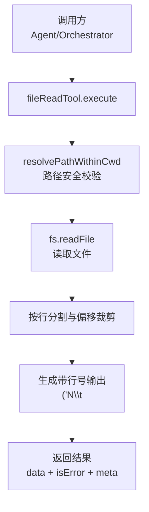
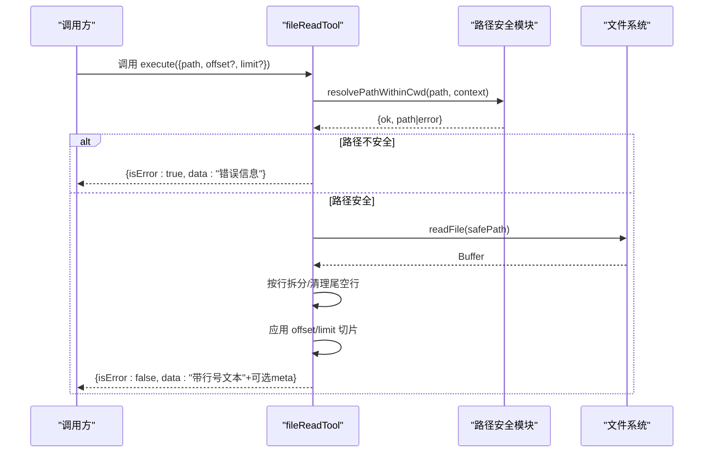
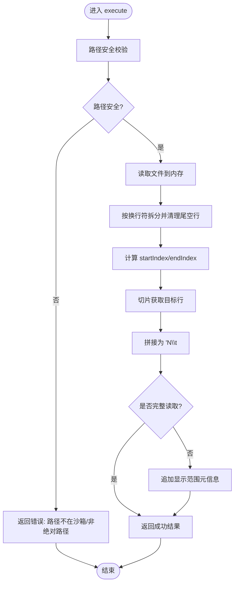
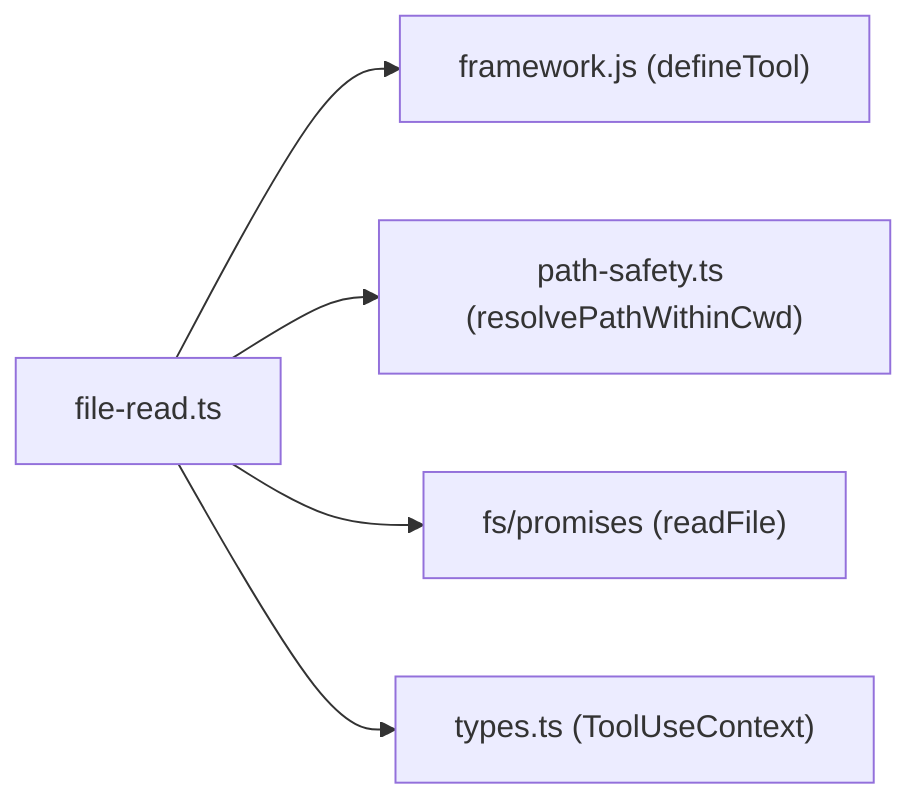

# 文件读取工具

<cite>
**本文引用的文件**
- [file-read.ts](file://packages/core/src/tool/built-in/file-read.ts)
- [path-safety.ts](file://packages/core/src/tool/built-in/path-safety.ts)
- [built-in-tools.test.ts](file://packages/core/tests/built-in-tools.test.ts)
- [index.ts](file://packages/core/src/index.ts)
- [types.ts](file://packages/core/src/types.ts)
</cite>

## 目录
1. [简介](#简介)
2. [项目结构](#项目结构)
3. [核心组件](#核心组件)
4. [架构总览](#架构总览)
5. [详细组件分析](#详细组件分析)
6. [依赖关系分析](#依赖关系分析)
7. [性能考虑](#性能考虑)
8. [故障排查指南](#故障排查指南)
9. [结论](#结论)
10. [附录：使用示例与最佳实践](#附录使用示例与最佳实践)

## 简介
文件读取工具（fileReadTool）是 Open Multi-Agent 内置的文件系统工具之一，用于从磁盘安全地读取文件内容并以“带行号”的文本格式返回。它支持通过 offset（起始行号，1-based）和 limit（最大行数）对大文件进行分页读取，从而避免一次性将大文件载入上下文窗口，降低内存占用并提升性能。该工具在内部会执行路径安全检查，确保访问被限制在沙箱工作目录下，防止越权读取敏感文件。

## 项目结构
与 fileReadTool 相关的代码主要位于 packages/core 下的工具实现与安全模块中：
- 工具定义与执行逻辑：packages/core/src/tool/built-in/file-read.ts
- 路径安全与沙箱校验：packages/core/src/tool/built-in/path-safety.ts
- 测试用例（覆盖常见用法与边界情况）：packages/core/tests/built-in-tools.test.ts
- 对外导出入口：packages/core/src/index.ts
- 类型与上下文定义（如 ToolUseContext.cwd、AgentConfig.cwd 等）：packages/core/src/types.ts

图表来源
- [file-read.ts:17-111](file://packages/core/src/tool/built-in/file-read.ts#L17-L111)
- [path-safety.ts:30-97](file://packages/core/src/tool/built-in/path-safety.ts#L30-L97)

章节来源
- [file-read.ts:1-112](file://packages/core/src/tool/built-in/file-read.ts#L1-L112)
- [path-safety.ts:1-125](file://packages/core/src/tool/built-in/path-safety.ts#L1-L125)
- [index.ts:165-179](file://packages/core/src/index.ts#L165-L179)

## 核心组件
- 工具定义与输入模式：
  - name: 'file_read'
  - description: 说明返回格式为“行号+制表符+行内容”，并提示使用 offset/limit 处理大文件
  - inputSchema: path（必填，绝对路径）、offset（可选，1-based 起始行）、limit（可选，正整数，最大行数）
- 执行流程：
  - 路径安全校验（resolvePathWithinCwd）
  - 读取文件内容（fs.promises.readFile）
  - 按换行符拆分并清理尾部空行
  - 应用 offset/limit 切片
  - 生成带行号的文本输出，并在未读取完整文件时附加元信息提示
- 返回值：
  - data: 字符串（带行号前缀的行内容；可能包含“显示范围”的元信息）
  - isError: boolean（true 表示错误）

章节来源
- [file-read.ts:17-45](file://packages/core/src/tool/built-in/file-read.ts#L17-L45)
- [file-read.ts:47-111](file://packages/core/src/tool/built-in/file-read.ts#L47-L111)

## 架构总览
fileReadTool 的执行链路如下：
- 调用方通过 Agent/Orchestrator 注册的工具集调用 file_read
- 工具先进行路径安全校验，确保目标路径在沙箱内且解析后的真实路径仍受控
- 读取文件后按行切分，根据 offset/limit 计算起止索引，生成带行号文本
- 若仅返回部分行，则在末尾追加“显示范围”的元信息，便于上层理解是否被截断

图表来源
- [file-read.ts:47-111](file://packages/core/src/tool/built-in/file-read.ts#L47-L111)
- [path-safety.ts:30-97](file://packages/core/src/tool/built-in/path-safety.ts#L30-L97)

## 详细组件分析

### 参数与输入模式
- path（必填）：绝对路径。相对路径会被拒绝，除非显式关闭沙箱（cwd=null）。
- offset（可选）：1-based 起始行号。省略则从头开始。
- limit（可选）：正整数，最大返回行数。省略则读到文件末尾。

章节来源
- [file-read.ts:25-45](file://packages/core/src/tool/built-in/file-read.ts#L25-L45)

### 执行流程与数据处理
- 路径安全校验：
  - 若 context.cwd 为 null，则禁用沙箱，允许任意路径
  - 否则要求绝对路径，并将候选路径限制在 cwd（或默认工作区 .agent-workspace）内
  - 解析符号链接，防止 TOCTOU 风险
- 文件读取：
  - 使用 fs.promises.readFile 读取整个文件到内存
  - 捕获异常并转换为可读的错误消息
- 行处理：
  - 按 '\n' 拆分，去除末尾多余的空行（由尾部换行产生）
  - 计算 startIndex = max(0, offset - 1)，endIndex = min(startIndex + limit, totalLines)
  - 切片后生成“行号\t行内容”的文本
- 元信息：
  - 如果 endIndex < totalLines，则在末尾追加“显示第 X–Y 行，共 Z 行”的提示

图表来源
- [file-read.ts:47-111](file://packages/core/src/tool/built-in/file-read.ts#L47-L111)

章节来源
- [file-read.ts:47-111](file://packages/core/src/tool/built-in/file-read.ts#L47-L111)

### 返回值格式
- data: 字符串，每行以“行号+制表符+原始行内容”的形式呈现；当未读取完整文件时，末尾包含“显示范围”的元信息
- isError: false 表示成功，true 表示失败（例如路径不安全、文件不存在、权限不足等）

章节来源
- [file-read.ts:96-109](file://packages/core/src/tool/built-in/file-read.ts#L96-L109)

### 错误处理机制
- 路径安全错误：
  - 非绝对路径：直接拒绝
  - 路径超出沙箱根目录：拒绝并提示如何调整 cwd 或禁用沙箱
- 文件读取错误：
  - 文件不存在、权限不足、I/O 异常等：统一捕获并返回错误信息
- 偏移越界：
  - offset 超过文件末尾：返回错误，提示文件实际行数与请求的 offset

章节来源
- [file-read.ts:47-87](file://packages/core/src/tool/built-in/file-read.ts#L47-L87)
- [path-safety.ts:30-97](file://packages/core/src/tool/built-in/path-safety.ts#L30-L97)

### 大文件处理机制
- 当前实现会将整个文件读入内存并按行拆分，然后通过 offset/limit 进行切片。对于超大文件，建议：
  - 使用较小的 limit 分批读取（例如每次读取固定行数）
  - 结合上层压缩策略（如 compressToolResults）控制上下文增长
  - 注意：当前实现并非流式逐行读取，因此极端大文件仍需关注内存占用

章节来源
- [file-read.ts:53-99](file://packages/core/src/tool/built-in/file-read.ts#L53-L99)

## 依赖关系分析
- fileReadTool 依赖：
  - 工具框架 defineTool（用于声明工具名称、描述、输入模式与执行函数）
  - 路径安全模块 resolvePathWithinCwd（沙箱校验）
  - Node.js 文件系统 fs/promises（读取文件）
- 类型与上下文：
  - ToolUseContext.cwd 决定沙箱行为
  - AgentConfig/OrchestratorConfig 中的 cwd/defaultCwd 影响默认沙箱根目录

图表来源
- [file-read.ts:8-11](file://packages/core/src/tool/built-in/file-read.ts#L8-L11)
- [path-safety.ts:1-4](file://packages/core/src/tool/built-in/path-safety.ts#L1-L4)
- [types.ts:531-557](file://packages/core/src/types.ts#L531-L557)

章节来源
- [file-read.ts:8-11](file://packages/core/src/tool/built-in/file-read.ts#L8-L11)
- [path-safety.ts:1-4](file://packages/core/src/tool/built-in/path-safety.ts#L1-L4)
- [types.ts:531-557](file://packages/core/src/types.ts#L531-L557)

## 性能考虑
- 内存占用：当前实现将整个文件读入内存后再按行拆分，适合中小文件；超大文件建议使用较小的 limit 分批读取，并结合上层压缩策略
- I/O 开销：单次 readFile 调用，减少多次 I/O；但需注意大文件的内存峰值
- 上下文窗口：通过 offset/limit 控制返回行数，避免一次性注入过多内容到模型上下文
- 沙箱路径解析：resolvePathWithinCwd 会解析符号链接并检查是否在沙箱内，增加少量 CPU 开销但保障安全

[本节为通用性能讨论，不直接分析具体文件]

## 故障排查指南
- 现象：返回错误“必须为绝对路径”
  - 原因：传入的 path 不是绝对路径
  - 解决：提供绝对路径，或在上下文中设置 cwd=null 禁用沙箱（谨慎使用）
- 现象：返回错误“路径不在工作目录内”
  - 原因：目标路径解析后超出沙箱根目录
  - 解决：调整 AgentConfig.cwd 或 OrchestratorConfig.defaultCwd，或将文件移动到沙箱内
- 现象：返回错误“无法读取文件”
  - 原因：文件不存在、权限不足或 I/O 异常
  - 解决：检查文件是否存在、权限是否正确、路径是否可访问
- 现象：返回错误“offset 超出文件末尾”
  - 原因：请求的起始行大于文件总行数
  - 解决：减小 offset 或确认文件大小

章节来源
- [file-read.ts:47-87](file://packages/core/src/tool/built-in/file-read.ts#L47-L87)
- [path-safety.ts:30-97](file://packages/core/src/tool/built-in/path-safety.ts#L30-L97)
- [built-in-tools.test.ts:120-153](file://packages/core/tests/built-in-tools.test.ts#L120-L153)

## 结论
fileReadTool 提供了安全、可控的文件读取能力，适用于需要按行查看或分段处理文本的场景。通过 offset/limit 可以高效处理较大文件，同时内置的路径安全机制有效防止越权访问。建议在处理超大文件时结合分页读取与上下文压缩策略，以获得更好的性能与稳定性。

[本节为总结性内容，不直接分析具体文件]

## 附录：使用示例与最佳实践

### 常见使用场景
- 读取整个文件：
  - 仅提供 path，不传 offset/limit
  - 参考测试：读取带行号的文件内容
- 读取指定行范围：
  - 提供 path、offset、limit，例如从第 2 行开始读取 2 行
  - 参考测试：读取切片并验证行号与内容
- 处理大文件：
  - 使用较小的 limit 分批读取，逐步推进 offset
  - 注意：当前实现会将整文件读入内存，极端大文件需评估内存占用

章节来源
- [built-in-tools.test.ts:92-153](file://packages/core/tests/built-in-tools.test.ts#L92-L153)

### 安全注意事项
- 始终优先使用绝对路径
- 默认启用沙箱，避免意外读取项目根目录下的敏感文件（如 .env）
- 如需放宽限制，可通过配置 AgentConfig.cwd 或 OrchestratorConfig.defaultCwd；谨慎设置为 null 以禁用沙箱
- 注意符号链接解析，避免 TOCTOU 风险

章节来源
- [path-safety.ts:30-97](file://packages/core/src/tool/built-in/path-safety.ts#L30-L97)
- [types.ts:531-557](file://packages/core/src/types.ts#L531-L557)

### 集成与导出
- 工具通过 index.ts 对外导出，可在 Agent/Orchestrator 中注册并使用
- 工具名称为 file_read，输入模式由 Zod 定义，具备类型约束与描述

章节来源
- [index.ts:165-179](file://packages/core/src/index.ts#L165-L179)
- [file-read.ts:17-45](file://packages/core/src/tool/built-in/file-read.ts#L17-L45)