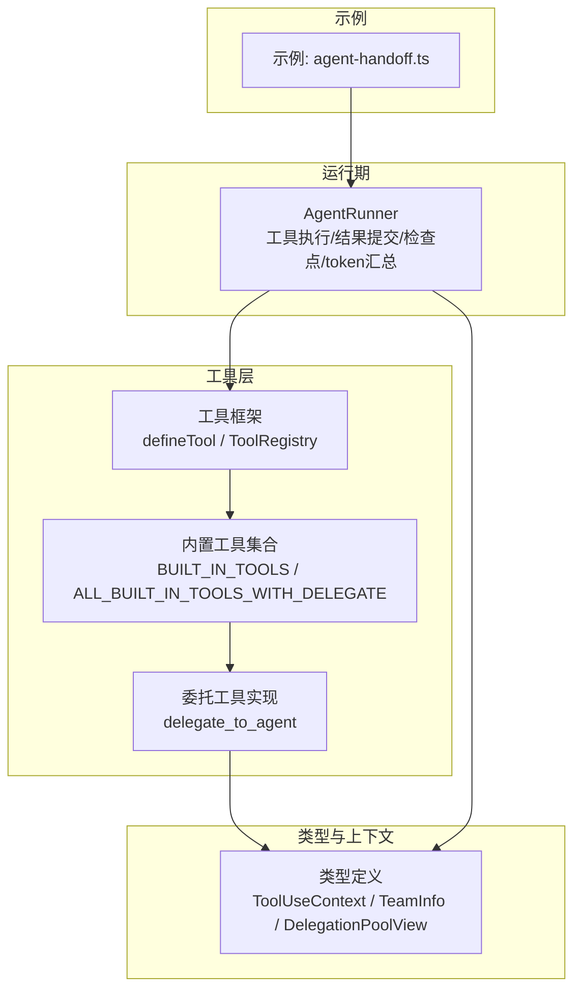
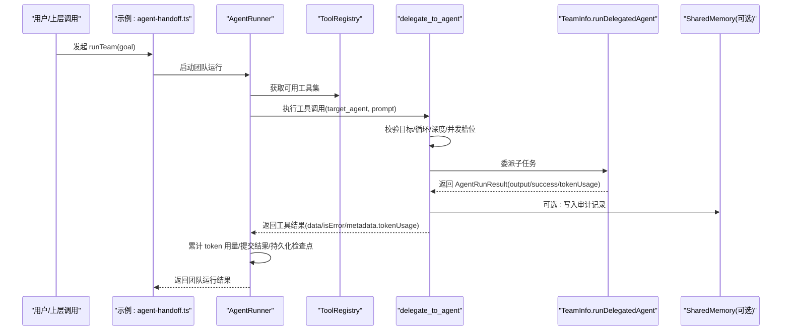
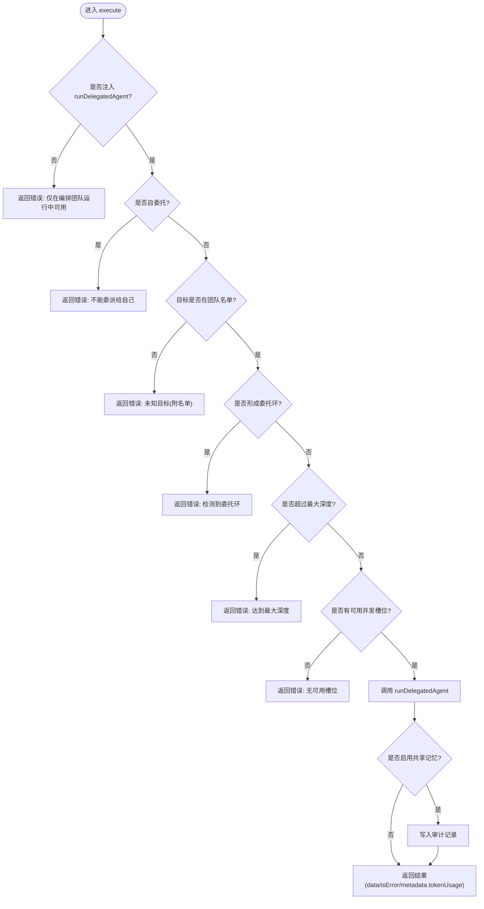
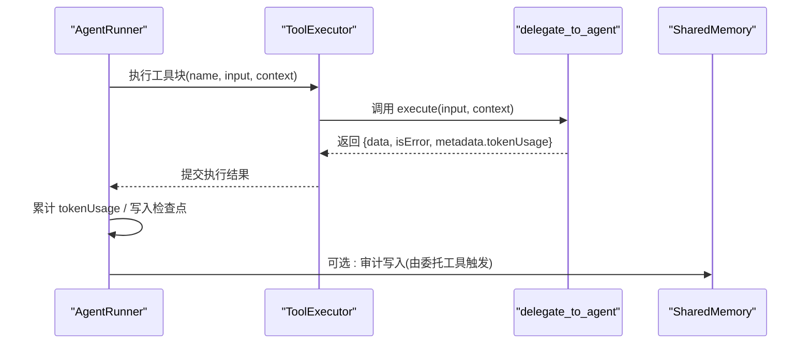
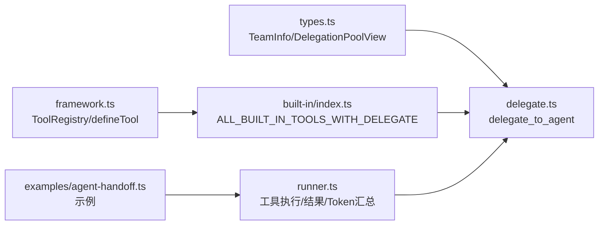

# 智能体委托工具

<cite>
**本文引用的文件**
- [README_zh.md](file://README_zh.md)
- [agent-handoff.ts](file://packages/core/examples/patterns/agent-handoff.ts)
- [delegate.ts](file://packages/core/src/tool/built-in/delegate.ts)
- [built-in/index.ts](file://packages/core/src/tool/built-in/index.ts)
- [framework.ts](file://packages/core/src/tool/framework.ts)
- [types.ts](file://packages/core/src/types.ts)
- [runner.ts](file://packages/core/src/agent/runner.ts)
</cite>

## 目录
1. [简介](#简介)
2. [项目结构](#项目结构)
3. [核心组件](#核心组件)
4. [架构总览](#架构总览)
5. [详细组件分析](#详细组件分析)
6. [依赖关系分析](#依赖关系分析)
7. [性能考虑](#性能考虑)
8. [故障排查指南](#故障排查指南)
9. [结论](#结论)
10. [附录：使用示例与最佳实践](#附录使用示例与最佳实践)

## 简介
本文件聚焦 Open Multi-Agent（OMA）中的“智能体委托工具”（delegate_to_agent），说明其在多智能体协作中的作用、配置选项、执行流程、错误处理、性能与恢复策略，以及如何设计高效的委托架构。该工具允许当前智能体在团队内将子任务委派给其他成员，并在同一对话轮次中读取其最终输出，从而实现“同步式交接”。它天然支持上下文传递、结果聚合、审计写入以及预算追踪，是构建复杂多智能体工作流的关键构件。

## 项目结构
- 工具定义与注册
  - 工具框架：提供 defineTool、ToolRegistry、Zod→JSON Schema 转换等能力。
  - 内置工具集合：包含 delegate_to_agent 及其他文件系统、搜索类工具。
- 类型与上下文
  - 统一的 ToolUseContext、TeamInfo、DelegationPoolView 等类型，承载委托所需的团队信息、并发槽位、深度限制、调用链等。
- 运行期编排
  - AgentRunner 负责工具执行、结果提交、检查点持久化、token 用量汇总、挂起/恢复等。
- 示例
  - patterns/agent-handoff.ts 演示如何在 runTeam 中使用 delegate_to_agent 完成智能体间协作。

图表来源
- [framework.ts:71-117](file://packages/core/src/tool/framework.ts#L71-L117)
- [built-in/index.ts:37-74](file://packages/core/src/tool/built-in/index.ts#L37-L74)
- [delegate.ts:8-109](file://packages/core/src/tool/built-in/delegate.ts#L8-L109)
- [types.ts:518-668](file://packages/core/src/types.ts#L518-L668)
- [runner.ts:1393-1429](file://packages/core/src/agent/runner.ts#L1393-L1429)

章节来源
- [framework.ts:71-117](file://packages/core/src/tool/framework.ts#L71-L117)
- [built-in/index.ts:37-74](file://packages/core/src/tool/built-in/index.ts#L37-L74)
- [delegate.ts:8-109](file://packages/core/src/tool/built-in/delegate.ts#L8-L109)
- [types.ts:518-668](file://packages/core/src/types.ts#L518-L668)
- [runner.ts:1393-1429](file://packages/core/src/agent/runner.ts#L1393-L1429)

## 核心组件
- 委托工具（delegate_to_agent）
  - 作用：在当前智能体的工具调用中，将子任务委派给团队中的另一个智能体，并返回其最终文本输出。
  - 关键行为：目标校验、自委托保护、循环检测、深度限制、并发槽位检查、共享记忆审计、token 用量透传。
- 工具框架（ToolRegistry / defineTool）
  - 作用：统一声明工具输入/输出 schema、描述、可执行函数，并转换为 LLM 可用的 JSON Schema。
- 类型与上下文（ToolUseContext / TeamInfo / DelegationPoolView）
  - 作用：为工具提供执行上下文，包括当前智能体、团队信息、并发池视图、委托链、委托执行入口等。
- 运行器（AgentRunner）
  - 作用：调度工具执行、收集结果、持久化检查点、累计 token 用量、处理挂起与恢复。

章节来源
- [delegate.ts:8-109](file://packages/core/src/tool/built-in/delegate.ts#L8-L109)
- [framework.ts:71-117](file://packages/core/src/tool/framework.ts#L71-L117)
- [types.ts:518-668](file://packages/core/src/types.ts#L518-L668)
- [runner.ts:1393-1429](file://packages/core/src/agent/runner.ts#L1393-L1429)

## 架构总览
下图展示了从示例到工具执行、再到委托运行的完整链路，以及结果回传与审计路径。

图表来源
- [agent-handoff.ts:21-58](file://packages/core/examples/patterns/agent-handoff.ts#L21-L58)
- [runner.ts:1393-1429](file://packages/core/src/agent/runner.ts#L1393-L1429)
- [delegate.ts:31-107](file://packages/core/src/tool/built-in/delegate.ts#L31-L107)
- [types.ts:628-668](file://packages/core/src/types.ts#L628-L668)

## 详细组件分析

### 委托工具（delegate_to_agent）
- 功能要点
  - 仅当在编排的团队运行（runTeam/runTasks）且注入 TeamInfo.runDelegatedAgent 时可用；独立 runAgent 默认不注册该工具。
  - 参数：target_agent（目标智能体名）、prompt（子任务指令）。
  - 安全与约束：禁止自委托、未知目标拒绝、循环检测（delegationChain）、最大深度限制（maxDelegationDepth）、并发槽位不足拒绝。
  - 审计：若启用共享记忆，会写入一条审计记录（包含来源智能体、目标智能体、成功与否）。
  - 预算：将子任务的 tokenUsage 通过 ToolResult.metadata 回传给父运行器，用于总预算统计。
- 典型错误
  - 未注入 runDelegatedAgent：提示仅在编排团队运行中可用。
  - 自委托：明确拒绝。
  - 未知目标：列出当前团队名单。
  - 检测到循环：给出 A -> B -> A 的链条。
  - 超过最大深度：提示达到上限。
  - 无可用并发槽位：建议提高 maxConcurrency 或等待并行任务结束。

图表来源
- [delegate.ts:31-107](file://packages/core/src/tool/built-in/delegate.ts#L31-L107)

章节来源
- [delegate.ts:8-109](file://packages/core/src/tool/built-in/delegate.ts#L8-L109)

### 工具框架与注册
- defineTool：以强类型方式声明工具名称、描述、输入 schema、输出 schema、最大输出长度、执行函数等。
- ToolRegistry：集中管理工具注册、查询、列表、移除，并提供 toToolDefs/toLLMTools 等方法，将工具转为 LLM 可调用的 JSON Schema。
- 内置工具集合：提供 BUILT_IN_TOOLS 与 ALL_BUILT_IN_TOOLS_WITH_DELEGATE，后者包含委托工具，便于团队场景一次性注册。

章节来源
- [framework.ts:71-117](file://packages/core/src/tool/framework.ts#L71-L117)
- [framework.ts:127-261](file://packages/core/src/tool/framework.ts#L127-L261)
- [built-in/index.ts:37-74](file://packages/core/src/tool/built-in/index.ts#L37-L74)

### 类型与上下文（ToolUseContext / TeamInfo / DelegationPoolView）
- ToolUseContext：每个工具执行的上下文，包含当前智能体、团队信息、中止信号、工具调用 ID 等。
- TeamInfo：团队描述符，包含团队名、成员名单、共享记忆、委托深度、最大深度、委托池视图、委托链、以及 runDelegatedAgent 执行入口。
- DelegationPoolView：最小化的池视图，暴露 availableRunSlots，供委托工具判断嵌套运行是否会阻塞。

章节来源
- [types.ts:518-668](file://packages/core/src/types.ts#L518-L668)

### 运行期执行与结果聚合
- AgentRunner 在执行工具时：
  - 构造 ToolUseContext，必要时注入 runDelegatedAgent 的 traceParent。
  - 执行工具后，收集结果并提交，同时持久化检查点。
  - 对委托产生的 tokenUsage 进行累加，保证父运行的预算统计准确。
  - 支持挂起（approval/suspend）与恢复流程。

图表来源
- [runner.ts:1393-1429](file://packages/core/src/agent/runner.ts#L1393-L1429)
- [runner.ts:1046-1076](file://packages/core/src/agent/runner.ts#L1046-L1076)
- [delegate.ts:87-107](file://packages/core/src/tool/built-in/delegate.ts#L87-L107)

章节来源
- [runner.ts:1046-1076](file://packages/core/src/agent/runner.ts#L1046-L1076)
- [runner.ts:1393-1429](file://packages/core/src/agent/runner.ts#L1393-L1429)

## 依赖关系分析
- 委托工具依赖类型定义（TeamInfo、DelegationPoolView）来感知团队状态与并发能力。
- 工具框架提供统一的工具声明与注册机制，使委托工具能与其他内置工具一致地接入 LLM 工具调用。
- 运行器负责将委托产生的 token 用量汇总到父运行，确保预算与成本跟踪准确。
- 示例通过 createTeam 与 tools 白名单启用委托工具，驱动整个协作流程。

图表来源
- [types.ts:628-668](file://packages/core/src/types.ts#L628-L668)
- [framework.ts:127-261](file://packages/core/src/tool/framework.ts#L127-L261)
- [built-in/index.ts:37-74](file://packages/core/src/tool/built-in/index.ts#L37-L74)
- [delegate.ts:8-109](file://packages/core/src/tool/built-in/delegate.ts#L8-L109)
- [runner.ts:1393-1429](file://packages/core/src/agent/runner.ts#L1393-L1429)
- [agent-handoff.ts:21-58](file://packages/core/examples/patterns/agent-handoff.ts#L21-L58)

章节来源
- [types.ts:628-668](file://packages/core/src/types.ts#L628-L668)
- [framework.ts:127-261](file://packages/core/src/tool/framework.ts#L127-L261)
- [built-in/index.ts:37-74](file://packages/core/src/tool/built-in/index.ts#L37-L74)
- [delegate.ts:8-109](file://packages/core/src/tool/built-in/delegate.ts#L8-L109)
- [runner.ts:1393-1429](file://packages/core/src/agent/runner.ts#L1393-L1429)
- [agent-handoff.ts:21-58](file://packages/core/examples/patterns/agent-handoff.ts#L21-L58)

## 性能考虑
- 并发控制
  - 委托前检查 delegationPool.availableRunSlots，避免嵌套运行无限阻塞。可通过提高 orchestrator.maxConcurrency 缓解饱和。
- 深度限制
  - 通过 maxDelegationDepth 限制嵌套委派层级，防止过深调用导致资源耗尽。
- 循环检测
  - 基于 delegationChain 阻止 A -> B -> A 等循环，减少无效消耗。
- Token 预算
  - 委托子任务的 tokenUsage 通过 ToolResult.metadata 回传并累加至父运行，确保总预算可控。
- 输出截断
  - 可通过工具或代理级别的 maxToolOutputChars 控制输出大小，降低上下文压力。
- 超时与重试
  - 模型调用可设置 callTimeoutMs，结合整体 timeoutMs 保障运行边界；配合 checkpoint 与恢复策略提升鲁棒性。

章节来源
- [delegate.ts:59-85](file://packages/core/src/tool/built-in/delegate.ts#L59-L85)
- [types.ts:1092-1118](file://packages/core/src/types.ts#L1092-L1118)
- [runner.ts:1046-1076](file://packages/core/src/agent/runner.ts#L1046-L1076)

## 故障排查指南
- 现象：工具返回“仅在编排团队运行中可用”
  - 原因：未在 runTeam/runTasks 中启用委托工具或未注入 runDelegatedAgent。
  - 处理：确保在团队运行中注册 includeDelegateTool，或通过 ALL_BUILT_IN_TOOLS_WITH_DELEGATE 注册。
- 现象：返回“不能委派给自己”
  - 原因：target_agent 与当前智能体同名。
  - 处理：选择其他团队成员。
- 现象：返回“未知目标”
  - 原因：target_agent 不在 team.agents 列表中。
  - 处理：核对团队配置，修正目标智能体名。
- 现象：返回“检测到委托环”
  - 原因：delegationChain 已包含目标智能体。
  - 处理：调整计划，避免循环委派。
- 现象：返回“达到最大深度”
  - 原因：depth >= maxDelegationDepth。
  - 处理：增大 maxDelegationDepth 或重构任务分解。
- 现象：返回“无可用并发槽位”
  - 原因：availableRunSlots < 1。
  - 处理：提高 maxConcurrency、等待并行任务完成或避免在高负载下委派。
- 现象：结果未出现在共享记忆中
  - 原因：审计写入失败（best-effort）。
  - 处理：不影响主流程，可忽略或增加外部监控。

章节来源
- [delegate.ts:31-107](file://packages/core/src/tool/built-in/delegate.ts#L31-L107)
- [built-in/index.ts:64-74](file://packages/core/src/tool/built-in/index.ts#L64-L74)

## 结论
delegate_to_agent 提供了在多智能体团队中进行“同步式交接”的能力，具备完善的安全约束（自委托保护、循环检测、深度限制、并发槽位检查）、审计能力（共享记忆写入）与预算追踪（tokenUsage 透传）。配合 OMA 的检查点、超时、重试与恢复机制，可在生产环境中构建稳定、可观测、可回放的多智能体协作流程。

## 附录：使用示例与最佳实践

### 常见协作场景
- 事实问答 + 专家审校：研究员先给出事实陈述，再委派分析师进行批判性审校，最后合并输出。
- 多角色评审：协调者将不同维度（如安全性、性能、可维护性）的任务委派给对应专家，汇总形成决策。
- 动态拆解：根据中间结果动态决定是否需要进一步委派，利用共享记忆沉淀过程证据。

章节来源
- [agent-handoff.ts:21-58](file://packages/core/examples/patterns/agent-handoff.ts#L21-L58)

### 配置选项速览
- 目标智能体选择：通过 target_agent 指定，需存在于 team.agents。
- 参数传递：prompt 作为子任务指令，简洁明确有助于提升效果。
- 超时与预算：通过 orchestrator/agent 的 callTimeoutMs、timeoutMs、maxTokenBudget 等控制；委托子任务的 tokenUsage 自动累计。
- 并发与深度：通过 maxConcurrency、maxDelegationDepth 控制并发与嵌套层级。
- 工具授权：在团队场景中通过 tools 白名单或 registerBuiltInTools(includeDelegateTool) 启用委托工具。

章节来源
- [types.ts:1092-1118](file://packages/core/src/types.ts#L1092-L1118)
- [built-in/index.ts:64-74](file://packages/core/src/tool/built-in/index.ts#L64-L74)
- [delegate.ts:8-109](file://packages/core/src/tool/built-in/delegate.ts#L8-L109)

### 工作流程要点
- 任务分发：当前智能体在工具调用中选择合适目标与 prompt。
- 状态监控：通过 runner 的检查点与事件回调观察进度与结果。
- 错误处理：依据上述故障排查指南快速定位问题并调整配置或计划。
- 结果聚合：委托结果作为工具输出被当前智能体继续消费，tokenUsage 自动汇总。

章节来源
- [runner.ts:1046-1076](file://packages/core/src/agent/runner.ts#L1046-L1076)
- [runner.ts:1393-1429](file://packages/core/src/agent/runner.ts#L1393-L1429)
- [delegate.ts:87-107](file://packages/core/src/tool/built-in/delegate.ts#L87-L107)

### 高效委托架构设计建议
- 明确角色分工：为每个专家智能体设定清晰的职责与输入输出契约。
- 控制委派深度：合理设置 maxDelegationDepth，避免过深嵌套。
- 预留并发空间：根据业务峰值设置 maxConcurrency，避免委托阻塞。
- 强化审计与可观测：开启共享记忆审计与观测导出，便于回溯与优化。
- 渐进式委派：先小步验证，再逐步扩大委派范围，降低风险。

[本节为概念性指导，无需具体文件引用]