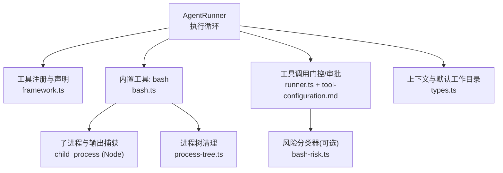
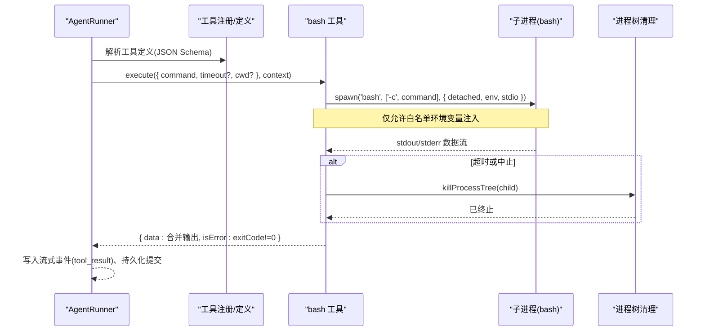
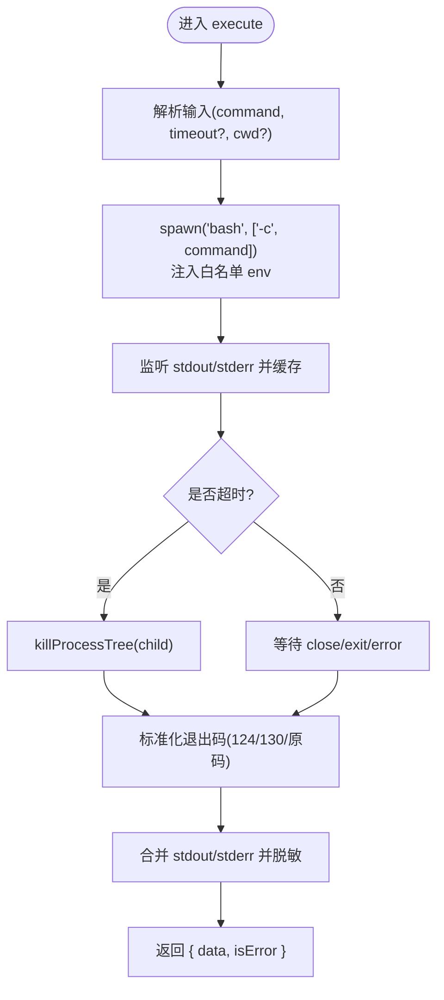
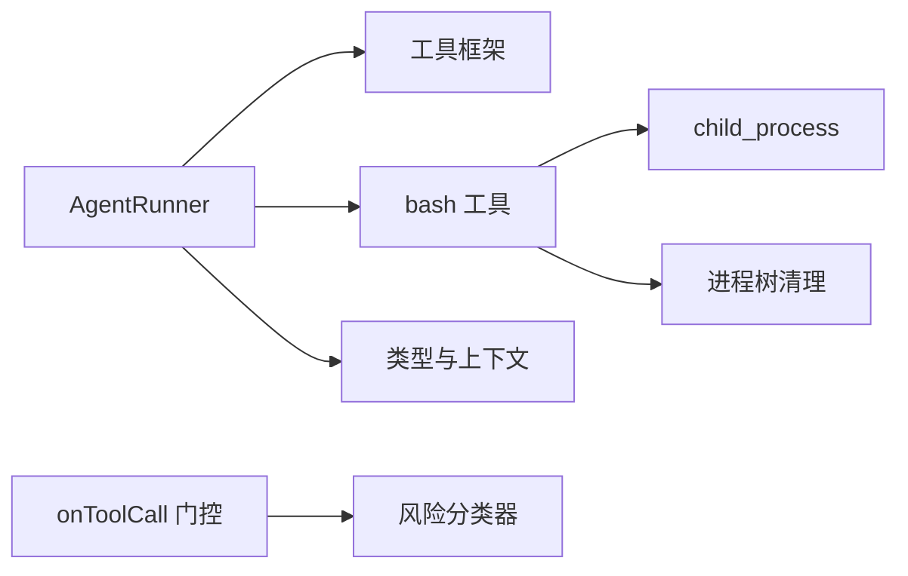

# 进程执行工具

<cite>
**本文引用的文件**
- [bash.ts](file://packages/core/src/tool/built-in/bash.ts)
- [bash-risk.ts](file://packages/core/src/tool/classifiers/bash-risk.ts)
- [process-tree.ts](file://packages/core/src/utils/process-tree.ts)
- [framework.ts](file://packages/core/src/tool/framework.ts)
- [runner.ts](file://packages/core/src/agent/runner.ts)
- [types.ts](file://packages/core/src/types.ts)
- [tool-configuration.md](file://docs/tool-configuration.md)
</cite>

## 目录
1. [简介](#简介)
2. [项目结构](#项目结构)
3. [核心组件](#核心组件)
4. [架构总览](#架构总览)
5. [详细组件分析](#详细组件分析)
6. [依赖关系分析](#依赖关系分析)
7. [性能考虑](#性能考虑)
8. [故障排查指南](#故障排查指南)
9. [结论](#结论)
10. [附录](#附录)

## 简介
本章节面向 Open Multi-Agent 的进程执行能力，聚焦内置 bash 工具（bashTool）与相关安全、配置、错误处理机制。内容涵盖：
- 命令行执行、脚本运行、管道操作与环境变量传递
- 安全沙箱与权限控制、资源限制、超时保护
- 工作目录、环境变量、输出捕获等配置选项
- 常见使用场景的代码示例路径
- 错误处理与异常管理
- 安全最佳实践与性能优化建议
- 如何避免常见安全风险和执行问题

## 项目结构
Open Multi-Agent 将“进程执行”作为工具层的一部分，核心实现位于 packages/core/src/tool 下，其中 bash 工具由 built-in 子模块提供；风险分类器在 classifiers 中；进程树清理在 utils 中；工具框架与类型定义在 framework.ts 与 types.ts；编排与执行流程在 agent/runner.ts；工具配置与安全策略在 docs/tool-configuration.md。

图表来源
- [runner.ts:875-1486](file://packages/core/src/agent/runner.ts#L875-L1486)
- [framework.ts:71-117](file://packages/core/src/tool/framework.ts#L71-L117)
- [bash.ts:37-79](file://packages/core/src/tool/built-in/bash.ts#L37-L79)
- [process-tree.ts:13-33](file://packages/core/src/utils/process-tree.ts#L13-L33)
- [bash-risk.ts:162-190](file://packages/core/src/tool/classifiers/bash-risk.ts#L162-L190)
- [types.ts:531-557](file://packages/core/src/types.ts#L531-L557)

章节来源
- [runner.ts:875-1486](file://packages/core/src/agent/runner.ts#L875-L1486)
- [framework.ts:71-117](file://packages/core/src/tool/framework.ts#L71-L117)
- [bash.ts:37-79](file://packages/core/src/tool/built-in/bash.ts#L37-L79)
- [process-tree.ts:13-33](file://packages/core/src/utils/process-tree.ts#L13-L33)
- [bash-risk.ts:162-190](file://packages/core/src/tool/classifiers/bash-risk.ts#L162-L190)
- [types.ts:531-557](file://packages/core/src/types.ts#L531-L557)
- [tool-configuration.md:214-250](file://docs/tool-configuration.md#L214-L250)

## 核心组件
- bash 工具（bashTool）
  - 功能：以非交互式 shell（bash -c）执行命令，返回 stdout 与 stderr，支持可选超时和工作目录。
  - 标记为“后果性工具”，意味着授予该工具即允许真实副作用。
  - 输入参数：command、timeout（毫秒）、cwd（可选）。
  - 输出：合并后的文本输出，并在退出码非零时标记 isError。
- 工具框架（defineTool / ToolRegistry）
  - 统一工具定义、注册、JSON Schema 转换与 LLM 暴露。
- 进程树清理（killProcessTree）
  - POSIX 通过进程组信号终止整个子进程树；Windows 通过 taskkill 递归终止。
- 风险分类器（classifyBashCommand）
  - 对 bash 命令进行 safe/review/high 三级风险评估，辅助 onToolCall 门控决策。
- 执行编排（AgentRunner）
  - 负责工具调用生命周期：授权检查、门控、执行、结果回传、可恢复提交、流式事件。

章节来源
- [bash.ts:37-79](file://packages/core/src/tool/built-in/bash.ts#L37-L79)
- [framework.ts:71-117](file://packages/core/src/tool/framework.ts#L71-L117)
- [process-tree.ts:13-33](file://packages/core/src/utils/process-tree.ts#L13-L33)
- [bash-risk.ts:162-190](file://packages/core/src/tool/classifiers/bash-risk.ts#L162-L190)
- [runner.ts:1364-1486](file://packages/core/src/agent/runner.ts#L1364-L1486)

## 架构总览
下图展示从 AgentRunner 到 bash 工具执行的完整调用链，包括超时、中止、输出捕获与进程树清理。

图表来源
- [runner.ts:1364-1486](file://packages/core/src/agent/runner.ts#L1364-L1486)
- [bash.ts:96-196](file://packages/core/src/tool/built-in/bash.ts#L96-L196)
- [process-tree.ts:13-33](file://packages/core/src/utils/process-tree.ts#L13-L33)

## 详细组件分析

### bash 工具（bashTool）
- 功能特性
  - 命令行执行：通过 bash -c 执行任意命令字符串。
  - 脚本运行：可直接传入脚本命令序列（如多行脚本、&&/||/; 组合）。
  - 管道操作：支持 shell 管道（|）及重定向（>、>>），但注意输出会全部被捕获并返回给模型。
  - 环境变量传递：仅传递白名单中的环境变量，敏感名称会被过滤。
  - 工作目录：可通过 input.cwd 指定；未设置时使用工具上下文默认工作目录。
  - 超时保护：默认超时时间（毫秒），超过则强制终止整个子进程树。
  - 中止信号：响应上层 abortSignal，立即终止子进程树。
  - 输出捕获：stdout 与 stderr 分别收集，最终合并为可读文本；stderr 存在时会标注分隔。
  - 错误语义：exitCode 非零时返回 isError=true，便于上层判定失败。
- 安全要点
  - 环境变量白名单：仅 HOME、PATH、SHELL、TERM、TMP*、USER 等基础项。
  - 敏感名过滤：基于 isSensitiveName 进一步剔除潜在敏感键名。
  - 非交互模式：避免交互式会话残留。
  - 进程组隔离：POSIX 下 detached 创建进程组，便于一次性终止。
- 典型用法（代码示例路径）
  - 基本命令执行：[bash.ts:47-79](file://packages/core/src/tool/built-in/bash.ts#L47-L79)
  - 带超时与自定义工作目录：[bash.ts:47-79](file://packages/core/src/tool/built-in/bash.ts#L47-L79)
  - 管道与重定向：[bash.ts:96-196](file://packages/core/src/tool/built-in/bash.ts#L96-L196)

图表来源
- [bash.ts:96-196](file://packages/core/src/tool/built-in/bash.ts#L96-L196)
- [process-tree.ts:13-33](file://packages/core/src/utils/process-tree.ts#L13-L33)

章节来源
- [bash.ts:37-79](file://packages/core/src/tool/built-in/bash.ts#L37-L79)
- [bash.ts:96-196](file://packages/core/src/tool/built-in/bash.ts#L96-L196)
- [process-tree.ts:13-33](file://packages/core/src/utils/process-tree.ts#L13-L33)

### 工具框架与注册（defineTool / ToolRegistry）
- defineTool
  - 统一工具定义入口，支持 consequential 标记、outputSchema 校验、maxOutputChars 限制、llmInputSchema 覆盖等。
- ToolRegistry
  - 注册、列出、转换为 LLM 可用的 JSON Schema，支持运行时工具与静态工具的区分。
- 与 bash 的关系
  - bashTool 通过 defineTool 定义，随后由框架注册并暴露给模型调用。

章节来源
- [framework.ts:71-117](file://packages/core/src/tool/framework.ts#L71-L117)
- [framework.ts:127-261](file://packages/core/src/tool/framework.ts#L127-L261)

### 风险分类器（classifyBashCommand）
- 作用
  - 在 onToolCall 门控中，对 bash 命令进行轻量级风险评估（safe/review/high），帮助决定是否放行、人工复核或直接拒绝。
- 规则概览
  - high：删除、提权、格式化磁盘、fork bomb、强制推送、发布包、写入系统路径等。
  - review：递归遍历、大范围扫描、权限变更、进程终止、系统路径移动/复制等。
  - safe：只读查询类命令（ls、cat、pwd、git 只读子命令等）。
- 注意事项
  - 仅为启发式规则，非安全边界；复杂/混淆命令可能绕过检测。
  - 未知命令默认 review，遵循“不盲跑”原则。

章节来源
- [bash-risk.ts:1-32](file://packages/core/src/tool/classifiers/bash-risk.ts#L1-L32)
- [bash-risk.ts:55-103](file://packages/core/src/tool/classifiers/bash-risk.ts#L55-L103)
- [bash-risk.ts:162-190](file://packages/core/src/tool/classifiers/bash-risk.ts#L162-L190)

### 执行编排与门控（AgentRunner）
- 工具调用生命周期
  - 授权检查：若工具未被授予，直接返回“未授予”的错误结果。
  - 门控回调：onToolCall 可在执行前拦截（allow/deny/suspend），支持人类确认与可恢复挂起。
  - 执行与结果：执行工具后，将结果写入流式事件，并可选择持久化提交。
  - 可恢复性：支持 checkpoint 与 durable approval，确保中断后可恢复。
- 与 bash 的集成
  - 通过 ToolUseContext 注入 abortSignal、cwd、credentials 等上下文信息。
  - 工具结果经摘要/裁剪后回传给模型，避免对话膨胀。

章节来源
- [runner.ts:1364-1486](file://packages/core/src/agent/runner.ts#L1364-L1486)
- [runner.ts:875-1486](file://packages/core/src/agent/runner.ts#L875-L1486)
- [types.ts:531-557](file://packages/core/src/types.ts#L531-L557)

### 配置选项与沙箱
- 工作目录（cwd）
  - 文件系统工具受 per-agent 工作目录沙箱约束；bash 本身不受此沙箱限制。
  - 可通过 OrchestratorConfig.defaultCwd 或 AgentConfig.cwd 设置；设为 null 可禁用沙箱。
- 环境变量
  - bash 工具仅注入白名单环境变量，敏感键名会被过滤。
- 输出控制
  - maxToolOutputChars 可限制工具输出长度；rich modelOutput 需显式控制大小。
- 默认工具预设
  - defaultToolPreset 可为未显式声明 tools 的代理提供默认工具集（readonly/readwrite/full）。
- 后果性工具与确认
  - bash 标记为 consequential；在未声明治理意图的自动路由中，可能触发确认流程。

章节来源
- [tool-configuration.md:214-250](file://docs/tool-configuration.md#L214-L250)
- [tool-configuration.md:391-442](file://docs/tool-configuration.md#L391-L442)
- [tool-configuration.md:507-673](file://docs/tool-configuration.md#L507-L673)
- [types.ts:531-557](file://packages/core/src/types.ts#L531-L557)

## 依赖关系分析
- AgentRunner 依赖工具框架与具体工具实现，协调授权、门控、执行与结果回传。
- bash 工具依赖 Node child_process 启动子进程，依赖 process-tree 进行进程组清理。
- 风险分类器独立于执行路径，供 onToolCall 门控使用。
- 类型与上下文（ToolUseContext）贯穿各层，决定工作目录、中止信号、凭据等。

图表来源
- [runner.ts:1364-1486](file://packages/core/src/agent/runner.ts#L1364-L1486)
- [framework.ts:71-117](file://packages/core/src/tool/framework.ts#L71-L117)
- [bash.ts:96-196](file://packages/core/src/tool/built-in/bash.ts#L96-L196)
- [process-tree.ts:13-33](file://packages/core/src/utils/process-tree.ts#L13-L33)
- [bash-risk.ts:162-190](file://packages/core/src/tool/classifiers/bash-risk.ts#L162-L190)
- [types.ts:531-557](file://packages/core/src/types.ts#L531-L557)

章节来源
- [runner.ts:1364-1486](file://packages/core/src/agent/runner.ts#L1364-L1486)
- [framework.ts:71-117](file://packages/core/src/tool/framework.ts#L71-L117)
- [bash.ts:96-196](file://packages/core/src/tool/built-in/bash.ts#L96-L196)
- [process-tree.ts:13-33](file://packages/core/src/utils/process-tree.ts#L13-L33)
- [bash-risk.ts:162-190](file://packages/core/src/tool/classifiers/bash-risk.ts#L162-L190)
- [types.ts:531-557](file://packages/core/src/types.ts#L531-L557)

## 性能考虑
- 超时与中止
  - 合理设置 timeout 与 AbortSignal，避免长时间阻塞；默认超时可防止僵尸进程。
- 输出体积控制
  - 使用 maxToolOutputChars 限制输出，避免对话膨胀和成本飙升。
- 环境变量最小化
  - 仅注入必要的环境变量，减少子进程初始化开销与泄露面。
- 进程组清理
  - 利用 detached + 进程组信号快速回收子进程树，降低资源泄漏风险。
- 流式事件
  - 通过 tool_use/tool_result 事件实时反馈，便于前端与监控消费。

## 故障排查指南
- 常见问题
  - 命令未执行：检查工具是否被授予（tools/toolPreset），以及 onToolCall 是否 deny。
  - 输出为空：确认命令确实产生输出；无输出且成功时会返回提示文本。
  - 超时/中止：检查 timeout 设置与上层 abortSignal；查看退出码 124（超时）或 130（中止）。
  - 权限问题：确认 cwd 与工作目录权限；bash 不受文件系统沙箱限制，但宿主权限仍生效。
  - 环境变量缺失：仅白名单环境变量可用，必要时调整白名单或改用其他机制。
- 定位方法
  - 观察 tool_result 流事件与 onToolResult 回调。
  - 启用跟踪（trace）查看 tool_call 事件与耗时。
  - 使用风险分类器在 onToolCall 中打印 reason，辅助诊断。

章节来源
- [runner.ts:1364-1486](file://packages/core/src/agent/runner.ts#L1364-L1486)
- [bash.ts:96-196](file://packages/core/src/tool/built-in/bash.ts#L96-L196)
- [bash-risk.ts:162-190](file://packages/core/src/tool/classifiers/bash-risk.ts#L162-L190)

## 结论
Open Multi-Agent 的 bash 工具提供了强大而可控的进程执行能力：通过白名单环境变量、超时与中止、进程组清理、输出脱敏与长度限制等手段，在保证灵活性的同时兼顾安全性与稳定性。配合工具授权、门控与风险分类器，可以在不同信任级别的环境中安全地执行命令。生产环境建议结合容器/VM/seccomp 等进程级隔离，以实现真正的不可信 shell 执行。

## 附录
- 常见场景与示例路径
  - 基本命令执行：[bash.ts:47-79](file://packages/core/src/tool/built-in/bash.ts#L47-L79)
  - 带超时与自定义工作目录：[bash.ts:47-79](file://packages/core/src/tool/built-in/bash.ts#L47-L79)
  - 管道与重定向：[bash.ts:96-196](file://packages/core/src/tool/built-in/bash.ts#L96-L196)
  - 风险门控示例：[bash-risk.ts:162-190](file://packages/core/src/tool/classifiers/bash-risk.ts#L162-L190)
  - 工具注册与定义：[framework.ts:71-117](file://packages/core/src/tool/framework.ts#L71-L117)
  - 执行编排与提交：[runner.ts:1364-1486](file://packages/core/src/agent/runner.ts#L1364-L1486)
- 安全最佳实践
  - 仅在可信环境中授予 bash；否则使用容器/VM/seccomp。
  - 使用 onToolCall + classifyBashCommand 实施分级策略。
  - 严格限制环境变量与 cwd；避免将敏感信息注入子进程。
  - 始终设置合理的超时与中止信号。
  - 控制输出大小，避免对话膨胀与成本失控。
- 性能优化建议
  - 复用工作目录与命令模板，减少重复准备。
  - 批量命令尽量合并为单次执行，降低进程创建开销。
  - 使用流式事件与压缩策略，降低传输与存储成本。