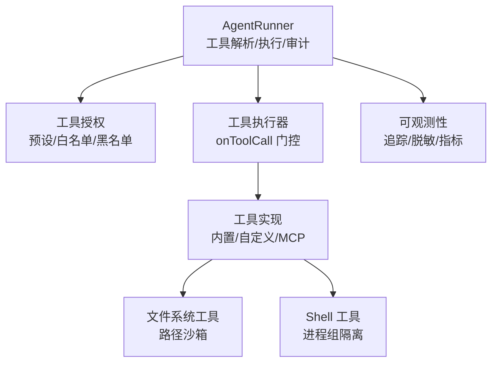
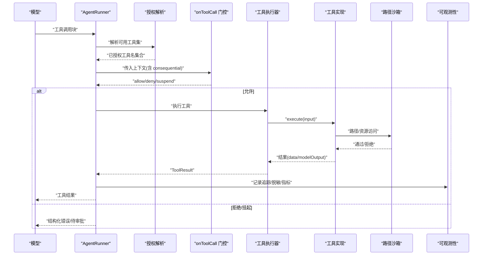
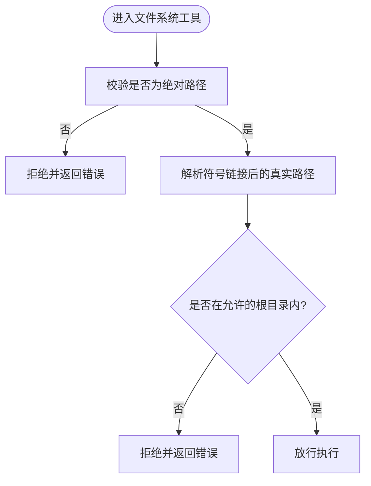
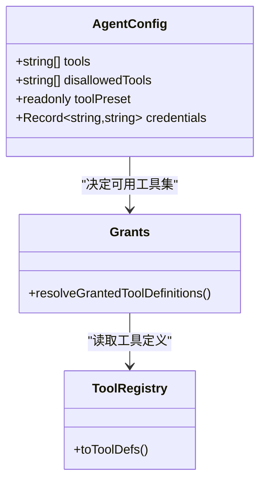
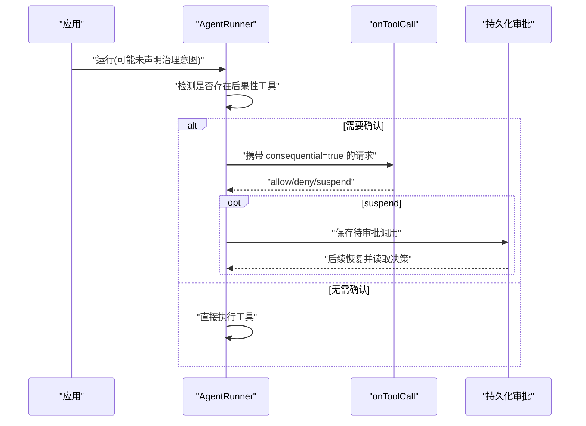
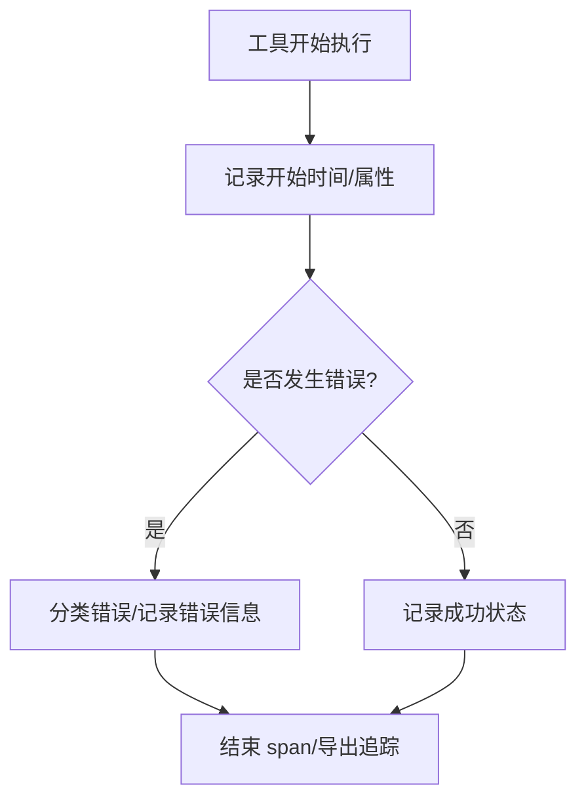
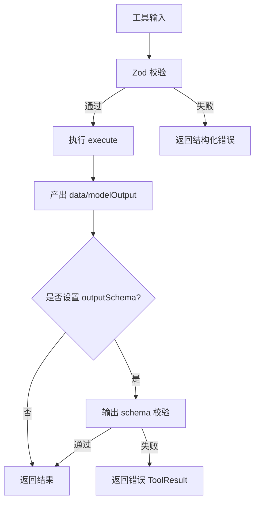
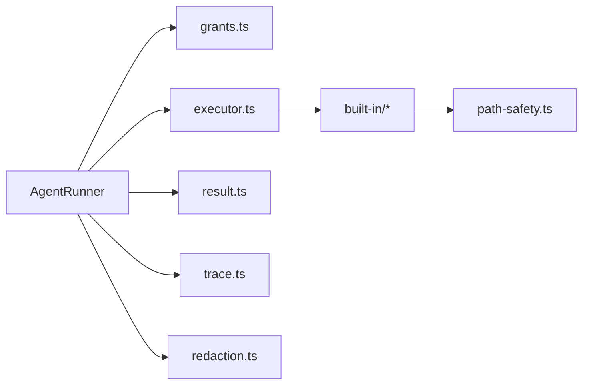

# 工具安全机制

<cite>
**本文引用的文件**
- [README.md](file://README.md)
- [SECURITY.md](file://.github/SECURITY.md)
- [tool-configuration.md](file://docs/tool-configuration.md)
- [types.ts](file://packages/core/src/types.ts)
- [runner.ts](file://packages/core/src/agent/runner.ts)
- [path-safety.ts](file://packages/core/src/tool/built-in/path-safety.ts)
- [bash.ts](file://packages/core/src/tool/built-in/bash.ts)
- [grants.ts](file://packages/core/src/tool/grants.ts)
- [executor.ts](file://packages/core/src/tool/executor.ts)
- [result.ts](file://packages/core/src/tool/result.ts)
- [trace.ts](file://packages/core/src/utils/trace.js)
- [redaction.ts](file://packages/core/src/utils/redaction.js)
</cite>

## 目录
1. [简介](#简介)
2. [项目结构](#项目结构)
3. [核心组件](#核心组件)
4. [架构总览](#架构总览)
5. [详细组件分析](#详细组件分析)
6. [依赖关系分析](#依赖关系分析)
7. [性能与安全权衡](#性能与安全权衡)
8. [故障排查指南](#故障排查指南)
9. [结论](#结论)
10. [附录：企业部署与合规建议](#附录企业部署与合规建议)

## 简介
本文件系统性阐述 Open Multi-Agent（OMA）在“工具调用”层面的安全机制与保护措施，覆盖沙箱隔离、权限控制、后果性工具确认、审计日志与监控、输入输出验证、配置最佳实践、常见威胁防护、安全测试与漏洞扫描建议，以及企业级部署的合规要点。内容基于仓库中的类型定义、运行器实现、工具注册与授权、内置工具路径安全等源码与文档进行归纳。

## 项目结构
OMA 的安全能力分布在以下层次：
- 编排层：运行器负责工具解析、执行、审批、审计与结果回传。
- 工具层：工具注册、授权（白名单/预设/黑名单）、执行器、结果处理。
- 内置工具层：文件系统工具的路径沙箱、shell 工具的进程隔离。
- 可观测性层：追踪、脱敏、错误分类与指标上报。
- 配置层：默认拒绝、最小权限、工作目录限制、后果性工具确认策略。

图表来源
- [runner.ts:817-827](file://packages/core/src/agent/runner.ts#L817-L827)
- [grants.ts](file://packages/core/src/tool/grants.ts)
- [executor.ts](file://packages/core/src/tool/executor.ts)
- [path-safety.ts](file://packages/core/src/tool/built-in/path-safety.ts)
- [bash.ts](file://packages/core/src/tool/built-in/bash.ts)
- [trace.ts](file://packages/core/src/utils/trace.js)
- [redaction.ts](file://packages/core/src/utils/redaction.js)

章节来源
- [README.md:46-108](file://README.md#L46-L108)
- [tool-configuration.md:214-238](file://docs/tool-configuration.md#L214-L238)

## 核心组件
- 工具授权与最小权限
  - 默认拒绝：未显式授予的工具不可执行；内置工具需通过 tools 或 toolPreset 明确开启。
  - 预设/白名单/黑名单组合，最终由框架安全护栏收敛。
- 后果性工具与确认
  - consequential 标志声明工具具有真实副作用；可在未声明治理意图的运行中触发确认流程。
  - requireConsequentialConfirmation 配合 onToolCall 实现逐次确认或挂起决策。
- 沙箱与工作目录
  - 文件系统工具强制绝对路径并在指定根目录下校验（含符号链接）。
  - bash 不沙箱化，需通过进程组隔离与外部容器/VM 提供真正隔离。
- 输入输出验证与脱敏
  - 输入使用 Zod schema 校验；输出支持可选 schema 校验与富媒体边界复制。
  - 追踪与日志对敏感字段自动脱敏。
- 审计与监控
  - 每次工具调用生成追踪事件，记录门控动作、耗时、错误分类与摘要输出。
  - 支持断点续跑与持久化审批，保证幂等与可恢复。

章节来源
- [types.ts:544-583](file://packages/core/src/types.ts#L544-L583)
- [types.ts:698-726](file://packages/core/src/types.ts#L698-L726)
- [types.ts:974-1009](file://packages/core/src/types.ts#L974-L1009)
- [types.ts:2236-2257](file://packages/core/src/types.ts#L2236-L2257)
- [runner.ts:1391-1429](file://packages/core/src/agent/runner.ts#L1391-L1429)
- [runner.ts:1460-1528](file://packages/core/src/agent/runner.ts#L1460-L1528)
- [tool-configuration.md:140-213](file://docs/tool-configuration.md#L140-L213)
- [tool-configuration.md:391-441](file://docs/tool-configuration.md#L391-L441)
- [tool-configuration.md:507-649](file://docs/tool-configuration.md#L507-L649)

## 架构总览
下图展示一次工具调用的端到端安全路径：从模型请求到工具执行、门控、沙箱校验、审计与结果回传。

图表来源
- [runner.ts:817-827](file://packages/core/src/agent/runner.ts#L817-L827)
- [runner.ts:1364-1429](file://packages/core/src/agent/runner.ts#L1364-L1429)
- [runner.ts:1460-1528](file://packages/core/src/agent/runner.ts#L1460-L1528)
- [path-safety.ts](file://packages/core/src/tool/built-in/path-safety.ts)
- [result.ts](file://packages/core/src/tool/result.ts)
- [trace.ts](file://packages/core/src/utils/trace.js)
- [redaction.ts](file://packages/core/src/utils/redaction.js)

## 详细组件分析

### 沙箱环境与路径隔离
- 文件系统工具强制绝对路径，并在配置的根目录下进行解析与校验，符号链接也会被解析后检查，防止逃逸。
- 默认工作目录为进程当前目录下的 .agent-workspace，首次写入时自动创建；可通过 orchestrator 或 agent 级别配置调整或禁用。
- bash 不在沙箱内，应通过容器/VM/seccomp 等进程级隔离手段保护主机环境。

图表来源
- [types.ts:544-557](file://packages/core/src/types.ts#L544-L557)
- [types.ts:1001-1009](file://packages/core/src/types.ts#L1001-L1009)
- [tool-configuration.md:391-441](file://docs/tool-configuration.md#L391-L441)

章节来源
- [tool-configuration.md:391-441](file://docs/tool-configuration.md#L391-L441)
- [bash.ts](file://packages/core/src/tool/built-in/bash.ts)

### 工具权限控制（RBAC 与细粒度）
- 默认拒绝：未显式授予的工具不可执行；内置工具必须通过 tools 或 toolPreset 开启。
- 预设/白名单/黑名单组合，最终由框架安全护栏收敛；自定义工具绕过预设过滤但仍受黑名单约束。
- 通过 AgentConfig.credentials 将密钥按代理维度隔离，避免共享闭包泄露。

图表来源
- [types.ts:974-1009](file://packages/core/src/types.ts#L974-L1009)
- [runner.ts:817-827](file://packages/core/src/agent/runner.ts#L817-L827)
- [grants.ts](file://packages/core/src/tool/grants.ts)

章节来源
- [tool-configuration.md:214-238](file://docs/tool-configuration.md#L214-L238)
- [tool-configuration.md:251-289](file://docs/tool-configuration.md#L251-L289)
- [tool-configuration.md:469-505](file://docs/tool-configuration.md#L469-L505)

### 后果性工具与确认流程
- consequential 标志用于声明工具具备真实副作用；系统不会从提示词或参数推断该标志。
- 在未声明治理意图的 runTeam/runAgent 中，若存在后果性工具，会标记风险并可选择开启 requireConsequentialConfirmation。
- onToolCall 可在每次调用前做细粒度判断，支持 allow/deny/suspend；suspend 可与持久化审批结合，支持断点恢复。

图表来源
- [types.ts:698-726](file://packages/core/src/types.ts#L698-L726)
- [types.ts:2257-2274](file://packages/core/src/types.ts#L2257-L2274)
- [tool-configuration.md:140-213](file://docs/tool-configuration.md#L140-L213)

章节来源
- [tool-configuration.md:140-213](file://docs/tool-configuration.md#L140-L213)
- [types.ts:592-603](file://packages/core/src/types.ts#L592-L603)

### 审计日志与监控
- 每次工具调用都会生成追踪事件，包含工具名、输入摘要、输出摘要、耗时、是否被门控及门控动作。
- 敏感信息自动脱敏；错误会被分类为 provider/tool/framework 等类别，便于告警与度量。
- 支持 v2 可观测性 sink 与 legacy onTrace 回调，兼容不同监控栈。

图表来源
- [runner.ts:1460-1528](file://packages/core/src/agent/runner.ts#L1460-L1528)
- [trace.ts](file://packages/core/src/utils/trace.js)
- [redaction.ts](file://packages/core/src/utils/redaction.js)

章节来源
- [runner.ts:1460-1528](file://packages/core/src/agent/runner.ts#L1460-L1528)

### 输入输出安全验证与过滤
- 输入：Zod schema 校验，失败即阻止执行，避免非法参数进入工具。
- 输出：可选 outputSchema 校验；富媒体 modelOutput 会在工具边界进行防御性拷贝与类型校验；超长输出可截断。
- 压缩：已消费的工具结果可在上下文中压缩以减少后续 token 成本。

图表来源
- [types.ts:698-726](file://packages/core/src/types.ts#L698-L726)
- [tool-configuration.md:507-649](file://docs/tool-configuration.md#L507-L649)

章节来源
- [types.ts:698-726](file://packages/core/src/types.ts#L698-L726)
- [tool-configuration.md:507-649](file://docs/tool-configuration.md#L507-L649)

## 依赖关系分析
- AgentRunner 依赖工具注册表与授权模块，决定实际可用的工具定义集合。
- 执行器在工具执行前后接入门控与审计，确保策略一致性与可观测性。
- 内置工具通过路径安全模块进行访问控制；bash 通过进程组隔离降低影响面。
- 结果处理模块统一封装 modelOutput 与 data 的边界，保障传输安全与一致性。

图表来源
- [runner.ts:817-827](file://packages/core/src/agent/runner.ts#L817-L827)
- [grants.ts](file://packages/core/src/tool/grants.ts)
- [executor.ts](file://packages/core/src/tool/executor.ts)
- [path-safety.ts](file://packages/core/src/tool/built-in/path-safety.ts)
- [result.ts](file://packages/core/src/tool/result.ts)
- [trace.ts](file://packages/core/src/utils/trace.js)
- [redaction.ts](file://packages/core/src/utils/redaction.js)

章节来源
- [runner.ts:817-827](file://packages/core/src/agent/runner.ts#L817-L827)

## 性能与安全权衡
- 默认拒绝与最小权限有助于减少攻击面，但会增加配置复杂度；建议通过预设快速落地，再按需收紧。
- 工具输出压缩可减少上下文膨胀与成本，但需权衡可读性与调试需求。
- 富媒体 modelOutput 提升交互体验，但会增大请求体与存储体积；生产环境建议使用引用而非内联大文件。
- 循环检测与预算上限可防止失控消耗；建议在长任务中启用。

[本节为通用指导，不直接分析具体文件]

## 故障排查指南
- 工具未被执行
  - 检查是否已通过 tools 或 toolPreset 授予；未授予的工具会返回“未授权”的结构化错误。
- 路径访问被拒
  - 确认使用了绝对路径且目标在允许的工作目录内；注意符号链接解析后的真实路径。
- 后果性工具被拒绝
  - 检查是否启用了 requireConsequentialConfirmation 或未配置 onToolCall；必要时使用 suspend 走持久化审批。
- 输出过大或格式错误
  - 为工具设置 maxOutputChars 或 outputSchema；富媒体需符合 MIME 与协议要求。
- 审计缺失或敏感信息泄露
  - 确认已配置 observability sink 或 onTrace；检查 redaction 是否生效。

章节来源
- [runner.ts:1391-1429](file://packages/core/src/agent/runner.ts#L1391-L1429)
- [tool-configuration.md:391-441](file://docs/tool-configuration.md#L391-L441)
- [tool-configuration.md:507-649](file://docs/tool-configuration.md#L507-L649)

## 结论
OMA 以“默认拒绝 + 最小权限”为核心，结合路径沙箱、后果性工具确认、输入输出校验与完善的审计监控，构建了面向多智能体的工具安全基线。生产环境中应优先采用预设与白名单快速落地，再通过 onToolCall 与持久化审批实现细粒度控制，并以容器/VM 隔离 shell 执行，确保真正的隔离边界。

[本节为总结性内容，不直接分析具体文件]

## 附录：企业部署与合规建议
- 安全基线
  - 启用默认拒绝与最小权限；仅授予必要工具；对后果性工具开启确认。
  - 严格限定文件系统工具的工作目录；禁止不必要的 bash 权限。
  - 使用 per-agent credentials 隔离密钥；对追踪与日志启用脱敏。
- 合规与审计
  - 保留完整的工具调用审计链（输入摘要、输出摘要、耗时、错误分类、门控动作）。
  - 对关键操作启用持久化审批与可恢复检查点，满足事后追溯与合规审计。
- 威胁防护
  - 防范提示注入导致的越权工具调用：坚持默认拒绝与名称级授权。
  - 防范路径穿越与符号链接逃逸：使用路径沙箱并校验真实路径。
  - 防范无限循环与预算超支：启用循环检测与 token/cost 预算上限。
- 安全测试与漏洞扫描
  - 单元测试：覆盖工具输入/输出 schema、沙箱边界、门控分支（allow/deny/suspend）。
  - 集成测试：模拟后果性工具确认流程与持久化审批恢复。
  - 代码扫描：静态分析识别硬编码密钥、不安全路径拼接、异常未捕获。
  - 依赖扫描：定期更新依赖，关注第三方库漏洞。
- 供应商与数据外发
  - 工具结果会进入模型提供商上下文；对敏感数据采取脱敏与最小披露策略。
  - 富媒体优先使用 HTTP(S) 引用，避免内联大文件或敏感 URL。
- 报告漏洞
  - 遵循仓库安全策略，通过指定渠道私下报告，避免公开 issue。

章节来源
- [SECURITY.md:1-18](file://.github/SECURITY.md#L1-L18)
- [tool-configuration.md:507-649](file://docs/tool-configuration.md#L507-L649)
- [runner.ts:1460-1528](file://packages/core/src/agent/runner.ts#L1460-L1528)