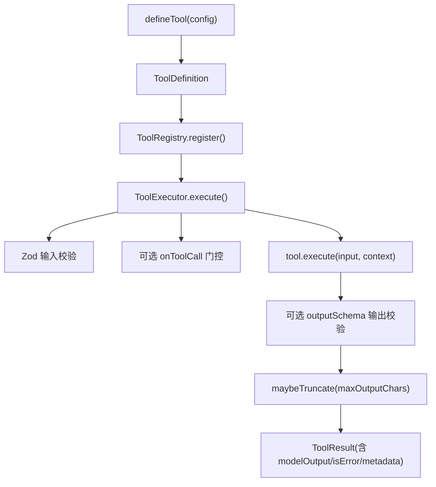
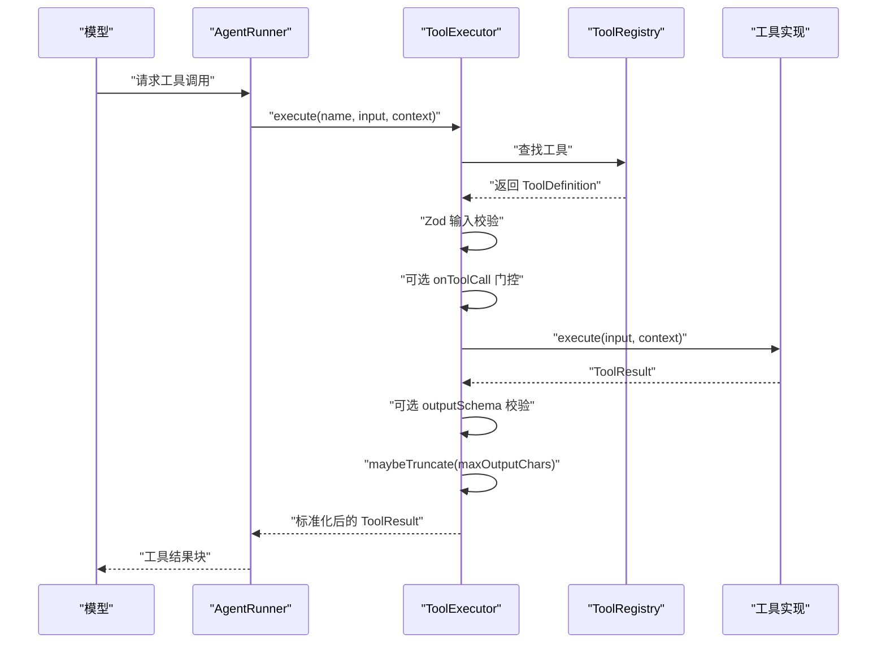
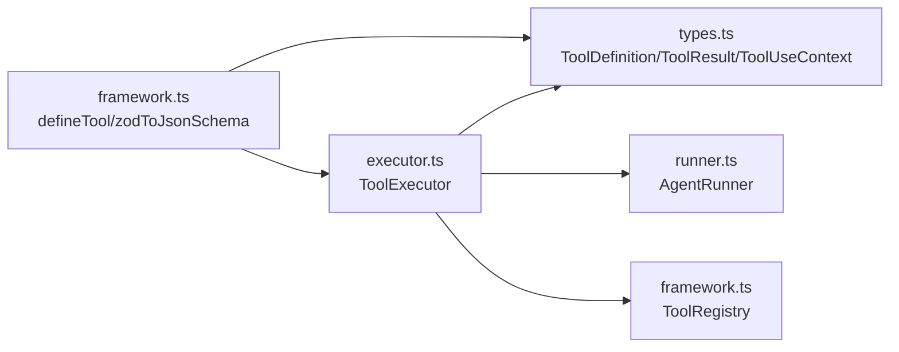

# 工具定义

<cite>
**本文引用的文件**
- [framework.ts](file://packages/core/src/tool/framework.ts)
- [executor.ts](file://packages/core/src/tool/executor.ts)
- [types.ts](file://packages/core/src/types.ts)
- [index.ts](file://packages/core/src/index.ts)
- [multi-model-team.ts](file://packages/core/examples/basics/multi-model-team.ts)
- [runner.ts](file://packages/core/src/agent/runner.ts)
</cite>

## 目录
1. [简介](#简介)
2. [项目结构](#项目结构)
3. [核心组件](#核心组件)
4. [架构总览](#架构总览)
5. [详细组件分析](#详细组件分析)
6. [依赖关系分析](#依赖关系分析)
7. [性能考虑](#性能考虑)
8. [故障排查指南](#故障排查指南)
9. [结论](#结论)
10. [附录：完整示例与最佳实践](#附录完整示例与最佳实践)

## 简介
本章节面向 Open Multi-Agent 的 defineTool 函数，系统讲解如何定义工具、如何进行输入参数验证、如何处理输出结果与错误、consequential 标志的作用、maxOutputChars 的输出截断机制，以及异步执行与错误处理的最佳实践。文档同时提供从简单到复杂的多种使用模式，帮助读者快速上手并安全地扩展自定义工具。

## 项目结构
Open Multi-Agent 的工具系统由“定义—注册—执行—转换”四个环节组成：
- 定义：通过 defineTool 声明工具元数据与执行逻辑
- 注册：将工具加入 ToolRegistry，供 Agent 发现与调用
- 执行：ToolExecutor 负责参数校验、并发控制、审批门控、输出规范化与截断
- 转换：将 Zod Schema 转换为 LLM 可消费的 JSON Schema（或直接使用 llmInputSchema）

图表来源
- [framework.ts:71-117](file://packages/core/src/tool/framework.ts#L71-L117)
- [executor.ts:112-133](file://packages/core/src/tool/executor.ts#L112-L133)
- [executor.ts:181-338](file://packages/core/src/tool/executor.ts#L181-L338)
- [executor.ts:359-379](file://packages/core/src/tool/executor.ts#L359-L379)

章节来源
- [index.ts:165-167](file://packages/core/src/index.ts#L165-L167)
- [framework.ts:71-117](file://packages/core/src/tool/framework.ts#L71-L117)
- [executor.ts:112-133](file://packages/core/src/tool/executor.ts#L112-L133)

## 核心组件
- defineTool：统一入口，返回符合 ToolDefinition 接口的对象，包含 name、description、inputSchema、execute 等核心属性，并支持 consequential、outputSchema、llmInputSchema、maxOutputChars 等可选配置。
- ToolRegistry：维护工具集合，提供 toToolDefs/toLLMTools 等方法，将工具转换为 LLM 可用的描述格式。
- ToolExecutor：执行工具的核心运行时，负责输入校验、并发控制、审批门控、输出规范化与截断、错误隔离。
- ToolUseContext：注入到每个工具执行的上下文，包含 agent、team、abortSignal/abortController、runId/taskId/toolCallId 等。
- ToolResult：工具执行结果的标准结构，包含 data、modelOutput、isError、metadata。

章节来源
- [framework.ts:71-117](file://packages/core/src/tool/framework.ts#L71-L117)
- [types.ts:511-516](file://packages/core/src/types.ts#L511-L516)
- [types.ts:531-602](file://packages/core/src/types.ts#L531-L602)
- [types.ts:676-733](file://packages/core/src/types.ts#L676-L733)
- [executor.ts:38-96](file://packages/core/src/tool/executor.ts#L38-L96)

## 架构总览
下图展示了从模型请求工具调用到工具执行与结果回传的完整流程，包括输入校验、门控审批、执行、输出校验与截断、以及错误处理。

图表来源
- [runner.ts:1364-1395](file://packages/core/src/agent/runner.ts#L1364-L1395)
- [executor.ts:112-133](file://packages/core/src/tool/executor.ts#L112-L133)
- [executor.ts:181-338](file://packages/core/src/tool/executor.ts#L181-L338)
- [executor.ts:359-379](file://packages/core/src/tool/executor.ts#L359-L379)

## 详细组件分析

### defineTool 基本结构与属性
- name：工具名称，用于注册与调用
- description：工具描述，用于提示模型理解用途
- inputSchema：Zod Schema，用于严格校验输入参数
- execute：异步函数，接收已校验的 input 与 ToolUseContext，返回 Promise<ToolResult<TData>>
- consequential（可选）：标记该工具具有真实副作用，影响审批策略与默认行为
- outputSchema（可选）：对 ToolResult.data 进行运行时校验，失败时返回错误结果而非抛出异常
- llmInputSchema（可选）：直接提供 JSON Schema，跳过 Zod→JSON Schema 转换
- maxOutputChars（可选）：单工具级输出字符上限，超过则按头+尾方式截断

章节来源
- [framework.ts:71-117](file://packages/core/src/tool/framework.ts#L71-L117)
- [types.ts:704-733](file://packages/core/src/types.ts#L704-L733)

### 输入参数验证机制（Zod Schema）
- 所有工具调用在运行前都会通过 inputSchema.safeParse 进行强类型校验
- 校验失败会生成可读的错误信息，并以 isError=true 的 ToolResult 返回，不会中断整体流程
- 支持复杂结构：object/array/union/discriminatedUnion/record/tuple/literal/enum/default/optional/nullable/effect 等
- 当存在持久化审批（durable approval）时，若当前 schema 不再接受已审查的输入，会返回带 approvalError 的错误结果

章节来源
- [executor.ts:181-197](file://packages/core/src/tool/executor.ts#L181-L197)
- [executor.ts:340-353](file://packages/core/src/tool/executor.ts#L340-L353)
- [types.ts:704-733](file://packages/core/src/types.ts#L704-L733)

### 输出结果处理与错误方式
- ToolResult.data：应用侧数据；字符串可直接作为模型可见内容
- ToolResult.modelOutput：可选的模型可见表示，会被防御性复制；未设置时 string data 会原样转发
- ToolResult.isError：布尔值，指示是否为错误结果
- ToolResult.metadata：附加元数据，如 toolCallGate 决策信息、approvalDecision、tokenUsage 等
- 非 string 的 data 必须提供 modelOutput，否则会被视为非法输出
- 错误路径：未知工具、Zod 校验失败、execute 抛错、outputSchema 校验失败、onToolCall deny/suspend 等，均返回 isError=true 的 ToolResult

章节来源
- [types.ts:676-691](file://packages/core/src/types.ts#L676-L691)
- [executor.ts:297-338](file://packages/core/src/tool/executor.ts#L297-L338)
- [executor.ts:381-419](file://packages/core/src/tool/executor.ts#L381-L419)

### consequential 标志的作用与使用场景
- 作用：标记工具具有真实副作用（例如写文件、执行命令、发起网络请求），用于默认拒绝策略下的分类与审批
- 行为：当没有显式授权或审批门控时，consequential=true 的工具可能被拒绝或挂起等待人工审批
- 门控上下文：onToolCall 钩子中会携带 consequential 字段，便于策略判断

章节来源
- [types.ts:708-713](file://packages/core/src/types.ts#L708-L713)
- [executor.ts:206-212](file://packages/core/src/tool/executor.ts#L206-L212)
- [executor.ts:250-264](file://packages/core/src/tool/executor.ts#L250-L264)

### maxOutputChars 配置与输出截断机制
- 优先级：工具级 maxOutputChars > 代理级 maxToolOutputChars
- 触发条件：仅当 result.data 为字符串且长度超过限制时生效
- 截断策略：保留头部约 70% 与尾部约 30%，中间插入截断标记，确保最终长度不超过限制
- 注意：如果设置了 modelOutput，则不重写 modelOutput；非字符串 data 不进行字符截断

章节来源
- [framework.ts:91-96](file://packages/core/src/tool/framework.ts#L91-L96)
- [executor.ts:359-379](file://packages/core/src/tool/executor.ts#L359-L379)
- [executor.ts:490-518](file://packages/core/src/tool/executor.ts#L490-L518)

### 异步执行支持与取消
- execute 必须是异步函数，支持 await 外部 IO（网络、文件、数据库等）
- 支持 AbortSignal：在执行前后检查 abortSignal.aborted，避免无谓执行
- 支持并发控制：ToolExecutor 内部使用信号量限制并行度，批量执行时保证资源可控

章节来源
- [types.ts:531-546](file://packages/core/src/types.ts#L531-L546)
- [executor.ts:125-133](file://packages/core/src/tool/executor.ts#L125-L133)
- [executor.ts:148-164](file://packages/core/src/tool/executor.ts#L148-L164)

### 审批门控（onToolCall）与持久化审批
- onToolCall：可在输入校验后、执行前拦截调用，返回 allow/deny/suspend
- suspend：在编排任务中可挂起等待持久化审批，恢复时重放已审查的决策
- 持久化审批：校验请求哈希与决策一致性，防止篡改或过期

章节来源
- [executor.ts:206-295](file://packages/core/src/tool/executor.ts#L206-L295)
- [runner.ts:1436-1458](file://packages/core/src/agent/runner.ts#L1436-L1458)

## 依赖关系分析
- defineTool 依赖 types 中的 ToolDefinition、ToolResult、ToolUseContext 等接口
- ToolRegistry 依赖 zodToJsonSchema 将 Zod Schema 转为 JSON Schema 供 LLM 使用
- ToolExecutor 依赖 ToolRegistry、Semaphore、zod、审批模块与结果处理模块
- AgentRunner 集成 ToolExecutor，负责工具调用的编排、追踪与结果回传

图表来源
- [framework.ts:71-117](file://packages/core/src/tool/framework.ts#L71-L117)
- [framework.ts:204-260](file://packages/core/src/tool/framework.ts#L204-L260)
- [executor.ts:112-133](file://packages/core/src/tool/executor.ts#L112-L133)
- [runner.ts:1364-1395](file://packages/core/src/agent/runner.ts#L1364-L1395)

章节来源
- [index.ts:165-167](file://packages/core/src/index.ts#L165-L167)
- [framework.ts:204-260](file://packages/core/src/tool/framework.ts#L204-L260)
- [executor.ts:112-133](file://packages/core/src/tool/executor.ts#L112-L133)
- [runner.ts:1364-1395](file://packages/core/src/agent/runner.ts#L1364-L1395)

## 性能考虑
- 输入校验复杂度：Zod safeParse 的时间复杂度与 schema 复杂度相关，建议保持 schema 简洁明确
- 并发控制：默认最大并发为 4，可通过 ToolExecutorOptions.maxConcurrency 调整，避免资源争用
- 输出截断：仅在必要时触发，减少大文本传输与模型处理开销
- 批处理：executeBatch 利用信号量并行执行，提升吞吐

章节来源
- [executor.ts:38-96](file://packages/core/src/tool/executor.ts#L38-L96)
- [executor.ts:148-164](file://packages/core/src/tool/executor.ts#L148-L164)
- [executor.ts:359-379](file://packages/core/src/tool/executor.ts#L359-L379)

## 故障排查指南
- 未知工具：检查 ToolRegistry 是否已注册同名工具
- 输入校验失败：核对 inputSchema 必填字段与类型，查看错误信息中的路径与消息
- 输出校验失败：确认 outputSchema 与 ToolResult.data 结构一致
- 非字符串 data 缺少 modelOutput：为非字符串数据提供 modelOutput
- 门控拒绝/挂起：检查 onToolCall 策略与持久化审批配置
- 超时/取消：确保工具内正确使用 AbortSignal.timeout 或监听 abortSignal

章节来源
- [executor.ts:118-133](file://packages/core/src/tool/executor.ts#L118-L133)
- [executor.ts:181-197](file://packages/core/src/tool/executor.ts#L181-L197)
- [executor.ts:297-338](file://packages/core/src/tool/executor.ts#L297-L338)
- [executor.ts:381-419](file://packages/core/src/tool/executor.ts#L381-L419)

## 结论
defineTool 提供了统一的工具定义入口，结合 Zod Schema 的强类型输入校验、灵活的输出校验与截断、完善的错误隔离与门控机制，使得自定义工具既易用又安全。通过 consequential 与 onToolCall，可以在需要时引入审批策略，保障高风险操作的合规性。配合 ToolRegistry 与 ToolExecutor，开发者可以构建高内聚、低耦合、可扩展的工具生态。

## 附录：完整示例与最佳实践

### 简单工具示例（字符串输出）
- 目标：回声工具，返回输入字符串
- 关键点：inputSchema 定义必填字段；execute 返回 { data, isError }
- 参考路径
  - [examples/basics/multi-model-team.ts:29-72](file://packages/core/examples/basics/multi-model-team.ts#L29-L72)
  - [tests/tool-executor.test.ts:15-22](file://packages/core/tests/tool-executor.test.ts#L15-L22)

### 复杂工具示例（结构化输出 + 输出校验）
- 目标：格式化货币，支持 locale 与 currency
- 关键点：inputSchema 包含可选字段；outputSchema 可用于校验返回结构；错误时返回 isError=true
- 参考路径
  - [examples/basics/multi-model-team.ts:77-99](file://packages/core/examples/basics/multi-model-team.ts#L77-L99)

### 网络请求工具（异步 + 超时 + 降级）
- 目标：获取汇率，包含超时与降级逻辑
- 关键点：使用 AbortSignal.timeout；捕获异常并返回降级结果；保持 isError=false 以继续流程
- 参考路径
  - [examples/basics/multi-model-team.ts:29-72](file://packages/core/examples/basics/multi-model-team.ts#L29-L72)

### 使用 consequential 与 onToolCall 的审批流程
- 目标：对高风险工具进行审批拦截
- 关键点：consequential=true 标记副作用；onToolCall 返回 deny/suspend；在编排任务中支持持久化审批
- 参考路径
  - [executor.ts:206-295](file://packages/core/src/tool/executor.ts#L206-L295)
  - [runner.ts:1436-1458](file://packages/core/src/agent/runner.ts#L1436-L1458)

### 输出截断与模型可见输出
- 目标：控制输出大小并提供模型可见表示
- 关键点：maxOutputChars 优先于代理级配置；modelOutput 用于非字符串数据的模型可见表示
- 参考路径
  - [framework.ts:91-96](file://packages/core/src/tool/framework.ts#L91-L96)
  - [executor.ts:359-379](file://packages/core/src/tool/executor.ts#L359-L379)
  - [executor.ts:381-419](file://packages/core/src/tool/executor.ts#L381-L419)

### 最佳实践清单
- 始终使用 Zod Schema 定义输入，确保类型安全与清晰描述
- 对高风险工具设置 consequential=true，并配置 onToolCall 审批策略
- 为非字符串输出提供 modelOutput，避免框架猜测序列化方式
- 合理设置 maxOutputChars，避免过长输出导致模型处理成本上升
- 在工具内部正确处理超时与取消，及时释放资源
- 使用 outputSchema 对返回数据进行二次校验，提高健壮性

章节来源
- [framework.ts:71-117](file://packages/core/src/tool/framework.ts#L71-L117)
- [executor.ts:181-338](file://packages/core/src/tool/executor.ts#L181-L338)
- [executor.ts:359-379](file://packages/core/src/tool/executor.ts#L359-L379)
- [examples/basics/multi-model-team.ts:29-99](file://packages/core/examples/basics/multi-model-team.ts#L29-L99)
- [tests/tool-executor.test.ts:88-108](file://packages/core/tests/tool-executor.test.ts#L88-L108)