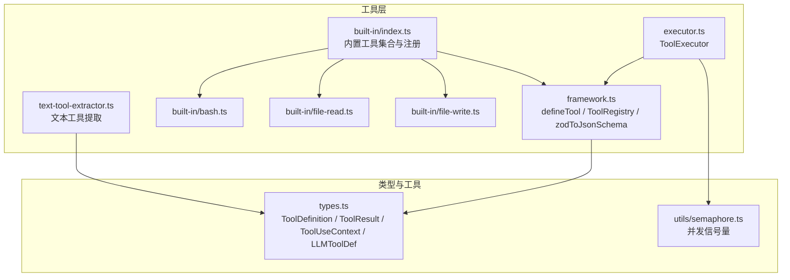
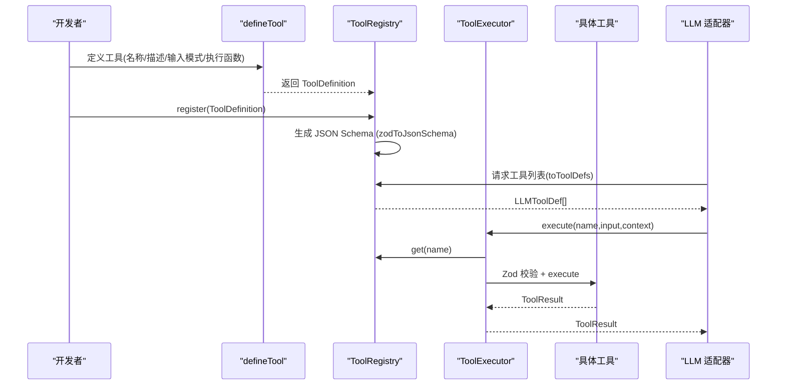
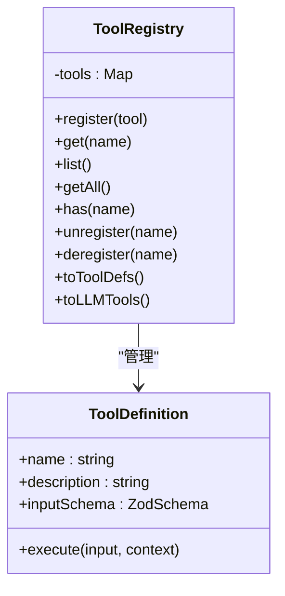
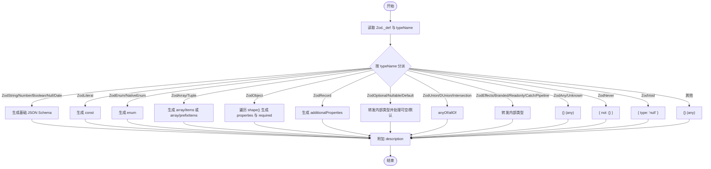
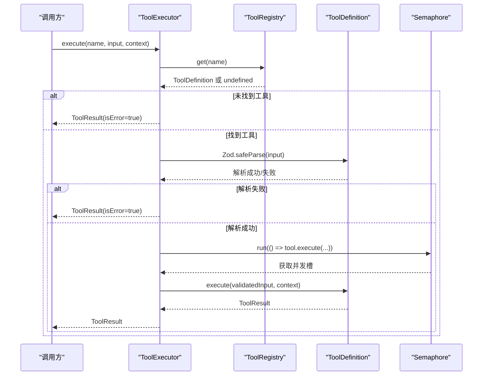
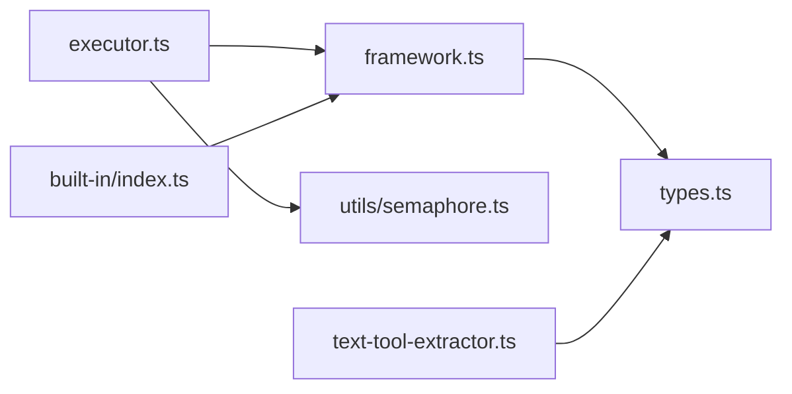

# 工具定义框架

<cite>
**本文引用的文件**
- [src/tool/framework.ts](file://src/tool/framework.ts)
- [src/tool/executor.ts](file://src/tool/executor.ts)
- [src/tool/built-in/index.ts](file://src/tool/built-in/index.ts)
- [src/tool/built-in/bash.ts](file://src/tool/built-in/bash.ts)
- [src/tool/built-in/file-read.ts](file://src/tool/built-in/file-read.ts)
- [src/tool/built-in/file-write.ts](file://src/tool/built-in/file-write.ts)
- [src/tool/text-tool-extractor.ts](file://src/tool/text-tool-extractor.ts)
- [src/types.ts](file://src/types.ts)
- [src/utils/semaphore.ts](file://src/utils/semaphore.ts)
- [tests/built-in-tools.test.ts](file://tests/built-in-tools.test.ts)
- [tests/tool-executor.test.ts](file://tests/tool-executor.test.ts)
- [examples/01-single-agent.ts](file://examples/01-single-agent.ts)
</cite>

## 目录
1. [简介](#简介)
2. [项目结构](#项目结构)
3. [核心组件](#核心组件)
4. [架构总览](#架构总览)
5. [详细组件分析](#详细组件分析)
6. [依赖关系分析](#依赖关系分析)
7. [性能考量](#性能考量)
8. [故障排查指南](#故障排查指南)
9. [结论](#结论)
10. [附录](#附录)

## 简介
本文件系统性阐述 Open Multi-Agent 框架中的“工具定义框架”，涵盖以下关键主题：
- defineTool 工厂函数的使用方法：工具名称、描述、输入模式（Zod Schema）与执行函数的配置要点
- ToolRegistry 注册表类的功能：工具注册、查询、注销、批量导出 LLM 可用的 JSON Schema
- zodToJsonSchema 转换器的工作原理：支持的 Zod 类型映射与 JSON Schema 生成策略
- 完整工具定义示例：基础工具、复杂参数工具、条件工具等
- 工具接口规范与最佳实践：错误处理、性能优化、安全考虑

## 项目结构
工具定义框架位于 src/tool 子目录，核心文件包括：
- framework.ts：defineTool、ToolRegistry、zodToJsonSchema 的实现
- executor.ts：ToolExecutor 并发执行器，负责批量执行与错误隔离
- built-in/index.ts：内置工具集合与注册入口
- built-in/*.ts：内置工具示例（bash、file-read、file-write 等）
- text-tool-extractor.ts：文本中提取工具调用的回退解析器
- types.ts：工具相关类型定义（ToolDefinition、ToolResult、ToolUseContext、LLMToolDef 等）
- utils/semaphore.ts：轻量级计数信号量，用于并发控制

图表来源
- [src/tool/framework.ts:1-558](file://src/tool/framework.ts#L1-L558)
- [src/tool/executor.ts:1-179](file://src/tool/executor.ts#L1-L179)
- [src/tool/built-in/index.ts:1-51](file://src/tool/built-in/index.ts#L1-L51)
- [src/tool/built-in/bash.ts:1-188](file://src/tool/built-in/bash.ts#L1-L188)
- [src/tool/built-in/file-read.ts:1-106](file://src/tool/built-in/file-read.ts#L1-L106)
- [src/tool/built-in/file-write.ts:1-82](file://src/tool/built-in/file-write.ts#L1-L82)
- [src/tool/text-tool-extractor.ts:1-220](file://src/tool/text-tool-extractor.ts#L1-L220)
- [src/types.ts:1-543](file://src/types.ts#L1-L543)
- [src/utils/semaphore.ts:1-90](file://src/utils/semaphore.ts#L1-L90)

章节来源
- [src/tool/framework.ts:1-558](file://src/tool/framework.ts#L1-L558)
- [src/types.ts:105-179](file://src/types.ts#L105-L179)

## 核心组件
- defineTool：声明式工具工厂，返回满足 ToolDefinition 接口的对象，包含 name、description、inputSchema 和 execute 四要素
- ToolRegistry：命名工具注册表，提供注册、查询、注销、导出 LLM 工具定义等能力
- zodToJsonSchema：将 Zod Schema 转换为 JSON Schema，供 LLM API 使用
- ToolExecutor：并发执行器，负责批量执行、并发限制、输入校验、异常捕获与结果归一化
- 内置工具：bash、file-read、file-write 等，展示复杂参数、条件逻辑与错误处理

章节来源
- [src/tool/framework.ts:51-83](file://src/tool/framework.ts#L51-L83)
- [src/tool/framework.ts:93-203](file://src/tool/framework.ts#L93-L203)
- [src/tool/framework.ts:221-433](file://src/tool/framework.ts#L221-L433)
- [src/tool/executor.ts:47-178](file://src/tool/executor.ts#L47-L178)
- [src/tool/built-in/index.ts:16-50](file://src/tool/built-in/index.ts#L16-L50)

## 架构总览
工具定义框架围绕“声明—注册—执行—导出”闭环工作：
- 声明阶段：通过 defineTool 定义工具，指定输入模式与执行逻辑
- 注册阶段：将工具注册到 ToolRegistry，生成 LLM 可用的 JSON Schema
- 执行阶段：ToolExecutor 校验输入、并发执行、捕获异常并返回统一格式的结果
- 导出阶段：ToolRegistry 将已注册工具导出为 LLMToolDef 列表，供适配器调用

图表来源
- [src/tool/framework.ts:51-83](file://src/tool/framework.ts#L51-L83)
- [src/tool/framework.ts:93-203](file://src/tool/framework.ts#L93-L203)
- [src/tool/framework.ts:221-433](file://src/tool/framework.ts#L221-L433)
- [src/tool/executor.ts:70-169](file://src/tool/executor.ts#L70-L169)

## 详细组件分析

### defineTool 工厂函数
- 作用：以声明式方式创建工具，确保返回对象满足 ToolDefinition 接口
- 关键字段
  - name：工具唯一标识，用于注册与调用
  - description：工具用途说明，用于 LLM 选择工具
  - inputSchema：Zod Schema，用于运行时输入校验
  - execute：异步执行函数，接收校验后的输入与上下文，返回 ToolResult
- 典型用法：参考内置工具的定义，如 bash、file-read、file-write

章节来源
- [src/tool/framework.ts:51-83](file://src/tool/framework.ts#L51-L83)
- [src/tool/built-in/bash.ts:22-63](file://src/tool/built-in/bash.ts#L22-L63)
- [src/tool/built-in/file-read.ts:16-105](file://src/tool/built-in/file-read.ts#L16-L105)
- [src/tool/built-in/file-write.ts:17-81](file://src/tool/built-in/file-write.ts#L17-L81)

### ToolRegistry 注册表
- 功能概览
  - register：注册工具，重复注册会抛错
  - get/list/getAll/has：查询与枚举工具
  - unregister/deregister：注销工具
  - toToolDefs/toLLMTools：导出 LLM 可用的工具定义（JSON Schema）
- 设计要点
  - 使用 Map 保存工具，键为工具名，值为 ToolDefinition
  - toToolDefs 内部调用 zodToJsonSchema 将 Zod Schema 转为 JSON Schema
  - toLLMTools 提供 Anthropic 风格的 input_schema 结构

图表来源
- [src/tool/framework.ts:93-203](file://src/tool/framework.ts#L93-L203)
- [src/types.ts:174-179](file://src/types.ts#L174-L179)

章节来源
- [src/tool/framework.ts:93-203](file://src/tool/framework.ts#L93-L203)

### zodToJsonSchema 转换器
- 作用：将 Zod Schema 转换为 JSON Schema 对象，供 LLM API 使用
- 支持的 Zod 类型（节选）
  - 基元：string、number、boolean、null、bigint、date
  - 字面量：literal
  - 枚举：enum、nativeEnum
  - 数组：array、tuple
  - 对象：object、record
  - 可选/可空/默认：optional、nullable、default
  - 组合：union、discriminatedUnion、intersection
  - 包装器：effects、branded、readonly、catch、pipeline
  - 通配：any、unknown、never、void
- 不支持类型降级：默认返回空对象（any），仍为有效 JSON Schema
- 实现细节
  - 递归遍历 Zod 内部 _def 结构，按 typeName 分派处理
  - 处理 required 字段：对非 optional/default/nullable 的属性标记为 required
  - 处理 description：保留 Zod 描述作为 JSON Schema 的 description

图表来源
- [src/tool/framework.ts:221-433](file://src/tool/framework.ts#L221-L433)

章节来源
- [src/tool/framework.ts:221-433](file://src/tool/framework.ts#L221-L433)

### ToolExecutor 并发执行器
- 职责
  - 单次执行：校验输入、检查取消信号、调用工具执行、捕获异常并返回 ToolResult
  - 批量执行：并发限制（Semaphore）、错误隔离、返回 Map
- 并发控制
  - 默认最大并发 4，可通过构造函数参数调整
  - 使用自研 Semaphore，避免第三方依赖
- 错误处理
  - 未知工具名、Zod 校验失败、执行异常均转为 ToolResult.isError=true
  - 支持 AbortSignal 中断，提前返回错误结果

图表来源
- [src/tool/executor.ts:70-169](file://src/tool/executor.ts#L70-L169)
- [src/utils/semaphore.ts:24-78](file://src/utils/semaphore.ts#L24-L78)

章节来源
- [src/tool/executor.ts:47-178](file://src/tool/executor.ts#L47-L178)
- [src/utils/semaphore.ts:24-78](file://src/utils/semaphore.ts#L24-L78)

### 内置工具示例
- bash 工具：支持命令执行、超时、工作目录、退出码与输出合并
- file-read 工具：按行读取文件、支持偏移与限制、带行号输出
- file-write 工具：创建或覆盖文件、自动创建父目录、统计行数与字节数
- registerBuiltInTools：一键注册所有内置工具

章节来源
- [src/tool/built-in/bash.ts:22-63](file://src/tool/built-in/bash.ts#L22-L63)
- [src/tool/built-in/file-read.ts:16-105](file://src/tool/built-in/file-read.ts#L16-L105)
- [src/tool/built-in/file-write.ts:17-81](file://src/tool/built-in/file-write.ts#L17-L81)
- [src/tool/built-in/index.ts:46-50](file://src/tool/built-in/index.ts#L46-L50)

### 文本工具提取器（回退路径）
- 场景：本地模型返回纯文本而非标准 tool_calls
- 策略：优先匹配 Hermes 格式，其次剥离代码块后提取 JSON 对象，最后解析为 ToolUseBlock
- 适用：Ollama、vLLM、LM Studio 等兼容性不佳的场景

章节来源
- [src/tool/text-tool-extractor.ts:196-219](file://src/tool/text-tool-extractor.ts#L196-L219)

## 依赖关系分析
- framework.ts 依赖 types.ts 中的 ToolDefinition、ToolResult、ToolUseContext、LLMToolDef
- executor.ts 依赖 framework.ts 的 ToolRegistry 与 types.ts 的 ToolResult、ToolUseContext，并依赖 utils/semaphore.ts
- built-in/index.ts 依赖 framework.ts 的 ToolRegistry 与各内置工具
- text-tool-extractor.ts 依赖 types.ts 的 ToolUseBlock

图表来源
- [src/tool/framework.ts:14-22](file://src/tool/framework.ts#L14-L22)
- [src/tool/executor.ts:12-15](file://src/tool/executor.ts#L12-L15)
- [src/tool/built-in/index.ts:8-9](file://src/tool/built-in/index.ts#L8-L9)
- [src/tool/text-tool-extractor.ts](file://src/tool/text-tool-extractor.ts#L18)

章节来源
- [src/tool/framework.ts:14-22](file://src/tool/framework.ts#L14-L22)
- [src/tool/executor.ts:12-15](file://src/tool/executor.ts#L12-L15)
- [src/tool/built-in/index.ts:8-9](file://src/tool/built-in/index.ts#L8-L9)
- [src/tool/text-tool-extractor.ts](file://src/tool/text-tool-extractor.ts#L18)

## 性能考量
- 并发控制：ToolExecutor 默认并发 4，可通过构造函数参数调整；过高的并发可能引发资源争用
- 输入校验成本：Zod.safeParse 在大对象上可能较慢，建议在输入规模可控时使用
- 输出合并：bash 工具将 stdout/stderr 合并为单一字符串，减少 LLM 上下文碎片
- 超时与中断：bash 工具支持超时与 AbortSignal，避免长时间阻塞
- 信号量实现：自研 Semaphore 无外部依赖，适合小规模并发控制

章节来源
- [src/tool/executor.ts:21-27](file://src/tool/executor.ts#L21-L27)
- [src/tool/built-in/bash.ts:46-62](file://src/tool/built-in/bash.ts#L46-L62)
- [src/utils/semaphore.ts:24-78](file://src/utils/semaphore.ts#L24-L78)

## 故障排查指南
- 工具未注册
  - 现象：execute 返回 ToolResult.isError=true，提示工具未注册
  - 处理：确认是否已调用 register 或 registerBuiltInTools
- 输入校验失败
  - 现象：execute 返回 ToolResult.isError=true，包含字段路径与错误消息
  - 处理：根据错误列表修正输入结构，确保必填字段齐全
- 执行异常
  - 现象：execute 返回 ToolResult.isError=true，包含异常信息
  - 处理：检查工具内部逻辑、权限与外部依赖
- 并发过高导致资源紧张
  - 现象：CPU/IO 抖动或响应延迟上升
  - 处理：降低 ToolExecutor 的 maxConcurrency，或拆分任务批次
- 本地模型工具调用解析失败
  - 现象：模型返回纯文本而非标准 JSON
  - 处理：启用 text-tool-extractor 进行回退解析

章节来源
- [tests/tool-executor.test.ts:57-91](file://tests/tool-executor.test.ts#L57-L91)
- [tests/tool-executor.test.ts:130-157](file://tests/tool-executor.test.ts#L130-L157)
- [src/tool/text-tool-extractor.ts:196-219](file://src/tool/text-tool-extractor.ts#L196-L219)

## 结论
工具定义框架通过 defineTool、ToolRegistry、zodToJsonSchema 与 ToolExecutor 形成完整闭环，既保证了工具声明的类型安全与可维护性，又提供了强大的并发执行与错误隔离能力。结合内置工具与回退解析器，可在多种 LLM 与本地模型环境下稳定运行。

## 附录

### 工具接口规范与最佳实践
- 接口规范
  - ToolDefinition：必须包含 name、description、inputSchema、execute
  - ToolResult：data 为字符串，isError 标识是否为错误结果
  - ToolUseContext：提供 agent、team、abortSignal、abortController、cwd、metadata 等上下文
- 最佳实践
  - 输入模式：使用 Zod 精确建模，必要时使用 union、optional、nullable、default
  - 执行函数：显式处理异常，返回 ToolResult；支持 AbortSignal 中断
  - 错误处理：将业务错误与系统错误统一为 ToolResult，便于 LLM 重试与反馈
  - 并发控制：合理设置 ToolExecutor 的 maxConcurrency，避免资源争用
  - 安全考虑：bash 工具应限制命令范围与工作目录，避免任意命令执行

章节来源
- [src/types.ts:105-179](file://src/types.ts#L105-L179)
- [src/tool/executor.ts:132-169](file://src/tool/executor.ts#L132-L169)
- [src/tool/built-in/bash.ts:46-62](file://src/tool/built-in/bash.ts#L46-L62)

### 示例索引（路径）
- 基础工具示例：[src/tool/built-in/file-read.ts:16-105](file://src/tool/built-in/file-read.ts#L16-L105)
- 复杂参数工具示例：[src/tool/built-in/file-write.ts:17-81](file://src/tool/built-in/file-write.ts#L17-L81)
- 条件工具示例：[src/tool/built-in/bash.ts:22-63](file://src/tool/built-in/bash.ts#L22-L63)
- 注册内置工具：[src/tool/built-in/index.ts:46-50](file://src/tool/built-in/index.ts#L46-L50)
- 使用示例（单智能体）：[examples/01-single-agent.ts:75-89](file://examples/01-single-agent.ts#L75-L89)