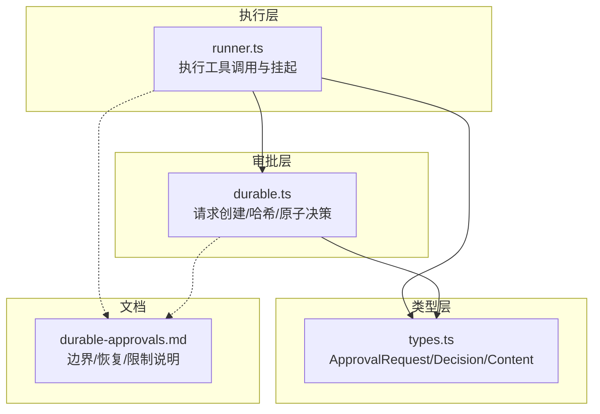
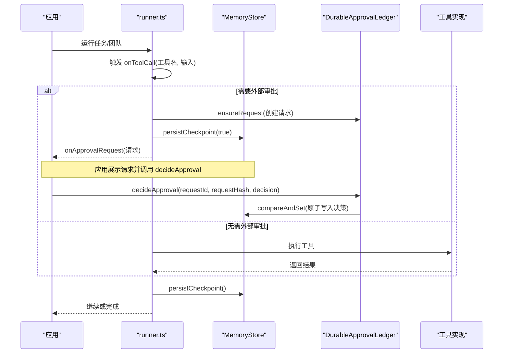
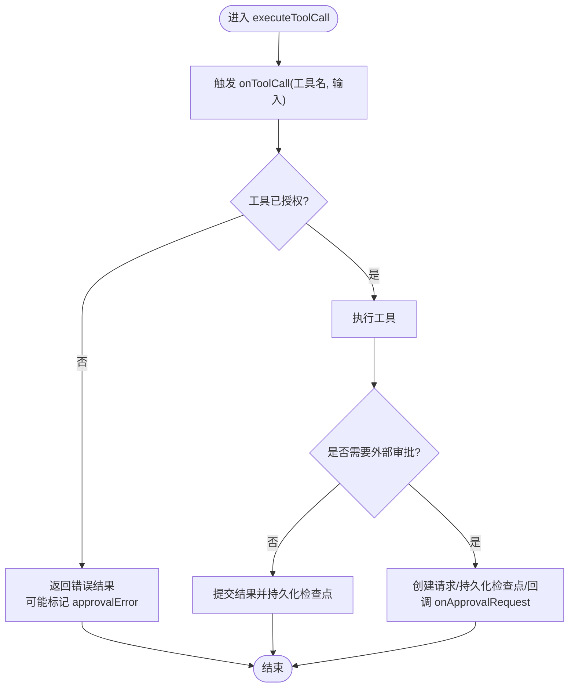
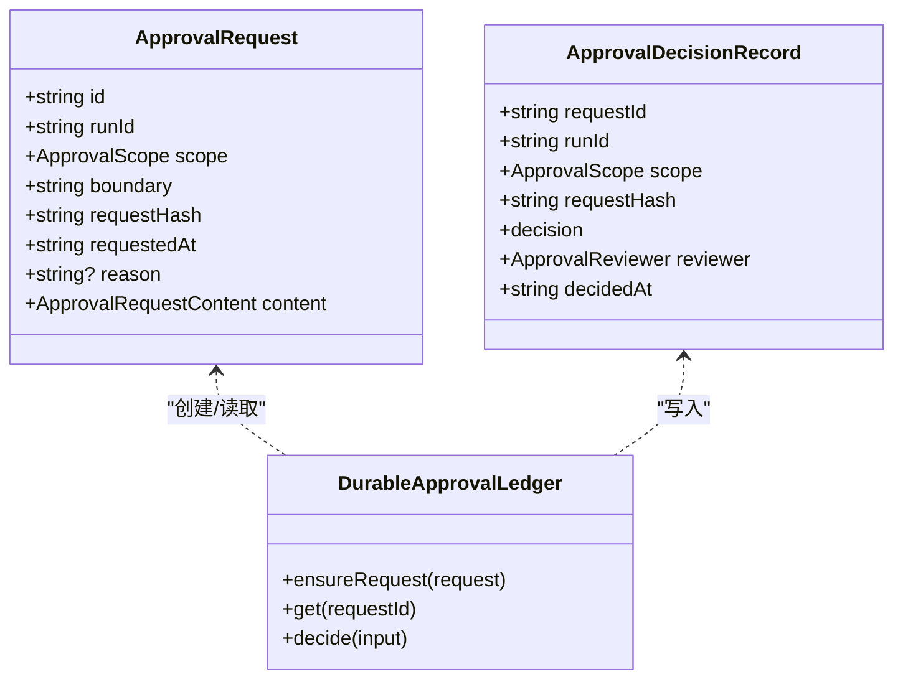
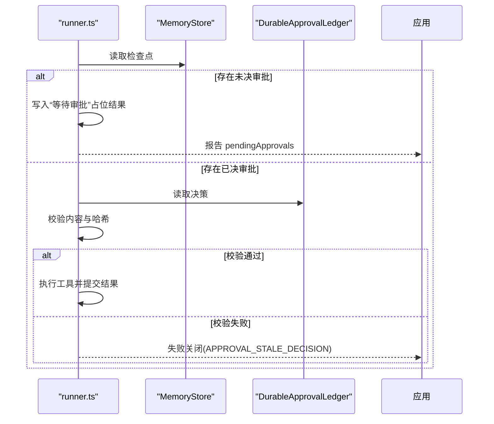
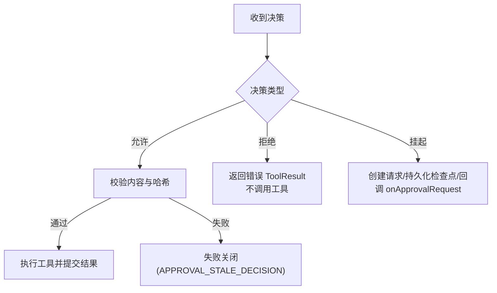
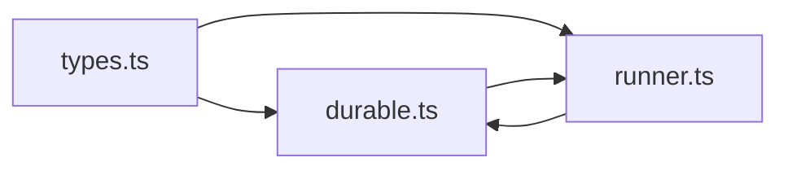

# 审批网关

<cite>
**本文引用的文件**
- [runner.ts](file://packages/core/src/agent/runner.ts)
- [durable.ts](file://packages/core/src/approval/durable.ts)
- [types.ts](file://packages/core/src/types.ts)
- [durable-approvals.md](file://docs/durable-approvals.md)
</cite>

## 目录
1. [简介](#简介)
2. [项目结构](#项目结构)
3. [核心组件](#核心组件)
4. [架构总览](#架构总览)
5. [详细组件分析](#详细组件分析)
6. [依赖关系分析](#依赖关系分析)
7. [性能考虑](#性能考虑)
8. [故障排查指南](#故障排查指南)
9. [结论](#结论)
10. [附录：自定义开发指南](#附录自定义开发指南)

## 简介
本文件系统性阐述工具执行的审批网关机制，重点覆盖 onToolCall 钩子的使用与决策处理、持久化审批的实现原理与数据一致性保证、审批状态的检查与恢复流程、不同审批决策（允许、拒绝、挂起）的处理路径，以及安全与审计日志要点。文档同时提供面向应用的自定义开发指南，帮助在现有框架内扩展或定制审批策略。

## 项目结构
围绕审批网关的关键代码分布在以下位置：
- 执行器与运行循环：packages/core/src/agent/runner.ts
- 持久化审批与原子决策：packages/core/src/approval/durable.ts
- 类型与边界定义：packages/core/src/types.ts
- 用户文档与行为说明：docs/durable-approvals.md

图表来源
- [runner.ts:990-1069](file://packages/core/src/agent/runner.ts#L990-L1069)
- [durable.ts:125-196](file://packages/core/src/approval/durable.ts#L125-L196)
- [types.ts:327-422](file://packages/core/src/types.ts#L327-L422)
- [durable-approvals.md:16-28](file://docs/durable-approvals.md#L16-L28)

章节来源
- [runner.ts:990-1069](file://packages/core/src/agent/runner.ts#L990-L1069)
- [durable.ts:125-196](file://packages/core/src/approval/durable.ts#L125-L196)
- [types.ts:327-422](file://packages/core/src/types.ts#L327-L422)
- [durable-approvals.md:16-28](file://docs/durable-approvals.md#L16-L28)

## 核心组件
- 工具执行与挂起控制（runner.ts）
  - 在执行工具前触发 onToolCall 钩子；根据是否支持持久化审批决定进入“挂起”或“直接执行”路径。
  - 当工具返回需要外部审批的内容时，构造 ApprovalRequest，持久化检查点并回调 onApprovalRequest，随后暂停执行。
  - 恢复后若存在未决审批，则写入“等待审批”的占位结果并继续等待；若已有决策，则按决策执行或拒绝。
- 持久化审批与原子决策（durable.ts）
  - 基于稳定 JSON 序列化生成 requestHash，确保内容不可篡改。
  - 通过 MemoryStore.compareAndSet 实现“首次写入决策”的原子性，避免并发冲突。
  - 提供 getApprovalRecord 与 decideApproval 等公开 API，供应用侧审查与决策。
- 类型与边界（types.ts）
  - 定义 ApprovalScope、各边界的 ApprovalRequestContent、ApprovalRequest、ApprovalDecisionRecord 等关键类型。
  - 明确 tool_call 边界包含 toolName、rawInput、input、agentName、taskId、toolCallId、consequential 等字段，便于恢复时校验。
- 用户文档（durable-approvals.md）
  - 说明支持的边界、挂起/决策/恢复流程、严格的一致性约束、存储要求与显式限制。

章节来源
- [runner.ts:1364-1545](file://packages/core/src/agent/runner.ts#L1364-L1545)
- [durable.ts:414-579](file://packages/core/src/approval/durable.ts#L414-L579)
- [types.ts:327-422](file://packages/core/src/types.ts#L327-L422)
- [durable-approvals.md:30-123](file://docs/durable-approvals.md#L30-L123)

## 架构总览
审批网关将“工具调用”作为可挂起的执行边界，结合检查点与主审批账本，形成“请求-决策-恢复-执行”的闭环。

图表来源
- [runner.ts:990-1069](file://packages/core/src/agent/runner.ts#L990-L1069)
- [runner.ts:1364-1545](file://packages/core/src/agent/runner.ts#L1364-L1545)
- [durable.ts:414-579](file://packages/core/src/approval/durable.ts#L414-L579)

## 详细组件分析

### 工具调用与 onToolCall 钩子
- 入口与追踪
  - 在执行工具前调用 onToolCall，用于审计与观测。
  - 记录工具名称、输入、耗时，并在跟踪中附加 agent、task、gate 等信息。
- 默认拒绝与授权白名单
  - 若工具未被授予（不在 grantedToolNames），直接返回错误结果；在持久化审批场景下会标记 approvalError，导致恢复时拒绝执行。
- 工具执行与异常处理
  - 工具执行异常会被捕获并转为错误结果，不影响整体循环继续。
- 挂起判定与条件
  - 当工具返回需要审批的内容时，需满足 checkpoint、onApprovalPrepare、onApprovalRequest、taskId、runId 等条件方可挂起；否则视为配置不足而失败。

图表来源
- [runner.ts:1364-1545](file://packages/core/src/agent/runner.ts#L1364-L1545)

章节来源
- [runner.ts:1364-1545](file://packages/core/src/agent/runner.ts#L1364-L1545)

### 持久化审批：请求、哈希与原子决策
- 请求创建与内容绑定
  - 使用稳定 JSON 序列化对 scope、boundary、content 计算 SHA-256 得到 requestHash，确保内容变更即失效。
  - 请求 ID 由 runId、scope、boundary、requestHash 共同派生，具备确定性。
- 原子决策
  - 通过 MemoryStore.compareAndSet 实现“首次决策获胜”，重复或并发决策均会失败。
  - 决策记录包含 reviewer.id、displayName、decidedAt 等审计信息。
- 数据完整性校验
  - 读取时会校验版本、字段格式、时间戳、内容结构与哈希一致性，任何不匹配都会抛出完整性错误。

图表来源
- [durable.ts:125-196](file://packages/core/src/approval/durable.ts#L125-L196)
- [durable.ts:414-579](file://packages/core/src/approval/durable.ts#L414-L579)
- [types.ts:327-422](file://packages/core/src/types.ts#L327-L422)

章节来源
- [durable.ts:125-196](file://packages/core/src/approval/durable.ts#L125-L196)
- [durable.ts:414-579](file://packages/core/src/approval/durable.ts#L414-L579)
- [types.ts:327-422](file://packages/core/src/types.ts#L327-L422)

### 审批状态检查与恢复机制
- 恢复时的挂起点
  - 若存在 pendingApprovals，恢复会先写入“等待审批”的占位结果，并再次提示待决审批。
- 决策绑定校验
  - 恢复时重新校验工具输入与当前 Zod 模式的结果是否与审阅内容一致，防止旧审批被复用。
- 一致性保障
  - 比较检查点中的决策历史与主账本；不一致则在批准的工具执行前失败关闭。
- 限制与边界
  - 仅在使用 runTeam/runTasks/runFromPlan 的内置 LLM 工作流中支持工具调用挂起；其他路径不支持。

图表来源
- [runner.ts:990-1069](file://packages/core/src/agent/runner.ts#L990-L1069)
- [runner.ts:1364-1545](file://packages/core/src/agent/runner.ts#L1364-L1545)
- [durable.ts:414-579](file://packages/core/src/approval/durable.ts#L414-L579)

章节来源
- [runner.ts:990-1069](file://packages/core/src/agent/runner.ts#L990-L1069)
- [runner.ts:1364-1545](file://packages/core/src/agent/runner.ts#L1364-L1545)
- [durable.ts:414-579](file://packages/core/src/approval/durable.ts#L414-L579)

### 不同审批决策的处理流程
- 允许（approve）
  - 原子写入决策后，恢复时校验通过即执行工具一次，并将结果写入检查点后再继续模型后续步骤。
- 拒绝（reject）
  - 工具不会被调用；返回与内联拒绝相同的错误 ToolResult，模型可在下一轮调整。
- 挂起（suspend）
  - 仅在满足 checkpoint 与回调条件时生效；否则视为配置不足并失败。
  - 挂起后必须持久化检查点并回调 onApprovalRequest，直到收到决策才继续。

图表来源
- [runner.ts:1364-1545](file://packages/core/src/agent/runner.ts#L1364-L1545)
- [durable.ts:414-579](file://packages/core/src/approval/durable.ts#L414-L579)

章节来源
- [runner.ts:1364-1545](file://packages/core/src/agent/runner.ts#L1364-L1545)
- [durable.ts:414-579](file://packages/core/src/approval/durable.ts#L414-L579)

### 安全考虑与审计日志
- 安全要点
  - 默认拒绝：未授权工具直接拒绝，避免越权执行。
  - 内容绑定：requestHash 基于稳定 JSON，任何内容变更都会使旧决策失效。
  - 原子决策：compareAndSet 保证“首次决策获胜”，避免并发冲突。
  - 失败关闭：缺失检查点、CAS 能力、记录损坏或内容不匹配时，受保护的任务/工具不会执行。
  - 存储安全：审批请求可能包含敏感数据，应使用访问控制与加密；RedactingStore 不适用于持久化审批。
- 审计日志
  - onToolCall/onToolResult 可用于审计工具调用与结果。
  - 跟踪事件包含 gateAction、gateReason（脱敏）、isError、输入输出摘要等。
  - 最终结果包含 approvalDecisions，但权威事实以主账本为准。

章节来源
- [runner.ts:1364-1545](file://packages/core/src/agent/runner.ts#L1364-L1545)
- [durable.ts:414-579](file://packages/core/src/approval/durable.ts#L414-L579)
- [durable-approvals.md:94-123](file://docs/durable-approvals.md#L94-L123)

## 依赖关系分析
- runner.ts 依赖 durable.ts 提供的请求创建、哈希与原子决策能力。
- durable.ts 依赖 types.ts 的类型定义进行强校验与一致性检查。
- 所有持久化操作通过 MemoryStore 抽象，支持 InMemoryStore 与 FileStore 等实现。

图表来源
- [types.ts:327-422](file://packages/core/src/types.ts#L327-L422)
- [durable.ts:414-579](file://packages/core/src/approval/durable.ts#L414-L579)
- [runner.ts:990-1069](file://packages/core/src/agent/runner.ts#L990-L1069)

章节来源
- [types.ts:327-422](file://packages/core/src/types.ts#L327-L422)
- [durable.ts:414-579](file://packages/core/src/approval/durable.ts#L414-L579)
- [runner.ts:990-1069](file://packages/core/src/agent/runner.ts#L990-L1069)

## 性能考虑
- 最小化阻塞：仅在必要时挂起；批量工具调用并行执行，遇到首个挂起即停止并持久化。
- 检查点写入顺序：在回调失败之前先持久化检查点，避免副作用丢失导致重复执行。
- 存储选择：FileStore 适用于单进程并发；跨进程建议使用支持原子 compareAndSet 的数据库存储。
- 审计开销：onToolCall/onToolResult 与跟踪事件会带来额外开销，可按需启用。

[本节为通用指导，不直接分析具体文件]

## 故障排查指南
- 常见错误码与含义
  - APPROVAL_ATOMIC_STORE_REQUIRED：缺少 compareAndSet 能力，无法挂起。
  - APPROVAL_CONFLICT：并发或重复决策冲突。
  - APPROVAL_INTEGRITY_ERROR：记录损坏或字段不合法。
  - APPROVAL_NOT_FOUND：请求不存在。
  - APPROVAL_STALE_DECISION：请求内容已变更或决策过期。
  - APPROVAL_VALIDATION_ERROR：输入或内容不符合规范。
- 排查步骤
  - 确认已配置 checkpoint 与 onApprovalPrepare/onApprovalRequest。
  - 检查 MemoryStore 是否实现 compareAndSet。
  - 核对 requestHash 与应用展示的请求内容一致。
  - 查看最终结果的 approvalDecisions 与 pendingApprovals。
  - 检查跟踪事件中的 gateAction/gateReason 与 isErro。

章节来源
- [durable.ts:23-40](file://packages/core/src/approval/durable.ts#L23-L40)
- [durable.ts:414-579](file://packages/core/src/approval/durable.ts#L414-L579)
- [runner.ts:1364-1545](file://packages/core/src/agent/runner.ts#L1364-L1545)

## 结论
审批网关通过 onToolCall 钩子与持久化审批机制，将工具调用纳入可恢复、可审计、可防篡改的执行边界。借助稳定哈希与原子决策，系统在恢复时能准确判断是否可重用旧决策，从而保证一致性与安全性。应用可通过标准 API 构建审查界面与策略，灵活实现允许、拒绝与挂起的完整流程。

[本节为总结，不直接分析具体文件]

## 附录：自定义开发指南
- 在工具中触发审批
  - 在工具实现中返回需要审批的内容，使 runner 检测到 approvalRequestContent 并进入挂起流程。
  - 确保运行时具备 checkpoint、onApprovalPrepare、onApprovalRequest、taskId、runId 等条件。
- 构建审查与决策
  - 使用 getApprovalRecord 读取请求与决策；使用 decideApproval 提交决策，传入 requestId、requestHash、reviewer。
  - 注意 requestHash 必须与审阅内容一致，否则返回 APPROVAL_STALE_DECISION。
- 恢复与继续
  - 新进程重建相同 team/backend 配置并使用同一 store 调用 restore；若有 pendingApprovals，必须先决策再继续。
- 限制与注意事项
  - 工具调用挂起仅在 runTeam/runTasks/runFromPlan 的内置 LLM 工作流中支持。
  - verify 配置的任务不能用于持久化挂起。
  - RedactingStore 不适用于持久化审批。
  - 建议对存储实施访问控制与加密，并对审计日志进行留存。

章节来源
- [durable-approvals.md:30-123](file://docs/durable-approvals.md#L30-L123)
- [durable.ts:414-579](file://packages/core/src/approval/durable.ts#L414-L579)
- [runner.ts:990-1069](file://packages/core/src/agent/runner.ts#L990-L1069)