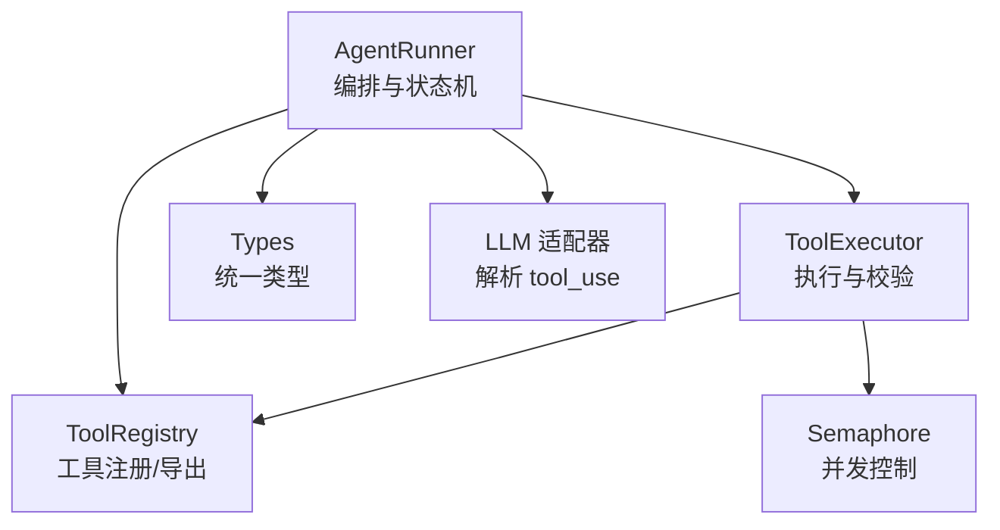
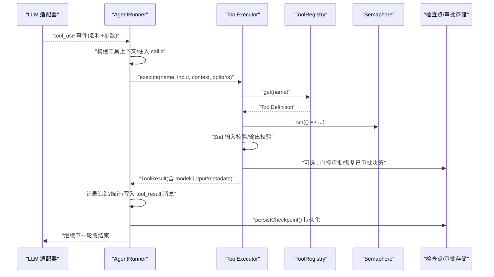
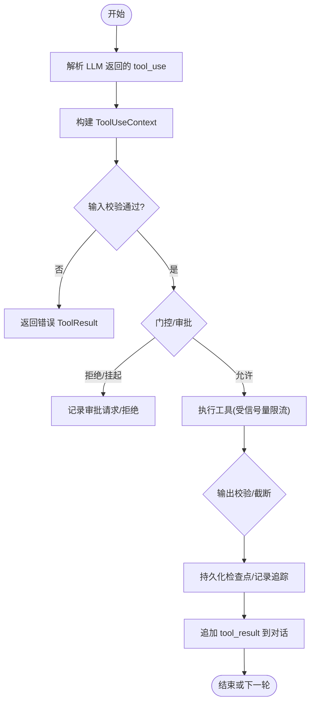
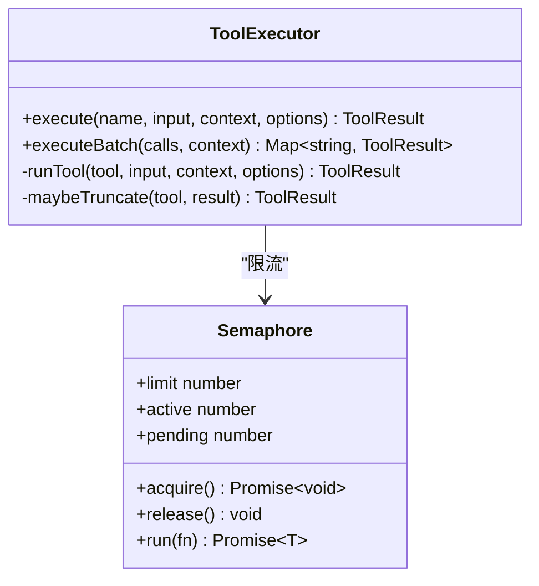
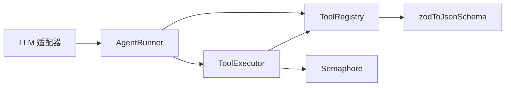

# 工具执行引擎

<cite>
**本文引用的文件**
- [packages/core/src/agent/runner.ts](file://packages/core/src/agent/runner.ts)
- [packages/core/src/tool/executor.ts](file://packages/core/src/tool/executor.ts)
- [packages/core/src/tool/framework.ts](file://packages/core/src/tool/framework.ts)
- [packages/core/src/utils/semaphore.ts](file://packages/core/src/utils/semaphore.ts)
- [packages/core/src/types.ts](file://packages/core/src/types.ts)
- [packages/core/src/llm/openai.ts](file://packages/core/src/llm/openai.ts)
</cite>

## 目录
1. [简介](#简介)
2. [项目结构](#项目结构)
3. [核心组件](#核心组件)
4. [架构总览](#架构总览)
5. [详细组件分析](#详细组件分析)
6. [依赖关系分析](#依赖关系分析)
7. [性能考量](#性能考量)
8. [故障排查指南](#故障排查指南)
9. [结论](#结论)
10. [附录](#附录)

## 简介
本文件系统性阐述 Open Multi-Agent 中“工具执行引擎”的工作原理与实现机制，覆盖工具调用的完整生命周期（参数校验、上下文传递、执行调度）、并发控制与资源管理、错误处理与重试策略、可观测性与追踪、与智能体的集成模式，以及自定义工具执行器的开发指南、调试技巧与性能优化建议。内容基于源码级分析，确保准确、可追溯。

## 项目结构
Open Multi-Agent 的核心在 packages/core 中，工具执行相关的关键代码分布在以下模块：
- 智能体运行器：负责编排 LLM 调用、工具发现与授权、工具执行循环、检查点持久化与流式事件。
- 工具执行器：负责工具注册表查找、输入/输出校验、门控审批、并发限制、结果归一化与截断。
- 工具框架：定义 defineTool、ToolRegistry、Zod 到 JSON Schema 的转换等。
- 并发原语：轻量信号量用于限流。
- 类型系统：统一描述工具、上下文、事件、审批、任务等。
- LLM 适配层：解析模型返回的工具调用块并生成 tool_use 事件。

图表来源
- [packages/core/src/agent/runner.ts:902-1069](file://packages/core/src/agent/runner.ts#L902-L1069)
- [packages/core/src/tool/executor.ts:85-164](file://packages/core/src/tool/executor.ts#L85-L164)
- [packages/core/src/tool/framework.ts:127-214](file://packages/core/src/tool/framework.ts#L127-L214)
- [packages/core/src/utils/semaphore.ts:24-95](file://packages/core/src/utils/semaphore.ts#L24-L95)
- [packages/core/src/llm/openai.ts:296-331](file://packages/core/src/llm/openai.ts#L296-L331)

章节来源
- [packages/core/src/agent/runner.ts:902-1069](file://packages/core/src/agent/runner.ts#L902-L1069)
- [packages/core/src/tool/executor.ts:85-164](file://packages/core/src/tool/executor.ts#L85-L164)
- [packages/core/src/tool/framework.ts:127-214](file://packages/core/src/tool/framework.ts#L127-L214)
- [packages/core/src/utils/semaphore.ts:24-95](file://packages/core/src/utils/semaphore.ts#L24-L95)
- [packages/core/src/llm/openai.ts:296-331](file://packages/core/src/llm/openai.ts#L296-L331)

## 核心组件
- AgentRunner：驱动完整的智能体对话循环，维护阶段（如 executing_tools）、消息历史、令牌预算、循环检测、检查点持久化；负责将 LLM 返回的 tool_use 转换为待执行队列，并在执行后回填 tool_result。
- ToolExecutor：对每个工具进行输入 Zod 校验、可选输出校验、门控审批（allow/deny/suspend）、并发限制、异常捕获并统一为 ToolResult；支持批量执行与结果截断。
- ToolRegistry：集中管理工具定义，提供 toToolDefs/toLLMTools 将工具转为 LLM 所需的 JSON Schema；支持运行时动态增删。
- Semaphore：无第三方依赖的计数信号量，保证并发上限。
- Types：统一的工具、上下文、事件、审批、任务等类型契约。
- LLM 适配层（以 OpenAI 为例）：增量拼接 tool_call 的函数名与参数 JSON，结束后产出 tool_use 事件供上层消费。

章节来源
- [packages/core/src/agent/runner.ts:902-1069](file://packages/core/src/agent/runner.ts#L902-L1069)
- [packages/core/src/tool/executor.ts:85-164](file://packages/core/src/tool/executor.ts#L85-L164)
- [packages/core/src/tool/framework.ts:127-214](file://packages/core/src/tool/framework.ts#L127-L214)
- [packages/core/src/utils/semaphore.ts:24-95](file://packages/core/src/utils/semaphore.ts#L24-L95)
- [packages/core/src/types.ts:483-504](file://packages/core/src/types.ts#L483-L504)
- [packages/core/src/llm/openai.ts:296-331](file://packages/core/src/llm/openai.ts#L296-L331)

## 架构总览
下图展示了从 LLM 返回工具调用到执行完成并回填结果的端到端流程，包括检查点、审批、追踪与流式事件。

图表来源
- [packages/core/src/agent/runner.ts:990-1102](file://packages/core/src/agent/runner.ts#L990-L1102)
- [packages/core/src/tool/executor.ts:112-164](file://packages/core/src/tool/executor.ts#L112-L164)
- [packages/core/src/tool/framework.ts:127-168](file://packages/core/src/tool/framework.ts#L127-L168)
- [packages/core/src/utils/semaphore.ts:76-83](file://packages/core/src/utils/semaphore.ts#L76-L83)

## 详细组件分析

### 工具调用生命周期
- 参数验证：ToolExecutor 使用工具的 inputSchema（Zod）对原始输入进行严格校验；失败时返回错误 ToolResult，不抛出异常。
- 上下文传递：AgentRunner 通过 buildToolContext 构造 ToolUseContext，包含 agent、abortSignal、cwd、runId、taskId、team、credentials 等；每次工具调用会注入 toolCallId，便于追踪与审批绑定。
- 执行调度：Runner 将 LLM 返回的 tool_use 块收集为 pendingToolCalls，按并发限制并行执行；执行完成后将 tool_result 作为 user 消息追加到对话历史，触发下一轮 LLM 推理。
- 检查点与恢复：在执行前后持久化 checkpoint，包含 conversation/messages/tokenUsage/toolCalls/pendingToolCalls 等；若中途被中断，可从最近检查点恢复。
- 流式事件：每步产生 tool_use/tool_result/budget_exceeded/error/done 等事件，供外部观察与回放。

图表来源
- [packages/core/src/tool/executor.ts:181-338](file://packages/core/src/tool/executor.ts#L181-L338)
- [packages/core/src/agent/runner.ts:990-1102](file://packages/core/src/agent/runner.ts#L990-L1102)
- [packages/core/src/agent/runner.ts:1364-1546](file://packages/core/src/agent/runner.ts#L1364-L1546)

章节来源
- [packages/core/src/tool/executor.ts:181-338](file://packages/core/src/tool/executor.ts#L181-L338)
- [packages/core/src/agent/runner.ts:990-1102](file://packages/core/src/agent/runner.ts#L990-L1102)
- [packages/core/src/agent/runner.ts:1364-1546](file://packages/core/src/agent/runner.ts#L1364-L1546)

### 并发控制与资源管理
- 并发上限：ToolExecutor 内部使用 Semaphore 限制同时运行的工具数量，默认 4，可通过配置调整。
- 批处理执行：executeBatch 将多个工具调用提交到信号量队列，保证整体并发不超过上限。
- 资源隔离：每个工具执行拥有独立的 ToolUseContext；AbortSignal 可在任意阶段中止执行。
- 输出大小控制：支持 per-tool 与 agent-level 的输出字符上限，超出则保留头尾并插入截断标记，避免阻塞后续处理。

图表来源
- [packages/core/src/tool/executor.ts:85-164](file://packages/core/src/tool/executor.ts#L85-L164)
- [packages/core/src/utils/semaphore.ts:24-95](file://packages/core/src/utils/semaphore.ts#L24-L95)

章节来源
- [packages/core/src/tool/executor.ts:85-164](file://packages/core/src/tool/executor.ts#L85-L164)
- [packages/core/src/utils/semaphore.ts:24-95](file://packages/core/src/utils/semaphore.ts#L24-L95)

### 错误处理与重试机制
- 错误归一化：所有工具执行异常均被捕获并转化为 isError=true 的 ToolResult，不会中断整个运行器循环。
- 默认拒绝：未授权的 tool 名称直接返回错误结果，防止越权执行。
- 审批一致性：若使用“持久化审批”，执行前会校验当前请求哈希与已审批内容一致，不一致则视为过期或被篡改，返回错误。
- 重试策略：框架层未内置自动重试；可在上层 Orchestrator/Task 层面结合 maxRetries/retryDelayMs/retryBackoff 配置实现任务级重试。

章节来源
- [packages/core/src/tool/executor.ts:181-338](file://packages/core/src/tool/executor.ts#L181-L338)
- [packages/core/src/agent/runner.ts:1391-1458](file://packages/core/src/agent/runner.ts#L1391-L1458)
- [packages/core/src/types.ts:2082-2099](file://packages/core/src/types.ts#L2082-L2099)

### 性能监控与追踪
- 追踪跨度：每次工具执行创建 span（kind=tool），记录 agent/tool/task 属性、是否错误、耗时等；支持父 span 继承。
- 遗留事件：兼容 onTrace 回调，输出 tool_call 事件，包含输入/输出摘要、耗时、门控动作等。
- 流式事件：tool_use/tool_result/budget_exceeded/error/done 等事件贯穿运行过程，便于实时观察与离线回放。
- 令牌预算：Runner 累计 token 使用，达到阈值时发出 budget_exceeded 事件并可终止。

章节来源
- [packages/core/src/agent/runner.ts:1376-1507](file://packages/core/src/agent/runner.ts#L1376-L1507)
- [packages/core/src/types.ts:483-504](file://packages/core/src/types.ts#L483-L504)

### 工具与智能体的集成方式与调用模式
- 工具发现与授权：Runner 在每轮 LLM 调用前 resolveTools()，仅暴露授予的工具给模型；grantedToolNames 作为最终白名单。
- 上下文注入：buildToolContext 将 agent、cwd、credentials、runId、taskId、team 等注入工具执行环境。
- 委派执行：当存在 team.runDelegatedAgent 时，Runner 会将当前 span 透传给委派调用，保持追踪链路。
- 调用模式：支持单工具 execute 与批量 executeBatch；批量结果通过 Map<callId, ToolResult> 返回。

章节来源
- [packages/core/src/agent/runner.ts:902-912](file://packages/core/src/agent/runner.ts#L902-L912)
- [packages/core/src/agent/runner.ts:1795-1810](file://packages/core/src/agent/runner.ts#L1795-L1810)
- [packages/core/src/tool/executor.ts:112-164](file://packages/core/src/tool/executor.ts#L112-L164)

### 自定义工具执行器的开发指南
- 定义工具：使用 defineTool 声明 name、description、inputSchema、outputSchema、maxOutputChars、consequential 及 execute 函数。
- 注册工具：通过 ToolRegistry.register 注册；如需区分运行时添加的工具，设置 runtimeAdded=true。
- 导出给 LLM：调用 registry.toToolDefs()/toLLMTools 生成 LLM 所需 schema。
- 执行入口：通过 ToolExecutor.execute/executeBatch 执行；注意返回值必须为 ToolResult 对象，且 isError 为布尔值。
- 输出校验与截断：可配置 outputSchema 与 maxOutputChars；执行器会自动校验与截断。
- 门控与审批：可实现 onToolCall 钩子，返回 allow/deny/suspend；支持持久化审批恢复与一致性校验。

章节来源
- [packages/core/src/tool/framework.ts:71-117](file://packages/core/src/tool/framework.ts#L71-L117)
- [packages/core/src/tool/framework.ts:127-214](file://packages/core/src/tool/framework.ts#L127-L214)
- [packages/core/src/tool/executor.ts:181-338](file://packages/core/src/tool/executor.ts#L181-L338)

### 调试技巧与故障排查
- 启用追踪：开启 traceRuntime/traceSpan，观察工具执行的 span 与属性；必要时输出 legacy onTrace 事件。
- 检查点恢复：若运行中断，检查 onCheckpoint 是否成功持久化；恢复时会校验 durable approval 的一致性。
- 常见错误定位：
  - 工具未注册：ToolExecutor 返回错误 ToolResult，提示未注册。
  - 输入校验失败：Zod 校验失败会返回结构化问题列表。
  - 输出格式错误：非字符串 data 需附带 modelOutput；错误 modelOutput 必须为字符串。
  - 门控拒绝：onToolCall 返回 deny/suspend 时，会在 metadata 中记录原因。
- 并发与超时：通过 Semaphore 调整并发；使用 AbortSignal 取消长时间运行的工具。

章节来源
- [packages/core/src/tool/executor.ts:181-338](file://packages/core/src/tool/executor.ts#L181-L338)
- [packages/core/src/agent/runner.ts:1364-1546](file://packages/core/src/agent/runner.ts#L1364-L1546)

### 优化策略与性能调优建议
- 合理设置并发：根据后端 I/O 能力调整 maxConcurrency，避免过度竞争。
- 输出截断：为长文本工具设置 maxOutputChars，减少传输与解析开销。
- 批量执行：优先使用 executeBatch，充分利用并行度。
- 最小化 schema：精简 inputSchema/outputSchema，降低 JSON Schema 转换与校验成本。
- 复用上下文：避免重复创建大对象；利用 ToolUseContext 传递必要信息。
- 监控与采样：在生产环境中结合 observability sink 进行指标采集与采样。

章节来源
- [packages/core/src/tool/executor.ts:359-379](file://packages/core/src/tool/executor.ts#L359-L379)
- [packages/core/src/tool/framework.ts:204-214](file://packages/core/src/tool/framework.ts#L204-L214)

## 依赖关系分析
- AgentRunner 依赖 ToolExecutor 与 ToolRegistry，并通过 LLM 适配器获取 tool_use。
- ToolExecutor 依赖 ToolRegistry 与 Semaphore，并引用 types 中的统一类型。
- ToolRegistry 依赖 zodToJsonSchema 将 Zod schema 转换为 JSON Schema。
- LLM 适配器（OpenAI）负责增量拼装 tool_call 的参数，结束后产出 tool_use。

图表来源
- [packages/core/src/agent/runner.ts:902-1102](file://packages/core/src/agent/runner.ts#L902-L1102)
- [packages/core/src/tool/executor.ts:85-164](file://packages/core/src/tool/executor.ts#L85-L164)
- [packages/core/src/tool/framework.ts:204-214](file://packages/core/src/tool/framework.ts#L204-L214)
- [packages/core/src/llm/openai.ts:296-331](file://packages/core/src/llm/openai.ts#L296-L331)

章节来源
- [packages/core/src/agent/runner.ts:902-1102](file://packages/core/src/agent/runner.ts#L902-L1102)
- [packages/core/src/tool/executor.ts:85-164](file://packages/core/src/tool/executor.ts#L85-L164)
- [packages/core/src/tool/framework.ts:204-214](file://packages/core/src/tool/framework.ts#L204-L214)
- [packages/core/src/llm/openai.ts:296-331](file://packages/core/src/llm/openai.ts#L296-L331)

## 性能考量
- 并发上限与 I/O 瓶颈：在高并发下，I/O 成为主要瓶颈；应根据后端吞吐调整 Semaphore 上限。
- 校验成本：Zod 校验在大型输入场景可能昂贵；建议在入口处尽早 abort 并拆分大输入。
- 输出截断：合理设置 maxOutputChars，避免过长响应影响下游处理与网络传输。
- 追踪开销：生产环境按需开启追踪，或使用采样策略降低开销。
- 令牌预算：通过 maxTokenBudget 控制成本，配合 budget_exceeded 事件做优雅降级。

[本节为通用指导，不直接分析具体文件]

## 故障排查指南
- 工具未授权：确认 resolveTools() 已将目标工具加入 grantedToolNames；检查 agent 的 tools/toolPreset 配置。
- 输入校验失败：查看 ToolResult 的错误信息，修正 inputSchema 或传入数据。
- 输出校验失败：确保 ToolResult.data 符合 outputSchema；非字符串 data 需提供 modelOutput。
- 审批不一致：检查持久化审批的 requestHash 是否与当前内容一致；必要时重新发起审批。
- 并发过高导致超时：降低 maxConcurrency；为慢工具增加超时与重试策略。
- 追踪缺失：确认 traceRuntime/traceSpan 已正确传入；检查 onTrace 回调是否启用。

章节来源
- [packages/core/src/agent/runner.ts:1391-1458](file://packages/core/src/agent/runner.ts#L1391-L1458)
- [packages/core/src/tool/executor.ts:181-338](file://packages/core/src/tool/executor.ts#L181-L338)

## 结论
工具执行引擎通过 AgentRunner 与 ToolExecutor 的协作，实现了安全、可控、可观测的工具调用生命周期。借助 Zod 校验、门控审批、信号量并发控制、检查点持久化与追踪体系，系统在可靠性与可运维性方面具备生产级能力。开发者可通过 defineTool 与 ToolRegistry 快速扩展工具生态，并结合上层 Orchestrator 的任务重试与预算控制，构建稳健的多智能体工作流。

[本节为总结，不直接分析具体文件]

## 附录
- 关键类型参考：StreamEvent、ToolCallRecord、ApprovalRequest、ToolCallApprovalContent 等，详见类型定义。
- LLM 工具调用解析：OpenAI 适配器在流结束时拼装 tool_use 块并触发事件。

章节来源
- [packages/core/src/types.ts:483-504](file://packages/core/src/types.ts#L483-L504)
- [packages/core/src/types.ts:327-385](file://packages/core/src/types.ts#L327-L385)
- [packages/core/src/llm/openai.ts:296-331](file://packages/core/src/llm/openai.ts#L296-L331)