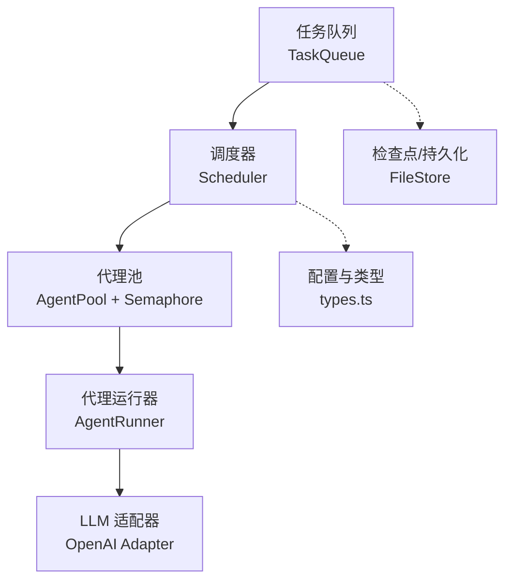
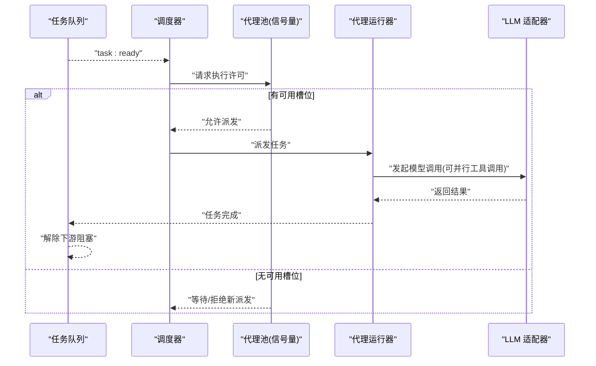
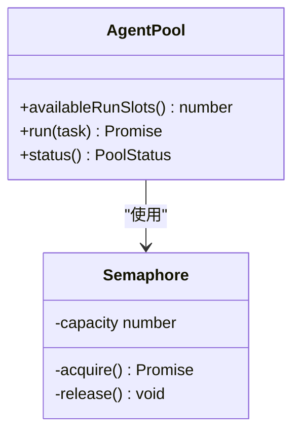
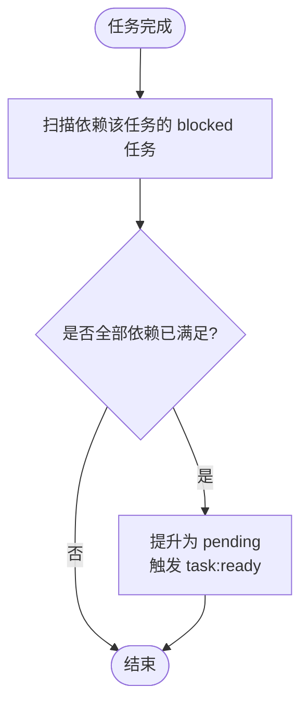
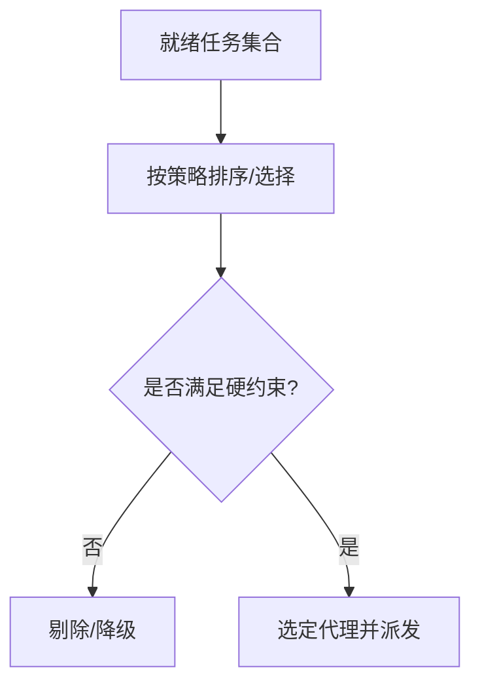
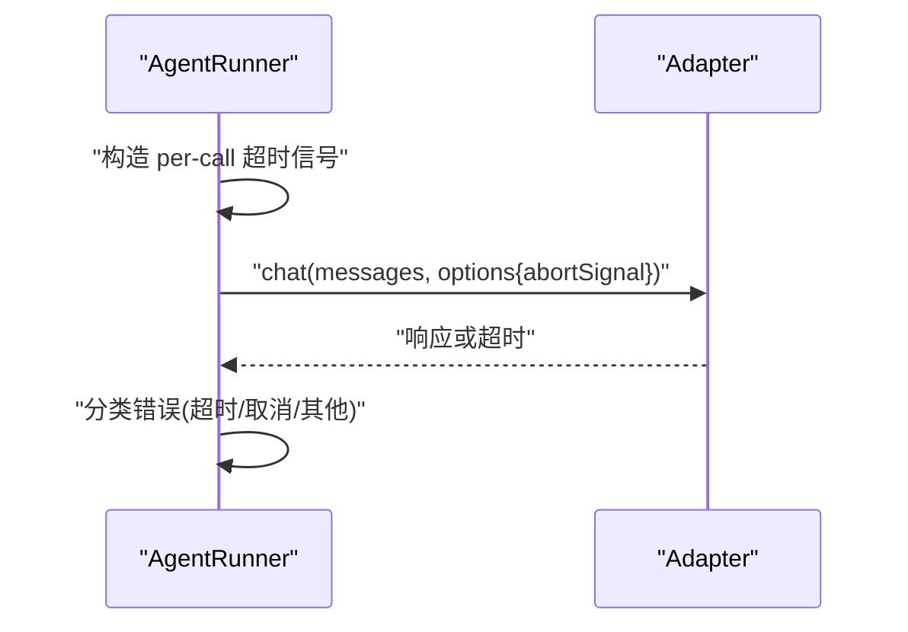
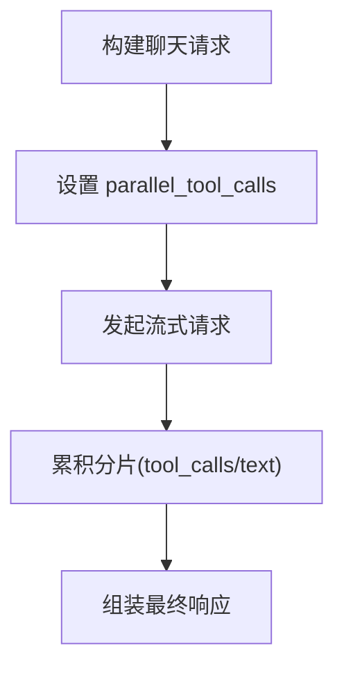
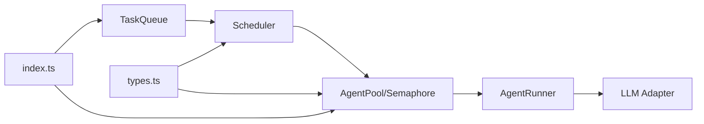

# 并发控制

<cite>
**本文引用的文件**
- [packages/core/src/agent/pool.ts](file://packages/core/src/agent/pool.ts)
- [packages/core/src/task/queue.ts](file://packages/core/src/task/queue.ts)
- [packages/core/src/orchestrator/scheduler.ts](file://packages/core/src/orchestrator/scheduler.ts)
- [packages/core/src/types.ts](file://packages/core/src/types.ts)
- [packages/core/src/agent/runner.ts](file://packages/core/src/agent/runner.ts)
- [packages/core/src/llm/openai.ts](file://packages/core/src/llm/openai.ts)
- [packages/core/src/memory/file-store.ts](file://packages/core/src/memory/file-store.ts)
- [packages/core/src/index.ts](file://packages/core/src/index.ts)
- [docs/task-scheduling.md](file://docs/task-scheduling.md)
</cite>

## 目录
1. [简介](#简介)
2. [项目结构](#项目结构)
3. [核心组件](#核心组件)
4. [架构总览](#架构总览)
5. [详细组件分析](#详细组件分析)
6. [依赖关系分析](#依赖关系分析)
7. [性能考虑](#性能考虑)
8. [故障排查指南](#故障排查指南)
9. [结论](#结论)
10. [附录](#附录)

## 简介
本文件聚焦于工具执行与任务编排中的并发控制机制，重点解释信号量（Semaphore）的实现原理、最大并发数配置与影响、资源竞争处理与死锁避免策略、批量执行的并发优化与负载均衡，以及并发控制的性能调优建议与最佳实践。同时提供常见并发问题的诊断方法与解决思路。

## 项目结构
与并发控制直接相关的代码分布在以下模块：
- 任务队列与事件驱动调度：task/queue.ts
- 调度器与分配策略：orchestrator/scheduler.ts
- 代理池与信号量：agent/pool.ts
- 类型与配置入口：types.ts
- 单代理运行与调用超时：agent/runner.ts
- LLM 适配器并行工具调用：llm/openai.ts
- 可恢复检查点与内存存储：memory/file-store.ts
- 公共导出与入口：index.ts
- 任务调度文档说明：docs/task-scheduling.md

**图表来源**
- [packages/core/src/task/queue.ts:1-120](file://packages/core/src/task/queue.ts#L1-L120)
- [packages/core/src/orchestrator/scheduler.ts:1-200](file://packages/core/src/orchestrator/scheduler.ts#L1-L200)
- [packages/core/src/agent/pool.ts:1-200](file://packages/core/src/agent/pool.ts#L1-L200)
- [packages/core/src/agent/runner.ts:560-640](file://packages/core/src/agent/runner.ts#L560-L640)
- [packages/core/src/llm/openai.ts:220-265](file://packages/core/src/llm/openai.ts#L220-L265)
- [packages/core/src/memory/file-store.ts:20-55](file://packages/core/src/memory/file-store.ts#L20-L55)
- [packages/core/src/types.ts:2131-2180](file://packages/core/src/types.ts#L2131-L2180)

**章节来源**
- [packages/core/src/task/queue.ts:1-120](file://packages/core/src/task/queue.ts#L1-L120)
- [packages/core/src/orchestrator/scheduler.ts:1-200](file://packages/core/src/orchestrator/scheduler.ts#L1-L200)
- [packages/core/src/agent/pool.ts:1-200](file://packages/core/src/agent/pool.ts#L1-L200)
- [packages/core/src/types.ts:2131-2180](file://packages/core/src/types.ts#L2131-L2180)
- [docs/task-scheduling.md:1-25](file://docs/task-scheduling.md#L1-L25)

## 核心组件
- 任务队列 TaskQueue：维护任务状态、依赖解析、事件发布（ready/complete/failed/skipped/all:complete），负责失败与跳过的级联传播。
- 调度器 Scheduler：从就绪集合中挑选任务，结合分配策略（round-robin、least-busy、capability-match、dependency-first、composite）选择执行者。
- 代理池 AgentPool 与信号量 Semaphore：作为并发权威，限制同时运行的任务数量；在派发前检查配额与预算、审批状态等。
- 代理运行器 AgentRunner：封装单次 LLM 调用、工具执行循环、每调用超时、追踪与错误分类。
- LLM 适配器：支持并行工具调用参数（如 parallel_tool_calls），将并发能力下推到模型层。
- 检查点与存储：在安全边界写入检查点，保证中断后可恢复；文件存储在进程内串行化写，避免并发冲突。

**章节来源**
- [packages/core/src/task/queue.ts:46-120](file://packages/core/src/task/queue.ts#L46-L120)
- [packages/core/src/orchestrator/scheduler.ts:1-200](file://packages/core/src/orchestrator/scheduler.ts#L1-L200)
- [packages/core/src/agent/pool.ts:1-200](file://packages/core/src/agent/pool.ts#L1-L200)
- [packages/core/src/agent/runner.ts:560-640](file://packages/core/src/agent/runner.ts#L560-L640)
- [packages/core/src/llm/openai.ts:220-265](file://packages/core/src/llm/openai.ts#L220-L265)
- [packages/core/src/memory/file-store.ts:20-55](file://packages/core/src/memory/file-store.ts#L20-L55)

## 架构总览
下图展示了“事件驱动”的任务执行流：任务就绪时触发派发，派发门限检查通过后进入代理池，由信号量控制并发上限，完成后释放并唤醒下游任务。

**图表来源**
- [docs/task-scheduling.md:8-25](file://docs/task-scheduling.md#L8-L25)
- [packages/core/src/task/queue.ts:46-120](file://packages/core/src/task/queue.ts#L46-L120)
- [packages/core/src/agent/pool.ts:1-200](file://packages/core/src/agent/pool.ts#L1-L200)
- [packages/core/src/agent/runner.ts:560-640](file://packages/core/src/agent/runner.ts#L560-L640)
- [packages/core/src/llm/openai.ts:220-265](file://packages/core/src/llm/openai.ts#L220-L265)

## 详细组件分析

### 信号量与代理池：并发权威
- 角色定位：AgentPool 的 Semaphore 是并发权威，所有任务（包括临时委托给代理的执行）都受其约束。
- 并发控制点：调度器在派发前通过 AgentPool 容量检查，确保不会超过最大并发。
- 退出路径：任务完成或失败后释放槽位，立即尝试调度下一个就绪任务。

**图表来源**
- [packages/core/src/agent/pool.ts:1-200](file://packages/core/src/agent/pool.ts#L1-L200)
- [docs/task-scheduling.md:19-21](file://docs/task-scheduling.md#L19-L21)

**章节来源**
- [docs/task-scheduling.md:19-21](file://docs/task-scheduling.md#L19-L21)
- [packages/core/src/agent/pool.ts:1-200](file://packages/core/src/agent/pool.ts#L1-L200)

### 任务队列：事件驱动与依赖解锁
- 状态机：pending/blocked/in_progress/completed/failed/skipped。
- 事件：task:ready、task:complete、task:failed、task:skipped、all:complete。
- 依赖解锁：任务完成后扫描 blocked 任务，满足依赖则转为 pending 并触发 ready。
- 失败/跳过级联：上游失败或跳过会级联标记下游为失败或跳过，防止悬挂。

**图表来源**
- [packages/core/src/task/queue.ts:424-480](file://packages/core/src/task/queue.ts#L424-L480)
- [packages/core/src/task/queue.ts:719-748](file://packages/core/src/task/queue.ts#L719-L748)

**章节来源**
- [packages/core/src/task/queue.ts:424-480](file://packages/core/src/task/queue.ts#L424-L480)
- [packages/core/src/task/queue.ts:719-748](file://packages/core/src/task/queue.ts#L719-L748)

### 调度器与分配策略：负载均衡
- 默认策略：dependency-first，优先选择能尽快解锁更多下游的任务。
- 其他策略：
  - round-robin：按名册轮询，适合等价代理。
  - least-busy：选择当前 in_progress 最少的代理，适合时长差异大。
  - capability-match：基于声明能力与亲和度排序。
  - composite：综合 fit 与 load 加权评分，默认 fit=0.7、load=0.3。
- 硬约束过滤：先根据 requires（工具、后端、提供者等）过滤候选代理，再排名或轮转。

**图表来源**
- [packages/core/src/types.ts:2131-2180](file://packages/core/src/types.ts#L2131-L2180)
- [docs/task-scheduling.md:98-133](file://docs/task-scheduling.md#L98-L133)

**章节来源**
- [packages/core/src/types.ts:2131-2180](file://packages/core/src/types.ts#L2131-L2180)
- [docs/task-scheduling.md:98-133](file://docs/task-scheduling.md#L98-L133)

### 代理运行器：调用超时与错误分类
- 每调用超时：通过 AbortSignal.timeout 合并到每次 adapter.chat 调用，统一跨供应商超时行为。
- 错误区分：区分调用超时与调用方取消，抛出专用异常以便上层处理。
- 追踪：在开启追踪时记录 span、token 用量、阶段与轮次。

**图表来源**
- [packages/core/src/agent/runner.ts:566-582](file://packages/core/src/agent/runner.ts#L566-L582)
- [packages/core/src/agent/runner.ts:584-635](file://packages/core/src/agent/runner.ts#L584-L635)

**章节来源**
- [packages/core/src/agent/runner.ts:566-635](file://packages/core/src/agent/runner.ts#L566-L635)

### LLM 适配器：并行工具调用
- 字段传递：将 parallel_tool_calls 透传到 OpenAI 兼容适配器，使单个助手回合内可并发发出多个工具调用。
- 流式累积：对分片响应进行累积，组装 tool_calls 与文本输出。

**图表来源**
- [packages/core/src/llm/openai.ts:223-264](file://packages/core/src/llm/openai.ts#L223-L264)

**章节来源**
- [packages/core/src/llm/openai.ts:223-264](file://packages/core/src/llm/openai.ts#L223-L264)

### 检查点与存储：并发安全的持久化
- 写入时机：在安全边界（runner 边界、任务完成）写入检查点，避免频繁落盘。
- 进程内并发：文件存储在单进程内串行化写，避免并发写冲突；跨进程恢复顺序天然串行。

**章节来源**
- [packages/core/src/memory/file-store.ts:23-54](file://packages/core/src/memory/file-store.ts#L23-L54)

## 依赖关系分析
- 低耦合：TaskQueue 仅通过事件与调度器交互；调度器通过 AgentPool 抽象并发；AgentRunner 与适配器解耦。
- 关键依赖链：
  - TaskQueue → Scheduler → AgentPool(Semaphore) → AgentRunner → LLM Adapter
  - types.ts 提供 OrchestratorConfig.maxConcurrency 等配置项，贯穿调度与池化。
  - index.ts 暴露 AgentPool、Semaphore、TaskQueue、Scheduler 等核心符号。

**图表来源**
- [packages/core/src/index.ts:136-159](file://packages/core/src/index.ts#L136-L159)
- [packages/core/src/types.ts:2131-2180](file://packages/core/src/types.ts#L2131-L2180)
- [packages/core/src/task/queue.ts:1-120](file://packages/core/src/task/queue.ts#L1-L120)
- [packages/core/src/orchestrator/scheduler.ts:1-200](file://packages/core/src/orchestrator/scheduler.ts#L1-L200)
- [packages/core/src/agent/pool.ts:1-200](file://packages/core/src/agent/pool.ts#L1-L200)
- [packages/core/src/agent/runner.ts:560-640](file://packages/core/src/agent/runner.ts#L560-L640)
- [packages/core/src/llm/openai.ts:220-265](file://packages/core/src/llm/openai.ts#L220-L265)

**章节来源**
- [packages/core/src/index.ts:136-159](file://packages/core/src/index.ts#L136-L159)
- [packages/core/src/types.ts:2131-2180](file://packages/core/src/types.ts#L2131-L2180)

## 性能考虑
- 最大并发数配置
  - 通过 OrchestratorConfig.maxConcurrency 控制全局并发上限，直接影响吞吐与延迟。
  - 过小：利用率不足、尾延迟升高；过大：资源争用、排队抖动、外部服务限流风险。
- 分配策略选择
  - 短任务且代理等价：round-robin 简单高效。
  - 长任务且时长波动大：least-busy 更均衡。
  - 强依赖图：dependency-first 加速解锁下游。
  - 异构代理：capability-match 或 composite 平衡匹配度与负载。
- 模型层并行
  - 启用 parallel_tool_calls 可在单回合内并发工具调用，减少往返次数，但需评估模型侧并发限制与成本。
- 超时与预算
  - 合理设置 callTimeoutMs 与 maxTokenBudget/maxCostBudget，避免慢调用拖垮整体。
- 检查点频率
  - 在 runner 边界与任务完成处落盘，兼顾恢复能力与 IO 开销。

[本节为通用指导，不直接分析具体文件]

## 故障排查指南
- 并发瓶颈
  - 现象：大量任务处于 pending/blocked，in_progress 接近上限。
  - 排查：检查 OrchestratorConfig.maxConcurrency、AgentPool 可用槽位、调度策略是否导致热点代理。
- 任务卡住
  - 现象：blocked 任务长期不推进。
  - 排查：确认上游是否失败/跳过，查看 TaskQueue 的级联逻辑；检查 onTaskDispatch/onApproval 是否拒绝派发。
- 调用超时
  - 现象：出现 LLMCallTimeoutError。
  - 排查：调整 callTimeoutMs，检查网络与模型端响应时间；确认未与调用方 abortSignal 冲突。
- 资源竞争
  - 现象：外部 API 限流或错误率上升。
  - 排查：降低并发上限、增加重试退避、拆分批次；必要时引入令牌桶或队列节流。
- 死锁避免
  - 原则：单一并发权威（AgentPool.Semaphore），不在派发门限外新增锁；依赖解锁由 TaskQueue 集中管理；审批/预算检查在派发前完成。
- 恢复与重放
  - 利用检查点与任务快照，在崩溃后从最近安全点恢复；恢复时重置 in_progress 任务以重新执行。

**章节来源**
- [docs/task-scheduling.md:166-184](file://docs/task-scheduling.md#L166-L184)
- [packages/core/src/task/queue.ts:424-545](file://packages/core/src/task/queue.ts#L424-L545)
- [packages/core/src/agent/runner.ts:566-635](file://packages/core/src/agent/runner.ts#L566-L635)
- [packages/core/src/memory/file-store.ts:23-54](file://packages/core/src/memory/file-store.ts#L23-L54)

## 结论
本项目通过“事件驱动的任务队列 + 调度器 + 代理池信号量”的三层协作实现可控并发：TaskQueue 负责依赖与事件，Scheduler 负责任务选择与负载均衡，AgentPool.Semaphore 作为唯一并发权威限制同时执行数。配合 per-call 超时、预算控制、检查点持久化与模型层并行工具调用，能够在高吞吐与稳定性之间取得平衡。生产环境应依据工作负载特征选择合适的调度策略与并发上限，并结合观测指标持续调优。

[本节为总结性内容，不直接分析具体文件]

## 附录
- 关键配置项速览
  - OrchestratorConfig.maxConcurrency：全局最大并发
  - OrchestratorConfig.schedulingStrategy：调度策略
  - OrchestratorConfig.schedulingWeights：composite 权重
  - AgentConfig.callTimeoutMs：单次 LLM 调用超时
  - RunTasksOptions.maxTokenBudget / maxCostBudget：运行级预算
  - AgentConfig.parallelToolCalls：模型层并行工具调用
- 参考入口
  - 公共导出：index.ts
  - 类型定义：types.ts
  - 任务调度文档：docs/task-scheduling.md

**章节来源**
- [packages/core/src/index.ts:136-159](file://packages/core/src/index.ts#L136-L159)
- [packages/core/src/types.ts:2131-2180](file://packages/core/src/types.ts#L2131-L2180)
- [docs/task-scheduling.md:1-25](file://docs/task-scheduling.md#L1-L25)