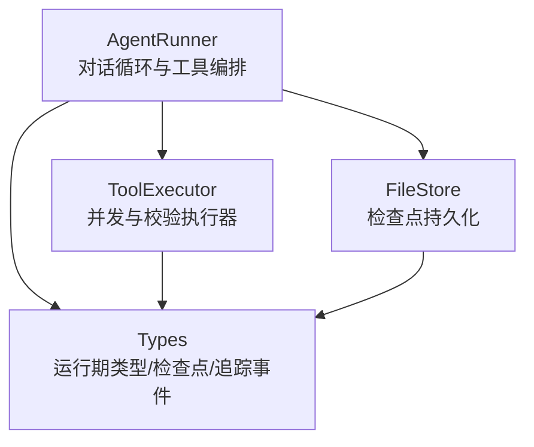
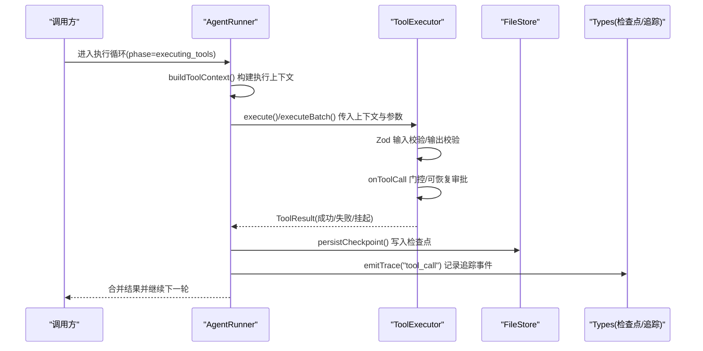
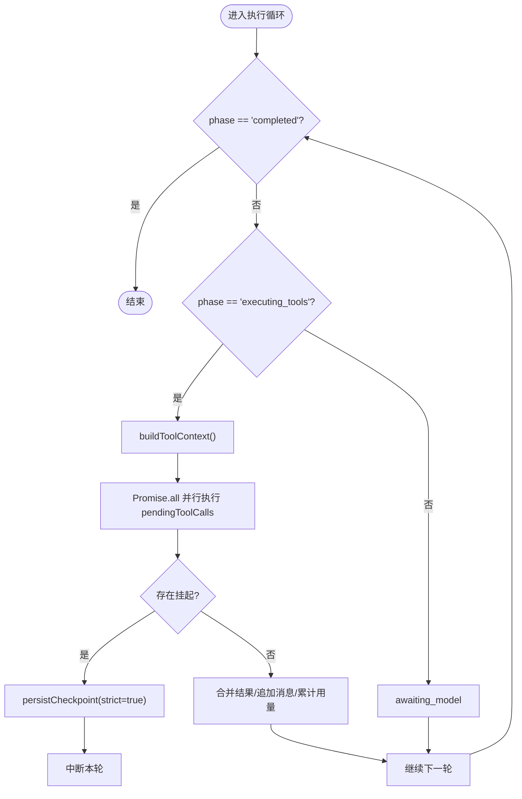
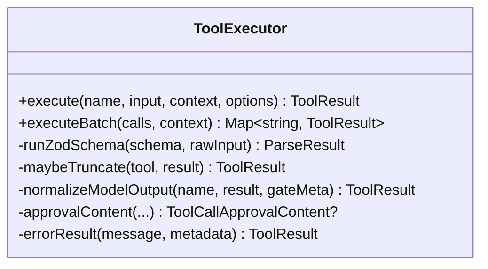
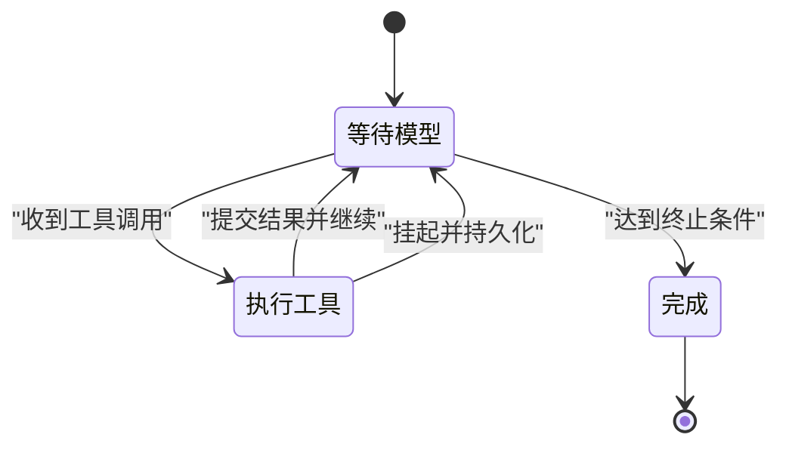
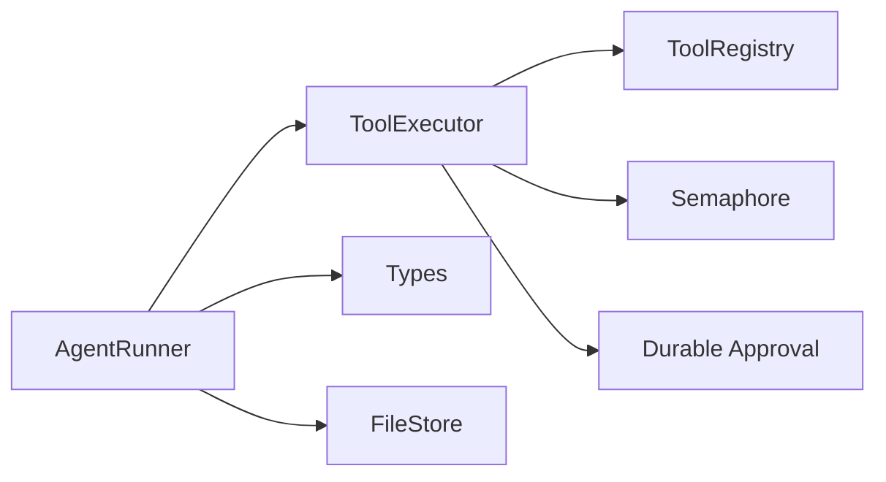

# 执行生命周期

<cite>
**本文引用的文件**
- [packages/core/src/agent/runner.ts](file://packages/core/src/agent/runner.ts)
- [packages/core/src/tool/executor.ts](file://packages/core/src/tool/executor.ts)
- [packages/core/src/types.ts](file://packages/core/src/types.ts)
- [packages/core/src/memory/file-store.ts](file://packages/core/src/memory/file-store.ts)
</cite>

## 目录
1. [简介](#简介)
2. [项目结构](#项目结构)
3. [核心组件](#核心组件)
4. [架构总览](#架构总览)
5. [详细组件分析](#详细组件分析)
6. [依赖关系分析](#依赖关系分析)
7. [性能考量](#性能考量)
8. [故障排查指南](#故障排查指南)
9. [结论](#结论)
10. [附录](#附录)

## 简介
本文面向工具执行引擎的完整生命周期管理，从工具调用的入口开始，系统说明参数校验、上下文传递、执行调度、状态与资源管理、执行上下文的创建/传递/销毁，以及监控追踪点。同时对比单次执行与批量执行的差异与适用场景，并提供调试方法与性能分析技巧。

## 项目结构
围绕工具执行的生命周期，核心代码分布在以下位置：
- AgentRunner：对话循环、工具调用编排、检查点持久化、追踪事件发射
- ToolExecutor：工具注册表、输入/输出校验、并发控制、门控与可恢复审批
- Types：运行期类型、检查点快照、追踪事件、治理与预算等元数据
- FileStore：基于文件的内存存储，用于检查点/共享状态的原子持久化

图表来源
- [packages/core/src/agent/runner.ts:902-1104](file://packages/core/src/agent/runner.ts#L902-L1104)
- [packages/core/src/tool/executor.ts:85-164](file://packages/core/src/tool/executor.ts#L85-L164)
- [packages/core/src/types.ts:2510-2530](file://packages/core/src/types.ts#L2510-L2530)
- [packages/core/src/memory/file-store.ts:1-54](file://packages/core/src/memory/file-store.ts#L1-L54)

章节来源
- [packages/core/src/agent/runner.ts:902-1104](file://packages/core/src/agent/runner.ts#L902-L1104)
- [packages/core/src/tool/executor.ts:85-164](file://packages/core/src/tool/executor.ts#L85-L164)
- [packages/core/src/types.ts:2510-2530](file://packages/core/src/types.ts#L2510-L2530)
- [packages/core/src/memory/file-store.ts:1-54](file://packages/core/src/memory/file-store.ts#L1-L54)

## 核心组件
- AgentRunner
  - 负责构建 LLM 选项、解析可用工具集、维护对话消息与 token 用量、检测循环与预算超限、在“等待模型”和“执行工具”阶段间切换，并在每个关键边界写入检查点。
  - 在“执行工具”阶段并行调度待执行的工具调用，处理挂起（需要审批）与提交（commit）语义，将结果回写为消息并继续下一轮。
- ToolExecutor
  - 提供单次 execute 与批量 executeBatch 两种执行模式；内置并发信号量控制；对输入进行 Zod 校验，可选对输出进行 schema 校验；支持 onToolCall 门控与可恢复审批（durable approval）。
  - 所有异常被捕获并以 ToolResult 返回，保证上层稳定消费。
- Types
  - 定义运行期检查点 InFlightTaskCheckpoint（含 phase、conversationMessages、toolCalls、pendingToolCalls 等）、追踪事件 TraceEvent（llm_call、tool_call、task 等）、治理与预算相关字段。
- FileStore
  - 以单 JSON 文件 + 内存 Map 的方式提供原子写入（临时文件 + fsync + rename），确保进程崩溃或断电后仍可恢复一致状态。

章节来源
- [packages/core/src/agent/runner.ts:902-1104](file://packages/core/src/agent/runner.ts#L902-L1104)
- [packages/core/src/tool/executor.ts:85-164](file://packages/core/src/tool/executor.ts#L85-L164)
- [packages/core/src/types.ts:2510-2530](file://packages/core/src/types.ts#L2510-L2530)
- [packages/core/src/memory/file-store.ts:1-54](file://packages/core/src/memory/file-store.ts#L1-L54)

## 架构总览
下图展示一次工具调用从入口到完成的生命周期，包括参数验证、上下文构建、门控/审批、执行、结果归并与检查点持久化。

图表来源
- [packages/core/src/agent/runner.ts:990-1104](file://packages/core/src/agent/runner.ts#L990-L1104)
- [packages/core/src/tool/executor.ts:112-164](file://packages/core/src/tool/executor.ts#L112-L164)
- [packages/core/src/memory/file-store.ts:1-54](file://packages/core/src/memory/file-store.ts#L1-L54)
- [packages/core/src/types.ts:2672-2728](file://packages/core/src/types.ts#L2672-L2728)

## 详细组件分析

### AgentRunner：对话循环与工具执行编排
- 入口与阶段
  - 主循环根据 phase 在 awaiting_model 与 executing_tools 之间切换；当 phase 为 completed 时退出。
  - 在 executing_tools 阶段，构建 ToolUseContext，并对 pendingToolCalls 进行并行执行。
- 参数与权限
  - 通过 resolveTools 得到 grantedToolNames，作为白名单；未授权的工具名即使模型请求也不会执行，默认拒绝。
- 上下文传递
  - buildToolContext 聚合 agent 标识、模型、工作目录、runId/taskId/team、credentials 等，传递给工具执行。
- 执行调度与批处理
  - 使用 Promise.all 并行执行多个工具调用；若任一调用返回挂起（需要审批），则标记 suspended 并持久化检查点后中断本轮。
- 状态管理与检查点
  - 在每个关键边界（如 commit 前、挂起前）调用 persistCheckpoint，保存 conversation/messages/tokenUsage/toolCalls/pendingToolCalls 等。
  - 检查点包含 phase、turns、finalOutput 等，便于恢复后继续执行。
- 追踪与观测
  - 每次 LLM 调用与工具调用均发射追踪事件（llm_call、tool_call），携带 runId/spanId/taskId/agent/model/tokens/duration 等。

图表来源
- [packages/core/src/agent/runner.ts:990-1104](file://packages/core/src/agent/runner.ts#L990-L1104)
- [packages/core/src/agent/runner.ts:1795-1811](file://packages/core/src/agent/runner.ts#L1795-L1811)

章节来源
- [packages/core/src/agent/runner.ts:902-1104](file://packages/core/src/agent/runner.ts#L902-L1104)
- [packages/core/src/agent/runner.ts:1795-1811](file://packages/core/src/agent/runner.ts#L1795-L1811)

### ToolExecutor：参数校验、门控与并发执行
- 单次执行 execute
  - 查找工具、检查中止信号、Zod 输入校验、可选输出校验、onToolCall 门控、执行工具实现、规范化输出、截断与错误封装。
- 批量执行 executeBatch
  - 通过 Semaphore 限制最大并发度，依次调度单个 execute，收集结果 Map。
- 可恢复审批（Durable Approval）
  - 支持从检查点恢复的审批请求与决策；若当前校验内容与历史不一致，视为陈旧/篡改并报错。
  - 当 gate 返回 suspend 时，构造 ToolCallApprovalContent 并交由上层生成 ApprovalRequest。
- 错误隔离
  - 所有异常被捕获并转为 ToolResult{ isError: true }，避免上层崩溃。

图表来源
- [packages/core/src/tool/executor.ts:85-164](file://packages/core/src/tool/executor.ts#L85-L164)
- [packages/core/src/tool/executor.ts:181-338](file://packages/core/src/tool/executor.ts#L181-L338)
- [packages/core/src/tool/executor.ts:456-483](file://packages/core/src/tool/executor.ts#L456-L483)

章节来源
- [packages/core/src/tool/executor.ts:85-164](file://packages/core/src/tool/executor.ts#L85-L164)
- [packages/core/src/tool/executor.ts:181-338](file://packages/core/src/tool/executor.ts#L181-L338)
- [packages/core/src/tool/executor.ts:456-483](file://packages/core/src/tool/executor.ts#L456-L483)

### 检查点与状态管理：InFlightTaskCheckpoint
- 检查点字段
  - phase（awaiting_model / executing_tools / completed）、conversationMessages、messages、tokenUsage、toolCalls、turns、pendingToolCalls、pendingToolResultText、finalOutput、loopWarned、loopDetected、budgetExceeded。
- 持久化策略
  - 在 commit 前、挂起前等关键边界调用 persistCheckpoint；FileStore 使用原子写入保证一致性。
- 恢复语义
  - 恢复后可继续执行 pendingToolCalls；若存在未决审批，则重新触发审批流程。

图表来源
- [packages/core/src/types.ts:2510-2530](file://packages/core/src/types.ts#L2510-L2530)
- [packages/core/src/memory/file-store.ts:1-54](file://packages/core/src/memory/file-store.ts#L1-L54)

章节来源
- [packages/core/src/types.ts:2510-2530](file://packages/core/src/types.ts#L2510-L2530)
- [packages/core/src/memory/file-store.ts:1-54](file://packages/core/src/memory/file-store.ts#L1-L54)

### 执行上下文：创建、传递与销毁
- 创建
  - AgentRunner 在 executing_tools 阶段调用 buildToolContext，注入 agent 信息、模型、工作目录、runId/taskId/team、credentials 等。
- 传递
  - 上下文随 ToolUseContext 传入 ToolExecutor.execute/executeBatch，最终到达工具实现。
- 销毁
  - 上下文为纯值对象，随调用栈自然回收；无显式销毁逻辑。

章节来源
- [packages/core/src/agent/runner.ts:1795-1811](file://packages/core/src/agent/runner.ts#L1795-L1811)
- [packages/core/src/tool/executor.ts:112-164](file://packages/core/src/tool/executor.ts#L112-L164)

### 监控与追踪点
- 追踪事件
  - llm_call：记录模型调用、模型名、轮次、token 用量、起止时间等。
  - tool_call：记录工具名、是否错误、门控动作与原因、输入/输出摘要等。
  - task/agent/consensus/routing_decision 等事件用于更高层观测。
- 运行时 Span
  - 通过 traceRuntime.startSpan 创建 LLM/Tool 级别的 span，附带 agent、model、provider、phase、task id 等属性。

章节来源
- [packages/core/src/types.ts:2672-2728](file://packages/core/src/types.ts#L2672-L2728)
- [packages/core/src/agent/runner.ts:597-635](file://packages/core/src/agent/runner.ts#L597-L635)
- [packages/core/src/agent/runner.ts:1376-1388](file://packages/core/src/agent/runner.ts#L1376-L1388)

## 依赖关系分析
- AgentRunner 依赖
  - ToolExecutor：执行工具、并发控制、校验与门控
  - Types：检查点、追踪事件、治理与预算等类型
  - FileStore：检查点持久化
- ToolExecutor 依赖
  - ToolRegistry：工具注册与查找
  - Semaphore：并发控制
  - Durable Approval：可恢复审批校验与哈希
  - Result Utilities：结果复制、截断、序列化等

图表来源
- [packages/core/src/agent/runner.ts:902-1104](file://packages/core/src/agent/runner.ts#L902-L1104)
- [packages/core/src/tool/executor.ts:85-164](file://packages/core/src/tool/executor.ts#L85-L164)
- [packages/core/src/memory/file-store.ts:1-54](file://packages/core/src/memory/file-store.ts#L1-L54)

章节来源
- [packages/core/src/agent/runner.ts:902-1104](file://packages/core/src/agent/runner.ts#L902-L1104)
- [packages/core/src/tool/executor.ts:85-164](file://packages/core/src/tool/executor.ts#L85-L164)
- [packages/core/src/memory/file-store.ts:1-54](file://packages/core/src/memory/file-store.ts#L1-L54)

## 性能考量
- 并发与吞吐
  - ToolExecutor 使用 Semaphore 限制最大并发，避免资源争用；可根据 I/O 特性调整 maxConcurrency。
- 结果大小控制
  - 支持按工具或代理级别设置 maxOutputChars，自动截断过长输出，减少后续 token 消耗与传输成本。
- 检查点频率
  - 仅在关键边界（commit 前、挂起前）写入检查点，降低 I/O 开销；FileStore 原子写入保障一致性。
- 上下文与消息压缩
  - 可通过 contextStrategy 与 compressToolResults 等配置减少长对话的上下文体积，提升稳定性与速度。
- 预算与超时
  - 通过 maxTokenBudget、callTimeoutMs、abortSignal 等限制资源与时长，防止失控。

[本节为通用指导，不直接分析具体文件]

## 故障排查指南
- 常见错误定位
  - 工具未注册：ToolExecutor 会返回错误 ToolResult，检查工具注册与名称匹配。
  - 输入校验失败：Zod 校验失败会返回结构化问题列表，核对输入结构与 schema。
  - 门控拒绝：onToolCall 返回 deny 时会带 gateReason，检查策略与上下文。
  - 可恢复审批陈旧：hash 不一致时报错，检查工具定义变更或上下文变化。
- 检查点与恢复
  - 若出现中断，确认 FileStore 路径与权限；恢复后检查 phase 与 pendingToolCalls 是否正确。
- 追踪与日志
  - 查看 tool_call 与 llm_call 追踪事件，关注 durationMs、tokens、isError、gateAction/gateReason 等字段。
  - 结合 traceRuntime 的 span 树定位慢调用与瓶颈。

章节来源
- [packages/core/src/tool/executor.ts:181-338](file://packages/core/src/tool/executor.ts#L181-L338)
- [packages/core/src/tool/executor.ts:456-483](file://packages/core/src/tool/executor.ts#L456-L483)
- [packages/core/src/types.ts:2672-2728](file://packages/core/src/types.ts#L2672-L2728)
- [packages/core/src/memory/file-store.ts:1-54](file://packages/core/src/memory/file-store.ts#L1-L54)

## 结论
工具执行引擎以 AgentRunner 为核心编排对话与工具调用，借助 ToolExecutor 完成参数校验、门控与并发执行，并通过检查点与 FileStore 实现可靠的状态管理与恢复。追踪事件与 span 贯穿全链路，便于观测与排障。单次执行适合简单工具调用；批量执行适合多工具并行且需统一上下文与并发控制的场景。合理配置并发、输出截断、检查点频率与预算，可获得稳定高效的执行体验。

[本节为总结性内容，不直接分析具体文件]

## 附录
- 单次执行 vs 批量执行
  - 单次执行：适用于独立、轻量、无需共享上下文或严格并发控制的工具调用。
  - 批量执行：适用于同一轮内多个工具调用共享上下文、需要统一并发上限与结果聚合的场景。
- 调试建议
  - 开启 onToolCall/onToolResult 回调观察输入输出；结合追踪事件与 span 树定位问题。
  - 在关键路径打印 or 记录检查点快照，辅助恢复与回放。
- 性能优化建议
  - 调整 maxConcurrency 与 maxOutputChars；启用结果压缩与上下文压缩；合理设置预算与超时。

[本节为通用指导，不直接分析具体文件]