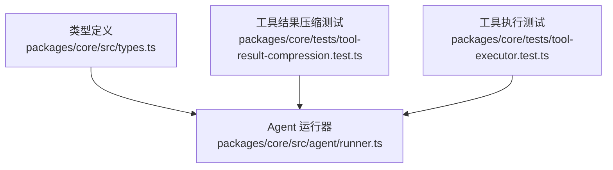
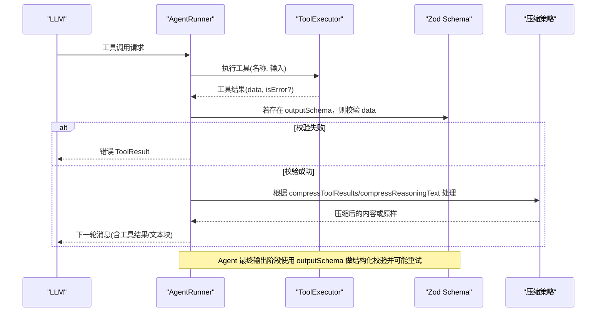
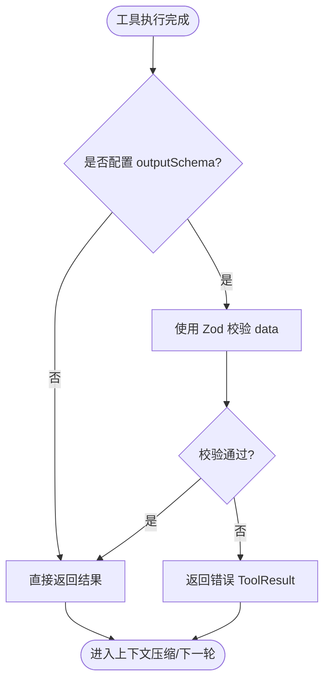
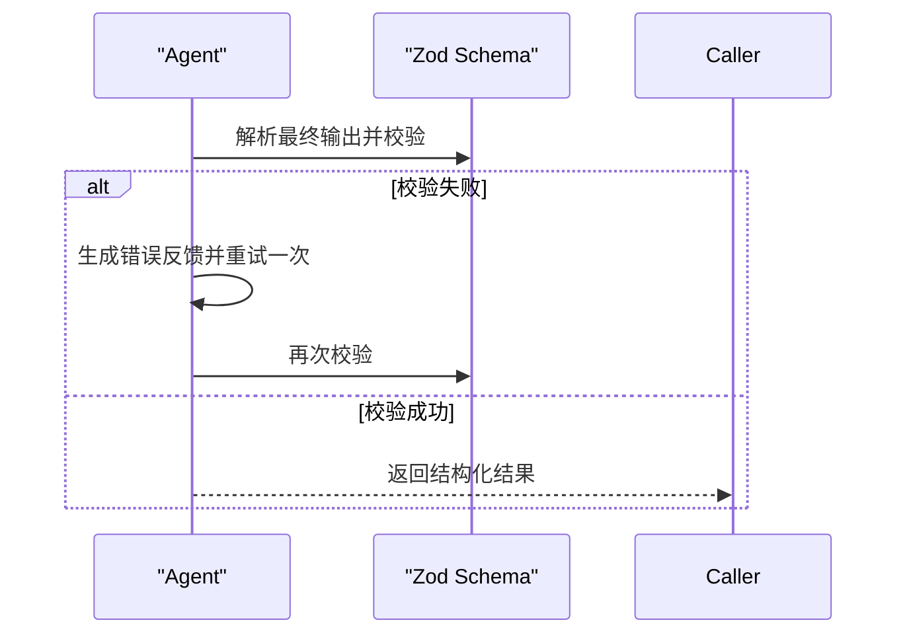
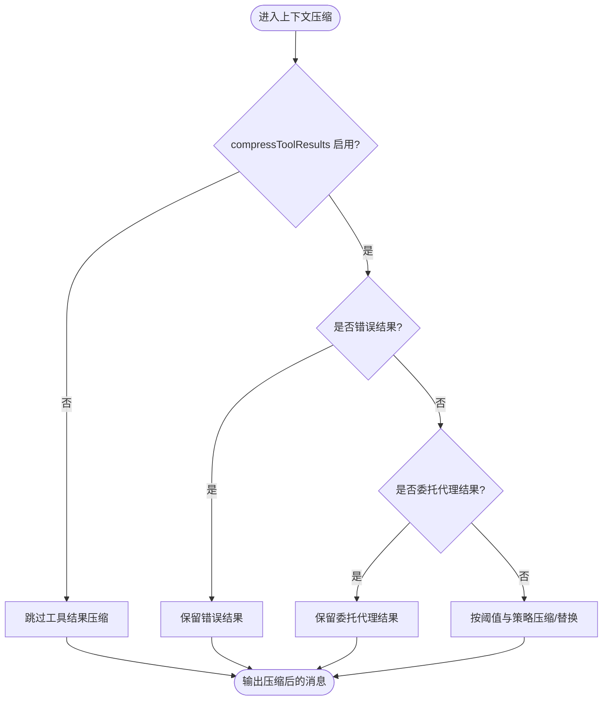
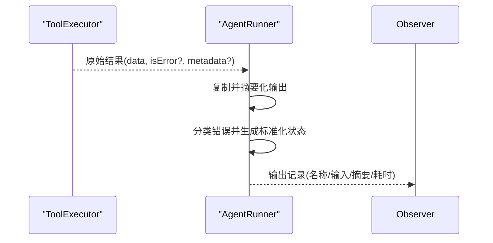
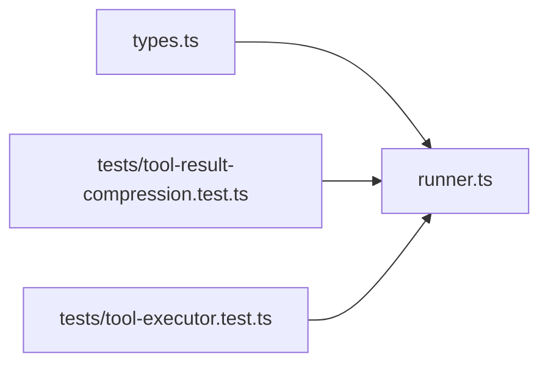

# 输出验证

<cite>
**本文引用的文件**
- [types.ts](file://packages/core/src/types.ts)
- [runner.ts](file://packages/core/src/agent/runner.ts)
- [tool-executor.test.ts](file://packages/core/tests/tool-executor.test.ts)
- [tool-result-compression.test.ts](file://packages/core/tests/tool-result-compression.test.ts)
</cite>

## 目录
1. [简介](#简介)
2. [项目结构](#项目结构)
3. [核心组件](#核心组件)
4. [架构总览](#架构总览)
5. [详细组件分析](#详细组件分析)
6. [依赖关系分析](#依赖关系分析)
7. [性能考量](#性能考量)
8. [故障排查指南](#故障排查指南)
9. [结论](#结论)
10. [附录](#附录)

## 简介
本文件聚焦于工具输出的验证机制，系统说明：
- Zod schema 在输入与输出验证中的应用位置与行为
- 输出截断（压缩）功能的实现原理与配置项
- 模型最终输出的标准化处理流程
- 不同类型数据的验证规则与转换逻辑
- 输出验证对性能的影响及优化建议
- 自定义验证规则的开发指南

## 项目结构
围绕“输出验证”的关键代码集中在 core 包的类型定义、Agent 运行器以及测试用例中：
- 类型定义：集中描述工具定义、Agent 配置、结果结构与压缩策略等
- Agent 运行器：负责执行工具调用、组装消息、上下文压缩与结果记录
- 测试用例：覆盖工具结果压缩、错误结果保留、多轮对话中的选择性压缩等行为

图表来源
- [types.ts:698-727](file://packages/core/src/types.ts#L698-L727)
- [runner.ts:1631-1760](file://packages/core/src/agent/runner.ts#L1631-L1760)
- [tool-result-compression.test.ts:83-194](file://packages/core/tests/tool-result-compression.test.ts#L83-L194)

章节来源
- [types.ts:698-727](file://packages/core/src/types.ts#L698-L727)
- [runner.ts:1631-1760](file://packages/core/src/agent/runner.ts#L1631-L1760)
- [tool-result-compression.test.ts:83-194](file://packages/core/tests/tool-result-compression.test.ts#L83-L194)

## 核心组件
- 工具定义与输出校验
  - 工具可声明 inputSchema 与可选 outputSchema；outputSchema 用于对单个工具的 application-owned 结果进行运行时校验，失败时返回错误 ToolResult，避免无效输出继续传播。
  - 支持通过 llmInputSchema 直接提供 LLM 侧的 JSON Schema，而不从 Zod 推导。
- Agent 结构化输出校验
  - Agent 配置可设置 outputSchema，用于对最终答案进行 JSON 解析与校验；失败时会尝试一次带错误反馈的重试。
- 输出截断（压缩）
  - compressToolResults：对历史工具结果进行替换式压缩（用短标记字符串整体替换），适用于长文本控制。
  - compressReasoningText：对推理文本进行头尾摘要截取，阈值与上限由 minChars 控制。
  - 压缩策略还包含 textBlockExcerptChars、minTextBlockChars 等细粒度参数，以及 custom 压缩回调。
- 上下文压缩与选择性保留
  - 运行器在旧回合中对 assistant 的长文本块进行摘要、图片块替换为占位符；对用户消息中的 tool_result 进行选择性压缩，同时保留错误结果与委托代理结果。

章节来源
- [types.ts:698-727](file://packages/core/src/types.ts#L698-L727)
- [types.ts:1165-1195](file://packages/core/src/types.ts#L1165-L1195)
- [runner.ts:1631-1760](file://packages/core/src/agent/runner.ts#L1631-L1760)

## 架构总览
下图展示了从工具执行到输出验证与压缩的整体流程，包括工具输出校验、结构化输出校验、以及上下文压缩策略。

图表来源
- [runner.ts:1364-1546](file://packages/core/src/agent/runner.ts#L1364-L1546)
- [types.ts:698-727](file://packages/core/src/types.ts#L698-L727)
- [types.ts:1165-1195](file://packages/core/src/types.ts#L1165-L1195)

## 详细组件分析

### 工具输出验证（ToolDefinition.outputSchema）
- 作用范围：仅针对单个工具的 application-owned 结果（ToolResult.data）。
- 行为：当配置了 outputSchema 且校验失败时，执行返回错误 ToolResult，不会将无效数据继续传入后续流程。
- 与 Agent 级 outputSchema 的区别：后者作用于 Agent 的最终答案（JSON 解析后校验），前者只保护单工具结果。

图表来源
- [types.ts:698-727](file://packages/core/src/types.ts#L698-L727)

章节来源
- [types.ts:698-727](file://packages/core/src/types.ts#L698-L727)

### Agent 结构化输出验证（AgentConfig.outputSchema）
- 作用范围：Agent 的最终答案（JSON 解析后）。
- 行为：若校验失败，会尝试一次带错误反馈的重试，以提高成功率。
- 与工具级 outputSchema 的区别：后者仅保护单工具结果，前者约束整个 Agent 的最终输出结构。

图表来源
- [types.ts:1165-1195](file://packages/core/src/types.ts#L1165-L1195)

章节来源
- [types.ts:1165-1195](file://packages/core/src/types.ts#L1165-L1195)

### 输出截断与压缩（compressToolResults / compressReasoningText）
- compressToolResults
  - 行为：对历史工具结果进行替换式压缩（用短标记字符串整体替换），默认从第 3 轮开始对已消费的结果进行压缩，最近一轮结果通常保留完整。
  - 选项：可配置 minChars 阈值，低于阈值的短结果不压缩；错误结果从不压缩；委托代理结果（delegate_to_agent）不压缩，因为父代理可能需要完整子代理输出。
- compressReasoningText
  - 行为：对推理文本进行头尾摘要截取，阈值与上限由 minChars 控制；当 preserveReasoningAsText 为 false 时无效。
- 上下文压缩
  - 对旧回合的 assistant 长文本块进行摘要，图片块替换为占位符；对用户消息中的 tool_result 选择性压缩，保留错误结果与委托代理结果。

图表来源
- [runner.ts:1631-1760](file://packages/core/src/agent/runner.ts#L1631-L1760)
- [tool-result-compression.test.ts:83-194](file://packages/core/tests/tool-result-compression.test.ts#L83-L194)

章节来源
- [runner.ts:1631-1760](file://packages/core/src/agent/runner.ts#L1631-L1760)
- [tool-result-compression.test.ts:83-194](file://packages/core/tests/tool-result-compression.test.ts#L83-L194)

### 模型输出的标准化处理
- 工具执行结果会被复制并摘要化，以便追踪与日志安全；错误分类与状态码被规范化，便于观测与重试策略。
- 工具调用记录包含名称、输入、输出摘要、耗时等信息，便于审计与诊断。

图表来源
- [runner.ts:1484-1528](file://packages/core/src/agent/runner.ts#L1484-L1528)

章节来源
- [runner.ts:1484-1528](file://packages/core/src/agent/runner.ts#L1484-L1528)

### 不同类型数据的验证规则与转换逻辑
- 工具输入：通过 inputSchema（Zod）进行严格校验，确保传入参数符合预期。
- 工具输出：可选 outputSchema 对 application-owned 结果进行运行时校验，失败即返回错误 ToolResult。
- Agent 最终输出：可选 outputSchema 对 JSON 解析后的最终答案进行校验，失败时进行一次带错误反馈的重试。
- 文本与图片块：在旧回合中进行压缩或替换，以控制上下文长度与成本。

章节来源
- [types.ts:698-727](file://packages/core/src/types.ts#L698-L727)
- [types.ts:1165-1195](file://packages/core/src/types.ts#L1165-L1195)
- [runner.ts:1631-1760](file://packages/core/src/agent/runner.ts#L1631-L1760)

## 依赖关系分析
- 类型定义（types.ts）为工具与 Agent 的配置提供契约，贯穿运行期验证与压缩策略。
- Agent 运行器（runner.ts）依赖这些契约执行工具、组装消息、应用压缩策略，并产出标准化结果。
- 测试用例（tests/*）覆盖了关键路径：工具结果压缩、错误结果保留、多轮对话中的选择性压缩等。

图表来源
- [types.ts:698-727](file://packages/core/src/types.ts#L698-L727)
- [runner.ts:1631-1760](file://packages/core/src/agent/runner.ts#L1631-L1760)
- [tool-result-compression.test.ts:83-194](file://packages/core/tests/tool-result-compression.test.ts#L83-L194)

章节来源
- [types.ts:698-727](file://packages/core/src/types.ts#L698-L727)
- [runner.ts:1631-1760](file://packages/core/src/agent/runner.ts#L1631-L1760)
- [tool-result-compression.test.ts:83-194](file://packages/core/tests/tool-result-compression.test.ts#L83-L194)

## 性能考量
- 压缩策略影响
  - compressToolResults 可减少历史工具结果对上下文的占用，降低 token 消耗与延迟；但频繁压缩会增加字符串操作开销。
  - compressReasoningText 通过头尾摘要控制推理文本长度，有助于减少上下文大小。
- 校验成本
  - 工具级 outputSchema 与 Agent 级 outputSchema 会在运行期进行 Zod 校验，带来一定 CPU 开销；建议在高频路径上谨慎使用复杂 schema。
- 重试成本
  - Agent 级 outputSchema 失败会触发一次重试，需评估重试带来的额外 token 与时间成本。
- 优化建议
  - 合理设置 minChars 阈值，避免过短的误压缩或过长的未压缩。
  - 对错误结果与委托代理结果保持不压缩，保证诊断与完整性。
  - 结合 contextStrategy（如滑动窗口）与压缩策略协同工作，平衡上下文质量与成本。

[本节为通用指导，无需特定文件引用]

## 故障排查指南
- 工具输出校验失败
  - 现象：工具返回错误 ToolResult，下游无法继续。
  - 排查：检查工具 outputSchema 是否与返回数据结构匹配；确认字段类型、必填项与枚举值。
- Agent 结构化输出校验失败
  - 现象：最终输出校验失败并触发一次重试。
  - 排查：检查 Agent outputSchema 与模型输出格式；关注重试后的错误反馈信息。
- 压缩异常
  - 现象：历史工具结果被意外压缩或未被压缩。
  - 排查：确认 compressToolResults 配置与 minChars 阈值；检查是否为错误结果或委托代理结果（不应压缩）。
- 上下文过长
  - 现象：token 用量高、响应慢。
  - 排查：启用 compressReasoningText 并调整 minChars；结合 contextStrategy 限制上下文窗口。

章节来源
- [types.ts:698-727](file://packages/core/src/types.ts#L698-L727)
- [types.ts:1165-1195](file://packages/core/src/types.ts#L1165-L1195)
- [runner.ts:1631-1760](file://packages/core/src/agent/runner.ts#L1631-L1760)
- [tool-result-compression.test.ts:83-194](file://packages/core/tests/tool-result-compression.test.ts#L83-L194)

## 结论
- 工具与 Agent 两级 Zod 校验分别保障局部结果与全局输出的正确性。
- 输出截断与压缩策略有效控制系统上下文规模，提升性能与稳定性。
- 通过合理的配置与自定义压缩回调，可在保证可观测性与完整性的前提下优化资源使用。
- 建议在生产环境中结合监控与日志，持续评估校验与压缩策略的效果。

[本节为总结性内容，无需特定文件引用]

## 附录
- 自定义验证规则开发指南
  - 工具级：在工具定义中声明 outputSchema（Zod），对 application-owned 结果进行运行时校验；失败时返回错误 ToolResult。
  - Agent 级：在 Agent 配置中声明 outputSchema（Zod），对最终 JSON 输出进行校验；失败时自动重试一次。
  - 自定义压缩：可通过 contextStrategy 的 custom 压缩回调实现更精细的上下文压缩逻辑，注意在回调内自行判断阈值与副作用。
  - 最佳实践：优先使用强类型 schema；对错误结果与委托代理结果保持不压缩；结合 minChars 与 excerpt 参数控制压缩粒度。

章节来源
- [types.ts:698-727](file://packages/core/src/types.ts#L698-L727)
- [types.ts:1165-1195](file://packages/core/src/types.ts#L1165-L1195)
- [runner.ts:1631-1760](file://packages/core/src/agent/runner.ts#L1631-L1760)
- [tool-result-compression.test.ts:83-194](file://packages/core/tests/tool-result-compression.test.ts#L83-L194)