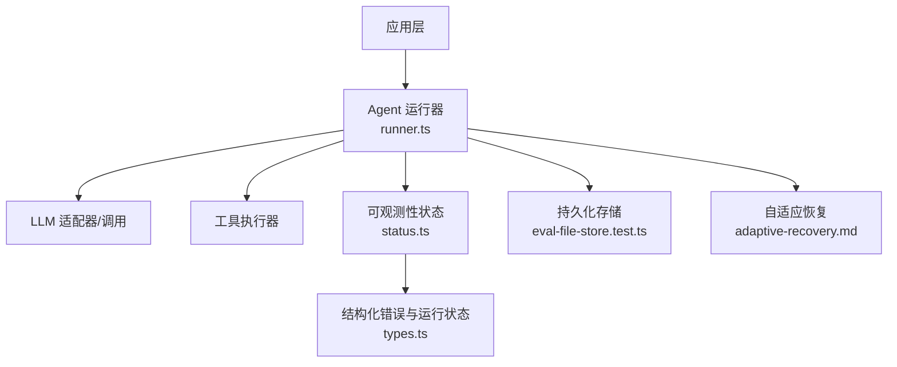
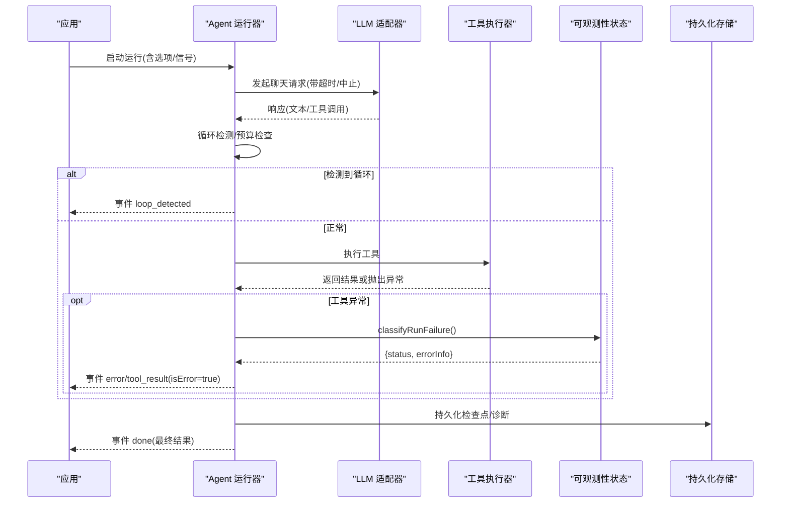
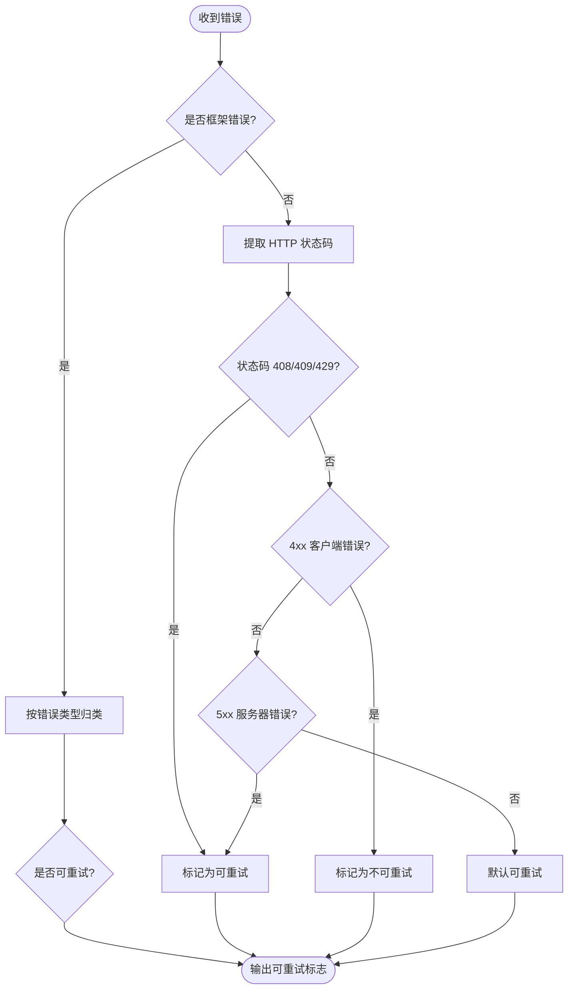
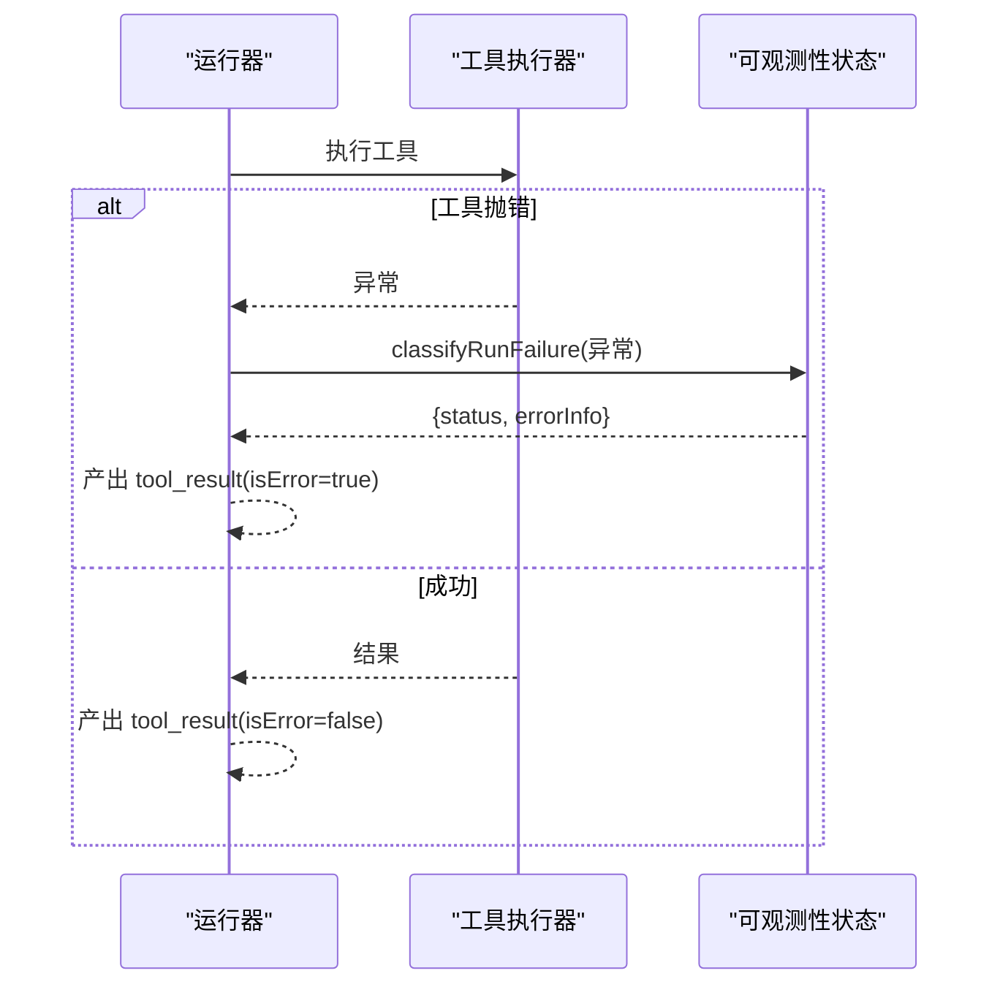
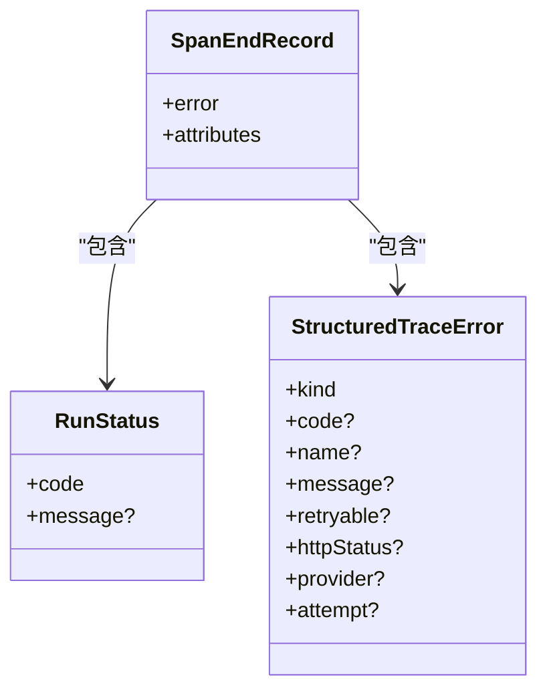
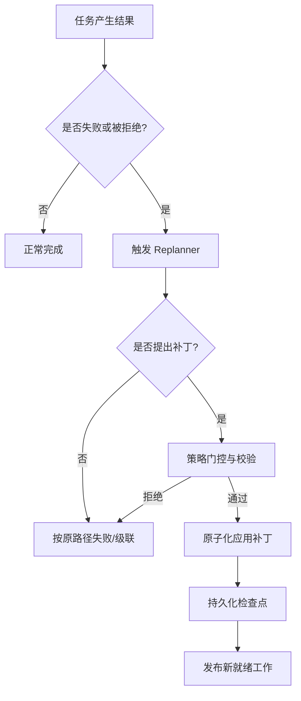
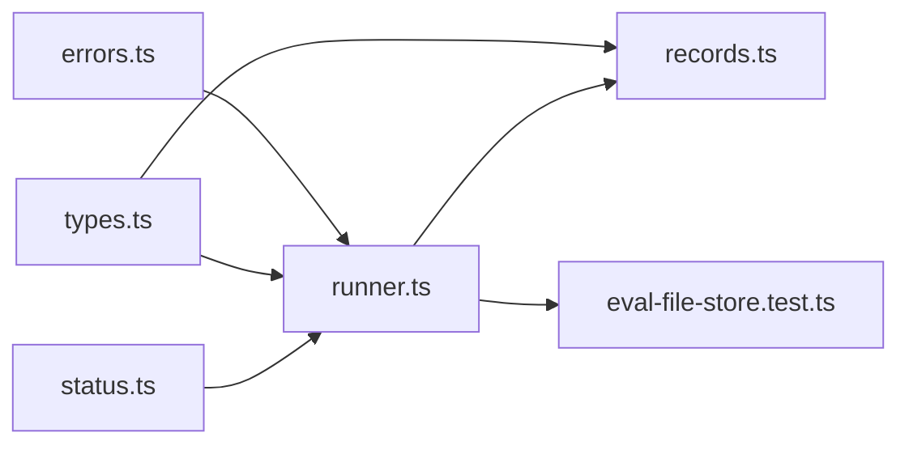

# 错误处理

<cite>
**本文引用的文件**
- [errors.ts](file://packages/core/src/errors.ts)
- [types.ts](file://packages/core/src/types.ts)
- [runner.ts](file://packages/core/src/agent/runner.ts)
- [status.ts](file://packages/core/src/observability/status.ts)
- [records.ts](file://packages/core/src/observability/records.ts)
- [adaptive-recovery.md](file://docs/adaptive-recovery.md)
- [eval-file-store.test.ts](file://packages/core/tests/eval-file-store.test.ts)
</cite>

## 目录
1. [简介](#简介)
2. [项目结构](#项目结构)
3. [核心组件](#核心组件)
4. [架构总览](#架构总览)
5. [详细组件分析](#详细组件分析)
6. [依赖关系分析](#依赖关系分析)
7. [性能与可观测性](#性能与可观测性)
8. [故障排查指南](#故障排查指南)
9. [结论](#结论)
10. [附录](#附录)

## 简介
本文件系统性说明工具执行过程中的错误处理机制，覆盖错误类型识别、标准化错误信息、元数据记录、恢复与重试策略、错误向上传播方式，以及日志与监控告警的配置要点。目标是帮助开发者在构建多智能体工作流时，稳定地捕获、分类、上报并恢复异常，确保系统具备可观测性与韧性。

## 项目结构
围绕错误处理的核心代码主要分布在以下模块：
- 错误定义与分类：框架自定义错误类、可重试判定、取消错误识别
- 运行器（Agent Runner）：工具调用、循环检测、预算控制、流式事件与错误传播
- 可观测性状态：将运行时错误归一化为结构化错误信息与运行状态
- 持久化存储与诊断：文件存储的损坏、截断、权限等错误的诊断与恢复
- 自适应恢复：任务失败后的计划修复与重规划

图表来源
- [runner.ts:597-635](file://packages/core/src/agent/runner.ts#L597-L635)
- [status.ts:45-86](file://packages/core/src/observability/status.ts#L45-L86)
- [types.ts:282-321](file://packages/core/src/types.ts#L282-L321)

章节来源
- [runner.ts:597-635](file://packages/core/src/agent/runner.ts#L597-L635)
- [status.ts:45-86](file://packages/core/src/observability/status.ts#L45-L86)
- [types.ts:282-321](file://packages/core/src/types.ts#L282-L321)

## 核心组件
- 错误类型与分类
  - 框架错误类：任务要求不满足、预算超限（Token/Cost）、调用超时（LLM/路由）、消息格式非法、不支持的工具调用/结果内容等
  - 可重试判定：基于错误类型、HTTP 状态码、是否取消等综合判断
  - 取消错误识别：区分标准 AbortError 与特定 SDK 的用户中止错误
- 运行器错误处理
  - 工具执行异常被捕获为“错误结果”，继续推进流程
  - 流式事件统一输出 error/budget_exceeded/loop_detected/done 等事件
  - 循环检测与警告注入，支持终止或注入提示以打破死循环
  - 预算检查：达到 Token/Cost 上限时发出预算耗尽事件
- 可观测性状态
  - 将任意错误转换为统一的 RunStatus 与 StructuredTraceError
  - 包含错误种类、名称、消息、是否可重试、HTTP 状态、提供者、尝试次数等元数据
- 持久化存储诊断
  - 对不完整批次、尾随部分行、权限失败、重命名失败等场景给出结构化诊断码
  - 保证幂等关闭、可重复写入、保留权威副本
- 自适应恢复
  - 任务失败后可通过 Replanner 提出 PlanPatch，追加/重定向/替代任务
  - 修复过程原子化，失败回滚，支持检查点与恢复

章节来源
- [errors.ts:11-239](file://packages/core/src/errors.ts#L11-L239)
- [runner.ts:1204-1269](file://packages/core/src/agent/runner.ts#L1204-L1269)
- [runner.ts:1426-1486](file://packages/core/src/agent/runner.ts#L1426-L1486)
- [status.ts:45-86](file://packages/core/src/observability/status.ts#L45-L86)
- [eval-file-store.test.ts:136-163](file://packages/core/tests/eval-file-store.test.ts#L136-L163)
- [adaptive-recovery.md:1-132](file://docs/adaptive-recovery.md#L1-L132)

## 架构总览
下图展示一次 Agent 运行中从 LLM 调用到工具执行、再到错误分类与上报的整体流程，包括循环检测、预算控制与流式事件输出。

图表来源
- [runner.ts:597-635](file://packages/core/src/agent/runner.ts#L597-L635)
- [runner.ts:1204-1269](file://packages/core/src/agent/runner.ts#L1204-L1269)
- [runner.ts:1426-1486](file://packages/core/src/agent/runner.ts#L1426-L1486)
- [status.ts:45-86](file://packages/core/src/observability/status.ts#L45-L86)

## 详细组件分析

### 错误类型与分类
- 错误类型
  - 任务要求不满足：InvalidTaskRequirementsError
  - 预算超限：TokenBudgetExceededError、CostBudgetExceededError
  - 调用超时：LLMCallTimeoutError、RoutingTimeoutError
  - 消息非法：InvalidMessageError
  - 工具能力不足：UnsupportedToolCallError、UnsupportedToolResultContentError
- 可重试判定
  - 基于错误实例、HTTP 状态码（408/409/429 视为可重试，其他 4xx 不可重试，5xx 可重试），以及是否取消
- 取消错误识别
  - 兼容标准 AbortError 与特定 SDK 的用户中止错误

图表来源
- [errors.ts:202-239](file://packages/core/src/errors.ts#L202-L239)

章节来源
- [errors.ts:11-239](file://packages/core/src/errors.ts#L11-L239)

### 运行器中的错误处理与传播
- 工具执行异常
  - 捕获后转为“错误结果”（isError=true），继续推进后续步骤，避免中断整个轮次
- 流式事件
  - 统一输出 text/reasoning/tool_use/tool_result/budget_exceeded/loop_detected/error/done
  - error 事件携带 Error 对象；budget_exceeded 携带具体预算超限错误
- 循环检测
  - 检测工具调用或文本重复，发出 loop_detected 事件，支持 warn/terminate/inject 策略
- 预算控制
  - 超过 Token/Cost 预算时发出 budget_exceeded 事件，并设置完成阶段
- 错误分类与元数据
  - 使用 classifyRunFailure 将错误转换为 RunStatus 与 StructuredTraceError，包含 kind/code/name/message/retryable/httpStatus/provider/attempt 等

图表来源
- [runner.ts:1426-1486](file://packages/core/src/agent/runner.ts#L1426-L1486)
- [status.ts:45-86](file://packages/core/src/observability/status.ts#L45-L86)

章节来源
- [runner.ts:1204-1269](file://packages/core/src/agent/runner.ts#L1204-L1269)
- [runner.ts:1426-1486](file://packages/core/src/agent/runner.ts#L1426-L1486)
- [status.ts:45-86](file://packages/core/src/observability/status.ts#L45-L86)

### 错误信息的标准化格式与元数据记录
- 运行状态
  - RunStatus.code：ok/error/cancelled/timeout/budget_exhausted/rejected/suspended/skipped
  - RunStatus.message：安全裁剪后的消息
- 结构化错误
  - StructuredTraceError.kind：provider/tool/framework/callback/validation/timeout/cancellation/budget/store/exporter/unknown
  - 字段：code/name/message/retryable/httpStatus/provider/attempt
- 记录载体
  - SpanEndRecord.error：完整错误快照，用于结果与追踪记录

图表来源
- [types.ts:282-321](file://packages/core/src/types.ts#L282-L321)
- [records.ts:63-75](file://packages/core/src/observability/records.ts#L63-L75)

章节来源
- [types.ts:282-321](file://packages/core/src/types.ts#L282-L321)
- [records.ts:63-75](file://packages/core/src/observability/records.ts#L63-L75)

### 错误恢复策略与重试机制
- 重试策略
  - 通过 isRetryableError 判定是否重试；结合调用方提供的最大重试次数、基础延迟、指数退避倍数进行配置
- 自适应恢复
  - 任务失败后，Replanner 可提出 PlanPatch（追加任务、重定向待执行任务、替代已阻塞任务）
  - 补丁需通过策略门控与校验，成功后原子化应用并持久化检查点；若保存失败则回滚至原失败路径
- 边界与限制
  - 仅针对未执行部分进行修复；历史任务保持真实状态（failed/skipped 并标注修订号）
  - 与旧版审批模式不兼容，需使用新的事件与检查点机制

图表来源
- [adaptive-recovery.md:1-132](file://docs/adaptive-recovery.md#L1-L132)

章节来源
- [adaptive-recovery.md:1-132](file://docs/adaptive-recovery.md#L1-L132)

### 错误传播到上层组件的方式
- 流式事件
  - error：不可恢复错误，data 为 Error 对象
  - budget_exceeded：预算耗尽，data 为具体预算错误
  - loop_detected：循环检测，data 为循环信息
  - done：结束事件，data 为最终结果
- 结构化错误
  - 通过 StructuredTraceError 提供机器可读的错误元数据，便于上层聚合与告警
- 检查点与恢复
  - 关键节点持久化检查点，崩溃后可恢复；失败分支可被修复

章节来源
- [types.ts:484-504](file://packages/core/src/types.ts#L484-L504)
- [runner.ts:1204-1269](file://packages/core/src/agent/runner.ts#L1204-L1269)
- [runner.ts:1426-1486](file://packages/core/src/agent/runner.ts#L1426-L1486)

### 错误日志记录与监控告警配置
- 日志与追踪
  - 通过 onTrace 回调输出 llm_call/tool_call 等事件，附带 agent/model/phase/turn/tokens/duration 等属性
  - 使用 TraceRuntime.startSpan 创建 span，并在结束时写入 RunStatus 与 StructuredTraceError
- 可观测性记录
  - SpanEndRecord 包含完整的 attributes、duration、status、error，可用于导出与分析
- 告警建议
  - 基于 RunStatus.code 与 StructuredTraceError.kind 设置阈值与规则（如 timeout/budget_exhausted/provider 错误率）
  - 关注 retryable 标志与 httpStatus，区分瞬时错误与服务端错误

章节来源
- [runner.ts:597-635](file://packages/core/src/agent/runner.ts#L597-L635)
- [records.ts:63-75](file://packages/core/src/observability/records.ts#L63-L75)
- [status.ts:45-86](file://packages/core/src/observability/status.ts#L45-L86)

## 依赖关系分析
- runner.ts 依赖 errors.ts 进行错误分类与重试判定，依赖 status.ts 生成结构化错误与运行状态
- types.ts 定义所有公共类型（RunStatus、StructuredTraceError、StreamEvent 等），被各模块引用
- observability/records.ts 定义追踪记录结构，承载错误与状态
- eval-file-store.test.ts 验证存储层的错误与诊断行为，确保健壮性

图表来源
- [errors.ts:11-239](file://packages/core/src/errors.ts#L11-L239)
- [types.ts:282-321](file://packages/core/src/types.ts#L282-L321)
- [runner.ts:597-635](file://packages/core/src/agent/runner.ts#L597-L635)
- [records.ts:63-75](file://packages/core/src/observability/records.ts#L63-L75)
- [eval-file-store.test.ts:136-163](file://packages/core/tests/eval-file-store.test.ts#L136-L163)

章节来源
- [errors.ts:11-239](file://packages/core/src/errors.ts#L11-L239)
- [types.ts:282-321](file://packages/core/src/types.ts#L282-L321)
- [runner.ts:597-635](file://packages/core/src/agent/runner.ts#L597-L635)
- [records.ts:63-75](file://packages/core/src/observability/records.ts#L63-L75)
- [eval-file-store.test.ts:136-163](file://packages/core/tests/eval-file-store.test.ts#L136-L163)

## 性能与可观测性
- 性能影响
  - 循环检测与预算检查在每轮中进行，应避免过度频繁的检查点写入
  - 工具输出长度限制可减少大对象序列化开销
- 可观测性
  - 通过 onTrace 与 TraceRuntime 输出细粒度事件，便于定位瓶颈与异常
  - 使用 StructuredTraceError 的 retryable/httpStatus/provider 字段进行精准告警

[本节为通用指导，无需特定文件来源]

## 故障排查指南
- 参数验证错误
  - 检查输入消息是否符合 ContentBlock[] 规范；出现 InvalidMessageError 时需修正消息结构
- 执行异常
  - 工具执行异常会被捕获为 isError=true 的结果；查看 tool_call 事件与 error 事件定位问题
- 超时错误
  - LLMCallTimeoutError/RoutingTimeoutError 表明调用或路由阶段超时；调整 callTimeoutMs 或整体 timeoutMs
- 预算耗尽
  - budget_exceeded 事件出现时，检查 maxTokenBudget/maxCostBudget 与模型输出大小
- 循环检测
  - loop_detected 事件指示重复行为；可调整 loopDetection 策略（warn/terminate/inject）
- 存储诊断
  - 遇到 incomplete_batch/trailing_partial_line/CORRUPT_FILE/RENAME_FAILED 等诊断码时，检查文件系统权限与写入完整性

章节来源
- [errors.ts:11-239](file://packages/core/src/errors.ts#L11-L239)
- [runner.ts:1204-1269](file://packages/core/src/agent/runner.ts#L1204-L1269)
- [eval-file-store.test.ts:136-163](file://packages/core/tests/eval-file-store.test.ts#L136-L163)

## 结论
该框架提供了完善的错误处理体系：明确的错误类型、标准化的错误元数据、流式事件与检查点保障、可配置的重试与自适应恢复策略，以及丰富的可观测性接口。通过合理配置超时、预算、循环检测与恢复策略，并结合结构化错误与追踪记录，可以在复杂的多智能体工作流中实现高可靠与可维护的错误治理。

## 附录
- 常见配置项参考
  - 调用超时：callTimeoutMs
  - 循环检测：loopDetection.maxRepetitions、loopDetection.loopDetectionWindow、loopDetection.onLoopDetected
  - 工具输出长度：maxToolOutputChars
  - 重试策略：maxRetries、retryDelayMs、retryBackoff
- 相关文档
  - 自适应恢复：见 adaptive-recovery.md

[本节为补充信息，无需特定文件来源]