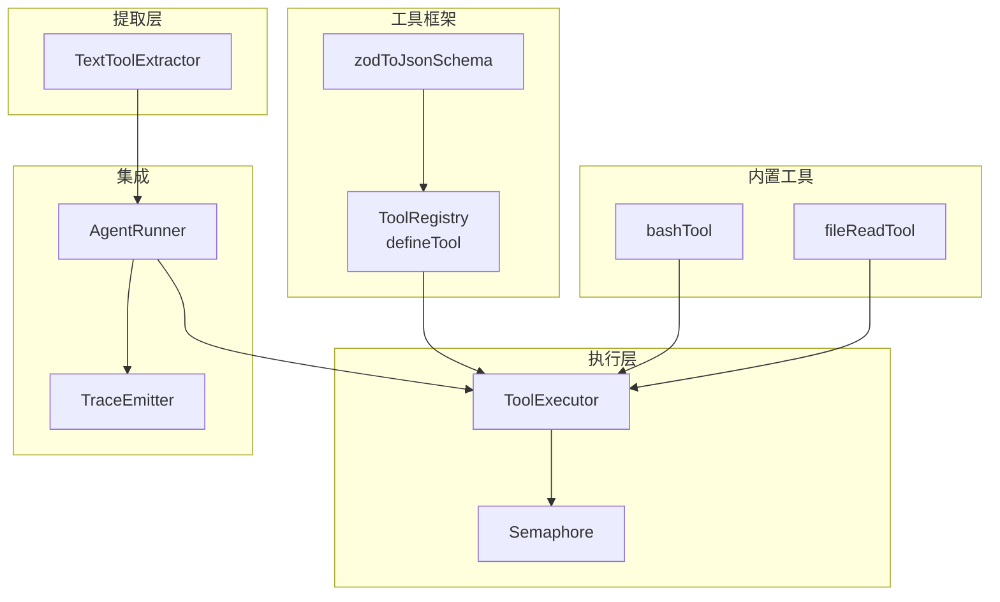
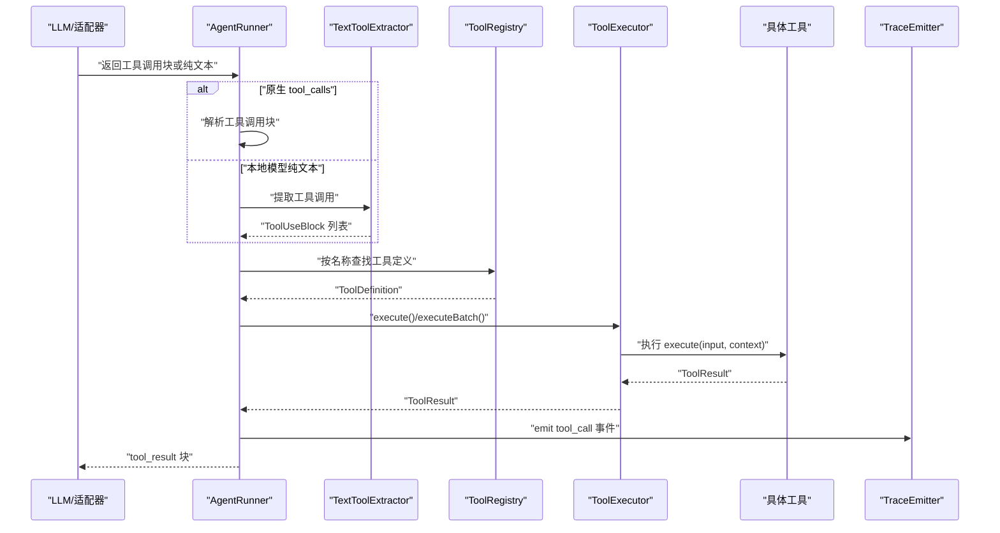
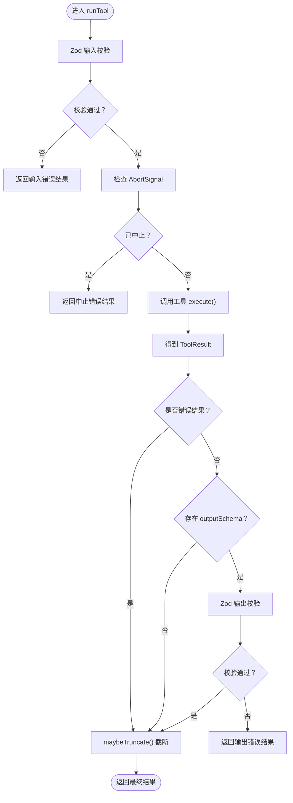
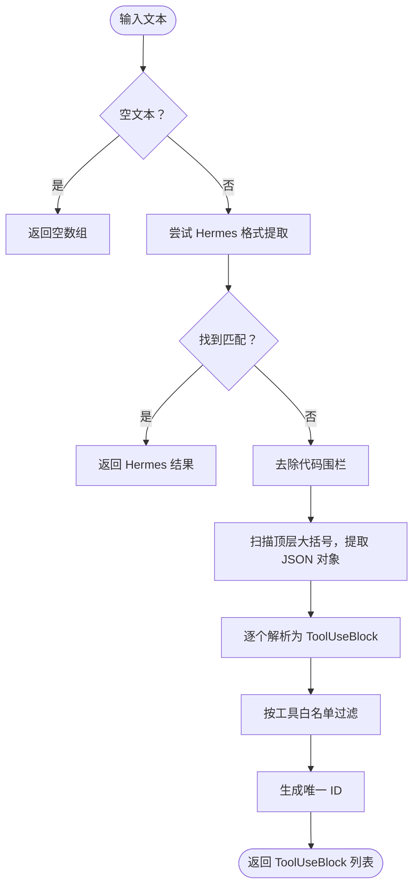
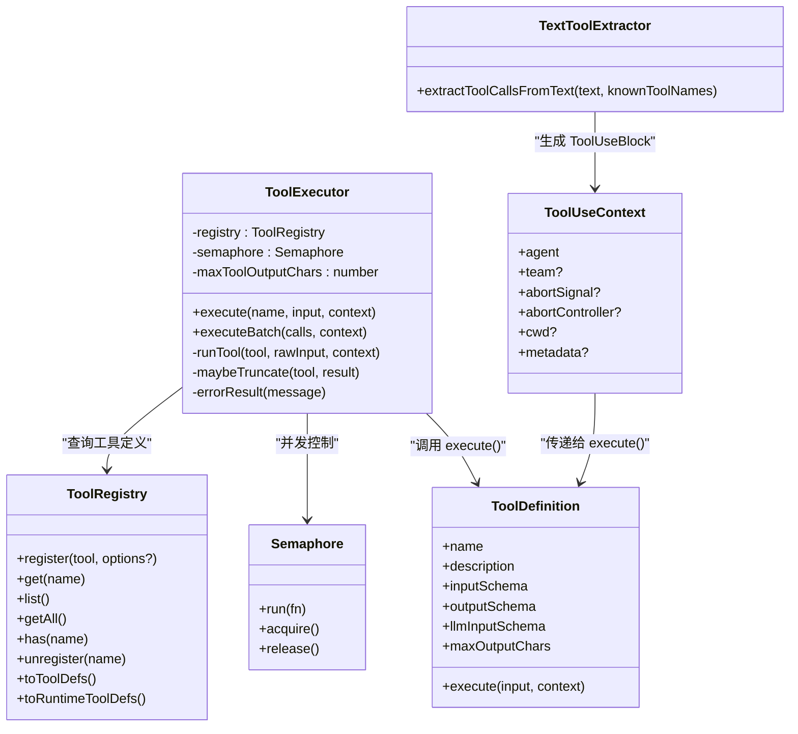

# 工具执行机制

<cite>
**本文引用的文件**
- [src/tool/executor.ts](file://src/tool/executor.ts)
- [src/tool/text-tool-extractor.ts](file://src/tool/text-tool-extractor.ts)
- [src/tool/framework.ts](file://src/tool/framework.ts)
- [src/utils/semaphore.ts](file://src/utils/semaphore.ts)
- [src/types.ts](file://src/types.ts)
- [src/tool/built-in/index.ts](file://src/tool/built-in/index.ts)
- [src/tool/built-in/bash.ts](file://src/tool/built-in/bash.ts)
- [src/tool/built-in/file-read.ts](file://src/tool/built-in/file-read.ts)
- [src/tool/mcp.ts](file://src/tool/mcp.ts)
- [src/utils/trace.ts](file://src/utils/trace.ts)
- [src/agent/runner.ts](file://src/agent/runner.ts)
- [tests/tool-executor.test.ts](file://tests/tool-executor.test.ts)
- [tests/text-tool-extractor.test.ts](file://tests/text-tool-extractor.test.ts)
- [docs/context-management.md](file://docs/context-management.md)
</cite>

## 目录
1. [简介](#简介)
2. [项目结构](#项目结构)
3. [核心组件](#核心组件)
4. [架构总览](#架构总览)
5. [详细组件分析](#详细组件分析)
6. [依赖关系分析](#依赖关系分析)
7. [性能考量](#性能考量)
8. [故障排查指南](#故障排查指南)
9. [结论](#结论)
10. [附录](#附录)

## 简介
本文件系统性阐述 Open Multi-Agent 框架中的“工具执行机制”，覆盖从工具发现、参数解析、执行调度到结果聚合的完整生命周期；详解 ToolExecutor 的并发控制、错误隔离与输出截断策略；说明 TextToolExtractor 如何从 LLM 文本输出中提取工具调用指令；解释工具执行的上下文管理（执行环境、权限控制、资源限制）；提供可观测性与调试方法（执行日志、性能指标、错误追踪）；并总结优化策略（批量执行、延迟执行、结果复用）与安全机制。

## 项目结构
工具执行相关代码主要分布在以下模块：
- 工具框架与注册：ToolRegistry、defineTool、Zod 到 JSON Schema 转换
- 执行器：ToolExecutor（并发、输入/输出校验、错误捕获、截断）
- 提取器：TextToolExtractor（从本地模型文本中提取工具调用）
- 并发控制：Semaphore（轻量计数信号量）
- 上下文与类型：ToolUseContext、ToolResult、LLMToolDef 等
- 内置工具：bash、file_read 等示例工具
- MCP 工具桥接：将外部 MCP 服务暴露为框架工具
- 可观测性：trace 事件发射
- 集成点：AgentRunner 将工具调用与执行串联进对话流程

图表来源
- [src/tool/framework.ts](file://src/tool/framework.ts)
- [src/tool/executor.ts](file://src/tool/executor.ts)
- [src/utils/semaphore.ts](file://src/utils/semaphore.ts)
- [src/tool/text-tool-extractor.ts](file://src/tool/text-tool-extractor.ts)
- [src/tool/built-in/bash.ts](file://src/tool/built-in/bash.ts)
- [src/tool/built-in/file-read.ts](file://src/tool/built-in/file-read.ts)
- [src/agent/runner.ts](file://src/agent/runner.ts)
- [src/utils/trace.ts](file://src/utils/trace.ts)

章节来源
- [src/tool/framework.ts](file://src/tool/framework.ts)
- [src/tool/executor.ts](file://src/tool/executor.ts)
- [src/utils/semaphore.ts](file://src/utils/semaphore.ts)
- [src/tool/text-tool-extractor.ts](file://src/tool/text-tool-extractor.ts)
- [src/tool/built-in/index.ts](file://src/tool/built-in/index.ts)
- [src/tool/built-in/bash.ts](file://src/tool/built-in/bash.ts)
- [src/tool/built-in/file-read.ts](file://src/tool/built-in/file-read.ts)
- [src/tool/mcp.ts](file://src/tool/mcp.ts)
- [src/utils/trace.ts](file://src/utils/trace.ts)
- [src/agent/runner.ts](file://src/agent/runner.ts)

## 核心组件
- ToolRegistry：集中注册与导出工具定义，生成 LLM 期望的 JSON Schema 工具列表
- defineTool：声明式定义工具，支持输入/输出 Zod 校验、LLM 输入 Schema 直通、最大输出字符数
- ToolExecutor：并发执行器，负责输入/输出校验、错误捕获、结果截断、批量执行
- TextToolExtractor：在本地模型返回纯文本而非原生 tool_calls 时，从文本中提取工具调用
- Semaphore：轻量计数信号量，用于并发上限控制
- ToolUseContext：工具执行上下文，包含 agent/team 信息、AbortSignal、工作目录、元数据等
- 内置工具：bash、file_read 等示例，展示如何使用 ToolUseContext 和中断信号
- MCP 工具桥接：将外部 MCP 服务器暴露为框架工具，透传输入/输出与错误
- AgentRunner：将工具调用块转换为实际执行，记录耗时与轨迹事件

章节来源
- [src/tool/framework.ts](file://src/tool/framework.ts)
- [src/tool/executor.ts](file://src/tool/executor.ts)
- [src/tool/text-tool-extractor.ts](file://src/tool/text-tool-extractor.ts)
- [src/utils/semaphore.ts](file://src/utils/semaphore.ts)
- [src/types.ts](file://src/types.ts)
- [src/tool/built-in/index.ts](file://src/tool/built-in/index.ts)
- [src/tool/built-in/bash.ts](file://src/tool/built-in/bash.ts)
- [src/tool/built-in/file-read.ts](file://src/tool/built-in/file-read.ts)
- [src/tool/mcp.ts](file://src/tool/mcp.ts)
- [src/agent/runner.ts](file://src/agent/runner.ts)

## 架构总览
工具执行的端到端流程如下：

图表来源
- [src/agent/runner.ts](file://src/agent/runner.ts)
- [src/tool/text-tool-extractor.ts](file://src/tool/text-tool-extractor.ts)
- [src/tool/framework.ts](file://src/tool/framework.ts)
- [src/tool/executor.ts](file://src/tool/executor.ts)
- [src/utils/trace.ts](file://src/utils/trace.ts)

## 详细组件分析

### ToolExecutor：并发执行与错误隔离
- 单次执行：根据 ToolRegistry 查找工具，先检查 AbortSignal，再进行 Zod 输入校验，执行后可选输出校验与截断，异常捕获为错误结果
- 批量执行：通过 Semaphore 控制并发，每个调用独立错误隔离，保证所有调用都有结果映射
- 截断策略：优先使用 per-tool 的 maxOutputChars，否则回退到构造函数注入的 agent 级别限制；截断保留头尾并插入标记，确保不超过预算
- 错误处理：未知工具名、输入/输出校验失败、执行抛错均转为 ToolResult(isError=true)，不向调用方抛出异常

图表来源
- [src/tool/executor.ts](file://src/tool/executor.ts)

章节来源
- [src/tool/executor.ts](file://src/tool/executor.ts)
- [tests/tool-executor.test.ts](file://tests/tool-executor.test.ts)

### TextToolExtractor：从 LLM 文本中提取工具调用
- 支持多种本地模型输出格式：裸 JSON 对象、带代码围栏、Hermes 标签、function 包装对象
- 白名单过滤：仅当 name 属于已知工具集时才视为有效调用
- 容错与健壮性：对字符串编码的 arguments 自动解码；对 JSON 解析失败的片段静默跳过；对散落大括号（如“use ${var}”）保持深度跟踪稳健
- 生成唯一 ID：为每个提取的调用生成唯一标识，便于后续关联

图表来源
- [src/tool/text-tool-extractor.ts](file://src/tool/text-tool-extractor.ts)

章节来源
- [src/tool/text-tool-extractor.ts](file://src/tool/text-tool-extractor.ts)
- [tests/text-tool-extractor.test.ts](file://tests/text-tool-extractor.test.ts)

### 并发控制与资源限制
- 并发上限：ToolExecutor 使用 Semaphore 控制最大并发，默认 4；批量执行时每个任务在信号量内运行，避免资源争用
- 中断与超时：工具执行可读取 ToolUseContext.abortSignal；内置 bash 工具支持超时与 SIGKILL 终止，防止长时间阻塞
- 资源限制：结合 AgentConfig 的 maxToolOutputChars 与 per-tool maxOutputChars，控制单次输出大小；配合 contextStrategy 与 compressToolResults 控制历史上下文膨胀

章节来源
- [src/utils/semaphore.ts](file://src/utils/semaphore.ts)
- [src/tool/executor.ts](file://src/tool/executor.ts)
- [src/tool/built-in/bash.ts](file://src/tool/built-in/bash.ts)
- [src/types.ts](file://src/types.ts)
- [docs/context-management.md](file://docs/context-management.md)

### 上下文管理与安全机制
- 上下文注入：ToolUseContext 包含 agent/team 信息、AbortSignal/AbortController、cwd、metadata 等，供工具按需使用
- 安全过滤：AgentRunner 在发送给 LLM 的工具清单上应用 preset/allowlist/denylist 与框架级安全规则，避免危险工具被调用
- 权限与隔离：内置工具（如 bash）在执行时受超时与中断控制；文件工具支持偏移/限制读取，避免一次性加载过大文件
- MCP 工具：通过外部进程桥接 MCP 服务，工具输入/输出 Schema 由 MCP 服务器提供，框架侧做最小化验证与安全命名规范化

章节来源
- [src/types.ts](file://src/types.ts)
- [src/agent/runner.ts](file://src/agent/runner.ts)
- [src/tool/built-in/bash.ts](file://src/tool/built-in/bash.ts)
- [src/tool/built-in/file-read.ts](file://src/tool/built-in/file-read.ts)
- [src/tool/mcp.ts](file://src/tool/mcp.ts)

### 结果聚合与可观测性
- AgentRunner 将每个工具调用的 ToolResult 聚合为 ToolResultBlock，并记录耗时、令牌用量、工具调用次数等指标
- 可观测性：emitTrace 安全地发出 trace 事件（如 tool_call），包含 runId、agent、tool、输入、输出、是否错误、耗时等字段，且吞掉订阅者回调异常，不影响执行

章节来源
- [src/agent/runner.ts](file://src/agent/runner.ts)
- [src/utils/trace.ts](file://src/utils/trace.ts)
- [tests/trace.test.ts](file://tests/trace.test.ts)

## 依赖关系分析

图表来源
- [src/tool/framework.ts](file://src/tool/framework.ts)
- [src/tool/executor.ts](file://src/tool/executor.ts)
- [src/tool/text-tool-extractor.ts](file://src/tool/text-tool-extractor.ts)
- [src/utils/semaphore.ts](file://src/utils/semaphore.ts)
- [src/types.ts](file://src/types.ts)

章节来源
- [src/tool/framework.ts](file://src/tool/framework.ts)
- [src/tool/executor.ts](file://src/tool/executor.ts)
- [src/tool/text-tool-extractor.ts](file://src/tool/text-tool-extractor.ts)
- [src/utils/semaphore.ts](file://src/utils/semaphore.ts)
- [src/types.ts](file://src/types.ts)

## 性能考量
- 并发控制：通过 maxConcurrency 限制同时执行的工具数量，避免 IO 或 CPU 密集型工具造成资源枯竭
- 批量执行：executeBatch 并行触发多个工具调用，结合信号量实现高吞吐
- 输出截断：在工具层面设置 per-tool 或 agent 级别的 maxOutputChars，减少上下文占用与传输开销
- 历史压缩：结合 contextStrategy 与 compressToolResults，在长对话中显著降低 token 消耗
- 超时与中断：内置工具支持超时与 AbortSignal，避免长时间阻塞导致的资源浪费

章节来源
- [src/tool/executor.ts](file://src/tool/executor.ts)
- [src/utils/semaphore.ts](file://src/utils/semaphore.ts)
- [src/tool/built-in/bash.ts](file://src/tool/built-in/bash.ts)
- [src/types.ts](file://src/types.ts)
- [docs/context-management.md](file://docs/context-management.md)

## 故障排查指南
- 工具未注册：ToolExecutor 返回错误结果，提示工具未注册
- 输入/输出校验失败：返回包含问题明细的错误结果；可通过 outputSchema 辅助定位结构化输出问题
- 执行异常：捕获工具抛出的异常并转化为错误结果，便于继续对话
- 本地模型无原生 tool_calls：启用 TextToolExtractor，检查是否正确识别裸 JSON、代码围栏、Hermes 标签
- 并发过高：调整 maxConcurrency；观察 pending/active 指标
- 输出过大：设置 per-tool 或 agent 级别 maxOutputChars；必要时开启 compressToolResults
- 中断无效：确认 ToolUseContext.abortSignal 是否正确传递至工具；内置 bash 工具会监听中断并终止子进程

章节来源
- [src/tool/executor.ts](file://src/tool/executor.ts)
- [src/tool/text-tool-extractor.ts](file://src/tool/text-tool-extractor.ts)
- [src/tool/built-in/bash.ts](file://src/tool/built-in/bash.ts)
- [tests/tool-executor.test.ts](file://tests/tool-executor.test.ts)
- [tests/text-tool-extractor.test.ts](file://tests/text-tool-extractor.test.ts)

## 结论
该工具执行机制以 ToolExecutor 为核心，结合 ToolRegistry、defineTool、Zod 校验与 Semaphore 并发控制，实现了高可靠、可扩展、可观测的工具执行流水线。TextToolExtractor 作为安全网关，兼容本地模型的非标准输出格式。通过上下文管理与安全过滤，框架在开放能力与风险控制之间取得平衡。配合批量执行、延迟执行与结果复用等策略，可在复杂多代理场景中稳定提升吞吐与效率。

## 附录
- 相关文档：上下文管理与输出截断策略说明
- 测试参考：工具执行器与提取器的单元测试覆盖了关键路径与边界条件

章节来源
- [docs/context-management.md](file://docs/context-management.md)
- [tests/tool-executor.test.ts](file://tests/tool-executor.test.ts)
- [tests/text-tool-extractor.test.ts](file://tests/text-tool-extractor.test.ts)