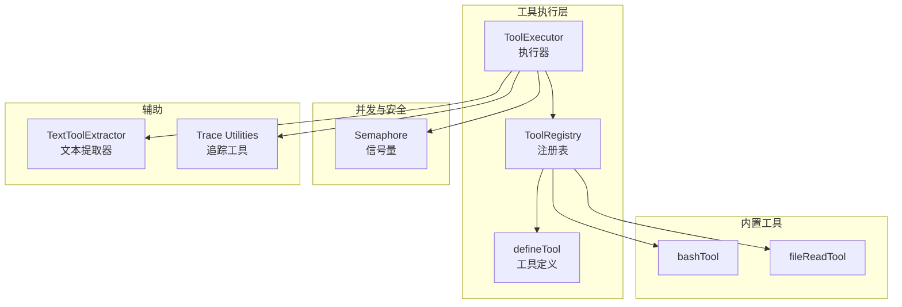
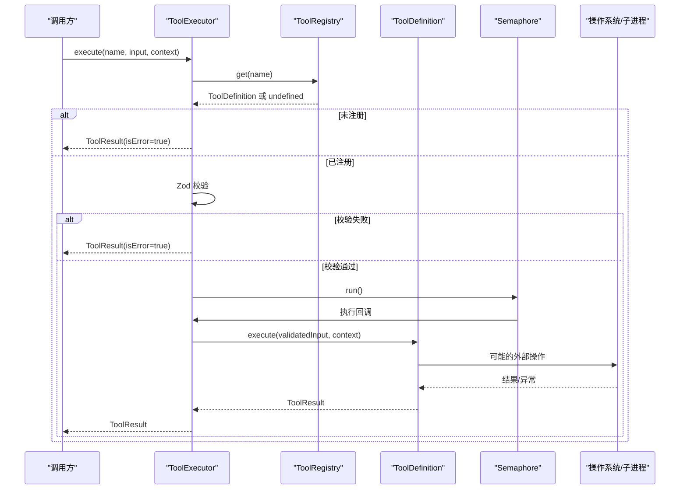
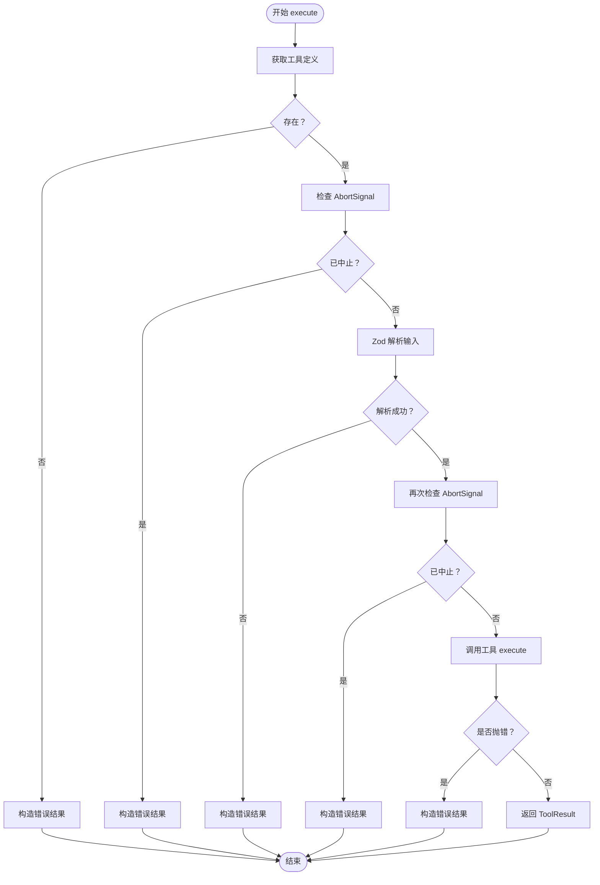
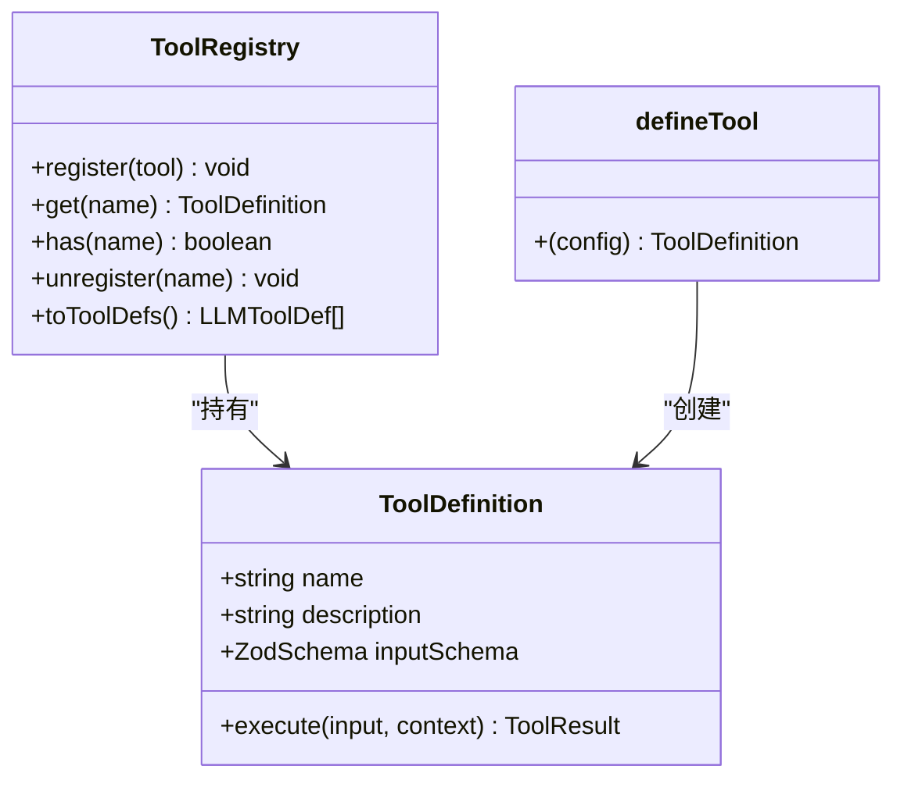
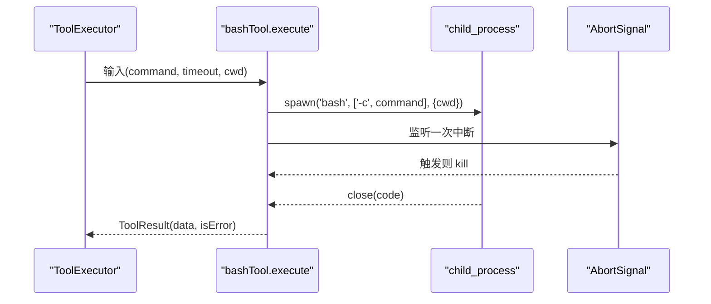
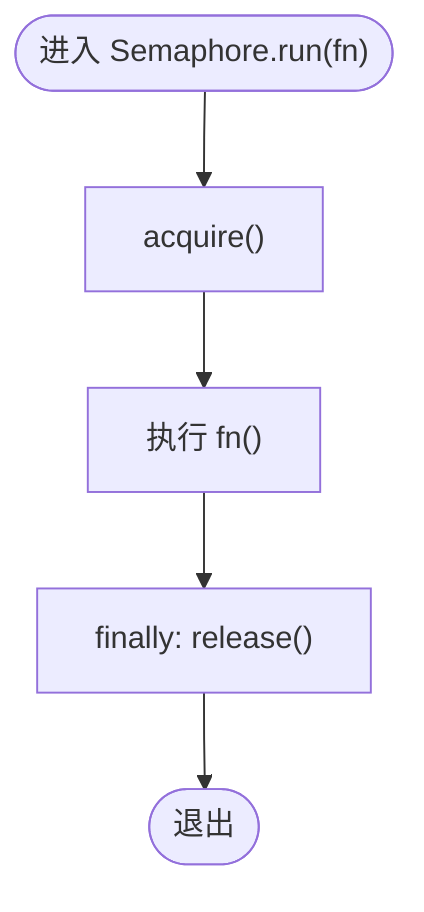
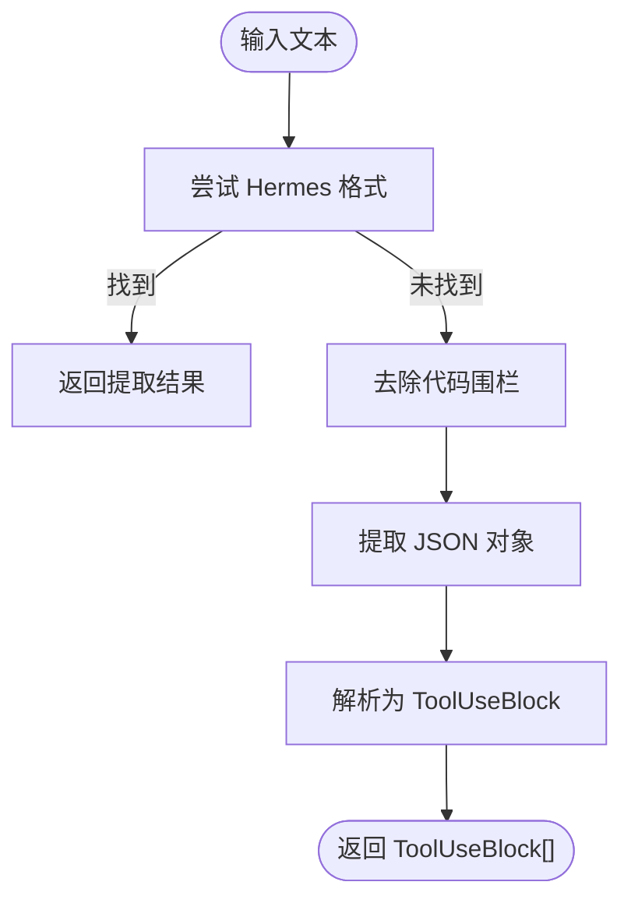
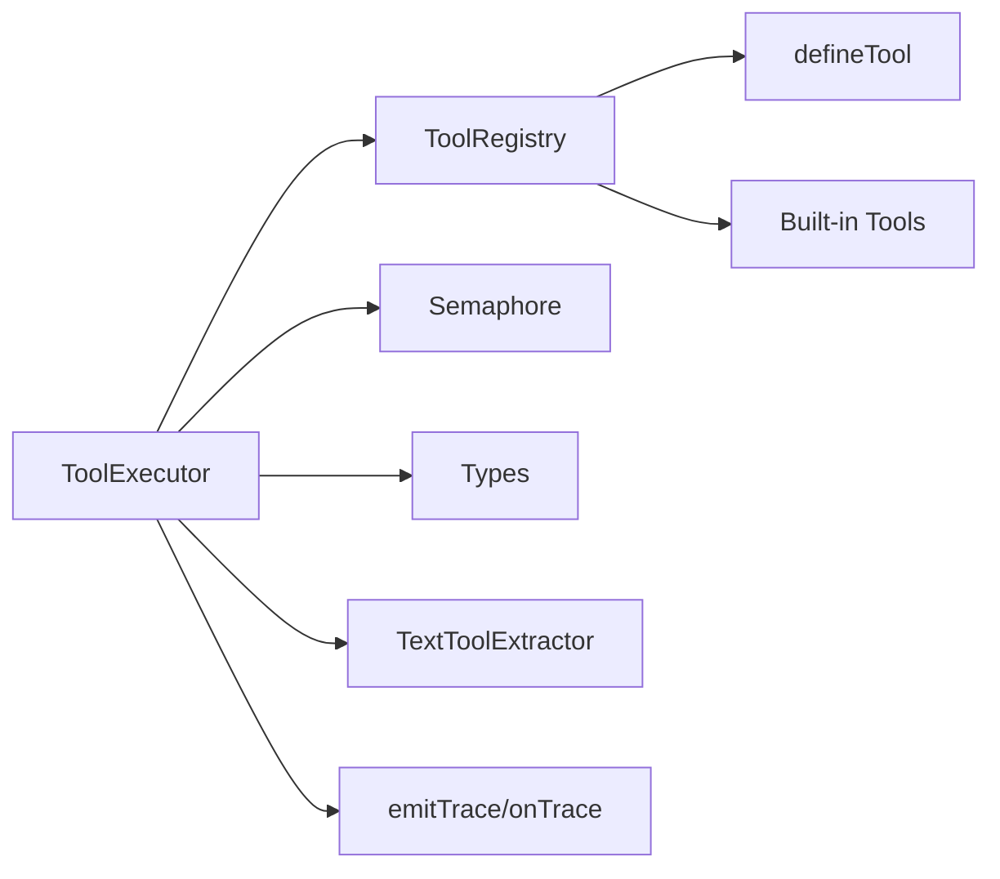

# 工具执行系统

<cite>
**本文引用的文件**
- [src/tool/executor.ts](file://src/tool/executor.ts)
- [src/tool/framework.ts](file://src/tool/framework.ts)
- [src/tool/built-in/index.ts](file://src/tool/built-in/index.ts)
- [src/tool/built-in/bash.ts](file://src/tool/built-in/bash.ts)
- [src/tool/built-in/file-read.ts](file://src/tool/built-in/file-read.ts)
- [src/tool/text-tool-extractor.ts](file://src/tool/text-tool-extractor.ts)
- [src/utils/semaphore.ts](file://src/utils/semaphore.ts)
- [src/utils/trace.ts](file://src/utils/trace.ts)
- [src/types.ts](file://src/types.ts)
- [tests/tool-executor.test.ts](file://tests/tool-executor.test.ts)
- [README.md](file://README.md)
</cite>

## 目录
1. [简介](#简介)
2. [项目结构](#项目结构)
3. [核心组件](#核心组件)
4. [架构总览](#架构总览)
5. [详细组件分析](#详细组件分析)
6. [依赖关系分析](#依赖关系分析)
7. [性能考量](#性能考量)
8. [故障排查指南](#故障排查指南)
9. [结论](#结论)
10. [附录](#附录)

## 简介
本文件面向 Open Multi-Agent 框架中的工具执行系统，系统性阐述 ToolExecutor 的核心能力与生命周期：从工具调用流程、参数验证、执行上下文传递，到批量并发控制、错误隔离、结果封装；并覆盖安全机制（超时控制、资源限制、取消信号）、可观测性（日志、追踪、指标）与调试方法，最后给出最佳实践与常见问题解决方案。目标是帮助开发者在不深入源码的情况下也能正确使用与扩展工具执行能力。

## 项目结构
工具执行系统位于 src/tool 目录下，核心由以下模块组成：
- 执行器：ToolExecutor 负责单次与批量工具调用、并发控制、错误捕获与结果封装
- 框架：defineTool、ToolRegistry 提供工具定义、注册与 JSON Schema 导出
- 内置工具：bash、file_read 等常用工具示例
- 并发控制：Semaphore 提供轻量级计数信号量
- 文本提取：针对本地模型返回纯文本工具调用的提取器
- 类型与追踪：统一的工具类型、执行上下文、追踪事件与发射工具

图表来源
- [src/tool/executor.ts:47-178](file://src/tool/executor.ts#L47-L178)
- [src/tool/framework.ts:71-203](file://src/tool/framework.ts#L71-L203)
- [src/tool/built-in/index.ts:16-50](file://src/tool/built-in/index.ts#L16-L50)
- [src/utils/semaphore.ts:24-89](file://src/utils/semaphore.ts#L24-L89)
- [src/tool/text-tool-extractor.ts:196-219](file://src/tool/text-tool-extractor.ts#L196-L219)
- [src/utils/trace.ts:12-34](file://src/utils/trace.ts#L12-L34)

章节来源
- [src/tool/executor.ts:1-179](file://src/tool/executor.ts#L1-L179)
- [src/tool/framework.ts:1-558](file://src/tool/framework.ts#L1-L558)
- [src/tool/built-in/index.ts:1-51](file://src/tool/built-in/index.ts#L1-L51)
- [src/utils/semaphore.ts:1-90](file://src/utils/semaphore.ts#L1-L90)
- [src/tool/text-tool-extractor.ts:1-220](file://src/tool/text-tool-extractor.ts#L1-L220)
- [src/utils/trace.ts:1-35](file://src/utils/trace.ts#L1-L35)
- [src/types.ts:105-179](file://src/types.ts#L105-L179)

## 核心组件
- ToolExecutor：单次与批量工具执行、并发控制、错误隔离、结果封装
- ToolRegistry：工具注册、查询、导出 LLM 可用的工具定义
- defineTool：声明式工具定义，绑定输入模式与执行函数
- ToolDefinition/ToolResult/ToolUseContext：统一的工具类型与上下文
- Semaphore：无第三方依赖的计数信号量，用于并发上限控制
- TextToolExtractor：从本地模型纯文本输出中提取工具调用
- Trace Utilities：安全地发出追踪事件，避免影响主执行流

章节来源
- [src/tool/executor.ts:47-178](file://src/tool/executor.ts#L47-L178)
- [src/tool/framework.ts:71-203](file://src/tool/framework.ts#L71-L203)
- [src/types.ts:105-179](file://src/types.ts#L105-L179)
- [src/utils/semaphore.ts:24-89](file://src/utils/semaphore.ts#L24-L89)
- [src/tool/text-tool-extractor.ts:196-219](file://src/tool/text-tool-extractor.ts#L196-L219)
- [src/utils/trace.ts:12-34](file://src/utils/trace.ts#L12-L34)

## 架构总览
工具执行系统围绕 ToolExecutor 展开，通过 ToolRegistry 获取已注册工具，借助 Zod Schema 进行参数校验，使用 Semaphore 控制并发，结合 AbortSignal 实现取消与超时控制，最终以 ToolResult 形式返回结果或错误信息。对于本地模型返回纯文本工具调用的情况，TextToolExtractor 提供回退提取能力。

图表来源
- [src/tool/executor.ts:70-169](file://src/tool/executor.ts#L70-L169)
- [src/tool/framework.ts:112-150](file://src/tool/framework.ts#L112-L150)
- [src/utils/semaphore.ts:71-78](file://src/utils/semaphore.ts#L71-L78)

## 详细组件分析

### ToolExecutor：执行器
- 单次执行：根据工具名获取定义，先检查 AbortSignal，再进行 Zod 校验，随后调用工具执行，捕获异常并封装为 ToolResult
- 批量执行：对每个调用使用 Semaphore.run 包裹，确保并发不超过配置上限，返回 Map 映射调用 ID 到结果
- 错误处理：未知工具名、Zod 校验失败、执行抛错均转换为 ToolResult，保证上层可继续对话或重试

图表来源
- [src/tool/executor.ts:70-169](file://src/tool/executor.ts#L70-L169)

章节来源
- [src/tool/executor.ts:47-178](file://src/tool/executor.ts#L47-L178)
- [tests/tool-executor.test.ts:50-157](file://tests/tool-executor.test.ts#L50-L157)

### ToolRegistry 与 defineTool：工具定义与注册
- defineTool：声明工具名称、描述、输入 Zod 模式与执行函数，返回满足 ToolDefinition 接口的对象
- ToolRegistry：注册/查询/注销工具，导出 LLM 可用的工具定义（含 JSON Schema），支持列出所有工具

图表来源
- [src/tool/framework.ts:71-203](file://src/tool/framework.ts#L71-L203)
- [src/types.ts:105-179](file://src/types.ts#L105-L179)

章节来源
- [src/tool/framework.ts:89-203](file://src/tool/framework.ts#L89-L203)
- [src/types.ts:105-179](file://src/types.ts#L105-L179)

### 内置工具：bash 与 file_read
- bashTool：执行 Bash 命令，支持超时、工作目录、AbortSignal 中断；组合 stdout/stderr/exitCode 输出
- fileReadTool：按行读取文件，支持偏移与限制，返回带行号的内容与元信息

图表来源
- [src/tool/built-in/bash.ts:46-153](file://src/tool/built-in/bash.ts#L46-L153)

章节来源
- [src/tool/built-in/bash.ts:22-187](file://src/tool/built-in/bash.ts#L22-L187)
- [src/tool/built-in/file-read.ts:16-105](file://src/tool/built-in/file-read.ts#L16-L105)

### 并发控制：Semaphore
- 经典计数信号量，支持 acquire/release/run，自动在 finally 中释放，避免死锁
- ToolExecutor 使用其 run 包裹每次执行，确保并发不超过 maxConcurrency

图表来源
- [src/utils/semaphore.ts:71-78](file://src/utils/semaphore.ts#L71-L78)

章节来源
- [src/utils/semaphore.ts:24-89](file://src/utils/semaphore.ts#L24-L89)
- [tests/tool-executor.test.ts:130-157](file://tests/tool-executor.test.ts#L130-L157)

### 文本工具提取：TextToolExtractor
- 针对本地模型返回纯文本而非标准 tool_calls 的场景，尝试多种策略提取工具调用
- 支持 Hermes 格式、代码围栏包裹、裸 JSON 对象等

图表来源
- [src/tool/text-tool-extractor.ts:196-219](file://src/tool/text-tool-extractor.ts#L196-L219)

章节来源
- [src/tool/text-tool-extractor.ts:1-220](file://src/tool/text-tool-extractor.ts#L1-L220)

### 执行上下文与类型：ToolUseContext、ToolResult
- ToolUseContext：包含 agent/team 信息、AbortSignal/AbortController、cwd、metadata 等
- ToolResult：data 字段承载字符串化结果，isError 标识是否为错误
- 类型在 types.ts 中集中定义，确保框架内一致性

章节来源
- [src/types.ts:113-179](file://src/types.ts#L113-L179)

## 依赖关系分析
- ToolExecutor 依赖 ToolRegistry、Semaphore、类型定义
- ToolRegistry 依赖 defineTool 与 Zod Schema 转 JSON Schema 工具
- 内置工具通过 defineTool 定义并注册到 ToolRegistry
- TextToolExtractor 作为回退路径，与 ToolExecutor 解耦
- 追踪工具 emitTrace 与 onTrace 回调解耦，不影响执行主路径

图表来源
- [src/tool/executor.ts:12-15](file://src/tool/executor.ts#L12-L15)
- [src/tool/framework.ts:71-203](file://src/tool/framework.ts#L71-L203)
- [src/tool/built-in/index.ts:16-50](file://src/tool/built-in/index.ts#L16-L50)
- [src/utils/trace.ts:12-34](file://src/utils/trace.ts#L12-L34)

章节来源
- [src/tool/executor.ts:1-179](file://src/tool/executor.ts#L1-L179)
- [src/tool/framework.ts:1-558](file://src/tool/framework.ts#L1-L558)
- [src/tool/built-in/index.ts:1-51](file://src/tool/built-in/index.ts#L1-L51)
- [src/utils/trace.ts:1-35](file://src/utils/trace.ts#L1-L35)

## 性能考量
- 并发控制：通过 Semaphore 将并发限制在合理范围，避免资源争用导致的抖动
- 批量执行：executeBatch 并行触发，但受并发上限约束，适合高吞吐场景
- 超时与取消：内置工具（如 bash）支持超时与 AbortSignal，防止长时间阻塞
- I/O 分块：file_read 支持 offset/limit，避免一次性加载大文件造成内存压力
- 追踪开销：emitTrace 在回调内部吞掉异常，避免追踪订阅成为性能瓶颈

章节来源
- [src/utils/semaphore.ts:24-89](file://src/utils/semaphore.ts#L24-L89)
- [src/tool/built-in/bash.ts:46-153](file://src/tool/built-in/bash.ts#L46-L153)
- [src/tool/built-in/file-read.ts:46-105](file://src/tool/built-in/file-read.ts#L46-L105)
- [src/utils/trace.ts:12-34](file://src/utils/trace.ts#L12-L34)

## 故障排查指南
- 未知工具名：execute 返回错误结果，确认工具已在 ToolRegistry 注册
- 参数校验失败：Zod 报错会汇总为错误结果，检查输入字段与类型
- 执行异常：工具内部抛错会被捕获并封装为 ToolResult，查看 data 中的错误信息
- 执行被中止：AbortSignal 触发时返回错误结果，检查调用方是否提前中止
- 并发过高：调整 maxConcurrency，观察队列长度与峰值并发
- 本地模型未返回标准 tool_calls：启用 TextToolExtractor 回退提取
- 超时与卡顿：为长耗时工具设置合理 timeout，或在 AgentConfig 上设置全局超时

章节来源
- [tests/tool-executor.test.ts:57-91](file://tests/tool-executor.test.ts#L57-L91)
- [src/tool/executor.ts:70-169](file://src/tool/executor.ts#L70-L169)
- [src/tool/text-tool-extractor.ts:196-219](file://src/tool/text-tool-extractor.ts#L196-L219)
- [README.md:214-226](file://README.md#L214-L226)

## 结论
工具执行系统以 ToolExecutor 为核心，结合 ToolRegistry、defineTool、Zod Schema 校验与 Semaphore 并发控制，提供了稳定、可扩展且安全的工具执行能力。内置工具展示了超时、取消与输出格式化的最佳实践，文本提取器解决了本地模型的兼容性问题。配合统一的类型与追踪工具，系统在生产环境中具备良好的可观测性与可维护性。

## 附录

### 工具执行生命周期（端到端）
- 准备阶段：注册工具、构建 ToolUseContext（含 agent、team、AbortSignal、cwd、metadata）
- 参数解析：Zod 校验输入，生成结构化参数
- 执行阶段：并发控制下调用工具 execute，支持超时与取消
- 结果阶段：封装为 ToolResult，错误统一处理
- 回退提取：若本地模型返回纯文本，使用 TextToolExtractor 提取工具调用

章节来源
- [src/tool/executor.ts:70-169](file://src/tool/executor.ts#L70-L169)
- [src/tool/framework.ts:71-203](file://src/tool/framework.ts#L71-L203)
- [src/tool/text-tool-extractor.ts:196-219](file://src/tool/text-tool-extractor.ts#L196-L219)
- [src/types.ts:113-179](file://src/types.ts#L113-L179)

### 安全机制清单
- 超时控制：内置工具支持超时，避免长时间阻塞
- 取消信号：AbortSignal 支持一次性监听，及时终止执行
- 并发上限：Semaphore 限制最大并发，防止资源耗尽
- 参数验证：Zod Schema 强约束输入，减少无效调用
- 错误隔离：所有异常转为 ToolResult，不中断上层流程

章节来源
- [src/tool/built-in/bash.ts:46-153](file://src/tool/built-in/bash.ts#L46-L153)
- [src/tool/executor.ts:70-169](file://src/tool/executor.ts#L70-L169)
- [src/utils/semaphore.ts:24-89](file://src/utils/semaphore.ts#L24-L89)

### 监控与调试方法
- 追踪事件：通过 onTrace 订阅 LLM 调用、工具调用、任务与代理运行事件，获取时间戳、令牌用量与持续时间
- 日志与指标：结合 onProgress 与 onTrace，记录工具调用次数、平均耗时、错误率
- 错误诊断：优先查看 ToolResult.data 中的错误信息，定位工具名、参数与执行上下文

章节来源
- [src/utils/trace.ts:12-34](file://src/utils/trace.ts#L12-L34)
- [src/types.ts:417-470](file://src/types.ts#L417-L470)
- [README.md:26-26](file://README.md#L26-L26)

### 最佳实践
- 为每个工具定义清晰的 Zod 输入模式，明确必填字段与默认值
- 在 AgentConfig 上设置合理的 timeoutMs，避免本地模型长时间卡顿
- 使用 registerBuiltInTools 快速注册常用工具，或自定义 defineTool
- 对长耗时工具显式设置超时与 AbortSignal，确保可中断
- 在批量执行时合理设置 maxConcurrency，平衡吞吐与资源占用
- 对于本地模型，启用 TextToolExtractor 作为回退，提升兼容性

章节来源
- [src/tool/built-in/index.ts:46-50](file://src/tool/built-in/index.ts#L46-L50)
- [src/tool/built-in/bash.ts:46-63](file://src/tool/built-in/bash.ts#L46-L63)
- [src/tool/text-tool-extractor.ts:196-219](file://src/tool/text-tool-extractor.ts#L196-L219)
- [README.md:214-226](file://README.md#L214-L226)