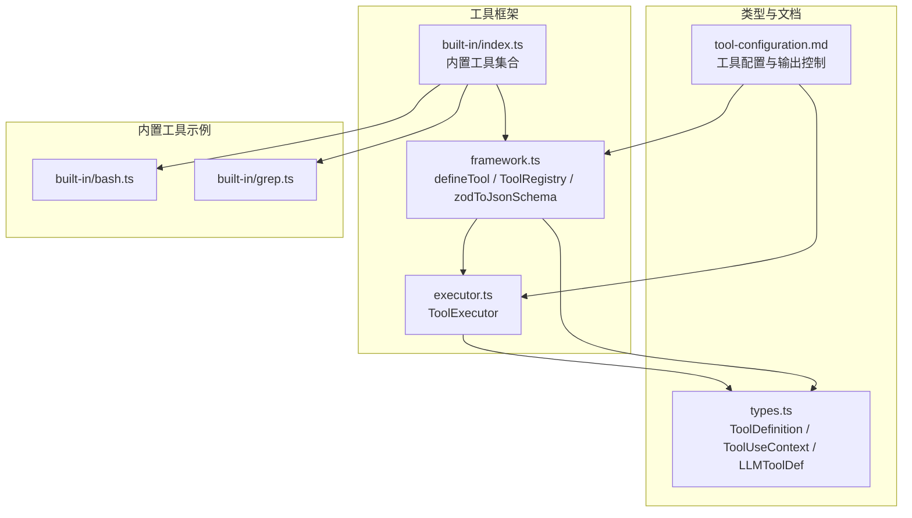
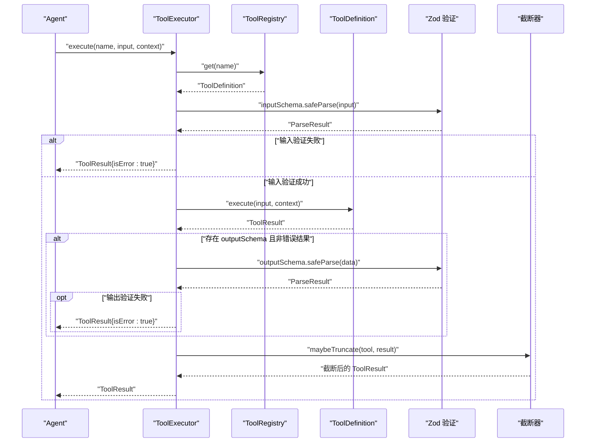
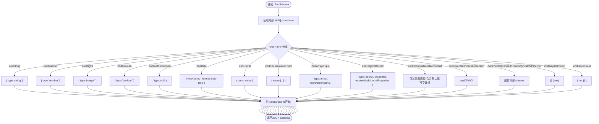
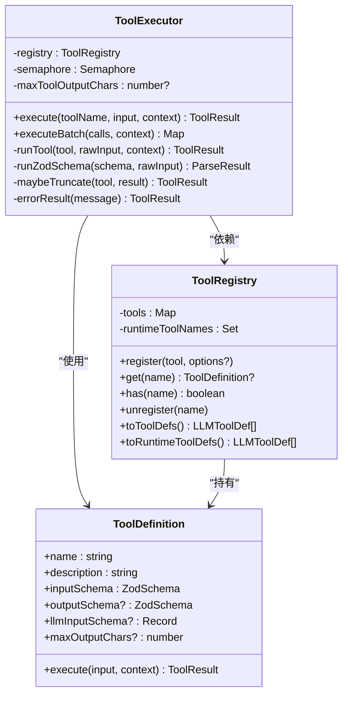

# 工具框架

<cite>
**本文引用的文件列表**
- [src/tool/framework.ts](file://src/tool/framework.ts)
- [src/tool/executor.ts](file://src/tool/executor.ts)
- [src/tool/built-in/index.ts](file://src/tool/built-in/index.ts)
- [src/tool/built-in/bash.ts](file://src/tool/built-in/bash.ts)
- [src/tool/built-in/grep.ts](file://src/tool/built-in/grep.ts)
- [src/types.ts](file://src/types.ts)
- [docs/tool-configuration.md](file://docs/tool-configuration.md)
- [tests/tool-executor.test.ts](file://tests/tool-executor.test.ts)
</cite>

## 目录
1. [简介](#简介)
2. [项目结构](#项目结构)
3. [核心组件](#核心组件)
4. [架构总览](#架构总览)
5. [详细组件分析](#详细组件分析)
6. [依赖关系分析](#依赖关系分析)
7. [性能考量](#性能考量)
8. [故障排查指南](#故障排查指南)
9. [结论](#结论)
10. [附录](#附录)

## 简介
本文件面向 Open Multi-Agent 框架的“工具框架”，系统性阐述以下主题：
- defineTool() 的设计原理与使用方法，涵盖 name、description、inputSchema、outputSchema、llmInputSchema、maxOutputChars 等关键参数
- ToolRegistry 的功能与动态管理能力：注册、查询、注销、运行时工具筛选
- Zod 类型系统与 JSON Schema 的转换机制，以及 zodToJsonSchema() 的实现要点
- 完整工具定义示例与最佳实践
- 工具执行上下文 ToolUseContext 的结构与使用场景

## 项目结构
工具框架位于 src/tool 目录，主要由三部分组成：
- 框架层：defineTool()、ToolRegistry、zodToJsonSchema()
- 执行器层：ToolExecutor（并发控制、输入/输出验证、错误隔离、截断）
- 内置工具集合：bash、grep、文件读写、代理委托等

图表来源
- [src/tool/framework.ts:1-610](file://src/tool/framework.ts#L1-L610)
- [src/tool/executor.ts:1-264](file://src/tool/executor.ts#L1-L264)
- [src/tool/built-in/index.ts:1-75](file://src/tool/built-in/index.ts#L1-L75)
- [src/tool/built-in/bash.ts:1-188](file://src/tool/built-in/bash.ts#L1-L188)
- [src/tool/built-in/grep.ts:1-281](file://src/tool/built-in/grep.ts#L1-L281)
- [src/types.ts:194-328](file://src/types.ts#L194-L328)
- [docs/tool-configuration.md:1-153](file://docs/tool-configuration.md#L1-L153)

章节来源
- [src/tool/framework.ts:1-610](file://src/tool/framework.ts#L1-L610)
- [src/tool/executor.ts:1-264](file://src/tool/executor.ts#L1-L264)
- [src/tool/built-in/index.ts:1-75](file://src/tool/built-in/index.ts#L1-L75)
- [src/types.ts:194-328](file://src/types.ts#L194-L328)
- [docs/tool-configuration.md:1-153](file://docs/tool-configuration.md#L1-L153)

## 核心组件
- defineTool(config)：声明式定义工具，返回满足 ToolDefinition 接口的对象；支持输入/输出模式的 Zod 验证、LLM 输入 JSON Schema 直通、单工具最大输出长度限制
- ToolRegistry：集中管理工具注册、查询、注销、导出 LLM 可消费的工具定义
- zodToJsonSchema(schema)：将 Zod 类型转换为 JSON Schema，用于 LLM API 的输入模式描述
- ToolExecutor：批量并发执行工具调用，负责输入 Zod 验证、输出验证、异常捕获、超时/中止信号、结果截断

章节来源
- [src/tool/framework.ts:71-111](file://src/tool/framework.ts#L71-L111)
- [src/tool/framework.ts:121-254](file://src/tool/framework.ts#L121-L254)
- [src/tool/framework.ts:273-484](file://src/tool/framework.ts#L273-L484)
- [src/tool/executor.ts:54-229](file://src/tool/executor.ts#L54-L229)

## 架构总览
工具框架在运行期的交互路径如下：
- Agent 在推理阶段生成工具调用请求（包含名称与输入），交由 ToolExecutor 解析
- ToolExecutor 通过 ToolRegistry 获取 ToolDefinition，先进行输入 Zod 验证
- 若通过，调用工具 execute，得到 ToolResult
- 若工具设置了 outputSchema，则对 ToolResult.data 进行二次验证
- 最后根据 per-tool 或 agent-level 的 maxOutputChars 对结果进行截断
- 所有异常被捕获为 ToolResult(isError: true)，保证与 LLM 的交互稳定

图表来源
- [src/tool/executor.ts:79-189](file://src/tool/executor.ts#L79-L189)
- [src/tool/framework.ts:147-151](file://src/tool/framework.ts#L147-L151)

## 详细组件分析

### defineTool() 设计与参数详解
- name：工具唯一标识，注册时必须唯一
- description：向 LLM 描述工具用途的自然语言
- inputSchema：ZodSchema，用于解析并校验工具输入；执行前严格校验
- outputSchema：可选，ZodSchema<string>，对 ToolResult.data 进行二次校验（仅当非错误结果时生效）
- llmInputSchema：可选，直接作为 LLM API 的 inputSchema 使用，跳过 Zod → JSON Schema 转换
- maxOutputChars：可选，单工具最大输出字符数，优先于 agent-level 的 maxToolOutputChars
- execute：函数签名 (input, context) => Promise<ToolResult>

最佳实践
- 尽量使用 z.string().regex()/refine() 等约束 outputSchema，确保 LLM 得到结构化文本
- 对外部 MCP 工具，建议直接提供 llmInputSchema 以避免转换误差
- 对可能产生大文本的工具，设置合理的 maxOutputChars，结合压缩策略减少上下文膨胀

章节来源
- [src/tool/framework.ts:71-111](file://src/tool/framework.ts#L71-L111)
- [src/types.ts:304-328](file://src/types.ts#L304-L328)
- [docs/tool-configuration.md:75-126](file://docs/tool-configuration.md#L75-L126)

### ToolRegistry 功能与动态管理
- register(tool, options?)：注册工具，重复名会抛错；支持 runtimeAdded 标记运行时添加的工具
- get(name)/has(name)/list()/getAll()：查询、存在性检查、枚举
- unregister(name)/deregister(name)：注销工具，运行时添加的工具名会被记录以便区分
- toToolDefs()/toRuntimeToolDefs()：导出 LLM 可消费的工具定义数组；后者仅返回运行时新增的工具
- toLLMTools()：导出 Anthropic 风格的 input_schema

注意
- 注册时会优先使用 llmInputSchema（若存在），否则通过 zodToJsonSchema() 转换 inputSchema
- 运行时工具集合可用于团队协作或动态扩展场景

章节来源
- [src/tool/framework.ts:121-254](file://src/tool/framework.ts#L121-L254)

### Zod 类型系统与 JSON Schema 转换机制
- zodToJsonSchema(schema)：递归遍历 Zod 类型，映射到 JSON Schema 结构
- 支持的类型族：字符串、数字、布尔、枚举、数组、元组、对象、可选/可空、联合/判别联合、交叉、字典、字面量、日期、默认值、只读/品牌/管道/捕获等
- 不支持的类型回退为 {}（任意），仍为合法 JSON Schema
- 元数据：描述字段（Zod.describe）会被保留为 JSON Schema 的 description 字段

图表来源
- [src/tool/framework.ts:273-484](file://src/tool/framework.ts#L273-L484)

章节来源
- [src/tool/framework.ts:273-484](file://src/tool/framework.ts#L273-L484)

### ToolUseContext 结构与使用场景
- agent：调用工具的代理信息（名称、角色、模型）
- team：团队上下文（多代理协作时可用，包含共享内存、委托深度、池视图等）
- abortSignal/abortController：中止信号与控制器，便于长耗时工具优雅退出
- cwd：文件系统工具的工作目录提示
- metadata：调用方自定义元数据（如会话ID、请求ID）

使用场景
- 文件/命令类工具：结合 cwd 与 abortSignal 控制工作目录与生命周期
- 多代理委托：通过 team 字段传递链路与容量信息
- 观测与审计：通过 metadata 传递追踪信息

章节来源
- [src/types.ts:214-234](file://src/types.ts#L214-L234)
- [src/types.ts:236-271](file://src/types.ts#L236-L271)

### 工具执行器 ToolExecutor
- 并发控制：基于轻量信号量，限制同时执行的工具数量
- 输入验证：使用 ToolDefinition.inputSchema 对原始输入进行解析
- 输出验证：若定义了 outputSchema 且结果非错误，再对 ToolResult.data 进行二次校验
- 错误隔离：捕获同步/异步异常，统一转化为 ToolResult(isError: true)
- 中止与超时：在解析前后检查 AbortSignal，避免无效计算
- 截断策略：优先 per-tool maxOutputChars，其次 agent-level maxToolOutputChars

图表来源
- [src/tool/executor.ts:54-229](file://src/tool/executor.ts#L54-L229)
- [src/tool/framework.ts:121-254](file://src/tool/framework.ts#L121-L254)
- [src/types.ts:304-328](file://src/types.ts#L304-L328)

章节来源
- [src/tool/executor.ts:54-229](file://src/tool/executor.ts#L54-L229)

### 内置工具与示例
- bashTool：执行 bash 命令，支持超时与工作目录，结合 ToolUseContext.abortSignal 实现中止
- grepTool：在文件中搜索正则表达式，优先使用 ripgrep，回退至纯 Node.js 实现，支持中止与结果上限
- 内置工具集合：提供 registerBuiltInTools() 一键注册常用工具，支持选择是否包含代理委托工具

章节来源
- [src/tool/built-in/index.ts:1-75](file://src/tool/built-in/index.ts#L1-L75)
- [src/tool/built-in/bash.ts:22-63](file://src/tool/built-in/bash.ts#L22-L63)
- [src/tool/built-in/grep.ts:28-100](file://src/tool/built-in/grep.ts#L28-L100)

## 依赖关系分析
- defineTool 返回的 ToolDefinition 引用 ZodSchema，确保输入/输出的类型安全
- ToolRegistry 依赖 defineTool 产出的 ToolDefinition，并在导出给 LLM 时使用 zodToJsonSchema
- ToolExecutor 依赖 ToolRegistry 查询工具定义，执行时对输入/输出进行 Zod 验证
- 内置工具通过 defineTool 定义，再由 registerBuiltInTools 注册到 ToolRegistry

图表来源
- [src/tool/framework.ts:71-111](file://src/tool/framework.ts#L71-L111)
- [src/tool/framework.ts:121-254](file://src/tool/framework.ts#L121-L254)
- [src/tool/executor.ts:54-229](file://src/tool/executor.ts#L54-L229)

章节来源
- [src/tool/framework.ts:71-111](file://src/tool/framework.ts#L71-L111)
- [src/tool/framework.ts:121-254](file://src/tool/framework.ts#L121-L254)
- [src/tool/executor.ts:54-229](file://src/tool/executor.ts#L54-L229)

## 性能考量
- 并发控制：ToolExecutor 默认并发度为 4，可通过构造参数调整，避免资源争用
- 截断策略：对超长输出采用 head + tail + marker 的方式，减少上下文占用
- Zod 转 JSON Schema：仅在导出 LLM 工具定义时发生，通常在初始化阶段完成
- 中止信号：在昂贵操作（如文件扫描、子进程）中及时响应，避免浪费资源

章节来源
- [src/tool/executor.ts:23-34](file://src/tool/executor.ts#L23-L34)
- [src/tool/executor.ts:210-220](file://src/tool/executor.ts#L210-L220)
- [src/tool/framework.ts:198-208](file://src/tool/framework.ts#L198-L208)

## 故障排查指南
常见问题与定位建议
- 工具未注册：ToolExecutor.execute 返回错误结果，提示工具未注册
- 输入校验失败：ToolExecutor 将 Zod 解析错误汇总为人类可读消息
- 工具执行异常：捕获异常并以 ToolResult(isError: true) 返回
- 中止导致提前退出：检查 ToolUseContext.abortSignal 是否被触发
- 输出过大：确认是否设置了 maxOutputChars，必要时开启压缩策略

章节来源
- [src/tool/executor.ts:79-189](file://src/tool/executor.ts#L79-L189)
- [tests/tool-executor.test.ts:89-123](file://tests/tool-executor.test.ts#L89-L123)

## 结论
工具框架通过 defineTool() 提供强类型的工具声明入口，配合 ToolRegistry 的集中管理与导出能力，以及 ToolExecutor 的并发、验证与截断保障，实现了从类型安全到 LLM 友好输出的完整闭环。zodToJsonSchema() 使 Zod 的丰富类型系统无缝对接 LLM 的 JSON Schema 输入模式。内置工具示例展示了如何在真实场景中结合 ToolUseContext 的 abort 与 cwd 等能力，实现稳健的工具执行。

## 附录

### 参数与配置速查
- defineTool
  - name/description/inputSchema 必填
  - outputSchema：对 ToolResult.data 的结构化约束
  - llmInputSchema：覆盖默认转换，直接使用 JSON Schema
  - maxOutputChars：单工具输出上限，优先于 agent-level 设置
- ToolRegistry
  - register/get/has/list/unregister/toToolDefs/toRuntimeToolDefs
- ToolExecutor
  - execute/executeBatch/maxConcurrency/maxToolOutputChars
- ToolUseContext
  - agent/team/abortSignal/abortController/cwd/metadata

章节来源
- [src/tool/framework.ts:71-111](file://src/tool/framework.ts#L71-L111)
- [src/tool/framework.ts:121-254](file://src/tool/framework.ts#L121-L254)
- [src/tool/executor.ts:23-63](file://src/tool/executor.ts#L23-L63)
- [src/types.ts:214-234](file://src/types.ts#L214-L234)