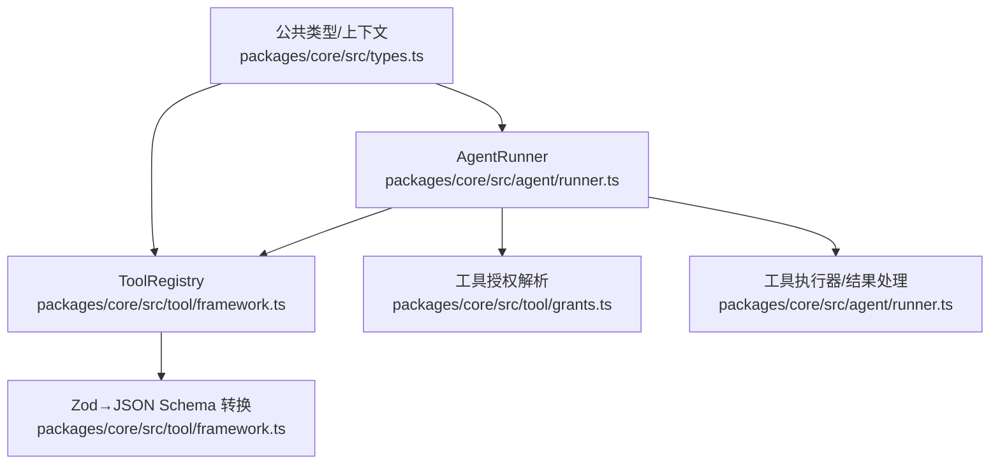
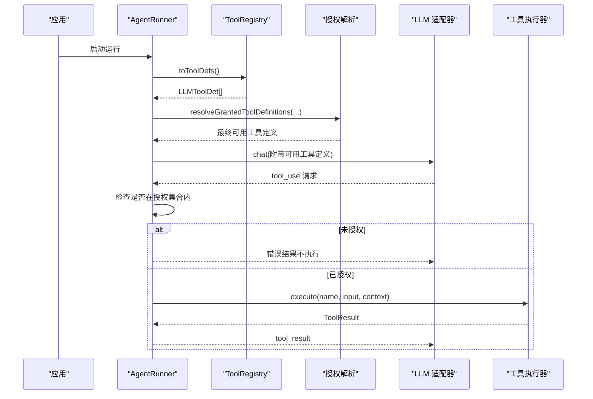
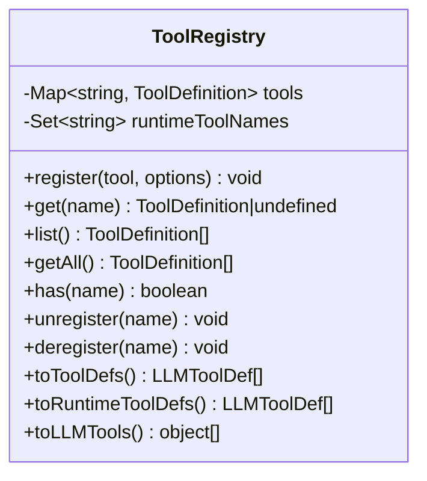
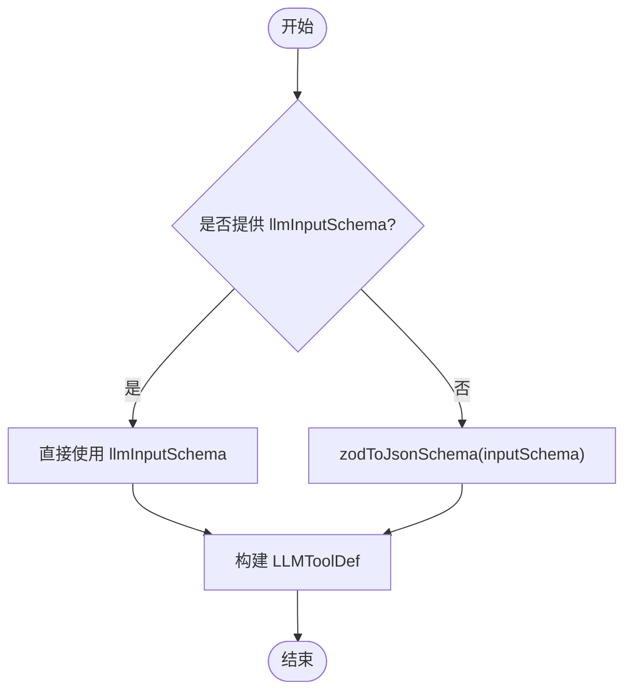
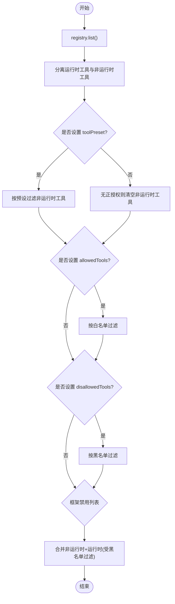
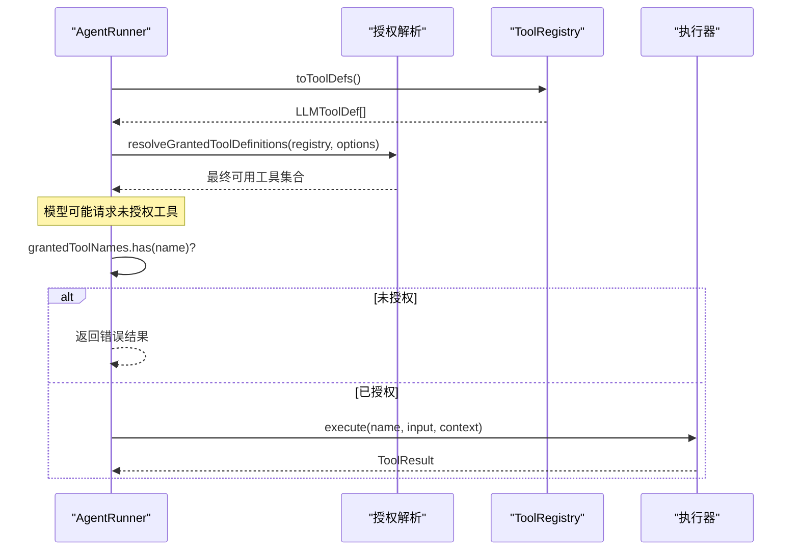
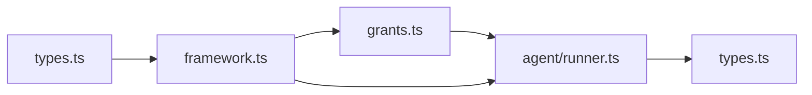

# 工具注册表

<cite>
**本文引用的文件**
- [packages/core/src/tool/framework.ts](file://packages/core/src/tool/framework.ts)
- [packages/core/src/tool/grants.ts](file://packages/core/src/tool/grants.ts)
- [packages/core/src/agent/runner.ts](file://packages/core/src/agent/runner.ts)
- [packages/core/src/types.ts](file://packages/core/src/types.ts)
- [packages/core/src/index.ts](file://packages/core/src/index.ts)
</cite>

## 目录
1. [简介](#简介)
2. [项目结构](#项目结构)
3. [核心组件](#核心组件)
4. [架构总览](#架构总览)
5. [详细组件分析](#详细组件分析)
6. [依赖关系分析](#依赖关系分析)
7. [性能考量](#性能考量)
8. [故障排查指南](#故障排查指南)
9. [结论](#结论)
10. [附录：使用示例与最佳实践](#附录使用示例与最佳实践)

## 简介
本文件系统性介绍 ToolRegistry 类的使用方法与功能特性，覆盖工具的注册、获取、列表查询、生命周期管理（动态添加/移除）、名称唯一性与冲突处理、运行时工具概念、工具到 LLM 格式的转换（toToolDefs 与 toLLMTools 的区别），以及权限控制与安全考虑。文档同时提供高级用法思路（批量注册、条件注册）和完整调用流程的可视化说明，帮助读者在 open-multi-agent 框架中安全、可控地使用工具系统。

## 项目结构
围绕工具注册与执行的关键代码分布在以下模块：
- 工具定义与注册表：packages/core/src/tool/framework.ts
- 工具授权与预设解析：packages/core/src/tool/grants.ts
- 代理运行器与工具调用执行：packages/core/src/agent/runner.ts
- 公共类型与上下文：packages/core/src/types.ts
- 对外导出入口：packages/core/src/index.ts

图表来源
- [packages/core/src/agent/runner.ts:817-827](file://packages/core/src/agent/runner.ts#L817-L827)
- [packages/core/src/tool/framework.ts:127-261](file://packages/core/src/tool/framework.ts#L127-L261)
- [packages/core/src/tool/grants.ts:33-89](file://packages/core/src/tool/grants.ts#L33-L89)
- [packages/core/src/types.ts:511-516](file://packages/core/src/types.ts#L511-L516)

章节来源
- [packages/core/src/tool/framework.ts:127-261](file://packages/core/src/tool/framework.ts#L127-L261)
- [packages/core/src/tool/grants.ts:33-89](file://packages/core/src/tool/grants.ts#L33-L89)
- [packages/core/src/agent/runner.ts:817-827](file://packages/core/src/agent/runner.ts#L817-L827)
- [packages/core/src/types.ts:511-516](file://packages/core/src/types.ts#L511-L516)

## 核心组件
- ToolRegistry：维护已注册工具集合，支持增删查、转换为 LLM 可用格式、区分“运行时工具”。
- defineTool：声明式创建工具定义，包含输入校验 schema、可选输出校验、最大输出长度限制等。
- resolveGrantedToolDefinitions：根据预设、白名单、黑名单与框架级禁用规则，计算当前 Agent 实际可用的工具集。
- AgentRunner：在每次 LLM 调用前解析可用工具，并在执行阶段进行默认拒绝策略的安全门控。

章节来源
- [packages/core/src/tool/framework.ts:71-117](file://packages/core/src/tool/framework.ts#L71-L117)
- [packages/core/src/tool/framework.ts:127-261](file://packages/core/src/tool/framework.ts#L127-L261)
- [packages/core/src/tool/grants.ts:33-89](file://packages/core/src/tool/grants.ts#L33-L89)
- [packages/core/src/agent/runner.ts:817-827](file://packages/core/src/agent/runner.ts#L817-L827)

## 架构总览
下图展示了从工具注册到 LLM 调用的关键路径：AgentRunner 在每轮对话前通过 ToolRegistry 生成 LLM 可见的工具定义，并基于授权策略过滤；模型返回 tool_use 后，Runner 再次校验是否被授权，再交由执行器执行。

图表来源
- [packages/core/src/agent/runner.ts:817-827](file://packages/core/src/agent/runner.ts#L817-L827)
- [packages/core/src/agent/runner.ts:1364-1434](file://packages/core/src/agent/runner.ts#L1364-L1434)
- [packages/core/src/tool/framework.ts:204-261](file://packages/core/src/tool/framework.ts#L204-L261)
- [packages/core/src/tool/grants.ts:33-89](file://packages/core/src/tool/grants.ts#L33-L89)

## 详细组件分析

### ToolRegistry 类
- 职责
  - 维护工具映射（name → ToolDefinition）。
  - 记录“运行时工具”集合，用于区分动态添加的工具。
  - 提供注册、获取、列出、存在性检查、注销等方法。
  - 将工具转换为 LLM 可消费的定义格式。
- 关键方法
  - register(tool, options?)：注册工具，若同名则抛出异常，防止静默覆盖；支持标记 runtimeAdded=true 以纳入运行时工具集合。
  - get(name)：按名获取工具定义。
  - list()/getAll()：返回所有工具定义数组。
  - has(name)：判断是否存在。
  - unregister(name)/deregister(name)：移除工具，同时清理运行时标记。
  - toToolDefs()：将所有工具转为 LLMToolDef[]（name/description/inputSchema）。
  - toRuntimeToolDefs()：仅返回运行时新增的工具定义。
  - toLLMTools()：转换为 Anthropic 风格的 { name, description, input_schema } 数组，内部对 llmInputSchema 或 Zod schema 做适配。
- 名称唯一性与冲突处理
  - 重复名称会直接抛错，确保注册期即发现冲突，避免运行时歧义。
- 运行时工具
  - 通过 register(..., { runtimeAdded: true }) 标记的工具会被单独追踪，可用于审计、限流或差异化展示。

图表来源
- [packages/core/src/tool/framework.ts:127-261](file://packages/core/src/tool/framework.ts#L127-L261)

章节来源
- [packages/core/src/tool/framework.ts:127-261](file://packages/core/src/tool/framework.ts#L127-L261)

### 工具定义与转换：defineTool 与 zodToJsonSchema
- defineTool
  - 统一创建 ToolDefinition，支持 consequential（副作用标记）、outputSchema（输出校验）、llmInputSchema（绕过 Zod→JSON Schema）、maxOutputChars（单工具输出上限）。
- zodToJsonSchema
  - 将 Zod schema 递归转换为 JSON Schema，支持基础类型、对象、数组、联合、可选/默认/可空、枚举、字面量等，未知类型回退为任意类型。

图表来源
- [packages/core/src/tool/framework.ts:204-261](file://packages/core/src/tool/framework.ts#L204-L261)
- [packages/core/src/tool/framework.ts:279-491](file://packages/core/src/tool/framework.ts#L279-L491)

章节来源
- [packages/core/src/tool/framework.ts:71-117](file://packages/core/src/tool/framework.ts#L71-L117)
- [packages/core/src/tool/framework.ts:204-261](file://packages/core/src/tool/framework.ts#L204-L261)
- [packages/core/src/tool/framework.ts:279-491](file://packages/core/src/tool/framework.ts#L279-L491)

### 工具授权与预设：resolveGrantedToolDefinitions
- 作用
  - 基于 toolPreset、allowedTools、disallowedTools 与框架级禁用列表，计算每个 Agent 实际可用的工具集合。
- 优先级与冲突提示
  - 当同时设置 toolPreset 与 allowedTools 时，会给出警告，最终取交集。
  - 当 allowedTools 与 disallowedTools 出现重叠，也会发出警告。
- 运行时工具的特殊处理
  - 运行时工具默认参与可用集合，但同样受 disallowedTools 约束。

图表来源
- [packages/core/src/tool/grants.ts:33-89](file://packages/core/src/tool/grants.ts#L33-L89)

章节来源
- [packages/core/src/tool/grants.ts:33-89](file://packages/core/src/tool/grants.ts#L33-L89)

### 运行期工具调用与默认拒绝策略
- 解析可用工具
  - AgentRunner.resolveTools() 调用 resolveGrantedToolDefinitions 得到最终可用工具，并据此构造 LLM 请求中的工具定义。
- 执行前校验
  - 即使模型尝试调用未在授权集合内的工具，Runner 也会拒绝执行并返回错误结果，实现“默认拒绝”的安全边界。
- 上下文注入
  - 工具执行时注入 ToolUseContext，包括 agent 信息、工作目录、凭据、任务/运行 ID、中止信号等。

图表来源
- [packages/core/src/agent/runner.ts:817-827](file://packages/core/src/agent/runner.ts#L817-L827)
- [packages/core/src/agent/runner.ts:1364-1434](file://packages/core/src/agent/runner.ts#L1364-L1434)

章节来源
- [packages/core/src/agent/runner.ts:817-827](file://packages/core/src/agent/runner.ts#L817-L827)
- [packages/core/src/agent/runner.ts:1364-1434](file://packages/core/src/agent/runner.ts#L1364-L1434)

## 依赖关系分析
- ToolRegistry 依赖 types 中的 ToolDefinition、ToolResult、ToolUseContext、LLMToolDef。
- AgentRunner 依赖 ToolRegistry、授权解析、工具执行与结果处理。
- 授权解析依赖 ToolRegistry 的 list 与 toRuntimeToolDefs，结合预设与黑白名单计算最终集合。
- 对外导出集中在 index.ts，便于上层模块统一引入。

图表来源
- [packages/core/src/index.ts:165-180](file://packages/core/src/index.ts#L165-L180)
- [packages/core/src/tool/framework.ts:127-261](file://packages/core/src/tool/framework.ts#L127-L261)
- [packages/core/src/tool/grants.ts:33-89](file://packages/core/src/tool/grants.ts#L33-L89)
- [packages/core/src/agent/runner.ts:817-827](file://packages/core/src/agent/runner.ts#L817-L827)

章节来源
- [packages/core/src/index.ts:165-180](file://packages/core/src/index.ts#L165-L180)
- [packages/core/src/tool/framework.ts:127-261](file://packages/core/src/tool/framework.ts#L127-L261)
- [packages/core/src/tool/grants.ts:33-89](file://packages/core/src/tool/grants.ts#L33-L89)
- [packages/core/src/agent/runner.ts:817-827](file://packages/core/src/agent/runner.ts#L817-L827)

## 性能考量
- 转换开销
  - toToolDefs/toLLMTools 会在每次 LLM 调用前遍历工具集合并转换 schema。建议缓存工具定义或在会话级别复用。
- 授权解析
  - resolveGrantedToolDefinitions 涉及多次过滤与集合操作，建议在 Agent 初始化时计算一次并复用。
- 运行时工具
  - 频繁动态增减工具会增加 Map/Set 操作成本，应评估变更频率与必要性。
- 输出截断
  - 可通过 maxOutputChars 限制单个工具输出大小，减少传输与序列化开销。

[本节为通用性能建议，不直接分析具体文件]

## 故障排查指南
- 注册冲突
  - 现象：注册同名工具时报错。
  - 原因：ToolRegistry.register 检测到重复名称。
  - 处理：更换工具名或先注销旧工具。
- 工具未被授权
  - 现象：模型发起 tool_use 但返回错误，提示未授予该工具。
  - 原因：不在 resolveGrantedToolDefinitions 的最终集合中。
  - 处理：调整 toolPreset/allowedTools/disallowedTools，或通过 customTools 注册自定义工具（注意仍可能被 disallowedTools 拦截）。
- 运行时工具不可见
  - 现象：toRuntimeToolDefs 为空。
  - 原因：未以 runtimeAdded=true 注册。
  - 处理：重新以运行时标记注册。
- 输出过大
  - 现象：模型收到过长响应或被截断。
  - 处理：在 defineTool 中设置 maxOutputChars，或使用 outputSchema 约束返回结构。

章节来源
- [packages/core/src/tool/framework.ts:137-151](file://packages/core/src/tool/framework.ts#L137-L151)
- [packages/core/src/agent/runner.ts:1391-1403](file://packages/core/src/agent/runner.ts#L1391-L1403)
- [packages/core/src/tool/framework.ts:216-222](file://packages/core/src/tool/framework.ts#L216-L222)
- [packages/core/src/tool/framework.ts:71-117](file://packages/core/src/tool/framework.ts#L71-L117)

## 结论
ToolRegistry 提供了稳定、可扩展的工具管理能力，配合授权解析与默认拒绝策略，实现了“最小权限”与“安全默认”的运行环境。通过 toToolDefs 与 toLLMTools 的灵活转换，既能满足多 LLM 适配器的需求，又能保留对输入 schema 的强类型保障。借助运行时工具能力与 per-call 门控，可在复杂场景中实现细粒度的权限控制与审计。

[本节为总结性内容，不直接分析具体文件]

## 附录：使用示例与最佳实践

- 基本注册与查询
  - 使用 defineTool 创建工具，并通过 ToolRegistry.register 注册。
  - 使用 get/list/has 进行查询与存在性检查。
  - 参考路径：[packages/core/src/tool/framework.ts:71-117](file://packages/core/src/tool/framework.ts#L71-L117)、[packages/core/src/tool/framework.ts:127-197](file://packages/core/src/tool/framework.ts#L127-L197)

- 批量注册
  - 将多个工具定义放入数组，循环调用 register 完成批量注册。
  - 如需区分运行时工具，可为特定工具传入 runtimeAdded=true。
  - 参考路径：[packages/core/src/tool/framework.ts:137-151](file://packages/core/src/tool/framework.ts#L137-L151)

- 条件注册
  - 根据环境变量、配置开关或运行时状态决定是否注册某工具。
  - 可结合授权策略（toolPreset/allowedTools/disallowedTools）进一步限制可见性。
  - 参考路径：[packages/core/src/tool/grants.ts:33-89](file://packages/core/src/tool/grants.ts#L33-L89)

- 运行时工具
  - 使用 runtimeAdded=true 标记动态工具，便于审计与差异化处理。
  - 使用 toRuntimeToolDefs 获取运行时工具列表。
  - 参考路径：[packages/core/src/tool/framework.ts:137-151](file://packages/core/src/tool/framework.ts#L137-L151)、[packages/core/src/tool/framework.ts:216-222](file://packages/core/src/tool/framework.ts#L216-L222)

- 工具到 LLM 格式转换
  - toToolDefs：返回 LLMToolDef[]，适用于大多数 LLM 适配器。
  - toLLMTools：返回 Anthropic 风格 { name, description, input_schema } 数组，内部自动包装为 object 并处理 required。
  - 参考路径：[packages/core/src/tool/framework.ts:204-261](file://packages/core/src/tool/framework.ts#L204-L261)

- 权限控制与安全
  - 使用 toolPreset/allowedTools/disallowedTools 控制可用工具集。
  - 使用 onToolCall 实现 per-call 门控，可在执行前决定 allow/deny/suspend。
  - 使用 credentials 隔离不同 Agent 的密钥，避免跨 Agent 泄露。
  - 使用 cwd 限制文件系统工具的工作目录，实现沙箱化。
  - 参考路径：
    - [packages/core/src/tool/grants.ts:33-89](file://packages/core/src/tool/grants.ts#L33-L89)
    - [packages/core/src/types.ts:592-618](file://packages/core/src/types.ts#L592-L618)
    - [packages/core/src/types.ts:547-582](file://packages/core/src/types.ts#L547-L582)
    - [packages/core/src/agent/runner.ts:1391-1403](file://packages/core/src/agent/runner.ts#L1391-L1403)

- 对外导出
  - 通过 index.ts 统一暴露 defineTool、ToolRegistry、zodToJsonSchema 及内置工具等。
  - 参考路径：[packages/core/src/index.ts:165-180](file://packages/core/src/index.ts#L165-L180)