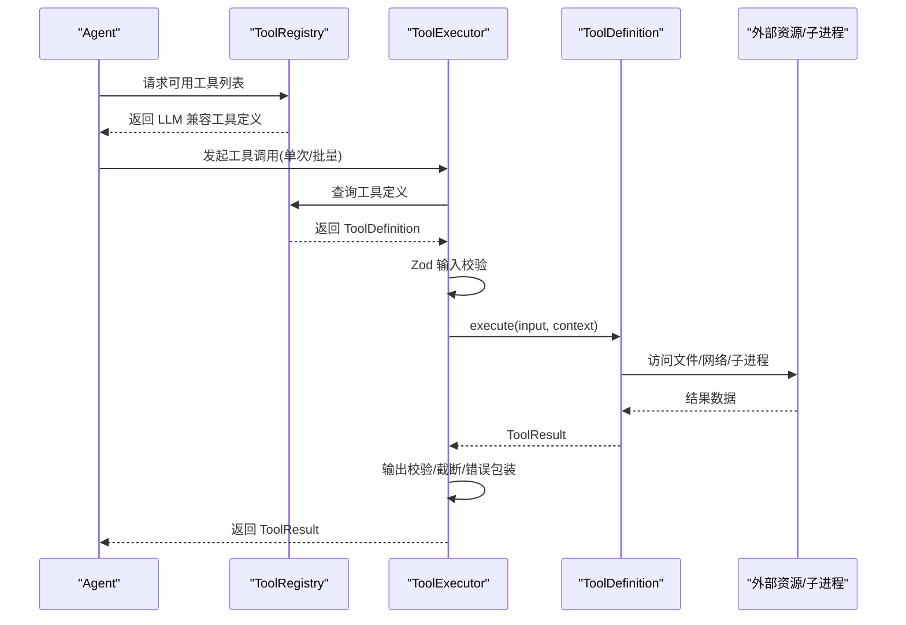
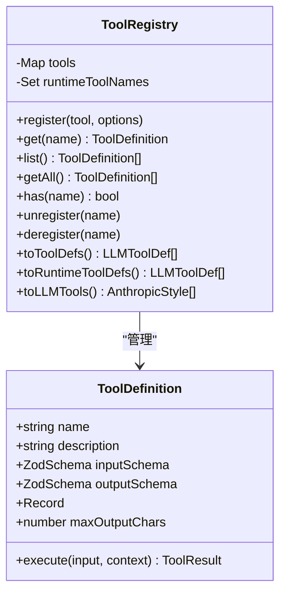
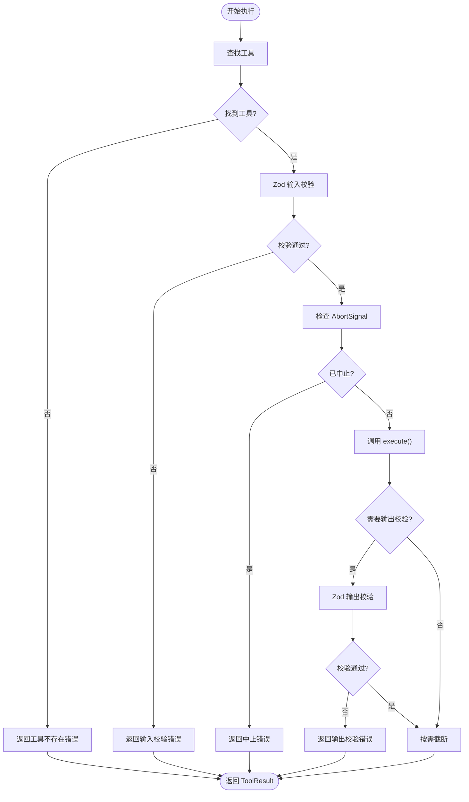
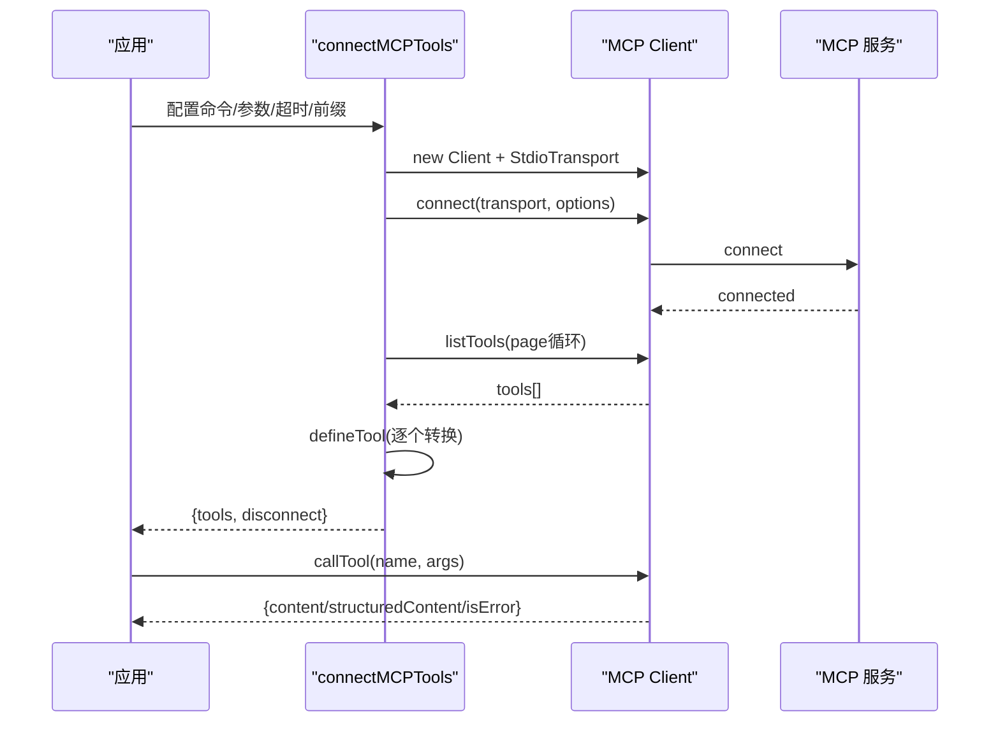
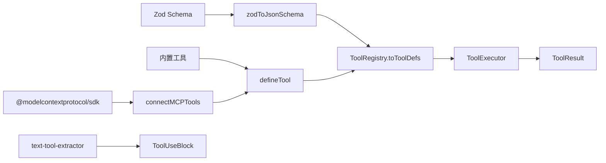

# 工具系统

<cite>
**本文引用的文件**
- [src/tool/framework.ts](file://src/tool/framework.ts)
- [src/tool/executor.ts](file://src/tool/executor.ts)
- [src/tool/built-in/index.ts](file://src/tool/built-in/index.ts)
- [src/tool/built-in/bash.ts](file://src/tool/built-in/bash.ts)
- [src/tool/built-in/file-read.ts](file://src/tool/built-in/file-read.ts)
- [src/tool/built-in/file-write.ts](file://src/tool/built-in/file-write.ts)
- [src/tool/built-in/file-edit.ts](file://src/tool/built-in/file-edit.ts)
- [src/tool/built-in/glob.ts](file://src/tool/built-in/glob.ts)
- [src/tool/built-in/grep.ts](file://src/tool/built-in/grep.ts)
- [src/tool/built-in/fs-walk.ts](file://src/tool/built-in/fs-walk.ts)
- [src/tool/built-in/delegate.ts](file://src/tool/built-in/delegate.ts)
- [src/tool/mcp.ts](file://src/tool/mcp.ts)
- [src/tool/text-tool-extractor.ts](file://src/tool/text-tool-extractor.ts)
- [src/types.ts](file://src/types.ts)
- [tests/built-in-tools.test.ts](file://tests/built-in-tools.test.ts)
- [examples/integrations/mcp-github.ts](file://examples/integrations/mcp-github.ts)
</cite>

## 目录
1. [简介](#简介)
2. [项目结构](#项目结构)
3. [核心组件](#核心组件)
4. [架构总览](#架构总览)
5. [详细组件分析](#详细组件分析)
6. [依赖关系分析](#依赖关系分析)
7. [性能考量](#性能考量)
8. [故障排查指南](#故障排查指南)
9. [结论](#结论)
10. [附录](#附录)

## 简介
本文件系统性阐述 Open Multi-Agent 框架的工具系统设计与执行机制，覆盖以下要点：
- 工具系统整体架构：defineTool 定义、ToolRegistry 注册、ToolExecutor 执行、MCP 集成。
- 内置工具集：bash、file_read、file_write、file_edit、grep、glob、delegate_to_agent 的功能与使用方法。
- 自定义工具开发：Zod 类型验证、参数定义、结果处理与输出截断。
- MCP（Model Context Protocol）工具集成：连接方式、工具发现、参数映射与结果聚合。
- 工具执行生命周期：工具发现、参数解析、执行调度、并发控制、结果聚合与错误处理。
- 性能优化与安全注意事项。
- 丰富的使用示例路径与测试参考。

## 项目结构
工具系统位于 src/tool 目录，按“框架层 + 执行层 + 内置工具 + MCP + 文本提取器”的层次组织：
- 框架层：defineTool、ToolRegistry、Zod 到 JSON Schema 转换。
- 执行层：ToolExecutor 并发控制、批量执行、输入/输出校验、超长结果截断。
- 内置工具：bash、file_*、grep、glob、delegate_to_agent。
- MCP：连接 MCP 服务、工具发现、参数与结果桥接。
- 文本提取器：从本地模型文本中提取工具调用（fallback）。

```mermaid
graph TB
subgraph "工具框架"
FW["framework.ts<br/>defineTool / ToolRegistry / zodToJsonSchema"]
end
subgraph "执行器"
EX["executor.ts<br/>ToolExecutor / 并发/截断/错误隔离"]
end
subgraph "内置工具"
BI["built-in/index.ts<br/>注册内置工具集合"]
BASH["built-in/bash.ts"]
READ["built-in/file-read.ts"]
WRITE["built-in/file-write.ts"]
EDIT["built-in/file-edit.ts"]
GLOB["built-in/glob.ts"]
GREP["built-in/grep.ts"]
FS["built-in/fs-walk.ts"]
DELEG["built-in/delegate.ts"]
end
subgraph "MCP"
MCP["mcp.ts<br/>connectMCPTools / 工具桥接"]
end
subgraph "辅助"
TTE["text-tool-extractor.ts<br/>本地模型文本提取"]
end
FW --> BI
BI --> BASH
BI --> READ
BI --> WRITE
BI --> EDIT
BI --> GLOB
BI --> GREP
BI --> DELEG
GLOB --> FS
GREP --> FS
FW --> EX
MCP --> FW
TTE --> FW
```

图示来源
- [src/tool/framework.ts:1-610](file://src/tool/framework.ts#L1-L610)
- [src/tool/executor.ts:1-264](file://src/tool/executor.ts#L1-L264)
- [src/tool/built-in/index.ts:1-75](file://src/tool/built-in/index.ts#L1-L75)
- [src/tool/built-in/bash.ts:1-188](file://src/tool/built-in/bash.ts#L1-L188)
- [src/tool/built-in/file-read.ts:1-106](file://src/tool/built-in/file-read.ts#L1-L106)
- [src/tool/built-in/file-write.ts:1-82](file://src/tool/built-in/file-write.ts#L1-L82)
- [src/tool/built-in/file-edit.ts:1-155](file://src/tool/built-in/file-edit.ts#L1-L155)
- [src/tool/built-in/glob.ts:1-100](file://src/tool/built-in/glob.ts#L1-L100)
- [src/tool/built-in/grep.ts:1-281](file://src/tool/built-in/grep.ts#L1-L281)
- [src/tool/built-in/fs-walk.ts:1-98](file://src/tool/built-in/fs-walk.ts#L1-L98)
- [src/tool/built-in/delegate.ts:1-110](file://src/tool/built-in/delegate.ts#L1-L110)
- [src/tool/mcp.ts:1-297](file://src/tool/mcp.ts#L1-L297)
- [src/tool/text-tool-extractor.ts:1-227](file://src/tool/text-tool-extractor.ts#L1-L227)

章节来源
- [src/tool/framework.ts:1-610](file://src/tool/framework.ts#L1-L610)
- [src/tool/executor.ts:1-264](file://src/tool/executor.ts#L1-L264)
- [src/tool/built-in/index.ts:1-75](file://src/tool/built-in/index.ts#L1-L75)

## 核心组件
- defineTool：声明式定义工具，提供名称、描述、输入/输出 Zod 模式、可选 LLM 输入模式与最大输出字符数，并绑定 execute 回调。
- ToolRegistry：工具注册表，支持注册/查询/注销、导出 LLM 可用的工具定义、运行时动态工具筛选。
- ToolExecutor：并发执行器，负责批量执行、输入 Zod 校验、输出校验、超长结果截断、AbortSignal 中断、异常捕获为 ToolResult。
- 内置工具集合：统一注册入口，包含 bash、file_read、file_write、file_edit、grep、glob、delegate_to_agent。
- MCP 工具桥接：连接 MCP 服务器，自动发现工具、生成 LLM 输入模式、封装调用与结果转换。
- 文本工具提取器：在本地模型未返回标准 tool_calls 时，从纯文本中提取工具调用（Hermes、JSON、代码块等）。

章节来源
- [src/tool/framework.ts:51-111](file://src/tool/framework.ts#L51-L111)
- [src/tool/framework.ts:121-254](file://src/tool/framework.ts#L121-L254)
- [src/tool/executor.ts:54-130](file://src/tool/executor.ts#L54-L130)
- [src/tool/built-in/index.ts:64-75](file://src/tool/built-in/index.ts#L64-L75)
- [src/tool/mcp.ts:230-296](file://src/tool/mcp.ts#L230-L296)
- [src/tool/text-tool-extractor.ts:203-226](file://src/tool/text-tool-extractor.ts#L203-L226)

## 架构总览
工具系统以“定义-注册-执行-反馈”为主线，结合并发控制与错误隔离，确保在多 Agent 场景下的稳定与可控。



图示来源
- [src/tool/executor.ts:147-189](file://src/tool/executor.ts#L147-L189)
- [src/tool/framework.ts:121-254](file://src/tool/framework.ts#L121-L254)
- [src/types.ts:286-328](file://src/types.ts#L286-L328)

## 详细组件分析

### defineTool 与 ToolRegistry
- defineTool 提供强类型工具定义，支持：
  - name/description：工具标识与说明。
  - inputSchema：Zod 输入模式，用于运行前校验。
  - outputSchema：可选输出模式，对 ToolResult.data 进行二次校验。
  - llmInputSchema：可选直接提供给 LLM 的 JSON Schema，绕过 Zod 转换。
  - maxOutputChars：单工具最大输出字符数，优先于代理级限制。
  - execute：实际执行逻辑，返回 ToolResult。
- ToolRegistry 支持：
  - register/get/list/has/unregister/deregister。
  - toToolDefs/toLLMTools 导出 LLM 适配格式。
  - toRuntimeToolDefs 仅导出运行时新增工具。
  - zodToJsonSchema 将 Zod 模式转换为 JSON Schema，覆盖常用类型。



图示来源
- [src/tool/framework.ts:304-328](file://src/tool/framework.ts#L304-L328)
- [src/tool/framework.ts:121-254](file://src/tool/framework.ts#L121-L254)

章节来源
- [src/tool/framework.ts:71-111](file://src/tool/framework.ts#L71-L111)
- [src/tool/framework.ts:121-254](file://src/tool/framework.ts#L121-L254)

### ToolExecutor 并发执行与生命周期
- 单次执行：根据 ToolRegistry 查找工具，先检查 AbortSignal，再进行 Zod 输入校验，随后调用 execute，必要时进行输出校验与截断，异常捕获为 ToolResult。
- 批量执行：基于轻量信号量控制并发度，默认并发 4；每个调用独立映射到结果 Map。
- 截断策略：按 7:3 头尾截断，保留标记说明移除字符数，避免超出预算。
- 错误处理：未知工具名、输入/输出校验失败、执行异常均转为 isError: true 的 ToolResult，便于回传给 LLM。



图示来源
- [src/tool/executor.ts:147-189](file://src/tool/executor.ts#L147-L189)
- [src/tool/executor.ts:210-229](file://src/tool/executor.ts#L210-L229)

章节来源
- [src/tool/executor.ts:54-130](file://src/tool/executor.ts#L54-L130)
- [src/tool/executor.ts:147-189](file://src/tool/executor.ts#L147-L189)
- [src/tool/executor.ts:235-263](file://src/tool/executor.ts#L235-L263)

### 内置工具集详解

#### bash 工具
- 功能：在非交互式 shell 中执行命令，支持超时与工作目录。
- 关键点：捕获 stdout/stderr/exitCode，组合输出；支持 AbortSignal 中止；超时强制 SIGKILL。
- 使用建议：长任务设置合理 timeout；cwd 指向可信路径；注意权限与环境变量。

章节来源
- [src/tool/built-in/bash.ts:22-63](file://src/tool/built-in/bash.ts#L22-L63)
- [src/tool/built-in/bash.ts:84-153](file://src/tool/built-in/bash.ts#L84-L153)
- [src/tool/built-in/bash.ts:161-187](file://src/tool/built-in/bash.ts#L161-L187)

#### file_read 工具
- 功能：读取文件内容并带行号输出；支持 offset/limit 分页读取大文件。
- 关键点：1 基线行号；越界返回错误；分片读取避免上下文窗口溢出。

章节来源
- [src/tool/built-in/file-read.ts:16-104](file://src/tool/built-in/file-read.ts#L16-L104)

#### file_write 工具
- 功能：创建或覆盖文件，自动创建父目录；统计行数与字节数。
- 关键点：绝对路径要求；写入异常转错误；区分新建/更新。

章节来源
- [src/tool/built-in/file-write.ts:17-80](file://src/tool/built-in/file-write.ts#L17-L80)

#### file_edit 工具
- 功能：在现有文件内进行精确字符串替换；默认要求唯一匹配，可选 replace_all。
- 关键点：严格匹配（含空白与换行）；计数与替换实现避免正则风险。

章节来源
- [src/tool/built-in/file-edit.ts:17-111](file://src/tool/built-in/file-edit.ts#L17-L111)
- [src/tool/built-in/file-edit.ts:123-154](file://src/tool/built-in/file-edit.ts#L123-L154)

#### glob 工具
- 功能：列出目录下匹配 glob 的文件路径；不读取内容；支持 maxFiles 截断。
- 关键点：跳过常见大型目录；相对路径输出；支持单文件路径匹配。

章节来源
- [src/tool/built-in/glob.ts:17-98](file://src/tool/built-in/glob.ts#L17-L98)
- [src/tool/built-in/fs-walk.ts:31-97](file://src/tool/built-in/fs-walk.ts#L31-L97)

#### grep 工具
- 功能：在文件中搜索正则表达式；优先使用 ripgrep，否则回退 Node 实现。
- 关键点：maxResults 截断；支持 glob 过滤；AbortSignal 支持；错误信息区分“无匹配/不可访问”。

章节来源
- [src/tool/built-in/grep.ts:28-99](file://src/tool/built-in/grep.ts#L28-L99)
- [src/tool/built-in/grep.ts:112-181](file://src/tool/built-in/grep.ts#L112-L181)
- [src/tool/built-in/grep.ts:194-261](file://src/tool/built-in/grep.ts#L194-L261)
- [src/tool/built-in/grep.ts:270-280](file://src/tool/built-in/grep.ts#L270-L280)

#### delegate_to_agent 工具
- 功能：在团队协作中同步委托给另一 Agent 执行子任务并返回最终输出。
- 关键点：仅在池化编排运行时可用；防环检测、深度限制、并发槽位检查；共享内存审计键去重。

章节来源
- [src/tool/built-in/delegate.ts:24-109](file://src/tool/built-in/delegate.ts#L24-L109)

### MCP 工具集成
- 连接流程：加载 @modelcontextprotocol/sdk，构造 StdioClientTransport，建立连接，分页拉取 tools/list，逐个转换为 defineTool 工具。
- 参数映射：MCP 工具输入模式直接透传给 LLM；工具名规范化（斜杠替换为下划线，可加前缀）。
- 结果聚合：将 MCP 返回的 content/structuredContent 统一序列化为字符串；错误包装为 isError: true 的 ToolResult。
- 断开连接：提供 disconnect 回调，关闭客户端。



图示来源
- [src/tool/mcp.ts:230-296](file://src/tool/mcp.ts#L230-L296)
- [src/tool/mcp.ts:206-224](file://src/tool/mcp.ts#L206-L224)
- [src/tool/mcp.ts:258-287](file://src/tool/mcp.ts#L258-L287)
- [examples/integrations/mcp-github.ts:24-32](file://examples/integrations/mcp-github.ts#L24-L32)

章节来源
- [src/tool/mcp.ts:69-88](file://src/tool/mcp.ts#L69-L88)
- [src/tool/mcp.ts:230-296](file://src/tool/mcp.ts#L230-L296)
- [examples/integrations/mcp-github.ts:1-60](file://examples/integrations/mcp-github.ts#L1-L60)

### 文本工具提取器（本地模型回退）
- 适用场景：本地模型未返回标准 tool_calls，而是在文本中夹带 JSON 或特殊标记。
- 提取策略：优先 Hermes 标记，其次去除代码块后提取 JSON 对象，最后解析为 ToolUseBlock。
- 白名单过滤：仅当 name 属于已知工具集时才视为有效调用。

章节来源
- [src/tool/text-tool-extractor.ts:203-226](file://src/tool/text-tool-extractor.ts#L203-L226)

## 依赖关系分析
- defineTool 与 ToolRegistry：工具定义与注册的核心契约，zodToJsonSchema 作为 Zod 到 JSON Schema 的桥梁。
- ToolExecutor 依赖 ToolRegistry 与 Zod 校验，内部使用轻量信号量控制并发。
- 内置工具依赖 framework.ts 的 defineTool，部分工具复用 fs-walk 的递归遍历与 glob 匹配。
- MCP 工具桥接依赖 @modelcontextprotocol/sdk，动态加载模块，连接 stdio 传输。
- 文本提取器独立于框架，但与 ToolUseBlock 类型一致，便于注入到消息流。



图示来源
- [src/tool/framework.ts:273-485](file://src/tool/framework.ts#L273-L485)
- [src/tool/executor.ts:54-130](file://src/tool/executor.ts#L54-L130)
- [src/tool/built-in/index.ts:64-75](file://src/tool/built-in/index.ts#L64-L75)
- [src/tool/mcp.ts:57-67](file://src/tool/mcp.ts#L57-L67)
- [src/tool/text-tool-extractor.ts:203-226](file://src/tool/text-tool-extractor.ts#L203-L226)

章节来源
- [src/tool/framework.ts:273-485](file://src/tool/framework.ts#L273-L485)
- [src/tool/executor.ts:54-130](file://src/tool/executor.ts#L54-L130)
- [src/tool/built-in/fs-walk.ts:31-97](file://src/tool/built-in/fs-walk.ts#L31-L97)
- [src/tool/mcp.ts:57-67](file://src/tool/mcp.ts#L57-L67)

## 性能考量
- 并发控制：ToolExecutor 默认并发 4，可通过构造函数参数调整；批量执行时通过信号量限制同时运行的工具数量，避免资源争用。
- I/O 优化：grep 优先使用 ripgrep，回退 Node 实现；glob 与 grep 共享 fs-walk，减少重复遍历。
- 输出截断：超过字符上限时采用头尾截断并保留标记，避免 LLM 上下文溢出。
- 超时与中止：bash、grep、ripgrep 均支持 AbortSignal，可在长时间任务中快速释放资源。
- 缓存与复用：ripgrep 可用性探测结果按进程缓存，避免重复探测开销。

章节来源
- [src/tool/executor.ts:23-34](file://src/tool/executor.ts#L23-L34)
- [src/tool/executor.ts:210-229](file://src/tool/executor.ts#L210-L229)
- [src/tool/built-in/grep.ts:270-280](file://src/tool/built-in/grep.ts#L270-L280)
- [src/tool/built-in/bash.ts:102-137](file://src/tool/built-in/bash.ts#L102-L137)
- [src/tool/built-in/grep.ts:137-181](file://src/tool/built-in/grep.ts#L137-L181)

## 故障排查指南
- 工具未注册：ToolExecutor 返回“工具未注册”错误；检查 ToolRegistry 是否正确注册。
- 输入校验失败：查看 issuesMessage 汇总，修正字段类型/必填项。
- 输出校验失败：若配置了 outputSchema，请确认 execute 返回的 data 符合约束。
- 执行异常：execute 抛出的错误会被捕获并包装为 ToolResult，isError: true；检查日志与上下文。
- 中止/超时：AbortSignal 触发或超时导致提前结束；适当提高 timeout 或优化工具实现。
- MCP 连接失败：检查命令/参数、环境变量、@modelcontextprotocol/sdk 是否安装；确认服务端可达。
- 本地模型文本工具调用：启用 text-tool-extractor 并确保已注册工具名白名单。

章节来源
- [src/tool/executor.ts:83-98](file://src/tool/executor.ts#L83-L98)
- [src/tool/executor.ts:154-158](file://src/tool/executor.ts#L154-L158)
- [src/tool/executor.ts:170-188](file://src/tool/executor.ts#L170-L188)
- [src/tool/mcp.ts:254-256](file://src/tool/mcp.ts#L254-L256)
- [src/tool/text-tool-extractor.ts:203-226](file://src/tool/text-tool-extractor.ts#L203-L226)

## 结论
该工具系统以 defineTool 为核心，配合 ToolRegistry 与 ToolExecutor，实现了类型安全、并发可控、错误隔离与结果聚合的完整链路。内置工具覆盖文件系统、搜索与团队委托等关键能力；MCP 集成提供了与外部工具生态的无缝对接。通过 Zod 模式与可选输出校验，系统在保证安全性的同时兼顾灵活性。建议在生产环境中合理设置并发与输出截断，关注 MCP 服务稳定性与本地模型文本提取策略。

## 附录

### 如何创建自定义工具（defineTool）
- 步骤概览
  - 使用 defineTool 声明工具：提供 name、description、inputSchema（Zod）、execute 回调。
  - 可选：outputSchema（对 ToolResult.data 进行二次校验）、llmInputSchema（直传给 LLM 的 JSON Schema）、maxOutputChars（单工具输出上限）。
  - 将工具注册到 ToolRegistry，供 Agent 使用。
- 示例路径
  - 自定义工具定义与注册：[src/tool/framework.ts:71-111](file://src/tool/framework.ts#L71-L111)，[src/tool/framework.ts:131-145](file://src/tool/framework.ts#L131-L145)
  - 注册内置工具集合：[src/tool/built-in/index.ts:64-75](file://src/tool/built-in/index.ts#L64-L75)

章节来源
- [src/tool/framework.ts:71-111](file://src/tool/framework.ts#L71-L111)
- [src/tool/built-in/index.ts:64-75](file://src/tool/built-in/index.ts#L64-L75)

### 内置工具使用示例路径
- bash：执行命令、捕获输出与退出码
  - 示例路径：[src/tool/built-in/bash.ts:22-63](file://src/tool/built-in/bash.ts#L22-L63)
  - 测试用例：[tests/built-in-tools.test.ts:271-320](file://tests/built-in-tools.test.ts#L271-L320)
- file_read：读取文件并分页
  - 示例路径：[src/tool/built-in/file-read.ts:16-104](file://src/tool/built-in/file-read.ts#L16-L104)
  - 测试用例：[tests/built-in-tools.test.ts:71-133](file://tests/built-in-tools.test.ts#L71-L133)
- file_write：创建/覆盖文件并统计
  - 示例路径：[src/tool/built-in/file-write.ts:17-80](file://src/tool/built-in/file-write.ts#L17-L80)
  - 测试用例：[tests/built-in-tools.test.ts:139-192](file://tests/built-in-tools.test.ts#L139-L192)
- file_edit：精确字符串替换
  - 示例路径：[src/tool/built-in/file-edit.ts:17-111](file://src/tool/built-in/file-edit.ts#L17-L111)
  - 测试用例：[tests/built-in-tools.test.ts:198-265](file://tests/built-in-tools.test.ts#L198-L265)
- glob：列出匹配文件路径
  - 示例路径：[src/tool/built-in/glob.ts:17-98](file://src/tool/built-in/glob.ts#L17-L98)
  - 测试用例：[tests/built-in-tools.test.ts:326-416](file://tests/built-in-tools.test.ts#L326-L416)
- grep：搜索正则表达式
  - 示例路径：[src/tool/built-in/grep.ts:28-99](file://src/tool/built-in/grep.ts#L28-L99)
  - 测试用例：[tests/built-in-tools.test.ts:422-503](file://tests/built-in-tools.test.ts#L422-L503)
- delegate_to_agent：团队委托
  - 示例路径：[src/tool/built-in/delegate.ts:24-109](file://src/tool/built-in/delegate.ts#L24-L109)
  - 测试用例：[tests/built-in-tools.test.ts:517-741](file://tests/built-in-tools.test.ts#L517-L741)

章节来源
- [src/tool/built-in/bash.ts:22-63](file://src/tool/built-in/bash.ts#L22-L63)
- [src/tool/built-in/file-read.ts:16-104](file://src/tool/built-in/file-read.ts#L16-L104)
- [src/tool/built-in/file-write.ts:17-80](file://src/tool/built-in/file-write.ts#L17-L80)
- [src/tool/built-in/file-edit.ts:17-111](file://src/tool/built-in/file-edit.ts#L17-L111)
- [src/tool/built-in/glob.ts:17-98](file://src/tool/built-in/glob.ts#L17-L98)
- [src/tool/built-in/grep.ts:28-99](file://src/tool/built-in/grep.ts#L28-L99)
- [src/tool/built-in/delegate.ts:24-109](file://src/tool/built-in/delegate.ts#L24-L109)
- [tests/built-in-tools.test.ts:42-65](file://tests/built-in-tools.test.ts#L42-L65)

### MCP 工具集成示例路径
- GitHub MCP 示例：连接 npx @modelcontextprotocol/server-github，注册工具并运行 Agent
  - 示例路径：[examples/integrations/mcp-github.ts:1-60](file://examples/integrations/mcp-github.ts#L1-L60)
  - 连接与转换实现：[src/tool/mcp.ts:230-296](file://src/tool/mcp.ts#L230-L296)

章节来源
- [examples/integrations/mcp-github.ts:1-60](file://examples/integrations/mcp-github.ts#L1-L60)
- [src/tool/mcp.ts:230-296](file://src/tool/mcp.ts#L230-L296)

### 类型与上下文
- ToolDefinition/ToolResult/ToolUseContext/LLMToolDef 等核心类型定义
  - 类型定义路径：[src/types.ts:286-328](file://src/types.ts#L286-L328)
  - 上下文字段：agent/team/abortSignal/abortController/cwd/metadata
  - LLM 工具定义：name/description/inputSchema

章节来源
- [src/types.ts:286-328](file://src/types.ts#L286-L328)
- [src/types.ts:214-234](file://src/types.ts#L214-L234)
- [src/types.ts:194-199](file://src/types.ts#L194-L199)