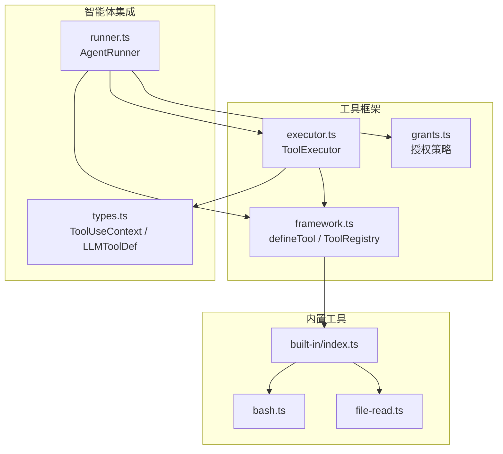
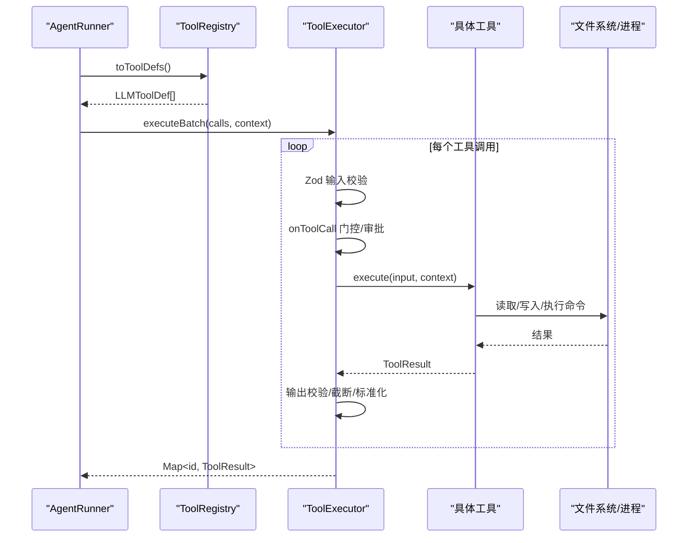
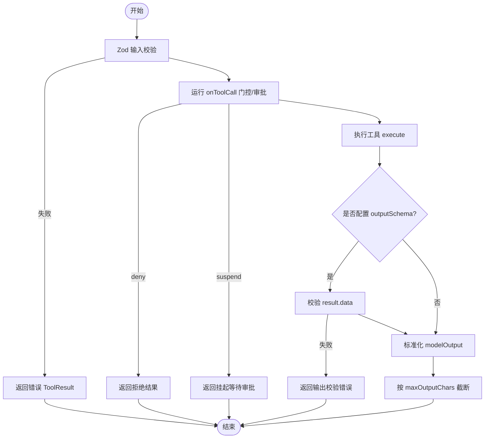
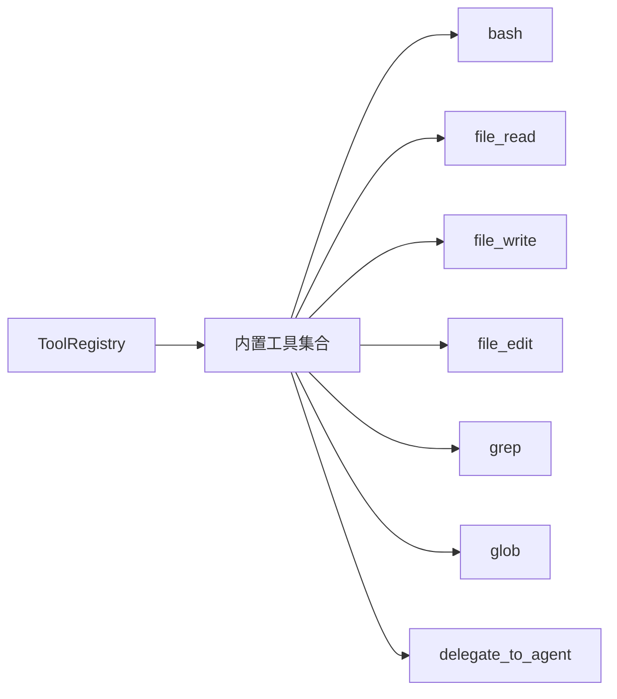
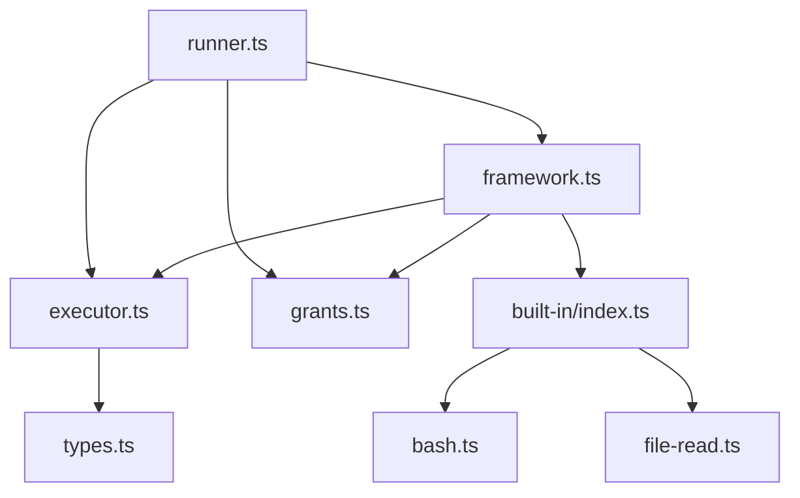

# 工具系统

<cite>
**本文引用的文件**
- [framework.ts](file://packages/core/src/tool/framework.ts)
- [executor.ts](file://packages/core/src/tool/executor.ts)
- [grants.ts](file://packages/core/src/tool/grants.ts)
- [built-in/index.ts](file://packages/core/src/tool/built-in/index.ts)
- [bash.ts](file://packages/core/src/tool/built-in/bash.ts)
- [file-read.ts](file://packages/core/src/tool/built-in/file-read.ts)
- [runner.ts](file://packages/core/src/agent/runner.ts)
- [types.ts](file://packages/core/src/types.ts)
</cite>

## 目录
1. [简介](#简介)
2. [项目结构](#项目结构)
3. [核心组件](#核心组件)
4. [架构总览](#架构总览)
5. [详细组件分析](#详细组件分析)
6. [依赖关系分析](#依赖关系分析)
7. [性能考虑](#性能考虑)
8. [故障排查指南](#故障排查指南)
9. [结论](#结论)
10. [附录](#附录)

## 简介
本文件全面介绍 Open Multi-Agent 的工具系统，涵盖 defineTool 的用法、输入输出验证、错误处理与异步支持；内置工具集（文件系统操作、网络请求、进程执行等）的功能与使用方式；安全沙箱机制、权限控制与审计日志；自定义工具开发指南（注册、参数校验、结果处理）；以及工具调用的最佳实践、性能优化建议与智能体集成模式。

## 项目结构
Open Multi-Agent 的工具系统位于 packages/core/src/tool 目录下，核心由“定义框架 + 执行器 + 授权策略 + 内置工具”组成：
- 定义框架：defineTool、ToolRegistry、zodToJsonSchema
- 执行器：ToolExecutor（并发控制、输入/输出校验、门控审批、截断）
- 授权策略：TOOL_PRESETS、resolveGrantedToolDefinitions
- 内置工具：bash、file_read/write/edit、grep、glob、delegate_to_agent
- 智能体集成：AgentRunner 在每次 LLM 调用前解析可用工具并构建 ToolUseContext



图表来源
- [framework.ts:71-117](file://packages/core/src/tool/framework.ts#L71-L117)
- [executor.ts:85-164](file://packages/core/src/tool/executor.ts#L85-L164)
- [grants.ts:10-89](file://packages/core/src/tool/grants.ts#L10-L89)
- [built-in/index.ts:37-74](file://packages/core/src/tool/built-in/index.ts#L37-L74)
- [runner.ts:902-912](file://packages/core/src/agent/runner.ts#L902-L912)
- [types.ts:511-547](file://packages/core/src/types.ts#L511-L547)

章节来源
- [framework.ts:71-117](file://packages/core/src/tool/framework.ts#L71-L117)
- [executor.ts:85-164](file://packages/core/src/tool/executor.ts#L85-L164)
- [grants.ts:10-89](file://packages/core/src/tool/grants.ts#L10-L89)
- [built-in/index.ts:37-74](file://packages/core/src/tool/built-in/index.ts#L37-L74)
- [runner.ts:902-912](file://packages/core/src/agent/runner.ts#L902-L912)
- [types.ts:511-547](file://packages/core/src/types.ts#L511-L547)

## 核心组件
- defineTool：声明式定义工具，包含 name、description、inputSchema、可选 outputSchema、consequential、maxOutputChars、llmInputSchema 与 execute 函数。返回 ToolDefinition，供注册与转换。
- ToolRegistry：维护工具集合，提供 toToolDefs/toLLMTools 将工具转换为 LLM 所需的 JSON Schema 描述；支持运行时动态添加/移除。
- ToolExecutor：执行入口，负责 Zod 输入校验、可选输出校验、并发限制、门控审批（onToolCall）、可恢复审批（durable approval）、异常捕获与结果标准化、输出截断。
- 授权策略：TOOL_PRESETS（readonly/readwrite/full）与 resolveGrantedToolDefinitions，用于按预设或白名单/黑名单过滤可用工具。
- 内置工具：bash（命令执行）、file_read/write/edit（文件读写编辑）、grep/glob（文本搜索与匹配）、delegate_to_agent（团队委派）。
- 智能体集成：AgentRunner 在每轮 LLM 调用前解析 granted tools，构建 ToolUseContext（含 agent、team、cwd、abortSignal、credentials 等），并通过 ToolExecutor 执行。

章节来源
- [framework.ts:71-117](file://packages/core/src/tool/framework.ts#L71-L117)
- [framework.ts:127-261](file://packages/core/src/tool/framework.ts#L127-L261)
- [executor.ts:85-164](file://packages/core/src/tool/executor.ts#L85-L164)
- [grants.ts:10-89](file://packages/core/src/tool/grants.ts#L10-L89)
- [built-in/index.ts:37-74](file://packages/core/src/tool/built-in/index.ts#L37-L74)
- [runner.ts:1795-1811](file://packages/core/src/agent/runner.ts#L1795-L1811)

## 架构总览
工具系统的整体调用流程如下：
- AgentRunner 解析当前 agent 可用的工具定义（受 toolPreset/allowedTools/disallowedTools 影响），生成 LLMToolDef 列表发送给模型。
- 模型返回 tool_use 块后，AgentRunner 调用 ToolExecutor.executeBatch，对每个工具进行输入校验、门控审批、执行与输出校验。
- 工具执行期间通过 ToolUseContext 注入上下文（如 cwd、abortSignal、credentials），内置工具基于 cwd 实现路径沙箱。
- 所有错误被封装为 ToolResult（isError=true），以便回传给模型继续推理。



图表来源
- [runner.ts:902-912](file://packages/core/src/agent/runner.ts#L902-L912)
- [framework.ts:204-261](file://packages/core/src/tool/framework.ts#L204-L261)
- [executor.ts:148-164](file://packages/core/src/tool/executor.ts#L148-L164)
- [executor.ts:181-338](file://packages/core/src/tool/executor.ts#L181-L338)
- [bash.ts:37-79](file://packages/core/src/tool/built-in/bash.ts#L37-L79)
- [file-read.ts:17-111](file://packages/core/src/tool/built-in/file-read.ts#L17-L111)

## 详细组件分析

### defineTool 与 ToolRegistry
- defineTool 接受配置对象，返回 ToolDefinition。支持 consequential 标记高影响工具；outputSchema 用于结果校验；maxOutputChars 用于单工具输出截断；llmInputSchema 可绕过 Zod→JSON Schema 转换。
- ToolRegistry.register 防止同名覆盖；toToolDefs 将工具转为 LLM 所需描述；toRuntimeToolDefs 仅返回运行时新增工具；toLLMTools 适配 Anthropic 风格 input_schema。

```mermaid
classDiagram
class ToolDefinition {
+string name
+string description
+ZodSchema inputSchema
+ZodSchema? outputSchema
+boolean? consequential
+number? maxOutputChars
+Record~string, unknown~? llmInputSchema
+execute(input, context) Promise~ToolResult~
}
class ToolRegistry {
-Map~string, ToolDefinition~ tools
-Set~string~ runtimeToolNames
+register(tool, options?)
+get(name) ToolDefinition?
+list() ToolDefinition[]
+unregister(name)
+toToolDefs() LLMToolDef[]
+toRuntimeToolDefs() LLMToolDef[]
+toLLMTools() {name, description, input_schema}[]
}
ToolRegistry --> ToolDefinition : "持有/转换"
```

图表来源
- [framework.ts:71-117](file://packages/core/src/tool/framework.ts#L71-L117)
- [framework.ts:127-261](file://packages/core/src/tool/framework.ts#L127-L261)

章节来源
- [framework.ts:71-117](file://packages/core/src/tool/framework.ts#L71-L117)
- [framework.ts:127-261](file://packages/core/src/tool/framework.ts#L127-L261)

### ToolExecutor 执行流程与错误处理
- 输入校验：使用工具 inputSchema 进行 Zod 校验，失败返回结构化错误信息。
- 门控审批：支持 onToolCall 钩子，允许 allow/deny/suspend；支持持久化审批（checkpoint 恢复时校验一致性）。
- 执行与输出校验：调用工具 execute，若未设置 modelOutput 且 data 非字符串则报错；可选 outputSchema 校验成功数据。
- 截断与标准化：根据 per-tool 或 agent-level 最大字符数截断字符串型 data；统一 modelOutput 拷贝与类型约束。
- 并发控制：executeBatch 使用信号量限制并行度，避免资源争用。



图表来源
- [executor.ts:181-338](file://packages/core/src/tool/executor.ts#L181-L338)
- [executor.ts:340-379](file://packages/core/src/tool/executor.ts#L340-L379)
- [executor.ts:381-419](file://packages/core/src/tool/executor.ts#L381-L419)

章节来源
- [executor.ts:181-338](file://packages/core/src/tool/executor.ts#L181-L338)
- [executor.ts:340-379](file://packages/core/src/tool/executor.ts#L340-L379)
- [executor.ts:381-419](file://packages/core/src/tool/executor.ts#L381-L419)

### 内置工具集
- bash：执行 shell 命令，支持超时与自定义工作目录；环境变量白名单过滤；敏感信息脱敏；进程树清理；退出码规范化（超时/中止）。
- file_read：读取文件内容并按行号输出，支持 offset/limit 分页读取大文件；路径通过 cwd 沙箱校验。
- file_write/file_edit/grep/glob：文件写入/编辑、文本搜索与匹配，均受 cwd 沙箱保护。
- delegate_to_agent：团队编排中的代理委派工具（可按需启用）。



图表来源
- [built-in/index.ts:37-74](file://packages/core/src/tool/built-in/index.ts#L37-L74)
- [bash.ts:37-79](file://packages/core/src/tool/built-in/bash.ts#L37-L79)
- [file-read.ts:17-111](file://packages/core/src/tool/built-in/file-read.ts#L17-L111)

章节来源
- [built-in/index.ts:37-74](file://packages/core/src/tool/built-in/index.ts#L37-L74)
- [bash.ts:37-79](file://packages/core/src/tool/built-in/bash.ts#L37-L79)
- [file-read.ts:17-111](file://packages/core/src/tool/built-in/file-read.ts#L17-L111)

### 安全沙箱、权限控制与审计日志
- 路径沙箱：ToolUseContext.cwd 控制文件系统工具的根目录；绝对路径必须落在该目录内（包括符号链接），可通过 null 显式禁用。
- 权限控制：通过 TOOL_PRESETS 与 allowedTools/disallowedTools 精确授予工具；框架级 AGENT_FRAMEWORK_DISALLOWED 预留未来限制。
- 审计与追踪：
  - onToolCall 钩子可记录/审计每次工具调用（名称、输入、agent、runId/taskId/toolCallId 等）。
  - 持久化审批（durable approval）在 checkpoint 恢复时校验请求哈希，确保未被篡改。
  - AgentRunner 在执行前后记录 trace span（tool 类型），便于可观测性。

章节来源
- [types.ts:544-570](file://packages/core/src/types.ts#L544-L570)
- [grants.ts:10-89](file://packages/core/src/tool/grants.ts#L10-L89)
- [executor.ts:206-295](file://packages/core/src/tool/executor.ts#L206-L295)
- [runner.ts:1364-1395](file://packages/core/src/agent/runner.ts#L1364-L1395)

### 自定义工具开发指南
- 注册：使用 defineTool 创建工具，再通过 ToolRegistry.register 注册；支持运行时添加（runtimeAdded 标记）。
- 参数验证：使用 Zod 定义 inputSchema；如需更精细的 LLM 描述，可提供 llmInputSchema 覆盖。
- 结果处理：返回 ToolResult，包含 data、isError、可选 modelOutput；可配置 outputSchema 校验成功数据；必要时设置 maxOutputChars 控制截断。
- 异步支持：execute 为异步函数，可使用 AbortSignal 响应取消；长耗时任务应检查 abortSignal 或监听 abort 事件。
- 安全与权限：遵循 cwd 沙箱；对高影响工具设置 consequential=true，触发审批流。

章节来源
- [framework.ts:71-117](file://packages/core/src/tool/framework.ts#L71-L117)
- [framework.ts:127-222](file://packages/core/src/tool/framework.ts#L127-L222)
- [executor.ts:181-338](file://packages/core/src/tool/executor.ts#L181-L338)
- [types.ts:511-547](file://packages/core/src/types.ts#L511-L547)

### 工具与智能体的集成方式与调用模式
- 工具解析：AgentRunner 在每轮 LLM 调用前调用 resolveTools（内部使用 resolveGrantedToolDefinitions）生成 grantedToolNames，作为唯一可信的执行白名单。
- 上下文注入：buildToolContext 构造 ToolUseContext，包含 agent、team、cwd、abortSignal、credentials、runId/taskId/toolCallId 等。
- 调用模式：
  - 单次调用：execute(toolName, input, context)
  - 批量并行：executeBatch(calls, context)，受并发限制保护
  - 审批流：onToolCall 支持 deny/suspend；durable approval 支持跨 checkpoint 恢复

章节来源
- [runner.ts:902-912](file://packages/core/src/agent/runner.ts#L902-L912)
- [runner.ts:1795-1811](file://packages/core/src/agent/runner.ts#L1795-L1811)
- [executor.ts:112-164](file://packages/core/src/tool/executor.ts#L112-L164)
- [executor.ts:206-295](file://packages/core/src/tool/executor.ts#L206-L295)

## 依赖关系分析
- framework.ts 提供 defineTool 与 ToolRegistry，被 executor.ts 与 built-in 工具引用。
- executor.ts 依赖 framework.ts 的工具定义与 types.ts 的类型；同时依赖 utils/semaphore 控制并发。
- grants.ts 依赖 framework.ts 的 ToolRegistry 与 types.ts 的 ToolDefinition。
- built-in 工具依赖 framework.ts 的 defineTool 与 path-safety 的路径校验。
- runner.ts 依赖 framework.ts、executor.ts、grants.ts 完成工具解析与执行。



图表来源
- [framework.ts:71-261](file://packages/core/src/tool/framework.ts#L71-L261)
- [executor.ts:13-32](file://packages/core/src/tool/executor.ts#L13-L32)
- [grants.ts:7-8](file://packages/core/src/tool/grants.ts#L7-L8)
- [built-in/index.ts:8-18](file://packages/core/src/tool/built-in/index.ts#L8-L18)
- [runner.ts:902-912](file://packages/core/src/agent/runner.ts#L902-L912)

章节来源
- [framework.ts:71-261](file://packages/core/src/tool/framework.ts#L71-L261)
- [executor.ts:13-32](file://packages/core/src/tool/executor.ts#L13-L32)
- [grants.ts:7-8](file://packages/core/src/tool/grants.ts#L7-L8)
- [built-in/index.ts:8-18](file://packages/core/src/tool/built-in/index.ts#L8-L18)
- [runner.ts:902-912](file://packages/core/src/agent/runner.ts#L902-L912)

## 性能考虑
- 并发控制：ToolExecutor 默认最大并发为 4，可根据 I/O 特性调整以平衡吞吐与资源占用。
- 输出截断：合理设置 maxOutputChars（per-tool 或 agent-level），避免超长输出阻塞上下文窗口。
- 输入校验：Zod 校验在门控之前执行，减少无效调用开销；复杂 schema 可拆分或延迟解析。
- 进程管理：bash 工具使用进程树清理与超时/中止，避免僵尸进程与资源泄漏。
- 批处理：优先使用 executeBatch 并行执行独立工具调用，提升整体吞吐。

[本节为通用指导，不直接分析具体文件]

## 故障排查指南
- 工具未注册：ToolExecutor 会返回明确错误信息，确认 ToolRegistry 是否正确注册。
- 输入校验失败：查看 Zod issuesMessage，修正传入参数类型或必填字段。
- 输出校验失败：检查 outputSchema 与返回数据结构，确保 modelOutput 与 data 类型一致。
- 门控拒绝：onToolCall 返回 deny 或 suspend，检查策略配置与审批状态。
- 路径越界：file_* 工具因 cwd 沙箱拒绝访问外部路径，调整 cwd 或路径。
- 进程超时/中止：bash 工具超时返回特定退出码，检查命令耗时与超时阈值。

章节来源
- [executor.ts:112-133](file://packages/core/src/tool/executor.ts#L112-L133)
- [executor.ts:181-238](file://packages/core/src/tool/executor.ts#L181-L238)
- [executor.ts:313-338](file://packages/core/src/tool/executor.ts#L313-L338)
- [bash.ts:137-195](file://packages/core/src/tool/built-in/bash.ts#L137-L195)
- [file-read.ts:47-64](file://packages/core/src/tool/built-in/file-read.ts#L47-L64)

## 结论
Open Multi-Agent 的工具系统通过 defineTool 与 ToolRegistry 提供声明式工具定义能力，借助 ToolExecutor 实现强类型输入/输出校验、并发控制、门控审批与错误隔离；内置工具覆盖常见文件系统与进程操作，并通过 cwd 沙箱保障安全；AgentRunner 将工具与智能体深度集成，支持批量并行与可恢复审批。遵循本文的最佳实践与性能建议，可在保证安全与可控的前提下高效扩展与使用工具。

## 附录
- 常用配置项参考：
  - ToolExecutorOptions：maxConcurrency、maxToolOutputChars、onToolCall
  - ToolGrantOptions：toolPreset、allowedTools、disallowedTools
  - ToolUseContext：agent、team、cwd、abortSignal、credentials、runId、taskId、toolCallId

章节来源
- [executor.ts:38-65](file://packages/core/src/tool/executor.ts#L38-L65)
- [grants.ts:22-31](file://packages/core/src/tool/grants.ts#L22-L31)
- [types.ts:511-570](file://packages/core/src/types.ts#L511-L570)